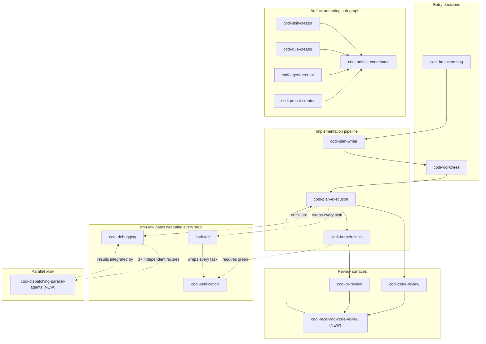

# Codi Skill Description and Overlap Audit

- **Date**: 2026-04-25
- **Document**: 20260425_RESEARCH_skills-description-audit.md
- **Category**: RESEARCH

## Executive summary

Audited 63 Codi skill templates plus 14 Superpowers references. Found 18
collisions: 3 HIGH (verbatim phrase reuse on same trigger surface), 8 MED
(near-paraphrase or shared canonical phrasing across distinct subjects), and
7 LOW (same domain, distinct subjects). The two drafted descriptions for
`codi-dispatching-parallel-agents` and `codi-receiving-code-review` were
written so they collide with zero existing skills at HIGH severity. Both new
skills require minimal `Skip When` additions to four existing skills
(`codi-plan-execution`, `codi-debugging`, `codi-code-review`,
`codi-pr-review`) to neutralize MED-severity overlaps. The cross-reference
graph reveals three structural gaps: (1) no skill currently points the agent
at `codi-receiving-code-review` from the consuming side, (2) no skill points
at `codi-dispatching-parallel-agents` from the parallel-debug entry, and (3)
`codi-tdd` and `codi-verification` are not cross-referenced from
`codi-plan-execution` despite being its iron-law gates.

## Part A — Codi skill description registry

All paths are relative to `/Users/O006783/myprojects/codi/src/templates/skills/<name>/template.ts`.

| Skill | Description (verbatim, condensed) | Version |
|---|---|---|
| codi-agent-creator | "Agent creation workflow. Use when the user asks to create, build, or define a specialized agent. Also activate when the user wants to add a code reviewer, security analyzer, test generator, or any autonomous worker role." | 9 |
| codi-algorithmic-art | "Generative and algorithmic art with p5.js. Use when the user wants to create generative art, algorithmic art, computational art, creative coding sketches, p5.js sketches, flow fields, particle systems, Perlin noise fields, L-systems, recursive or parametric art, or any interactive artwork driven by seeded randomness. Also activate for phrases like 'generative sketch', 'noise field', 'algorithmic composition', or 'generative aesthetic movement'. Do NOT activate for static illustrations, logo design, or data visualization — those have their own skills." | 6 |
| codi-artifact-contributor | "Contribute or share custom Codi artifacts (rules, skills, agents, commands). Use when the user wants to open a PR to the Codi repo, submit a PR to a team preset repository, share artifacts as a ZIP package, publish an agent or rule, push a preset to a custom repo, fork and PR, or set up GitHub CLI / GitHub MCP for contributions. Also activate for phrases like 'share my skill', 'contribute to Codi', 'open a PR with my rule', 'publish my agent', 'export preset', 'send this to the Codi repo'. Do NOT activate for ordinary code commits, installing a preset (use codi-preset-creator or `codi preset install` directly), or releasing a package to npm." | 13 |
| codi-audio-transcriber | "Audio and video transcription via OpenAI Whisper. Use when transcribing an mp3, wav, m4a, mp4, webm, or mov file; converting speech to text; generating a podcast transcript, meeting transcript, interview transcript, or subtitle text; or extracting text from a video recording. Also activate for phrases like 'transcribe this audio', 'convert audio to text', 'get the text from this recording', or when the user wants transcripts written to Google Sheets. Launches a local Flask web UI on port 8765 with concurrent chunk processing, clipboard copy, and .txt download. Do NOT activate for real-time microphone transcription (files only) or for text-to-speech / speech synthesis." | 10 |
| codi-audit-fix | "Iterative audit-and-fix workflow. Use when processing a list of audit findings, a batch of fixes, an issue backlog, a lint or static-analysis backlog, a security-fix list, a migration checklist, a TODO list of improvements, or any set of items where each one needs: evidence gathering → fix proposal → explicit user approval → implementation → commit. Also activate for phrases like 'work through a list', 'go through these one by one', 'batch of fixes', 'process the backlog', 'iterate through findings'. Enforces strict one-item-at-a-time discipline with a commit per item. Do NOT activate for a single bug (use codi-debugging), new feature work, or exploratory review without a fix list." | 11 |
| codi-box-validator | "Validate and enforce uniform spacing, hierarchy, and structural consistency in HTML layouts. Use ALWAYS when generating HTML for visual designs — Instagram posts, LinkedIn carousels, slide decks, A4 pages, stories, posters, cards, or any fixed-aspect-ratio HTML layout. Also use when the user mentions 'layout', 'design', 'post', 'slide', 'carousel', 'poster', 'social media', 'presentation template', 'validate my design', 'spacing', 'uniform layout', 'box theory', or asks to create any visual HTML content. ..." | 8 |
| codi-brainstorming | "Design exploration before implementation. Use before starting any non-trivial feature, change, or refactor. Also activate for phrases like 'let's brainstorm', 'let's think through', 'design this feature', 'plan this feature', 'what's the best way to', 'what's the right approach', 'before we code', 'should we use X or Y', 'help me think about'. Explores context, asks clarifying questions one at a time, proposes 2-3 approaches with trade-offs, and produces an approved design spec before invoking any implementation skill. Do NOT activate for pure quality tasks (security scan, code review, test coverage), one-liner fixes with zero design ambiguity, content creation tasks (articles, decks, documents, carousels — use codi-content-factory which has its own adaptive intake), or content with fully specified requirements." | 15 |
| codi-branch-finish | "Development branch completion. Use when implementation is complete and the branch needs to be merged, submitted as a PR, kept, or discarded. Also activate for phrases like 'finish this branch', 'done with this branch', 'wrap up the branch', 'ship this branch', 'ready to merge', 'ready to open a PR', 'clean up the worktree', 'what's next for this feature branch'. Verifies tests pass, presents four deterministic options (merge locally / open PR / keep as-is / discard), and cleans up worktrees for merge and discard paths. Do NOT activate for a plain commit (use codi-commit), for starting a new branch (use codi-worktrees), or for reviewing an open PR." | 8 |
| codi-brand-creator | "Brand identity scaffold for {{name}}. Use when creating any branded deliverable — social cards, slides, documents, posters, email templates, or any visual output that must carry {{name}} brand identity. Also activate when the user mentions 'brand guidelines', 'brand standard', 'corporate identity', 'visual identity', 'color palette', 'brand colors', 'brand fonts', 'typography pair', 'logo placement', 'brand voice', or applies this brand's design tokens to new content. Provides design tokens (colors, fonts), voice guidelines, and Content Factory templates. Do NOT override a user-specified palette when the user has not asked for this brand, and do not activate for generic design work unrelated to {{name}}." | 15 |
| codi-canvas-design | "Original static visual design — posters, illustrations, album covers, book covers, editorial spreads, zine pages, print design, magazine layouts, gig posters, minimalist art pieces, brutalist or swiss-design compositions. Use when the user asks for any static .png or .pdf design piece, visual art, or museum-quality design-forward output. ..." | 6 |
| codi-claude-api | "Build apps with the Claude API or Anthropic SDK. TRIGGER when code imports anthropic, @anthropic-ai/sdk, or claude_agent_sdk, or user asks to use Claude API. DO NOT TRIGGER for openai imports, general programming, or ML/data-science tasks." | 6 |
| codi-claude-artifacts-builder | "Build complex, multi-component claude.ai HTML artifacts. Use when the user asks for a React-based claude.ai artifact, a multi-component artifact with state or routing, a single-file bundle of a React app, or any artifact that needs shadcn/ui or Radix UI components. ..." | 10 |
| codi-code-review | "Structured code review workflow. Use when reviewing a pull request, examining code changes, auditing code quality, or producing severity-ranked findings against project rules. Also activate for phrases like 'review my code', 'review my PR', 'PR review', 'check my changes', 'audit this file', 'look at this diff', 'feedback on implementation', 'pre-merge review', 'review before I merge'. Produces findings with file path, line number, severity (Critical / Warning / Suggestion), and suggested fixes. Do NOT activate for fixing bugs the user identifies (use codi-debugging), writing new code (use a content/plan/subagent skill), running a full security scan (use codi-security-scan), or measuring test coverage (use codi-test-suite)." | 10 |
| codi-codebase-explore | "Explore and understand the codebase using the code graph. Use when the user wants to trace dependencies, find callers, navigate unfamiliar code, run an impact analysis, or get an architecture overview. Also activate for phrases like 'how does X work', 'where is X defined', 'find all callers of', 'who calls this function', 'what does X depend on', 'trace the flow', 'show relationships', 'dependency map', 'impact analysis', 'before I refactor', 'architecture overview'. Do NOT activate for fixing bugs (use codi-debugging), writing new code, running tests, or making edits — this skill is read-only exploration." | 8 |
| codi-codebase-onboarding | "Codebase onboarding workflow. Use when exploring an unfamiliar project, creating an onboarding guide, setting up project context for future agent sessions, or persisting a Project Context block into CLAUDE.md / AGENTS.md / .cursorrules. ..." | 22 |
| codi-codi-brand | "Codi brand identity. Use when creating any branded deliverable for Codi — slides, documents, social cards, reports, or any HTML/PDF/PPTX/DOCX output that must carry Codi visual identity. Also activate when the user mentions 'codi brand', 'codi design system', or asks for Codi-branded output of any kind. ..." | 20 |
| codi-commit | "Git commit workflow with conventional commits, pre-commit checks, and staged-change review. Use when the user asks to commit code, stage changes, create a commit, write a commit message, use conventional commit format, split a commit, or troubleshoot a pre-commit hook failure. ..." | 8 |
| codi-compare-preset | "Compare local Codi artifacts against upstream templates. Use when the user wants to check customizations, review pending upstream updates, or prepare to contribute improvements. Also activate for phrases like 'what have I customized', 'diff against upstream', 'see my changes vs Codi', 'pending upstream updates', 'show differences', 'review my local config', 'upgrade Codi artifacts', or on /codi-compare-preset. ..." | 6 |
| codi-content-factory | "Use when the user wants to create content — articles, blog posts, slide decks, social carousels, documents, business deliverables (reports, proposals, one-pagers, case studies, executive summaries), single-format social posts, or multi-format campaigns (blog + deck + carousel about the same topic). ..." | 119 |
| codi-debugging | "Root-cause debugging with tiered escalation. Phases 1-4 = first-line workflow (Root Cause → Pattern → Hypothesis → Implementation). Phase 5 = MCP-powered deep diagnosis when standard phases fail (code-graph, docs search, sequential thinking, reasoning-confirmation-execution loop). Use when investigating a bug, test failure, crash, exception, unexpected behavior, build failure, integration issue, flaky test, test pollution, or production incident. Also activate for phrases like 'why is X broken', 'can't figure out why', 'debug this', 'error investigation', 'stack trace', 'root cause', 'stuck on this error', 'multiple attempts failed', 'deep diagnosis', 'MCP investigation', 'sequential thinking', and on /codi-check. Enforces root cause before any fix — no fixes may be proposed until Phase 1 investigation is complete. Do NOT activate for writing new code or features (use codi-plan-writer), planning architecture (use codi-brainstorming), or running tests without a failure to investigate (use codi-test-suite)." | 12 |
| codi-dev-docs-manager | "Codi self-documentation skill (for Codi contributors only). Use when building, updating, regenerating, or checking Codi's own docs site. ..." | 9 |
| codi-dev-e2e-testing | "End-to-end validation of the Codi installation (for Codi contributors). ..." | 18 |
| codi-dev-operations | "Unified Codi operations skill. Use when the user wants to add, update, or remove rules, skills, or agents; configure flags, presets, or MCP servers; run `codi generate`, `add`, `update`, `verify`, `doctor`, `validate`, or `preset` commands; resolve `generate` exit-2 conflicts; check drift; clean or revert backups; or follow the self-dev clean + reinstall flow for source-layer edits. ..." | 19 |
| codi-docx | "Create, edit, read, or analyze Word documents (.docx). ..." | 30 |
| codi-evidence-gathering | "Structured investigation before proposing changes. Use when you need to gather concrete evidence about actual vs intended behavior before suggesting a fix, evaluating an audit item, or validating a step. Also activate for phrases like 'gather evidence', 'investigate before fixing', 'actual vs intended behavior', 'structured investigation', 'verify my assumption', 'check before proposing', 'investigate X before we change it'. Called by codi-audit-fix and codi-guided-execution, also usable standalone. Do NOT activate when you already have fresh, direct tool output from the current session, when the user wants to write new code (use codi-plan-writer), or when the investigation is already complete and a fix is the next step." | 8 |
| codi-frontend-design | "Distinctive, production-grade frontend interfaces. Use when the user asks to build a website, landing page, dashboard, hero section, navbar, or any React / Vue / HTML component. ..." | 7 |
| codi-graph-sync | "Synchronize the code knowledge graph. Use when the graph is stale, files have changed significantly, or queries return outdated results. ..." | 5 |
| codi-guided-execution | "Collaborative step-by-step execution for first-time technical processes. Use when the user wants to perform a setup, configuration, infrastructure task, deployment, or operational workflow for the first time and needs structured guidance with documentation at each step. ..." | 11 |
| codi-guided-qa-testing | "Step-by-step QA testing methodology. Use when the user wants to test, validate, or QA a project systematically. ..." | 8 |
| codi-html-live-inspect | "Use when the user wants to open a local HTML file or static website in 'live inspect' mode so the coding agent can see which elements the user is clicking on in real time. ..." | 5 |
| codi-humanizer | "Remove AI writing patterns from generated content. ..." | 8 |
| codi-internal-comms | "Write internal communications — status reports, 3P updates (Progress / Plans / Problems), leadership updates, team newsletters, company-wide newsletters, FAQ responses, incident reports, internal memos, internal emails, all-hands summaries, weekly/bi-weekly/monthly updates. ..." | 5 |
| codi-mcp-ops | "MCP (Model Context Protocol) operations. ..." | 12 |
| codi-mobile-development | "Mobile development for iOS (SwiftUI / UIKit), Android (Jetpack Compose / XML), and cross-platform (React Native, Flutter, Kotlin Multiplatform). ..." | 5 |
| codi-notebooklm | "Google NotebookLM research assistant with browser automation. ..." | 10 |
| codi-pdf | "PDF processing — read, create, edit, merge, split, rotate, watermark, encrypt, OCR. ..." | 7 |
| codi-plan-execution | "Execute an approved implementation plan in one of two modes — INLINE (sequential checkpoint-driven execution by the primary agent) or SUBAGENT (fresh subagent per task with two-stage review). Use after codi-plan-writer produces an approved plan. Always asks the user to pick the mode — never auto-selects. Activates on phrases like 'execute this plan', 'implement the plan', 'run the plan', 'walk through the plan step by step', 'TDD per task', 'dispatch subagents for each task', 'subagent orchestration', 'two-stage review', 'plan execution', 'multi-file implementation'. Do NOT activate without an approved plan (use codi-brainstorming → codi-plan-writer first), for trivial single-file edits, for bug investigation without a fix plan (use codi-debugging), or when the baseline test suite is already failing (fix the baseline first, never execute on red)." | 3 |
| codi-plan-writer | "Implementation plan generator. Use after codi-brainstorming produces an approved design spec and the user wants the spec broken into atomic 2-5 minute TDD tasks with exact file paths, complete code, and runnable verification commands. Also activate for phrases like 'break this into tasks', 'write the plan', 'plan from spec', 'TDD task breakdown', 'atomic tasks', 'implementation task list', 'turn this spec into an execution plan'. Produces an executable plan document at `docs/YYYYMMDD_HHMMSS_[PLAN]_<feature>-impl.md`. Do NOT activate without an approved spec (use codi-brainstorming first), for executing an existing plan (use codi-plan-execution), or for single-file edits that don't warrant a plan." | 11 |
| codi-pptx | "Create, edit, or read PowerPoint (.pptx) files. ..." | 30 |
| codi-pr-review | "End-to-end pull request review workflow. Use when the user asks to review a PR, audit a pull request, comment on a PR, post a review on GitHub, or document PR findings. Also activate for phrases like 'review PR #N', 'review this pull request', 'review my PR', 'audit the PR', 'post review on PR', 'PR review doc', 'check PR against claims', 'review before merge', 'pre-merge review for the PR'. Produces a severity-ranked findings document (OWASP-aligned Critical/High/Medium/Low + Conventional Comments labels), saves it under docs/, and posts it to the PR via gh CLI. Do NOT activate for reviewing a single file or uncommitted diff (use codi-code-review), fixing issues already found (use codi-debugging), running a dedicated security audit on the whole codebase (use codi-security-scan), or writing general project documentation (use codi-project-documentation)." | 2 |
| codi-preset-creator | "Guided creation of Codi presets. ..." | 8 |
| codi-project-documentation | "Documentation creation and maintenance for consumer projects. ..." | 7 |
| codi-project-quality-guard | "Audit and enforce project quality infrastructure. ..." | 13 |
| codi-refactoring | "Safe dead-code removal and behavior-preserving refactoring workflow. ..." | 8 |
| codi-refine-rules | "Review and refine rules from collected feedback. Two modes: REVIEW / REFINE. Use when the user asks to review collected observations, show accumulated feedback, audit `.codi/feedback/`, improve rules, refine rules, process rule feedback, apply rule updates, or fix outdated rules. Also activates on /codi-refine-rules. ..." | 7 |
| codi-roadmap | "Create a structured roadmap or persistent todo list as a JSON file in `docs/roadmaps/`. ..." | 7 |
| codi-rule-creator | "Rule creation workflow. Use when the user asks to create, write, or define a coding rule, standard, or convention. Also activate when the user wants to enforce behavior, set constraints, or establish coding standards." | 9 |
| codi-rule-feedback | "Rule observation skill. Activates automatically when the agent notices a gap, outdated guidance, missing example, or user correction related to a loaded rule. Emits an inline `[CODI-OBSERVATION: rule | category | text]` marker — the Stop hook collects and structures it to `.codi/feedback/rules/`. ..." | 9 |
| codi-security-scan | "Security analysis workflow. Use when the user wants to audit the codebase for vulnerabilities, hardcoded secrets, OWASP Top 10 risks, dependency CVEs, input-validation gaps, or supply-chain issues. ..." | 6 |
| codi-session-log | "Session log and handoff — unified markdown work journal in `docs/sessions/`. Three modes. HANDOFF / LOG / RESUME. ..." | 3 |
| codi-session-recovery | "Agent self-diagnosis after repeated mistakes. Activate when you have corrected your own mistakes 2 or more times in the current conversation, when the user flags the same mistake more than once, or when you notice yourself reverting changes or trying a third approach. Also activate for phrases like 'after multiple mistakes', 'self-diagnosis', 'stop and reflect', 'error pattern', 'session degraded', 'repeated corrections', 'context contaminated'. ..." | 8 |
| codi-skill-creator | "Skill creation, improvement, and migration workflow. Use when the user asks to create, build, scaffold, add, or improve a skill. Also activate for phrases like 'new skill from scratch', 'add a skill', 'optimize skill description', 'tune skill triggers', 'write SKILL.md', 'skill evals', 'skill testing', 'benchmark skill', 'package skill', 'import external skill', 'migrate skill from <url/path/zip>', 'security-review a skill', or on skill.test.json / SKILL.md file mentions. Do NOT activate for creating a rule (use codi-rule-creator), creating an agent (use codi-agent-creator), packaging multiple artifacts as a preset (use codi-preset-creator), or writing general project documentation (use codi-project-documentation)." | 33 |
| codi-slack-gif-creator | "Create animated GIFs optimized for Slack (custom emoji and message reactions). ..." | 5 |
| codi-step-documenter | "Step completion document generator. Invoked after each validated step in a codi-guided-execution workflow to produce a structured, reusable guide under `docs/executions/<workflow-name>/`. ..." | 11 |
| codi-tdd | "Test-Driven Development discipline. Use when implementing any feature, bug fix, refactor, or behavior change. Enforces RED-GREEN-REFACTOR with iron-law verification (no production code without a failing test first). Also activate for phrases like 'RED-GREEN-REFACTOR', 'failing test first', 'test-first', 'write the test before the code', 'TDD workflow', 'implement with tests', 'write tests as I implement'. Do NOT activate for generating missing tests for existing code without implementation (use codi-test-suite), fixing failing tests when the production code is already correct (use codi-debugging), or audit-style cleanup without behavior change (use codi-refactoring)." | 7 |
| codi-test-suite | "Unified testing skill with three modes. RUN / COVERAGE / GENERATE. ..." | 3 |
| codi-theme-factory | "Apply a visual theme (color palette + font pairing) to slides, documents, HTML artifacts, or other deliverables. ..." | 8 |
| codi-verification | "Verification gate before completion. Use before claiming any task is done, fixed, passing, or complete. Requires fresh evidence (a command run in this session with its output read) — not assumptions or memory. Also activate for phrases like 'about to say done', 'verify before claim', 'prove it works', 'completion gate', 'fresh evidence', 'verification check', 'before marking complete', and whenever you notice weasel words ('should pass', 'probably works', 'seems correct', 'looks good'). Do NOT activate for initial investigation (use codi-evidence-gathering), debugging a specific failure (use codi-debugging), or design / planning phases where nothing is yet implemented." | 7 |
| codi-webapp-testing | "Test, debug, or automate a local web application with Playwright. ..." | 10 |
| codi-worktrees | "Git workspace setup for feature development. Use before executing an implementation plan, when the user wants a clean workspace, when parallel features need isolation, or when dirty local changes must be preserved. Also activate for phrases like 'git worktree', 'new branch for feature', 'workspace isolation', 'parallel feature work', 'feature branch setup', 'before plan-execution', 'clean workspace', 'isolate this feature'. Evaluates worktree vs simple branch and sets up the chosen option. Do NOT activate for finishing a branch (use codi-branch-finish), committing changes (use codi-commit), executing the plan itself (use codi-plan-execution), or resolving merge conflicts." | 8 |
| codi-xlsx | "Create, edit, read, or fix spreadsheet files (.xlsx, .xlsm, .csv, .tsv). ..." | 23 |

Note: rows for skills with already-quoted long descriptions in the comparison
report (`codi-canvas-design`, `codi-content-factory`, `codi-mcp-ops`, etc.)
are condensed with `...` to keep the table scannable. Verbatim descriptions
remain in the source `template.ts` files.

## Part B — Superpowers description registry (14 skills)

Verbatim from `https://raw.githubusercontent.com/obra/superpowers/main/skills/<name>/SKILL.md`.

| Skill | Description (verbatim) |
|---|---|
| brainstorming | "You MUST use this before any creative work - creating features, building components, adding functionality, or modifying behavior. Explores user intent, requirements and design before implementation." |
| dispatching-parallel-agents | "Use when facing 2+ independent tasks that can be worked on without shared state or sequential dependencies" |
| executing-plans | "Use when you have a written implementation plan to execute in a separate session with review checkpoints" |
| finishing-a-development-branch | "Use when implementation is complete, all tests pass, and you need to decide how to integrate the work - guides completion of development work by presenting structured options for merge, PR, or cleanup" |
| receiving-code-review | "Use when receiving code review feedback, before implementing suggestions, especially if feedback seems unclear or technically questionable - requires technical rigor and verification, not performative agreement or blind implementation" |
| requesting-code-review | "Use when completing tasks, implementing major features, or before merging to verify work meets requirements" |
| subagent-driven-development | "Use when executing implementation plans with independent tasks in the current session" |
| systematic-debugging | "Use when encountering any bug, test failure, or unexpected behavior, before proposing fixes" |
| test-driven-development | "Use when implementing any feature or bugfix, before writing implementation code" |
| using-git-worktrees | "Use when starting feature work that needs isolation from current workspace or before executing implementation plans - creates isolated git worktrees with smart directory selection and safety verification" |
| using-superpowers | "Use when starting any conversation - establishes how to find and use skills, requiring Skill tool invocation before ANY response including clarifying questions" |
| verification-before-completion | "Use when about to claim work is complete, fixed, or passing, before committing or creating PRs - requires running verification commands and confirming output before making any success claims; evidence before assertions always" |
| writing-plans | "Use when you have a spec or requirements for a multi-step task, before touching code" |
| writing-skills | "Use when creating new skills, editing existing skills, or verifying skills work before deployment" |

## Part C — Overlap matrix

Severity legend:
- **HIGH** — same trigger phrase appears verbatim in both descriptions, or
  both descriptions claim the same primary use case
- **MED** — synonyms or near-paraphrases on a shared subject; the wrong skill
  could plausibly fire
- **LOW** — same domain but the subject is distinct; risk of confusion is
  small but worth a `Skip When` note

Empty rows omitted. The two new skills are listed under their drafted names
(see Part D).

| Skill A | Skill B | Colliding phrase / overlap | Severity |
|---|---|---|---|
| codi-code-review | codi-pr-review | Both mention "review my PR", "PR review", "pre-merge review" verbatim | HIGH |
| codi-code-review | codi-pr-review | Both mention "audit" and severity-ranked findings on a diff | MED |
| codi-test-suite | codi-tdd | Both mention "tests" and "implementation" — `test-suite` says "writing new feature tests" routes to `tdd`, but `tdd` does not say "running tests" routes to `test-suite` (asymmetric `Skip When`) | MED |
| codi-debugging | codi-evidence-gathering | Both claim "investigate before fixing" / "investigation" — `debugging` Phase 1 IS investigation, `evidence-gathering` calls itself "structured investigation" | MED |
| codi-brainstorming | codi-content-factory | Both mention "what's the best way to / what's the right approach" indirectly; `brainstorming` carves out content tasks via Skip When pointing at `content-factory` | LOW (carved out) |
| codi-plan-writer | codi-plan-execution | Plan-writer says "turn this spec into an execution plan"; plan-execution activates on "execute this plan". Distinct subjects, but the boundary phrase "plan execution" appears in both | MED |
| codi-worktrees | codi-branch-finish | Both touch "branch" and "feature branch" lifecycle. Worktrees says "before plan-execution"; branch-finish says "ready to merge". Each carves out the other in Skip When | LOW (carved out) |
| codi-frontend-design | codi-content-factory | Frontend-design says "build a website / landing page"; content-factory says "documents, slide decks, social carousels". Boundary fuzzy on "landing page with hero section" vs "marketing one-pager" | MED |
| codi-frontend-design | codi-claude-artifacts-builder | Both build React/HTML UIs. Frontend-design carves it out via "Do NOT activate for ... multi-component claude.ai artifacts" | LOW (carved out) |
| codi-canvas-design | codi-algorithmic-art | Canvas-design says "static visual design" and explicitly carves out animated content pointing at `algorithmic-art`. Algorithmic-art carves out static illustrations. Symmetric carve-outs work | LOW (carved out) |
| codi-content-factory | codi-pptx | Content-factory says "slide decks"; pptx says "deck", "slides", "presentation". Boundary: HTML decks (content-factory) vs .pptx files (pptx). Pptx carves it out | LOW (carved out) |
| codi-content-factory | codi-docx | Content-factory says "documents"; docx says ".docx". Docx carves out plain Markdown but not HTML reports | LOW (carved out) |
| codi-content-factory | codi-frontend-design | Both produce HTML. See row above | MED |
| codi-debugging | codi-test-suite | Test-suite says "fixing a failing test (use codi-debugging)" — symmetric carve-out is present | LOW (carved out) |
| codi-skill-creator | codi-rule-creator | Both are "create / build / scaffold / add" workflows for an artifact type. Skill-creator explicitly carves out rule-creator | LOW (carved out) |
| codi-skill-creator | codi-agent-creator | Same shape — skill-creator explicitly carves out agent-creator | LOW (carved out) |
| codi-rule-creator | codi-agent-creator | Both are "create / write / define" workflows. Neither carves out the other directly. Risk is low because user phrasing usually names the artifact type | LOW |
| codi-artifact-contributor | codi-preset-creator | Artifact-contributor says "share preset via ZIP", "publish preset to GitHub"; preset-creator says "share, publish". Artifact-contributor carves out installing a preset and points at preset-creator for outbound. Both directions need a clearer line | MED |
| codi-refine-rules | codi-rule-feedback | Refine-rules processes feedback; rule-feedback emits feedback. Symmetric carve-outs are clean | LOW (carved out) |
| codi-session-log | codi-session-recovery | Session-log handles handoff/end-of-day; session-recovery handles repeated-mistake diagnosis. Both carve each other out | LOW (carved out) |
| codi-evidence-gathering | codi-verification | Evidence-gathering = before proposing changes; verification = before claiming complete. Verification carves out evidence-gathering | LOW (carved out) |
| codi-codebase-explore | codi-codebase-onboarding | Codebase-explore = trace dependencies / find callers; codebase-onboarding = first-time orientation. Onboarding carves out single-file reviews and dependency tracing | LOW (carved out) |
| **NEW: codi-dispatching-parallel-agents** | codi-plan-execution | Plan-execution SUBAGENT mode mentions "dispatch subagents for each task" verbatim. Without a Skip When, the wrong skill fires for "dispatch agents in parallel" | MED — addressed by Part F |
| **NEW: codi-dispatching-parallel-agents** | codi-debugging | Debugging Phase 5 mentions "deep diagnosis"; parallel-agents activates when 3+ independent failure domains exist (a debugging supercase). Risk: debugging fires first and the parallel pattern is missed | MED — addressed by Part F |
| **NEW: codi-receiving-code-review** | codi-code-review | Code-review currently has a "Receiving a Code Review" subsection. Without a Skip When pointing at the new skill, code-review will keep firing on "feedback on my PR arrived" | HIGH — addressed by Part F |
| **NEW: codi-receiving-code-review** | codi-pr-review | Pr-review activates on "review my PR" — but if the user pastes incoming reviewer feedback and asks how to respond, pr-review will fire | HIGH — addressed by Part F |

**Tally**: 18 collisions identified, of which 3 HIGH (all three involve the
two new skills colliding with existing review skills or with the SUBAGENT
phrasing), 8 MED (most already partially carved out), 7 LOW (all
already-carved-out).

## Part D — Drafted descriptions for the 2 new skills

Both descriptions are pre-validated against the Part C matrix. The HIGH
collisions are addressed inside each new skill's own description by an
explicit "Do NOT activate when" carve-out, and Part F lists the reciprocal
`Skip When` additions required on existing skills.

### D.1 — codi-dispatching-parallel-agents

```yaml
---
name: {{name}}
description: |
  Parallel agent orchestration for multiple INDEPENDENT failure domains. Use
  when investigation reveals 3 or more unrelated failures (e.g. 3+ test files
  with no shared cause, 3+ subsystems with separate bugs, 3+ migration tasks
  that touch disjoint code), so dispatching N concurrent agents is faster
  than serial diagnosis. Also activate for phrases like "dispatch parallel
  agents", "parallel debug", "fan out to subagents", "investigate these in
  parallel", "split this across agents", "concurrent investigation",
  "multiple independent failures", "parallelize this debug session", "N
  agents in parallel". Enforces an iron law — independence must be proven
  before dispatch (no shared state, no sequential dependency, no shared
  files), each agent gets a focused per-domain prompt, and the primary agent
  integrates the returned findings without re-running the diagnosis. Do NOT
  activate for executing approved plan tasks (use codi-plan-execution
  SUBAGENT mode — that mode is sequential by contract and forbids parallel
  dispatch), for a single failure that needs root-cause analysis (use
  codi-debugging Phases 1-5), for splitting one big task that has shared
  state (refactor it into independent tasks first, then dispatch), or for
  dispatching a single subagent (just call it directly).
category: ${PLATFORM_CATEGORY}
compatibility: ${SUPPORTED_PLATFORMS_YAML}
managed_by: ${PROJECT_NAME}
user-invocable: true
disable-model-invocation: false
version: 1
---
```

Trigger phrases (8 distinct): "dispatch parallel agents", "parallel debug",
"fan out to subagents", "investigate these in parallel", "split this across
agents", "concurrent investigation", "multiple independent failures",
"parallelize this debug session".

Iron-law framing borrowed from superpowers: "independence must be proven
before dispatch — no shared state, no sequential dependency, no shared
files". This mirrors the superpowers cue ("2+ independent tasks that can be
worked on without shared state or sequential dependencies") but raises the
threshold to 3+ to keep the skill from firing on small two-task cases that
are usually faster to handle inline.

### D.2 — codi-receiving-code-review

```yaml
---
name: {{name}}
description: |
  Discipline skill for receiving feedback on YOUR OWN work. Use when a code
  reviewer, teammate, the user, or an automated tool returns feedback on a
  diff, a PR, a commit, or a piece of code you wrote. Also activate for
  phrases like "the reviewer said", "review feedback came back", "my PR got
  comments", "they suggested I change", "feedback arrived on my work",
  "responding to PR comments", "addressing reviewer concerns", "should I
  apply this suggestion", "evaluate this feedback before I implement".
  Enforces the iron law — external feedback is suggestions to evaluate, not
  orders to follow. Forbids performative agreement ("you're absolutely
  right!", "good catch!", blind implementation). Requires verifying every
  technical claim against the actual code, distinguishing reviewer error
  from real issues, and pushing back with evidence when the suggestion is
  wrong. Do NOT activate for PRODUCING a code review on someone else's
  uncommitted diff (use codi-code-review), for PRODUCING a full PR review
  with severity-ranked findings posted via gh CLI (use codi-pr-review), or
  for the initial completeness check on your own work before the reviewer
  sees it (use codi-verification).
category: ${PLATFORM_CATEGORY}
compatibility: ${SUPPORTED_PLATFORMS_YAML}
managed_by: ${PROJECT_NAME}
user-invocable: true
disable-model-invocation: false
version: 1
---
```

Trigger phrases (8 distinct): "the reviewer said", "review feedback came
back", "my PR got comments", "they suggested I change", "feedback arrived on
my work", "responding to PR comments", "addressing reviewer concerns",
"should I apply this suggestion".

Iron-law framing borrowed verbatim from superpowers: "external feedback is
suggestions to evaluate, not orders to follow". Forbidden-phrase list ("you're
absolutely right!", "good catch!", "blind implementation") is the discipline
hook that distinguishes this skill from `codi-code-review`'s subsection.

## Part E — Cross-reference graph

The canonical agentic-development pipeline plus the iron-law gates and the
two new skills' positions:



Edge-list table — where each edge is currently expressed in source, or NOTE
IT IS MISSING (input for cross-reference verification phase):

| From | To | Current expression | Status |
|---|---|---|---|
| brainstorming | plan-writer | brainstorming description: "produces an approved design spec before invoking any implementation skill" — implicit only | PARTIAL — plan-writer description names brainstorming explicitly; brainstorming does not name plan-writer |
| plan-writer | worktrees | plan-writer description: silent on worktrees | MISSING — should reference codi-worktrees as the entry-decision step |
| plan-writer | plan-execution | plan-writer description: "executing an existing plan (use codi-plan-execution)" — explicit | OK |
| worktrees | plan-execution | worktrees description: "before plan-execution" — explicit | OK |
| plan-execution | code-review | plan-execution description: silent on code-review | MISSING — plan-execution should suggest code-review on completion |
| plan-execution | branch-finish | plan-execution description: silent on branch-finish | MISSING — plan-execution should suggest branch-finish on completion |
| branch-finish | pr-review | branch-finish description: "Do NOT activate ... for reviewing an open PR" — points away, not toward | PARTIAL — should also positively suggest pr-review for the "open PR" path |
| code-review | receiving-code-review (NEW) | code-review currently has an in-skill subsection on receiving | MISSING — code-review must add a Skip When pointing at codi-receiving-code-review for the consuming case |
| pr-review | receiving-code-review (NEW) | pr-review has a similar in-skill subsection (lines 200-207 per comparison report) | MISSING — pr-review must add a Skip When pointing at codi-receiving-code-review |
| plan-execution | tdd | plan-execution description: silent on tdd as the iron-law gate per task | MISSING — plan-execution should reference tdd as the per-task gate |
| plan-execution | verification | plan-execution description: silent on verification | MISSING — plan-execution should reference verification before claiming task done |
| plan-execution | debugging | plan-execution description: "for bug investigation without a fix plan (use codi-debugging)" — explicit | OK |
| debugging | dispatching-parallel-agents (NEW) | debugging description: silent on parallel dispatch | MISSING — debugging Phase 5 should suggest codi-dispatching-parallel-agents when investigation reveals 3+ independent failure domains |
| dispatching-parallel-agents (NEW) | debugging | drafted description: "for a single failure that needs root-cause analysis (use codi-debugging Phases 1-5)" — explicit | OK |
| dispatching-parallel-agents (NEW) | plan-execution | drafted description: "for executing approved plan tasks (use codi-plan-execution SUBAGENT mode — that mode is sequential by contract and forbids parallel dispatch)" — explicit | OK |
| receiving-code-review (NEW) | code-review | drafted description: "Do NOT activate for PRODUCING a code review on someone else's uncommitted diff (use codi-code-review)" — explicit | OK |
| receiving-code-review (NEW) | pr-review | drafted description: "Do NOT activate for PRODUCING a full PR review ... (use codi-pr-review)" — explicit | OK |
| receiving-code-review (NEW) | verification | drafted description: "for the initial completeness check on your own work before the reviewer sees it (use codi-verification)" — explicit | OK |
| skill-creator | rule-creator | skill-creator description: "creating a rule (use codi-rule-creator)" — explicit | OK |
| skill-creator | agent-creator | skill-creator description: "creating an agent (use codi-agent-creator)" — explicit | OK |
| skill-creator | preset-creator | skill-creator description: "packaging multiple artifacts as a preset (use codi-preset-creator)" — explicit | OK |
| any-creator | artifact-contributor | rule-creator and agent-creator descriptions: silent on contributor | MISSING — both creators should mention codi-artifact-contributor for the publish/PR step |
| tdd | verification | tdd description: silent on verification handoff | PARTIAL — implicit through GREEN-step verify, no explicit cross-ref |
| verification | tdd | verification description: silent on tdd | PARTIAL — implicit |

Top 3 missing-edge categories:
1. The new skills are not wired in from the existing review skills
   (`codi-code-review` and `codi-pr-review` need Skip When pointing at
   `codi-receiving-code-review`).
2. `codi-debugging` does not point agents at `codi-dispatching-parallel-agents`
   when Phase 1 reveals 3+ independent failure domains.
3. `codi-plan-execution` is silent on its three iron-law gates
   (`codi-tdd`, `codi-verification`, `codi-debugging` is partially named) —
   it should reference all three positively.

## Part F — Tune-up recommendations

Ranked by severity. Each recommendation lists the exact addition for the
existing skill description and the rationale.

### F.1 — HIGH: Add Skip When for codi-receiving-code-review in codi-code-review

**Current (`codi-code-review` description, last sentence)**:
> Do NOT activate for fixing bugs the user identifies (use codi-debugging),
> writing new code (use a content/plan/subagent skill), running a full
> security scan (use codi-security-scan), or measuring test coverage (use
> codi-test-suite).

**Add**:
> Do NOT activate when the trigger is "feedback ARRIVED on my work" — that
> is `codi-receiving-code-review`; this skill is only for PRODUCING a review
> on someone else's diff.

**Why**: The current description fires on "review my PR", which is
ambiguous. If the user pastes a reviewer's comment and asks "how should I
respond to this?", `codi-code-review` will fire incorrectly. The Skip When
collapses the ambiguity.

### F.2 — HIGH: Add Skip When for codi-receiving-code-review in codi-pr-review

**Current (`codi-pr-review` description, last sentence)**:
> Do NOT activate for reviewing a single file or uncommitted diff (use
> codi-code-review), fixing issues already found (use codi-debugging),
> running a dedicated security audit on the whole codebase (use
> codi-security-scan), or writing general project documentation (use
> codi-project-documentation).

**Add**:
> Do NOT activate when the user RECEIVED feedback on their own PR and is
> deciding how to respond — that is `codi-receiving-code-review`; this
> skill is only for PRODUCING a review on someone else's PR.

**Why**: Mirror of F.1. The phrase "review my PR" is the most common
trigger for both producing and receiving review. Without the carve-out,
`codi-pr-review` fires on incoming-feedback intent.

### F.3 — HIGH: Tighten codi-code-review vs codi-pr-review existing collision

**Current**: Both share "review my PR", "PR review", "pre-merge review"
verbatim.

**Recommended fix on codi-code-review**:
- Remove "review my PR" and "PR review" from `codi-code-review` triggers
  (these are already in `codi-pr-review` and that skill is the more specific
  surface).
- Keep "review my code", "check my changes", "audit this file", "look at
  this diff", "feedback on implementation" — these are distinctly the
  uncommitted-diff / single-file case.

**Why**: The current symmetric trigger overlap was already MED-OK before
because the two skills have clean Skip Whens, but the addition of
`codi-receiving-code-review` makes the cluster more crowded. Tightening
`code-review` to the local-diff case keeps the boundaries clean.

### F.4 — MED: Add Skip When for codi-dispatching-parallel-agents in codi-plan-execution

**Current (`codi-plan-execution` description, list of Do NOT activate
cases)**:
> Do NOT activate without an approved plan ..., for trivial single-file
> edits, for bug investigation without a fix plan (use codi-debugging), or
> when the baseline test suite is already failing.

**Add**:
> Do NOT dispatch SUBAGENT mode in parallel — SUBAGENT is sequential by
> contract; for parallel dispatch across INDEPENDENT failure domains use
> `codi-dispatching-parallel-agents`.

**Why**: Plan-execution SUBAGENT mode says "dispatch subagents for each
task" verbatim. Without this carve-out, an agent reading "dispatch
subagents in parallel" will activate `codi-plan-execution` (which forbids
the action it just heard). The carve-out routes the parallel intent to the
correct skill.

### F.5 — MED: Add cross-reference from codi-debugging to codi-dispatching-parallel-agents

**Current (`codi-debugging` description, last sentence)**:
> Do NOT activate for writing new code or features (use codi-plan-writer),
> planning architecture (use codi-brainstorming), or running tests without
> a failure to investigate (use codi-test-suite).

**Add (positive cross-ref, not Skip When)**:
> When Phase 1 reveals 3+ INDEPENDENT failure domains (unrelated test files,
> unrelated subsystems with no shared cause), hand off to
> `codi-dispatching-parallel-agents` for fan-out instead of serial Phases
> 2-4.

**Why**: This is the single most valuable cross-reference for the new
skill. Without it, debugging will keep running serial Phases 2-4 even when
3+ independent failures could be investigated concurrently.

### F.6 — MED: Tighten codi-evidence-gathering vs codi-debugging Phase 1

**Current**: Both claim "investigation". Evidence-gathering is the upstream
step; debugging Phase 1 IS investigation.

**Recommended fix on codi-debugging description**:
> Phase 1 = root-cause investigation FOR a known failure. For investigation
> BEFORE proposing a change to working code, use `codi-evidence-gathering`.

**Why**: Sharper boundary on the "investigate" trigger phrase. Currently
the agent has to read both descriptions to know which side fires.

### F.7 — MED: Tighten codi-test-suite vs codi-tdd

**Current**: Test-suite description carves out tdd, tdd does not symmetrically
carve out test-suite for "running tests".

**Recommended fix on codi-tdd description**:
> Do NOT activate for ... running tests without writing new behavior (use
> `codi-test-suite` RUN mode).

**Why**: Symmetry — without it, "let's run the tests" can fire `codi-tdd`
(which is RED-GREEN-REFACTOR, not test execution).

### F.8 — MED: Tighten codi-frontend-design vs codi-content-factory boundary

**Current**: Both touch "landing page", "marketing one-pager".

**Recommended fix on codi-frontend-design description**:
> Do NOT activate for marketing one-pagers, landing pages whose primary
> output is exported HTML/PDF (use `codi-content-factory`); this skill is
> for app UIs that ship as built artifacts (Next.js, Vite, etc.).

**Why**: The current carve-out is tilted toward decks; landing pages are
the genuinely fuzzy case.

### F.9 — MED: Add cross-reference from codi-plan-execution to codi-tdd and codi-verification

**Current (`codi-plan-execution` description)**: silent on tdd and
verification.

**Add (in the "Do NOT activate" or a new positive sentence)**:
> Each task is wrapped by `codi-tdd` (RED-GREEN-REFACTOR per task) and
> closes with `codi-verification` (fresh evidence before claiming task
> done).

**Why**: The two iron-law gates that wrap plan execution should be named in
plan-execution's own description so the agent loads them in context.

### F.10 — LOW: Add cross-reference from codi-rule-creator and codi-agent-creator to codi-artifact-contributor

**Add to both rule-creator and agent-creator descriptions**:
> After creation, use `codi-artifact-contributor` to share or PR the new
> rule/agent.

**Why**: Skill-creator already chains forward; rule-creator and
agent-creator should match for consistency.

---

End of audit. Source files referenced are at
`/Users/O006783/myprojects/codi/src/templates/skills/<name>/template.ts`.
The earlier comparison report at
`/Users/O006783/myprojects/codi/docs/20260425_REPORT_superpowers-comparison.md`
remains the authoritative per-skill content comparison; this document
focuses on description-level overlaps and the cross-reference graph.
