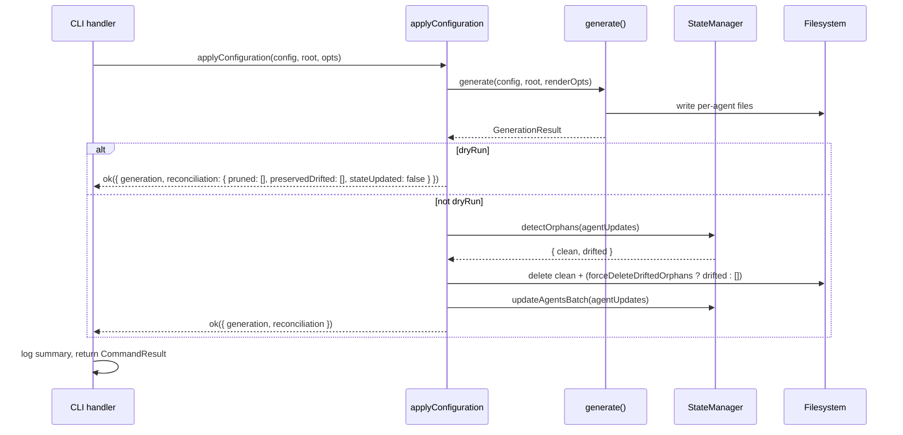

# Generation Reconciliation: applyConfiguration façade

- **Date**: 2026-04-27 22:53
- **Document**: 20260427_2253_SPEC_generation-reconciliation-apply-configuration.md
- **Category**: SPEC
- **Status**: Draft — awaiting user approval before implementation
- **Author**: brainstorming session 2026-04-27 (hotfix/v2.13.1)

## Problem

When an artifact is removed from `.codi/` (via wizard customize, hub Generate, hand-edit + init, watch-mode regen, or `codi update`), the corresponding generated files in per-agent output directories (`.claude/`, `.codex/`, `.cursor/`, `.agents/`, etc.) are **stranded forever**. Per-agent dirs accumulate stale artifacts that contradict the project's intent.

A working orphan-cleanup mechanism exists (`StateManager.detectOrphans` + `deleteOrphans`), but the orchestration that calls it lives inline in `src/cli/generate.ts` (lines 94-143). Of the **five production callers** of `generate()`, only one — `cli/generate.ts` — runs that orchestration. The other four bypass it:

| Caller | Bug |
|---|---|
| `src/cli/init.ts:588` | post-init regeneration leaks orphans |
| `src/cli/shared.ts:55` (`regenerateConfigs`) | fans out to hub + customize-add — both leak orphans |
| `src/cli/watch.ts:34` | file-watcher regen leaks orphans |
| `src/cli/update.ts:646` | `codi update` leaks orphans |

Reproduced in this session against the linked local build:

```
$ codi init --preset codi-balanced --agents claude-code
$ rm .codi/rules/codi-testing.md       # simulates wizard deselect
$ codi init --preset codi-balanced --agents claude-code
$ ls .claude/rules/codi-testing.md
.claude/rules/codi-testing.md          # STRANDED
```

## Goals

1. Make orphan reconciliation **structurally impossible to skip** for any caller that intends to apply a configuration.
2. Preserve `generate()` as a pure render+write primitive for legitimate uses (tests, dry-run, future tooling).
3. Single audit point: anyone reviewing CLI code can grep one identifier and see every site that fully reconciles.
4. Zero regression in the four behaviors `generate()` already gets right (rendering, conflict resolution, dry-run, hooks orchestration in CLI layer).

## Non-Goals

- Hook re-installation orchestration in `cli/generate.ts:145-229` stays in the CLI layer (CLI dependencies, only one caller).
- We do not deprecate or rename `generate()`.
- We do not change `StateManager` semantics.
- We do not change the audit-ledger writer.

## Approach

Two clearly-separated primitives in `core/generator/`:

```
src/core/generator/
├── generator.ts       (existing)  pure render + write. No state. No reconcile.
└── apply.ts           (NEW)       render + write + reconcile + persist state.
                                   The single entry point CLI handlers use.
```

**Layering rule**: every `cli/*` file calls `applyConfiguration()`. Tests and `apply.ts` itself remain the only legitimate importers of `generate()`.

### Why a façade beats a defensive default

We considered baking reconciliation into `generate()` with a `skipReconcile: boolean` opt-out. Rejected because:

- Boolean flags forget in the *opposite* direction. A test calling `generate()` without `skipReconcile: true` would silently mutate state.
- Two named functions express two intentions unambiguously. `generate()` literally cannot touch state — there is no path to it from that file.
- Mirrors industry pattern (`terraform plan` vs `terraform apply`, React render vs commit, Kubernetes apply vs reconcile loop).

## Public API

```typescript
// src/core/generator/apply.ts

export interface ApplyOptions {
  // Render/write options (forwarded to generate())
  agents?: string[];
  dryRun?: boolean;
  force?: boolean;
  keepCurrent?: boolean;
  unionMerge?: boolean;

  // Reconcile options
  /** Force-delete drifted orphans (user-edited generated files). Default: follows `force`. */
  forceDeleteDriftedOrphans?: boolean;
}

export interface ApplyResult {
  generation: GenerationResult;
  reconciliation: {
    pruned: string[];                // paths actually deleted
    preservedDrifted: string[];      // drifted orphans kept (warned)
    stateUpdated: boolean;           // false on dryRun or state-write failure
  };
}

export async function applyConfiguration(
  config: NormalizedConfig,
  projectRoot: string,
  options: ApplyOptions = {},
): Promise<Result<ApplyResult>>;
```

Contract decisions:

- `dryRun: true` skips reconcile and state writes entirely. Identical to today.
- No `skipReconcile` flag. Pure-render callers use `generate()` directly.
- `forceDeleteDriftedOrphans` defaults to `options.force` inside `apply.ts`. The CLI layer composes whatever expression it needs (e.g. `cli/generate.ts` passes `options.force || options.onConflict === "keep-incoming"`); `apply.ts` itself does **not** know about `--on-conflict`. Keeps the core primitive free of CLI option vocabulary.
- Returns structured data, not side effects. CLI handlers own their own logging.

## Architecture



## Component Responsibilities

| Component | Owns | Does NOT own |
|---|---|---|
| `generate()` | Rendering, conflict resolution, file writes | State, orphans, audit |
| `applyConfiguration()` | Composition: render + reconcile + state-update | CLI logging, hook installation, audit ledger |
| `StateManager` (existing, unchanged) | Reading/writing `.codi/state.json`, orphan detection | Reasoning about which files to keep |
| CLI handlers | User-facing logging, exit codes, hook/audit orchestration | Orphan logic, state writes |

## Call-site Migration

| File | Today | After |
|---|---|---|
| `cli/generate.ts` | calls `generate()` + inline reconcile (lines 94-143) | calls `applyConfiguration()`; inline reconcile block deleted (~50 LOC) |
| `cli/init.ts:588` | calls `generate()` (no reconcile — bug) | calls `applyConfiguration()` |
| `cli/shared.ts:55` (`regenerateConfigs`) | calls `generate()` (no reconcile — bug, fans out to hub + customize-add) | calls `applyConfiguration()` |
| `cli/watch.ts:34` | calls `generate()` (no reconcile — bug) | calls `applyConfiguration()` |
| `cli/update.ts:646` | calls `generate()` (no reconcile — bug) | calls `applyConfiguration()` |
| `tests/unit/adapters/generator.test.ts` | calls `generate()` | unchanged — pure render is the right level |
| `tests/integration/adapter-generation.test.ts` | calls `generate()` | unchanged — same reason |

Concrete shape of the largest CLI change (`cli/generate.ts`):

```typescript
// AFTER
const result = await applyConfiguration(configResult.data, projectRoot, {
  agents: options.agents,
  dryRun: options.dryRun,
  force: options.force,
  keepCurrent: options.onConflict === "keep-current",
  forceDeleteDriftedOrphans: options.force || options.onConflict === "keep-incoming",
});
if (!result.ok) return error(result.errors);
const { generation, reconciliation } = result.data;
if (reconciliation.pruned.length > 0)
  log.info(`Pruned ${reconciliation.pruned.length} orphaned file(s) removed from source templates`);
if (reconciliation.preservedDrifted.length > 0)
  log.warn(`${reconciliation.preservedDrifted.length} orphaned file(s) have local edits — preserved.`);
await writeAuditEntry(...);   // stays in CLI
```

The other four sites collapse from ~5 lines (no reconcile) to ~5 lines (with reconcile, by switching the function name and threading `force`).

## Error Handling

Three failure modes, each with an explicit policy:

1. **Render fails** (`generate()` returns `err`) — `applyConfiguration` returns the same error untouched. State is not read or written. No orphans pruned. Identical to today's behavior.

2. **Orphan deletion fails partway** (file removed externally, permission denied) — `StateManager.deleteOrphans` already returns the list of files actually deleted, swallowing per-file `unlink` errors. We preserve that: the `pruned` array reflects reality, not intent. No exception bubbles. A partial prune is not worse than no prune.

3. **State write fails** (disk full, permissions on `.codi/state.json`) — Wrap it: log a warning (`"State update failed; orphan detection may be incomplete on next run"`) and return `ok` for the generation result with `stateUpdated: false`. The user's files are correct on disk. Cost: one possibly-noisy reconcile next run, not data loss.

**Invariant guaranteed**: order is render → write → detect-orphans → delete-orphans → update-state. If any step before update-state fails, the state file is not updated, so the next successful run re-detects the same orphans and prunes them. **Reconciliation is idempotent and self-healing.**

## Testing Approach

### Unit tests for `apply.ts` (new file `tests/unit/core/generator/apply.test.ts`)

- `dryRun: true` returns `stateUpdated: false`, no FS deletes, no state writes
- Pure-additive run: `pruned: []`, state updated
- Deselect path: prior state has files A, B, C; render produces A, B; `pruned` contains C; C is gone from disk
- Drifted orphan + `forceDeleteDriftedOrphans: false`: file preserved, listed in `preservedDrifted`
- Drifted orphan + `forceDeleteDriftedOrphans: true`: file deleted
- `generate()` failure: error propagates, state untouched

### Integration regression tests (added to `tests/unit/cli/init.test.ts`)

- *Init update prunes orphans*: install balanced + claude-code → manually delete a rule from `.codi/rules/` → re-run `initHandler` → assert the corresponding file is gone from `.claude/rules/`
- *Init update prunes from multi-agent dirs*: install with claude-code + codex → deselect a skill → re-run → assert removed from both `.claude/skills/` and `.agents/skills/`

### Existing tests stay green by construction

- `tests/unit/adapters/generator.test.ts` and `tests/integration/adapter-generation.test.ts` still call `generate()` directly. Pure render. No state. No reconcile. Zero changes.
- All other tests call CLI handlers, which start using `applyConfiguration` — but the observable behavior they assert (files exist, content matches) is unchanged.

### Smoke verification (manual, post-merge)

The session repro: install → deselect → re-init must leave per-agent dirs consistent with `.codi/`. Run against the linked local build before opening the PR.

## Migration Order

Five commits, each independently reviewable, each leaves the tree green:

| # | Commit | Files | Risk |
|---|---|---|---|
| 1 | Create `core/generator/apply.ts` + unit tests | new file + new test file | None — net additive |
| 2 | Refactor `cli/generate.ts` to use `applyConfiguration` | 1 file, ~50 LOC removed | Low — same behavior, covered by existing tests |
| 3 | Wire `cli/init.ts` post-init regen + add integration test | 2 files | Low — fixes the reported bug, caught by new test |
| 4 | Wire `cli/shared.ts:regenerateConfigs` (fans out to hub + customize-add) | 1 file | Low |
| 5 | Wire `cli/watch.ts` and `cli/update.ts` | 2 files | Low — same pattern |

## Out of Scope (Deliberate YAGNI)

- ESLint rule banning `import { generate }` outside `core/`, `tests/`, and `apply.ts`. Recommended as a separate mechanical PR.
- Folding hook re-installation into `applyConfiguration`. Only one caller needs it; folding it would add CLI dependencies to `core/`.
- Changing `StateManager` API or storage format.
- Backfilling state for installations that ran any of the buggy code paths in the past. Self-heals on next successful apply.

## Risks and Mitigations

| Risk | Mitigation |
|---|---|
| Future caller bypasses `applyConfiguration` and calls `generate()` directly | Optional follow-up: ESLint rule. Code review covers it short-term — only 5 prod call sites today. |
| State write becomes a new failure mode in init/update/watch where it didn't exist before | Wrapped, logs warning, returns `ok`. Self-heals on next run. |
| Behavior change in `cli/generate.ts` from refactor | Surface area covered by the existing `tests/unit/cli/init.test.ts` + `tests/unit/cli/hub-handlers.test.ts` + integration tests. New unit tests for `apply.ts` provide regression coverage. |
| Watch mode now does state I/O on every regen (perf concern) | State writes are small JSON; same cost as `cli/generate.ts` already pays today. If profiling shows hot-path overhead, debounce. Not anticipated. |

## Verification Checklist

Before merging:

- [ ] All existing tests green (`pnpm test`)
- [ ] New `apply.ts` unit tests cover the six scenarios above
- [ ] New integration tests in `init.test.ts` cover the regression
- [ ] Manual smoke: install → deselect → re-init → per-agent dir consistent
- [ ] Manual smoke: install → deselect → `codi update` → per-agent dir consistent
- [ ] Manual smoke: `codi watch` regenerates without leaking orphans (start watcher, edit `.codi/`, observe agent dir)
- [ ] Lint clean
- [ ] No new TypeScript errors
