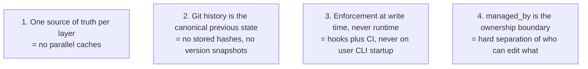
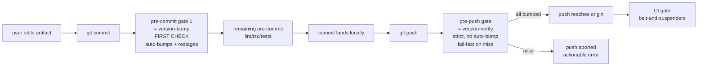
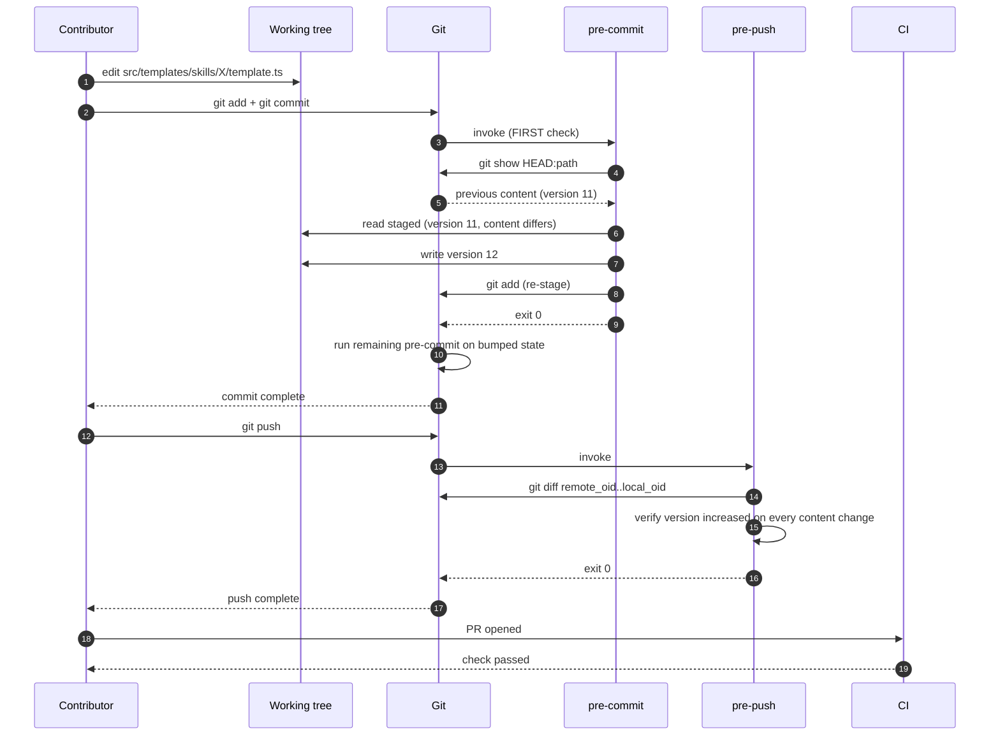
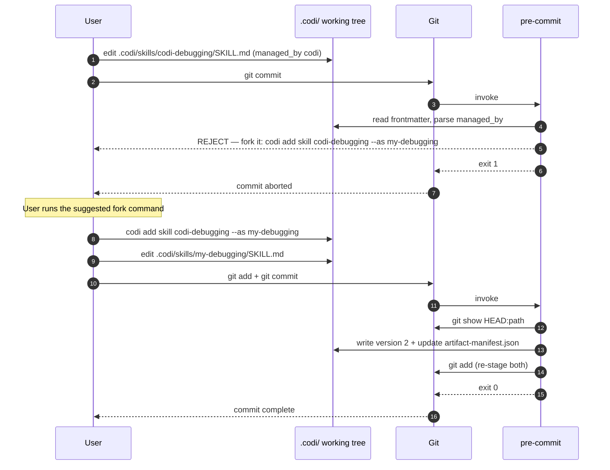
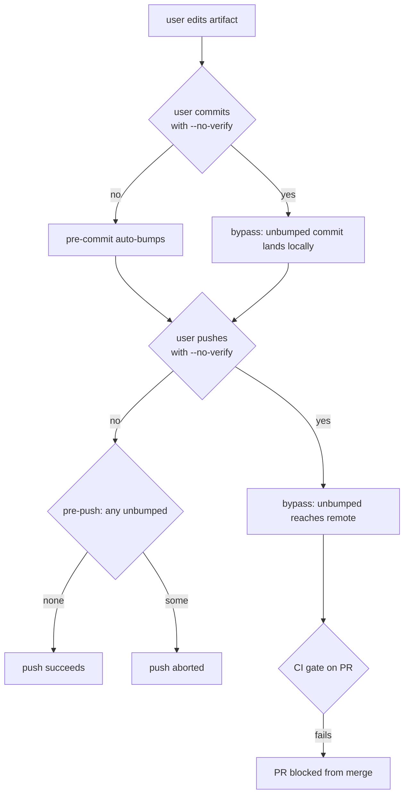

# Artifact Versioning Refactor — Eliminate the Baseline, Move Enforcement Left

- **Date**: 2026-04-28 11:07
- **Document**: 20260428_1107_PLAN_artifact-versioning-refactor.md
- **Category**: PLAN
- **Status**: Awaiting approval

## 1. Executive Summary

The current artifact versioning system stores the same fact ("artifact X is at version N with hash Y") in three places that must agree: the source baseline JSON, the bundled CLI chunk, and the user's installed manifest. Drift between these three caused the v2.13.0 install failures. This refactor eliminates the parallel cache (`artifact-version-baseline.json`), removes the runtime check that punishes end users for contributor process violations, and shifts enforcement to three local-first layers (pre-commit auto-fix, pre-push verify, CI gate). It also fixes a previously dead pre-commit hook that ships to user projects but never matches their file paths, making the second layer (`.codi/`) a real, working part of the system for the first time.

## 2. Background

### 2.1 The triggering incident

On 2026-04-26, codi-cli@2.13.0 was published to npm. A subset of users hit a fatal "Template registry integrity check failed" error when running `codi` (bare) or `codi init`. The error blamed `codi-rule-creator` and `codi-agent-creator` for "content changed without artifact version bump (current 11, previous 11)".

Investigation showed:
- The published tarball is bytewise identical to a clean local rebuild.
- The runtime hash matches the recorded baseline hash on a freshly installed clean prefix on the same Node version (v24.15.0) the failing users ran.
- The bug could not be reproduced from the artifact alone — it requires some local state we cannot see on the failing users' machines.

### 2.2 Audit findings

| Finding | Severity |
|---|---|
| Runtime check at `cli.ts:79` and `init.ts:135` blocks end users for a contributor-side process violation | High — UX guarantee broken |
| `codi-version-bump.mjs` hook is shipped to user projects via `codi init` but its regex hardcodes `src/templates/...`, never matching `.codi/...` paths — dead code on every consumer | High — second-layer enforcement is missing entirely |
| `codi-artifact-validate.mjs` hook validates YAML schema but not version bumps, so users can edit `.codi/X` content without bumping and the system never notices | Medium — silent drift in user state |
| `pnpm test` regenerates `artifact-version-baseline.json` as a side-effect of running tests; a contributor who runs the full suite locally and commits silently rewrites the baseline | Medium — bypasses the policy without warning |
| No CI gate for the registry check on PRs or pre-publish — the only protection between contributor mistake and broken release was the pre-commit hook (skippable via --no-verify) and the runtime check on users (now being removed) | High — would create a hole if runtime check is removed without replacement |
| The `version` field on `.codi/` artifacts is informational only; `upgrade-detector.ts` uses content hashes, not version numbers, to drive drift detection | Insight — clarifies what the version field is actually for |

### 2.3 What the version field is actually for

After tracing every consumer:

- **Drives upgrade detection (load-bearing)?** No. `upgrade-detector.ts:79` compares `installed.contentHash` vs `fingerprint.contentHash`. The version field is metadata, not the gate.
- **Provenance / contribution signal (convention)?** Yes. The version field travels with the artifact when contributors PR upstream or share `.codi/` via git. Visible to humans, not enforced by code.

This means enforcing version bumps is a useful CONVENTION for human readers and team workflows, not a CORRECTNESS requirement. The system would technically work without any enforcement at all — but provenance and team coordination both benefit from a strict, automatic version-bump invariant.

## 3. Goals and Non-Goals

### Goals

- End users never see "integrity check failed" errors again. The runtime check is removed.
- Every artifact content change in version control corresponds to a version bump, with three enforcement layers (pre-commit, pre-push, CI) that progressively catch any bypass.
- The same enforcement model works on both layers — contributors editing source templates AND consumers editing their own `.codi/` artifacts.
- `managed_by: codi` artifacts in user projects cannot be silently edited; users are redirected to the fork workflow.
- The architecture eliminates the entire class of bugs where a stored hash drifts from the computed hash. There is nowhere to store such a stale hash anymore.

### Non-Goals

- Changing the user-facing semantics of `codi update` or `upgrade-detector`. Those continue to work as today, using content hashes.
- Moving away from npm publish or changing the release workflow's overall structure.
- Backporting the refactor to older versions. Ships in a future release as a coherent change.
- Validating template content beyond version-bump compliance (e.g. linting frontmatter — that's a separate concern handled by `codi-artifact-validate.mjs` already).
- Adding telemetry or remote reporting of any kind.

## 4. Design

### 4.1 The four pillars



### 4.2 Three-layer enforcement model



| Layer | Action | Bypass-proof | Speed |
|---|---|---|---|
| Pre-commit (1st check) | Auto-bump version, update manifest, re-stage | No (--no-verify) | Instant |
| Pre-push | Verify all artifact changes have version bump in the push range | No (--no-verify but rarer) | Under 1 second |
| CI on PR | Same verification, server-side | Yes | About 2 minutes |
| Pre-publish (codi repo only) | Same verification, before npm publish | Almost (npm --ignore-scripts is the only theoretical bypass) | About 10 seconds |

### 4.3 Dual-mode hook behavior

The pre-commit hook is mode-aware. Mode is determined per-staged-file:

| Staged path | Mode | Behavior |
|---|---|---|
| `src/templates/{skills,agents}/X/template.ts` or `src/templates/rules/X.ts` | source | Diff staged content vs `git show HEAD:path`. If content changed and version did not increase, bump in-place plus re-stage. |
| `.codi/{rules,skills,agents}/X/...` AND frontmatter `managed_by: user` | user-managed | Same as source, plus update the entry in `.codi/artifact-manifest.json` (contentHash and installedArtifactVersion). |
| `.codi/{rules,skills,agents}/X/...` AND frontmatter `managed_by: codi` | codi-managed | Reject the commit with: "This artifact is managed by codi and will be overwritten on update. Fork it: `codi add <type> <name> --as <new-name>`" |
| Other paths | skip | No-op |

A single commit can span multiple modes (the codi repo edits both `src/templates/` and `.codi/` together when self-hosting); each path is processed independently.

The pre-push hook applies only the verification side: for every artifact file changed in the push range, confirm the version increased. No file mutation in pre-push.

#### 4.3.1 Edge cases (precise rules)

Pre-commit hook:

| Condition | Rule |
|---|---|
| File is newly added (no `git show HEAD:path` entry) | Treat as new artifact. If `version:` is present in staged content, leave it alone (could be any value, including 1). If absent, inject `version: 1`. For user-managed `.codi/` paths, add a manifest entry. |
| `git show HEAD:path` fails because `HEAD` does not exist (very first commit) | Skip version-bump check entirely; print `[version-bump] no HEAD yet — first commit, skipping`. Allow commit. |
| Frontmatter missing on a `.codi/` artifact path | Reject with `✗ [version-bump] artifact missing frontmatter: <path>`. Caller fixes and retries. |
| Frontmatter present but `managed_by` field absent on a `.codi/` artifact | Treat as `managed_by: user` (default). Document this default in `parseVersionFromFrontmatter` companion helper. |
| Frontmatter is malformed YAML (cannot parse) | Reject with `✗ [version-bump] malformed frontmatter: <path> — <yaml error>`. Exit 1. |
| File deletion staged | Remove entry from `.codi/artifact-manifest.json` if user-managed. No version-bump concern. |
| File rename | Treat as delete-plus-add: remove old manifest entry, evaluate new path under normal rules. |
| Manual version regression (staged `version:` < HEAD `version:`) | Reject with `✗ [version-bump] version regression on <path>: <head> → <staged>` |

Pre-push hook (per-ref handling — git protocol delivers `<local_ref> <local_oid> <remote_ref> <remote_oid>` per ref on stdin):

| Push shape | Rule |
|---|---|
| Normal fast-forward (`remote_oid` non-zero, `local_oid` non-zero, ancestor relationship) | Diff `remote_oid..local_oid`. Verify each artifact change in that range has a version bump. |
| New branch (`remote_oid` is `0000000000000000000000000000000000000000`) | Use `git merge-base local_oid origin/HEAD` (resolves to default branch tip) as the diff base. If no merge-base, use `local_oid` itself (single-commit walk). |
| Force-push / non-fast-forward | Treat same as fast-forward: diff `remote_oid..local_oid`. The diff still contains content additions/changes; if any artifact change lacks a bump, reject. |
| Branch deletion (`local_oid` is all zeros) | Skip — nothing to verify. |
| Multiple refs in one push | Each ref is independent — verify each, accumulate errors, fail-fast on first invalid ref. |
| Tag pushes | Skip — tags do not modify artifacts. |

### 4.4 Component inventory

#### Files to delete

| File | Reason |
|---|---|
| `src/core/version/artifact-version-baseline.json` | Stored hash cache — replaced by git history |
| `src/core/version/artifact-version-baseline.ts` | `checkArtifactVersionBaseline()` obsolete |
| `tests/release/generate-baseline.test.ts` | Side-effect "test" that mutates source during `pnpm test` |
| `src/core/scaffolder/template-registry-check.ts` | Runtime aggregator. The "template loadable" portion (lines 14-41 of the existing file: iterate `AVAILABLE_*_TEMPLATES`, ensure each loads with non-empty content) is preserved as a new `templates-loadable` check inside `src/cli/doctor.ts`. The baseline-comparison portion (line 43, `checkArtifactVersionBaseline(...)`) is dropped entirely — git history replaces it. After extraction, the file is deleted. |

#### Code to delete inside surviving files

| Location | Change |
|---|---|
| `src/cli.ts:33,79-89` | Remove import + `checkTemplateRegistry()` call + early exit |
| `src/cli/init.ts:43,133-140` | Remove import + call + exit |
| `package.json` `scripts.baseline:update` | Delete |

#### Files to keep unchanged

| File | Role |
|---|---|
| `src/core/version/template-hash-registry.ts` | Still computes runtime hashes for `upgrade-detector.ts` |
| `src/core/version/upgrade-detector.ts` | User-facing drift detection at `codi update` time |
| `src/core/version/artifact-manifest.ts` | Tracks user installed state in `.codi/artifact-manifest.json` |
| `src/core/version/artifact-version.ts` | Frontmatter parsing helpers used everywhere |

#### Files to modify

| File | Change |
|---|---|
| `src/core/hooks/version-bump-template.ts` | Rewrite as dual-layer, managed_by-aware, git-history-based. Single template, three modes per the matrix in 4.3. |
| `src/core/hooks/hook-config-generator.ts` | Wire pre-push hook alongside pre-commit. Move version-bump to first position in pre-commit chain. |
| `src/core/hooks/hook-installer.ts` | Install the new `codi-version-verify.mjs` template at `.git/hooks/`. |
| `.husky/pre-commit` | Reorder so `codi-version-bump.mjs` runs first, before lint/tsc/tests. |
| `src/cli/doctor.ts` | Add checks: `pre-commit-hook-installed`, `pre-push-hook-installed`. Warns when missing or unwired. |

#### Files to add

| File | Role |
|---|---|
| `src/core/hooks/version-verify-pre-push-template.ts` | New template producing `.git/hooks/codi-version-verify.mjs`. Read-only verification of push range. |
| `scripts/verify-artifact-versions.mjs` | Shared CLI used by both pre-push and CI step |
| `.github/workflows/ci.yml` step | Calls `scripts/verify-artifact-versions.mjs` on PRs against `main` and `develop` |
| `src/core/hooks/hook-logic/` (TS module) | Pure functions extracted from the templates: `getPreviousVersion`, `detectMode`, `bumpVersion`, `verifyRange`, `updateManifest`. Unit-testable. |

### 4.5 Data flow — contributor edits source template



### 4.6 Data flow — user edits `.codi/` artifact



### 4.7 Data flow — bypass escalation



### 4.8 Error model

Every hook-emitted error follows this contract:

```
✗ [hook-name] one-line summary
  file: path
  reason: specific cause
  fix: exact command to run
```

Locked reject-message templates (wording is part of the spec, not invented at implementation time):

```
✗ [version-bump] managed-by-codi artifact cannot be edited directly
  file: <path>
  reason: managed_by: codi means this gets overwritten on `codi update`
  fix: codi add <type> <name> --as <new-name>
```

```
✗ [version-bump] version regression on <path>: <head-version> → <staged-version>
  reason: artifact versions must monotonically increase
  fix: edit the version: line in the file's frontmatter to a value greater than <head-version>
```

```
✗ [version-verify] <count> artifact(s) need version bumps before push
  files:
    - <path-1> (v<old> → v<old>, content changed)
    - <path-2> (v<old> → v<old>, content changed)
  reason: pre-commit hook did not run or was bypassed
  fix: git add <files> && git commit --amend --no-edit
       (or re-install the hook: codi init --reinstall-hooks)
```

Categories:

- **Technical failures** (git errors, malformed YAML, missing manifest): print actionable message, exit 1. Never silently swallowed.
- **Validation failures** (content changed without bump): auto-fixed by pre-commit, rejected by pre-push, blocked by CI.
- **Bypass attempts** (--no-verify): caught by the next layer. No single-failure-point.
- **No `"This is a bug, please report it"`** runtime panic. That class of message is gone.

Every reject names the file, the rule, and a concrete remediation command.

## 5. Testing approach

Tests deleted (concrete enumeration from grep against current symbols `checkArtifactVersionBaseline`, `checkTemplateRegistry`, `artifact-version-baseline`):

- `tests/release/generate-baseline.test.ts` — side-effect writer
- `tests/release/artifact-version-baseline.test.ts` — tests the deleted function
- `tests/unit/core/version/artifact-version-baseline.test.ts` — tests the deleted function
- `tests/unit/core/scaffolder/template-registry-check.test.ts` — tests the deleted aggregator
- `tests/unit/cli/init-registry-guard.test.ts` — tests the runtime check on init path
- `tests/unit/cli/init.test.ts` — UPDATE: remove the `checkTemplateRegistry`-related cases, keep the rest
- `tests/integration/full-pipeline.test.ts` — UPDATE: remove any assertion that depends on the runtime check firing
- `tests/integration/self-introspection.test.ts` — UPDATE: same as above
- `tests/integration/skill-management.test.ts` — UPDATE: same as above

The "delete vs update" distinction is by file: tests dedicated to the removed functions get deleted entirely; tests that exercise unrelated behavior but happen to import a removed symbol get the import + relevant cases removed.

Tests added (per `vitest.config.ts` defaults):

- **Unit** (about 20): pure-function coverage on `getPreviousVersion`, `detectMode`, `bumpVersion`, `verifyRange`, `updateManifest`. Target 90%+ coverage on the new `src/core/hooks/hook-logic/` module.
- **Integration** (about 10): scripted git-repo scenarios. Edit-and-commit flow, edit-and-push flow, managed_by-codi reject, new file, deleted file, --no-verify bypass caught by pre-push.
- **Snapshot** (2): pin the generated `.git/hooks/codi-version-bump.mjs` and `codi-version-verify.mjs` script bytes — prevents accidental drift in template literal output.
- **CI script** (1): exercise `scripts/verify-artifact-versions.mjs` with a simulated PR diff fixture.

Tests kept unchanged: `template-hash-registry.test.ts`, `artifact-manifest.test.ts`, `upgrade-detector.test.ts`.

## 6. Migration and rollout

### 6.1 Order of operations

1. **Phase 1 (already shipped via v2.13.1)**: diagnostic improvement to the existing integrity check error message. No behavior change. Sets the stage for users to send better diagnostic data if v2.13.0 issues recur.
2. **Phase 2 (this refactor, target v2.14.0)**: deliver the full design above.

Phase 2 is one PR, on its own feature branch off `develop`, large but self-contained. No partial intermediate states — the runtime check stays in until the new enforcement layers are tested and ready.

### 6.2 Rollout sequence within Phase 2

1. Add new files: `version-verify-pre-push-template.ts`, `hook-logic/`, `scripts/verify-artifact-versions.mjs`. Wire into `hook-installer.ts` and `hook-config-generator.ts`.
2. Update existing `version-bump-template.ts` to git-history-based + dual-mode + managed_by-aware.
3. Add CI workflow step. Add `codi doctor` checks.
4. Reorder `.husky/pre-commit` so version-bump runs first.
5. Run the full new test suite — the new tests must NOT depend on the absence of the legacy runtime check (it is still wired in at this step). Verify in self-hosting (codi repo) by editing a source template AND a `.codi/` artifact in one commit and observing both auto-bump.
6. Delete the runtime check (cli.ts, init.ts), the baseline file, the baseline.ts function, and the side-effect test.
7. Update `package.json`: remove `baseline:update` script.
8. Run the full integration suite again. Verify pre-push catches a `--no-verify`'d commit.
9. Open PR, run CI, verify CI step catches the same.
10. Update CHANGELOG with the migration note (no user action required for end users, contributor docs updated).

### 6.3 User impact

- **End users (codi-cli consumers)**: zero action required. They will simply stop seeing the integrity-check error class.
- **Existing user projects with `.codi/` directories**: on next `codi init` or `codi update`, the new pre-commit and pre-push hooks are installed. Existing artifact-manifest.json continues to work.
- **Codi contributors**: no change in daily workflow — the pre-commit auto-bump continues to work, just sourced from git history instead of a baseline file. Contributors who relied on running `pnpm baseline:update` manually will see that command is removed — refer them to the new flow (just commit, the hook handles it).

### 6.4 Backward compatibility

- `.codi/artifact-manifest.json` schema unchanged.
- Frontmatter `version:` field semantics unchanged (still a monotonic counter parsed by `parseVersionFromFrontmatter`).
- Older codi-cli versions (anything pre-Phase 2) continue to work — they have their own runtime check baked in. The refactor is forward-compatible at the artifact-content layer.

## 7. Risks and mitigations

| Risk | Likelihood | Impact | Mitigation |
|---|---|---|---|
| Removing the runtime check leaves a window where a broken bundle reaches users | Low | High | Phase 2 ships pre-publish CI gate before runtime check is removed in the same PR; new gates strictly stricter than what they replace |
| `git show HEAD:path` performance on very large repos | Very low | Low | Single-file reads are O(1) with packfile indexes; even on a 10k-template repo this is sub-second |
| Dual-mode hook complexity causes bugs in mode detection | Low | Medium | Mode detection is pure-function with unit tests; integration tests cover all four mode outcomes |
| Users on older codi-cli versions still hit the v2.13.0 bug | Medium | Low | v2.13.1 hotfix already shipped to give them a clean reinstall path; the diagnostic message addition lets us debug if issue recurs |
| `codi update` overwrites a user-managed artifact whose hash was bumped via auto-bump | Low | Low | `upgrade-detector.ts` already classifies managed_by-user as user-managed and never auto-overwrites; tested behavior |
| Pre-push hook rejects valid pushes due to a bug in range diffing (new branch, force-push, etc.) | Low | Medium | Cover all push-range edge cases in integration tests: new branch, fast-forward, non-fast-forward, deleted branch |
| Contributors who rely on `pnpm baseline:update` are confused when it's gone | Low | Low | Removal noted in CHANGELOG; pre-commit hook handles regen automatically; no contributor action needed |

## 8. Open questions

None. Every previously open decision has been resolved during the brainstorming phase:

- Eliminate baseline file? **Yes** — git history replaces it.
- managed_by codi edits? **Reject with actionable fork command**.
- CI gate or pre-publish? **Both** — defense in depth.
- Hash inside or outside the file? **Neither — not stored at all**, only computed at runtime for `upgrade-detector`.
- Test side-effect? **Deleted** — pure verification only.
- Auto-bump or force user? **Auto-bump** — frictionless.
- Pre-push or CI alone? **Both** — pre-push catches local bypasses fast.

## 9. Pipeline detection

This is an **implementation** task. After this spec is approved, the next skill is `codi-plan-writer` to break it into atomic 2-5 minute TDD tasks with exact file paths and runnable verification commands.

## 10. Approval gate

Once this spec is approved, the next step is `codi-plan-writer`. No code is written until the implementation plan is also approved.
