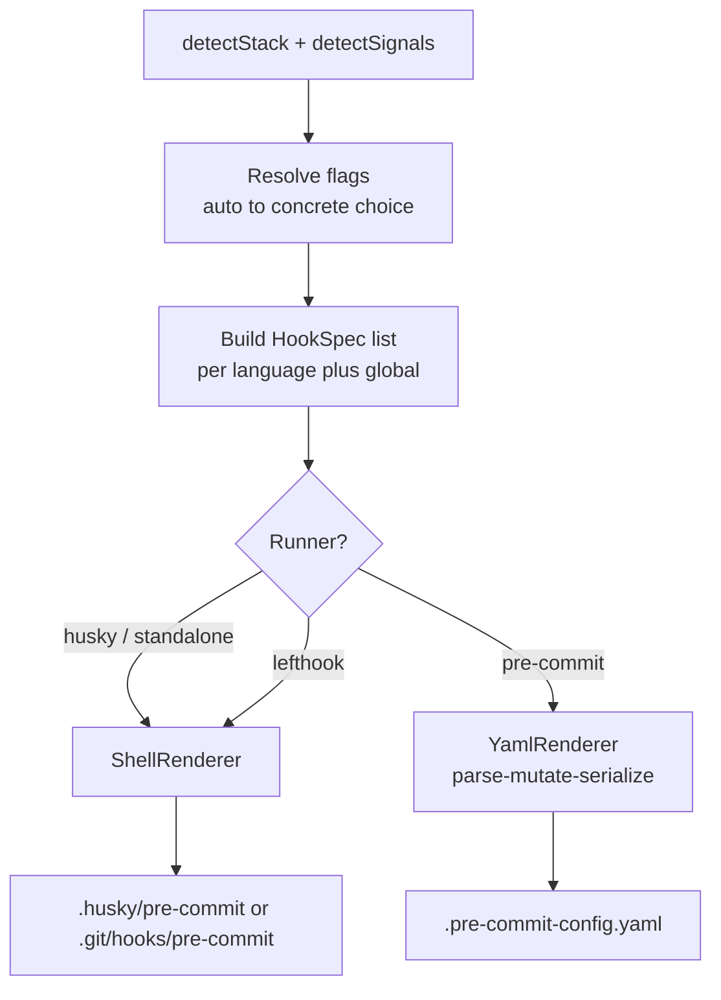
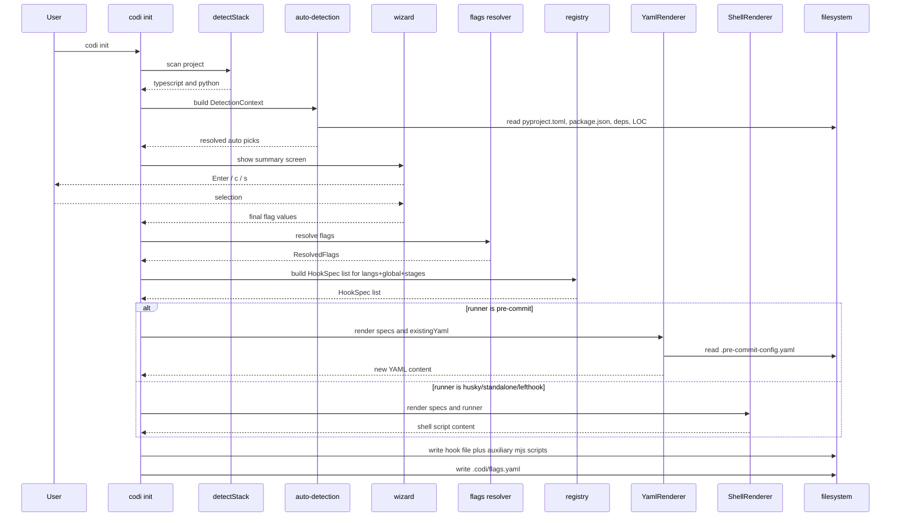
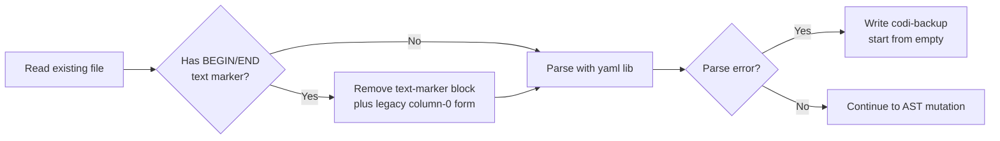

# Pre-commit Hook System Redesign — Multi-Language Robustness

- **Date**: 2026-04-28 14:30
- **Document**: 20260428_1430_SPEC_precommit-multilanguage-redesign.md
- **Category**: SPEC
- **Status**: Awaiting final approval before plan-writer invocation
- **Target branch**: `feat/precommit-multilanguage-redesign` → PR to `develop`

---

## 1. Executive Summary

Codi's pre-commit hook installer is broken for any project that already has a `.pre-commit-config.yaml` with nested `hooks:` lists, and structurally undersells the value of the `pre-commit` framework runner by emitting `language: system` for every hook. This SPEC redesigns the hook system around three layers (detection, registry, rendering), introduces hybrid auto-detection with visible override for four key tooling decisions, switches the YAML emission strategy to AST round-trip, and aligns defaults with 2026 industry standards (basedpyright over pyright, type-checking deferred to pre-push, full test suites off the commit path).

The redesign ships as a **single PR** with **10 logically isolated commits** against `develop`. No feature gate; the migration path (text-marker stripping + `.codi-backup` for malformed YAML) is the safety net.

## 2. Problem Statement

### 2.1 Critical bugs in current behavior

| # | Issue | Location | Impact |
|---|---|---|---|
| C1 | `findReposInsertionPoint` overwrites `listIndent` on every nested list item, so the Codi block lands inside an external repo's `hooks:` list when one exists | `src/core/hooks/pre-commit-framework.ts:194-214` | Invalid YAML in any project that already had `repos:` → user-reported breakage |
| C2 | All hooks rendered with `language: system` regardless of runner | `src/core/hooks/pre-commit-framework.ts:79` | Defeats the point of pre-commit framework; tool drift, "works on my machine" failures |
| C3 | Pre-commit framework runner emits a single `repo: local` block — never references upstream pinned hooks | `pre-commit-framework.ts:107-120` | Users miss `pre-commit autoupdate`, isolated venvs, version pinning |
| C4 | `npx pyright` is the Python type-checker default — forces npm dependency in pure-Python repos | `hook-registry.ts:100-107` | Python-only repos without Node fail to commit |
| C5 | Bandit installHint is `pip install bandit` — missing the `[toml]` extra required for `pyproject.toml` config | `hook-registry.ts:114` | Bandit `-c pyproject.toml` fails with cryptic error |
| C6 | No global `exclude:` for `node_modules/`, `.venv/`, `dist/`, `build/`, `.next/`, `coverage/` | `pre-commit-framework.ts:107-120` | Hooks scan generated/vendored files |

### 2.2 Behavior gaps vs 2026 standards

| # | Issue | Impact |
|---|---|---|
| B1 | `tsc --noEmit` runs on every commit with no incremental config | 10–60s commits on monorepos → users `--no-verify` |
| B2 | `test_before_commit` defaults to `true` (full pytest / npm test on commit) | Industry consensus rejects this; pytest team explicitly rejects pre-commit pytest |
| B3 | Prettier scope hardcoded to `*.{ts,tsx,js,jsx}` | Misses `.json`, `.md`, `.yaml`, `.css` — inconsistent formatting |
| B4 | No commitlint integration | Codi has its own commit-msg template that duplicates work commitlint does better |
| B5 | No `additional_dependencies:` ever emitted | mypy hooks fail without type stubs; eslint plugins drift from `package.json` |
| B6 | No `default_install_hook_types`, `default_language_version`, `default_stages`, `minimum_pre_commit_version`, `ci:` block | Misses standard 2026 config keys |
| B7 | Bandit blocks for medium/low severity by default — false-positive heavy on test code | Users disable wholesale rather than configure |
| B8 | `STACK_INDICATORS` triggers `javascript` from `package.json` even in TS-only repos | Cosmetic redundancy; same hook configs collide |

### 2.3 Robustness gaps

| # | Issue | Impact |
|---|---|---|
| R1 | No tests for `findReposInsertionPoint`, `renderPreCommitBlock`, `installPreCommitFramework` | C1 silently regressed; future refactors will too |
| R2 | `stripPreCommitGeneratedBlock` keeps a "legacy" branch hardcoded to clean up old broken output | Legacy debt accumulates rather than gets removed |
| R3 | Husky `buildHuskyCommands` builds tool-existence checks per-hook with `command -v` | Slow; sometimes false-negative blocking |

## 3. Industry Research Summary

Three parallel research agents (sources cited in §13) produced consistent guidance.

### 3.1 JavaScript / TypeScript

- husky + **lint-staged** is canonical when JS/TS-only. **lefthook** is the polyglot/speed alternative. **pre-commit framework** when repo is Python-leaning.
- Biome v2.3 is production-ready for new projects (single tool, type-aware lint added). ESLint+Prettier still valid for projects with deep plugin ecosystems.
- `tsc --noEmit` on commit only viable with `--incremental` + `tsBuildInfoFile`, and only on small/medium repos. Defer to pre-push or CI for monorepos > 50k LOC.
- commitlint binds to `commit-msg` hook (never `pre-commit`).
- Prettier scope: `{js,jsx,ts,tsx,mjs,cjs,json,md,mdx,yaml,yml,css,scss,html}` is the standard 2026 spread.

### 3.2 Python

- Ruff (`ruff check` + `ruff format`) replaces flake8/black/isort/pylint/pyupgrade/autoflake. Order: `ruff-check` before `ruff-format` when using `--fix`.
- **basedpyright** (PyPI wheel, bundles Node runtime, no separate npm dependency) is the right pyright choice for Python-only repos. mypy remains the safe default for projects with deep ORM frameworks (Django, SQLAlchemy).
- Bandit needs `bandit[toml]` extra and `[tool.bandit] skips = ["B101"]` to be tolerable. Block only `-lll` (high severity).
- pytest in pre-commit is explicitly rejected upstream (issue #291). Defer to CI or pre-push.
- For Python tooling, `language: python` + `additional_dependencies:` is the canonical isolation pattern.

### 3.3 Pre-commit framework / polyglot

- `repo: local` IS valid alongside remote repos — the C1 bug is purely a YAML-indent issue.
- `language: system` should only be used when the tool is already a hard dependency of the project. Otherwise prefer `language: python` / `language: node` for reproducibility.
- Polyglot pattern: single `.pre-commit-config.yaml` with `files:` regex per language directory.
- Pin `rev:` to specific tags. Never use `HEAD` / branch refs.
- Pick one runner. husky+pre-commit-framework in same repo causes duplicate runs.
- Top-level keys to emit: `default_install_hook_types: [pre-commit, commit-msg]`, `default_language_version: {python: python3.12, node: '22'}`, `minimum_pre_commit_version: '3.5.0'`, global `exclude:` for vendored dirs.

## 4. Architecture



Three layers, each independently testable:

| Layer | Module | Responsibility |
|---|---|---|
| Detection | `src/core/hooks/auto-detection.ts` (new) | Parse `pyproject.toml`/`package.json`/lockfiles + filesystem signals → resolve `'auto'` flag values to concrete picks |
| Spec building | `src/core/hooks/hook-registry.ts` (refactored) | Holds canonical `HookSpec[]` per language with per-runner emission descriptors |
| Rendering | `src/core/hooks/renderers/yaml-renderer.ts` (new) + `src/core/hooks/renderers/shell-renderer.ts` (refactored from `buildHuskyCommands`) | Pure functions: `HookSpec[] → file content` |

Supporting modules:

- `src/core/hooks/yaml-document.ts` (new, ~150 LOC) — thin wrapper over the `yaml` package (eemeli/yaml). Sole place that touches the YAML AST.
- `src/core/hooks/legacy-cleanup.ts` (new, ~80 LOC) — strips both old broken column-0 form and the current text-based BEGIN/END marker block on first run after upgrade.

Architectural decisions:

1. **YAML round-trip**: parse → mutate AST → serialize. Codi block identified by AST-level marker (`# managed by codi` comment on `repo:` line). User-edited `rev:` values preserved across regenerations.
2. **Two renderers, one registry**: registry is runner-agnostic. Each `HookSpec` carries enough info for both renderers.
3. **Auto-detection is pure**: takes filesystem + manifest as input, returns resolved flag values. No side effects. Fixture-driven tests.
4. **No feature gate**: single PR with 10 commits; migration path is the safety net.

## 5. Components

### 5.1 The HookSpec interface

```typescript
interface HookSpec {
  name: string;
  language: 'typescript' | 'javascript' | 'python' | 'go' | 'rust'
          | 'java' | 'kotlin' | 'swift' | 'csharp' | 'cpp' | 'php'
          | 'ruby' | 'dart' | 'shell' | 'global';
  category: 'format' | 'lint' | 'type-check' | 'security' | 'test' | 'meta';
  files: string;
  exclude?: string;
  stages: ('pre-commit' | 'pre-push' | 'commit-msg' | 'manual')[];
  required: boolean;

  shell: ShellEmission;
  preCommit: PreCommitEmission;

  installHint: InstallHint;
}

type ShellEmission = {
  command: string;
  passFiles: boolean;
  modifiesFiles: boolean;
  toolBinary: string;
};

type PreCommitEmission =
  | { kind: 'upstream'; repo: string; rev: string; id: string;
      args?: string[]; additionalDependencies?: string[];
      passFilenames?: boolean; alias?: string }
  | { kind: 'local'; entry: string; language: 'system' | 'node' | 'python';
      additionalDependencies?: string[]; passFilenames?: boolean };
```

`shell` and `preCommit` are explicit per spec — no shared `command` field. A change to one renderer cannot silently break the other.

### 5.2 The four new flags

```
python_type_checker  values: auto | mypy | basedpyright | pyright | off  default: auto
js_format_lint       values: auto | eslint-prettier | biome | off          default: auto
commit_type_check    values: auto | on | off                                default: auto
commit_test_run      values: auto | on | off                                default: auto
```

`'auto'` is the canonical sentinel matching existing flag conventions in `src/types/flags.ts`.

### 5.3 Auto-detection rules

```
resolvePythonTypeChecker(ctx) → 'mypy' | 'basedpyright' | 'off'
  1. has [tool.mypy] OR mypy.ini                              → mypy
  2. has [tool.basedpyright]                                  → basedpyright
  3. has [tool.pyright] (no basedpyright section)             → basedpyright
  4. deps include django|django-stubs|sqlalchemy[mypy]        → mypy
  5. deps include fastapi|pydantic|sqlmodel                   → basedpyright
  6. ctx.locFiles.python > 20_000                             → basedpyright
  7. fallback                                                 → basedpyright

resolveJsFormatLint(ctx) → 'eslint-prettier' | 'biome' | 'off'
  1. has biome.json | biome.jsonc                             → biome
  2. has .eslintrc* | eslint.config.* | .prettierrc*          → eslint-prettier
  3. fallback                                                 → eslint-prettier

resolveCommitTypeCheck(ctx) → 'on' | 'off'
  1. ctx.locFiles.ts + ctx.locFiles.python > 20_000           → off
  2. monorepo signals (workspaces, lerna, nx, turbo)          → off
  3. fallback                                                 → off

resolveCommitTestRun(ctx) → 'on' | 'off'
  always → off
```

### 5.4 Wizard surface

End of language detection step:

```
Tooling defaults Codi will install:

  Python type checker     basedpyright    (signal: pyproject.toml has fastapi)
  JS lint+format          eslint+prettier (signal: greenfield default)
  Type-check on commit    off             (signal: defer to pre-push)
  Tests on commit         off             (industry default)

  Pre-commit runner       pre-commit framework (detected: .pre-commit-config.yaml exists)

[Enter] accept   [c] customize   [s] skip hooks entirely
```

Hitting `c` walks one prompt per flag in the order above using existing `wizard-prompts.ts` helpers (select prompt with the auto-pick pre-highlighted). User can `[esc]` out of any prompt to keep the auto-pick.

Persistence: chosen values land in `.codi/flags.yaml` (canonical via `FLAGS_FILENAME` constant in `src/constants.ts`). On `codi generate` re-runs, explicit values are honored; `'auto'` re-detects with a notice if the resolution changed.

### 5.5 Renderer interfaces

```typescript
// shell-renderer.ts
function renderShellHooks(
  specs: HookSpec[],
  runner: 'husky' | 'standalone' | 'lefthook'
): string;

// yaml-renderer.ts
function renderPreCommitConfig(
  specs: HookSpec[],
  existingYaml: string | null,
): string;
```

Both pure. Both deterministic. Both unit-tested via golden files.

### 5.6 Auxiliary `.mjs` scripts

The full list of templates rendered to `.git/hooks/` (from `hook-templates.ts`, `hook-policy-templates.ts`, `version-bump-template.ts`, `brand-skill-validate-template.ts`):

| Template | Output filename | Always written | Authoring-only |
|---|---|---|---|
| `STAGED_JUNK_CHECK_TEMPLATE` | `codi-staged-junk-check.mjs` | yes | no |
| `FILE_SIZE_CHECK_TEMPLATE` | `codi-file-size-check.mjs` | yes | no |
| `IMPORT_DEPTH_CHECK_TEMPLATE` | `codi-import-depth-check.mjs` | yes | no |
| `DOC_NAMING_CHECK_TEMPLATE` | `codi-doc-naming-check.mjs` | yes | no |
| `SECRET_SCAN_TEMPLATE` | `codi-secret-scan.mjs` | when `security_scan` enabled | no |
| `VERSION_CHECK_TEMPLATE` | `codi-version-check.mjs` | when manifest declares version | no |
| `TEMPLATE_WIRING_CHECK_TEMPLATE` | `codi-template-wiring-check.mjs` | when `src/templates/` exists | yes |
| `ARTIFACT_VALIDATE_TEMPLATE` | `codi-artifact-validate.mjs` | when authoring context | yes |
| `SKILL_YAML_VALIDATE_TEMPLATE` | `codi-skill-yaml-validate.mjs` | when authoring context | yes |
| `SKILL_RESOURCE_CHECK_TEMPLATE` | `codi-skill-resource-check.mjs` | when authoring context | yes |
| `SKILL_PATH_WRAP_CHECK_TEMPLATE` | `codi-skill-path-wrap-check.mjs` | when authoring context | yes |
| `BRAND_SKILL_VALIDATE_TEMPLATE` | `codi-brand-skill-validate.mjs` | when authoring context | yes |
| `VERSION_BUMP_TEMPLATE` | `codi-version-bump.mjs` | when `src/templates/` + baseline exists | yes |

All stay in `.git/hooks/`. Reasons:
- `.git/hooks/` is the conventional location; existing `cleanStaleHooksFromOtherRunner` logic depends on it.
- Scripts are derived from templates — regenerated, not user-edited.
- Pre-commit framework `repo: local` `entry: node .git/hooks/codi-foo-check.mjs` works fine.

The new `HookSpec` for each of these uses `preCommit: { kind: 'local', entry: 'node .git/hooks/codi-<name>.mjs', language: 'system', passFilenames: false }` and the corresponding `shell` emission.

## 6. Data Flow

### 6.1 End-to-end on `codi init`



`codi generate` follows the same flow without the wizard step.

### 6.2 YAML AST contract

Every Codi-owned entry carries `# managed by codi` as a YAML comment on the `repo:` line.

```yaml
repos:
  - repo: https://github.com/some/external      # user entry untouched
    rev: v1.0.0
    hooks: [...]

  - repo: https://github.com/astral-sh/ruff-pre-commit  # managed by codi
    rev: v0.15.12
    hooks:
      - id: ruff-check
        args: [--fix]

  - repo: local                                 # managed by codi
    hooks:
      - id: codi-staged-junk-check
        entry: node .git/hooks/codi-staged-junk-check.mjs
        language: system
        always_run: true
        pass_filenames: false
```

Renderer contract:

| Action | Behavior |
|---|---|
| Read | parse YAML → walk `repos:` → classify entries as `codi` (has marker) or `user` (no marker) |
| Diff | compare existing Codi entries against new desired set |
| `rev:` handling | user-edited `rev:` values preserved on Codi-marked entries; one-line warning printed at generation time. Codi owns structural fields; user owns version pins after first write. Worked example: registry says ruff `rev: v0.15.12`, existing file has Codi-marked ruff entry with `rev: v0.15.10` (user pinned). Result: Codi keeps `rev: v0.15.10`, but rewrites `args:`/`additional_dependencies:`/`id:` to current registry values, and prints `codi: preserving user-pinned rev v0.15.10 for ruff-pre-commit (registry default v0.15.12)`. To force-update rev pins, user runs `pre-commit autoupdate` (the standard tool) — Codi does not own this concern |
| Write | stable serialization: alphabetic key order within hooks, two-space indent, no trailing whitespace, single trailing newline |
| No-op detection | if computed output equals existing file content byte-for-byte, skip the write |

### 6.3 Migration path



Three migration cases, all idempotent:

1. No prior file → render from scratch.
2. File exists with old text-marker block (current Codi output) → strip marker block (text-level), parse rest, add new comment-marker entries.
3. File is malformed YAML (the C1 bug has produced these in the wild) → save `.pre-commit-config.yaml.codi-backup`, regenerate from scratch, print one-line notice.

After migration, every subsequent run is pure AST manipulation. Text-stripping path fires only once per project.

### 6.4 Idempotency guarantees

| Invariant | Mechanism |
|---|---|
| Stable output | `render(specs, x)` then `render(specs, output)` produces byte-identical output |
| User additions preserved | non-marked `repos:` entries pass through untouched |
| User `rev:` pins preserved | existing Codi-marked entries' `rev:` values read first; only structural fields overwritten |

Enforced by golden-file tests.

## 7. Error Handling

| Failure | Detection | Behavior |
|---|---|---|
| Parse error in `.pre-commit-config.yaml` | yaml lib throws | Backup + regenerate from scratch |
| `pyproject.toml` malformed during detection | toml parse error | Detection falls back to filesystem-only signals; warning logged |
| Tool missing on PATH | `command -v` fails before render | Existing `checkHookDependencies` → `installHint` shown; `required: true` blocks commit |
| User deleted Codi BEGIN/END markers manually | no markers found | Treat as fresh install; new comment-marker entries added |
| User merged a Codi-marked repo with their own `repo:` line | duplicate repo URL | Codi entry wins; user duplicate removed; warning printed |
| `additional_dependencies` drift | beyond scope | Documented in CHANGELOG; out of scope for this PR |

## 8. Testing Strategy

### 8.1 Test pyramid

| Level | Module | Test type | Fixtures |
|---|---|---|---|
| Unit | `auto-detection.ts` | pure-function tests with synthetic `DetectionContext` | `tests/unit/hooks/auto-detection.test.ts` |
| Unit | `hook-registry.ts` | data integrity (every spec has both emissions, no orphan ids) | `tests/unit/hooks/hook-registry.test.ts` |
| Unit | `yaml-document.ts` | parse-mutate-serialize round trips on hand-crafted strings | `tests/unit/hooks/yaml-document.test.ts` |
| Golden | `yaml-renderer.ts` | input fixture (`HookSpec[]` + optional existing yaml) → expected output | `tests/fixtures/precommit/{ts-only,py-only,polyglot,with-user-repo,malformed}/{input,expected}.yaml` |
| Golden | `shell-renderer.ts` | input fixture → expected `.husky/pre-commit` script | `tests/fixtures/shell/{husky,standalone}/{input.json,expected.sh}` |
| Property | both renderers | idempotency: `render(specs, render(specs, x)) === render(specs, x)` | inline |
| Migration | `legacy-cleanup.ts` | old broken text-marker block → cleaned input → renderer produces v2 layout | `tests/fixtures/precommit/migration/*` |
| Integration | `hook-installer.ts` | spawn temp project dir, run `installHooks`, assert files written + content matches expected | `tests/integration/hook-install.test.ts` |
| E2E | `codi init` flow | sample TS+Python repo, run codi init non-interactively, verify generated config validates with `pre-commit validate-config` and hooks actually run | `tests/e2e/precommit-multilanguage.test.ts` |

E2E prerequisite: the test runner needs `pre-commit` (Python tool) installed. Add a `pip install pre-commit` step to CI workflow. If `pre-commit` is unavailable locally, the E2E test is skipped with a `test.skipIf(!commandExists('pre-commit'))` guard, not failed.

### 8.2 Specific test cases (the bug-finders)

1. Empty file → fresh `repos:` list with managed entries.
2. Existing file with one external `repo:` entry, no nested hooks → Codi block inserted as sibling at correct indent.
3. Existing file with one external `repo:` entry containing nested `hooks:` with multiple `- id:` items (the C1 case) → Codi block lands as sibling under `repos:`, not under external repo's `hooks:`.
4. Existing file with three external `repo:` entries at varied indentation styles → Codi block uses two-space indent, other entries' indents preserved.
5. Existing file Codi previously wrote (text-marker form) → migration strips block, AST renderer takes over, output is v2 layout.
6. Existing file is malformed YAML → backup written, regenerate from scratch.
7. User has manually edited `rev:` of a Codi-marked entry → user value preserved, structural fields overwritten, warning printed.
8. Polyglot repo (TS + Python) → both upstream blocks present; file regex scoping correct.
9. Re-running with no changes → output byte-identical, no file write.
10. `'auto'` flag re-detection produces different result → notice printed; flags.json updated; new spec applied.

## 9. Rollout — Single PR, 10 Commits

Branch: `feat/precommit-multilanguage-redesign`. Target: `develop`.

| # | Commit | Scope | Approx LOC |
|---|---|---|---|
| 1 | `fix(hooks): lock first list indent in findReposInsertionPoint plus tests` | C1 indent bug standalone — first commit so the fix is bisectable within the PR | ~150 |
| 2 | `feat(hooks): introduce HookSpec shape and per-runner emission descriptors` | New types, registry data rewritten with both emissions, no behavior wired yet | ~500 |
| 3 | `feat(hooks): add auto-detection module plus four flags` | `auto-detection.ts`, flag definitions, `DetectionContext`, unit tests | ~400 |
| 4 | `feat(hooks): YAML round-trip renderer with AST markers plus legacy cleanup` | `yaml-document.ts`, `yaml-renderer.ts`, `legacy-cleanup.ts`, golden fixtures | ~600 |
| 5 | `refactor(hooks): shell-renderer consumes HookSpec` | Replace `buildHuskyCommands`, golden test that current output is byte-identical | ~400 |
| 6 | `feat(hooks): wire new renderers into hook-installer` | Switch `installHooks` to dispatch through new renderers; remove old text-mutation path | ~200 |
| 7 | `feat(wizard): tooling defaults summary screen with customize walkthrough` | Summary, per-flag prompts, persistence to `.codi/flags.yaml` | ~350 |
| 8 | `feat(hooks): flip defaults plus commitlint plus prettier scope plus bandit toml plus top-level keys` | The user-visible behavior change. Top-level YAML keys (`default_install_hook_types`, `default_language_version`, global `exclude`). Plan-writer may split this if expansion overflows the LOC estimate | ~250–400 |
| 9 | `test(hooks): integration plus e2e for polyglot precommit plus migration scenarios` | The 10 test cases from §8.2 | ~400 |
| 10 | `docs: changelog plus migration note for precommit v2 layout` | CHANGELOG, docs entry | ~50 |

10 commits, all in one branch. No feature gate. Migration / legacy-cleanup path is the safety net.

### 9.1 Risk mitigation without a gate

| Risk | Mitigation |
|---|---|
| Migration corrupts a user's hand-edited config | `.codi-backup` written before mutation; one-line notice points the user to it |
| Output regression in shell renderer breaks existing husky users | Commit 5 includes a golden test capturing current `buildHuskyCommands` output before refactor; refactor must produce byte-identical output |
| Auto-detection picks wrong tool | Wizard summary always shown; user sees the pick before it's persisted |
| `codi generate` re-run wipes user-edited `rev:` pins | `rev:` preservation rule in §6.2 |

## 10. Out of Scope

Deliberately deferred to future work:

- Move `.mjs` scripts to `.codi/hooks/` — `.git/hooks/` retained.
- Biome as default — gated behind `js_format_lint=biome` opt-in.
- `additional_dependencies` ↔ `package.json` drift detection.
- lint-staged adoption — separate optional flag, future phase.
- lefthook-specific renderer — lefthook keeps using the standalone shell path.
- Replacement of existing `commit-msg` template with commitlint by default — commitlint added as additional upstream hook; existing template remains.
- Full YAML AST round-trip for husky `.husky/pre-commit` (still text-based; husky scripts are ephemeral and small).

## 11. Decisions Resolved

| Decision | Resolution | Rationale |
|---|---|---|
| Default Python type-checker | basedpyright | Same engine as pyright, no npm dependency, fast |
| Type-checking on commit | off (deferred to pre-push) | Industry consensus; prevents `--no-verify` |
| Tests on commit | off | pytest team explicitly rejects pre-commit pytest; husky users have lint-staged |
| Pre-commit framework strategy | Full upstream `repo:` references with pinned `rev:` and `additional_dependencies:` | Justifies picking pre-commit over husky |
| Biome as default | No (Phase 7 opt-in only) | Orthogonal to core problem; safer to leave eslint+prettier default |
| `.mjs` scripts location | Keep in `.git/hooks/` | Conventional location; templates regenerated, not user-edited |
| Flag value name for auto-pick | `'auto'` | Matches existing `src/types/flags.ts` convention |
| Wizard layout | Single summary screen with `[c] customize` | Minimal friction; user always sees auto-picks before commit |
| YAML emission strategy | Full AST round-trip with `# managed by codi` markers | Eliminates string-surgery bug class; preserves user `rev:` pins |
| Rollout | Single PR, 10 commits, no feature gate | Migration path is the safety net; everything tested together |

## 12. Files Touched (Summary)

New:
- `src/core/hooks/auto-detection.ts`
- `src/core/hooks/yaml-document.ts`
- `src/core/hooks/legacy-cleanup.ts`
- `src/core/hooks/renderers/yaml-renderer.ts`
- `src/core/hooks/renderers/shell-renderer.ts`
- `tests/unit/hooks/auto-detection.test.ts`
- `tests/unit/hooks/hook-registry.test.ts`
- `tests/unit/hooks/yaml-document.test.ts`
- `tests/unit/hooks/yaml-renderer.test.ts`
- `tests/unit/hooks/shell-renderer.test.ts`
- `tests/unit/hooks/legacy-cleanup.test.ts`
- `tests/integration/hook-install.test.ts`
- `tests/e2e/precommit-multilanguage.test.ts`
- `tests/fixtures/precommit/**` (multiple fixture pairs)
- `tests/fixtures/shell/**`

Refactored:
- `src/core/hooks/hook-registry.ts` (HookSpec data shape)
- `src/core/hooks/hook-installer.ts` (dispatch through new renderers)
- `src/core/hooks/hook-config-generator.ts` (consume new flags)
- `src/core/hooks/pre-commit-framework.ts` (most of it deleted; `findReposInsertionPoint` and `stripPreCommitGeneratedBlock` retained for legacy cleanup compatibility)
- `src/core/hooks/stack-detector.ts` (TS-only repo detection: don't add `javascript` when `tsconfig.json` is present)
- `src/cli/init.ts` (wizard summary integration)
- `src/types/flags.ts` (four new flag definitions)

Removed (after refactor):
- `src/core/hooks/pre-commit-framework.ts:installPreCommitFramework` (replaced by yaml-renderer)
- `src/core/hooks/pre-commit-framework.ts:renderPreCommitBlock` (replaced)
- `src/core/hooks/hook-installer.ts:buildHuskyCommands` (replaced by shell-renderer)

Updated docs:
- `CHANGELOG.md`
- `docs/src/content/docs/guides/hooks.md` (or equivalent)
- `README.md` (only if pre-commit section needs updates)

## 13. Sources

### 13.1 JS/TS research

- pre-commit.com canonical docs
- lint-staged GitHub (v16.4.0, March 2026)
- husky v9 docs
- lefthook official site
- Biome v2.3 docs / oxc.rs
- commitlint local-setup guide (binds to commit-msg)
- tsc-files / tscw-config GitHub
- pkgpulse 2026 comparison: husky vs lefthook vs lint-staged

### 13.2 Python research

- Ruff FAQ (docs.astral.sh/ruff)
- astral-sh/ruff-pre-commit
- pre-commit/mirrors-mypy
- DetachHead/basedpyright pre-commit docs
- PyCQA/bandit configuration docs
- pypa/pip-audit
- astral-sh/uv-pre-commit
- pre-commit-uv (PyPI)
- Pyright vs mypy vs ty comparison (pydevtools)
- Pyrefly speed comparison
- pre-commit issue #291 (pytest rejected upstream)

### 13.3 Pre-commit framework / polyglot

- pre-commit.com config reference
- pre-commit autoupdate docs
- pre-commit.ci config
- pre-commit/pre-commit own `.pre-commit-config.yaml`
- Issue #466 (monorepo guidance)
- Andy Madge 2026 Git hook frameworks comparison
- David Danier monorepo guidance article
- Witowski pre-commit vs CI

---

**Status**: Awaiting final approval. After approval the next step is invoking `codi-plan-writer` to break the 10 commits into atomic 2-5 minute TDD tasks with exact file paths and runnable verification commands.
