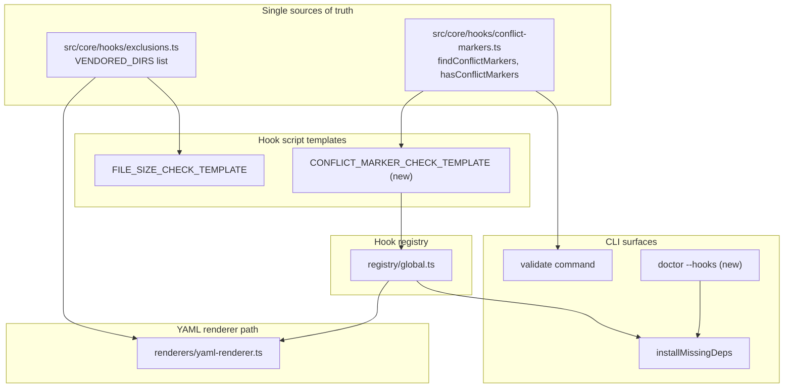
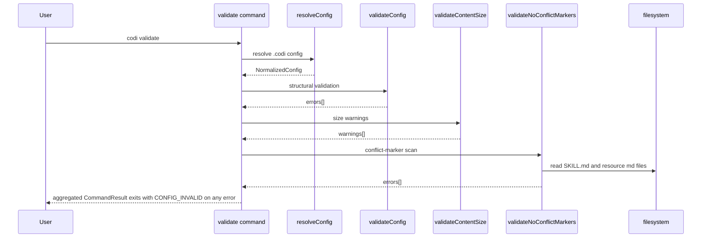
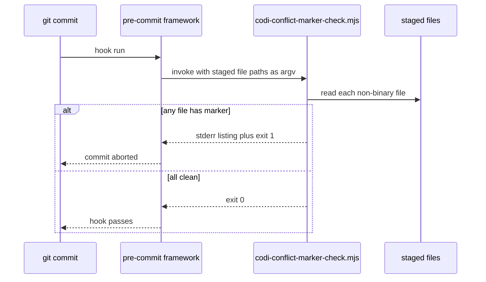
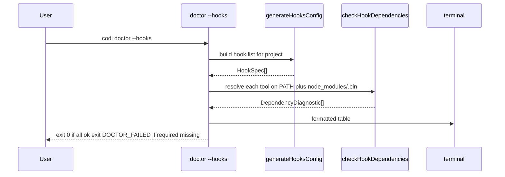

# Hook System Gap Fixes — Vendored Exclusions, Conflict Markers, Diagnostics

- **Date**: 2026-04-29 15:00
- **Document**: 20260429_1500_SPEC_hook-gap-fixes.md
- **Category**: SPEC
- **Status**: Awaiting final approval before plan-writer invocation
- **Target branch**: `feat/hook-gap-fixes` → PR to `develop`
- **Predecessor**: `docs/20260428_1430_SPEC_precommit-multilanguage-redesign.md` (PR #85, merged)

---

## 1. Executive Summary

Three gaps remain in the post-#85 hook system. They produced a real user-visible failure: a commit was blocked by a chain of unrelated hook errors that masked a merge-conflict marker silently sitting inside an installed skill file.

This SPEC ships four targeted deltas in one PR:

- **A.1** — Add the missing agent directories (`.agents`, `.claude`, `.codex`, `.cursor`, `.windsurf`, `.cline`) to the YAML renderer's `exclude:` regex so per-language hooks stop linting vendored agent content.
- **A.2** — Centralize the vendored-dirs list into a single source of truth (`src/core/hooks/exclusions.ts`) consumed by both `yaml-renderer.ts` and `FILE_SIZE_CHECK_TEMPLATE`. The two lists already drifted once.
- **B** — Detect git merge-conflict markers in installed `.codi/` artifacts (via `codi validate`) and in staged files (via a new global pre-commit hook). Both consumers share one pure module (`src/core/hooks/conflict-markers.ts`).
- **C** — Tighten the install-hint UX: group non-npm missing dependencies by inferred package manager (pip / brew / gem / go / cargo) for batched commands; add `codi doctor --hooks` so tool availability becomes introspectable post-init.

Three commits, one PR, no architectural rework. Total scope ~400 LOC + tests.

## 2. Problem Statement

### 2.1 Issues observed in the wild

| # | Issue | Evidence |
|---|---|---|
| P1 | Generated agent dirs (`.agents/`, `.claude/`, `.codex/`, `.cursor/`, `.windsurf/`, `.cline/`) are linted by per-language hooks because the YAML `exclude:` regex covers only `.codi/` | `src/core/hooks/renderers/yaml-renderer.ts:20` — current regex omits agent dirs; user-reported pre-commit failures on `.cursor/skills/<x>/template.ts`, `.codex/skills/<x>/scripts/*.py` |
| P2 | Vendored-dirs list lives in two places: the YAML renderer regex (`yaml-renderer.ts:20`) and the `FILE_SIZE_CHECK_TEMPLATE` EXCLUDED list (`hook-templates.ts:189`). The two lists already differ — `.codi/` was added to FILE_SIZE_CHECK but the YAML renderer was not updated in lockstep | direct file inspection |
| P3 | Git merge-conflict markers (`<<<<<<<`, `=======`, `>>>>>>>`, `\|\|\|\|\|\|\|`) inside installed `.codi/` artifact files (e.g., `.codi/skills/codi-dev-operations/SKILL.md`) pass silently through `codi validate`, `codi generate`, and pre-commit. The user's commit was only blocked by *unrelated* hook failures; the marker itself was invisible to codi. The skill is then loaded into agent context with corrupted content | user report; `src/core/config/validator.ts` has no marker scan; no pre-commit hook scans for markers |
| P4 | `installMissingDeps` lists each non-npm missing tool as its own `InstallGroup` with an empty command. A user missing `bandit`, `gitleaks` (shell-renderer path), and `clang-format` sees three separate fragments instead of `pip install bandit ; brew install gitleaks clang-format` | `src/core/hooks/hook-dep-installer.ts:33-44` |
| P5 | No way to re-check hook tool availability after `codi init` finishes other than triggering a commit. `codi doctor` exists but has no per-hook diagnostic mode | `src/cli/doctor.ts` — no `--hooks` flag |

### 2.2 Why these matter long-term

P1 and P2 are the same bug class: duplicated lists drift. Fixing P1 in isolation accepts that the next agent CLI to gain traction (Aider, Continue, OpenHands, etc.) will trigger the same failure mode for users who add it to their project. P2 is the structural fix.

P3 is the most impactful. A conflict marker inside `SKILL.md` corrupts every prompt sent to the agent until the user notices manually. Detection has to be cheap and run automatically.

P4 and P5 are operational hygiene: hook problems should be discovered through dedicated tools, not through commit failures. Today they are not.

## 3. Architecture



Two new pure-data modules; three new consumer wires; one new CLI flag. No existing module changes shape — they swap inline literals for imports.

### 3.1 Layer separation

| Layer | Responsibility | Modules |
|---|---|---|
| Data | Canonical lists and pure scanners with no I/O | `exclusions.ts`, `conflict-markers.ts` |
| Renderers | Pure functions: spec → file content | `yaml-renderer.ts`, hook script templates |
| Registry | Hook catalog with per-runner emissions | `registry/global.ts` |
| CLI | User-facing commands and prompts | `cli/validate.ts`, `cli/doctor.ts`, `hook-dep-installer.ts` |

The data layer is the only layer that knows what counts as "vendored" or "conflicted." Every other layer is a consumer.

## 4. Components

### 4.1 `src/core/hooks/exclusions.ts` (new — Delta A.2)

```typescript
export const VENDORED_DIRS = [
  "node_modules",
  ".venv",
  "venv",
  "dist",
  "build",
  "coverage",
  ".next",
  ".codi",
  ".agents",
  ".claude",
  ".codex",
  ".cursor",
  ".windsurf",
  ".cline",
] as const;

export type VendoredDir = (typeof VENDORED_DIRS)[number];

/** Pre-commit YAML `exclude:` value: anchored regex matching any path under a vendored dir. */
export function buildVendoredDirsRegex(): string {
  const escaped = VENDORED_DIRS.map((d) => d.replace(/\./g, "\\."));
  return `^(${escaped.join("|")})/`;
}

/** Comma-separated literal for `{{VENDORED_DIRS_PATTERNS}}` template substitution. */
export function buildVendoredDirsTemplatePatterns(): string {
  return VENDORED_DIRS.map((d) => `/^${d.replace(/\./g, "\\\\.")}\\\\//`).join(", ");
}
```

Two builders because the YAML output needs a single anchored regex string while the template script needs an array literal of `RegExp` patterns. Both derive from the same source array — adding one entry covers both call sites.

### 4.2 `src/core/hooks/conflict-markers.ts` (new — Delta B)

```typescript
const MARKER_RE = /^(<{7}|={7}|>{7}|\|{7})( |$)/;

export type MarkerKind = "ours" | "base" | "theirs" | "sep";

export interface MarkerHit {
  /** 1-based line number */
  line: number;
  kind: MarkerKind;
  text: string;
}

/** Scan text for git merge-conflict markers. Returns all hits (empty array = clean). */
export function findConflictMarkers(text: string): MarkerHit[] {
  const lines = text.split("\n");
  const hits: MarkerHit[] = [];
  for (let i = 0; i < lines.length; i++) {
    const line = lines[i] ?? "";
    const match = MARKER_RE.exec(line);
    if (!match) continue;
    const sigil = match[1]!;
    let kind: MarkerKind = "sep";
    if (sigil.startsWith("<")) kind = "ours";
    else if (sigil.startsWith(">")) kind = "theirs";
    else if (sigil.startsWith("|")) kind = "base";
    hits.push({ line: i + 1, kind, text: line });
  }
  return hits;
}

/** Short-circuit fast path for callers that only need yes/no. */
export function hasConflictMarkers(text: string): boolean {
  return MARKER_RE.test(text) ? findConflictMarkers(text).length > 0 : false;
}
```

Detects all four marker variants. 3-way merges (`merge.conflictStyle = diff3`) emit `|||||||` ancestor lines — including these prevents false negatives when users have `diff3` configured.

### 4.3 `CONFLICT_MARKER_CHECK_TEMPLATE` (new — Delta B)

Added to `src/core/hooks/hook-templates.ts`. The marker regex and detection logic are inlined into the template (consistent with how other templates inline their checks) so the runtime hook has no Codi runtime dependency:

```typescript
export const CONFLICT_MARKER_CHECK_TEMPLATE = `#!/usr/bin/env node
// Codi conflict-marker checker
import fs from 'fs';

const MARKER_RE = /^(<{7}|={7}|>{7}|\\|{7})( |$)/;
const BINARY_EXT = [/\\.png$/i, /\\.jpe?g$/i, /\\.gif$/i, /\\.pdf$/i, /\\.ttf$/i, /\\.woff2?$/i, /\\.ico$/i, /\\.webp$/i, /\\.zip$/i, /\\.tar(\\.gz)?$/i];

const files = process.argv.slice(2).filter(f => !BINARY_EXT.some(p => p.test(f)));
const findings = [];
for (const file of files) {
  try {
    const content = fs.readFileSync(file, 'utf-8');
    if (!MARKER_RE.test(content)) continue;
    const lines = content.split('\\n');
    for (let i = 0; i < lines.length; i++) {
      if (MARKER_RE.test(lines[i] ?? '')) {
        findings.push({ file, line: i + 1, text: (lines[i] ?? '').slice(0, 80) });
      }
    }
  } catch { /* unreadable — skip */ }
}
if (findings.length === 0) process.exit(0);

console.error('Git merge-conflict markers detected:');
for (const f of findings) console.error(\`  \${f.file}:\${f.line}  \${f.text}\`);
console.error('\\nResolve the conflict, re-stage the file, and commit again. Do not bypass with --no-verify.');
process.exit(1);
`;
```

### 4.4 New `HookSpec` in `registry/global.ts` (Delta B)

```typescript
{
  name: "conflict-marker-check",
  language: "global",
  category: "meta",
  files: "**/*",
  stages: ["pre-commit"],
  required: true,
  shell: {
    command: `node .git/hooks/${PROJECT_NAME}-conflict-marker-check.mjs`,
    passFiles: true,
    modifiesFiles: false,
    toolBinary: "node",
  },
  preCommit: {
    kind: "local",
    entry: `node .git/hooks/${PROJECT_NAME}-conflict-marker-check.mjs`,
    language: "system",
  },
  installHint: { command: "" },
}
```

Wired into `hook-config-generator.ts` Stage-1 (instant pattern checks alongside `staged-junk-check` and `file-size-check`) so it runs before any I/O-heavy work. `kind: 'local'` because there is no upstream pre-commit repo whose check matches our requirements (covering `|||||||` and producing the same diagnostic in both runners).

### 4.5 `validateNoConflictMarkers` step in `validator.ts` (Delta B)

```typescript
async function validateNoConflictMarkers(
  config: NormalizedConfig,
  projectRoot: string,
): Promise<ProjectError[]> {
  const errors: ProjectError[] = [];
  const targets = collectArtifactFilePaths(config, projectRoot);
  for (const filePath of targets) {
    const content = await fs.readFile(filePath, "utf-8").catch(() => null);
    if (content === null) continue;
    const hits = findConflictMarkers(content);
    if (hits.length === 0) continue;
    errors.push(
      createError("E_CONFLICT_MARKERS", {
        message: `Git merge-conflict markers in ${path.relative(projectRoot, filePath)} (line ${hits[0]!.line})`,
      }),
    );
  }
  return errors;
}
```

`collectArtifactFilePaths` enumerates the on-disk artifact source files for the resolved config: `.codi/skills/<skill>/SKILL.md`, all `.md` files under each skill directory (skill resources), `.codi/agents/*.md`, `.codi/rules/*.md`. The validator becomes async — `validateHandler` already supports a Result-shape return; the change is wiring `await` through.

A new error code `E_CONFLICT_MARKERS` is registered. Exit code: `EXIT_CODES.CONFIG_INVALID` (existing semantic for malformed artifact contents).

**Sync → async transition.** `validateConfig` becomes async. The two call sites that need `await` wired through:
- `src/core/config/resolver.ts:48` — `const validationErrors = validateConfig(config);`
- `src/cli/validate.ts:37` — `const validationErrors = validateConfig(configResult.data);`

Both already exist inside `async` functions; the change is mechanical (`await`). Tests in `tests/unit/core/config/validator.test.ts` need their assertions wrapped in `await`.

### 4.6 Package-manager grouping in `hook-dep-installer.ts` (Delta C.1)

```typescript
type PackageManager = "npm" | "pip" | "brew" | "gem" | "go" | "cargo" | "manual";

function inferPackageManager(installHint: string): PackageManager {
  const trimmed = installHint.trimStart();
  if (trimmed.startsWith("pip install ") || trimmed.startsWith("pip3 install ")) return "pip";
  if (trimmed.startsWith("brew install ")) return "brew";
  if (trimmed.startsWith("gem install ")) return "gem";
  if (trimmed.startsWith("go install ")) return "go";
  if (trimmed.startsWith("cargo install ") || trimmed.startsWith("rustup component add ")) return "cargo";
  return "manual";
}

function extractPackages(hint: string, pm: PackageManager): string[] {
  // pip install ruff pyright -> ["ruff", "pyright"]
  // brew install gitleaks clang-format -> ["gitleaks", "clang-format"]
  // returns [] for manual
}
```

`groupByPackageManager` is extended: non-npm deps are grouped by `inferPackageManager` and emitted as one `InstallGroup` per manager with a batched command. The `manual` group preserves current per-tool listing for tools whose install hints don't match a known PM (e.g., `Install .NET SDK from https://dot.net`).

User-visible output transitions from:

```
Missing system tools — install manually before committing:
  bandit: pip install bandit
  gitleaks: brew install gitleaks
  clang-format: brew install clang-format
```

to:

```
Missing system tools — install manually before committing:
  pip install bandit
  brew install gitleaks clang-format
```

### 4.7 `codi doctor --hooks` (Delta C.2)

New flag on `doctor`. When `--hooks` is set, the handler:

1. Resolves config and computes hooks via `generateHooksConfig(flags, languages, manifest)`
2. Calls `checkHookDependencies(hooksConfig.hooks, projectRoot)` → `DependencyDiagnostic[]`
3. Renders a table to stdout (or JSON when `--json` is set)
4. Exits 0 if no required tools are missing, `EXIT_CODES.DOCTOR_FAILED` otherwise

```
$ codi doctor --hooks
Hook dependencies for current configuration:

  ok       prettier       format     /Users/x/proj/node_modules/.bin/prettier
  ok       eslint         lint       /Users/x/proj/node_modules/.bin/eslint
  warning  swiftformat    format     missing — brew install swiftformat
  error    gitleaks       security   missing — brew install gitleaks (required)

1 required tool missing. Run installation commands above, then re-run codi doctor --hooks.
```

The flag is additive: bare `codi doctor` keeps its current behavior. `--ci` and `--hooks` compose (CI-mode renders JSON-friendly output regardless of TTY).

## 5. Data Flow

### 5.1 `codi validate` with conflict-marker scan



### 5.2 Pre-commit hook execution (conflict-marker-check)



### 5.3 `codi doctor --hooks`



## 6. Error Handling

| Failure | Detection | Behavior |
|---|---|---|
| Vendored-dir regex fails to compile (build-time bug) | unit test on `buildVendoredDirsRegex` parses without throwing | test failure blocks merge |
| YAML renderer emits drifted exclude (regression) | golden-file test on YAML output | test failure blocks merge |
| Conflict marker found in staged file | hook script regex match | exit 1, list `path:line text`, suggest "resolve and re-stage; do not use --no-verify" |
| Conflict marker found in `.codi/` artifact during validate | `findConflictMarkers` returns hits | `E_CONFLICT_MARKERS` ProjectError, exit `CONFIG_INVALID` |
| Artifact file unreadable during validate | catch on `fs.readFile` | skip silently (consistent with other text scans) |
| Binary file with bytes resembling markers | excluded by extension list (`.png`, `.pdf`, `.ttf`, `.woff2`, `.zip`, etc.) | not scanned |
| `inferPackageManager` returns "manual" for unknown hint | always permitted | falls back to per-tool listing |
| `codi doctor --hooks` cannot resolve config | `resolveConfig` returns errors | exit `CONFIG_NOT_FOUND` or `CONFIG_INVALID` (existing behavior) |
| `codi doctor --hooks` runs in a project without hooks installed | `generateHooksConfig` returns empty | print "no hooks configured" and exit 0 |

## 7. Testing Strategy

### 7.1 Test pyramid

| Level | Module | Test type | Fixtures |
|---|---|---|---|
| Unit | `exclusions.ts` | regex builder produces expected literal; every dir present | `tests/unit/hooks/exclusions.test.ts` (new) |
| Unit | `conflict-markers.ts` | clean / 2-way / 3-way diff3 / nested / CRLF / multi-marker / no false positives on `<<<` in code blocks of unrelated length | `tests/unit/hooks/conflict-markers.test.ts` (new) |
| Golden | `yaml-renderer.ts` | output regex contains all 14 vendored dirs; byte-identical to expected | extend existing `tests/unit/hooks/yaml-renderer.test.ts` |
| Golden | `FILE_SIZE_CHECK_TEMPLATE` rendered into hook | EXCLUDED literal contains all vendored patterns | extend existing `tests/unit/hooks/hook-installer.test.ts` |
| Unit | `hook-dep-installer.ts` | `inferPackageManager` for each manager + manual fallback; `groupByPackageManager` produces batched groups | extend existing tests |
| Unit | `cli/doctor.ts` | `--hooks` happy path, with-missing-tools, JSON mode, no-hooks-installed | extend existing `tests/unit/cli/doctor.test.ts` |
| Integration | `validator.ts` | fixture project with `<<<<<<<` in `.codi/skills/foo/SKILL.md` → `validate` exits non-zero with `E_CONFLICT_MARKERS` | `tests/integration/validate-conflict-markers.test.ts` (new) |
| Integration | `conflict-marker-check` hook | spawn temp project, install hooks, stage a file with markers, `git commit` → exit 1 with marker output | `tests/integration/hook-conflict-markers.test.ts` (new) |

### 7.2 Bug-finder cases

1. Project with a TypeScript file under `.cursor/skills/<x>/template.ts` and a Python file under `.codex/skills/<x>/scripts/foo.py` staged → no eslint/prettier/ruff/pyright complaints (Delta A regression — fixture mirrors the actual layout produced by `codi generate` for non-Claude agents).
2. `FILE_SIZE_CHECK_TEMPLATE` and `yaml-renderer.ts` produce identical vendored-dir coverage (Delta A.2 SSoT proof).
3. `<<<<<<<` inside `.codi/skills/codi-dev-operations/SKILL.md` → `codi validate` fails with line number (Delta B).
4. `<<<<<<<` inside a staged `src/foo.ts` → pre-commit hook blocks the commit (Delta B).
5. `||||||| ancestor` (diff3 style) detected (Delta B 3-way coverage).
6. Conflict marker on a Windows-line-ending file (`\r\n`) detected (Delta B).
7. Non-conflict `<<<<<<<` inside a `.png` not flagged (Delta B binary skip).
8. Three missing tools (`bandit` + `gitleaks` + `clang-format`) → `installMissingDeps` prints two batched commands (`pip install bandit`, `brew install gitleaks clang-format`) (Delta C.1).
9. Tool with unknown install hint (`Install .NET SDK from https://dot.net`) → falls back to per-tool listing (Delta C.1 fallback).
10. `codi doctor --hooks` in a project missing `eslint` (required) → exits `DOCTOR_FAILED` with the install hint in the table (Delta C.2).

### 7.3 Properties

- **SSoT property**: every dir in `VENDORED_DIRS` is matched by `buildVendoredDirsRegex` and by the rendered `FILE_SIZE_CHECK_TEMPLATE` EXCLUDED list. Asserted by parametric test.
- **Idempotency property**: `findConflictMarkers(text).length === 0 ⟺ hasConflictMarkers(text) === false`. Asserted on randomized strings.

## 8. Rollout — Single PR, Three Commits

Branch: `feat/hook-gap-fixes` (already created from `origin/develop`). Target: `develop`.

| # | Commit | Scope | Approx LOC |
|---|---|---|---|
| 1 | `refactor(hooks): centralize vendored-dir exclusions in single source of truth` | New `exclusions.ts`, refactor `yaml-renderer.ts` to import builder, refactor `FILE_SIZE_CHECK_TEMPLATE` to use `{{VENDORED_DIRS_PATTERNS}}` substitution, add 6 missing agent dirs, golden-file regression tests | ~120 |
| 2 | `feat(hooks): conflict-marker detection in validate and pre-commit` | New `conflict-markers.ts`, new `CONFLICT_MARKER_CHECK_TEMPLATE`, new `HookSpec` in `registry/global.ts`, new `validateNoConflictMarkers` step in `validator.ts`, error code `E_CONFLICT_MARKERS`, hook wiring in `hook-config-generator.ts`, integration tests | ~250 |
| 3 | `feat(hooks): batched install hints and codi doctor --hooks` | `inferPackageManager` + grouping in `hook-dep-installer.ts`, `--hooks` flag on `cli/doctor.ts`, formatted table renderer, JSON mode, doctor unit tests | ~150 |

Three commits, three independent concerns, no cross-dependencies. PR-level title: `feat(hooks): vendored-exclude SSoT, conflict-marker detection, and doctor --hooks`.

### 8.1 Risk matrix

| Risk | Mitigation |
|---|---|
| Regex change in commit 1 over-matches and excludes legitimate files | Anchored regex (`^(<dir>)/`) only matches directory prefixes, not arbitrary paths. Golden-file tests assert exact behavior |
| Conflict-marker false positives on unrelated files (e.g., a markdown doc explaining git conflicts) | Marker regex requires exactly 7 sigil chars followed by space-or-EOL. `<<<<<<<` inside fenced code blocks in `.md` is a known false positive class — accepted as the cost of catching real corruptions; users can `git commit --no-verify` only after explicit confirmation (existing prevention rule) |
| Hook script becomes runtime-dependent on Codi internals | Template inlines marker regex and detection — script has zero imports beyond `fs` |
| `validateNoConflictMarkers` becomes slow on large `.codi/` trees | Targets only `.md` artifacts (skill resources, agent files, rules); typical project has <100 files; budget is <50ms |
| `codi doctor --hooks` regresses bare-doctor output | `--hooks` is an additive branch in the handler; bare doctor path unchanged. Existing doctor tests remain |
| `inferPackageManager` mis-categorizes a real hint | Whitelist of known prefixes; everything else falls into `manual` (current behavior) — no regression possible for unknown hints |

## 9. Out of Scope

Deliberately deferred:

- **Auto-installing non-npm tools** — `installMissingDeps` will not invoke `pip`/`brew`/`gem`/`go`/`cargo`. Users run those commands themselves. Auto-install for non-npm tools requires per-OS detection, sudo handling, and PATH manipulation; YAGNI for the actual problem reported.
- **`.codiignore` user-defined exclusions** — users can already add custom `exclude:` patterns to their own `.pre-commit-config.yaml` (the YAML renderer respects user-owned keys); no new config file needed.
- **Conflict-marker false-positive suppression in `.md` fenced code blocks** — accepted false-positive class; the cost of fenced-block parsing exceeds the benefit. Users with the rare case can rename or escape the line.
- **Conflict-marker scan on `dist/` or `build/` outputs during `validate`** — the validator targets source artifacts, not build artifacts. Scan during `validate` is bounded to artifact source paths.
- **`codi doctor --hooks --fix`** — would auto-run install commands. Future PR if demand emerges.
- **Telemetry on hook tool drift** — out of scope; could be a future doctor enhancement.

## 10. Decisions Resolved

| Decision | Resolution | Rationale |
|---|---|---|
| Author vendored-dirs as list or as regex literal | List of strings + derived regex builder | Matches the `{{MAX_LINES}}` template substitution pattern already in use; list is testable and extensible without escape hazards |
| Single SSoT or two carefully synchronized lists | Single SSoT in `exclusions.ts` | Lists already drifted once (the bug we're fixing); SSoT is the structural fix |
| Conflict-marker hook upstream or local | Local (`kind: 'local'`) | Need to handle `\|\|\|\|\|\|\|` (3-way diff3) and produce identical output in both runners; pure-Node script is simpler than relying on `pre-commit/pre-commit-hooks::check-merge-conflict` which doesn't run in the standalone shell-renderer path |
| `validate` scope for conflict markers | `.codi/` artifact text files only | Validator's contract is artifact integrity; build outputs and user source files are out of scope (the pre-commit hook covers user source files) |
| `inferPackageManager` allowlist or registry mapping | Allowlist of known prefixes | Existing `installHint.command` strings already follow these prefixes; adding a registry of `(tool → pm)` would duplicate intent. Allowlist falls through cleanly |
| `codi doctor --hooks` as flag or as subcommand | Flag on existing doctor | Doctor already aggregates project-health checks; `--hooks` is a filter, not a separate concept |
| Block on bare `<<<<<<<` or only with content following | Match exactly 7 sigil chars + space-or-EOL | Git emits `<<<<<<< HEAD\n` and `<<<<<<<\n`; both forms are caught. Random `<<<<<<<<<` (8 chars) in code is not a conflict marker, and the regex correctly rejects it |
| New error code | `E_CONFLICT_MARKERS` | Semantically distinct from `E_CONFIG_INVALID` (which means structural corruption); reuses `EXIT_CODES.CONFIG_INVALID` for the exit code (same severity) |

## 11. Files Touched (Summary)

New:
- `src/core/hooks/exclusions.ts`
- `src/core/hooks/conflict-markers.ts`
- `tests/unit/hooks/exclusions.test.ts`
- `tests/unit/hooks/conflict-markers.test.ts`
- `tests/integration/validate-conflict-markers.test.ts`
- `tests/integration/hook-conflict-markers.test.ts`

Modified:
- `src/core/config/resolver.ts` (await `validateConfig`)
- `src/cli/validate.ts` (await `validateConfig`)
- `src/core/hooks/renderers/yaml-renderer.ts` (import builder, replace inline regex)
- `src/core/hooks/hook-templates.ts` (replace inline EXCLUDED in `FILE_SIZE_CHECK_TEMPLATE` with `{{VENDORED_DIRS_PATTERNS}}` substitution; add `CONFLICT_MARKER_CHECK_TEMPLATE`)
- `src/core/hooks/hook-installer.ts` (substitute `{{VENDORED_DIRS_PATTERNS}}` when rendering `FILE_SIZE_CHECK_TEMPLATE`; emit conflict-marker template when its hook is enabled)
- `src/core/hooks/registry/global.ts` (new `conflict-marker-check` HookSpec)
- `src/core/hooks/hook-config-generator.ts` (wire `conflict-marker-check` into Stage-1)
- `src/core/config/validator.ts` (new `validateNoConflictMarkers` step; aggregate into `validateHandler`)
- `src/core/output/error-catalog.ts` (register `E_CONFLICT_MARKERS` entry in `ERROR_CATALOG`)
- `src/core/hooks/hook-dep-installer.ts` (`inferPackageManager`, batched grouping)
- `src/cli/doctor.ts` (`--hooks` flag, table renderer, JSON mode)
- `tests/unit/hooks/yaml-renderer.test.ts` (assert agent dirs in regex)
- `tests/unit/hooks/hook-installer.test.ts` (assert FILE_SIZE EXCLUDED includes all vendored dirs)
- `tests/unit/hooks/hook-dep-installer.test.ts` (`inferPackageManager` cases, batched grouping)
- `tests/unit/cli/doctor.test.ts` (`--hooks` cases)
- `CHANGELOG.md` (Added: vendored exclusion SSoT, conflict-marker detection, `codi doctor --hooks`. Fixed: agent dirs not excluded from per-language hooks)

Counts: 6 new files, 11 modified files, ~520 LOC including tests.

## 12. Sources

This SPEC builds on the post-#85 architecture:
- `docs/20260428_1430_SPEC_precommit-multilanguage-redesign.md` — predecessor spec
- `src/core/hooks/hook-spec.ts` — HookSpec shape
- `src/core/hooks/registry/*.ts` — current hook registry
- `src/core/hooks/renderers/yaml-renderer.ts` — YAML emission
- `src/core/hooks/hook-templates.ts` — script templates
- `src/core/hooks/hook-dep-installer.ts` — current install flow
- `src/cli/doctor.ts`, `src/cli/validate.ts` — current CLI surfaces

External references:
- pre-commit framework `repos:` and `exclude:` semantics — pre-commit.com/index.html
- Git merge-conflict marker formats including `merge.conflictStyle = diff3` — git-scm.com/docs/git-merge#_how_conflicts_are_presented

---

**Status**: Awaiting final approval. After approval the next step is invoking `codi-plan-writer` to break the three commits into atomic 2-5 minute TDD tasks with exact file paths, complete code, and runnable verification commands.
