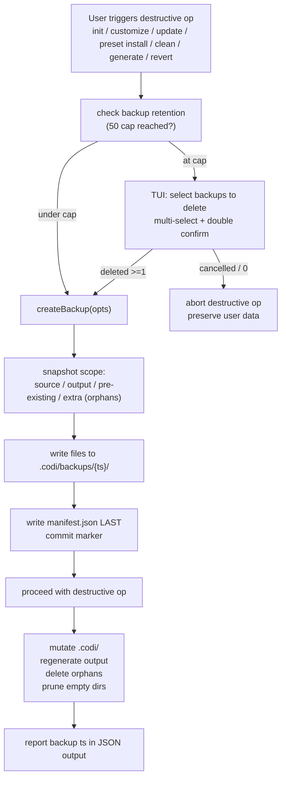
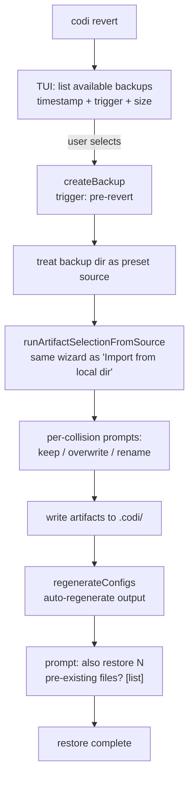
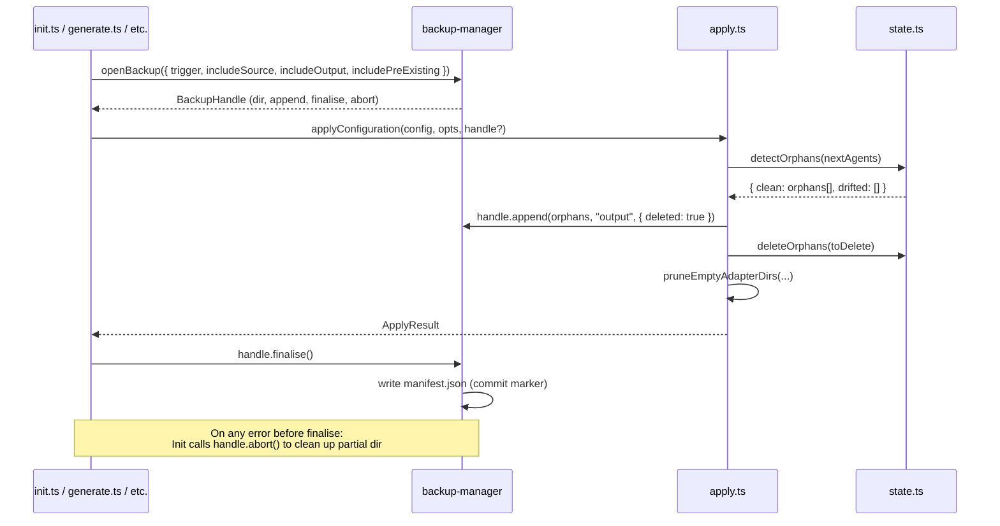

# Backup overhaul — design spec

- **Date**: 2026-04-30 19:31
- **Document**: 20260430*193109*[PLAN]\_backup-overhaul.md
- **Category**: PLAN
- **Status**: Proposed (pending user review)
- **Target release**: v2.14.2 (PR #93)

## Problem

Two related issues observed in the current customize/init/generate flows:

1. **Agent-folder removal is incomplete.** When a user unselects a coding agent during `codi init --customize`, codi's orphan-detection deletes the generated files but leaves the now-empty parent directories behind (`.cursor/`, `.cursor/rules/`, `.cursor/skills/`, etc.). The user sees the agent's folder still on disk and assumes the unselect didn't work.

2. **Backups are missing or partial for destructive operations.** Today only `codi generate` calls `createBackup`. `codi init`, `codi init --customize`, `codi update`, `codi preset install`, and `codi clean --reset` all mutate state without creating a recoverable snapshot. Even when a backup is created, only files tracked in `state.json` are captured — first-time init never sees a hand-written `CLAUDE.md` / `AGENTS.md` and clobbers it. Orphan deletions inside the same generation run are not snapshotted at all.

These bugs together mean a user can lose hand-written agent config or custom-edited rules with no built-in recovery path.

## Findings

Investigation in `src/core/backup/backup-manager.ts`, `src/core/generator/apply.ts`, and `src/cli/clean.ts` confirms:

- `createBackup` reads `state.json` and snapshots only known generated output to `.codi/backups/<ISO-timestamp>/<relpath>` plus a `manifest.json`. Capped at `MAX_BACKUPS` (currently 5) FIFO.
- `detectOrphans` (state.ts:215) DOES recognize fully-removed agents — when an agent is absent from `nextAgents`, all its previously-tracked files become orphans and are deleted by `deleteOrphans` (apply.ts:106-118).
- The remaining gap on agent removal is **empty parent directories** — there's no machinery wired into the apply pipeline that walks parent dirs and removes them when empty.
- `clean.ts` already derives `AGENT_SUBDIRS` and `AGENT_FILES` from each adapter's `paths` declaration via `ALL_ADAPTERS`. The same pattern is the natural source of truth for parent-dir cleanup.
- A `codi revert` command exists (`src/cli/revert.ts`) but is limited to the file-path manifest format and offers no TUI selection or pre-revert snapshot.

## Goals

- Every destructive operation creates a complete, restorable snapshot before mutating disk.
- Backups capture both `.codi/` source state AND user-facing output, plus pre-existing user content at adapter target paths and orphan-deleted files within the same operation.
- `codi revert` is a true undo: it creates its own pre-revert snapshot, then restores the chosen backup using the same code paths as importing a preset from any external source.
- Empty agent directories are pruned after orphan deletion, never silently leaving husks behind.
- Retention is bounded (50 backups) with an interactive TUI for selecting which to delete when the cap is reached.

## Non-goals

- Cross-version backup migration. We do not support restoring a backup created by `codi-cli@1.x` into `codi-cli@2.x`. The manifest carries `codiVersion` for diagnostic purposes only.
- Multi-host or cloud-synced backups. `.codi/backups/` is local-only and gitignored.
- Compression. Backups copy raw files. Disk impact is acceptable at the 50-backup cap (estimated ≤500 MB worst case for a heavy project; typical ≤50 MB).
- Selective field-level diffing. Restore operates on whole files, not on YAML keys or rule sections.

## Architecture overview





## Detailed design

### Fix A — Empty-directory cleanup after orphan deletion

**Where**: `src/core/generator/apply.ts`, after `deleteOrphans` (line 112-ish).

**New helper** `pruneEmptyAdapterDirs(projectRoot, deletedPaths, removedAgentIds)`:

1. Build a candidate set of directories from two sources:
   - Walk parents of every `deletedPaths` entry up to (but not including) `projectRoot`.
   - For each `removedAgentId` (an agent in prevState but absent from nextAgents), add the adapter's declared `paths.{configRoot, rules, skills, agents}` if those paths point inside the project.
2. Sort the set deepest-first (longest path first) so child dirs are removed before parents.
3. For each candidate: call `fs.rmdir(dir)` (without `recursive: true`). The call fails harmlessly with `ENOTEMPTY` if the dir contains user content, which is the desired safety. Swallow `ENOENT` (already gone).
4. Reuse the `isSafeSubdir` guard from `clean.ts` to refuse to remove anything outside the project root or `..`-traversable.

**Effect**: unselecting `cursor` removes the entire empty `.cursor/` subtree. A user file inside `.cursor/` blocks removal — correct behavior, never delete unknown content.

**Returns**: array of removed dir paths so the caller can include them in the JSON output for visibility.

### Fix B — Wire `createBackup` into `init`

**Where**: `src/cli/init.ts`, ~line 580 (just before `applyConfiguration`).

**Change**: when `configResult.ok && !options.dryRun`, call `createBackup(projectRoot, configDir, opts)` and surface the returned timestamp on `result.data.backup`.

**`opts.trigger`** depends on the path:

- Fresh init (no pre-existing `.codi/`) with hand-written agent files at adapter targets → `init-first-time` (output + pre-existing scope).
- Modify/customize flow → `init-customize` (source + output scope).

### Fix C — Snapshot pre-existing files + orphan deletions in the same backup

**Where**: `src/core/backup/backup-manager.ts`.

**New types** (all exported from `src/core/backup/backup-manager.ts`):

```ts
export type BackupTrigger =
  | "init-first-time"
  | "init-customize"
  | "generate"
  | "update"
  | "preset-install"
  | "clean-reset"
  | "pre-revert";

export type BackupScope = "source" | "output";

export interface SnapshotOptions {
  trigger: BackupTrigger;
  /** Capture generated agent files (default: true). */
  includeOutput?: boolean;
  /** Capture .codi/ source dir (default: false; set by customize/update/preset-install/clean-reset/pre-revert). */
  includeSource?: boolean;
  /** Probe ALL_ADAPTERS target paths for files NOT in state.json (default: false; set by init-first-time and pre-revert). */
  includePreExisting?: boolean;
  /** Retention strategy when at MAX_BACKUPS:
   *   - "auto": interactive when stdout.isTTY && !options.json, else "evict-oldest"
   *   - "interactive": always show TUI; if cancelled, return error
   *   - "evict-oldest": silently delete the oldest backup
   *   Default: "auto". */
  retention?: "auto" | "interactive" | "evict-oldest";
}

export interface BackupManifestV2 {
  version: 2;
  timestamp: string; // ISO 8601 with [:.] -> "-": e.g. "2026-04-30T19-20-15-123Z"
  trigger: BackupTrigger;
  codiVersion: string;
  files: BackupManifestEntry[];
}

export interface BackupManifestEntry {
  /** Path relative to projectRoot. Mirrored into <backupDir>/<path> on disk. */
  path: string;
  /** "source" = file originally lived under .codi/. "output" = generated agent file outside .codi/. */
  scope: BackupScope;
  /** True when this file existed at an adapter target path BEFORE codi tracked it (no state.json entry). */
  preExisting?: boolean;
  /** True when this file was about to be (or was) deleted by orphan logic in the same operation. */
  deleted?: boolean;
}

/** Returned from createBackup so callers can append to the same backup
 *  during a single destructive operation (e.g. apply.ts adds orphans
 *  AFTER detectOrphans runs but BEFORE the manifest is finalised). */
export interface BackupHandle {
  /** Absolute path to the backup directory under .codi/backups/. */
  dir: string;
  /** Backup timestamp / ID. */
  timestamp: string;
  /** Append additional files to this open backup. Idempotent on duplicate paths. */
  append(
    paths: string[],
    scope: BackupScope,
    opts?: { deleted?: boolean; preExisting?: boolean },
  ): Promise<void>;
  /** Finalise: write manifest.json LAST as commit marker. After this call the backup is sealed. */
  finalise(): Promise<void>;
  /** Abort: remove the partial backup directory. Used when a destructive op fails and we want to clean up. */
  abort(): Promise<void>;
}
```

**`createBackup` shape change** (additive, non-breaking for existing callers):

```ts
// Old (keeping for backwards compat as a thin wrapper):
export function createBackup(projectRoot: string, configDir: string): Promise<string | null>;

// New primary API:
export function openBackup(
  projectRoot: string,
  configDir: string,
  opts: SnapshotOptions,
): Promise<Result<BackupHandle, "retention-cancelled" | "no-files-to-snapshot" | "io-error">>;
```

The legacy `createBackup` remains as a wrapper that calls `openBackup` + immediately calls `finalise()`. Callers that need to append (apply.ts) use `openBackup` directly.

**`openBackup` flow**:

1. Compute initial target-set from selected scopes (source / output / pre-existing). Empty target-set with no `pre-existing` files and no future `append` calls → return `Err("no-files-to-snapshot")` (caller decides if this is a hard failure).
2. **Pre-existing detection scope**: walk EVERY field on `adapter.paths` for each adapter in `ALL_ADAPTERS`:
   - `instructionFile` (e.g. `CLAUDE.md`, `AGENTS.md`)
   - `mcpConfig` (e.g. `.mcp.json`, `.codex/config.toml`)
   - `configRoot`, `rules`, `skills`, `agents` (directories — walk one level deep, skip subdirs)
     For each existing file at those paths NOT recorded in `state.json.agents`: tag `preExisting: true`. Files outside these declared paths are NOT considered pre-existing, even if they exist on disk.
3. Resolve `retention` (`"auto"` → `process.stdout.isTTY && !options.json ? "interactive" : "evict-oldest"`). If at cap:
   - `"interactive"`: invoke `interactiveEvict()` TUI. User cancels or deletes 0 → return `Err("retention-cancelled")`.
   - `"evict-oldest"`: silently delete the oldest backup directory.
4. Create `.codi/backups/<ISO-timestamp>/` and copy initial-set files preserving relative paths.
5. Return `BackupHandle`. Manifest is NOT written yet.
6. Caller may call `handle.append(...)` zero or more times during the destructive operation.
7. Caller calls `handle.finalise()` to **write `manifest.json` LAST** as commit marker. Once the manifest exists, the backup is "sealed" and visible to `listBackups`.
8. If anything goes wrong during the destructive operation, caller calls `handle.abort()` to remove the partial backup dir entirely.

**Listing convention**: `listBackups` SKIPS any backup directory that lacks a finalised `manifest.json`. Garbage-collected by a `pruneIncompleteBackups()` helper called at the start of every `openBackup` (idempotent, safe to repeat).

**Manifest schema (v2)**:

```jsonc
{
  "version": 2,
  "timestamp": "2026-04-30T19-20-15-123Z",
  "trigger": "init-customize",
  "codiVersion": "2.14.2",
  "files": [
    { "path": ".codi/rules/codi-typescript.md", "scope": "source" },
    { "path": ".codi/codi.yaml", "scope": "source" },
    { "path": "CLAUDE.md", "scope": "output" },
    { "path": "AGENTS.md", "scope": "output", "preExisting": true },
    { "path": ".cursor/rules/codi-react.md", "scope": "output", "deleted": true },
  ],
}
```

**Backwards compat**: existing v1 manifests (no `version` field, `files: string[]`) are read-only. `codi revert` reads v1 via a thin shim that converts each path to `{ path, scope: "output" }`. No v1→v2 disk migration. New backups always write v2.

**v1 reader contract** (in `backup-manager.ts`):

```ts
export function readManifest(backupDir: string): Promise<Result<BackupManifestV2>> {
  // 1. Read manifest.json. Missing file → Err("incomplete").
  // 2. If `version === 2` → return as-is.
  // 3. Else (legacy v1: no version, files is string[]): map files to
  //    BackupManifestEntry[] with scope: "output", trigger: "generate"
  //    (best-guess), codiVersion: "<unknown>".
  // 4. Return the normalised v2 shape.
}
```

### Fix D — Snapshot `.codi/` source on customize

**Source-scope file collection** (`collectSourceFiles(configDir)`):

Walk `.codi/` recursively. Include:

```
.codi/codi.yaml
.codi/flags.yaml
.codi/state.json
.codi/operations.json
.codi/preset-lock.json
.codi/artifact-manifest.json
.codi/LICENSE.txt
.codi/rules/**
.codi/skills/**
.codi/agents/**
.codi/mcp-servers/**
.codi/frameworks/**
.codi/hooks/**
```

**Hard-exclude** (NEVER recurse). Defined once in `src/constants.ts` as:

```ts
export const BACKUP_EXCLUDE_DIRS: readonly string[] = [
  ".codi/backups", // would loop forever
  ".codi/.session", // ephemeral process state
  ".codi/feedback", // runtime accumulator
] as const;
```

**Path-matching rule**: a candidate path is excluded iff it equals any entry in `BACKUP_EXCLUDE_DIRS` exactly OR begins with `<entry>/`. This is exact-prefix match on directory names; `.codi/feedback-archive/` is NOT excluded (different name). The walker never recurses into excluded directories — they are stat'd, name-matched, and skipped at the top level.

`backup-manager.ts` and any future tool that walks `.codi/` MUST import `BACKUP_EXCLUDE_DIRS` rather than defining its own list.

**Trigger table** (when source scope is included):

| Command                                           | Trigger           | Scopes                                |
| ------------------------------------------------- | ----------------- | ------------------------------------- |
| `codi init --customize`                           | `init-customize`  | source + output                       |
| `codi update`                                     | `update`          | source + output                       |
| `codi preset install <name>`                      | `preset-install`  | source + output                       |
| `codi clean --reset`                              | `clean-reset`     | source + output                       |
| `codi add ...` (with `--backup`)                  | `add`             | source only                           |
| `codi init` (first time, pre-existing user files) | `init-first-time` | output + pre-existing                 |
| `codi generate`                                   | `generate`        | output (current behavior)             |
| `codi revert <ts>`                                | `pre-revert`      | source + output (whole current state) |

### Backup lifecycle threading — passing the handle through `applyConfiguration`

Orphan deletion happens inside `applyConfiguration`, AFTER the caller has already opened a backup. To capture orphans in the same backup, the handle must be threadable:



**`applyConfiguration` signature change** (additive — `handle` is optional):

```ts
export async function applyConfiguration(
  config: NormalizedConfig,
  projectRoot: string,
  opts: ApplyOptions,
  backupHandle?: BackupHandle, // NEW: optional, threaded from caller
): Promise<Result<ApplyResult>>;
```

Inside `apply.ts`, after `detectOrphans` returns and before `deleteOrphans` is invoked:

```ts
if (backupHandle && toDelete.length > 0) {
  const paths = toDelete.map((o) => o.path);
  await backupHandle.append(paths, "output", { deleted: true });
}
```

This means orphan deletions ALWAYS land in the active backup, never lost to time-of-write. Callers that don't pass a `handle` (legacy code paths) get the existing behavior — no orphan snapshot.

### Error-recovery contract

- If `openBackup` returns `Err("retention-cancelled")` → caller MUST abort the destructive operation with a standardised error message (defined as a constant in `src/constants.ts`):
  ```ts
  export const RETENTION_CANCELLED_ERROR =
    `Backup retention is full and no backups were deleted.\n` +
    `Cannot proceed without a recoverable snapshot.\n` +
    `Run \`codi backup --list\` to inspect existing backups, or run \`codi backup --prune\`\n` +
    `to interactively delete some, then retry.`;
  ```
- If any operation between `openBackup` and `handle.finalise()` throws → caller MUST call `handle.abort()` in a `finally` block to remove the partial backup directory.
- If `handle.finalise()` itself fails (e.g. disk full while writing manifest) → caller surfaces a warning but does NOT undo the destructive operation. The backup is incomplete and will be garbage-collected by `pruneIncompleteBackups()` on the next run; the destructive op already succeeded.

### Symmetry rule — `codi revert` creates its own backup

Every restore creates a `pre-revert` snapshot of the CURRENT project state before any restoration begins. This means:

```
customize          → backup #1 (init-customize)
revert <ts1>       → backup #2 (pre-revert), restore from <ts1>
revert <ts2>       → backup #3 (pre-revert), restore from <ts2>  // returns to post-customize state
```

The user never enters a state they cannot reach again. Backup chains are bounded by `MAX_BACKUPS=50`, which is plenty for normal usage.

### Retention — 50-cap with interactive TUI eviction

**Cap**: `MAX_BACKUPS = 50` global. Single FIFO counter. (Bumped from the current `5` to accommodate the much-higher backup volume introduced by Fixes B + D + the symmetry rule. At 50, a heavy day of `customize` + `generate` + `update` cycles still leaves room for explicit user actions to survive a week. Each backup averages ~500 KB on a typical project, so worst-case disk impact is ≤25 MB. A future `MAX_BACKUP_BYTES` global cap is listed in "Out of scope" if 50 proves insufficient in practice.)

**Eviction trigger**: when `createBackup` is about to create the 51st backup directory.

**TUI flow** (uses the existing `@clack/prompts` multiselect pattern from the init wizard):

```
You have 50 backups (the maximum). Select which to delete:

  ☐  2026-04-30 19:20  init-customize  · 1.2 MB · before adding 3 rules
  ☐  2026-04-30 18:45  generate        · 320 KB · auto
  ☐  2026-04-30 17:10  update          · 1.4 MB · before update
  ...
  ☐  2026-04-25 09:00  init-first-time · 800 KB · pre-existing CLAUDE.md captured

[a] select all   [n] none   space toggle   enter confirm   esc cancel

Selected: 3 backups (3.5 MB)
Delete? [y/N]:  y
This permanently removes the selected backups. Continue? [y/N]:
```

**Cancellation behavior**: if the user cancels the TUI or deletes 0 backups, `createBackup` returns `{ ok: false, reason: "retention-cancelled" }`. Callers MUST abort their destructive operation with a clear message:

```
[ERR] Backup retention is full and no backups were deleted.
      Cannot proceed with `codi customize` without a recoverable snapshot.
      Run `codi revert --list` to inspect existing backups, or delete some
      manually under .codi/backups/, then retry.
```

This makes the safety net non-negotiable: codi never mutates state without a snapshot.

**Non-interactive selection** is driven by `SnapshotOptions.retention`:

| `retention`        | Behavior at cap                                                                                               |
| ------------------ | ------------------------------------------------------------------------------------------------------------- |
| `"auto"` (default) | If `process.stdout.isTTY && !options.json` → interactive TUI. Otherwise → `evict-oldest`.                     |
| `"interactive"`    | Always show TUI. If TTY isn't available, return `Err("retention-cancelled")` immediately (caller must abort). |
| `"evict-oldest"`   | Silently delete the oldest backup directory.                                                                  |

The CI path (`codi generate` in a GitHub Action) hits the `auto` → `evict-oldest` branch because `stdout.isTTY` is false. The interactive path is reserved for direct user invocation. This is wired in `backup-manager.ts` once and inherited by every caller.

### Restore — unified with the import flow

**Adapter shape**. The existing `runArtifactSelectionFromSource(configDir, source)` accepts an `ExternalSource` (defined in `src/core/external-source/types.ts`):

```ts
export interface ExternalSource {
  /** Stable identifier for diagnostics (e.g. "backup:2026-04-30T19-20-15-123Z"). */
  id: string;
  /** Absolute path to a directory whose root looks like a preset (preset.yaml, rules/, skills/, agents/, mcp-servers/). */
  rootPath: string;
  /** Called when the wizard finishes (success or failure). Backup adapter is a NOOP. */
  cleanup: () => Promise<void>;
}
```

**`backup-source.ts`** (NEW, ~40 LOC, smaller than initially estimated):

```ts
export async function connectBackup(configDir: string, timestamp: string): Promise<ExternalSource> {
  const backupDir = path.join(configDir, BACKUPS_DIR, timestamp);
  // The backup's .codi/ subtree IS the preset root. The artifact-selection
  // wizard will discover rules/, skills/, agents/, mcp-servers/ inside it.
  const rootPath = path.join(backupDir, ".codi");
  const stat = await fs.stat(rootPath).catch(() => null);
  if (!stat || !stat.isDirectory()) {
    throw new Error(`Backup ${timestamp} has no .codi/ source — cannot restore as preset.`);
  }
  return {
    id: `backup:${timestamp}`,
    rootPath,
    cleanup: NOOP_CLEANUP, // backups stay on disk; cleanup is a noop
  };
}
```

A backup whose manifest had no `source`-scope entries (e.g. a `generate` snapshot capturing only output) returns the throw above. `codi revert` surfaces a clear error: "this backup has no source artifacts — output-only backups can't be restored via the artifact-selection flow." The user can still inspect raw files under `.codi/backups/<ts>/` manually.

**Entry**: `codi revert` (no args) lists backups in TUI and lets user pick. `codi revert <timestamp>` skips the picker.

**`codi revert --list`** prints the same table without entering the picker (existing behavior, retained).

**Once a backup is selected, the restore flow is**:

1. **Pre-revert snapshot**. Call `createBackup(..., { trigger: 'pre-revert' })`. If retention is full and user cancels, abort the revert (same safety as customize).
2. **Treat the backup directory as a preset source**. The existing `runArtifactSelectionFromSource(configDir, source)` machinery used by `codi init`'s "Import from local directory / ZIP / GitHub repo" branch is reused as-is. The backup's `.codi/` subtree is the source's "preset" content; the artifact-selection wizard discovers rules/skills/agents/MCP automatically.
3. **User picks artifacts to restore** via the same multi-select wizard as import. This means the user can choose to restore only some artifacts (e.g. just one rule) without reverting the entire project state. Power-user friendly.
4. **Per-collision prompts**: keep current / overwrite / rename — same as import.
5. **Auto-regenerate** runs after the wizard completes (matches current import behavior). This produces fresh output files (`CLAUDE.md`, `.cursor/`, etc.) from the now-restored source, ensuring consistency.
6. **Pre-existing prompt**: if the chosen backup contains entries with `preExisting: true`, prompt the user separately:
   ```
   This backup also captured 2 pre-existing files that were on disk before
   codi was first installed:
     - CLAUDE.md (1.4 KB)
     - AGENTS.md (823 B)
   Restore these as well? [y/N]
   ```
   These files are not artifacts — they are user content from before codi. Distinct opt-in.

**`deleted` files** from the manifest are not directly restored. The artifact-selection wizard shows them implicitly: if a user wants a deleted artifact back, they select it in the wizard like any other, and the post-restore regenerate produces the corresponding output file. This avoids a special `--include-deleted` flag — the unified flow handles it naturally.

### CLI surface

```
codi revert                     # interactive: list TUI → pick → restore (default flow)
codi revert <timestamp>         # skip the picker, restore that backup
codi revert --list              # print backup table, exit 0 (no restore, no TUI)
codi revert --dry-run [<ts>]    # see "Dry-run semantics" below

codi backup --list              # alias for `codi revert --list`
codi backup --delete <ts...>    # explicit deletion path (bypass cap eviction)
codi backup --prune             # interactive eviction TUI on demand (anytime, not only at cap)
```

A new `codi backup` command is added as a sibling to `codi revert` for explicit backup management. Both commands operate on the same `.codi/backups/` directory.

**Dry-run semantics for `codi revert --dry-run`**:

1. If no `<ts>` is given, list backups (same as `--list`) and exit. No TUI prompt.
2. If `<ts>` is given:
   - Read its manifest.
   - Print: "Would create pre-revert snapshot capturing N files of current state."
   - Print: "Would offer the following artifacts via the import wizard: <list>" (NO actual prompt).
   - Print: "Would prompt to also restore N pre-existing files: <list>" (if applicable).
   - Print: "Would auto-regenerate output files via `codi generate`."
   - Exit 0 with no filesystem changes.

`--dry-run` is for review before commit and for CI sanity checks; it never opens a TUI and never writes anything.

## Implementation outline

| File                                                               | Delta    | Purpose                                                                                                                                                                                                                                |
| ------------------------------------------------------------------ | -------- | -------------------------------------------------------------------------------------------------------------------------------------------------------------------------------------------------------------------------------------- |
| `src/core/backup/backup-manager.ts`                                | ~200 LOC | New `SnapshotOptions` interface; `createBackup` accepts options; new `collectSourceFiles`, `collectPreExistingFiles`, `interactiveEvict`, `evictOldest`; v2 manifest writer; v1 reader for restore-only compat.                        |
| `src/core/backup/backup-source.ts` (NEW)                           | ~40 LOC  | `connectBackup(configDir, timestamp)` returns an `ExternalSource` (`{ id, rootPath: <backup>/.codi, cleanup: NOOP }`) so the existing `runArtifactSelectionFromSource` can consume the backup as a preset source without modification. |
| `src/core/generator/apply.ts`                                      | ~60 LOC  | New `pruneEmptyAdapterDirs`; call it after `deleteOrphans`; pass `extraPaths` (orphans) into the active `createBackup` call.                                                                                                           |
| `src/cli/init.ts`                                                  | ~40 LOC  | Call `createBackup` with the right trigger label before `applyConfiguration`; surface backup timestamp in JSON output; abort if retention cancelled.                                                                                   |
| `src/cli/init-wizard-modify-add.ts`                                | ~15 LOC  | Same wiring for the modify-add path.                                                                                                                                                                                                   |
| `src/cli/preset-handlers.ts`                                       | ~15 LOC  | `createBackup` with `trigger: 'preset-install'` before preset replacement.                                                                                                                                                             |
| `src/cli/update.ts`                                                | ~15 LOC  | `createBackup` with `trigger: 'update'`.                                                                                                                                                                                               |
| `src/cli/clean.ts`                                                 | ~15 LOC  | `createBackup` with `trigger: 'clean-reset'` when `--reset` is passed.                                                                                                                                                                 |
| `src/cli/revert.ts`                                                | ~140 LOC | TUI list-and-pick; pre-revert snapshot; route through `runArtifactSelectionFromSource`; pre-existing prompt; auto-regenerate hook.                                                                                                     |
| `src/cli/backup.ts` (NEW)                                          | ~80 LOC  | New `codi backup` command (`--list`, `--delete`, `--prune`). Registers via `registerBackupCommand`.                                                                                                                                    |
| `src/cli.ts`                                                       | ~3 LOC   | Register the new `codi backup` command.                                                                                                                                                                                                |
| `src/constants.ts`                                                 | ~10 LOC  | `MAX_BACKUPS = 50`; `BACKUP_TRIGGERS` const string union; `BACKUP_EXCLUDE_DIRS` array.                                                                                                                                                 |
| `tests/unit/core/backup/backup-manager.test.ts`                    | ~200 LOC | Cases below.                                                                                                                                                                                                                           |
| `tests/unit/core/generator/prune-empty-adapter-dirs.test.ts` (NEW) | ~80 LOC  | Empty-cascade success; user-content blocks removal.                                                                                                                                                                                    |
| `tests/integration/backup-overhaul.test.ts` (NEW)                  | ~250 LOC | Full init-customize → backup → revert → state match. Pre-existing capture. Orphan-delete capture. Eviction TUI cancellation aborts destructive op.                                                                                     |

**Estimated totals**: ~700 LOC source + ~530 LOC tests = ~1230 LOC of work. Larger than the original estimate (~850 LOC) because the unified-restore design adds a `backup-source.ts` adapter and the new `codi backup` command.

## Test plan

**Unit — `backup-manager`**:

- `createBackup` with `includeSource: true` snapshots `.codi/` files and excludes `.codi/backups/`, `.codi/.session/`, `.codi/feedback/`.
- `createBackup` with `includePreExisting: true` finds files at adapter target paths that aren't in `state.json` and tags them `preExisting: true`.
- `createBackup` with `extraPaths` snapshots additional files (orphans) into the same dir.
- `createBackup` writes `manifest.json` LAST — interrupted backups (no manifest) are not listed by `listBackups`.
- v1 manifests (no `version` field) are read by the restore code path.
- Retention: at `MAX_BACKUPS`, interactive mode invokes the TUI; non-interactive mode evicts oldest.

**Unit — `pruneEmptyAdapterDirs`**:

- Cascading removal: `.cursor/rules/` then `.cursor/skills/` then `.cursor/`.
- Refuses to remove `.cursor/` if a user-created `.cursor/notes.md` sits inside.
- `isSafeSubdir` rejects `../` traversals.

**Unit — `manifest`**:

- v1 reader shim: a manifest with `files: string[]` and no `version` field maps to v2 with `scope: "output"`, `trigger: "generate"`, `codiVersion: "<unknown>"`.
- Timestamp format round-trips: `new Date().toISOString().replace(/[:.]/g, "-")` produces `2026-04-30T19-20-15-123Z` (T preserved, colons + dot replaced with hyphens). `parseTimestamp(s)` reverses it.
- `pruneIncompleteBackups`: a backup directory missing `manifest.json` is removed on next `openBackup` call. A backup directory present without files but with a partial manifest is also removed.
- `BACKUP_EXCLUDE_DIRS` exact-prefix match: `.codi/feedback-archive/` is NOT excluded (different name); `.codi/feedback/old/` IS excluded.

**Integration — `backup-overhaul`**:

- `codi init` against a project with hand-written `CLAUDE.md` → backup created with `preExisting: ["CLAUDE.md"]`; original `CLAUDE.md` is recoverable from `.codi/backups/<ts>/CLAUDE.md`.
- `codi init --customize` removing `claude-code` → orphan files deleted, `.claude/` recursively pruned, backup captures the deleted files with `deleted: true`.
- `codi revert <ts>` lists the backup, restores via the artifact-selection wizard, regenerates output. Pre-revert snapshot is created.
- `codi revert <ts1>` then `codi revert <ts2>` (the auto-created pre-revert from step prior) returns to original state.
- Eviction TUI cancellation aborts `customize` cleanly with a clear message and no partial state on disk.
- Non-interactive `codi generate` evicts oldest backup silently when at cap.
- Backup excludes `.codi/backups/` (no recursion / no infinite loop).
- Mid-operation crash: simulate failure between `openBackup` and `handle.finalise()` → partial backup dir is cleaned up on the next `openBackup` call (no leftover unsealed dirs).
- Disk-full simulation during file copy → `openBackup` returns `Err("io-error")`, caller aborts gracefully, no partial backup left behind.

**E2E**:

- One Playwright-driven scenario: open repo → `codi init` → modify a rule → `codi init --customize` removing the rule → revert → assert original rule content is back.

## Risks and mitigations

| Risk                                                                    | Mitigation                                                                                                                                                                                                                   |
| ----------------------------------------------------------------------- | ---------------------------------------------------------------------------------------------------------------------------------------------------------------------------------------------------------------------------- |
| Backup mid-creation crash leaves partial directory                      | Manifest written LAST. Restore reader skips dirs missing manifest. Cleanup at `listBackups` time deletes such dirs.                                                                                                          |
| Disk fills up despite 50-cap                                            | Each backup capped via `MAX_BACKUPS`. If individual backups are abnormally large (e.g. user committed 500 MB of brand assets to `.codi/skills/`), worst-case is bounded; doc warns. Followup: `MAX_BACKUP_BYTES` global cap. |
| TUI eviction confuses users at cap                                      | Double confirmation. List shows trigger label, size, and timestamp. Cancel always safe (aborts destructive op, no data loss).                                                                                                |
| v1 → v2 manifest migration loses metadata                               | We do NOT migrate. v1 backups remain readable. Within ~50 destructive ops the v1 backups age out via FIFO.                                                                                                                   |
| `runArtifactSelectionFromSource` reuse hits an unsupported source shape | The backup directory is structured to look exactly like a `local-dir` preset source: `.codi/` at root, optional `preset.yaml`. Existing wizard handles this case.                                                            |
| `pre-revert` snapshot fails on a malformed `.codi/`                     | Same retention-cancellation contract: if the snapshot fails, the revert aborts. User runs `codi doctor` to diagnose.                                                                                                         |

## Migration story

- v1 manifests stay readable. `codi revert` of a v1 backup works (treats all entries as `scope: output`).
- New backups always write v2.
- Within ~50 destructive operations after upgrade, all v1 backups age out via FIFO eviction.
- No on-disk migration step required.

## Documentation updates

- `CHANGELOG.md` — `[Unreleased]` entry under `### Added` and `### Fixed`.
- `docs/src/content/docs/guides/hooks-reference.md` — add a "Backups" section pointing at `.codi/backups/` and `codi revert` / `codi backup` commands.
- `docs/project/architecture.md` — update the "Backup System" section to reflect v2 manifest, scopes, retention, and the unified-restore flow.
- New: `docs/src/content/docs/guides/backups-and-recovery.md` — user-facing guide covering when backups are created, how to revert, how to manage retention.

## Out of scope (future work)

- Compression of backup contents (would save disk but adds complexity; revisit when 50-cap proves expensive in practice).
- Cross-project backup sync.
- Cloud-backed backups (S3, Drive).
- `MAX_BACKUP_BYTES` disk-budget cap (only if we see real disk pressure).
- Diff view at restore time ("show me what would change before I restore").
- Backup labelling / annotation by the user (`codi backup --label "before risky preset switch"`).

## Pipeline

This is an **implementation task**. After user sign-off on this spec, the next step is to invoke `codi-plan-writer` to produce the detailed implementation plan (file-by-file change list, ordered task graph, per-step verification commands).
