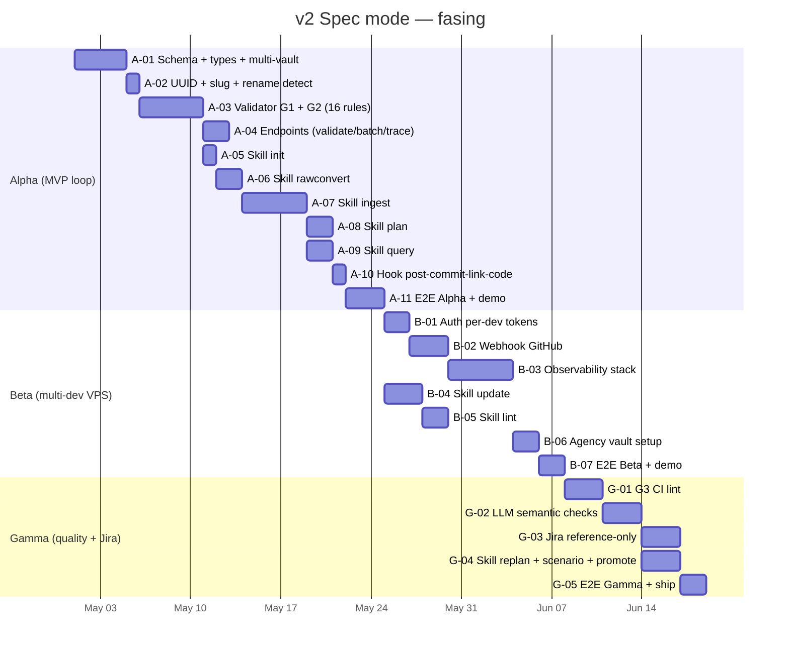

# Codi Brain v2 Spec Mode — Implementation Roadmap

- **Date**: 2026-04-30 23:26
- **Document**: 20260430*232636*[ROADMAP]\_codi-brain-v2-spec-mode-rollout.md
- **Category**: ROADMAP
- **Status**: APPROVED for execution
- **Companion design**: `docs/20260430_232636_[PLAN]_codi-brain-v2-spec-mode-design.md`

---

## 0. Summary

Implementation is staged in 3 phases. Each phase ships independently, with a concrete demo criterion. Total effort: 6-9 weeks single dev / 4-6 weeks two devs.

---

## 1. Phase Alpha — MVP loop on developer laptop

**Duration**: 3-4 weeks (15-20 working days single dev).

**Demo target**: One developer runs the full loop locally on their Docker stack — transcript → spec artifacts → plan → code → traceability — without VPS, without observability, without auth beyond the existing Phase 1 bearer.

### 1.1 Tickets

#### A-01 — Schema extensions, type taxonomy, multi-vault config

**Effort**: 4 days.
**Depends on**: Phase 1 Week 2A (already shipped).

**Tasks**:

- [ ] Update `src/codi_brain/config.py` — `VAULT_ROOTS` array (replaces single `VAULT_ROOT`).
- [ ] Update `src/codi_brain/schema/memgraph.py` — replace `:Note` with `:Page` constraint; add `:Token` and `:WebhookDelivery` constraint stubs (for later phases).
- [ ] Add `vault/.codi/mode.yaml` schema and loader.
- [ ] Migrate folder convention: `decisions/` → multi-folder (`sources/`, `business-goals/`, `requirements/`, `nfrs/`, `stories/`, `plans/`, `meta/`).
- [ ] Wire `vault_origin` property on Memgraph nodes (project / agency).
- [ ] Update `src/codi_brain/vault/write_context.py:118` — replace `kind not in (...)` hardcode with config-driven type set.
- [ ] Update `src/codi_brain/vault/write_context.py:121` — replace subdir hardcode with `{type → folder}` dict.
- [ ] Add migration test that wipes any existing `:Note` and rebuilds as `:Page`.

**Tests**:

- `tests/test_schema_v2_constraints.py` — verify all new constraints applied idempotently.
- `tests/test_config_vault_roots.py` — verify multi-vault config parsing.
- `tests/test_mode_yaml.py` — verify mode declaration loads correctly.

#### A-02 — UUID + slug hybrid identity + rename detection

**Effort**: 1 day.
**Depends on**: A-01.

**Tasks**:

- [ ] `src/codi_brain/vault/write_context.py:120` — replace `f"n-{uuid.uuid4().hex[:12]}"` with `str(uuid.uuid4())` (full UUIDv4).
- [ ] Add `slug` field to frontmatter render in `vault/frontmatter.py`.
- [ ] Implement rename detection in `vault/reconciler.py`: track `(file_deleted, file_created)` events in same tick; if `id` matches → treat as rename, update `slug` and `vault_path` in graph.

**Tests**:

- `tests/test_uuid_full.py` — verify new IDs are full UUIDv4.
- `tests/test_rename_detection.py` — file rename preserves graph identity.

#### A-03 — Validator library G1 + G2 with 16 deterministic rules

**Effort**: 5 days.
**Depends on**: A-02.

**Tasks**:

- [ ] Create `src/codi_brain/validation/__init__.py`.
- [ ] Create `src/codi_brain/validation/schema.py` — Pydantic models for each artifact type + 14 schema rules (§7.3 of design doc).
- [ ] Create `src/codi_brain/validation/graph.py` — 2 identity rules + reference resolution.
- [ ] Create `src/codi_brain/validation/severity.py` — BLOCKING/WARNING/INFO enum + structured error class.
- [ ] Create `src/codi_brain/cli.py` extension — `validate <path>` subcommand.
- [ ] Wire G1 endpoint `POST /vault/validate` (skill consumer).
- [ ] Wire G2 in reconciler — validate before each upsert, reject BLOCKING.

**Tests**:

- `tests/validation/test_schema.py` — 1 test per rule (16 tests).
- `tests/validation/test_graph.py` — identity tests with seeded graph.
- `tests/validation/test_route.py` — `POST /vault/validate` integration.
- `tests/validation/test_cli.py` — CLI behavior.

#### A-04 — Endpoints (validate, batch, trace, code-changed)

**Effort**: 2 days.
**Depends on**: A-03.

**Tasks**:

- [ ] `POST /vault/validate` (already in A-03).
- [ ] `POST /vault/write/batch` — accept N artifacts atomically; rollback all if any fails.
- [ ] `GET /graph/trace?from=<id>&direction=<upstream|downstream>&max_depth=<n>` — Cypher query returning sub-graph as JSON.
- [ ] `POST /code/changed-since/<commit>` — wraps existing `code_graph` integration to return new/modified qualified_names since a given commit.

**Tests**:

- `tests/routes/test_validate.py`, `test_batch.py`, `test_trace.py`, `test_changed_since.py`.

#### A-05 — Skill `codi-brain-init`

**Effort**: 1 day.
**Depends on**: A-04.

**Tasks**:

- [ ] Create `~/projects/codi/src/templates/skills/codi-brain-init/skill.md`.
- [ ] Templates for `mode.yaml`, `vault/CLAUDE.md`, folder scaffold.
- [ ] Slash command registration `/codi-init`.
- [ ] Tests E2E that invoke the skill against a clean repo and verify scaffold.

#### A-06 — Skill `codi-brain-rawconvert`

**Effort**: 2 days.
**Depends on**: A-05.

**Tasks**:

- [ ] Create skill folder with prompts.
- [ ] Wrap `markitdown` library as the conversion engine Day 1.
- [ ] Handle file types: `.txt`, `.md` (passthrough), `.docx`, `.pdf`, `.xlsx`, `.pptx`, `.html`, `.vtt`.
- [ ] Output to `vault/.raw/<topic>/normalized/<file>.md` preserving original filenames.
- [ ] Tests with sample fixtures of each format.

#### A-07 — Skill `codi-brain-ingest` (heaviest skill)

**Effort**: 5 days.
**Depends on**: A-06.

**Tasks**:

- [ ] Create skill folder with prompts (extractor LLM prompt is the hardest part).
- [ ] Implement validator-feedback retry loop (max 3) using `POST /vault/validate`.
- [ ] Persist via `POST /vault/write/batch` — atomic for the entire ingestion.
- [ ] Cable relations: Source ←derived_from← Goal ←satisfies← FR/NFR ←satisfies← Story.
- [ ] Tests with 5-10 real transcript fixtures (anonymized) + manual review of output quality.

**Risk**: this is the highest-risk ticket of Phase Alpha. If LLM output quality is poor, the entire phase value is reduced. Budget includes prompt iteration.

#### A-08 — Skill `codi-brain-plan`

**Effort**: 2 days.
**Depends on**: A-07.

**Tasks**:

- [ ] Create skill folder.
- [ ] Fetch context via `GET /graph/trace?from=<story_id>&direction=upstream&max_depth=4`.
- [ ] LLM generates Plan with sections: Context, Decisions, Data Model, API Surface, Test Strategy, Risks.
- [ ] Validate + write.
- [ ] Update `.codi/active-plan` with the new plan_id.
- [ ] Tests E2E.

#### A-09 — Skill `codi-brain-query`

**Effort**: 2 days.
**Depends on**: A-04.

**Tasks**:

- [ ] Create skill folder.
- [ ] Use `GET /notes/search` (existing hybrid search) + `GET /graph/trace`.
- [ ] LLM composes natural-language answer with citations to artifact IDs and code refs.
- [ ] Tests with seeded fixtures.

#### A-10 — Hook `post-commit-link-code`

**Effort**: 1 day.
**Depends on**: A-08.

**Tasks**:

- [ ] Create `bin/post-commit-link-code` bash script that calls a Python helper.
- [ ] Helper reads `.codi/active-plan`, parses commit message for `(PL-XXX)` patterns as fallback.
- [ ] Calls `POST /code/changed-since/<prev_sha>`, then `POST /graph/edges` (new endpoint, ~30 lines) to create `:Plan -[implemented_by]-> :Function` edges.
- [ ] Append summary to `vault/meta/link-log.md`.
- [ ] Setup script that installs the hook in `.git/hooks/post-commit`.

**Tests**: simulate a commit on a fixture project, verify edges are created.

#### A-11 — E2E Phase Alpha + demo

**Effort**: 3 days.
**Depends on**: A-10.

**Tasks**:

- [ ] Write E2E test that exercises the full flow: init → rawconvert → ingest → plan → code (mocked) → query.
- [ ] 3 real transcript fixtures of increasing complexity.
- [ ] Smoke test script (analogous to existing `week2a_smoke.sh`).
- [ ] Manual demo against 1 developer's laptop with one of the fixtures + screen recording for handoff.
- [ ] Documentation: `docs/<timestamp>_[GUIDE]_codi-brain-v2-alpha-developer-quickstart.md`.

### 1.2 Demo criterion (ship Alpha when ALL true)

- [ ] Developer can run `codi project new demo-project` → monorepo created, brain Docker stack up.
- [ ] Drop a real transcript at `vault/.raw/example/` and run `/codi-rawconvert vault/.raw/example/` → see `normalized/<file>.md`.
- [ ] Run `/codi-ingest vault/.raw/example/normalized/` → ≥1 Source, ≥1 BusinessGoal, ≥3 FRs, ≥1 NFR, ≥3 Stories created. All validate without BLOCKING errors.
- [ ] Open Obsidian on the vault; graph view shows nodes connected via wikilinks.
- [ ] Run `/codi-plan US-XXX` → Plan created and linked.
- [ ] Code something simple (1-2 functions in `services/api/`) → commit → hook creates `implemented_by` edges (verifiable via `MATCH (p:Page {type:'ImplementationPlan'})-[:LINKS_TO {relation:'implemented_by'}]->(f) RETURN p, f`).
- [ ] Run `/codi-query "what does US-XXX trace to in code?"` → answer cites the function(s).
- [ ] Pytest suite passes including new E2E test.
- [ ] No regressions in existing Phase 1 Week 2A tests.

---

## 2. Phase Beta — Multi-developer remote operation

**Duration**: 2-3 weeks (10-15 working days single dev).

**Demo target**: 2+ developers operate against a shared VPS with per-developer tokens. Stakeholder feedback iteration works. Observability dashboards show live metrics.

### 2.1 Tickets

#### B-01 — Auth per-developer revocable tokens

**Effort**: 2 days.
**Depends on**: A-11.

**Tasks**:

- [ ] Memgraph `:Token` schema activation (constraint already added in A-01).
- [ ] Update `src/codi_brain/auth.py` — query Memgraph instead of constant comparison; LRU cache 60s.
- [ ] New `src/codi_brain/routes/admin.py` — `POST /admin/tokens`, `DELETE /admin/tokens/<id>`, `GET /admin/tokens`.
- [ ] CLI: `codi-brain admin issue-token`, `codi-brain admin revoke-token`, `codi-brain admin list-tokens`.
- [ ] `BRAIN_ADMIN_TOKEN` env var for admin endpoints.
- [ ] Scope check middleware: each route declares required scopes.
- [ ] Tests: token issue, revoke, expired/revoked rejection, scope enforcement.

#### B-02 — Webhook GitHub → VPS

**Effort**: 3 days.
**Depends on**: B-01.

**Tasks**:

- [ ] `src/codi_brain/routes/webhooks.py` — `POST /webhooks/github` with HMAC-SHA256 verification.
- [ ] `:WebhookDelivery` Memgraph nodes for idempotency.
- [ ] `src/codi_brain/webhooks/queue.py` — persisted async queue.
- [ ] `src/codi_brain/webhooks/processor.py` — pull repo + reconcile changed paths + update code-graph.
- [ ] `asyncio.Lock` per project at handler level.
- [ ] APScheduler task to clean expired `:WebhookDelivery` (TTL 14 days).
- [ ] `GET /admin/webhooks/deliveries`, `POST /admin/webhooks/replay/<id>`.
- [ ] Tests with simulated GitHub deliveries (fixtures with valid HMAC).
- [ ] Setup script `infra/setup-vps.sh` provisioning Caddy + TLS + webhook secret.

#### B-03 — Observability stack

**Effort**: 5 days.
**Depends on**: B-02.

**Tasks**:

- [ ] `observability/docker-compose.override.yaml` adding Prometheus, Grafana, Loki, Promtail.
- [ ] `observability/prometheus.yml` scrape config.
- [ ] `observability/loki-config.yml`, `observability/promtail-config.yml`.
- [ ] `observability/grafana/provisioning/` for auto-loaded dashboards + datasources.
- [ ] `observability/grafana/dashboards/ingest-health.json`, `brain-internals.json`, `webhook-sync.json`.
- [ ] Expand `src/codi_brain/metrics.py` with all Day 1 metrics (~150 lines).
- [ ] `src/codi_brain/logging.py` — JSON formatter for production mode.
- [ ] Instrumentation `metric.observe()` calls in all relevant places.
- [ ] Documentation: `observability/README.md` explaining how to access dashboards + interpret metrics.

#### B-04 — Skill `codi-brain-update`

**Effort**: 3 days.
**Depends on**: A-11 (parallel-able with B-01..B-03).

**Tasks**:

- [ ] Create skill folder.
- [ ] LLM prompt: given feedback + current state of affected artifacts, decide what to mutate.
- [ ] For each affected artifact: bump `version`, mark old as `superseded_by`, create new with `supersedes`.
- [ ] May create wholly new artifacts if feedback introduces scope.
- [ ] Validation + batch write.
- [ ] Surface warnings to developer about Plans that elaborate now-deprecated Stories.
- [ ] Tests: feedback fixtures + verification of supersedes chains.

#### B-05 — Skill `codi-brain-lint`

**Effort**: 2 days.
**Depends on**: B-04.

**Tasks**:

- [ ] Create skill folder.
- [ ] Implements G3 lint with deterministic rules only (LLM-based deferred to Phase Gamma).
- [ ] Emits `vault/meta/lint-report-<date>.md`.
- [ ] Tests with seeded violations.

#### B-06 — Agency vault setup

**Effort**: 2 days.
**Depends on**: B-03.

**Tasks**:

- [ ] Document setup of `_agency-vault` repo.
- [ ] Modify `codi project new` script to symlink/clone agency vault into local Docker stack.
- [ ] Add `vault_origin` propagation through reconciler + writes.
- [ ] Empty `_agency-vault` initial state with just `mode.yaml = ["spec"]` + scaffold folders.
- [ ] Cross-vault wikilink resolution in reconciler.
- [ ] Tests: artifact in project vault references `[[_agency/...]]`, edge created correctly.

#### B-07 — E2E Phase Beta + demo

**Effort**: 2 days.
**Depends on**: B-06.

**Tasks**:

- [ ] E2E test simulating 2 developers concurrent commits via webhook.
- [ ] Manual demo: 2 laptops + VPS, ingest + push + observe sync.
- [ ] Documentation: `docs/<ts>_[GUIDE]_codi-brain-v2-vps-deployment.md`.

### 2.2 Demo criterion (ship Beta when ALL true)

- [ ] VPS deployed with HTTPS public, accessible to 2+ developers.
- [ ] Each developer has own revocable token configured.
- [ ] Developer A pushes from laptop → webhook → VPS reconcile → Developer B pulls → sees changes in <60s.
- [ ] Stakeholder feedback test: `/codi-update` produces correct supersedes chain.
- [ ] Daily lint cron runs in VPS, generates report.
- [ ] Grafana dashboards show live metrics (>1 day of data).
- [ ] Token revocation tested: revoking A's token blocks A's next request.
- [ ] No regressions in Alpha tests.

---

## 3. Phase Gamma — Quality + Jira

**Duration**: 1-2 weeks (5-10 working days single dev).

**Demo target**: Real piloto project completed end-to-end with Jira integration. CI lint runs on PRs. LLM semantic checks catch issues that deterministic rules miss.

### 3.1 Tickets

#### G-01 — G3 CI lint integration

**Effort**: 3 days.
**Depends on**: B-07.

**Tasks**:

- [ ] GitHub Actions workflow `.github/workflows/lint.yml` running `codi-brain validate` against the whole vault on PR.
- [ ] BLOCKING errors fail the workflow; WARNINGS comment on PR.
- [ ] Cross-artifact rules added to validator (orphan detection, missing relations, DAG check).
- [ ] Tests using GitHub's act runner locally.

#### G-02 — LLM semantic checks

**Effort**: 3 days.
**Depends on**: G-01.

**Tasks**:

- [ ] Add `src/codi_brain/validation/semantic.py` with rules:
  - INVEST conformance
  - AC measurability
  - NFR quantitative target check
  - Duplicate detection (embedding similarity threshold)
  - Contradiction detection (LLM judge between two artifacts)
- [ ] Each rule emits WARNING (not BLOCKING) since LLM checks have false positives.
- [ ] Add `--semantic` flag to `codi-brain validate` CLI.
- [ ] Run only in G3 (CI), never G1/G2.
- [ ] Cost monitoring metric (LLM tokens used per lint run).

#### G-03 — Jira reference-only integration

**Effort**: 3 days.
**Depends on**: G-02.

**Tasks**:

- [ ] `src/codi_brain/integrations/external_refs/jira.py` — `JiraAdapter`.
- [ ] Skill `codi-brain-jira-link` — link existing issue to a Story; comment on Jira ticket.
- [ ] Skill `codi-brain-jira-create` — create issue from a Story.
- [ ] APScheduler task — pull Jira status every 30 min, update `cached_status` field only.
- [ ] `external_refs.jira` schema in frontmatter.
- [ ] Tests against Jira API mock.

#### G-04 — Skills replan + scenario + promote

**Effort**: 3 days.
**Depends on**: G-02 (parallel with G-03).

**Tasks**:

- [ ] `codi-brain-replan` — wizard for re-evaluating a Plan when its Story is superseded.
- [ ] `codi-brain-scenario` — generates Gherkin companion `.feature.md` for a Story.
- [ ] `codi-brain-promote` — moves a per-project artifact to the agency vault (creates 2 PRs: one in project repo with stub, one in agency repo with full content).
- [ ] Tests for each skill.

#### G-05 — E2E Phase Gamma + ship

**Effort**: 2 days.
**Depends on**: G-04.

**Tasks**:

- [ ] E2E test of full Gamma flow: ingest with semantic warnings → plan → Jira link → code → CI lint passes.
- [ ] Real piloto project run (1 small client engagement).
- [ ] Sign-off documentation: `docs/<ts>_[REPORT]_codi-brain-v2-ship-progress.md`.
- [ ] v2.x roadmap stub for CK mode + bidirectional Jira.

### 3.2 Demo criterion (ship Gamma when ALL true)

- [ ] CI runs G3 lint on each PR; blocks merge on duplicate FR detection (LLM).
- [ ] Each UserStory in piloto project has Jira link; navigation Jira ↔ vault works both ways.
- [ ] Stakeholder navigates from Jira → ticket → click → sees Story + Plan + code.
- [ ] Promote skill moves a Pattern from project → agency vault; 2 PRs both clean.
- [ ] No regressions in Alpha + Beta tests.
- [ ] Pilot client signs off.

---

## 4. Final ship criterion (v2 done)

ALL true:

1. Phase Alpha demo passed (§1.2).
2. Phase Beta demo passed (§2.2).
3. Phase Gamma demo passed (§3.2).
4. E2E test coverage >70% in codi-brain Python.
5. E2E test for each of 7 skills + 1 hook with realistic fixtures.
6. Operational documentation complete:
   - VPS provisioning runbook.
   - Developer onboarding (laptop setup).
   - Incident runbook (token revocation, webhook fail, brain restart, vault reset).
7. Grafana dashboards in production showing >2 weeks of real metrics.
8. v2.x roadmap document with prioritized CK mode + bidirectional Jira items.
9. 1 pilot client sign-off on a real project completed using v2.

---

## 5. Risks per phase

### Phase Alpha

- LLM ingest output quality below threshold — mitigated by 5-10 transcript fixtures + prompt iteration budget within A-07.
- Validator rule mis-design — mitigated by writing tests before implementation (TDD already practice in Phase 1).
- Skill prompt drift across iterations — mitigated by versioned skill prompts in `~/projects/codi/src/templates/skills/`.

### Phase Beta

- VPS provisioning blocker (DNS, TLS) — mitigated by `infra/setup-vps.sh` as deliverable.
- Webhook security misconfiguration — mitigated by `codi_webhook_signature_failures_total` metric + alert.
- Observability cost overhead — Loki retention 30d / Prometheus 30d caps total disk; Grafana lightweight.

### Phase Gamma

- LLM semantic checks too noisy (false positives drown valid signals) — mitigated by WARNING-only severity + cost monitoring; if unusable, deferred to v2.x.
- Jira API rate limit — mitigated by exponential backoff in JiraAdapter.
- Pilot client misalignment with v2 process — mitigated by training session before pilot starts.

---

## 6. Coordination notes

- **Single dev path**: tickets sequential as laid out. Total ~30-45 days = 6-9 weeks.
- **Two devs path**: Alpha sequential (most tickets dependent). Beta has parallelism opportunity (B-04 + B-05 in parallel with B-01..B-03). Gamma G-03 parallel with G-04. Total ~20-30 days = 4-6 weeks.
- **Ticket granularity**: all tickets sized to ≤5 days. Larger tickets split before execution.
- **Branching**: feature branches `feature/A-XX-<slug>`, `feature/B-XX-<slug>`, `feature/G-XX-<slug>`. PR per ticket. Merge to `main` only after PR review + CI green.
- **Testing discipline**: TDD pattern from Phase 1 maintained. Test commit precedes feat commit for each ticket.
- **Documentation**: every ticket updates relevant section of design doc if scope drifts; companion roadmap (this doc) updated at end of each phase with actuals.

---

## 7. References

- Design doc: `docs/20260430_232636_[PLAN]_codi-brain-v2-spec-mode-design.md`
- Predecessor (CK mode, SUPERSEDED): `docs/20260424_145740_[PLAN]_codi-brain-v2-design.md`
- Phase 1 Week 2A handoff: `docs/20260423_212728_[REPORT]_codi-brain-phase-1-week-2b-progress.md`
- Documentation standard research: `~/projects/plan-ai/docs/20260430_211100_[RESEARCH]_documentation-standard.md`
