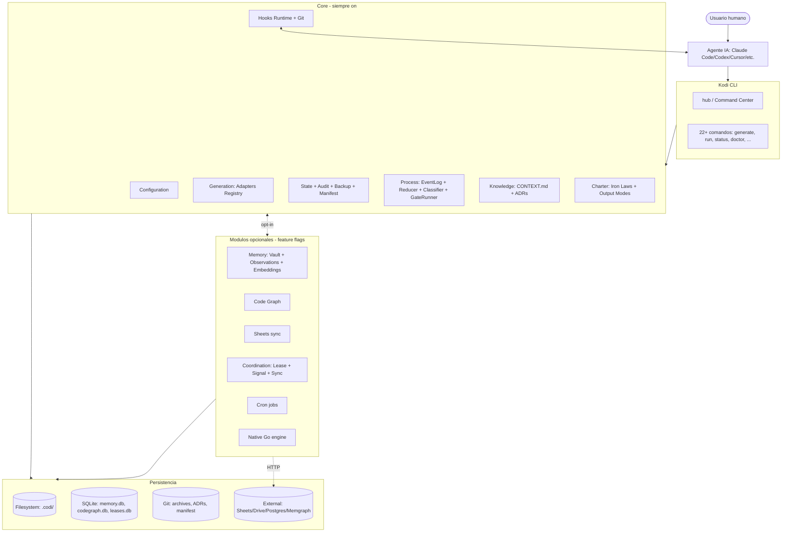

# Plan: Unificación Kodi + DevLoop con módulos opcionales codi-brain / harness-mem / claude-code-harness

- **Date**: 2026-05-04 18:46
- **Document**: 20260504*184645*[PLAN]\_kodi-devloop-unification.md
- **Category**: PLAN

---

## Tabla de contenidos

0. Contexto y método
1. Informes por repositorio (resúmenes condensados)
2. Comparativa entre repositorios
3. Diagnóstico Kodi vs DevLoop
4. Diseño del sistema objetivo
5. Propuesta de estándar interno
6. Propuesta de arquitectura técnica
7. Módulos core y opcionales
8. Propuesta de migración DevLoop → Kodi
9. Roadmap por fases (Fase 0 a Fase 10)
10. Riesgos y mitigaciones
11. Preguntas abiertas
12. Recomendaciones finales

---

## 0. Contexto y método

Cinco repositorios locales fueron analizados en paralelo por agentes especializados:

- `/Users/laht/projects/codi` — framework principal (TypeScript estricto, ESM, POSIX)
- `/Users/laht/projects/devloop` — Claude Code Plugin de workflows phase-locked
- `/Users/laht/projects/codi-brain` — servicio FastAPI con vault Memgraph + Qdrant
- `/Users/laht/projects/harness-mem` — runtime de memoria multi-agente local-first
- `/Users/laht/projects/claude-code-harness` — plugin Go-native con guardrails declarativos

Cada agente produjo un informe de 22 secciones con citas concretas a archivos y funciones. Esta síntesis no inventa: cita la evidencia recogida.

Ámbito: este plan establece la arquitectura objetivo de **Kodi v3** capaz de absorber DevLoop completo y extraer las ideas reutilizables de los otros tres repositorios sin acoplarse a sus dependencias pesadas (Memgraph, Qdrant, OpenAI, Bun, Go, Docker, Caddy).

---

## 1. Informes por repositorio (resúmenes condensados)

### 1.1 codi (Kodi) — primario

**Qué es**: plataforma TS de configuración unificada para 6 agentes (Claude Code, Cursor, Codex, Windsurf, Cline, Copilot). NPM `codi-cli` v2.14.2, MIT, Node 20+, ESM, POSIX-only.

**Pipeline de tres capas**: `src/templates/` → `.codi/` → `.claude|.cursor|.codex|...` vía `codi generate`. La fuente de verdad es `src/templates/` para desarrollo del framework y `.codi/` para consumidores.

**Activos clave**:

- 11 esquemas Zod (`src/schemas/`): rule, skill, agent, flag, hooks, mcp, manifest, preset, feedback, evals, skill-test
- Tipo `Result<T,E>` discriminado universal
- 6 adaptadores de agente con `AdapterRegistry` extensible
- 28 rules + 63 skills + 21 agents + 31 templates de MCP servers
- 21 flags con `mode|value|locked|conditions` (incluye `lang/framework/agent/file_pattern`)
- 6 presets builtin (`minimal`, `balanced`, `strict`, `fullstack`, `dev`, `power-user`) + presets custom desde ZIP/GitHub/local
- `StateManager` con drift detection SHA-256 binary-safe
- `ArtifactManifestManager` con versionado por artefacto y `template-hash-registry`
- `OperationsLedgerManager` con auditoría tipada (init/generate/clean/add/update/preset-install/preset-remove/revert/skill-feedback/skill-evolve/skill-stats)
- Backup system con commit-semantics (manifest v2, `MAX_BACKUPS=50`, retention TUI)
- Heartbeat hooks `codi-skill-tracker.cjs` (InstructionsLoaded) y `codi-skill-observer.cjs` (Stop) con marcador universal `[CODI-OBSERVATION: artifact|category|text]`
- Generador de hooks de Git para 4 runners (codi/husky/pre-commit/none) y 16 lenguajes
- 22 comandos CLI (Commander) con TUI Clack ("Command Center")

**No tiene**: memoria persistente del agente, embeddings, indexación semántica, event sourcing de workflows, gates con estados explícitos, vocabulario cerrado de fases.

**Deuda**: dual `audit.jsonl` vs `operations.json`, `scanLegacyBrands` (legacy), three-layer pipeline frágil para self-dev (4 entradas en memoria del usuario lo confirman), ausencia de lockfile en `.codi/`.

### 1.2 devloop — primario (a absorber)

**Qué es**: Claude Code Plugin (v0.9.0, MIT, ~11.775 LOC TS) de procesos phase-locked con audit trail event-sourced y persistencia opcional en Google Sheets / xlsx. 23 skills, 5 hooks runtime, 3.500 LOC en capa `lib/sheets/`.

**Activos clave**:

- 8 Iron Laws codificadas (`team-charter`) inyectadas en cada `SessionStart`. Iron Law 4: HARD GATES requieren literal `ok` (case-insensitive, exactamente 2 chars).
- Vocabulario cerrado: 41 event types, 11 fases, 5 workflow types (project, feature, bug-fix, refactor, migration), 5 entidades de dominio (BusinessGoal, Requirement, UserStory, Release, Audit)
- `EventLog` (`lib/event-log.ts`) + `Reducer` puro (`lib/reducer.ts`) + `Replay` determinista
- Classifier mecánico (`lib/classifier.ts`, `classifier-rules.ts`): decide entre `incidental` y `scope-expansion` sin LLM. Reglas pure-function, fácilmente testeables.
- `gate-runner.ts` con checks `deterministic` y `agent` (subagent fork)
- `lib/sheets/`: 24 módulos. `transactions.ts:atomicSyncDraft` (snapshot → per-row apply → rollback on first failure). `integrity.ts:validateDraft` puro. `diff.ts:computeDiff` con detección de `stale_pull`. OCC vía `_rev` column. Soft-delete `archived_at|archived_by`. Queue offline `.devloop/sheets-queue.jsonl` + daemon. Reconcile manifest→Sheet.
- 5 hooks runtime: PreToolUse (scope/bash blocking, 480 LOC), PostToolUse (auto-record incidentals), UserPromptSubmit (inject `<workflow-state>`), SessionStart (charter+state probe+menu, `once: true`), pre-push (archive-preservation).
- `caveman` mode (compresión token-saver default-on), `.devloop/preferences.json::output_mode`
- 2 LLM gates fork: `gate-plan-coverage`, `gate-deep-modules`
- Knowledge base obligatoria: `runWorkflow` arroja `KnowledgeBaseMissingError` si falta `docs/CONTEXT.md`
- `pr-summary.ts` con hash SHA-256 sobre eventos commitables embebido en PR description
- 700-LOC cap enforced por `scripts/hooks/check_file_lines.py`
- Pre-commit estructurado en 5 bloques (Hygiene, Secrets, Anti-slop AI, Lint, Infra/docs)
- `recommend-pattern.py` linter de Iron Law 1 ("Recommend AND execute")
- `forbid-coauthor-claude` y `forbid-edits-to-generated`

**No tiene**: rules como categoría aparte de skills, embeddings, memoria persistente al estilo Codi feedback, MCP server propio.

**Deuda explícita**: `auto-commit.ts:46` usa `--no-verify` (conflicto directo con memoria global del usuario), schema monolítico de 30KB, `scripts/gate.ts:71` busca `skills/workflows/...` (path equivocado), 5 placeholders TODO en gate-runner, `.pre-commit-config.yaml.rej` no resuelto en raíz.

### 1.3 codi-brain — referencia

**Qué es**: servicio HTTP Python (FastAPI 3.12) que combina (a) bóveda Markdown sincronizada bidireccionalmente con Memgraph + Qdrant y (b) librería absorbida `code_graph` de ~16.000 LOC con Tree-sitter para 10 lenguajes. Phase 1 → Phase Alpha v2 (Spec mode con seis tipos de Page).

**Activos clave reusables**:

- `vault/lock.py` — RW-lock asyncio con writer-preference (78 LOC, copiable)
- `vault/reconciler.py` — drift detection bidireccional con coalescing single-flight, two-phase scan, clasificación tetra-estado (created/renamed/updated/tombstoned)
- `vault/write_context.py` — saga write con rollback parcial (Memgraph → embed → Qdrant → file → git)
- `vault/git_ops.py` — add+commit+push con rebase-on-conflict (3 reintentos)
- `vault/push_retry.py` + `vault/scheduled.py` — bucles asyncio cancelables con métricas Prometheus
- `vault/frontmatter.py` + `hasher.py` — render/parse YAML estable + hash canónico
- `vault/slugify.py` — slugificación filesystem-safe alineada con Obsidian
- `validation/runner.py` + severities (BLOCKING/WARNING/INFO) — esqueleto reusable
- Patrón MissingPage (forward-ref con `referenced_by_count`)
- Anti-corruption adapter `integrations/code_graph.py` para encapsular libs pesadas
- Modelo Pydantic Page con discriminator `type` (UserStory, BusinessGoal, etc. — vocabulario rich pero spec-mode-specific)

**No reusable**: dependencia obligatoria de Memgraph + Qdrant + OpenAI key + GEMINI key, los 16.000 LOC de `code_graph` (calidad heterogénea, asserts para narrowing, mypy/pyright excluidos), `pydantic_ai` agent (RAG orquestador no usado desde rutas FastAPI), `unixcoder.py` con torch+transformers (cientos de MB), taxonomía PageType específica de spec-mode.

**Riesgos**: vector dimension hardcoded a 1536, lock global por vault (no aísla multi-vault), tree-sitter aarch64 segfault forzando linux/amd64, datos demo (~90 archivos) comprometidos en repo.

### 1.4 harness-mem — referencia

**Qué es**: runtime de memoria local-first multi-agente. TS/Bun core + MCP server duplicado en TS y Go (~5ms cold start). License BUSL-1.1 (conversión a Apache 2.0 en 2029). Distribuido como plugin Claude Code y skills Codex.

**Activos clave reusables (con re-implementación Apache)**:

- **Schema multi-dimensional**: `mem_events` (append-only) + `mem_observations` (materialized) + `mem_tags` + `mem_entities` + `mem_relations` + `mem_vectors` + `mem_nuggets` + `mem_facts` + `mem_links` + `mem_leases` + `mem_signals` + `mem_sessions` + `mem_teams`. 22 tablas total.
- **3 tipos de memoria**: `episodic | semantic | procedural` × cognitive_sector `work|people|health|hobby|meta`
- **Privacy tags en ingest**: `<private>...</private>` strip default, `block|redact|mask|no_mem` policies
- **API HTTP `/v1/*` estable**: 60+ endpoints REST con paralelo MCP por cada uno
- **3-layer search workflow**: `search` (IDs + token estimate) → `timeline` (window) → `get_observations` (full content). `meta.token_estimate` previene token blowups.
- **Resume-pack con detail_level L0/L1/full + summary_only**: SessionStart hook puede inyectar contexto comprimido
- **Embedding routing adaptativo**: query-analyzer + adaptive-provider con dos providers + score fusion. Circuit breaker en remotos.
- **Forget policy 3-factor + soft-delete**: ranking `access × signal × age` con threshold y wet/dry-run + opt-in env
- **Contradiction detector**: Jaccard similarity + LLM adjudicator inyectable. Crea `supersedes` link, no borra.
- **Lease + Signal primitives**: coordinación inter-agente por exclusión mutua en `mem_leases (target, agent_id, ttl_ms)` y mensajería append-only en `mem_signals (from, to, reply_to, thread_id)`. Sin Redis.
- **Workspace isolation con realpath**: resistente a symlinks
- **Adapter pattern para ingest**: `claude-code-sessions`, `codex-history`, `cursor-hooks`, `opencode-db`, `gemini-events`, `antigravity-files`
- **Skill `harness-recall`** con clasificación de intent en 5 ramas
- **Schema parity test (`schema_parity_test.go`)**: garantiza que TS y Go MCP no diverjan
- **Question-kind routing en retrieval**: pesos diferentes por `profile|timeline|graph|vector|hybrid|freshness`
- **Hybrid retrieval**: FTS5 + sqlite-vec + recency + tag + graph + opcional rerank LLM

**No reusable**: license BUSL-1.1 (no embedar código directamente, solo replicar ideas Apache), VSCode extension, Caddy/Docker VPS deployment, harness-mem-ui completo (14 componentes React), 47.000+ líneas de Plans.md, runtime Bun (vendor lock parcial), ~60 env vars (DX hostil), dependencia hard a `@huggingface/transformers` (drift entre versiones documentado), comentarios y mensajes mayoritariamente en japonés.

**Riesgos**: drift de embeddings entre versiones de transformers.js, no-determinismo FPU M1 vs Linux x64, vector coverage observado 53.7% vs target 95%, search latency observado 1868ms vs target 200ms.

### 1.5 claude-code-harness — referencia

**Qué es**: Claude Code Plugin v4.5.4 con motor Go-native single-binary (`bin/harness`, ~7MB stripped). Reemplazó stack bash+Node, ejecuta guardrails sub-10ms, soporta Claude Code + OpenAI Codex CLI + opencode + Cursor. License Apache.

**Activos clave reusables**:

- **Motor Go declarativo de guardrails**: `Rules[]GuardRule{ID, ToolPattern, Evaluate}` con short-circuit en `go/internal/guardrail/rules.go`. 13 reglas R01-R13.
- **Tabla SQLite con 7 tablas**: `schema_meta, sessions, signals, task_failures, work_states, assumptions, agent_states`. Pure-Go via `modernc.org/sqlite` (no CGO).
- **Subagent lifecycle tracker**: estado `RUNNING/SPAWNING/REVIEWING/APPROVED/RECOVERING/FAILED/ABORTED/STALE` con `recovery_attempts`. Comando `harness status` da observabilidad.
- **`harness.toml` como SSoT de packaging** + `harness sync` que regenera `.claude-plugin/plugin.json` + `hooks.json` + `settings.json`. Modelo de **una sola capa**, más limpio que el three-layer de Codi.
- **JSON Schema explícito** (`claude-code-harness.config.schema.json` draft-07) con defaults, enums, additionalProperties:false. Validable desde IDE.
- **Hook command shim con safe fallback**: bash wrapper que valida `CLAUDE_PLUGIN_ROOT` y degrada a `exit 0` con stdout vacío si falla — nunca tira la sesión por hook ausente.
- **Worker self-review contract `worker-report.v1`**: 5 reglas por defecto que el worker verifica con evidence antes de habilitar el spawn del Reviewer (DRY violation, plans-cc-markers-untouched, all-declared-symbols-called, dod-items-verified-with-evidence, no-existing-test-regression).
- **Separación de roles `team-composition.md`**: Lead / Worker / Advisor / Reviewer / Scaffolder. Worker no spawnea — emite `advisor-request.v1`.
- **Output styles** como artefacto del plugin (`output-styles/harness-ops.md`)
- **Monitors manifest** (`monitors/monitors.json` formato CC 2.1.105+): daemons en background que detectan drift
- **Plans.md con state markers** (`pm:依頼中 / cc:WIP / cc:完了 / pm:確認済`) y hooks `plans-watcher`
- **Tests de no-strip** (`sync_no_phantom_fields_test.go`) por incidentes pasados donde `harness sync` borraba bloques

**No reusable**: duplicación manual `skills/` vs `skills-codex/` vs `opencode/skills/` (deuda explícita), DSL YAML propio de workflows, triple-sync VERSION + plugin.json + harness.toml, i18n bilingüe forzado en cada SKILL.md, Plans.md gigante, CLAUDE.md en japonés, 105 scripts shell híbridos en `scripts/` (migración v3→v4 incompleta).

---

## 2. Comparativa entre repositorios

### 2.1 Tabla maestra

| Dimensión                               | codi                                     | devloop                                                         | codi-brain                           | harness-mem                                                 | claude-code-harness                   |
| --------------------------------------- | ---------------------------------------- | --------------------------------------------------------------- | ------------------------------------ | ----------------------------------------------------------- | ------------------------------------- | --------------------------- |
| **Lenguaje primario**                   | TS estricto                              | TS                                                              | Python 3.12                          | TS/Bun + Go                                                 | Go + bash                             |
| **Distribución**                        | npm `codi-cli`                           | Claude Code plugin                                              | docker-compose                       | npm + binarios                                              | Claude Code plugin + binarios         |
| **Tamaño**                              | 1.2GB (1002 .ts, 808 .py)                | 311MB (93 .ts)                                                  | 591MB (mucho hereda code_graph)      | 49MB (472 .ts)                                              | 186MB (158 .go, 137 .ts)              |
| **License**                             | MIT                                      | MIT                                                             | propietaria                          | BUSL-1.1                                                    | Apache                                |
| **Modelo dominio**                      | rules/skills/agents/flags/MCP            | skills/workflows/gates/IronLaws                                 | pages/relations/code_graph           | observations/events/leases/signals                          | rules/agents/skills/hooks             |
| **Persistencia**                        | state.json + manifest + ledger + backups | event log archives + Sheet OCC                                  | Memgraph + Qdrant + git              | SQLite + sqlite-vec (+pg opt)                               | SQLite (modernc)                      |
| **Pipeline**                            | src/templates → .codi → .claude          | `.workflow/active                                               | archives`                            | vault Markdown ↔ Memgraph                                   | events → observations                 | harness.toml → sync → JSONs |
| **Memoria**                             | NO (delega al agente)                    | NO explícita (manifest event log)                               | sí (Page/Markdown vault)             | sí (multi-tier)                                             | NO (delega a harness-mem)             |
| **Embeddings**                          | NO                                       | NO                                                              | sí (OpenAI 1536d)                    | sí (multi-provider adaptativo)                              | NO                                    |
| **Code graph**                          | delega a MCP graph-code                  | NO                                                              | sí (Tree-sitter, 10 langs, Memgraph) | parcial (entity-relation co-ocurrencia)                     | NO                                    |
| **Event sourcing**                      | NO (ledger tipado pero no replayable)    | sí (41 event types, replay)                                     | NO                                   | parcial (`mem_events`)                                      | NO                                    |
| **Phase-locked workflows**              | NO                                       | sí (5 types, 11 fases, gates)                                   | NO                                   | NO                                                          | parcial (Plan/Work/Review/Release)    |
| **Hard gates**                          | NO (aprobación implícita)                | sí (literal `ok`)                                               | NO                                   | NO                                                          | NO                                    |
| **Hooks runtime**                       | 2 (skill-tracker + skill-observer)       | 5 (PreTool, PostTool, UserPromptSubmit, SessionStart, pre-push) | 2 (heredados de codi)                | 9 (SessionStart, UserPromptSubmit, PostToolUse, Stop, etc.) | ~50 sub-tipos en motor Go             |
| **Hooks Git**                           | generador con 4 runners + 16 langs       | pre-commit estructurado en 5 bloques                            | hereda de codi                       | mínimos                                                     | `pre-commit` versión-bump             |
| **Multi-tool dispatch**                 | sí (6 adapters)                          | NO (solo Claude Code)                                           | NO                                   | sí (Claude/Codex/Cursor/OpenCode/Antigravity/Gemini)        | sí (Claude/Codex/opencode/Cursor)     |
| **MCP**                                 | 31 templates de servers                  | NO                                                              | vacío                                | sí (TS+Go, ~50 tools)                                       | NO                                    |
| **CI/CD**                               | tests + Astro docs + npm publish         | tests + verify-archives + hash-check                            | smoke scripts                        | tests + benchmark gates                                     | tests + check-version + check-residue |
| **Integraciones externas obligatorias** | ninguna (POSIX + node)                   | googleapis (a menos que `local_xlsx`)                           | OpenAI + Memgraph + Qdrant + git     | bun + sqlite-vec                                            | ninguna (single binary)               |
| **Lock concurrencia**                   | NO                                       | sí (`.workflow/active/.lock`, no pid-aware)                     | sí (RW-lock asyncio)                 | sí (lease)                                                  | NO                                    |
| **Hive mind**                           | NO                                       | NO                                                              | NO                                   | parcial (lease + signal + cross-device sync)                | NO                                    |
| **Output mode**                         | NO                                       | sí (caveman/normal)                                             | NO                                   | NO                                                          | NO                                    |
| **Knowledge base obligatoria**          | NO                                       | sí (docs/CONTEXT.md)                                            | NO                                   | NO                                                          | NO                                    |

### 2.2 Matriz de capacidades vs. fuentes

| Capacidad                                | Fuente primaria     | Calidad                          | Reutilización                                         |
| ---------------------------------------- | ------------------- | -------------------------------- | ----------------------------------------------------- |
| Adapters multi-agente                    | codi                | madura (6 destinos)              | core                                                  |
| Esquemas de dominio (Zod)                | codi                | madura                           | core                                                  |
| `Result<T,E>` y error catalog            | codi                | madura                           | core                                                  |
| Three-layer pipeline                     | codi                | madura pero frágil para self-dev | refactor a one-layer (inspirado en harness.toml→sync) |
| Heartbeat hooks runtime                  | codi                | mínima                           | base extensible                                       |
| Backup + manifest v2                     | codi                | madura                           | core                                                  |
| Operations ledger                        | codi                | madura                           | core (extensible)                                     |
| Generador hooks Git multi-runner         | codi                | madura (4 runners × 16 langs)    | core                                                  |
| Iron Laws + team-charter                 | devloop             | madura                           | core (rule + SessionStart hook)                       |
| Phase-locked workflow CLI                | devloop             | madura                           | core                                                  |
| Event sourcing de workflows              | devloop             | madura                           | core                                                  |
| Classifier mecánico de scope             | devloop             | madura                           | core                                                  |
| Gate runner (deterministic + agent fork) | devloop             | madura                           | core                                                  |
| HARD GATES con literal `ok`              | devloop             | madura (Iron Law 4)              | core                                                  |
| Caveman output mode                      | devloop             | madura                           | core                                                  |
| Atomic sync + snapshot/restore           | devloop             | madura                           | core (generalizable a cualquier external state)       |
| OCC `_rev` pattern                       | devloop             | madura                           | core                                                  |
| Knowledge base obligatoria               | devloop             | madura                           | core                                                  |
| `forbid-coauthor-claude` enforcement     | devloop             | madura                           | core                                                  |
| 700-LOC cap enforcement                  | devloop             | madura                           | core                                                  |
| `recommend-pattern.py` linter            | devloop             | madura                           | core                                                  |
| Pre-push archive-preservation            | devloop             | madura                           | core                                                  |
| RW-lock asyncio                          | codi-brain          | sólida                           | módulo opcional                                       |
| Reconciler bidireccional FS↔grafo        | codi-brain          | sólida                           | módulo opcional                                       |
| Saga write con rollback                  | codi-brain          | sólida                           | módulo opcional (general pattern)                     |
| Frontmatter + canonical hash             | codi-brain          | sólida                           | módulo opcional (vault)                               |
| Slugify Obsidian-compatible              | codi-brain          | sólida                           | módulo opcional                                       |
| MissingPage forward-ref pattern          | codi-brain          | sólida                           | módulo opcional                                       |
| Validation runner con severidades        | codi-brain          | sólida                           | módulo opcional                                       |
| Schema multi-tabla de memoria            | harness-mem         | madura                           | módulo opcional (re-implementar Apache)               |
| 3 tipos × 5 cognitive sectors            | harness-mem         | madura                           | módulo opcional                                       |
| Privacy tags + redact + block            | harness-mem         | madura                           | core (siempre on cuando memoria activa)               |
| 3-layer search con token estimate        | harness-mem         | madura                           | módulo opcional                                       |
| Resume-pack L0/L1/full                   | harness-mem         | madura                           | módulo opcional                                       |
| Embedding adaptive routing               | harness-mem         | madura                           | módulo opcional                                       |
| Forget policy 3-factor                   | harness-mem         | madura                           | módulo opcional                                       |
| Contradiction detector Jaccard+LLM       | harness-mem         | madura (opt-in)                  | módulo opcional                                       |
| Lease + Signal primitives                | harness-mem         | madura                           | módulo opcional                                       |
| Workspace isolation con realpath         | harness-mem         | madura                           | core (cuando memoria activa)                          |
| Question-kind routing                    | harness-mem         | madura                           | módulo opcional                                       |
| Hybrid FTS5+vec retrieval                | harness-mem         | madura                           | módulo opcional                                       |
| Schema parity test                       | harness-mem         | técnica clave                    | core (tests)                                          |
| Motor Go single-binary                   | claude-code-harness | madura                           | refactor opcional v4                                  |
| Tabla declarativa de guardrails          | claude-code-harness | madura                           | core (portar a TS o Go)                               |
| Sub-agent state machine SQLite           | claude-code-harness | madura                           | core                                                  |
| `harness.toml` → sync 1-layer            | claude-code-harness | madura                           | refactor del three-layer                              |
| Hook safe fallback wrapper               | claude-code-harness | madura                           | core                                                  |
| Worker self-review contract              | claude-code-harness | madura                           | core (rule + skill)                                   |
| Separación Worker/Advisor/Reviewer/Lead  | claude-code-harness | madura                           | core (agent templates)                                |
| Output styles                            | claude-code-harness | madura                           | extensible                                            |
| Monitors manifest                        | claude-code-harness | madura                           | core                                                  |
| JSON Schema config draft-07              | claude-code-harness | madura                           | core                                                  |

---

## 3. Diagnóstico Kodi vs DevLoop

### 3.1 Qué hace cada uno

- **Kodi** es un **build system de configuración**: lee artefactos declarativos (rules/skills/agents/flags/MCP) y genera archivos nativos para cada agente. No ejecuta nada en runtime salvo dos hooks (skill tracker y observer).
- **DevLoop** es un **runtime de proceso**: ejecuta workflows phase-locked, registra cada decisión como evento, bloquea ediciones fuera de scope, sincroniza con un canvas externo (Sheet/xlsx). Es activo durante la sesión.

### 3.2 Diferencias estructurales

| Eje                    | Kodi                     | DevLoop                                  |
| ---------------------- | ------------------------ | ---------------------------------------- |
| Modelo                 | declarativo (artefactos) | imperativo (eventos+fases)               |
| Ciclo                  | build-time               | runtime                                  |
| Audit trail            | ledger (no replayable)   | event log (replayable)                   |
| Aprobación humana      | implícita en `--force`   | HARD GATES con `ok` literal              |
| Persistencia           | state.json + manifest    | event archives + Sheet                   |
| Vocabulario            | abierto (skills custom)  | cerrado (41 events, 11 phases, 5 wflows) |
| Multi-target           | sí (6 adapters)          | NO (solo Claude Code)                    |
| Memoria                | NO                       | NO explícita (manifest ES la memoria)    |
| Workflows como entidad | NO                       | sí                                       |

### 3.3 Solapamientos

- **Skills** (devloop) ⇄ **Skills** (Kodi): solapamiento conceptual ~70%. devloop incluye workflows y disciplinas como "skills"; Kodi separa skill/rule/agent. Mapeo en §2.2 / §8.
- **Hooks Git**: Kodi genera por agente; devloop usa pre-commit estándar. Convergencia en pre-commit.
- **Anti-patterns** (sin coauthor Claude, sin --no-verify, branch protection, file-line cap): ambos los aplican pero con expresiones distintas.
- **Sub-agent dispatch**: Kodi tiene `dispatching-parallel-agents` skill; devloop tiene `subagent-orchestration` con modes `parallel` + `sequential`.

### 3.4 Qué tiene cada uno que el otro NO tiene

**Kodi → no tiene en DevLoop**:

- Multi-agent dispatch (6 destinos vs 1)
- 28 rules + 63 skills + 21 agents + 31 MCP templates curados
- Schemas Zod estrictos para todo el dominio
- StateManager con drift detection determinística
- Backups con commit-semantics
- Generador de hooks Git multi-runner multi-lang
- Heartbeat hooks (skill-tracker, skill-observer) con marcador `[CODI-OBSERVATION]`
- Presets builtin + custom (ZIP/GitHub/local)
- Verification token determinístico (SHA-256)
- Astro Starlight docs site

**DevLoop → no tiene en Kodi**:

- Iron Laws (8) con SessionStart injection
- HARD GATES con literal `ok`
- Phase-locked workflows con vocabulario cerrado
- Event sourcing real con replay
- Classifier mecánico de scope (sin LLM)
- Gate runner con checks deterministic + agent fork
- Snapshot/restore + atomic sync con OCC
- Knowledge base obligatoria (docs/CONTEXT.md + ADRs)
- PR summary con hash determinístico
- Caveman output mode
- 700-LOC cap enforcement (`check_file_lines.py`)
- `recommend-pattern.py` linter
- Pre-push archive preservation
- 5 hooks runtime activos en sesión

### 3.5 Conflictos directos a resolver antes de absorber

1. **`auto-commit.ts:46` con `--no-verify`** vs memoria global _Never --no-verify_. Resolución: deshabilitar `--no-verify`; aceptar que pre-commit corra sobre commits del manifest. Si un archive falla pre-commit, el bug está en el archive (datos sospechosos), no en el hook.
2. **Definición de "skill"**. devloop usa "skill" para workflows + disciplinas + gates. Kodi separa skill/rule/agent. Resolución: importar workflows como un nuevo tipo de artefacto (`workflow`) con `mode: workflow` en frontmatter, gates como un sub-tipo de skill (`mode: gate`), Iron Laws como rules.
3. **Namespaces `.workflow/` vs `.devloop/` vs `.codi/`**. Resolución: rebrand devloop a `.codi/workflow/` y `.codi/runtime/`.
4. **CLI `devloop` vs `codi`**. Resolución: `devloop run` → `codi run` (o `codi workflow run`); preservar invocación slash `/devloop:<skill>` vía adapter.
5. **`docs/adr/0001-adopt-devloop`** (numerado) vs Codi naming `YYYYMMDD_HHMMSS_[ADR]_<slug>.md`. Resolución: adoptar Codi naming en ADRs nuevos, mantener los existentes como excepción documentada.
6. **`.claude-plugin/plugin.json`** (devloop como Claude plugin) vs `.codi/artifact-manifest.json`. Resolución: unificar bajo manifest de Codi + emisión de `plugin.json` shim para marketplace.
7. **Sheets backend** (devloop). Resolución: extraer a paquete separado `@codi/sheets-backend` opt-in. No imponer `googleapis` al core.

### 3.6 Conclusión del diagnóstico

DevLoop aporta **ortogonalidad temporal** (runtime de proceso, eventos, gates) que es exactamente lo que Kodi necesita y carece. Kodi aporta **ortogonalidad espacial** (multi-agent destination, esquemas, backups, hooks Git) que devloop carece. **Son complementarios al ~85%** y los conflictos son nominales (namespaces, vocabulario), no estructurales. La fusión es viable y de alto valor.

---

## 4. Diseño del sistema objetivo

### 4.1 Visión

Kodi v3 es un **agent harness framework** unificado para desarrolladores individuales y equipos. Combina:

- **Configuración declarativa** multi-target (6+ destinos): la herencia directa de Kodi v2.
- **Procesos imperativos auditables** (workflows, fases, gates, eventos): la herencia directa de DevLoop.
- **Memoria opt-in** (vault + observations + lease/signal): inspirada en codi-brain y harness-mem, re-implementada bajo licencia Apache.
- **Indexación opt-in** (code graph + embeddings): vía MCP servers externos o módulo embebido opcional.
- **Hive mind opt-in para equipos**: sincronización de leases/signals/learnings via Sheet/Drive o servidor compartido.

Kodi v3 funciona en local sin red, sin LLMs externos obligatorios, sin Docker, sin servicios pagos. Cada capacidad pesada (embeddings, vector store, code graph, sheet sync, memoria persistente) es un módulo opt-in vía feature flag.

### 4.2 Principios rectores

1. **Build + Runtime unificados**: una misma fuente declarativa (`.codi/`) describe los artefactos _y_ los procesos.
2. **Vocabulario cerrado, evolución por ADR**: heredado de devloop. Eventos, fases, workflow types, output modes, severidades, categorías de docs, todos cerrados.
3. **Determinismo donde se puede, IA donde se debe**: classifiers, validators, schema checks → puro. RAG, planning, summarization → LLM con fallback determinista.
4. **Local-first, online-optional**: sqlite o filesystem por defecto; Postgres/Qdrant/Sheet/cloud son backends pluggables.
5. **Trace is sacred**: cada decisión auditada. Append-only event log en disco + git.
6. **Human in the loop por defecto**: HARD GATES con literal `ok`. Default es proponer, no autoejecutar.
7. **Modular monolith**: un solo binario CLI con módulos separados. Microservicios solo para módulos opcionales pesados (memory daemon, brain server).
8. **No vendor lock**: schemas estables (Zod + JSON Schema draft-07 publicados). MCP server propio para que otros productos consuman.
9. **Atomic + rollback**: cualquier mutación a estado externo (filesystem, Sheet, DB) lleva snapshot pre + rollback determinista.
10. **Diff mínimo, simplicidad primero**: nuevas capacidades solo si añaden valor. Se prohíbe sobre-ingeniería.
11. **Schema-driven**: Zod en core + JSON Schema publicado para consumers externos. Schema parity tests entre TS y otras implementaciones (Go, Python).
12. **Self-hosted dogfooding**: el repo de Kodi usa Kodi sobre sí mismo. Bug del three-layer → refactor a one-layer.

### 4.3 Boundaries de dominio

```
┌─────────────────────────────────────────────────────────┐
│                  Bounded Contexts                       │
├─────────────────────────────────────────────────────────┤
│ 1. Configuration   — rules, skills, agents, MCP, flags  │
│ 2. Generation      — adapters → 6+ targets              │
│ 3. State           — manifest, ledger, backups, drift   │
│ 4. Process         — workflows, phases, events, gates   │
│ 5. Knowledge       — CONTEXT.md, ADRs, docs by category │
│ 6. Memory          — observations, vault, embeddings    │
│ 7. Code Graph      — Tree-sitter index, MCP server      │
│ 8. Hooks           — runtime + Git                      │
│ 9. Coordination    — leases, signals, hive mind         │
│ 10. Persistence    — fs, sqlite, postgres, sheet, git   │
└─────────────────────────────────────────────────────────┘
```

Cada context tiene su propio modelo, sus propios schemas, sus propios eventos. La comunicación entre contexts es vía:

- **Eventos del manifest** (Process → State, Process → Memory)
- **Markers de transcript** (Memory ← runtime, p. ej. `[CODI-OBSERVATION: ...]`)
- **HTTP local** (Memory backend, Code Graph backend)
- **Filesystem watching** (Knowledge ↔ Memory si vault activo)

### 4.4 Core mínimo (siempre on)

- **Configuration** (`src/core/config/`): parser, resolver, validator, composer (heredado de Kodi)
- **Generation** (`src/core/generator/`, `src/adapters/`): two-phase generator + adapter registry (heredado de Kodi)
- **State** (`src/core/state/`, `src/core/audit/`, `src/core/backup/`): StateManager, OperationsLedger, BackupManager (heredado de Kodi)
- **Schemas** (`src/schemas/`): 11 esquemas Zod existentes + 4 nuevos (event, phase, workflow, gate)
- **Process** (`src/core/process/`, **NUEVO**): EventLog, Reducer, Classifier, GateRunner, WorkflowEngine (importado de DevLoop)
- **Knowledge** (`src/core/knowledge/`, **NUEVO**): CONTEXT.md bootstrap + ADR registry + docs validator (importado de DevLoop)
- **Hooks Runtime** (`src/core/hooks/runtime/`): heartbeat hooks + 5 hooks de DevLoop (PreToolUse, PostToolUse, UserPromptSubmit, SessionStart, pre-push) en versión multi-target
- **Hooks Git** (`src/core/hooks/git/`): generador 4-runners × 16-langs (heredado de Kodi) + bloques de DevLoop (Hygiene/Secrets/Anti-slop AI/Lint/Infra)
- **Charter** (`src/core/charter/`, **NUEVO**): Iron Laws + output modes + recommend-pattern linter (importado de DevLoop)
- **CLI** (`src/cli/`): comandos heredados de Kodi + nuevos `run/transition/scope/abandon/recover/status/replay/compact/handover/stats` (importados de DevLoop) bajo namespace `codi <subcommand>`
- **Output** (`src/core/output/`): logger, errors, exit-codes, formatter (heredado de Kodi); incorpora caveman mode (importado de DevLoop)
- **Result** (`src/types/result.ts`): tipo discriminado + helpers (heredado de Kodi)
- **Constants** (`src/constants.ts`): SSoT (heredado de Kodi, expandido)

### 4.5 Módulos opcionales (feature flags)

Cada módulo se activa con un flag en `.codi/flags.yaml`. El flag enciende validación de prerequisites en `codi doctor` y registra el módulo en `AdapterRegistry` o `ModuleRegistry`.

| Módulo                            | Flag                          | Activa                                                                     | Backend default            | Backend pluggable               |
| --------------------------------- | ----------------------------- | -------------------------------------------------------------------------- | -------------------------- | ------------------------------- |
| **Sheets sync**                   | `process.sheets.enabled`      | `lib/sheets/` (de devloop)                                                 | `local_xlsx`               | `service_account`, `oauth_user` |
| **Memory vault**                  | `memory.vault.enabled`        | RW-lock + reconciler + saga write (de codi-brain) + frontmatter pattern    | filesystem + git           | + Memgraph + Qdrant             |
| **Memory observations**           | `memory.observations.enabled` | schema 22-tablas (de harness-mem, re-implementado)                         | sqlite local               | + Postgres                      |
| **Embeddings**                    | `memory.embeddings.enabled`   | adaptive provider (fallback hash → openai → ollama)                        | fallback hash determinista | + openai + ollama + local ONNX  |
| **Code graph**                    | `codegraph.enabled`           | MCP server externo (preferido) o módulo embebido (opcional)                | MCP `graph-code` external  | + módulo Tree-sitter embebido   |
| **Hive mind / Lease + Signal**    | `coordination.hive.enabled`   | `mem_leases` + `mem_signals` (de harness-mem, re-implementado)             | sqlite                     | + sheet-backed                  |
| **Cross-device sync**             | `coordination.sync.enabled`   | sync engine (de harness-mem)                                               | git                        | + drive + http custom           |
| **Cron jobs / scheduled tasks**   | `runtime.cron.enabled`        | bucle asyncio in-process (de codi-brain) o cron del sistema                | in-process bucle           | + crontab + systemd timer       |
| **Symlinks/Obsidian export**      | `vault.obsidian.enabled`      | wikilink renderer + slugify (de codi-brain)                                | filesystem                 | + Drive sync                    |
| **Multi-tool dispatch extendido** | `dispatch.extended`           | adapters opencode/antigravity/gemini (de harness-mem, claude-code-harness) | n/a                        | n/a                             |
| **Output style "phase-aware"**    | `output.styles.enabled`       | output styles file por agente target                                       | n/a                        | n/a                             |
| **Monitors manifest**             | `runtime.monitors.enabled`    | monitors.json + daemon runner                                              | bash subprocess            | + Go binary                     |
| **Worker self-review**            | `process.self_review.enabled` | rule + skill que enforce `worker-report.v1`                                | n/a                        | n/a                             |
| **Native Go engine**              | `runtime.native.enabled`      | binario Go opcional para hooks (de claude-code-harness)                    | TS via tsx                 | + binario Go pre-built          |

### 4.6 Modelo de artefactos

Tres clases de artefactos. Cada uno con frontmatter Zod-validado y `managed_by: codi|user`.

#### 4.6.1 Configuración (declarativa)

- `rule` — disciplina; aplica siempre o por scope. Schema: `name, description, version, type:'rule', language?, priority, scope[]?, alwaysApply, managed_by`.
- `skill` — capacidad invocable o cargable por descripción. Schema actual de Kodi + nuevos campos: `mode: 'skill'|'gate'|'workflow'`, `phases?` (cuando `mode:workflow`), `gate_id?` (cuando `mode:gate`).
- `agent` — definición de subagente. Schema actual de Kodi.
- `mcp-server` — config MCP. Schema actual de Kodi.
- `flag` — feature flag. Schema actual de Kodi extendido con `requires?` (lista de otros flags) y `prerequisites?` (env vars o tools).
- `preset` — bundle declarativo. Schema actual de Kodi.

#### 4.6.2 Proceso (event-sourced)

- `workflow` — definición de un workflow type con su contrato. Schema: `name, description, version, type:'workflow', phases[], gates[]: GateContract, mandatory_phase?, events_emitted[], human_approval_required_for[]`. Templates en `src/templates/workflows/<name>/contract.json`.
- `phase` — referenciado por nombre desde workflow. Vocabulario cerrado: `intent, reproduce, baseline, plan, discover, decompose, execute, verify, data-validation, sync, done`.
- `gate` — definición de gate. Schema: `id, type:'deterministic'|'agent', rule?, skill?, max_retries?, output_schema`.
- `event` — definición de event type. Schema: `event_type, schema_version, payload_shape, commitable: bool, archived_after_days?`. 41 events heredados de devloop + nuevos para los módulos opcionales.

#### 4.6.3 Conocimiento (semi-estructurado)

- `context-term` — entrada en `docs/CONTEXT.md` (glosario). Frontmatter mínimo o sección con definición.
- `adr` — Architecture Decision Record. Filename `YYYYMMDD_HHMMSS_[ADR]_<slug>.md`.
- `doc` — documento general. Categorías cerradas: ARCHITECTURE / AUDIT / GUIDE / REPORT / ROADMAP / RESEARCH / SECURITY / TESTING / BUSINESS / TECH / PLAN. Ya están definidas en Kodi, se preservan.

### 4.7 Modelo de persistencia

Cinco capas. Cada una opcional excepto las dos primeras.

| Capa                      | Path                                                                                                      | Formato                                       | Uso            | Opt-in                             |
| ------------------------- | --------------------------------------------------------------------------------------------------------- | --------------------------------------------- | -------------- | ---------------------------------- |
| **Manifest declarativo**  | `.codi/codi.yaml`, `flags.yaml`, `state.json`, `operations.json`, `artifact-manifest.json`, `audit.jsonl` | YAML/JSON/JSONL                               | core           | NO (siempre on)                    |
| **Backups**               | `.codi/backups/<ts>/`                                                                                     | manifest v2 + content files                   | core           | NO                                 |
| **Event log de procesos** | `.codi/runtime/active/staging/`, `.codi/runtime/active/.lock`, `.codi/runtime/archives/<id>/NNN_*.json`   | JSON                                          | process        | sí (`process.enabled`, default ON) |
| **Memory vault**          | `.codi/memory/vault/<vault-name>/<page>.md`                                                               | Markdown + frontmatter                        | memory         | sí                                 |
| **Memory observations**   | `.codi/memory/observations.db` (sqlite) o `.codi/memory/<project>.db`                                     | sqlite (con sqlite-vec si embeddings activos) | memory         | sí                                 |
| **Sheet sync**            | Google Sheet o `.codi/sheet.xlsx`                                                                         | XLSX/Sheets API                               | process.sheets | sí                                 |
| **Code graph**            | externo (MCP `graph-code`) o `.codi/codegraph.db`                                                         | Memgraph remote o sqlite local                | codegraph      | sí                                 |
| **Cron state**            | `.codi/runtime/cron/<job>.state.json`                                                                     | JSON                                          | runtime.cron   | sí                                 |
| **Coordination**          | `.codi/coordination/leases.db`, `signals.db` (sqlite)                                                     | sqlite                                        | coordination   | sí                                 |
| **Per-session**           | `.codi/.session/<session-id>/`                                                                            | JSON                                          | core           | NO                                 |

Reglas:

- Todo lo gitignorado vive en `.codi/.session/`, `.codi/snapshots/`, `.codi/coordination/`, `.codi/memory/observations.db`, `.codi/sheet.xlsx`.
- Lo trackeable (manifest, event archives, ADRs, presets) va a git.
- Cada capa tiene atomic-write: `<file>.tmp.<ts>` + fsync + rename.
- Cada capa tiene snapshot pre-mutación (excepto `audit.jsonl` append-only).

### 4.8 Modelo de embeddings

Solo activo si `memory.embeddings.enabled = true`.

```
Provider hierarchy (priority):
  1. fallback (SHA-256 → 1536 floats determinísticos) — siempre disponible
  2. local (ONNX via @huggingface/transformers, opt-in) — si modelo descargado
  3. ollama (http://127.0.0.1:11434/api/embeddings) — si daemon corriendo
  4. openai (text-embedding-3-small/large) — si API key
  5. azure_openai — si configurado
  6. gemini — si API key
  7. custom http — usuario provee URL
```

Default: fallback. El usuario activa providers reales via `flags.yaml` o env vars.

Adaptive routing (importado de harness-mem, generalizado): `query-analyzer` detecta `code | natural-language | mixed` y elige weights de `embedding-routes.yaml`. Sin sesgo de idioma; usuario configura los thresholds.

Vector storage: `sqlite-vec` (extension vec0) embebido. **No** PostgreSQL/Qdrant/Chroma/Faiss obligatorios (todos opt-in vía adapter en interfaz `IVectorStore`).

Dimensión: configurable per-collection con default 1536. Migration script al cambiar dimensión.

Circuit breaker en remotos: si N fallos consecutivos, switchea a fallback con cooldown.

### 4.9 Modelo de memoria

Solo activo si `memory.observations.enabled = true`.

#### Schema (re-implementación Apache de harness-mem)

11 tablas core (de las 22 de harness-mem, descartando las específicas de su producto):

```
mem_events            (append-only audit log; UNIQUE dedupe_hash)
mem_observations      (materialized view; los datos accesibles por el agente)
mem_tags              (observation_id, tag, tag_type)
mem_entities          (id, name, entity_type, UNIQUE(name, entity_type))
mem_observation_entities (junction)
mem_relations         (src, dst, kind, strength, observation_id) — graph entity-rel
mem_links             (from_observation_id, to_observation_id, relation, weight)
                      relations: follows | extends | updates | shared_entity
                                 derives | contradicts | causes | part_of | supersedes
mem_vectors           (observation_id, model, dimension, vector_json)
mem_facts             (fact_id, fact_key, fact_value, confidence,
                       valid_from, valid_to, superseded_by) — fact history
mem_sessions          (session_id, platform, project, started_at, ended_at, summary)
mem_observations_fts  (FTS5 virtual table)
```

#### Tipos

- `memory_type`: `episodic | semantic | procedural`
- `cognitive_sector`: `work | people | health | hobby | meta`
- `observation_type`: `context | decision | summary | document | skill | learning | rule_observation`

#### Privacy (siempre on cuando memoria activa)

- Strip default `<private>...</private>` (case-insensitive multi-line).
- Tags: `block | no_mem` (bloquean ingest), `redact | mask` (aplican regex de email/api-key/secret/hex → `[REDACTED_*]`).

#### Lectura

- API HTTP `/v1/search`, `/v1/timeline`, `/v1/get_observations`, `/v1/resume_pack`, `/v1/sessions`, `/v1/facts`, `/v1/admin/*`.
- 3-layer search workflow obligatorio: `search` (IDs + token estimate) → `timeline` (window) → `get_observations` (full content).
- `detail_level` enum `index | context | full`.
- Hybrid retrieval: FTS5 + vec + recency + tag + graph + opcional rerank LLM.
- Pesos por question-kind: `profile | timeline | graph | vector | hybrid | freshness`.

#### Escritura

- Vía hooks runtime (PostToolUse, Stop, UserPromptSubmit) que recolectan eventos y los POSTean a `/v1/events/record`.
- Vía API explícita (`codi memory record`, `codi memory bulk-add`).
- Vía ingest periódico (`memory.ingest.<platform>.enabled` con `*_INGEST_INTERVAL_MS` y `*_BACKFILL_HOURS`).
- Vía marker `[CODI-OBSERVATION: ...]` que el skill-observer extrae del transcript.

#### Decay

- Tier hot/warm/cold por `last_accessed_at` (24h / 7d / >7d) con multipliers 1.0/0.7/0.4.
- Bypass via `memory.decay.disabled = true`.

#### Forget policy

- Score 3-factor `0.4 access + 0.3 signal + 0.3 age`.
- Threshold default 0.7.
- Wet mode requiere `memory.forget.wet = true` explícito; default dry-run silencioso.

#### Contradiction detection

- Jaccard similarity ≥ 0.9 → adjudicator (función inyectable; default no-op).
- Si `contradiction = true` y `confidence ≥ 0.7`, crea `mem_links(older, newer, 'supersedes')`.
- **Nunca borra** ni reescribe.

### 4.10 Modelo de hooks

Solo `hooks.runtime.enabled = true` activa los runtime; los Git hooks son siempre on (parte del core de Kodi).

#### Runtime (Claude Code, Codex, Cursor, opencode)

| Hook                                | Trigger                      | Comportamiento                                                                                                              |
| ----------------------------------- | ---------------------------- | --------------------------------------------------------------------------------------------------------------------------- |
| **SessionStart**                    | once per session             | Inyecta charter (Iron Laws), state probe (project, sheet, auth, workflow, output_mode), menu de workflows, first-turn rules |
| **UserPromptSubmit**                | cada prompt                  | Inyecta `<workflow-state>` + `<recall>` (si memoria activa, top-K resume-pack)                                              |
| **PreToolUse**                      | Edit/Write/NotebookEdit/Bash | Bloquea fuera de scope, bash patterns peligrosos, edits a generated files                                                   |
| **PostToolUse**                     | Edit/Write/NotebookEdit      | Auto-record `incidental_change_recorded` si edit clasificado como incidental; emite `mem_event` si memoria activa           |
| **Stop**                            | session end                  | Skill observer (extrae `[CODI-OBSERVATION]`); finaliza sesión de memoria                                                    |
| **InstructionsLoaded**              | skill load                   | Skill tracker (heredado de Kodi); registro en active-skills.json                                                            |
| **PreCompact / PostCompact**        | compaction                   | Save resume-pack pre, restore post (de claude-code-harness)                                                                 |
| **WorktreeCreate / WorktreeRemove** | worktree ops                 | Notifica memoria/proceso (de harness-mem)                                                                                   |
| **Notification / PermissionDenied** | tool denied                  | Loggea para audit (de claude-code-harness)                                                                                  |
| **pre-push**                        | git push                     | Bloquea force-push que dropearía commits con archives o ADRs                                                                |

Cada hook tiene safe fallback wrapper (de claude-code-harness): valida `CLAUDE_PLUGIN_ROOT` o `CODI_PROJECT_DIR`, degrada a `exit 0` con stdout vacío si binario ausente.

#### Git (siempre on, generados por Kodi)

5 bloques (importados de devloop, integrados con sistema actual de Kodi):

1. **Hygiene** (pre-commit-hooks v6.0.0): trailing-whitespace, merge-conflict, yaml/json/toml lint, debug-statements, no-commit-to-branch, fix-byte-order-marker.
2. **Secrets**: gitleaks v8.30.0, forbid-env-file, forbid-credentials, scan-agent-configs (Sandworm-mode).
3. **Anti-slop AI**: file-line-cap (700 LOC max), orphan-TODO, not-implemented-stub, forbid-coauthor-claude, forbid-edits-to-generated.
4. **Lint per-language**: actual generador de Kodi por 16 langs.
5. **Infra/docs**: yamllint, actionlint, typos, shellcheck.

Plus commit-msg conventional commits y pre-push branch-naming + no-direct-push + branch-source-base.

### 4.11 Modelo de reglas

Heredado de Kodi sin cambios fundamentales. Adiciones:

- **Iron Laws como rules**: una nueva regla `codi-iron-laws` en core platform rules que carga las 8 leyes desde `src/templates/rules/codi-iron-laws.md` y las inyecta en SessionStart hook.
- **Worker self-review como rule + skill**: `codi-worker-self-review` rule + `codi-self-review` skill (de claude-code-harness).
- **Recommend-pattern enforcement**: `codi-recommend-pattern` rule + linter `scripts/validators/recommend-pattern.py` integrado en pre-commit.

Rules existentes ya cubren: architecture, security, performance, testing, documentation, error-handling, git-workflow, output-discipline, production-mindset, simplicity-first, code-style, api-design, agent-usage, workflow, spanish-orthography, improvement-dev, plus 12 lang-specific.

### 4.12 Modelo de workflows (event-sourced phases)

Importado de devloop con vocabulario expandido.

#### Workflow types soportados

Cerrado en `src/constants.ts`:

```ts
export const WORKFLOW_TYPES = [
  "project", // bootstrap proyecto + Sheet desde docs (de devloop)
  "feature", // construir nueva funcionalidad
  "bug-fix", // reproduce → plan → execute → verify
  "refactor", // baseline → plan → execute → verify
  "migration", // schema/data migration con rollback
  "audit", // NUEVO: audit fix loop (importado de codi-audit-fix)
  "review", // NUEVO: review pipeline (importado de claude-code-harness review phase)
] as const;
```

#### Phases (vocabulario cerrado)

```ts
export const PHASES = [
  "intent",
  "reproduce",
  "baseline",
  "plan",
  "discover",
  "decompose",
  "execute",
  "verify",
  "data-validation",
  "sync",
  "done",
] as const;
```

#### Events (41 base + extensiones)

Mantenidos de devloop. Adiciones:

```
mem_event_recorded
mem_session_finalized
codegraph_indexed
codegraph_queried
brain_health_checked
lease_acquired / lease_released
signal_sent / signal_acked
worker_report_self_review
advisor_request_dispatched / advisor_response_received
```

#### Hard gates con literal `ok`

Iron Law 4 enforced. El check es exact match `["ok", "OK", "Ok"]` (case-insensitive, exactly 2 chars). `okay`, `looks good`, `sure`, `yeah`, `yes` NO pasan.

#### Gate runner

`src/core/process/gate-runner.ts` con dos tipos de check:

- `deterministic`: pure function que recibe `ReducedState` y retorna `GateResult`.
- `agent`: dispatch a subagent fork con strict JSON output schema (de devloop `gate-plan-coverage`, `gate-deep-modules`).

### 4.13 Modelo de grafo de código/documentación

Solo activo si `codegraph.enabled = true`.

#### Modo preferido: MCP server externo

`src/templates/mcp-servers/community/graph-code.ts` ya existe en Kodi. Activar el flag instala el server y registra el binding. Las skills `codi-codebase-explore` y `codi-dev-graph-sync` lo invocan.

#### Modo embebido (opt-in pesado)

Si el usuario quiere todo local: módulo `src/core/codegraph/` con Tree-sitter y backend sqlite. Stack:

- `tree-sitter-cli` para 6 langs default (TS, JS, Python, Rust, Go, Java) — descargas dinámicas.
- Sqlite tabla `code_nodes(qualified_name, type, file, line, signature, embedding?)`.
- Tabla `code_edges(src, dst, kind)` con kinds `CONTAINS, DEFINES, CALLS, IMPORTS, INHERITS_FROM`.
- API HTTP `/v1/codegraph/{search,callers,callees,impact,snippet}`.

**No portar** los 16.000 LOC de codi-brain `code_graph` (calidad heterogénea, deps pesadas). Re-implementar minimalista o mantener MCP externo como modo recomendado.

### 4.14 Modelo de symlinks/referencias

Solo activo si `vault.obsidian.enabled = true`.

- `vault/<page>.md` con frontmatter YAML estable y wikilinks `[[slug|title]]`.
- `slugify.ts` aligned con Obsidian (importado de codi-brain).
- Render bidireccional: si el vault es un Obsidian vault directo, los plugins de Obsidian (graph view, backlinks) funcionan sin más config.
- `frontmatter.ts:hashCanonical` para detectar drift (importado de codi-brain).
- Reconciler bidireccional FS↔store (importado de codi-brain) opcional.

### 4.15 Modelo de hive mind para equipos

Solo activo si `coordination.hive.enabled = true`.

- **Lease**: claim exclusivo time-bounded. Tabla `mem_leases(target, agent_id, ttl_ms, status, expires_at)`. API `/v1/lease/{acquire,release,renew}`. TTL default 600s, max 3600s. Idempotent.
- **Signal**: mensajería append-only inter-agente. Tabla `mem_signals(from_agent, to_agent, reply_to, thread_id, payload)`. `to_agent=NULL` ⇒ broadcast. API `/v1/signal/{send,read,ack}`.
- **TenantScope**: leases/signals respetan `user_id`/`team_id`.
- **Cross-device sync** (`coordination.sync.enabled`): changesets HTTP entre instancias del daemon. Conflict policies `last-write-wins | local-wins | remote-wins`. Endpoints `/v1/sync/{push,pull,connectors}`. NO replicación cluster — sync explícito por demanda.

### 4.16 Modelo de consenso

Sin Raft / Paxos. Para casos donde dos agentes proponen cambios incompatibles:

- **OCC `_rev`**: cada entidad de Sheet o memoria persistente lleva `_rev` monotónico. Mismatch → `rev_conflict` error → reintento con pull fresco.
- **`updates` link** o `supersedes` link en memory: la versión más nueva prevalece automáticamente; la vieja sigue searcheable con `include_superseded=true`.
- **Lease**: dos agentes intentando el mismo `target` — solo uno gana. El otro recibe `lease_unavailable`.
- **Hard gate humano**: si ambos agentes piden permiso para el mismo cambio, el humano decide y emite el evento de aprobación.

No hay consenso automático entre LLMs. El humano es el árbitro; la herramienta da las primitivas.

### 4.17 Modelo de cronjobs

Solo activo si `runtime.cron.enabled = true`.

- Definidos en `.codi/runtime/cron/<job>.yaml` con shape: `{name, schedule (cron expr), command, timeout, lease_target?}`.
- Engine: opcionalmente in-process (asyncio bucle, default) o externalizado (escribe a `crontab`/`systemd timer` y lee state).
- Estado: `.codi/runtime/cron/<job>.state.json` con `last_run, last_status, lease_id?`.
- Si lease_target especificado, el job adquiere el lease antes de correr.

Casos típicos:

- Reconcile vault ↔ memory (cada 15 min).
- Push retry queue (sheet sync) (cada 60 s).
- Index code graph (cada 30 min, gated por archivos cambiados).
- Cleanup snapshots (cada hora).

### 4.18 Modelo de feature flags

Heredado de Kodi sin cambios fundamentales. Cada flag tiene:

```yaml
process.enabled:
  type: boolean
  default: true
  description: "Activa el motor de workflows phase-locked"
  hint: "Default ON: workflows básicos sin Sheet sync"
  conditions:
    - file_pattern: ".devloop/**" # auto-on si vienes de devloop

process.sheets.enabled:
  type: boolean
  default: false
  requires:
    - process.enabled
  prerequisites:
    cmds: [gh]
    env_or_file:
      - DEVLOOP_GOOGLE_CREDENTIALS
      - ~/.config/gcloud/application_default_credentials.json
  hint: "Sheet sync (Google o local_xlsx). Activa la capa lib/sheets/."
```

`codi doctor` valida `requires` y `prerequisites` antes de habilitar.

### 4.19 Interfaces principales (TypeScript)

```ts
// src/types/process.ts
export interface IEventLog {
  initWorkflow(type: WorkflowType, slug: string): Promise<WorkflowId>;
  append(event: ManifestEvent): Promise<void>;
  loadEvents(workflowId: WorkflowId): Promise<ManifestEvent[]>;
  loadArchivedEvents(workflowId: WorkflowId): AsyncIterable<ManifestEvent>;
  getActive(): Promise<WorkflowId | null>;
}

export interface IClassifier {
  classify(diff: Diff, currentState: ReducedState): ClassifierResult;
}

export interface IGateRunner {
  run(gate: GateContract, state: ReducedState): Promise<GateResult>;
}

// src/types/memory.ts
export interface IObservationStore {
  record(env: EventEnvelope): Promise<Observation>;
  search(req: SearchRequest): Promise<SearchResult>;
  timeline(req: TimelineRequest): Promise<TimelineResult>;
  resumePack(req: ResumePackRequest): Promise<ResumePack>;
  getObservations(ids: string[], detail: "index" | "context" | "full"): Promise<Observation[]>;
}

export interface IEmbedder {
  embed(text: string): Promise<Float32Array>;
  embedBatch(texts: string[]): Promise<Float32Array[]>;
  dimension: number;
}

export interface IVectorStore {
  upsert(observationId: string, vector: Float32Array, model: string): Promise<void>;
  search(query: Float32Array, k: number, filter?: Filter): Promise<VectorHit[]>;
  delete(observationId: string): Promise<void>;
}

// src/types/coordination.ts
export interface ILeaseStore {
  acquire(target: string, agentId: string, ttlMs: number): Promise<Lease | null>;
  release(leaseId: string, agentId: string): Promise<void>;
  renew(leaseId: string, agentId: string, ttlMs: number): Promise<Lease>;
}

export interface ISignalStore {
  send(signal: SignalEnvelope): Promise<SignalId>;
  read(agentId: string, options?: { unacked?: boolean }): Promise<Signal[]>;
  ack(signalId: string, agentId: string): Promise<void>;
}

// src/types/codegraph.ts
export interface ICodeGraphAdapter {
  search(query: string, k: number): Promise<CodeNode[]>;
  callers(qualifiedName: string): Promise<CodeNode[]>;
  callees(qualifiedName: string): Promise<CodeNode[]>;
  snippet(qualifiedName: string): Promise<string>;
}

// src/types/sheet.ts (cuando process.sheets.enabled)
export interface ISheetsClient {
  readRange(sheetId: string, range: string): Promise<Cell[][]>;
  batchWrite(sheetId: string, updates: Update[]): Promise<void>;
  appendRow(sheetId: string, tabName: string, row: Cell[]): Promise<void>;
}

// src/types/charter.ts
export interface ICharter {
  ironLaws: IronLaw[];
  outputMode: "caveman" | "normal";
  recommendPattern: { enforced: boolean };
  hardGateToken: "ok" | "OK" | "Ok"; // closed enum
}
```

### 4.20 Adaptadores recomendados

| Adapter             | Implementación                                                                                              |
| ------------------- | ----------------------------------------------------------------------------------------------------------- |
| `IEmbedder`         | `FallbackHashEmbedder` (default), `OpenAIEmbedder`, `OllamaEmbedder`, `LocalONNXEmbedder`, `GeminiEmbedder` |
| `IVectorStore`      | `SqliteVecStore` (default), `PostgresPgvectorStore`, `QdrantStore`                                          |
| `IObservationStore` | `SqliteObservationStore` (default), `PostgresObservationStore`                                              |
| `ICodeGraphAdapter` | `McpGraphCodeAdapter` (default, vía MCP `graph-code`), `EmbeddedTreeSitterAdapter`                          |
| `ISheetsClient`     | `LocalXlsxClient` (default cuando flag on), `GoogleSheetsClient` (SA/oauth_user)                            |
| `ILeaseStore`       | `SqliteLeaseStore` (default), `SheetLeaseStore`                                                             |
| `ISignalStore`      | `SqliteSignalStore` (default), `SheetSignalStore`                                                           |

### 4.21 Eventos de dominio

41 events de devloop preservados. Adiciones para módulos opcionales:

```
mem_event_recorded
mem_session_finalized
mem_observation_archived
mem_contradiction_detected
mem_fact_superseded

codegraph_index_started / codegraph_index_completed / codegraph_index_failed
codegraph_query_dispatched

worker_report_self_review (con campos rule, verified, evidence)
advisor_request_dispatched
advisor_response_received

lease_acquired / lease_released / lease_expired / lease_unavailable
signal_sent / signal_read / signal_acked

cron_job_dispatched / cron_job_completed / cron_job_failed
```

Cada nuevo event tiene su sub-schema en `schemas/manifest-event.schema.json` y un branch en `reducer.ts`.

### 4.22 Estrategia de configuración

**Una capa**, inspirada en `harness.toml → sync` de claude-code-harness, manteniendo lo mejor del modelo declarativo de Kodi:

#### Cambio respecto a Kodi v2 (three-layer)

`src/templates/` desaparece como directorio editado. La fuente de verdad para artefactos de Kodi es `.codi/`. Los templates compilados viven solo en `dist/` (artefacto de release de npm).

`pnpm build` deja de existir como prerequisito para self-dev. Editar un skill core en `.codi/skills/codi-foo/` directamente refleja en `.claude/skills/codi-foo/` al correr `codi generate`.

Para distribuir: `codi build` (nuevo comando) ejecuta:

1. Lee `.codi/`
2. Empaqueta a `dist/templates/`
3. Versiona via `version:` frontmatter
4. Publica npm

Es exactamente el modelo de `harness sync` invertido (sync hacia el package, no hacia el output).

#### Configuración runtime

`.codi/codi.yaml` mantiene shape actual. Adiciones:

```yaml
name: my-project
version: "1"
agents: [claude-code, codex]
charter:
  iron_laws: true # injection del charter en SessionStart
  output_mode: caveman # caveman | normal
  recommend_pattern: enforce # enforce | warn | off
process:
  enabled: true
  workflow_types: [feature, bug-fix, refactor, migration]
  knowledge_base:
    required: true
    context_path: docs/CONTEXT.md
    adr_dir: docs/adr/
memory:
  observations:
    enabled: false
    storage: sqlite
  embeddings:
    enabled: false
    provider: fallback
codegraph:
  enabled: false
  backend: mcp
coordination:
  hive:
    enabled: false
  sync:
    enabled: false
runtime:
  cron:
    enabled: false
  monitors:
    enabled: false
  native:
    enabled: false
```

`.codi/flags.yaml` mantiene shape actual de Kodi. 21 flags de Kodi v2 + nuevos para los módulos opcionales.

### 4.23 Estrategia de versionado

#### Artefactos

Cada rule/skill/agent/workflow/preset/MCP-server en `.codi/` lleva `version: <int>` en frontmatter. Bump obligatorio en cada edit (memoria del usuario lo confirma: "bump skill version: in frontmatter on every edit round").

#### Manifest

`.codi/artifact-manifest.json` con shape `{name, type, contentHash, installedArtifactVersion}` por artefacto. Heredado de Kodi.

#### Schema

Cada Zod schema y JSON schema lleva `schemaVersion: int`. Migrations en `src/schemas/migrations/<from>-to-<to>.ts` (de momento vacío, será necesario al evolucionar).

#### Workflow archives

Cada archive lleva `schema_version` por evento. Replay valida que el reducer maneja todas las versiones encontradas.

#### Engine

`engine.requiredVersion: ">=3.0.0"` en `codi.yaml`. `codi doctor` valida.

#### Releases

semver: MAJOR cuando cambia un schema o vocabulario cerrado, MINOR cuando se añade un módulo opcional, PATCH bug fixes. Conventional commits + semantic-release ya están en CI de Kodi.

---

## 5. Propuesta de estándar interno

### 5.1 Naming

- **Filenames docs**: `YYYYMMDD_HHMMSS_[CATEGORY]_<slug>.md` (Kodi convention).
- **Categories**: cerrado en `[ARCHITECTURE | AUDIT | GUIDE | REPORT | ROADMAP | RESEARCH | SECURITY | TESTING | BUSINESS | TECH | PLAN | ADR]` (12 categorías; ADR nuevo).
- **Branches**: `<prefix>/<git-username>/<slug>` con prefixes `[feature | bugfix | chore | release | hotfix]` (de devloop).
- **Commits**: conventional commits estricto, primera línea ≤72 chars, sin `Co-Authored-By: Claude`.
- **Workflow IDs**: `<feat|fix|refactor|mig|proj|aud|rev>-<slug>-<YYYYMMDD>[-<n>]` (de devloop).
- **Module names**: kebab-case en filesystem, PascalCase en clases, camelCase en funciones.

### 5.2 Frontmatter

```yaml
---
name: <kebab-case> # único en su categoría
description: <max 1024 chars>
version: <integer> # bump obligatorio en cada edit
managed_by: codi | user
schemaVersion: 1 # del shape del artefacto
type: rule | skill | agent | mcp-server | preset | workflow | gate | flag
# campos específicos del type
---
```

### 5.3 Eventos del manifest

Vocabulario cerrado (41+10). Cada nuevo event requiere ADR.

### 5.4 Output discipline

- Caveman default cuando `output.mode: caveman` en `.codi/codi.yaml`.
- Markers `[CODI-OBSERVATION]` (existente) extendido a `[CODI-EVENT: type|payload-json]` para que el agente pueda emitir eventos del manifest sin pasar por la CLI.
- Recommend pattern: toda pregunta del agente al humano lleva "Recommend X because Y. Confirm or override".

### 5.5 Tests

- Unit + integration + e2e directories existentes en Kodi.
- Cada nuevo schema lleva test de parse + test de migration.
- Schema parity tests entre TS y otras implementaciones (Go binary, Python SDK si aplican).
- 700-LOC cap por archivo.

### 5.6 Hooks

- 5 hooks runtime con safe fallback wrapper.
- 5 bloques pre-commit + commit-msg + pre-push.
- pre-push archive-preservation.
- Generador multi-runner × 16-langs.

### 5.7 ADRs

- Cada decisión que cambia vocabulario cerrado, schema, o behavior por defecto requiere ADR.
- Filename `YYYYMMDD_HHMMSS_[ADR]_<slug>.md` en `docs/`.
- Eventos `adr_proposed/approved/superseded` durante workflows.

---

## 6. Propuesta de arquitectura técnica

### 6.1 Diagrama de capas



### 6.2 Layout de archivos del repo unificado

```
codi/
├── src/
│   ├── cli.ts                       # entry
│   ├── index.ts                     # public API
│   ├── constants.ts                 # SSoT (expandido con WORKFLOW_TYPES, EVENT_TYPES, PHASES)
│   ├── adapters/                    # 6 + 4 nuevos (opencode, antigravity, gemini, vscode)
│   ├── cli/                         # comandos
│   │   ├── (Kodi v2 comandos)
│   │   ├── run.ts                   # NUEVO de devloop
│   │   ├── transition.ts
│   │   ├── scope.ts
│   │   ├── handover.ts
│   │   ├── replay.ts
│   │   ├── compact.ts
│   │   └── memory.ts                # NUEVO si memoria opt-in
│   ├── core/
│   │   ├── (Kodi v2 modules)
│   │   ├── process/                 # NUEVO de devloop
│   │   │   ├── event-log.ts
│   │   │   ├── reducer.ts
│   │   │   ├── classifier.ts
│   │   │   ├── classifier-rules.ts
│   │   │   ├── gate-runner.ts
│   │   │   ├── workflow-engine.ts
│   │   │   ├── replay.ts
│   │   │   ├── compactor.ts
│   │   │   └── pr-summary.ts
│   │   ├── knowledge/               # NUEVO de devloop
│   │   │   ├── context-md.ts
│   │   │   ├── adr-registry.ts
│   │   │   └── doc-validator.ts
│   │   ├── charter/                 # NUEVO
│   │   │   ├── iron-laws.ts
│   │   │   ├── output-modes.ts
│   │   │   └── recommend-pattern.ts
│   │   ├── memory/                  # OPCIONAL
│   │   │   ├── observation-store.ts
│   │   │   ├── search-router.ts
│   │   │   ├── consolidation/
│   │   │   ├── embedder/
│   │   │   ├── vault/               # de codi-brain
│   │   │   └── lease-signal/        # de harness-mem
│   │   ├── codegraph/                # OPCIONAL
│   │   │   └── adapter-mcp.ts
│   │   ├── sheets/                  # OPCIONAL — copiado de devloop
│   │   ├── coordination/             # OPCIONAL
│   │   │   ├── lease-store.ts
│   │   │   └── signal-store.ts
│   │   └── runtime/                 # OPCIONAL
│   │       ├── cron.ts
│   │       └── monitors.ts
│   ├── schemas/                     # 11 actuales + 4 nuevos (event, phase, workflow, gate)
│   ├── templates/                   # core artifacts (npm-shipped)
│   │   ├── rules/                   # 28 + nuevas (iron-laws, recommend-pattern, worker-self-review)
│   │   ├── skills/                  # 63 + nuevas (de devloop)
│   │   ├── agents/                  # 21 + nuevas (worker, advisor, reviewer, lead, scaffolder)
│   │   ├── workflows/               # NUEVO — contracts por workflow type
│   │   ├── presets/                 # 6 + nuevos
│   │   └── mcp-servers/             # 31 actuales
│   ├── types/                       # public types
│   └── utils/
├── .codi/                           # self-hosted: este repo es su propio consumer
├── .claude/                         # generated
├── .codex/                          # generated
├── .agents/                         # generated
├── docs/
│   ├── CONTEXT.md                   # NUEVO obligatorio
│   ├── adr/                         # NUEVO obligatorio
│   └── (existing docs/ flat)
├── tests/
├── scripts/
├── bin/codi
├── package.json
└── tsconfig.json
```

### 6.3 Dependencias

#### Core (no cambia respecto a Kodi v2 + adiciones de devloop)

```
commander, @clack/prompts, zod, yaml, gray-matter, fast-glob, smol-toml, diff, picocolors, ajv (de devloop), ajv-formats
```

#### Opcionales

| Módulo                     | Dependencias                                                                   |
| -------------------------- | ------------------------------------------------------------------------------ |
| memory.observations        | better-sqlite3 (Node, replazo robusto a `bun:sqlite`) + sqlite-vec (extension) |
| memory.embeddings (local)  | @huggingface/transformers (pinned exactly)                                     |
| memory.embeddings (remote) | sin nuevas deps; uses fetch                                                    |
| codegraph (embedded)       | tree-sitter + tree-sitter language packages dynamically                        |
| sheets                     | googleapis, google-auth-library, exceljs                                       |
| coordination               | better-sqlite3 (compartido con memory)                                         |

Todo lazy-loaded: si el flag está off, las deps no se importan.

### 6.4 Patrones load-bearing

1. **Result<T,E>** universal (Kodi)
2. **Adapter Registry** extensible (Kodi)
3. **Event Sourcing + Reducer puro** (devloop)
4. **State Machine cerrada de fases** (devloop)
5. **Hard Gate con literal `ok`** (devloop)
6. **Atomic write + snapshot/restore** (devloop)
7. **Schema-driven con Zod + JSON Schema publicado** (Kodi)
8. **Hexagonal: ports + adapters** parcial (Kodi)
9. **Saga write con rollback** (codi-brain)
10. **3-layer search con token estimate** (harness-mem)
11. **Hook safe fallback wrapper** (claude-code-harness)
12. **Schema parity test entre implementaciones** (harness-mem)
13. **Forbid-edits-to-generated triple capa** (devloop + Kodi adaptador)
14. **Privacy strip default-on** (harness-mem)
15. **OCC `_rev` para concurrencia** (devloop)

---

## 7. Módulos core y opcionales (catálogo)

### 7.1 Core (always on)

| Módulo                                                | Origen                   | Líneas estimadas | Notas                               |
| ----------------------------------------------------- | ------------------------ | ---------------- | ----------------------------------- |
| Configuration                                         | Kodi v2                  | ~3.000           | preservar tal cual                  |
| Generation + Adapters                                 | Kodi v2                  | ~2.500           | preservar; añadir 4 nuevos adapters |
| State + Audit + Backup                                | Kodi v2                  | ~2.000           | preservar                           |
| Schemas Zod                                           | Kodi v2 + 4 nuevos       | ~1.200           | preservar + añadir                  |
| Process (event log, reducer, classifier, gate-runner) | DevLoop                  | ~2.000           | importar                            |
| Knowledge                                             | DevLoop                  | ~500             | importar                            |
| Charter (iron-laws, output-modes, recommend-pattern)  | DevLoop                  | ~300             | importar                            |
| Hooks Runtime                                         | Kodi v2 + DevLoop        | ~1.000           | merge                               |
| Hooks Git                                             | Kodi v2 + DevLoop blocks | ~3.000           | merge                               |
| CLI commands                                          | Kodi v2 + DevLoop        | ~2.500           | merge                               |
| Output (logger, errors, formatter, caveman)           | Kodi v2 + DevLoop        | ~700             | merge                               |
| Utils                                                 | Kodi v2                  | ~500             | preservar                           |
| **Total core**                                        |                          | **~19.200**      |                                     |

### 7.2 Opcionales

| Módulo                      | Origen                                     | Líneas estimadas | Activa con flag                                 |
| --------------------------- | ------------------------------------------ | ---------------- | ----------------------------------------------- |
| Memory.vault                | codi-brain                                 | ~800             | `memory.vault.enabled`                          |
| Memory.observations         | harness-mem (re-impl)                      | ~2.500           | `memory.observations.enabled`                   |
| Memory.embeddings           | harness-mem (re-impl)                      | ~600             | `memory.embeddings.enabled`                     |
| Memory.consolidation        | harness-mem (re-impl)                      | ~500             | `memory.consolidation.enabled`                  |
| Codegraph (MCP adapter)     | Kodi v2                                    | ~150             | `codegraph.enabled` con `backend:mcp` (default) |
| Codegraph (embedded)        | nuevo (Tree-sitter directo, NO codi-brain) | ~1.500           | `codegraph.enabled` con `backend:embedded`      |
| Sheets sync                 | DevLoop                                    | ~3.500           | `process.sheets.enabled`                        |
| Coordination.hive           | harness-mem (re-impl)                      | ~700             | `coordination.hive.enabled`                     |
| Coordination.sync           | harness-mem (re-impl)                      | ~500             | `coordination.sync.enabled`                     |
| Runtime.cron                | nuevo (mínimo)                             | ~300             | `runtime.cron.enabled`                          |
| Runtime.monitors            | claude-code-harness                        | ~400             | `runtime.monitors.enabled`                      |
| Runtime.native (Go binary)  | claude-code-harness                        | externalizado    | `runtime.native.enabled`                        |
| Worker self-review contract | claude-code-harness                        | ~200             | `process.self_review.enabled`                   |
| **Total opcional**          |                                            | **~11.650**      |                                                 |

### 7.3 Distribución

- Core: incluido en `codi-cli` npm package.
- Opcionales con dependencias pesadas: lazy-loaded en runtime; si la dep no está, `codi doctor` reporta y el flag falla en activar.
- Native Go binary: distribuido por separado (`codi-native` npm package o release de GitHub) e invocado vía PATH cuando flag activo.

---

## 8. Propuesta de migración DevLoop → Kodi

### 8.1 Estrategia general

- **Re-vendor** el código TS de devloop a `src/core/process/` y `src/core/sheets/` (con namespace adaptado).
- **No** mantener devloop como repo separado a largo plazo. Después de la fusión, archive con README "moved to codi v3+".
- **Coexistencia transitoria** durante Fase 8 (~2 sprints): los usuarios pueden tener ambos plugins instalados; el de devloop emite deprecation warning.
- **Importar workflows como un nuevo tipo de artefacto** (no como skills sueltas).
- **Mapeo skill devloop → Kodi**: ver §3.5 y la tabla de §2.2. Cada skill devloop se convierte en `src/templates/skills/codi-<name>/` con frontmatter actualizado.
- **Iron Laws** se materializan en `src/templates/rules/codi-iron-laws.md` (en core platform rules).
- **`docs/CONTEXT.md`** y `docs/adr/` se inicializan en el repo de Kodi al integrar devloop. El skill `codi-dev-init-knowledge-base` (importado de devloop) lo bootstrappa para nuevos consumidores.

### 8.2 Mapeo skill devloop → Kodi

| devloop skill            | Kodi v3 destino                                                                | Acción                    |
| ------------------------ | ------------------------------------------------------------------------------ | ------------------------- |
| `team-charter`           | rule `codi-iron-laws` + skill `codi-dev-team-charter`                          | split                     |
| `project-workflow`       | workflow `project` + skill `codi-project-workflow`                             | importar                  |
| `feature-workflow`       | workflow `feature` + skill `codi-feature-workflow`                             | importar                  |
| `bug-fix-workflow`       | workflow `bug-fix` + merge con `codi-debugging`                                | merge                     |
| `refactor-workflow`      | workflow `refactor` + merge con `codi-refactoring`                             | merge                     |
| `migration-workflow`     | workflow `migration` + skill `codi-migration-workflow`                         | importar                  |
| `quality-gates`          | merge con `codi-project-quality-guard`                                         | merge                     |
| `init-knowledge-base`    | merge con `codi-codebase-onboarding`                                           | merge (adoptar HARD GATE) |
| `discover`               | merge con `codi-brainstorming` (3 modes wide/sharpen/domain)                   | merge                     |
| `plan-writing`           | merge con `codi-plan-writer` (modes prd/issues)                                | merge                     |
| `diagnose`               | merge con `codi-debugging` (3-strikes rule)                                    | merge                     |
| `tdd`                    | merge con `codi-tdd`                                                           | merge                     |
| `verify-evidence`        | merge con `codi-verification`                                                  | merge                     |
| `code-review`            | merge con `codi-code-review` + `codi-receiving-code-review` + `codi-pr-review` | merge multi-skill         |
| `architecture-review`    | merge con `improve-codebase-architecture` (deletion test, deepening)           | merge                     |
| `zoom-out`               | merge con `codi-codebase-explore`                                              | merge                     |
| `gate-plan-coverage`     | gate `plan-coverage` (mode:gate skill)                                         | importar                  |
| `gate-deep-modules`      | gate `deep-modules` (mode:gate skill)                                          | importar                  |
| `subagent-orchestration` | merge con `codi-dispatching-parallel-agents` (adoptar sequential mode)         | merge                     |
| `worktrees`              | merge con `codi-worktrees`                                                     | merge                     |
| `sheets-sync`            | módulo opcional `core/sheets/` + skill `codi-dev-sheets-sync`                  | módulo + skill            |
| `caveman`                | merge con `codi-caveman` (charter component)                                   | merge                     |
| `skill-creator`          | merge con `codi-dev-skill-creator` (RED-GREEN-REFACTOR)                        | merge                     |

### 8.3 Mapeo hook devloop → Kodi

Heredados de §4.10. 5 hooks runtime + pre-push de devloop merged con los 2 heartbeat hooks de Kodi.

### 8.4 Plan de transición de usuarios devloop existentes

1. Anuncio en CHANGELOG y release notes de Kodi v3.0.0-rc1.
2. `codi migrate-from-devloop` (nuevo comando) detecta `.workflow/`, `.devloop/`, `.claude-plugin/plugin.json` con `name=devloop`. Renombra a `.codi/workflow/`, `.codi/runtime/`, ajusta refs en config, actualiza `.gitignore`, mueve archives.
3. `codi doctor --migrate-check` valida la migración.
4. Documentación en `docs/<ts>_[GUIDE]_migrate-from-devloop.md`.

---

## 9. Roadmap por fases

Cada fase: objetivo, entregables, cambios en código, riesgos, dependencias, criterios de aceptación, tests recomendados.

### Fase 0 — Auditoría y estabilización (1 sprint)

**Objetivo**: dejar Kodi v2 estable antes de añadir nada nuevo.

**Entregables**:

- Resolver las 5 entradas de la memoria del usuario sobre fricción del three-layer pipeline.
- Decidir refactor a one-layer (sí/no, ADR).
- Resolver las 6 deudas técnicas de devloop sin blocking (--no-verify, gate.ts:71 path bug, .pre-commit-config.yaml.rej, scripts/validate-skills.py missing, schema migrations vacío, snapshot retention sin alerta).
- Cobertura test sobre core ≥ 90%.
- ADR-0001: "Kodi v3 absorbs DevLoop".

**Cambios en código**:

- `src/cli/migration/`: skeleton de `migrate-from-devloop.ts`.
- Fix bugs identificados en informes (codi `legacy-cleanup.ts`, `scanLegacyBrands`, dual ledger duplication).

**Riesgos**: ninguno significativo (es estabilización).

**Dependencias**: ninguna.

**Criterios de aceptación**:

- `codi doctor` pasa en este repo.
- Cobertura ≥90% en core.
- ADR-0001 publicado.
- Todos los TODO/FIXME identificados tienen tracker.

**Tests**:

- Re-run de la suite actual + nuevos para los bugs encontrados.

### Fase 1 — Definición del estándar interno (1 sprint)

**Objetivo**: especificar formalmente vocabulario, schemas, naming, eventos, fases, output modes.

**Entregables**:

- ADR-0002: "Closed vocabulary v3" (eventos, fases, workflow types, output modes, severities, doc categories).
- ADR-0003: "Schema versioning policy".
- ADR-0004: "Frontmatter standard for all artifact types".
- `src/schemas/event.ts`, `phase.ts`, `workflow.ts`, `gate.ts` con Zod + JSON Schema export.
- `src/constants.ts` expandido con `WORKFLOW_TYPES`, `PHASES`, `EVENT_TYPES`, `GATE_TYPES`, `OUTPUT_MODES`.

**Cambios en código**:

- 4 nuevos schemas Zod.
- `src/constants.ts` ampliado.
- `docs/<ts>_[ARCHITECTURE]_kodi-v3-domain-model.md`.
- `docs/<ts>_[ARCHITECTURE]_kodi-v3-vocabulary.md`.

**Riesgos**: bikeshedding sobre nombres. Mitigación: time-box ADRs a 2 días cada uno; default a vocabulario de devloop si dudoso.

**Dependencias**: Fase 0.

**Criterios de aceptación**:

- 4 schemas con tests de parse pasando.
- 4 ADRs aprobados.
- `codi validate-schemas` pasa.

**Tests**:

- Property-based test (fast-check) sobre cada schema.
- Schema parity entre Zod y JSON Schema export.

### Fase 2 — Importador y normalizador (2 sprints)

**Objetivo**: mover el código de devloop a `src/core/process/` y `src/core/sheets/` con namespace adaptado, sin perder funcionalidad.

**Entregables**:

- `src/core/process/` con event-log, reducer, classifier, gate-runner, replay, compactor, pr-summary, workflow-engine, types.
- `src/core/charter/` con iron-laws, output-modes, recommend-pattern.
- `src/core/knowledge/` con context-md, adr-registry, doc-validator.
- `src/core/sheets/` (módulo opcional) con todo `lib/sheets/` de devloop.
- `src/cli/run.ts`, `transition.ts`, `scope.ts`, `handover.ts`, `replay.ts`, `compact.ts`, `abandon.ts`, `recover.ts`, `stats.ts`.
- `src/templates/rules/codi-iron-laws.md`.
- `src/templates/workflows/{project,feature,bug-fix,refactor,migration}/contract.json`.
- 5 hooks runtime de devloop migrados a `src/core/hooks/runtime/` con safe fallback wrapper de claude-code-harness.

**Cambios en código**:

- ~5.000 LOC importadas (con renames + adaptación de paths).
- `src/cli.ts` registra los nuevos comandos.
- Hooks json/yaml de Claude Code, Codex actualizados via adapters.

**Riesgos**:

- Fricción de namespacing. Mitigación: codemods con jscodeshift para renames automáticos.
- `auto-commit.ts --no-verify`. Mitigación: deshabilitar `--no-verify`; aceptar que los archive commits pasen pre-commit. Si fallan, el archive es sospechoso (data corruption).
- Bug en `scripts/gate.ts:71`. Mitigación: arreglar el path antes de importar.
- Schema monolítico 30KB. Mitigación: split en `src/schemas/events/<event_type>.ts` por evento.

**Dependencias**: Fase 1.

**Criterios de aceptación**:

- Todos los tests originales de devloop pasan después del rename.
- `codi run feature "test"` funciona end-to-end.
- `codi sheets push-to-google/pull-from-google` funciona si flag activo.
- `codi migrate-from-devloop` funcional para repos existentes.

**Tests**:

- 32 unit + 80 e2e de devloop preservados con paths adaptados.
- Smoke test: clonar un repo con `.workflow/` activo, correr `codi migrate-from-devloop`, verificar que un workflow archived es replayable.

### Fase 3 — Persistencia core (1 sprint)

**Objetivo**: consolidar las 5 capas de persistencia listadas en §4.7 con atomic-write y snapshot uniformes.

**Entregables**:

- `src/core/persistence/` con `IAtomicWriter`, `ISnapshot`, `IRestore` interfaces.
- Implementaciones para filesystem (manifest + event log + backups), sqlite (memory + coordination si modules activos).
- Backup system de Kodi extendido a cubrir runtime/archives.
- `codi snapshot capture/list/prune/restore` comandos CLI.

**Cambios en código**:

- `src/core/persistence/` ~500 LOC.
- `src/cli/snapshot.ts`.
- Refactor de `BackupManager` para usar la nueva interfaz.

**Riesgos**: regresión en backup actual. Mitigación: tests de backup actuales preservados.

**Dependencias**: Fase 2.

**Criterios de aceptación**:

- Crash entre `applyConfiguration` y `state.write` deja repo en estado restaurable.
- `codi snapshot restore --latest` revierte a estado pre-mutación incluyendo archives.

**Tests**:

- Crash injection tests: matar proceso en cada step de generate, verificar restore.

### Fase 4 — Hooks y eventos (1 sprint)

**Objetivo**: completar el modelo de hooks unificado de §4.10.

**Entregables**:

- 5 hooks runtime cumpliendo safe fallback wrapper.
- Adaptación a Codex y Cursor (no solo Claude Code).
- Pre-commit blocks 1-5 integrados en generador de Kodi.
- Pre-push archive-preservation activado.
- `[CODI-OBSERVATION]` extendido a `[CODI-EVENT: type|payload]` con whitelist de events.

**Cambios en código**:

- `src/core/hooks/runtime/` consolidado.
- `src/core/hooks/git/` con bloques 1-5.
- `src/templates/skills/codi-skill-observer/` actualizado.

**Riesgos**: Codex/Cursor no soportan todos los hook events de Claude Code. Mitigación: feature detection per adapter; degradar gracefully.

**Dependencias**: Fase 3.

**Criterios de aceptación**:

- Hook runtime de PreToolUse bloquea edit fuera de scope en Claude Code.
- Pre-commit con 5 bloques pasa en este repo.
- pre-push bloquea force-push que dropearía archives.
- Marker `[CODI-EVENT: phase_started|{...}]` en transcript triggea append al event log.

**Tests**:

- E2E: clonar repo, activar `process.enabled`, simular un edit fuera de scope, verificar bloqueo.

### Fase 5 — Memoria y learnings (2 sprints)

**Objetivo**: implementar el módulo `core/memory/observations` opt-in con schema 11-tablas, privacy strip, 3-layer search workflow.

**Entregables**:

- `src/core/memory/` con `observation-store.ts`, `search-router.ts`, `consolidation/`, schemas re-implementados.
- API HTTP `/v1/*` (Hono o fastify, mínimo footprint).
- MCP server `codi-mem` exponiendo `codi_mem_*` tools (~20 tools, no 50: minimalismo).
- Skills `codi-recall`, `codi-remember`.
- Hooks runtime que emiten `mem_event_recorded`.
- Privacy strip default-on.
- Workspace isolation con realpath.

**Cambios en código**:

- ~2.500 LOC.
- Dependencias: better-sqlite3 + sqlite-vec extension (lazy loaded).
- Tests de privacy strip + workspace isolation obligatorios.

**Riesgos**:

- License BUSL-1.1 de harness-mem. Mitigación: re-implementar Apache; no copiar código directamente; describir el shape en ADR.
- sqlite-vec extension build cross-platform. Mitigación: pre-built binaries vendor-locked en `vendor/sqlite-vec/`.
- Costo de embeddings. Mitigación: provider default `fallback` (sin red).

**Dependencias**: Fase 3.

**Criterios de aceptación**:

- `codi memory enable` activa el flag y arranca el daemon HTTP.
- `codi memory record "..."` añade una observation.
- `codi memory search "..."` retorna IDs + token_estimate.
- `codi memory get-observations <ids>` retorna full content.
- `<private>...</private>` strip en cada ingest verificable por test.
- Workspace isolation verificada con realpath en symlink test.

**Tests**:

- Privacy: 100+ casos de strip patterns.
- Workspace isolation: 2 proyectos clonados en paths con symlinks no se cross-leak.
- 3-layer workflow: search → timeline → get_observations no excede budget de tokens.

### Fase 6 — Embeddings opcionales (1 sprint)

**Objetivo**: completar el módulo de embeddings con providers fallback/local/ollama/openai.

**Entregables**:

- `src/core/memory/embedder/` con `IEmbedder` interface y 5 implementaciones.
- Adaptive routing: query-analyzer + provider selection.
- Circuit breaker para remotos.
- `codi memory reindex` para recomputar vectores cuando cambia provider.

**Cambios en código**:

- ~600 LOC.
- @huggingface/transformers pinned exactly + lazy loaded.

**Riesgos**:

- Drift entre versiones de transformers.js (documentado en harness-mem). Mitigación: pin exacto + bench gate en CI.
- Determinismo cross-platform (FPU M1 vs Linux x64). Mitigación: documentar como caveat conocido; tests de determinismo solo en Linux x64.

**Dependencias**: Fase 5.

**Criterios de aceptación**:

- Provider fallback siempre disponible (sin red).
- `codi memory embeddings switch <provider>` cambia sin perder data (re-index trigger).
- Circuit breaker testeado.

**Tests**:

- Provider tests para los 5.
- Re-index e2e: cambio de provider triggea re-embedding completo.

### Fase 7 — Code graph opcional (1 sprint)

**Objetivo**: code graph opt-in con MCP como modo recomendado y embedded como modo pesado opt-in.

**Entregables**:

- `src/core/codegraph/adapter-mcp.ts` (default).
- `src/core/codegraph/adapter-embedded.ts` (Tree-sitter directo, ~1.500 LOC nuevo, NO vendor codi-brain).
- Skill `codi-codebase-explore` actualizada para detectar backend.
- Skill `codi-dev-graph-sync` para reindex.

**Cambios en código**:

- ~150 LOC para el adapter MCP (existente, generalizado).
- ~1.500 LOC para el adapter embedded.

**Riesgos**:

- Tree-sitter aarch64 segfault (documentado en codi-brain). Mitigación: default a MCP backend; embedded backend declara `requires_arch: x86_64` initially.
- Mantenimiento de grammars por lenguaje. Mitigación: solo 4 langs default (TS, Python, Rust, Go); resto opt-in.

**Dependencias**: Fase 5 (sqlite store compartido).

**Criterios de aceptación**:

- `codi codegraph enable --backend mcp` instala graph-code MCP server.
- `codi codegraph enable --backend embedded` indexa repo y persiste a sqlite.
- `codi codegraph search "<query>"` funciona en ambos backends.

**Tests**:

- Adapter contract tests.
- Smoke test: indexar repo de Kodi, query "where is StateManager defined".

### Fase 8 — Hive mind y consenso (1 sprint)

**Objetivo**: módulo opcional de coordinación inter-agente con lease + signal.

**Entregables**:

- `src/core/coordination/lease-store.ts`, `signal-store.ts`.
- API HTTP `/v1/lease/{acquire,release,renew}`, `/v1/signal/{send,read,ack}`.
- Skills `codi-claim-lease`, `codi-broadcast`, `codi-listen`.
- Cross-device sync (`coordination.sync.enabled`) opcional via git push/pull.

**Cambios en código**:

- ~700 LOC para lease + signal.
- ~500 LOC para sync engine.

**Riesgos**:

- Race en concurrent lease acquire. Mitigación: sqlite UNIQUE + retry.
- Sync conflicts. Mitigación: 3 policies explícitas (`last-write-wins`, `local-wins`, `remote-wins`).

**Dependencias**: Fase 5.

**Criterios de aceptación**:

- 2 agentes simultáneos pidiendo el mismo `target` lease — solo uno gana.
- Signal broadcast (`to=null`) llega a todos los agentes activos.
- Cross-device sync via git: push en máquina A, pull en B, las observations aparecen.

**Tests**:

- Concurrency tests para lease.
- Signal end-to-end (incluye TTL).
- Sync conflict resolution para los 3 policies.

### Fase 9 — Exportación Obsidian/symlinks (0.5 sprints)

**Objetivo**: vault opt-in con compatibilidad Obsidian.

**Entregables**:

- `src/core/memory/vault/` con frontmatter + slugify + reconciler.
- `codi vault enable` crea `vault/` directorio compatible con Obsidian.
- Bidirectional sync vault ↔ observations (opt-in).
- Wikilinks `[[slug|title]]` rendering.

**Cambios en código**:

- ~800 LOC importadas/adaptadas de codi-brain (sin Memgraph dep).

**Riesgos**: filesystem watching con symlinks. Mitigación: realpath siempre.

**Dependencias**: Fase 5.

**Criterios de aceptación**:

- Abrir el vault directorio con Obsidian: graph view funciona, backlinks funcionan.
- Editar un .md en el vault → se refleja en observations al próximo reconcile.
- Editar una observation → se refleja en .md al próximo reconcile.

**Tests**:

- Obsidian compatibility manual + automatable: validar `.obsidian/` creation.

### Fase 10 — Migración completa DevLoop → Kodi (1 sprint)

**Objetivo**: deprecar el repo devloop y migrar usuarios.

**Entregables**:

- `codi migrate-from-devloop` finalizado y battle-tested.
- Documentación `docs/<ts>_[GUIDE]_migrate-from-devloop.md`.
- Release Kodi v3.0.0 estable.
- Repo devloop archived con README "moved to codi v3+".
- Marketplace listing de devloop redirige a codi-cli.
- Comunicación a usuarios devloop (CHANGELOG + GitHub Discussions + email if applicable).

**Cambios en código**:

- Eliminar transitional warnings.
- Remove deprecated paths.

**Riesgos**:

- Usuarios con scripts custom apuntando a `.devloop/` o `.workflow/`. Mitigación: `codi migrate-from-devloop --rename-paths` ofrece dry-run primero, lista todas las refs detectadas.

**Dependencias**: Fases 2-9 todas completas.

**Criterios de aceptación**:

- 100% de las funcionalidades de devloop disponibles en Kodi v3.
- 0 entradas conocidas en backlog devloop.
- Test e2e: clonar 3 repos públicos que usan devloop, migrarlos, verificar workflows funcionan.

**Tests**:

- E2E migration test sobre repo de devloop mismo.

---

## 10. Riesgos y mitigaciones

### 10.1 Riesgos arquitectónicos

| Riesgo                                                         | Probabilidad                      | Impacto                  | Mitigación                                                                                           |
| -------------------------------------------------------------- | --------------------------------- | ------------------------ | ---------------------------------------------------------------------------------------------------- |
| Three-layer pipeline complejo se replica en v3                 | media                             | alto                     | ADR-0005: refactor a one-layer (harness.toml→sync model). Fase 0 valida.                             |
| Vocabulario cerrado se expande sin disciplina                  | alta                              | medio                    | Cada nuevo event/phase/workflow type requiere ADR + bump major. CI valida.                           |
| Schema monolítico 30KB de devloop se preserva                  | alta                              | bajo                     | Fase 2 split obligatorio en `schemas/events/<type>.ts`.                                              |
| Memory contamina Kodi core                                     | media                             | alto                     | Memory es opt-in flag con lazy load. Tests verifican que Kodi funciona sin better-sqlite3 instalado. |
| Embeddings drift entre versiones                               | alta (documentado en harness-mem) | medio                    | Pin exacto de @huggingface/transformers + bench gate en CI. Documentar como caveat.                  |
| BUSL license de harness-mem contamina                          | baja (re-implementación Apache)   | crítico                  | NO copiar código. Solo describir shapes en ADR + re-implementar. Legal review.                       |
| Adapter Cursor/Codex no soporta todos los hooks de Claude Code | alta                              | medio                    | Feature detection per adapter. Degradar gracefully. Tests por adapter.                               |
| sqlite-vec extension build cross-platform                      | media                             | medio                    | Pre-built binaries vendored. Fallback a search lexical si extension no carga.                        |
| Tree-sitter aarch64 segfault                                   | confirmado                        | medio (codegraph opt-in) | Default backend MCP. Embedded backend gated por arch check.                                          |

### 10.2 Riesgos de proceso

| Riesgo                                                                 | Probabilidad          | Impacto | Mitigación                                                                                                                 |
| ---------------------------------------------------------------------- | --------------------- | ------- | -------------------------------------------------------------------------------------------------------------------------- |
| Mapeo skill devloop ↔ Kodi crea overlap (visto en memoria del usuario) | alta                  | medio   | Cada merge propuesto en §8.2 va a un ADR de microalcance con test de no-overlap.                                           |
| Cobertura de tests cae al añadir 11.000 LOC                            | alta                  | alto    | Cada Fase tiene gate de cobertura ≥85% para añadir. CI bloquea PR si baja.                                                 |
| Self-hosting feedback loop (huevo-y-gallina)                           | confirmado en codi v2 | alto    | Mantener `codi-cli@^stable` en devDependencies del repo de Kodi. Romper el ciclo en releases mayores con manual override.  |
| Usuario novato es abrumado por features                                | alta                  | medio   | Default ON solo el core. Wizard `codi init` propone preset minimal. Doc de "core capabilities" separada de "all features". |
| Documentación de 200+ docs `[CATEGORY]_*.md` se vuelve unmanageable    | alta                  | bajo    | Astro docs site con search Pagefind. Skill `codi-validate-docs` enforce naming. Quarterly cleanup ritual.                  |

### 10.3 Riesgos de adopción

| Riesgo                                                                                               | Probabilidad          | Impacto | Mitigación                                                                                               |
| ---------------------------------------------------------------------------------------------------- | --------------------- | ------- | -------------------------------------------------------------------------------------------------------- |
| Usuarios devloop existentes no migran                                                                | media                 | alto    | `codi migrate-from-devloop` con dry-run y reverse-migrate. Bridge mode 2 sprints.                        |
| Usuarios Kodi v2 perciben v3 como demasiado pesado                                                   | alta                  | crítico | v3 con presets minimal/balanced/strict respetan el contract de v2. Nuevos features estrictamente opt-in. |
| Conflicto con AGENTS.md existente                                                                    | confirmado en codi v2 | medio   | Migration script preserva contenido, solo reemplaza secciones managed.                                   |
| Plugins de Claude Code marketplace expectan plugin.json shape específico                             | alta                  | medio   | Generador emite `plugin.json` shim compatible además del manifest interno.                               |
| harness-mem y otros productos consumen API HTTP de Kodi memory esperando shape exacto de harness-mem | media                 | medio   | API HTTP de Kodi declara su propia version. No promete compatibilidad con harness-mem.                   |

### 10.4 Riesgos de seguridad y datos

| Riesgo                                                       | Probabilidad                  | Impacto | Mitigación                                                                                                   |
| ------------------------------------------------------------ | ----------------------------- | ------- | ------------------------------------------------------------------------------------------------------------ |
| Memoria contaminada con secretos                             | alta (sin mitigación)         | crítico | Privacy strip default-on. Tests sobre 100+ patrones. `<private>` strip multi-line. Tags `block/redact/mask`. |
| Cross-project leak de memoria                                | media                         | alto    | Workspace isolation con realpath. Multi-project isolation tests obligatorios.                                |
| Contradicciones entre rules y learnings memorizados          | media                         | medio   | Contradiction detector con `supersedes` link. No borra; ranker prefiere newer.                               |
| Lock file abandonado (`.workflow/active/.lock` no pid-aware) | alta (heredado)               | medio   | Pid-aware con stale detection (>1h) + auto-recovery.                                                         |
| Force-push borra archives                                    | confirmado                    | alto    | pre-push hook bloquea force-push que dropearía commits sobre `.codi/runtime/archives/`.                      |
| Hooks runtime exfiltran data                                 | media (con marker injection)  | crítico | Markers parseados con regex strict. Network egress denied por default en hook scripts.                       |
| Sandworm-mode (agente edita config en memoria sin commit)    | alta (documentado en devloop) | crítico | scan-agent-configs en pre-commit + Git hook + en-runtime monitor.                                            |

---

## 11. Preguntas abiertas

### 11.1 Decisiones arquitectónicas

1. **Refactor a one-layer pipeline (harness.toml→sync model) o preservar three-layer**? Memoria del usuario muestra fricción consistente con three-layer. Recomendación: refactor a one-layer en Fase 0 con ADR-0005. Decisión pendiente.

2. **CLI unificada `codi` o subcomando `codi workflow`/`codi mem`/`codi sheets`**? El tamaño del CLI v3 será considerable (35+ subcomandos). Recomendación: namespace por capability (`codi workflow run`, `codi memory search`, `codi sheets push`). Decisión pendiente.

3. **Native Go binary opcional desde el día 1, o esperar a v4**? La ganancia de performance documented (5ms vs 40-60ms cold start) es real pero el costo de mantenimiento (Go expertise) es alto. Recomendación: Fase 10 deferred a v3.5+. Decisión pendiente.

4. **Memory daemon en mismo proceso (Bun-style) o subprocess HTTP**? Bun-style es más simple pero acopla Kodi al runtime de memory. Subprocess es más opex pero permite escalar y aislar. Recomendación: subprocess HTTP (modelo de harness-mem). Decisión pendiente.

5. **Agente Worker/Advisor/Reviewer/Lead/Scaffolder de claude-code-harness adoptado o agentes Kodi v2 preservados**? El team-composition de harness es richer pero implica re-curar 21 agents. Recomendación: adoptar como nuevo set "team" preset; preservar existentes. Decisión pendiente.

6. **Output mode caveman default-on o normal default-on**? devloop default-on caveman. Kodi tradicional normal verbose. Recomendación: per-project preference, default a normal para Kodi standalone, default a caveman si workflow phase-locked está activo. Decisión pendiente.

### 11.2 Decisiones de scope

7. **Soportar OpenCode, Antigravity, Gemini CLI desde día 1 o limitar a Claude Code, Cursor, Codex inicialmente**? Tres adaptadores extra ~600 LOC + tests. Recomendación: Claude Code + Cursor + Codex en v3.0; opencode en v3.1; antigravity/gemini en v3.2 según demanda. Decisión pendiente.

8. **Sheets backend con Google API o solo local_xlsx en v3.0**? `googleapis` es 30MB. Recomendación: ambos en v3.0 pero `local_xlsx` default; `googleapis` lazy-loaded solo si flag específico. Decisión pendiente.

9. **Code graph embedded backend en v3.0 o solo MCP backend**? Embedded ~1.500 LOC + Tree-sitter deps. MCP es plug-and-play. Recomendación: solo MCP en v3.0; embedded como Fase 7 opcional. Decisión pendiente.

10. **VSCode extension fork de harness-mem o defer**? Mantenimiento alto. Recomendación: defer a v3.x roadmap separado. Decisión pendiente.

### 11.3 Decisiones legales / open source

11. **License consistente Apache 2.0 o preservar MIT de Kodi v2**? devloop es MIT, Kodi v2 es MIT, claude-code-harness es Apache, harness-mem es BUSL-1.1. Recomendación: MIT (consistencia con base + permisivo). Decisión pendiente.

12. **Re-implementar harness-mem con BUSL→Apache o usar MIT con disclaimers**? Recomendación: re-implementar bajo MIT, no embedar BUSL. ADR documenta decisión. Decisión pendiente.

### 11.4 Decisiones de DX

13. **Default flag set: minimal o balanced**? Kodi v2 default es `balanced`. Recomendación: preservar `balanced` como default para upgrades; `minimal` para new installs vía wizard. Decisión pendiente.

14. **Caveman mode aplicable a CLI output (humano) o solo a agente**? devloop hace ambos. Recomendación: solo agente; CLI siempre verbose. Decisión pendiente.

15. **Workflows como first-class en CLI (`codi run`) o como subcomando de proceso (`codi workflow run`)**? Recomendación: namespace para no colisionar con futuros `codi run <skill>`. Decisión pendiente.

---

## 12. Recomendaciones finales

### 12.1 Prioridades inmediatas (próximas 2-4 semanas)

1. **Fase 0 ya**: cerrar las 5 entradas de fricción del three-layer y los 6 bugs de devloop. ROI alto, riesgo bajo.
2. **ADRs en serie**: ADR-0001 (absorb DevLoop), ADR-0002 (vocabulario cerrado), ADR-0003 (schema versioning), ADR-0004 (frontmatter standard), ADR-0005 (refactor one-layer pipeline). Habilita Fases 1-2.
3. **Decisiones bloqueantes**: tomar decisiones sobre las 15 preguntas abiertas. Cada una via ADR de microalcance time-boxed.

### 12.2 Principio guía

"**Empezar simple, abrir capacidades opt-in**". El error a evitar es lanzar Kodi v3 con todo activo y abrumar al usuario. La promesa de v3 es:

- Si vienes de Kodi v2: nada cambia salvo el three-layer simplificado. Tus presets siguen funcionando.
- Si vienes de devloop: corre `codi migrate-from-devloop` y todos tus workflows siguen siendo replayables.
- Si quieres memoria: `codi memory enable`. Si quieres code graph: `codi codegraph enable`. Si quieres Sheets: `codi sheets enable`.

Cada flag activado es una decisión consciente del usuario, no un default impuesto.

### 12.3 Patrones a NO inventar

Confiar en lo ya validado. No reinventar:

- **Result<T,E>** de Kodi (universal y maduro).
- **EventLog + Reducer + Replay** de devloop (700 LOC bien encapsuladas).
- **Classifier mecánico** de devloop (pure functions, fácil testing).
- **Atomic sync + snapshot/restore** de devloop (covered con OCC).
- **Hard gate `ok` literal** de devloop (Iron Law 4 robusto).
- **Schema multi-tabla de memoria** de harness-mem (re-implementado Apache).
- **Privacy strip default-on** de harness-mem.
- **Hook safe fallback wrapper** de claude-code-harness.
- **Subagent SQLite tracker** de claude-code-harness.
- **Worker self-review contract** de claude-code-harness.
- **RW-lock asyncio + saga write** de codi-brain (módulo vault opcional).
- **Adapter Registry** de Kodi (extensible).

### 12.4 Patrones a NO importar

- **Three-layer pipeline complejo de Kodi v2** sin refactor (refactor obligatorio).
- **Sheets dependency obligatoria** de devloop (a opt-in).
- **`auto-commit --no-verify`** de devloop (eliminar).
- **`pydantic_ai` orchestrator** de codi-brain (no usar; Kodi maneja agentes vía adapters).
- **`code_graph` 16.000 LOC heredado** de codi-brain (Tree-sitter directo si embedded; MCP por default).
- **Memgraph + Qdrant** obligatorios (siempre opt-in detrás de adapter).
- **harness-mem code directly** (BUSL license; re-implementar).
- **Bun runtime** (Node + better-sqlite3 en su lugar).
- **Skills/skills-codex/opencode-skills duplicados** (Kodi pipeline existente lo evita).
- **Plans.md gigante** (mantener docs flat con timestamps).
- **DSL YAML propio** de claude-code-harness workflows (vocabulario cerrado en TS basta).
- **i18n bilingüe forzado en cada SKILL.md**.
- **Triple-sync VERSION + plugin.json + harness.toml**.

### 12.5 Métrica de éxito de la fusión

- **Funcional**: 100% de skills/workflows/hooks de devloop disponibles en Kodi v3 con paridad de comportamiento. 100% de capabilities de Kodi v2 preservadas.
- **Performance**: `codi generate` en <2s para repos típicos (sin regresión vs v2). `codi run` startup en <500ms.
- **Tamaño**: Core sin opcionales <30MB instalado. Cada módulo opcional <20MB adicional.
- **Tests**: ≥85% cobertura en core; ≥80% en módulos opcionales.
- **Adopción**: 70% de usuarios devloop activos migran a Kodi v3 en 6 meses post-release.
- **Estabilidad**: 0 regresiones críticas en upgrades v2→v3.

### 12.6 Cierre

La fusión Kodi + DevLoop es de alto valor y riesgo moderado. El núcleo conceptual de devloop (event sourcing + phase-locked workflows + Iron Laws + atomic sync) encaja naturalmente con el núcleo conceptual de Kodi (multi-target adapters + schemas + state + backups). Los conflictos son nominales, no estructurales. Las ideas reusables de codi-brain, harness-mem y claude-code-harness son extraíbles bajo licencias compatibles con re-implementación cuidadosa.

El éxito depende de **disciplina en mantener todo lo nuevo opt-in** y **rigor en preservar el contrato de Kodi v2**. La complejidad agregada se justifica por capacidades que el usuario explícitamente decide activar; no por defaults forzados.

Las 11 fases del roadmap son ejecutables en ~10-12 sprints con un equipo de 2-3 ingenieros TS/Node. Cada fase deja el sistema en estado releasable. El big-bang de v3.0 ocurre al cierre de Fase 10.

---

## Apéndice A — Tabla de archivos a portar (estimaciones)

| Origen                                                                                    | Destino                                                                                 | LOC aprox       |
| ----------------------------------------------------------------------------------------- | --------------------------------------------------------------------------------------- | --------------- |
| `devloop/lib/event-log.ts`                                                                | `src/core/process/event-log.ts`                                                         | 223             |
| `devloop/lib/reducer.ts`                                                                  | `src/core/process/reducer.ts`                                                           | 271             |
| `devloop/lib/event-factory.ts`                                                            | `src/core/process/event-factory.ts`                                                     | 80              |
| `devloop/lib/types.ts`                                                                    | `src/core/process/types.ts`                                                             | 175             |
| `devloop/lib/classifier.ts` + `classifier-rules.ts`                                       | `src/core/process/classifier.ts` + `classifier-rules.ts`                                | 427             |
| `devloop/lib/hook-logic.ts`                                                               | `src/core/process/hook-logic.ts` (split en 2-3)                                         | 480             |
| `devloop/lib/gate-runner.ts` + `gate-types.ts`                                            | `src/core/process/gate-runner.ts` + `gate-types.ts`                                     | ~250            |
| `devloop/lib/cli-handlers/*`                                                              | `src/cli/{run,transition,scope,handover,replay,abandon,recover,stats}.ts`               | ~600            |
| `devloop/lib/compactor.ts`                                                                | `src/core/process/compactor.ts`                                                         | ~150            |
| `devloop/lib/replay.ts`                                                                   | `src/core/process/replay.ts`                                                            | ~100            |
| `devloop/lib/pr-summary.ts`                                                               | `src/core/process/pr-summary.ts`                                                        | ~200            |
| `devloop/lib/auto-commit.ts`                                                              | (eliminar `--no-verify`; integrar con Kodi commit pipeline)                             | ~80             |
| `devloop/lib/sheets/*` (24 archivos)                                                      | `src/core/sheets/`                                                                      | ~3.500          |
| `devloop/hooks/*.sh` + `scripts/hook-*.ts`                                                | `src/core/hooks/runtime/`                                                               | ~600            |
| `devloop/scripts/hooks/*.sh` + `*.py`                                                     | `src/core/hooks/git/blocks/{hygiene,secrets,anti-slop,lint,infra}.ts`                   | ~500            |
| `devloop/skills/dev-team-charter/`                                                        | `src/templates/skills/codi-dev-team-charter/` + `src/templates/rules/codi-iron-laws.md` | ~400            |
| `devloop/skills/{*-workflow}/`                                                            | `src/templates/skills/codi-{*}/` + `src/templates/workflows/{*}/contract.json`          | ~3.000          |
| `devloop/skills/discover/`, `plan-writing/`, `tdd/`, `verify-evidence/`, `caveman/`, etc. | merge con skills Kodi existentes                                                        | ~1.500          |
| `devloop/schemas/manifest-event.schema.json`                                              | `src/schemas/events/<event_type>.ts` (split + JSON Schema export)                       | ~1.200          |
| `codi-brain/src/codi_brain/vault/lock.py`                                                 | `src/core/memory/vault/lock.ts` (port)                                                  | ~80             |
| `codi-brain/src/codi_brain/vault/reconciler.py`                                           | `src/core/memory/vault/reconciler.ts` (port)                                            | ~400            |
| `codi-brain/src/codi_brain/vault/write_context.py`                                        | `src/core/memory/vault/write-context.ts` (port)                                         | ~200            |
| `codi-brain/src/codi_brain/vault/git_ops.py`                                              | `src/core/memory/vault/git-ops.ts` (port)                                               | ~150            |
| `codi-brain/src/codi_brain/vault/{frontmatter,hasher,slugify}.py`                         | `src/core/memory/vault/` (port)                                                         | ~200            |
| `codi-brain/src/codi_brain/validation/runner.py`                                          | `src/core/memory/validation/runner.ts` (port)                                           | ~170            |
| harness-mem schema (re-implementación Apache)                                             | `src/core/memory/{schema,observation-store,search-router,consolidation,embedder}.ts`    | ~3.000          |
| claude-code-harness `worker-report.v1` contract                                           | `src/core/process/self-review.ts` + `src/templates/skills/codi-self-review/`            | ~300            |
| claude-code-harness `monitors.json` schema                                                | `src/templates/monitors/` + `src/core/runtime/monitors.ts`                              | ~400            |
| **Total estimado**                                                                        |                                                                                         | **~17.000 LOC** |

## Apéndice B — Referencias a citas

Cada afirmación del documento se respalda en los informes detallados producidos por los 5 agentes de análisis. Los informes originales contienen citas exactas a archivos y funciones (ej. `src/core/config/state.ts:123:StateManager`, `lib/event-log.ts:48`, `vault/reconciler.py:_dispatch`, `mcp-server/src/tools/memory.ts`, `go/internal/guardrail/rules.go`). Para revisión profunda de cualquier afirmación, consultar los informes originales en los logs de la sesión.
