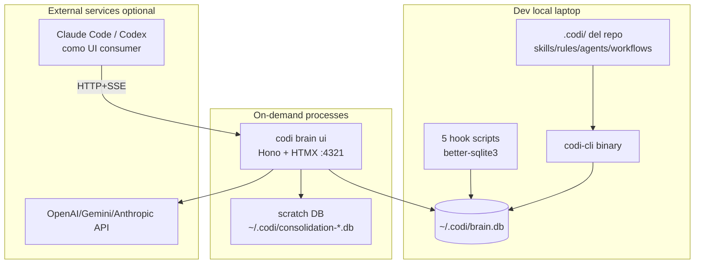
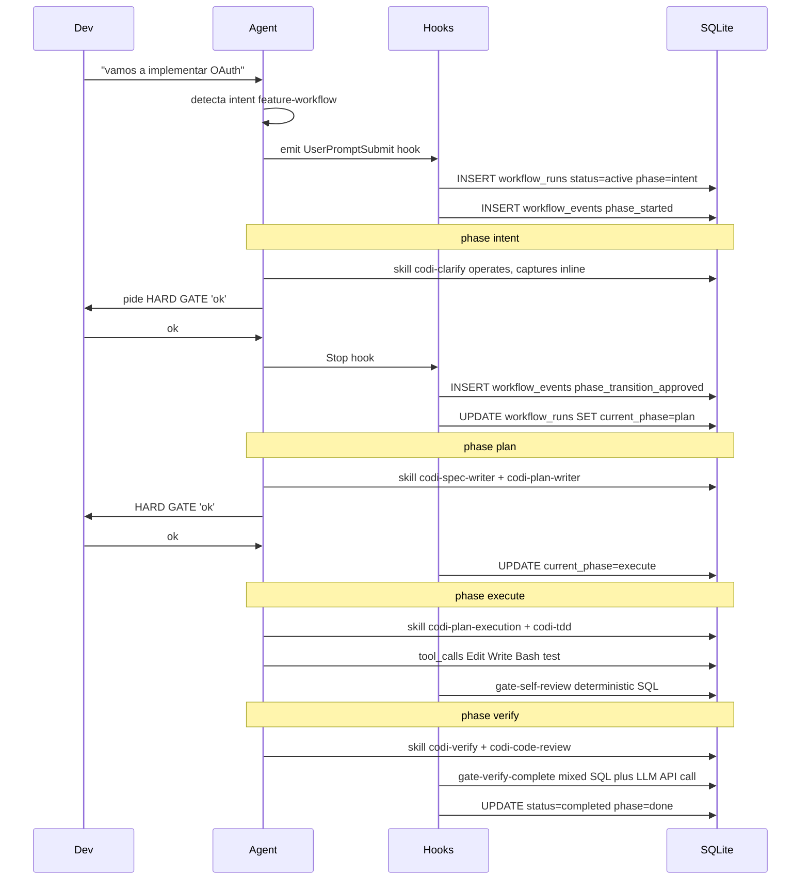

# Plan: Codi v3-zero — Diseño consolidado (post-grilling Q1-Q12)

- **Date**: 2026-05-08 09:54
- **Document**: 20260508*095403*[PLAN]\_codi-v3-zero.md
- **Category**: PLAN
- **Estado**: design-locked tras 12 preguntas de grilling iterativo
- **Sustituye/extiende**: 20260504*235331*[PLAN]\_codi-v3-consolidated.md §31 (lite/full split). v3-zero es un nuevo modo PRE-lite que removía Docker entero.
- **Relación con plan v3 consolidado**: v3-zero es el modo `--mode=zero` (nuevo, NO documentado en v3-consolidated). Compone los 4 modos del install: zero → lite → standard → full.

---

## Constants (counts vivos — única fuente)

Si cambias estos números, propágalos a TODAS las secciones que los citan.

| Constant                          | Valor        | Composición                                                                                                           |
| --------------------------------- | ------------ | --------------------------------------------------------------------------------------------------------------------- |
| Containers Docker                 | **0**        | sin Docker. Binario CLI + SQLite local.                                                                               |
| Tablas SQLite                     | **11**       | 9 captura/observability + 2 workflow runtime                                                                          |
| Tipos de captura                  | **10**       | RULE, PROHIBITION, PREFERENCE, FEEDBACK, INSIGHT, OBSERVATION, DECISION, QUESTION, PROMPT, CORRECTION                 |
| Hooks runtime                     | **5**        | SessionStart, UserPromptSubmit, PreToolUse, PostToolUse, Stop (Anthropic protocol)                                    |
| Hooks git                         | **1**        | pre-push (opcional)                                                                                                   |
| Stages pipeline consolidación     | **5**        | Ingest, Pattern detection, Proposal generation, Human review, Generate package                                        |
| Patterns deterministic detectados | **8**        | P1-P8 (capturas idénticas, similares, conflictos, high/low value, prompts vagos, workflow phase, tool fail)           |
| Tipos de propuesta                | **6**        | PROMOTE_TO_RULE, MERGE_SIMILAR, RESOLVE_CONFLICT, DEPRECATE_ARTIFACT, CREATE_NEW_ARTIFACT, OPTIMIZE_EXISTING_ARTIFACT |
| Workflows soportados              | **2**        | feature, bug-fix (resto defer a lite)                                                                                 |
| Endpoints UI HTTP                 | **11**       | api/v1/{health,loaded-dbs,findings*,proposals*,skills*,llm/*,events/stream}                                           |
| Q decisiones cerradas             | **12**       | Q1-Q12, ver §13 mapping                                                                                               |
| Fases roadmap MVP                 | **6**        | 0 estabilización, 1 captura, 2 workflows, 3 UI Live, 4 consolidación, 5 release                                       |
| Tiempo estimado MVP               | **8-10 sem** | con 1 dev TS dedicado                                                                                                 |

---

## Tabla de contenidos

0. Resumen ejecutivo
1. Visión y principios rectores (zero-specific)
2. Arquitectura: binario + SQLite + UI on-demand
3. Schema SQLite (11 tablas)
4. Captura inline: rule + UserPromptSubmit hook + parser
5. Captura raw: prompts + turns + tool_calls + corrections
6. Workflows phase-locked sin daemon
7. UI Hono + HTMX (Live + Consolidación)
8. Server lifecycle & idempotency (spawn-or-attach)
9. Modo dual LLM (API externa + agente coding)
10. Pipeline consolidación N→1 (5 stages)
11. Export/import `.db` SQLite
12. Roadmap MVP (6 fases, 8-10 semanas)
13. Migración zero → lite/standard/full
14. Mapping decisiones a preguntas grilling

---

## 0. Resumen ejecutivo

Codi v3-zero es el **modo más liviano de Codi v3**. Sin Docker, sin daemon, sin servicios persistentes. El cerebro del agente vive en una SQLite local del dev (`~/.codi/brain.db`) y la UI de consolidación arranca on-demand como server local Hono + HTMX en localhost.

**Filosofía agent-first**: el agente captura (proactivo), el dev guía (reactivo). El dev nunca persiste manualmente; el agente identifica qué guardar y emite markers `|TIPO: "..."|` al final de cada respuesta. Trace bruto se acumula automáticamente.

**Inteligencia del equipo**: cada dev tiene su SQLite local. Periódicamente, un dev encargado consolida N SQLites de devs distintos en una UI dedicada. La UI permite analizar, generar propuestas (LLM API directo o vía agente coding), aprobar/editar, y exportar un paquete `.zip` compat con presets.

**Nuevo modo de install**: `codi install --mode=zero` se convierte en el nuevo default minimalista, antes de los 3 modos del plan v3-consolidated (lite, standard, full). Total de modos: 4.

| Mode             | Containers | Daemon | Storage                      | Workflows        | LLM                         | Use case                                  |
| ---------------- | ---------- | ------ | ---------------------------- | ---------------- | --------------------------- | ----------------------------------------- |
| **zero** (NUEVO) | **0**      | **no** | SQLite local                 | feature, bug-fix | API directo + agente coding | Dev solo, agencia 4 devs sin infra Docker |
| lite             | 3          | sí     | Postgres                     | + más opciones   | + routing                   | Agencia con BD shared                     |
| standard         | 6          | sí     | Postgres + Memgraph + Qdrant | full catálogo    | full                        | Code graph + multi-tenant                 |
| full             | 9          | sí     | + Vaultwarden + UI dashboard | full             | full                        | Agencia heavy                             |

**Proposición de valor**:

- **Setup en <30s**: `codi install --mode=zero` clona templates + crea `~/.codi/brain.db`. Sin Docker. Sin healthcheck.
- **Cero RAM permanente**: solo se consume durante sesiones del agente. Server Hono solo cuando el dev arranca UI explícitamente.
- **Agnóstico de plataforma**: macOS, Linux, Windows nativo. Sin matriz Docker.
- **Migración limpia a lite**: `codi install --upgrade --mode=lite` migra schema SQLite a Postgres preservando datos.

**Lo que SÍ hay en zero**:

- Captura inline + raw trace en SQLite
- Workflows phase-locked (feature, bug-fix) en SQLite con HARD GATE 'ok'
- 5 hooks runtime con SQLite directo (latencia <1ms)
- UI on-demand para Live observation + Consolidación team
- Modo dual LLM en UI (API externa + agente coding via HTTP+SSE)
- Pipeline consolidación N→1 con 6 tipos de propuestas
- Export `.db` directo, sin redactions
- Compat con presets `.zip` (reusa `codi preset apply`)

**Lo que NO hay en zero (sube a lite/standard/full)**:

- Multi-user shared brain
- RLS/scopes/multi-agency
- Memgraph/Qdrant/code graph
- Vaultwarden (secrets en `~/.codi/llm-keys.json` chmod 600)
- UI dashboard React 6-section (`/api/v1/dashboard/*`)
- Override layer BD con base_hash conflict
- Auto-mejora 3-stage continuo (en zero es team event explícito)
- Workflow handover entre devs
- 5 workflows extras (project, refactor, migration, audit, review): feature absorbe la mayoría

---

## 1. Visión y principios rectores (zero-specific)

### 1.1 Visión

Un dev abre Claude Code o Codex en su laptop. El agente trabaja con él. Mientras trabaja, **captura silenciosamente** todo el contexto relevante en una SQLite local: prompts del dev, capturas semánticas (`|RULE: "..."|`, `|PROHIBITION: "..."|`, etc.), tool calls, correcciones manuales del dev, workflow phases.

Cuando el equipo (4 devs) quiere consolidar conocimiento, **un dev encargado arranca una UI local**, recibe los `.db` de los compañeros, analiza patterns cross-dev, genera propuestas de mejora a artefactos (skills, rules, agents, workflows, presets), revisa, aprueba, y empaqueta el resultado en un `.zip` que cada dev importa con `codi preset apply`.

**Cero infraestructura permanente**: no hay servidores corriendo en background, no hay containers, no hay daemon que mantener vivo. Todo es on-demand.

### 1.2 Principios rectores zero-specific

Hereda los 12 principios del plan v3 consolidated §1.2, con 6 adicionales específicos de zero:

13. **No daemon**: ningún proceso persistente. Hooks son scripts efímeros que arrancan/cierran con cada turno. UI es server on-demand spawned por skill.
14. **Single SQLite, single dev**: una base de datos por dev en `~/.codi/brain.db`. Cross-project via column `project_id`. Multi-dev via consolidación on-demand.
15. **Agent-first capture**: el agente identifica qué capturar; el dev nunca persiste manualmente. Markers `|TIPO: "..."|` son must al final de cada turno con captura.
16. **Trace level parametrizable**: `brain.trace_level: full | medium | minimal`. Default `full`. Permite al dev reducir storage si necesita.
17. **Idempotent server lifecycle**: skills que requieren UI ejecutan `acquire_or_start`; reutilizan instancia existente, evitan conflicts.
18. **Migration-aware**: schema diseñado para upgrade limpio a Postgres (modo lite). Mismas tablas, mismas columnas, solo cambia el driver.

### 1.3 Iron Laws (heredadas de v3-consolidated, mismas en zero)

8 leyes intactas. Más una opcional:

9. **Capture-everything-the-dev-says** (zero-specific): el agente MUST emitir `|TIPO: "..."|` cuando detecta una de las 10 categorías. Falsos negativos son tolerados (capture offline durante consolidación cubre el gap), falsos positivos NO (cada captura es un commit; el dev puede objetar pero el default es persist).

---

## 2. Arquitectura: binario + SQLite + UI on-demand

### 2.1 Componentes



### 2.2 Filesystem layout

```
~/                                     ← home del dev
├── .codi/
│   ├── brain.db                       ← SQLite store cross-project
│   ├── brain.db-wal                   ← WAL (auto)
│   ├── brain.db-shm                   ← shared memory (auto)
│   ├── ui.lock                        ← server PID + port (cuando UI activa)
│   ├── ui.pid                         ← solo PID (legacy fallback)
│   ├── llm-keys.json                  ← provider keys (chmod 600)
│   ├── secrets-patterns.json          ← regex de secrets para safe-export (futuro)
│   ├── exports/                       ← exports generados
│   │   ├── codi-brain-<hash>-<project>-<ts>.db
│   │   └── codi-team-package-<project>-<ts>.zip
│   ├── consolidation-<ts>.db          ← scratch DB temporal (durante consolidación)
│   └── backups/                       ← backups daily auto VACUUM INTO
│       └── brain-<YYYYMMDD>.db

<repo>/                                ← repo del dev
├── .codi/
│   ├── codi.yaml                      ← config zero (trace_level, llm provider, etc)
│   ├── skills/<name>/SKILL.md         ← artefactos del project
│   ├── rules/<name>.md
│   ├── agents/<name>.md
│   ├── workflow-runs/<wf-id>.md       ← artefactos generados por workflows (specs, plans)
│   ├── brain-prompts/                 ← templates editables por la UI
│   │   ├── promote-to-rule.md
│   │   ├── merge-similar.md
│   │   ├── resolve-conflict.md
│   │   ├── deprecate-artifact.md
│   │   ├── create-new-artifact.md
│   │   ├── optimize-skill.md
│   │   └── summarize-captures.md
│   └── credentials                    ← API token estático para auth zero (gitignored)
└── .gitignore                         ← incluye .codi/credentials, .codi/workflow-runs/
```

### 2.3 Configuración (`<repo>/.codi/codi.yaml`)

```yaml
# Codi v3-zero config
mode: zero
trace_level: full # full | medium | minimal

brain:
  path: ~/.codi/brain.db # default
  backup:
    enabled: true
    schedule: daily
    keep_days: 30
    path: ~/.codi/backups/

ui:
  port: 4321 # preferred (falls back to next free if busy)
  host: localhost
  auto_open_browser: true

llm:
  provider: anthropic # anthropic | openai | gemini (single in zero)
  model: claude-opus-4-7
  # api_key NO está aquí; vive en ~/.codi/llm-keys.json

consolidation:
  default_llm_mode: agent # agent | external
  prompts_dir: .codi/brain-prompts/

workflows:
  enabled: true
  active_types: [feature, bug-fix] # solo estos 2 en zero
  scope_enforcement_mode: auto-expand

hooks:
  user_prompt_submit:
    recall_whisper_top_k: 5
    recall_whisper_timeout_ms: 500
  stop:
    summary_default: false
```

### 2.4 Single repo monorepo (codi-cli)

```
codi/                          ← repo del producto Codi
├── packages/
│   ├── codi-cli/              ← npm publish package
│   ├── codi-brain-server/     ← Hono UI server (Live + Consolidación)
│   ├── codi-shared/           ← types + schemas + utils
│   └── codi-templates/        ← skills/rules/agents builtin
├── docs/
└── pnpm-workspace.yaml
```

**No hay** packages de v3-full (codi-app daemon, codi-workers, codi-ui React, codi-indexer Python). Esos llegan con upgrade a lite/standard/full.

---

## 3. Schema SQLite (11 tablas)

### 3.1 Tablas captura/observability (9)

```sql
-- 1. Project registry (resuelve project_id → metadata)
CREATE TABLE projects (
  project_id    TEXT PRIMARY KEY,         -- hash(git_remote_url || cwd)
  repo_path     TEXT NOT NULL,
  git_remote    TEXT,
  name          TEXT NOT NULL,
  first_seen    INTEGER NOT NULL,
  last_seen     INTEGER NOT NULL
);

-- 2. Sessions (1 row por sesión Claude Code / Codex)
CREATE TABLE sessions (
  session_id          TEXT PRIMARY KEY,
  project_id          TEXT NOT NULL,
  agent_type          TEXT NOT NULL,        -- 'claude-code' | 'codex' | 'cursor'
  agent_model         TEXT,
  started_at          INTEGER NOT NULL,
  ended_at            INTEGER,
  branch              TEXT,
  commit_sha          TEXT,
  working_dir         TEXT NOT NULL,
  transcript_path     TEXT,
  workflow_id         TEXT,
  total_turns         INTEGER DEFAULT 0,
  total_capture_count INTEGER DEFAULT 0
);

-- 3. Prompts (todo lo que el dev escribe — auto)
CREATE TABLE prompts (
  prompt_id     INTEGER PRIMARY KEY AUTOINCREMENT,
  session_id    TEXT NOT NULL,
  turn_no       INTEGER NOT NULL,
  ts            INTEGER NOT NULL,
  text          TEXT NOT NULL,
  char_count    INTEGER NOT NULL
);

-- 4. Turns (texto completo del agente, solo si trace_level='full')
CREATE TABLE turns (
  turn_id       INTEGER PRIMARY KEY AUTOINCREMENT,
  session_id    TEXT NOT NULL,
  turn_no       INTEGER NOT NULL,
  ts            INTEGER NOT NULL,
  agent_text    TEXT,
  duration_ms   INTEGER,
  prompt_id     INTEGER NOT NULL
);

-- 5. Captures (los markers |TIPO: "..."| parseados)
CREATE TABLE captures (
  capture_id    INTEGER PRIMARY KEY AUTOINCREMENT,
  session_id    TEXT NOT NULL,
  prompt_id     INTEGER NOT NULL,
  turn_id       INTEGER NOT NULL,
  ts            INTEGER NOT NULL,
  type          TEXT NOT NULL,            -- 'RULE' | 'PROHIBITION' | ...
  content       TEXT NOT NULL,
  raw_marker    TEXT NOT NULL,
  file_paths    TEXT,                     -- JSON array
  workflow_id   TEXT,
  phase         TEXT
);

-- 6. Tool calls
CREATE TABLE tool_calls (
  call_id         INTEGER PRIMARY KEY AUTOINCREMENT,
  session_id      TEXT NOT NULL,
  turn_id         INTEGER NOT NULL,
  ts              INTEGER NOT NULL,
  tool_name       TEXT NOT NULL,
  input_json      TEXT NOT NULL,
  output_summary  TEXT,
  duration_ms     INTEGER,
  status          TEXT NOT NULL,          -- 'success' | 'failure' | 'denied' | 'cancelled'
  error           TEXT
);

-- 7. Corrections (dev edita manualmente algo del agente)
CREATE TABLE corrections (
  correction_id  INTEGER PRIMARY KEY AUTOINCREMENT,
  session_id     TEXT NOT NULL,
  ts             INTEGER NOT NULL,
  file_path      TEXT NOT NULL,
  diff_summary   TEXT NOT NULL,
  source_turn_id INTEGER,
  detected_via   TEXT NOT NULL            -- 'git-diff' | 'file-mtime' | 'explicit-marker'
);

-- 8. Artifacts used (qué cargó/usó el agente)
CREATE TABLE artifacts_used (
  usage_id       INTEGER PRIMARY KEY AUTOINCREMENT,
  session_id     TEXT NOT NULL,
  turn_id        INTEGER,
  ts             INTEGER NOT NULL,
  artifact_type  TEXT NOT NULL,           -- 'skill' | 'rule' | 'agent' | 'workflow' | 'preset'
  artifact_name  TEXT NOT NULL,
  event          TEXT NOT NULL,           -- 'loaded' | 'invoked' | 'completed' | 'failed' | 'unused'
  outcome        TEXT,                    -- 'success' | 'failure' | 'partial'
  duration_ms    INTEGER
);

-- 9. Schema version (para migrations)
CREATE TABLE _codi_schema_version (
  version    INTEGER PRIMARY KEY,
  applied_at INTEGER NOT NULL
);
```

### 3.2 Tablas workflow runtime (2)

```sql
-- 10. Workflow runs (state machine sin daemon)
CREATE TABLE workflow_runs (
  workflow_id     TEXT PRIMARY KEY,         -- uuid
  project_id      TEXT NOT NULL,
  type            TEXT NOT NULL,            -- 'feature' | 'bug-fix'
  current_phase   TEXT NOT NULL,
  status          TEXT NOT NULL,            -- 'active' | 'completed' | 'abandoned'
  started_at      INTEGER NOT NULL,
  ended_at        INTEGER,
  metadata        TEXT                      -- JSON: scope_files, gates_passed, ownership
);

-- 11. Workflow events (event sourcing append-only)
CREATE TABLE workflow_events (
  event_id        INTEGER PRIMARY KEY AUTOINCREMENT,
  workflow_id     TEXT NOT NULL,
  event_type      TEXT NOT NULL,            -- 'phase_started' | 'phase_completed' | 'gate_passed' | 'gate_failed' | 'phase_transition_proposed' | 'phase_transition_approved' | 'phase_transition_rejected'
  ts              INTEGER NOT NULL,
  payload         TEXT                      -- JSON
);
```

### 3.3 Tabla export metadata (escrita en exports, no en working store)

Cuando se hace `VACUUM INTO export.db`, la skill de export INSERTA esta tabla en la copia exportada:

```sql
CREATE TABLE _codi_export_metadata (
  key        TEXT PRIMARY KEY,
  value      TEXT NOT NULL
);
-- Rows insertados al exportar:
-- ('schema_version', '1')
-- ('codi_version', '3.0.0-zero')
-- ('exported_by_hash', '<sha256(email + salt)>')
-- ('exported_at', '<unix epoch>')
-- ('project_id', '<hash>')
-- ('project_name', '<repo name>')
-- ('redactions_applied', 'none')
-- ('row_counts_summary', '<json>')
-- ('checksum_sha256', '<hash>')
```

### 3.4 Índices

```sql
-- FTS5 para recall whisper
CREATE VIRTUAL TABLE captures_fts USING fts5(content, content='captures', content_rowid='capture_id');
CREATE VIRTUAL TABLE prompts_fts USING fts5(text, content='prompts', content_rowid='prompt_id');

-- Hot path queries
CREATE INDEX idx_sessions_project_started ON sessions(project_id, started_at DESC);
CREATE INDEX idx_captures_type_session ON captures(type, session_id);
CREATE INDEX idx_captures_session_ts ON captures(session_id, ts);
CREATE INDEX idx_prompts_session_turn ON prompts(session_id, turn_no);
CREATE INDEX idx_tool_calls_session_turn ON tool_calls(session_id, turn_id);
CREATE INDEX idx_artifacts_used_name_outcome ON artifacts_used(artifact_name, outcome);
CREATE INDEX idx_workflow_runs_project_status ON workflow_runs(project_id, status);
CREATE INDEX idx_workflow_events_wf_ts ON workflow_events(workflow_id, ts);

-- Embeddings (cuando trace_level=full + sqlite-vec extension cargada)
CREATE VIRTUAL TABLE captures_vec USING vec0(
  capture_id INTEGER PRIMARY KEY,
  embedding FLOAT[1536]
);
```

### 3.5 Storage estimado

Para 1 dev, 1 año, uso intensivo (10 sesiones/día × 250 días × ~30 turns/sesión = 75k turns):

| Tabla              | Filas | Tamaño      |
| ------------------ | ----- | ----------- |
| prompts            | 75k   | 15 MB       |
| turns (full trace) | 75k   | 150 MB      |
| captures           | ~5k   | 2.5 MB      |
| tool_calls         | 375k  | 113 MB      |
| corrections        | ~500  | 0.25 MB     |
| artifacts_used     | ~75k  | 15 MB       |
| workflow_runs      | ~250  | 0.1 MB      |
| workflow_events    | ~5k   | 1 MB        |
| **Total**          |       | **~300 MB** |

Reducible a ~150 MB con `trace_level='medium'` (omite `turns.agent_text`).

---

## 4. Captura inline: rule + UserPromptSubmit hook + parser

### 4.1 Patrón canónico

El agente MUST emitir al final de su mensaje, una línea por captura detectada:

```
|RULE: "siempre usar Result types en src/auth/*"|
|PROHIBITION: "no usar DROP TABLE en migrations sin backup"|
|INSIGHT: "TDD micro-cycle acelera feedback loop en este equipo"|
|FEEDBACK: "el dev rechazó el último diff por estilo de naming"|
|DECISION: "OAuth via passport.js, no Auth0"|
```

### 4.2 Enforcement (A+C de Q6)

**A — Rule always-loaded `codi-capture-everything`**:

- Path: `.codi/rules/codi-capture-everything.md`
- Loading tier A (always-loaded en SessionStart context).
- Contenido: instrucciones detalladas + taxonomía de 10 tipos + ejemplos.

**C — UserPromptSubmit hook reinforcement**:

- Cada turno, el hook añade en `additionalContext`:

```xml
<codi-capture-protocol>
  You MUST emit |TYPE: "verbatim content"| at the end of your response when detecting:
  - dev says "always/siempre/must/regla" → RULE
  - dev says "never/nunca/no uses/prohibido" → PROHIBITION
  - dev expresses preference ("prefiero", "me gusta") → PREFERENCE
  - dev corrects your output → FEEDBACK
  - you observe a pattern → INSIGHT
  - factual context-relevant note → OBSERVATION
  - workflow gate decision → DECISION
  - dev unresolved doubt → QUESTION
  - dev edits manually → CORRECTION (rare; usually auto-detected)
  Multiple captures allowed in same response, one per line.
  Format: |TYPE: "verbatim"| no extra characters before or after the pipes.
</codi-capture-protocol>
```

- Costo: ~250 tokens por turno (~$0.001 con Sonnet, despreciable).

### 4.3 Parser (en hook Stop)

Después del último mensaje del agente, el hook Stop:

1. Lee transcript (Claude Code: `~/.claude/projects/<hash>/<session>.jsonl`; Codex: `~/.codex/sessions/...`).
2. Extrae el último `assistant` message text.
3. Aplica regex global: `/\|([A-Z_]+):\s*"([^"]*)"\|/g`.
4. Para cada match:
   - Valida `type` ∈ taxonomía (10 tipos válidos). Si no, log warning, skip.
   - Captura `content` verbatim.
   - Computa `file_paths` (tool_calls del mismo turn que tocaron files).
   - Lee `workflow_runs` activo del project (si hay).
   - INSERT INTO `captures` con todos los campos.
5. Si no hubo markers en el último turn pero el agente hizo cambios significativos (>3 tool_calls), log warning silently → futuro v3-zero.1 podría disparar reflexión retroactiva.

### 4.4 Idempotencia del parser

- Cada captura tiene un hash `(session_id, turn_id, raw_marker)`.
- Antes de INSERT, check `EXISTS WHERE hash = ?`.
- Si ya existe (Stop hook ejecutó 2 veces por crash recovery): noop.

### 4.5 Anuncio inline al dev

El agente DEBE incluir el marker visiblemente al final de su respuesta. El dev VE el marker. Si objeta, el agente puede emitir `|CAPTURE_REVERT: "<original raw_marker>"|` en el siguiente turno → Stop hook detecta reverts y borra la captura matching.

NO hay confirmación pre-captura (decisión Q3.3): es post-hoc.

---

## 5. Captura raw: prompts + turns + tool_calls + corrections

### 5.1 Prompts (auto, sin filtro)

Hook `UserPromptSubmit` ejecuta INSERT en tabla `prompts` con `(session_id, turn_no, ts, text, char_count)`.

Todos los prompts del dev se persisten. Sin filtro, sin clasificación. Útil para:

- Análisis de calidad de prompting (Q11 P6 finding).
- Reconstruir contexto al consolidar.
- Detectar prompts vagos/repetidos (gap de skills).

### 5.2 Turns (texto completo si trace_level='full')

Hook `Stop` ejecuta INSERT en tabla `turns` con `(session_id, turn_no, ts, agent_text, duration_ms, prompt_id)`.

Si `trace_level=full`, `agent_text` lleva el texto completo del agente. Si `medium` o `minimal`, queda NULL.

### 5.3 Tool calls (cada Edit/Write/Bash/Read/etc)

Hook `PostToolUse` ejecuta INSERT en tabla `tool_calls` con todos los campos del schema.

- `input_json`: full input del tool (JSON serialized). Para Edit: `{file_path, old_string, new_string}`. Para Bash: `{command}`.
- `output_summary`: capeado a 500 chars. Si output era largo, queda truncado con sufijo `... (truncated, see transcript)`.
- `tool_name` normalizado: `apply_patch` → `Edit` (Codex aliasing, ya documentado en plan v3-consolidated).

### 5.4 Corrections (dev edita manualmente algo del agente)

Detección via 3 mecanismos (configurable en `.codi/codi.yaml`):

**git-diff (default)**: hook Stop ejecuta `git diff HEAD` post-turn. Si detecta cambios en files que el agente tocó este turn (vía tool_calls), pero los cambios no matchean el `new_string` del Edit, asume corrección.

**file-mtime**: chequear `stat` de files tocados por el agente. Si mtime > tool_call.ts + 5s, asume edit manual del dev.

**explicit-marker**: el agente puede emitir `|CORRECTION: "..."|` cuando observa que el dev cambió algo manualmente (raro pero posible).

INSERT en tabla `corrections` con detected_via correspondiente.

---

## 6. Workflows phase-locked sin daemon

### 6.1 Workflows soportados en zero

Solo 2 (resto defer a lite):

| Workflow  | Phases                                              | Skills SDD core invocadas                                                   |
| --------- | --------------------------------------------------- | --------------------------------------------------------------------------- |
| `feature` | intent → plan → execute → verify → done             | clarify, spec-writer, plan-writer, plan-execution, tdd, verify, code-review |
| `bug-fix` | intent → reproduce → plan → execute → verify → done | clarify, debugging, plan-writer, plan-execution, tdd, verify, code-review   |

**Decompose phase eliminada en zero**: feature en zero NO tiene `decompose` separada. El plan-writer hace task breakdown inline en `plan` phase. Simplificación apropiada para 4 devs.

### 6.2 Lifecycle de un workflow



### 6.3 Gates en zero

**Deterministic gates** (8): SQL queries inline en hook scripts. <2ms latencia.

```sql
-- gate-self-review (en hook PreToolUse antes de transición execute → verify)
SELECT
  (SELECT COUNT(*) FROM workflow_events WHERE workflow_id = ? AND event_type = 'task_completed') AS done,
  (SELECT json_extract(metadata, '$.tasks_total') FROM workflow_runs WHERE workflow_id = ?) AS total
WHERE done = total;
-- if rows returned: gate passed
```

**Agent-fork gates** (los que necesitan subagent en v3-full): en zero llaman LLM API externa directa con la key del dev (`~/.codi/llm-keys.json`). Implementación pseudocódigo:

- Lee `spec_artifact` y `plan_artifact` del workflow.
- Construye prompt: `"Spec:\n{spec}\n\nPlan:\n{plan}\n\nDoes the plan cover all acceptance_criteria? Answer JSON: {passed: bool, reason: ...}"`
- POST al endpoint del provider (Anthropic/OpenAI/Gemini) con la key.
- Parsea response JSON, retorna `GateResult { passed, reason }`.

Latencia agent-fork gates: ~3-8s con Haiku, aceptable para gates explicitos del dev.

### 6.4 Workflow scope enforcement

`workflow_runs.metadata` JSON incluye:

```json
{
  "scope_files": ["src/auth/*", "tests/auth/*"],
  "scope_mode": "auto-expand",
  "tasks_total": 5,
  "tasks_completed": 2,
  "evidence_artifacts": ["docs/specs/oauth-spec.md", "docs/plans/oauth-plan.md"]
}
```

Hook PreToolUse lee `scope_files` + `scope_mode`. Si Edit/Write fuera de scope:

- Modo `auto-expand` (default zero): permite + UPDATE metadata expand scope_files.
- Modo `strict`: deny con permissionDecision.

### 6.5 Limitaciones zero

- **No handover entre devs**: workflow_runs viven en SQLite del dev. Para handover formal, upgrade a lite.
- **No multi-tenant**: 1 SQLite = 1 dev = 1 vista de workflows.
- **No 5 workflows extras**: project, refactor, migration, audit, review NO están. Para esos, upgrade.
- **No archivos compartidos cross-dev**: si dev A tiene workflow `feature/oauth` activo, dev B en su laptop NO lo ve. Para visibility cross-dev → consolidación team o upgrade.

---

## 7. UI Hono + HTMX (Live + Consolidación)

### 7.1 Stack

- **Backend**: Hono (TS) en Node.js. Single binary via pkg/bun build.
- **Frontend**: HTMX 2.x + Alpine.js (interactividad ligera) + Tailwind (CDN o build local).
- **Templates**: Eta o Handlebars server-rendered.
- **Charts**: Chart.js vanilla cuando aplica.
- **Database access**: better-sqlite3 (sync API, fast).
- **Real-time**: SSE en `/api/v1/events/stream`.

### 7.2 Modos de la UI

**Live (default)**: dashboard de la sesión activa del dev. Lee `~/.codi/brain.db` y muestra captures, tool_calls, workflow phase en tiempo real (polling WAL mtime 1-2s + SSE).

**Consolidación**: dev encargado dropea otras SQLites en zona drag&drop. Server crea `~/.codi/consolidation-<ts>.db` (scratch) y hace `ATTACH` de cada DB cargada. UI switchea a vista comparativa.

### 7.3 Páginas de la UI

```
/                           Dashboard summary (Live counts, devs cargados en consolidación)
/live                       Vista Live de la sesión activa
/findings                   Tabla findings P1-P8 (solo en consolidación)
/findings/:id               Detalle finding + evidence + acciones (LLM | agente | manual)
/proposals                  Tabla propuestas con accept/edit/reject inline
/skills                     Lista skills del repo activo
/skills/:name               Editor de skill: contenido actual + diff propuesto + capturas relacionadas
/llm-config                 Config keys + provider selector + prompts editables
/prompts                    Editor de templates de prompts (defaults pre-cargados)
/export                     Generar paquete consolidado (.zip preset-compat)
/api/...                    Endpoints HTTP públicos
```

### 7.4 Endpoints HTTP

```
GET  /api/v1/health                          → ping liveness, identity
GET  /api/v1/loaded-dbs                      → SQLites cargadas + counts
GET  /api/v1/findings?pattern=P1&dev=...    → findings detectados
GET  /api/v1/findings/:id                    → detalle + evidence raw
POST /api/v1/findings/:id/propose            → agente crea propuesta
GET  /api/v1/proposals?status=pending        → lista propuestas
PATCH /api/v1/proposals/:id                  → update status (approve/reject/edit)
GET  /api/v1/skills                          → lista .codi/skills/ del repo activo
GET  /api/v1/skills/:name                    → contenido del SKILL.md + capturas relacionadas
POST /api/v1/skills/:name/draft              → agente submete versión optimizada
GET  /api/v1/llm/config                      → config actual (sin keys reveal)
POST /api/v1/llm/invoke                      → invoke LLM con prompt template + variables
GET  /api/v1/events/stream?since=<event_id>  → SSE: nuevos eventos
```

### 7.5 Live observation

**Polling WAL changes**: server mantiene un watcher que cada 1.5s hace `stat ~/.codi/brain.db-wal` y compara mtime con el último valor leído. Si cambió, ejecuta queries de últimos N rows recientes en cada tabla relevante (captures, tool_calls, prompts, workflow_events) y emite SSE eventos a clientes conectados.

UI suscribe via EventSource:

```javascript
const evt = new EventSource("/api/v1/events/stream");
evt.addEventListener("live.update", (e) => {
  const data = JSON.parse(e.data);
  // refresh tabla via HTMX hx-trigger
  document.dispatchEvent(new CustomEvent("codi-data-changed", { detail: data }));
});
```

### 7.6 Eventos SSE emitidos

- `capture.created` — nueva fila en `captures`
- `tool_call.completed` — nueva fila en `tool_calls`
- `workflow_event.appended` — nueva fila en `workflow_events`
- `workflow.phase_changed` — `workflow_runs.current_phase` cambió
- `prompt.received` — nueva fila en `prompts`
- `consolidation.proposal_generated` — nueva propuesta lista
- `consolidation.proposal_status_changed` — proposal aprobada/rechazada/editada

---

## 8. Server lifecycle & idempotency (spawn-or-attach)

### 8.1 Patrón canónico

Skills que requieren UI ejecutan:

```bash
codi brain ensure-running --silent
```

Internamente:

1. Lee `~/.codi/ui.lock`. Si existe: parsea PID + port.
2. `kill -0 <pid>` → check vivo.
3. `GET http://<host>:<port>/api/v1/health` con timeout 200ms.
4. Si responde con `{"app": "codi-brain"}`: retorna `{url, pid, attached: true}`.
5. Si no: rm lock + spawn detached + wait healthcheck (max 5s) + retorna `{url, pid, attached: false}`.

### 8.2 Lock file format

`~/.codi/ui.lock`:

```json
{
  "pid": 12345,
  "port": 4321,
  "host": "localhost",
  "started_at": 1746780000,
  "codi_version": "3.0.0-zero",
  "schema_version": 1,
  "started_by": "codi brain ui",
  "session_id": "<uuid del proceso server>"
}
```

### 8.3 Defensive race-protection

Al arrancar, server intenta bind del port. Si EADDRINUSE:

- HTTP healthcheck el port. Si responde con `app === "codi-brain"`: log "ya hay server", exit(0).
- Si no responde Codi-brain: log error, exit(1).

Esto elimina races entre 2 sesiones spawneando server simultáneamente.

### 8.4 Cleanup automático

Server registra:

- `SIGTERM`, `SIGINT`, `SIGHUP` → graceful shutdown + rm lock.
- `process.on('exit')` → rm lock como fallback.
- Crashes inesperados: lock queda stale; próxima invocación detecta PID dead → rm + spawn.

### 8.5 Comandos CLI consistency

```bash
codi brain ui                    # spawn-or-attach + open browser default
codi brain ui --no-open          # spawn sin browser
codi brain ui --port=4321        # custom port (overrides codi.yaml)
codi brain status                # info del server activo
codi brain stop                  # kill PID + rm lock graceful
codi brain consolidate           # spawn-or-attach + abre /findings (modo consolidación implícito)
codi brain export --project=X    # CLI puro, no requiere server
codi brain import <file.db>      # CLI puro, no requiere server
```

`codi brain status` ejemplo:

```
$ codi brain status
✓ server running
  PID:        12345
  port:       4321
  uptime:     12m 34s
  mode:       live
  url:        http://localhost:4321
  started by: codi brain ui (claude-code session abc123)
```

---

## 9. Modo dual LLM (API externa + agente coding)

### 9.1 Modo 1 — LLM directo desde UI

Configuración:

```json
// /llm-config en UI escribe a ~/.codi/llm-keys.json
{
  "providers": {
    "anthropic": { "api_key": "sk-ant-...", "default_model": "claude-opus-4-7" },
    "openai": { "api_key": "sk-...", "default_model": "gpt-5" },
    "gemini": { "api_key": "AI...", "default_model": "gemini-2-flash" }
  },
  "default": "anthropic"
}
```

Permisos: `chmod 600 ~/.codi/llm-keys.json`. NO se commitea, NO se exporta.

Flow:

1. Dev edita prompt template en `/prompts` page.
2. UI rellena placeholders con findings/capturas.
3. POST `/api/v1/llm/invoke {provider, prompt, max_tokens}`.
4. Backend Hono hace HTTP call al provider.
5. Response renderea en UI con accept/edit/reject buttons.

### 9.2 Modo 2 — Agente coding como operario externo

Patrón content-factory: la UI expone endpoints HTTP. El agente (Claude Code/Codex en sesión activa del dev encargado) consume esos endpoints.

Flow:

1. Dev encargado a Claude Code: "vamos a consolidar el cerebro del team".
2. Agente activa skill `codi-brain-consolidate`.
3. Skill ejecuta `codi brain ensure-running --silent` → server up.
4. Skill instruye al agente: "el server está en localhost:<port>; usa estos endpoints: ...".
5. Agente itera:
   - GET `/api/v1/findings` → lista de findings.
   - Por cada finding: GET `/api/v1/findings/:id` → detalle.
   - Decide qué proponer; lee prompts templates de `.codi/brain-prompts/`.
   - Genera draft con sus tools.
   - POST `/api/v1/findings/:id/propose {action_payload, ...}` → propuesta creada.
6. Dev encargado revisa en UI (browser abierto en paralelo) las propuestas y aprueba/rechaza/edita.
7. Agente recibe SSE events de status changes y continúa.

### 9.3 Templates de prompts editables

`.codi/brain-prompts/` directorio versionable opcional. Defaults pre-cargados al instalar:

```markdown
<!-- .codi/brain-prompts/promote-to-rule.md -->

# PROMOTE_TO_RULE

You are analyzing captures from {dev_count} developers working on project {project_name}.

The following capture content appears in {capture_count} captures, across {dev_count} distinct developers:

{capture_content_canonical}

Evidence:
{evidence_json}

Task: Generate a canonical RULE markdown file for `.codi/rules/{slug}.md`.

Format: standard rule frontmatter + sections + BAD/GOOD examples.

Output ONLY the markdown content. No commentary.
```

Variables disponibles: `{capture_content_canonical}`, `{capture_count}`, `{dev_count}`, `{evidence_json}`, `{project_name}`, `{existing_skill_md}`, `{finding_summary}`.

### 9.4 Configuración default

```yaml
# .codi/codi.yaml
consolidation:
  default_llm_mode: agent # 'agent' | 'external' default; per-finding override en UI
  prompts_dir: .codi/brain-prompts/
  external_llm:
    provider: anthropic
    model: claude-haiku-4-5 # más barato para batch
    max_tokens: 4096
    temperature: 0.3
  agent_mode:
    timeout_per_proposal_seconds: 120
    max_concurrent_proposals: 3
```

---

## 10. Pipeline consolidación N→1 (5 stages)

### 10.1 Stage 1 — Ingest (deterministic)

El consolidador crea una scratch DB temporal en `~/.codi/consolidation-<ts>.db` y hace `ATTACH` de cada SQLite cargada como alias `db0`, `db1`, ..., `dbN`.

Por cada DB attached, lee `_codi_export_metadata` para validar `schema_version` compatible. Si no, warning + skip esa DB.

Computa una temp table `dev_summary` con counts agregados por dev (sessions, captures, tool_calls, corrections, primer/último timestamp de actividad).

### 10.2 Stage 2 — Pattern detection (8 queries SQL deterministic)

Cada query genera un set de "findings". Sin LLM aún. Resultados se INSERT en tabla `findings` de la scratch DB.

```sql
-- Tabla findings en scratch DB
CREATE TABLE findings (
  id              INTEGER PRIMARY KEY AUTOINCREMENT,
  pattern_code    TEXT NOT NULL,            -- 'P1' | 'P2' | ... | 'P8'
  severity        TEXT NOT NULL,            -- 'low' | 'medium' | 'high'
  evidence_json   TEXT NOT NULL,
  created_at      INTEGER NOT NULL
);
```

Patterns:

- **P1 — Capturas idénticas cross-dev**: GROUP BY content WHERE COUNT(DISTINCT db_alias) > 1, en captures con type IN ('RULE', 'PROHIBITION'). Output: clusters de capturas literales repetidas across devs.
- **P2 — Capturas similares (semantic)**: si embeddings disponibles, vec_distance < 0.15 entre captures de devs distintos. Clustering via DBSCAN simple en SQL.
- **P3 — Conflictos directos**: type=RULE de un dev vs type=PROHIBITION de otro dev sobre overlap de file_paths con contenido contradictorio.
- **P4 — Artefactos high-value**: artifacts_used WHERE outcome='success' AND used_in_pct > 0.5 AND success_rate > 0.8.
- **P5 — Artefactos low-value**: failure_rate > 0.3 OR (loaded but never invoked en >100 sessions).
- **P6 — Pattern de prompts vagos**: prompts WHERE char_count < 30, correlacionado con corrections altas en mismo session.
- **P7 — Workflow phase friction**: sessions WITH workflow_id, abandoned vs completed por phase. Phases con abandono > 30%.
- **P8 — Tool call fail patterns**: tool_calls WHERE status='failure' GROUP BY error LIMIT 20.

### 10.3 Stage 3 — Proposal generation (LLM-assisted, lazy)

Por cada finding clicado por el dev (modo 1) o invocado por el agente (modo 2):

1. Server lee finding + maps pattern_code → proposal_type (P1/P2 → PROMOTE_TO_RULE/MERGE_SIMILAR, etc).
2. Lee prompt template correspondiente de `.codi/brain-prompts/<type>.md`.
3. Rellena placeholders con datos del finding.
4. Si modo 'external': server hace HTTP call al provider, recibe response, INSERT proposal.
5. Si modo 'agent': retorna prompt al agente; agente genera draft con sus tools y POST `/api/v1/findings/:id/propose`.

### 10.4 Stage 4 — Human review en UI

Tabla `/proposals` con accept/edit/reject inline. Dev encargado opera. State persiste en scratch DB:

```sql
CREATE TABLE proposals (
  id              INTEGER PRIMARY KEY AUTOINCREMENT,
  finding_id      INTEGER NOT NULL,
  type            TEXT NOT NULL,        -- 6 tipos
  title           TEXT NOT NULL,
  description     TEXT NOT NULL,
  action_payload  TEXT NOT NULL,        -- JSON con artifact_type, operation, file_path, content
  confidence      TEXT,                 -- 'low' | 'medium' | 'high' (computed offline)
  status          TEXT NOT NULL DEFAULT 'pending',  -- 'pending' | 'approved' | 'rejected' | 'edited'
  created_at      INTEGER NOT NULL,
  reviewed_at     INTEGER,
  edited_content  TEXT                  -- si status='edited'
);
```

### 10.5 Stage 5 — Generate consolidated package

Server itera sobre `proposals WHERE status IN ('approved', 'edited')`:

1. Crea directorio temporal con copia del `.codi/` actual del repo.
2. Por cada propuesta:
   - Parsea `action_payload` JSON: `{artifact_type, operation, file_path, content}`.
   - Operation `create`: escribe nuevo file en tmp.
   - Operation `update`: sobreescribe file existente.
   - Operation `delete`: borra file.
   - Operation `rename`: rename file.
   - Si `status=edited`, usa `edited_content` en lugar del `content` original.
3. Genera `consolidation-log.md` con summary humano de cambios + atribución a devs.
4. Empaqueta directorio en `.zip` compat con presets.
5. Output: `~/.codi/exports/codi-team-package-<project>-<ts>.zip`.

Cada dev importa con `codi preset apply codi-team-package-<...>.zip`.

---

## 11. Export/import `.db` SQLite

### 11.1 Export

```bash
codi brain export --project=<project_id> [--output=<path>] [--include-transcripts=false]
```

Implementación:

1. Verifica que `~/.codi/brain.db` existe + project_id válido.
2. `VACUUM INTO ~/.codi/exports/codi-brain-<devhash>-<project>-<ts>.db.tmp` (atómico, funciona durante writes).
3. En la copia tmp:
   - DELETE rows WHERE project_id != <project_id_seleccionado> en tablas con esa columna.
   - INSERT INTO `_codi_export_metadata` (schema_version, codi_version, exported_by_hash, exported_at, project_id, project_name, redactions_applied='none', row_counts_summary, checksum_sha256).
4. Calcula checksum sobre todas las tablas (excluyendo `_codi_export_metadata.checksum_sha256` por recursión).
5. UPDATE checksum.
6. Renombra `.db.tmp` → `.db`.

### 11.2 Import

```bash
codi brain import <path-to-export.db>
```

NO se hace en CLI puro generalmente — la UI consolidación es donde se cargan exports via drag&drop. Pero CLI fallback existe:

1. Valida `_codi_export_metadata.schema_version` compatible.
2. Valida checksum.
3. ATTACH al working store O si scratch consolidation activa, ATTACH como `dbN`.

### 11.3 Naming convention

`codi-brain-<devhash8>-<project_slug>-<YYYYMMDDHHMM>.db`

- `<devhash8>`: sha256(email + salt) primeros 8 chars.
- `<project_slug>`: slugified project name.
- `<YYYYMMDDHHMM>`: sortable timestamp.

Ejemplo: `codi-brain-a3f7b2c1-acme-app-202605081430.db`.

### 11.4 Tamaño típico

~30-80 MB un dev tras 6 meses uso intensivo (full trace level). Compresión ZIP opcional añadiría ~50% reducción pero NO se aplica por default (decisión Q8: SQLite directo).

---

## 12. Roadmap MVP (6 fases, 8-10 semanas)

| Fase                           | Duración | Objetivo                                            | Entregables                                                                                                                                                                                        |
| ------------------------------ | -------- | --------------------------------------------------- | -------------------------------------------------------------------------------------------------------------------------------------------------------------------------------------------------- |
| **0 — Estabilización**         | 1 sem    | ADRs base + decisiones lock                         | ADR-zero-001 SQLite vs Postgres, ADR-zero-002 single-DB cross-project, ADR-zero-003 markers pattern, ADR-zero-004 UI mode dual                                                                     |
| **1 — Captura runtime**        | 2 sem    | Hooks + parser markers + schema                     | 5 hooks Node con better-sqlite3, parser regex `\|TYPE: "..."\|`, schema 11 tablas + migrations, rule `codi-capture-everything`, FTS5 indexes                                                       |
| **2 — Workflows phase-locked** | 1.5 sem  | feature + bug-fix workflows + 8 deterministic gates | workflow_runs + workflow_events tables, gates SQL queries inline, workflow_runs CLI commands                                                                                                       |
| **3 — UI Live**                | 2 sem    | Hono server + HTMX dashboard live                   | server spawn-or-attach lifecycle, polling WAL, SSE stream, páginas /, /live, /findings stub                                                                                                        |
| **4 — Consolidación**          | 2 sem    | Pipeline N→1 + LLM dual mode + UI completa          | scratch DB + ATTACH multi, 8 patterns SQL detection, prompt templates editables, /proposals con accept/edit/reject, /skills + /skills/:name optimization, modo external LLM + modo agent endpoints |
| **5 — Release v3.0-zero**      | 1.5 sem  | Polish + docs + npm publish                         | `codi-cli` con `--mode=zero`, README + getting-started, migration guide zero→lite stub, CI con tests                                                                                               |

**Total**: 10 semanas con 1 dev TS dedicado.

### 12.1 Milestones intermedios

- **M1 (fin semana 3)**: dev puede usar Claude Code en un repo, ver capturas en SQLite. Sin UI. Sin workflows.
- **M2 (fin semana 4.5)**: workflows feature + bug-fix funcionando con HARD GATE 'ok'. Aún sin UI.
- **M3 (fin semana 6.5)**: UI Live funcional. Dev puede ver capturas en tiempo real en browser.
- **M4 (fin semana 8.5)**: pipeline consolidación end-to-end. 4 devs pueden compartir SQLites.
- **M5 (fin semana 10)**: release v3.0-zero publicada.

---

## 13. Migración zero → lite/standard/full

### 13.1 Path técnico

```bash
codi install --upgrade --mode=lite
```

Ejecuta:

1. Verifica Docker disponible (`docker --version`). Si no, prompt instalar.
2. Pull images: codi-app, codi-workers, codi-db (Postgres + pgvector).
3. Start containers (3 contenedores).
4. Bootstrap Postgres schema (mismo que SQLite zero, traducido).
5. **Migrar datos**: leer `~/.codi/brain.db` row por row + INSERT en Postgres preservando IDs.
6. Backup `~/.codi/brain.db` → `~/.codi/backups/pre-upgrade-<ts>.db`.
7. Update `.codi/codi.yaml`: `mode: zero` → `mode: lite`.
8. Restart sesión Claude Code/Codex; hooks ahora usan HTTP API en lugar de SQLite directo.

### 13.2 Compatibility de schema

Las 11 tablas de zero existen idénticas en lite/standard/full:

- `projects` ✓
- `sessions` ✓ (lite añade `agency_id` por RLS)
- `prompts` ✓
- `turns` ✓
- `captures` ✓
- `tool_calls` ✓
- `corrections` ✓
- `artifacts_used` ✓
- `workflow_runs` ✓
- `workflow_events` ✓

Cambios no destructivos en lite:

- `agency_id` columns añadidas (RLS support).
- FTS5 → tsvector + pgvector (queries equivalentes).

### 13.3 Reverse migration (lite → zero)

```bash
codi install --downgrade --mode=zero
```

1. Backup BD a `~/.codi/backups/pre-downgrade-<ts>.sql`.
2. Export rows from Postgres → INSERT SQLite.
3. Stop + remove Docker containers.
4. Update config: `mode: lite` → `mode: zero`.
5. Restart sesión.

Reversible. Datos preservados.

---

## 14. Mapping decisiones a preguntas grilling

| Pregunta | Decisión                                                                                                                                                                                                                                                      | Sección plan |
| -------- | ------------------------------------------------------------------------------------------------------------------------------------------------------------------------------------------------------------------------------------------------------------- | ------------ |
| Q1       | Inteligencia del equipo: SQLite local + capturas inline. Dev encargado consolida periódicamente                                                                                                                                                               | §1, §2       |
| Q2       | Captura híbrida: trace bruto auto + markers inline `\|TIPO: "..."\|`. Procesamiento on-demand vía skill (LLM externo o agente coding)                                                                                                                         | §4, §5, §10  |
| Q3       | 10 tipos de captura. Anuncio inline must (`\|TIPO: "..."\|`). NO confidence en captura inline (offline). PROMPT/CORRECTION raw auto. PREFERENCE no se discrimina                                                                                              | §4           |
| Q4       | Trace level Nivel 3 (full) default, parametrizable a medium/minimal                                                                                                                                                                                           | §3, §5, §2.3 |
| Q5       | SQLite vs Postgres+Docker: SQLite gana 2-10x en velocidad + UX. Una sola SQLite per-dev cross-project en `~/.codi/brain.db` con `project_id` discriminator                                                                                                    | §2, §3       |
| Q6       | Enforcement A+C: rule `codi-capture-everything` always-loaded + UserPromptSubmit hook reinforcement (~250 tokens/turno)                                                                                                                                       | §4.2         |
| Q7       | Schema MVP 9 tablas captura + 2 workflow = 11 tablas + FTS5 + sqlite-vec embeddings                                                                                                                                                                           | §3           |
| Q8       | Export = `.db` SQLite directo con `_codi_export_metadata`. Sin ZIP, sin JSONL                                                                                                                                                                                 | §11          |
| Q9       | Sin redacciones MVP (`redaction_level: none` default). Config preparada para futuro                                                                                                                                                                           | §11.1        |
| Q10      | UI = Hono + HTMX (A.2). Live observation default + Consolidación on-demand cuando dropea SQLites externas                                                                                                                                                     | §7           |
| Q11      | Modo dual LLM: Modo 1 API externa con keys en UI + Modo 2 agente coding via HTTP+SSE estilo content-factory. Pipeline 5 stages, 8 patterns, 6 tipos propuestas. Skills existentes optimizables. Stage 3 lazy on-demand. Stage 5 paquete `.zip` compat presets | §9, §10      |
| Q12      | Workflows en SQLite local (2 tablas extra). Gates determinísticas SQL, agent-fork como API call directa con key del dev. UI Live observation con polling WAL 1-2s + SSE. Server spawn-or-attach con lock file + EADDRINUSE race protection                    | §6, §7.5, §8 |

---

## Cierre

Codi v3-zero es el modo más liviano del producto: 0 containers, 1 SQLite, 0 daemon, infra cero entre sesiones del agente. La UI arranca on-demand cuando el dev lo necesita (Live observation o consolidación team).

Los 12 grills lock las decisiones arquitectónicas. El roadmap MVP es 8-10 semanas con 1 dev TS. La migración a lite/standard/full está prevista en el schema (11 tablas idénticas) sin pérdida de datos.

Para arrancar Fase 0:

- Crear los 4 ADRs base (zero-001 a zero-004).
- Setup `packages/codi-cli` y `packages/codi-brain-server` con TypeScript + Drizzle ORM (SQLite driver) + better-sqlite3 + Hono.
- Bootstrap schema migrations.
- Implementar el hook UserPromptSubmit con reinforcement protocol como prueba inicial.
