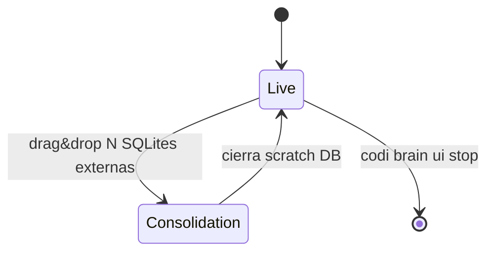

# Plan: Codi v3 edición 0 — Master (consolidado Q1-Q31 + Z1-Z8)

- **Date**: 2026-05-08 13:35
- **Document**: 20260508*133556*[PLAN]\_codi-v3-ed0-master.md
- **Category**: PLAN
- **Estado**: design-locked tras 31 grills v3-consolidated + 12 grills v3-zero + 8 grills Z (final)
- **Sustituye**: 20260504*235331*[PLAN]_codi-v3-consolidated.md y 20260508_095403_[PLAN]\_codi-v3-zero.md (ambos quedan como históricos parciales)
- **Naturaleza**: este doc es la fuente única de verdad para Codi v3 ed.0. Todas las contradicciones previas se resuelven aquí.

---

## Constants (counts vivos — única fuente)

| Constant                      | Valor                | Composición                                                                                                           |
| ----------------------------- | -------------------- | --------------------------------------------------------------------------------------------------------------------- |
| Modes de install              | **4**                | zero, lite, standard, full                                                                                            |
| Containers full               | **9**                | codi-app, codi-workers, codi-db, codi-graph, codi-vector, codi-indexer, codi-ui, caddy, vaultwarden                   |
| Containers standard           | **6**                | sin codi-ui, caddy, vaultwarden                                                                                       |
| Containers lite               | **3**                | codi-app, codi-workers, codi-db                                                                                       |
| Containers zero               | **0**                | sin Docker. Binario CLI + SQLite local                                                                                |
| Tablas SQLite                 | **11**               | 9 captura/observability + 2 workflow runtime                                                                          |
| Tipos de captura              | **10**               | RULE, PROHIBITION, PREFERENCE, FEEDBACK, INSIGHT, OBSERVATION, DECISION, QUESTION, PROMPT, CORRECTION                 |
| Hooks runtime                 | **5**                | SessionStart, UserPromptSubmit, PreToolUse, PostToolUse, Stop (Anthropic protocol)                                    |
| Hooks git                     | **1**                | pre-push                                                                                                              |
| Workflows phase-locked        | **5**                | project, feature, bug-fix, refactor, migration (heredados DevLoop sin omitir)                                         |
| Targets Tier 1 (full hooks)   | **2**                | Claude Code, Codex CLI                                                                                                |
| Targets Tier 2 (config-only)  | **5**                | Cursor, Windsurf, Cline, GitHub Copilot, Gemini                                                                       |
| Skills                        | **49**               | 13 bloques A-M                                                                                                        |
| Rules core                    | **15**               | always-loaded                                                                                                         |
| Rules opt-in                  | **6**                | extended preset                                                                                                       |
| Subagent definitions          | **4**                | lead, worker, reviewer, scaffolder                                                                                    |
| Presets                       | **3**                | codi-default, codi-extended, codi-minimal                                                                             |
| Total artefactos builtin      | **77**               | 49 skills + 21 rules + 4 agents + 3 presets                                                                           |
| Gates                         | **15**               | 14 core + 1 opt-in (gate-test-first-commit)                                                                           |
| Stages pipeline consolidación | **5**                | Ingest, Pattern detection, Proposal generation, Human review, Generate package                                        |
| Patterns detection            | **8**                | P1-P8                                                                                                                 |
| Tipos de propuesta            | **6**                | PROMOTE_TO_RULE, MERGE_SIMILAR, RESOLVE_CONFLICT, DEPRECATE_ARTIFACT, CREATE_NEW_ARTIFACT, OPTIMIZE_EXISTING_ARTIFACT |
| Endpoints UI HTTP             | **13**               | api/v1/\*                                                                                                             |
| Bounded contexts internos     | **7**                | notes, workflows, memory, codegraph, improvements, auth, observability                                                |
| Q decisiones cerradas         | **31 + 12 + 8 = 51** | Q1-Q31 v3-consolidated, Q1-Q12 v3-zero, Z1-Z8 ed.0                                                                    |
| Roadmap fases                 | **7 sprints**        | Foundation, Runtime+SQLite, Workflows+capture, UI Live, Consolidation, Multi-target, Migration+Release                |
| Tiempo estimado MVP           | **14-18 sem**        | 1 dev TS dedicado                                                                                                     |

---

## Tabla de contenidos

0. Resumen ejecutivo
1. Visión y principios
2. Arquitectura (4 modes)
3. Tiered capabilities matrix (Tier 1 + Tier 2)
4. Persistence layer (SQLite canonical + sync adapters)
5. Captura inline + raw trace (cerebro)
6. SDD inner-loop (5 fases)
7. Workflows phase-locked (5)
8. Hooks runtime (5 + 1 git)
9. Gates (15)
10. Catálogo de artefactos (77)
11. UI Hono + HTMX (Live + Consolidación)
12. Multi-target generation
13. CLI commands
14. DDD interno (Codi v3 mismo)
15. Testing strategy
16. Migración v2 → v3
17. Roadmap MVP (14-18 semanas)
18. Riesgos y mitigaciones
19. Mapping decisiones (Z + Q)
20. Cierre

---

## 0. Resumen ejecutivo

Codi v3 edición 0 es la unificación de Codi v2 + DevLoop con un **arnés colaborativo nuevo** para equipos de developers que usan agentes de coding (Claude Code, Codex CLI). Toma íntegramente la capa de inteligencia de Codi v2 + toda la lógica de workflows phase-locked de DevLoop, suma capacidades nuevas (cerebro SQLite, capture markers, UI consolidación team), y limita el foco runtime a Codex + Claude Code (Tier 1) sin romper users existentes de Cursor/Windsurf/Cline/Copilot/Gemini (Tier 2 config-only).

**Diferenciadores clave sobre v2 + DevLoop**:

1. **Cerebro persistente per-dev**: SQLite local en `~/.codi/brain.db` registra capturas, workflows, prompts, tool calls, corrections del agente con metadata completa. El agente captura proactivo via markers `|TIPO: "..."|` al final de cada turno.
2. **UI Hono + HTMX on-demand**: Live observation durante sesiones + Consolidación N→1 cuando el dev encargado quiere unificar el cerebro del equipo.
3. **Workflows como artefactos editables**: 5 workflows phase-locked de DevLoop heredados, pero el sistema permite create/modify/measure/log/flag via skills creator.
4. **Tiered targets**: Claude Code + Codex tienen runtime hooks completo; Cursor/Windsurf/Cline/Copilot/Gemini reciben skills + rules como context estático sin restricciones artificiales.
5. **Modo dual LLM en consolidación**: API externa con keys del dev O agente coding via HTTP+SSE estilo content-factory.
6. **4 modes de install** progresivos sin perder datos: zero (sin Docker) → lite (3 containers) → standard (6) → full (9).

**Lo que NO cambia (preservado de v2 + DevLoop)**:

- Multi-target generation con 7 adapters (subset Tier 1/2 documentado).
- Sistema de presets `.zip` con 3 presets oficiales.
- Plugin distribution `.claude-plugin/` ya configurado, extendido para Codex.
- Workflows phase-locked DevLoop con HARD GATE 'ok' literal.
- Iron Laws + team charter.
- Quality gates (pre-commit, commit-msg, gitleaks).
- Multi-language support en code graph (cuando se sube a standard/full).
- Tests + CI/CD existentes preservados, extendidos.

**Lo que se descarta** (defer v3.x o eliminado):

- Cursor/Windsurf/Cline/Copilot/Gemini como Tier 1 (degradan a Tier 2 config-only).
- 22 specialized agents de Codi v2 (defer a marketplace v3.1).
- 28 skills especializadas (PDF/PPTX/XLSX/canvas/etc — defer a marketplace v3.1).
- Override layer BD con base_hash conflict (defer v3.1, para 4 devs editando filesystem + git es overhead).
- Sheets/xlsx como persistence backend principal (degradan a sync targets opt-in).
- 5 presets restantes de Codi v2 (especializados marketing/CRO defer).

**Approach del repo**: rebrand in-place de `/Users/laht/projects/codi/` con major version bump v2 → v3.0.0. DevLoop absorbido via copy + adapt (no submodule). Tag `v2.x-final-frozen` y `devloop-v0.9.x-archived` antes del merge.

**Roadmap**: 14-18 semanas con 1 dev TS dedicado. Big bang single-branch hasta release v3.0.0.

---

## 1. Visión y principios

### 1.1 Visión

Un equipo de 4 developers comparte un proyecto. Cada uno usa su agente de coding preferido (Claude Code, Codex). Trabajan en paralelo en branches distintas. Cada agente, mientras trabaja con su dev, captura proactivo todas las señales relevantes (reglas, prohibiciones, preferencias, feedback, insights) en el cerebro local SQLite del dev.

Periódicamente, un dev encargado consolida los cerebros del equipo: arranca una UI local Hono+HTMX, recibe los `.db` de los compañeros, analiza patterns cross-dev (8 detection patterns deterministic SQL), genera propuestas de mejora a artefactos (skills/rules/agents/workflows/presets) usando LLM directo o el propio agente coding via endpoints HTTP, revisa, aprueba, y empaqueta el resultado en un `.zip` que cada dev importa con `codi preset apply`.

El sistema escala: empezar zero (sin Docker, dev solo o agencia 4 devs), upgrade a lite (3 containers, agencia con BD shared), standard (6, code graph + multi-tenant), full (9, UI dashboard + Vaultwarden). Mismo schema, mismo CLI, mismos artefactos. Solo cambia la infra.

### 1.2 Principios rectores (18 totales)

Heredados del plan v3-consolidated §1.2 (12) + plan v3-zero (6 adicionales):

1. **Build + Runtime unificados**: una misma fuente declarativa describe artefactos _y_ procesos.
2. **Vocabulario cerrado, evolución por ADR**: eventos, fases, workflow types cerrados.
3. **Determinismo donde se puede, IA donde se debe**: classifiers/validators puros; RAG/planning/summarization LLM con fallback determinista.
4. **Local-first, online-optional**: SQLite local en zero; Postgres + Memgraph + Qdrant en upgrades.
5. **Trace is sacred**: cada decisión auditada, append-only event log + git.
6. **Human in the loop por defecto**: HARD GATES con literal `ok` (case-insensitive 2-chars).
7. **Modular monolith**: monorepo pnpm workspaces, sin microservicios prematuros.
8. **No vendor lock**: schemas estables (Zod + JSON Schema publicado).
9. **Atomic + rollback**: cada mutación lleva snapshot pre + rollback determinista.
10. **Diff mínimo, simplicidad primero**: capabilities solo si añaden valor.
11. **Schema-driven**: Zod en core + JSON Schema publicado.
12. **Self-hosted dogfooding**: el repo de Codi usa Codi sobre sí mismo.
13. **No daemon en zero**: hooks son scripts efímeros que arrancan/cierran con cada turno. UI es server on-demand.
14. **Single SQLite per-dev cross-project**: `~/.codi/brain.db`. Cross-project via `project_id` discriminator. Multi-dev via consolidación on-demand.
15. **Agent-first capture**: el agente identifica qué capturar; el dev nunca persiste manualmente. Markers `|TIPO: "..."|` MUST al final de cada turno con captura.
16. **Trace level parametrizable**: `brain.trace_level: full | medium | minimal`. Default `full`.
17. **Idempotent server lifecycle**: skills que requieren UI ejecutan `acquire_or_start`; reutilizan instancia existente.
18. **Migration-aware**: schema diseñado para upgrade limpio entre modes (zero → lite → standard → full) sin pérdida de datos.

### 1.3 Iron Laws (9)

Heredadas de DevLoop, formalizadas como rule `codi-iron-laws`:

1. **Recommend AND execute** — default acción; preguntar solo en HARD GATE / credentials / ambiguous-business / irreversible-write.
2. **One question per turn** — elicitación atómica.
3. **Sheet/Canvas is sacred** — info estratégica al canvas estructurado, no en chat. (En v3 = `codi.notes` + capture markers.)
4. **HARD GATES need 'ok'** — literal `ok | OK | Ok` (case-insensitive, exactamente 2 chars).
5. **Pull before patch** — re-runs empiezan con sync de estado.
6. **Atomic + rollback** — sync auto-snapshot; restore --latest.
7. **Never commit without approval** — git commit/PR/branch delete user-gated.
8. **Honor output mode** — caveman/normal per project preference.
9. **Capture-everything-the-dev-says** (NEW v3): el agente MUST emitir `|TIPO: "..."|` cuando detecta una de las 10 categorías. Falsos negativos tolerados (capture offline en consolidación cubre el gap), falsos positivos NO (cada captura es commit; dev puede objetar pero default es persist).

---

## 2. Arquitectura (4 modes)

### 2.1 Tabla maestra de modes

| Mode         | Containers | Daemon | Storage                            | Workflows runtime         | Multi-tenant     | LLM                         | Use case primario                                             |
| ------------ | ---------- | ------ | ---------------------------------- | ------------------------- | ---------------- | --------------------------- | ------------------------------------------------------------- |
| **zero**     | 0          | no     | SQLite local                       | feature, bug-fix (subset) | no (1 dev)       | API directo + agente coding | Dev solo, agencia 4 devs sin infra Docker, evaluación inicial |
| **lite**     | 3          | sí     | Postgres + pgvector                | full 5                    | optional via JWT | + routing 3 providers       | Agencia ≤10 devs con BD shared                                |
| **standard** | 6          | sí     | Postgres + Memgraph + Qdrant       | full 5                    | sí RLS           | full                        | Agencia con code graph + multi-tenant                         |
| **full**     | 9          | sí     | + Vaultwarden + UI dashboard React | full 5                    | full             | full                        | Agencia heavy con UI + secrets manager                        |

**Comando único**:

```bash
codi install --mode=zero      # default
codi install --mode=lite
codi install --mode=standard
codi install --mode=full
codi install --upgrade --mode=lite      # zero → lite
codi install --downgrade --mode=zero    # lite → zero (backup BD + para containers)
```

### 2.2 Modo zero (sin Docker)

```
~/                                     ← home del dev
├── .codi/
│   ├── brain.db                       ← SQLite store cross-project
│   ├── ui.lock                        ← server PID + port (cuando UI activa)
│   ├── llm-keys.json                  ← provider keys (chmod 600)
│   ├── exports/                       ← exports generados
│   ├── consolidation-<ts>.db          ← scratch DB temporal
│   └── backups/                       ← backups daily VACUUM INTO

<repo>/                                ← repo del dev
├── .codi/
│   ├── codi.yaml                      ← config (mode, trace_level, etc)
│   ├── skills/<name>/SKILL.md         ← artefactos del project
│   ├── rules/<name>.md
│   ├── agents/<name>.md
│   ├── workflow-runs/<wf-id>.md       ← artefactos generados
│   ├── brain-prompts/                 ← templates editables
│   └── credentials                    ← API token estático (gitignored)
```

### 2.3 Modo lite (3 containers)

Añade Postgres + pgvector via Docker:

- `codi-app` (Hono daemon)
- `codi-workers` (pg-boss async jobs)
- `codi-db` (Postgres 17 + pgvector + FTS)

Migra `~/.codi/brain.db` → Postgres preservando IDs. Schema 11 tablas idéntico.

### 2.4 Modo standard (6 containers)

Lite + 3 containers para code graph:

- `codi-graph` (Memgraph)
- `codi-vector` (Qdrant para code embeddings)
- `codi-indexer` (Python wrapper de code-graph-rag)

Activa skills DDD/Hexagonal advanced que requieren grafo de código.

### 2.5 Modo full (9 containers)

Standard + 3 containers para UX heavy:

- `codi-ui` (React 19 + Vite dashboard)
- `caddy` (reverse proxy + TLS)
- `vaultwarden` (secrets management)

### 2.6 Repo target — rebrand in-place (Z1)

`/Users/laht/projects/codi/` se rebrand a v3 in-place. Major version bump v2.14.x → v3.0.0.

```bash
# Branch para integración
cd /Users/laht/projects/codi
git checkout main
git tag v2.14.x-final-frozen     # snapshot histórico v2
git checkout -b feature/codi-v3-ed0-merge

# Copy + adapt DevLoop (Z2)
cp -r /Users/laht/projects/devloop/lib/      src/runtime/
cp -r /Users/laht/projects/devloop/hooks/    src/templates/hooks-devloop/
cp -r /Users/laht/projects/devloop/skills/   src/templates/skills-devloop/
cp -r /Users/laht/projects/devloop/schemas/  src/schemas/_devloop/
git commit -m "chore: import devloop@<sha> as devloop-v0.9.x-archived"

# Tag DevLoop antes de archivar
cd /Users/laht/projects/devloop
git tag devloop-v0.9.x-archived
# luego: archive repo en GitHub
```

### 2.7 Monorepo layout (post-merge)

```
codi/                              ← repo único, v3 ed.0
├── packages/
│   ├── codi-cli/                  ← npm publish package (binary)
│   ├── codi-brain-server/         ← NEW Hono UI server
│   ├── codi-runtime/              ← NEW DevLoop integrated (procedures, classifier, gates)
│   ├── codi-shared/               ← types + Zod schemas + utils
│   └── codi-templates/            ← skills/rules/agents builtin
├── projects/                      ← subproyectos propios
│   └── code-graph-rag/            ← Git submodule pinned (solo standard/full)
├── infra/                         ← Docker (lite/standard/full only)
│   ├── docker-compose.lite.yml
│   ├── docker-compose.standard.yml
│   ├── docker-compose.full.yml
│   ├── Dockerfile.app
│   ├── Dockerfile.workers
│   ├── Dockerfile.ui
│   ├── Caddyfile.template
│   └── .env.example
├── src/
│   ├── runtime/                   ← DevLoop integrado (de Z2)
│   │   ├── procedures/            ← event log + reducer
│   │   ├── classifier/            ← incidental vs scope
│   │   ├── gates/                 ← gate runner + 15 gates
│   │   ├── sync/                  ← ExternalSyncer (Sheets/xlsx opt-in)
│   │   └── _deprecated/           ← Sheets/xlsx legacy backends
│   ├── generators/                ← multi-target (Z3 tiered)
│   │   ├── claude-code/           ← Tier 1
│   │   ├── codex/                 ← Tier 1
│   │   ├── cursor/                ← Tier 2
│   │   ├── windsurf/              ← Tier 2
│   │   ├── cline/                 ← Tier 2
│   │   ├── copilot/               ← Tier 2
│   │   └── gemini/                ← Tier 2
│   ├── templates/                 ← skills/rules/agents/presets builtin (Codi v2)
│   ├── schemas/                   ← Zod + JSON Schema
│   └── cli/                       ← CLI commands
├── .codi/                         ← self-host dogfooding
├── docs/
├── tests/                         ← E2E, chaos, perf
└── pnpm-workspace.yaml
```

---

## 3. Tiered capabilities matrix (Z3 = D)

### 3.1 Tier 1 full (Claude Code + Codex CLI)

Targets que soportan el Anthropic hook protocol completo. Codi v3 ed.0 invierte aquí: hooks runtime + capture markers + brain SQLite + workflows phase-locked + UI consolidación.

```typescript
// src/generators/claude-code/capabilities.ts
export const claudeCodeCapabilities: TargetCapabilities = {
  tier: "full",
  skills: true, // .claude/skills/<name>/SKILL.md
  rules: true, // .claude/rules/<name>.md
  agents: true, // .claude/agents/<name>.md (YAML frontmatter)
  commands: true, // .claude/commands/
  settings: true, // .claude/settings.json
  hooks_runtime: true, // 5 Anthropic hook events
  capture_markers: true, // protocolo
  brain_sync_runtime: true, // hooks escriben SQLite directo
  workflows_phase_locked: true, // runtime state machine
  plugin_distribution: true, // .claude-plugin/plugin.json
  memory_primary: "CLAUDE.md",
  memory_override: null,
};

// src/generators/codex/capabilities.ts
export const codexCapabilities: TargetCapabilities = {
  tier: "full",
  skills: true, // .agents/skills/ (NO .codex/skills/)
  rules: true, // .codex/rules/*.rules (Starlark)
  agents: true, // .codex/agents/<name>.toml (TOML schema diferente)
  commands: false, // skill invocada con $name
  settings: true, // .codex/config.toml
  hooks_runtime: true,
  capture_markers: true,
  brain_sync_runtime: true,
  workflows_phase_locked: true,
  plugin_distribution: true, // .codex-plugin/plugin.json
  memory_primary: "AGENTS.md",
  memory_override: "AGENTS.override.md", // si proyecto ya tiene AGENTS.md
};
```

### 3.2 Tier 1A asimetrías (Claude Code-specific)

Eventos extra que Claude Code soporta y Codex no — Codi v3 ed.0 NO los usa por compat dual, pero documentados:

- `Setup`, `SessionEnd`, `SubagentStart`, `SubagentStop`, `StopFailure`, `InstructionsLoaded`, `ConfigChange`, `FileChanged`, `PostToolBatch`, prompt hooks, agent hooks, async hooks (~22 eventos extra).
- `permissionDecision: "ask"` y `"defer"` con `additionalContext`, `updatedInput`, `updatedPermissions`.

### 3.3 Tier 1B asimetrías (Codex CLI-specific)

Features extra que Codi v3 ed.0 SÍ adopta:

- `commit_attribution = ""` (regla anti-AI-signature, OBLIGATORIO).
- Granular approval policy + named permission profiles.
- `AGENTS.override.md` para no pisar `AGENTS.md` del proyecto.
- Trust model explícito: `[projects."<absolute-path>"].trust_level = "trusted"` (sin esto, Codex SKIPEA todos los `.codex/` layers silenciosamente).
- Subagentes en TOML schema diferente.

### 3.4 Tier 2 config-only (Cursor, Windsurf, Cline, Copilot, Gemini)

Targets sin Anthropic hook protocol. Reciben skills + rules como context estático. Sin hooks runtime, sin capture markers automáticos, sin workflow phase-locked runtime.

```typescript
export const cursorCapabilities: TargetCapabilities = {
  tier: "config-only",
  skills: true, // .cursor/skills/
  rules: true, // .cursor/rules
  agents: false,
  commands: false,
  settings: false, // .cursor/mcp.json shape diferente
  hooks_runtime: false,
  capture_markers: false,
  brain_sync_runtime: false, // dev usa codi CLI manual para sync
  workflows_phase_locked: false,
  plugin_distribution: false,
};

export const windsurfCapabilities: TargetCapabilities = {
  /* análogo, paths .windsurfrules + .windsurf/skills/ */
};
export const clineCapabilities: TargetCapabilities = {
  /* análogo, paths .clinerules + .cline/skills/ */
};
export const copilotCapabilities: TargetCapabilities = {
  /* análogo, paths .github/copilot-instructions.md + .github/instructions/ */
};
export const geminiCapabilities: TargetCapabilities = {
  /* análogo, paths .gemini/commands/*.toml */
};
```

**Tier 2 dev workflow**:

```bash
# Dev en Cursor edita código normalmente
# Para capturar conocimiento manual:
codi memory record "regla: siempre Result types en src/auth"
codi recall "auth patterns"
codi brain export --project=acme  # exporta su SQLite (con capturas manuales) para consolidar con team
```

### 3.5 Tier 3 future evaluation

Targets que pueden promoverse a Tier 1 si adoptan Anthropic hook protocol:

- opencode, Antigravity, Gemini CLI (CLI-mode), Q Developer, Continue.

NO incluidos en v3 ed.0.

### 3.6 5 restricciones hooks dual compat (Tier 1A + 1B)

Para que la lógica de hooks sea ÚNICA y funcione en Claude Code + Codex:

1. **PreToolUse**: usar SOLO `permissionDecision: "deny"` con `permissionDecisionReason`. NO `"allow"`, `"ask"`, `"defer"`, `updatedInput`, `additionalContext`, `continue: false` (fail-open en Codex).
2. **PermissionRequest**: solo `decision.behavior: "allow"` o `"deny"` con `message` opcional. NO `updatedInput`, `updatedPermissions`, `interrupt`.
3. **PostToolUse**: `decision: "block"` reemplaza output con reason en Codex (no revierte tool ya ejecutado). NO `updatedMCPToolOutput`, `suppressOutput`.
4. **UserPromptSubmit y Stop**: matcher ignorado en Codex. Filtrar dentro del hook handler si se requiere lógica condicional.
5. **Tool name aliasing**: hook handlers deben tratar `tool_name: "apply_patch"` igual que `Edit`/`Write`/`NotebookEdit` (Codex unifica file edits bajo `apply_patch`).

### 3.7 Tool name normalization (Pattern A0)

`_hook-handler.cjs` normaliza al inicio:

```js
const TOOL_ALIASES = { apply_patch: "Edit" };
const tool = TOOL_ALIASES[input.tool_name] || input.tool_name;
```

Toda lógica downstream usa el nombre normalizado.

---

## 4. Persistence layer (Z6 = D — SQLite canonical + sync adapters)

### 4.1 SQLite single source of truth

SQLite es persistence canónico en zero. Postgres lo reemplaza en lite/standard/full preservando schema. Sheets/xlsx son destinos de export/sync opt-in, NO backends alternativos.

### 4.2 Schema (11 tablas + workflow_runs/events)

#### Tablas captura/observability (9)

```sql
CREATE TABLE projects (
  project_id    TEXT PRIMARY KEY,
  repo_path     TEXT NOT NULL,
  git_remote    TEXT,
  name          TEXT NOT NULL,
  first_seen    INTEGER NOT NULL,
  last_seen     INTEGER NOT NULL
);

CREATE TABLE sessions (
  session_id          TEXT PRIMARY KEY,
  project_id          TEXT NOT NULL,
  agent_type          TEXT NOT NULL,
  agent_model         TEXT,
  started_at          INTEGER NOT NULL,
  ended_at            INTEGER,
  branch              TEXT,
  commit_sha          TEXT,
  working_dir         TEXT NOT NULL,
  transcript_path     TEXT,
  workflow_id         TEXT,
  total_turns         INTEGER DEFAULT 0,
  total_capture_count INTEGER DEFAULT 0
);

CREATE TABLE prompts (
  prompt_id     INTEGER PRIMARY KEY AUTOINCREMENT,
  session_id    TEXT NOT NULL,
  turn_no       INTEGER NOT NULL,
  ts            INTEGER NOT NULL,
  text          TEXT NOT NULL,
  char_count    INTEGER NOT NULL
);

CREATE TABLE turns (
  turn_id       INTEGER PRIMARY KEY AUTOINCREMENT,
  session_id    TEXT NOT NULL,
  turn_no       INTEGER NOT NULL,
  ts            INTEGER NOT NULL,
  agent_text    TEXT,                     -- solo si trace_level=full
  duration_ms   INTEGER,
  prompt_id     INTEGER NOT NULL
);

CREATE TABLE captures (
  capture_id    INTEGER PRIMARY KEY AUTOINCREMENT,
  session_id    TEXT NOT NULL,
  prompt_id     INTEGER NOT NULL,
  turn_id       INTEGER NOT NULL,
  ts            INTEGER NOT NULL,
  type          TEXT NOT NULL,            -- 10 tipos
  content       TEXT NOT NULL,
  raw_marker    TEXT NOT NULL,
  file_paths    TEXT,                     -- JSON array
  workflow_id   TEXT,
  phase         TEXT
);

CREATE TABLE tool_calls (
  call_id         INTEGER PRIMARY KEY AUTOINCREMENT,
  session_id      TEXT NOT NULL,
  turn_id         INTEGER NOT NULL,
  ts              INTEGER NOT NULL,
  tool_name       TEXT NOT NULL,
  input_json      TEXT NOT NULL,
  output_summary  TEXT,
  duration_ms     INTEGER,
  status          TEXT NOT NULL,
  error           TEXT
);

CREATE TABLE corrections (
  correction_id  INTEGER PRIMARY KEY AUTOINCREMENT,
  session_id     TEXT NOT NULL,
  ts             INTEGER NOT NULL,
  file_path      TEXT NOT NULL,
  diff_summary   TEXT NOT NULL,
  source_turn_id INTEGER,
  detected_via   TEXT NOT NULL
);

CREATE TABLE artifacts_used (
  usage_id       INTEGER PRIMARY KEY AUTOINCREMENT,
  session_id     TEXT NOT NULL,
  turn_id        INTEGER,
  ts             INTEGER NOT NULL,
  artifact_type  TEXT NOT NULL,
  artifact_name  TEXT NOT NULL,
  event          TEXT NOT NULL,
  outcome        TEXT,
  duration_ms    INTEGER
);

CREATE TABLE _codi_schema_version (
  version    INTEGER PRIMARY KEY,
  applied_at INTEGER NOT NULL
);
```

#### Tablas workflow runtime (2)

```sql
CREATE TABLE workflow_runs (
  workflow_id     TEXT PRIMARY KEY,
  project_id      TEXT NOT NULL,
  type            TEXT NOT NULL,            -- 'project' | 'feature' | 'bug-fix' | 'refactor' | 'migration'
  current_phase   TEXT NOT NULL,
  status          TEXT NOT NULL,
  started_at      INTEGER NOT NULL,
  ended_at        INTEGER,
  metadata        TEXT                      -- JSON: scope_files, gates_passed, flags
);

CREATE TABLE workflow_events (
  event_id        INTEGER PRIMARY KEY AUTOINCREMENT,
  workflow_id     TEXT NOT NULL,
  event_type      TEXT NOT NULL,
  ts              INTEGER NOT NULL,
  payload         TEXT
);
```

#### Índices

```sql
CREATE VIRTUAL TABLE captures_fts USING fts5(content, content='captures', content_rowid='capture_id');
CREATE VIRTUAL TABLE prompts_fts USING fts5(text, content='prompts', content_rowid='prompt_id');

CREATE INDEX idx_sessions_project_started ON sessions(project_id, started_at DESC);
CREATE INDEX idx_captures_type_session ON captures(type, session_id);
CREATE INDEX idx_captures_session_ts ON captures(session_id, ts);
CREATE INDEX idx_prompts_session_turn ON prompts(session_id, turn_no);
CREATE INDEX idx_tool_calls_session_turn ON tool_calls(session_id, turn_id);
CREATE INDEX idx_artifacts_used_name_outcome ON artifacts_used(artifact_name, outcome);
CREATE INDEX idx_workflow_runs_project_status ON workflow_runs(project_id, status);
CREATE INDEX idx_workflow_events_wf_ts ON workflow_events(workflow_id, ts);

CREATE VIRTUAL TABLE captures_vec USING vec0(
  capture_id INTEGER PRIMARY KEY,
  embedding FLOAT[1536]
);
```

### 4.3 ExternalSyncer interface (Z6.D)

```typescript
// src/runtime/sync/types.ts
interface ExternalSyncer {
  push(brainDb: Database, opts: PushOptions): Promise<PushResult>;
  pull(brainDb: Database, opts: PullOptions): Promise<PullResult>;
  diff(brainDb: Database, external: ExternalRef): Promise<DiffResult>;
}
```

### 4.4 SheetsSyncer (opt-in)

`src/runtime/sync/sheets-syncer.ts`. Heredado de DevLoop `lib/sheets/`. Auth OAuth user (Google APIs). Push: SQLite tables → Google Sheets tabs. Pull: detectar edits manuales en Sheets → merge SQLite con OCC.

```yaml
# .codi/codi.yaml
external_sync:
  enabled: false
  targets: ["sheets"]
  sheets:
    spreadsheet_id: "<id>"
    direction: "push" # push | pull | bidirectional
    schedule: "manual"
    auth_method: "oauth_user"
```

### 4.5 XlsxSyncer (opt-in)

`src/runtime/sync/xlsx-syncer.ts`. Heredado de DevLoop `lib/xlsx/`. Output a `.xlsx` file con tabs por tabla. Útil para snapshots offline / archivo PM.

```yaml
external_sync:
  targets: ["xlsx"]
  xlsx:
    output_path: "./codi-snapshot-Q4-2026.xlsx"
    direction: "push"
    schedule: "manual"
```

### 4.6 Migration zero → lite

```bash
codi install --upgrade --mode=lite
```

Ejecuta:

1. Verifica Docker disponible.
2. Pull images (codi-app, codi-workers, codi-db).
3. Bootstrap Postgres schema (mismo que SQLite + columnas RLS opcional `agency_id`).
4. Migrar datos: leer `~/.codi/brain.db` row por row → INSERT Postgres preservando IDs.
5. Backup SQLite a `~/.codi/backups/pre-upgrade-<ts>.db`.
6. Update `.codi/codi.yaml`: `mode: zero` → `mode: lite`.
7. Restart sesión Claude Code/Codex; hooks ahora usan HTTP API.

Reverse migration `lite → zero` también soportada (backup BD a SQL + para containers + restart sin daemon).

---

## 5. Captura inline + raw trace (cerebro)

### 5.1 10 tipos de captura

| Tipo        | Source              | Persistencia            | Trigger del agente                            |
| ----------- | ------------------- | ----------------------- | --------------------------------------------- |
| RULE        | dev → agente        | project-permanent       | dev usa "siempre", "always", "must", "regla"  |
| PROHIBITION | dev → agente        | project-permanent       | dev usa "nunca", "never", "no hagas", "evita" |
| PREFERENCE  | dev → agente        | user-permanent          | dev usa "prefiero", "me gusta", subjetivo     |
| FEEDBACK    | dev → agente        | session-bound           | dev corrige output del agente                 |
| INSIGHT     | agente → equipo     | personal hasta promover | agente nota patrón propio                     |
| OBSERVATION | agente → trace      | always-recorded         | factual con contexto                          |
| DECISION    | dev+agente → equipo | project-permanent       | acuerdo durante HARD GATE 'ok'                |
| QUESTION    | dev → trace         | session-bound           | duda no resuelta                              |
| PROMPT      | dev → trace         | always-recorded raw     | TODOS los prompts del dev (no selectivo)      |
| CORRECTION  | dev → trace         | always-recorded         | dev edita manualmente algo del agente         |

### 5.2 Markers protocol `|TIPO: "..."|`

El agente MUST emitir al final de su mensaje, una línea por captura detectada:

```
|RULE: "siempre usar Result types en src/auth/*"|
|PROHIBITION: "no usar DROP TABLE en migrations sin backup"|
|INSIGHT: "TDD micro-cycle acelera feedback loop en este equipo"|
|FEEDBACK: "el dev rechazó el último diff por estilo de naming"|
|DECISION: "OAuth via passport.js, no Auth0"|
```

### 5.3 Enforcement A+C

**A — Rule always-loaded `codi-capture-everything`**:

- Path: `.codi/rules/codi-capture-everything.md`
- Loading tier A (always-loaded en SessionStart context).

**C — UserPromptSubmit hook reinforcement**:

- Cada turno, hook añade en `additionalContext`:

```xml
<codi-capture-protocol>
  You MUST emit |TYPE: "verbatim content"| at end of response when detecting:
  - dev says "always/siempre/must/regla" → RULE
  - dev says "never/nunca/no uses/prohibido" → PROHIBITION
  - dev expresses preference → PREFERENCE
  - dev corrects your output → FEEDBACK
  - you observe a pattern → INSIGHT
  - factual context-relevant note → OBSERVATION
  - workflow gate decision → DECISION
  - dev unresolved doubt → QUESTION
  - dev edits manually → CORRECTION
  Format: |TYPE: "verbatim"| no extra characters before or after pipes.
</codi-capture-protocol>
```

- Costo: ~250 tokens por turno (~$0.001 con Sonnet).

### 5.4 Parser regex + idempotencia (en hook Stop)

Hook Stop:

1. Lee transcript del agente.
2. Extrae último `assistant` message text.
3. Aplica regex global: `/\|([A-Z_]+):\s*"([^"]*)"\|/g`.
4. Para cada match: valida `type` ∈ taxonomía (10 tipos), captura `content`, computa `file_paths` (tool_calls del mismo turn), lee `workflow_runs` activo, INSERT INTO `captures`.
5. Hash `(session_id, turn_id, raw_marker)` para idempotencia: si Stop ejecuta 2 veces (crash recovery), noop.

### 5.5 Trace level (full/medium/minimal)

```yaml
brain:
  trace_level: full # default. agent_text en turns
  # trace_level: medium   # sin agent_text largo
  # trace_level: minimal  # solo capturas + prompts (sin tool_calls input/output)
```

Storage estimado por dev/año (intensivo):

- full: ~300 MB
- medium: ~150 MB
- minimal: ~50 MB

### 5.6 Capture corrections + tool_calls auto

Hook PostToolUse: INSERT en `tool_calls` con todos los campos.
Hook Stop: detecta corrections via 3 mecanismos (git-diff, file-mtime, explicit-marker) → INSERT en `corrections`.

---

## 6. SDD inner-loop (5 fases canónicas — Z8.F8.1)

Inner-loop transversal aplicable dentro de feature/bug-fix/refactor workflows:

```
1. CLARIFY    →  intent claro + contexto codebase (skill: codi-clarify)
2. SPEC       →  doc "qué se construye" (skill: codi-spec-writer)
3. PLAN       →  doc "cómo" descompuesto en tasks bite-sized (skill: codi-plan-writer)
4. IMPLEMENT  →  código + tests, task-by-task con TDD (skill: codi-plan-execution + codi-tdd)
5. VERIFY     →  evidencia de que pasó tests + criterios aceptación (skill: codi-verify + codi-code-review)
```

Cada salto adelante requiere `ok` explícito del user. Ningún salto se hace sin que la skill anterior haya escrito su artefacto en BD (+ projection filesystem opcional).

Mapeo a workflow phases:

| Workflow phase    | Fase SDD canónica            |
| ----------------- | ---------------------------- |
| feature.intent    | 1 Clarify                    |
| feature.plan      | 2 Spec + 3 Plan (combinadas) |
| feature.decompose | 3 Plan (decompose detallado) |
| feature.execute   | 4 Implement                  |
| feature.verify    | 5 Verify                     |
| bug-fix.reproduce | extra (workflow-specific)    |
| bug-fix.\*        | igual mapeo que feature      |
| refactor.baseline | extra                        |
| refactor.\*       | igual mapeo que feature      |

---

## 7. Workflows phase-locked (5 — Z4 + Z5)

Heredados íntegros de DevLoop. Workflow = SKILL.md con `mode: workflow` (Z5.A).

### 7.1 Skeleton común

```yaml
events_emitted_default:
  - phase_started, phase_completed
  - phase_transition_proposed, phase_transition_approved, phase_transition_rejected
  - scope_change_classified, scope_expansion_proposed, scope_expansion_approved
  - incidental_change_recorded, decision_recorded
  - subagent_dispatched, subagent_completed
  - workflow_completed, workflow_abandoned, workflow_handover

human_approval_required_default:
  - phase_transition_approved, workflow_abandoned

invariants_default:
  - knowledge_base_required: true
  - blocks_main_commit: true
  - blocks_unverified_force_push: true
```

### 7.2 codi-project-workflow

```yaml
phases: [intent, discover, decompose, sync, done]
mandatory_phase: sync
phase_transitions:
  - { from: intent,    to: discover,  requires_gates: [gate-intent-complete] }
  - { from: discover,  to: decompose, requires_gates: [gate-discover-complete] }
  - { from: decompose, to: sync,      requires_gates: [gate-decompose-complete] }
  - { from: sync,      to: done,      requires_gates: [gate-sync-complete] }
skills_by_phase:
  intent:    [codi-brainstorming, codi-clarify, codi-recall, codi-codebase-explore]
  discover:  [codi-codebase-explore, codi-evidence-gathering, codi-recall]
  decompose: [codi-spec-writer, codi-plan-writer, codi-dispatching-parallel-agents]
  sync:      [codi-plan-writer]
  done:      [codi-session-log]
invariants: + [allows_blank_knowledge_base: true, bootstrap_workflow: true]
```

### 7.3 codi-feature-workflow

```yaml
phases: [intent, plan, decompose, execute, verify, done]
mandatory_phase: decompose
phase_transitions:
  - { from: intent,    to: plan,      requires_gates: [gate-intent-complete] }
  - { from: plan,      to: decompose, requires_gates: [gate-plan-coverage, gate-deep-modules] }
  - { from: decompose, to: execute,   requires_gates: [gate-decompose-complete] }
  - { from: execute,   to: verify,    requires_gates: [gate-self-review] }
  - { from: verify,    to: done,      requires_gates: [gate-verify-complete] }
skills_by_phase:
  intent:    [codi-brainstorming, codi-clarify, codi-recall]
  plan:      [codi-spec-writer, codi-plan-writer, codi-evidence-gathering, codi-codebase-explore, codi-architecture-review, codi-prototype]
  decompose: [codi-dispatching-parallel-agents, codi-tdd, codi-plan-writer]
  execute:   [codi-plan-execution, codi-tdd, codi-worktrees, codi-commit, codi-remember]
  verify:    [codi-verify, codi-code-review]
  done:      [codi-branch-finish, codi-code-review, codi-session-log]
invariants: + [requires_workspace_isolation: true, requires_failing_tests_first: true]
```

### 7.4 codi-bug-fix-workflow

```yaml
phases: [intent, reproduce, plan, execute, verify, done]
mandatory_phase: reproduce
skills_by_phase:
  intent:    [codi-clarify, codi-brainstorming, codi-recall]
  reproduce: [codi-debugging, codi-evidence-gathering, codi-verify]
  plan:      [codi-plan-writer, codi-debugging]
  execute:   [codi-plan-execution, codi-tdd, codi-worktrees, codi-commit, codi-remember]
  verify:    [codi-verify, codi-code-review]
  done:      [codi-branch-finish, codi-code-review, codi-session-log]
invariants: + [requires_failing_test_in_reproduce: true, 3_strikes_rule_diagnose: true]
```

### 7.5 codi-refactor-workflow

```yaml
phases: [intent, baseline, plan, execute, verify, done]
mandatory_phase: baseline
skills_by_phase:
  intent:   [codi-architecture-review, codi-brainstorming, codi-clarify, codi-recall]
  baseline: [codi-verify, codi-evidence-gathering]
  plan:     [codi-plan-writer, codi-architecture-review, codi-codebase-explore]
  execute:  [codi-plan-execution, codi-refactoring, codi-worktrees, codi-commit, codi-remember, codi-tdd]
  verify:   [codi-verify, codi-code-review, codi-architecture-review]
  done:     [codi-branch-finish, codi-code-review, codi-session-log]
invariants: + [requires_baseline_tests_passing: true, no_behavior_change: true, requires_failing_tests_first: true]
```

### 7.6 codi-migration-workflow

```yaml
phases: [intent, plan, execute, verify, data-validation, done]
mandatory_phase: data-validation
skills_by_phase:
  intent:          [codi-clarify, codi-brainstorming, codi-evidence-gathering, codi-recall]
  plan:            [codi-spec-writer, codi-plan-writer, codi-codebase-explore, codi-evidence-gathering]
  execute:         [codi-plan-execution, codi-tdd, codi-worktrees, codi-commit, codi-remember]
  verify:          [codi-verify, codi-code-review]
  data-validation: [codi-evidence-gathering, codi-verify]
  done:            [codi-branch-finish, codi-code-review, codi-session-log]
invariants: + [requires_rollback_plan: true, blocks_force_push_all_phases: true, requires_real_data_sample: true]
```

### 7.7 Workflows como artefactos editables

Los 5 workflows son **artefactos first-class**: editables, medibles, versionables.

**Skills creators**:

- `codi-workflow-creator`: crear workflow custom con phases + transitions + gates.
- `codi-gate-creator`: crear gate custom (deterministic SQL o agent-fork).

**Métricas en SQLite** (queries derivadas o tabla materializada):

- Por workflow: total_runs, completion_rate, avg_duration_minutes, most_failed_gate, most_skipped_phase.

**Flags editables** runtime/per-project en `workflow_runs.metadata` JSON:

- `scope_enforcement_mode`: strict | warn | auto-expand | off
- `tdd_strict`: bool (activa gate-test-first-commit opt-in)
- `hooks_override`: per-workflow hook config

**UI `/workflows`**: lista + edit + métricas en dashboard.

---

## 8. Hooks runtime (5 + 1 git)

### 8.1 Wrapper común (safe fallback)

```bash
#!/bin/bash
set -euo pipefail
[[ -z "${CLAUDE_PROJECT_DIR:-}" ]] || [[ ! -f "$CLAUDE_PROJECT_DIR/.codi/codi.yaml" ]] && exit 0
source "$CLAUDE_PROJECT_DIR/.codi/runtime/.env"
INPUT=$(cat)
exec node "$CLAUDE_PROJECT_DIR/.codi/hooks/$1.cjs" <<< "$INPUT"
```

### 8.2 SessionStart

**Codi v3 hace**:

1. Lee `.codi/codi.yaml` → mode + paths.
2. En zero: abre SQLite directo. En lite/+: probe daemon (timeout 3s).
3. Lee active workflow_runs WHERE project_id=X AND status='active'.
4. Compone `additionalContext` con: tier actual, charter, pending workflows, last session summary, capture protocol.
5. Persiste session row.

### 8.3 UserPromptSubmit

**Codi v3 hace**:

1. INSERT row en `prompts` table.
2. Lee active workflow state.
3. Match prompt contra triggers de skills disponibles.
4. POST recall whisper search (FTS5 top 5, timeout 1s).
5. Compone `additionalContext` con:
   - `<workflow-state>` actual phase + scope_files + flags
   - `<recall-whisper>` capturas similares
   - `<skill-hint>` skills relevantes
   - `<codi-capture-protocol>` (reinforcement de markers)

### 8.4 PreToolUse

**Codi v3 hace** (decision tree con `classifier_mode` configurable):

1. **Bash**: regex match contra `GUARD_BASH_PATTERNS` → deny si dangerous.
2. **Edit/Write/NotebookEdit/apply_patch**:
   - Verifica file en scope.protected → deny.
   - Si active workflow + file fuera de `scope.files_in_plan` → run classifier.
   - Si classify == 'incidental' → allow + flag.
   - Si classify == 'scope-expansion' → deny con guía o auto-expand según mode.
3. INSERT telemetry.

### 8.5 PostToolUse

**Codi v3 hace**:

1. Si edit clasificado `incidental`: INSERT event `incidental_change_recorded`.
2. INSERT row en `tool_calls`.
3. Si edit afecta `.codi/skills/<x>/SKILL.md` (managed_by:user): trigger background `codi generate`.
4. **Workflow state update**: detecta marker `[CODI-TASK-DONE: <id>]` → UPDATE workflow_runs metadata.

### 8.6 Stop

**Codi v3 hace**:

1. Lee transcript completo.
2. Extrae markers: `|TIPO: "..."|` (10 tipos), `[CODI-OBSERVATION:...]`, `[CODI-EVENT:...]`, `[CODI-PHASE:...]`, `[CODI-EVIDENCE:...]`.
3. Para cada match: INSERT en `captures` (idempotente por hash).
4. Detecta corrections (git-diff, file-mtime).
5. **Workflow state update**: marker `[CODI-PHASE-READY]` → flag agent_proposes_transition.
6. Si workflow + `summary_on_stop: true`: genera session summary via LLM.

### 8.7 pre-push (git hook, fuera de Anthropic protocol)

NO es runtime hook del Anthropic protocol. Vive en `.husky/pre-push`. Bloquea force-push de archives + push directo a main/develop.

### 8.8 Patrones operacionales canónicos

**Pattern A0 — Tool name normalization** (apply_patch ↔ Edit/Write).

**Pattern A — stdin-jq-xargs (shell-injection safety)**:

```bash
# Vulnerable: "command": "codi-hook ${TOOL_INPUT_command}"
# Seguro:    "command": "cat | jq -r '.tool_input.command' | tr '\\n' '\\0' | xargs -0 -I {} codi-hook '{}'"
```

**Pattern B — Timeout-everywhere**:

- globalTimeout: 5000ms, readStdinTimeout: 500ms, subHandlerTimeout: 3000ms.

**Pattern C — Stop-as-prompt** (LLM self-evaluation): Stop hook devuelve prompt al LLM que responde JSON `{decision, reason}`.

**Pattern D — PermissionRequest auto-allow per matcher**:

```json
"PermissionRequest": [{"matcher": "^Bash\\(codi .*\\)$", "decision": "allow"}]
```

**Pattern E — Three-layer instructions** (de OpenSpec): endpoints retornan `{context, rules, template, instruction}` separados con guardrail "do NOT copy context/rules into output".

**Pattern F — Pre-write validation atómica**: build full output → validate Zod → only write if pass.

**Pattern G — Resilient parsing safeParse por campo**.

**Pattern H — Manifest JSON canónico, docs derivadas** (anti-drift).

**Pattern I — Smoke test as artifact contract**: cada artifact ships `scripts/smoke.sh` con exact-match `N passed, 0 failed`.

**Pattern J — Namespace convention** (de ruflo): `<artifact-stem>-<intent>` para memoria/improvements/overrides.

### 8.9 Configuración tunable

```yaml
hooks:
  pre_tool_use:
    classifier_mode: local | daemon | hybrid # default: local en zero, hybrid en lite+
    classifier_threshold: 0.7
  stop:
    summary_default: false
    summary_provider: anthropic/claude-haiku-4-5
    summary_max_tokens: 300
  user_prompt_submit:
    recall_whisper_timeout_ms: 1000
    recall_whisper_top_k: 5
  session_start:
    auto_recovery: true
    bootstrap_max_tokens: 1500
```

Jerarquía override: `workflow.hooks_override` > `project (.codi/codi.yaml)` > `system_default`.

### 8.10 Configuración Codex CLI específica (KB-validated)

```toml
# .codex/config.toml
[features]
codex_hooks = true                 # verificar (default true en versiones recientes)
commit_attribution = ""            # OBLIGATORIO: anti-AI-signature

[projects."<absolute-path-del-proyecto>"]
trust_level = "trusted"            # CRÍTICO: sin esto Codex SKIPEA todos los .codex/ silenciosamente
```

**Granular approval policy** (opcional):

```toml
[approval_policy.granular]
rules = [
  { tool = "Bash", pattern = "^codi-.*", decision = "allow" },
  { tool = "Bash", pattern = "^curl https?://(?!localhost)", decision = "deny" }
]
```

**Named permission profiles** (opcional):

```toml
[permission_profiles.codi-workflow]
allow = ["Bash(codi *)", "mcp__codi__*"]
deny  = ["Bash(rm -rf *)", "Bash(git push --force *)"]

[permission_profiles.codi-readonly]
allow = ["Read", "Grep", "Glob"]
deny  = ["Edit", "Write", "Bash"]
```

---

## 9. Gates (15 — 14 core + 1 opt-in)

| Gate                            | Tipo                       | Workflow uso                                                          | Criterio chequeable                                                                                                | Subagent (si agent-fork)                              |
| ------------------------------- | -------------------------- | --------------------------------------------------------------------- | ------------------------------------------------------------------------------------------------------------------ | ----------------------------------------------------- |
| `gate-intent-complete`          | deterministic              | todos                                                                 | `workflow_state.intent.clarification_artifact` existe; sin `[NEEDS-CLARIFICATION]` markers                         | —                                                     |
| `gate-plan-coverage`            | agent-fork                 | feature, bug-fix, refactor, migration                                 | `spec_artifact` + `plan_artifact` existen; subagent verifica plan cubre acceptance_criteria                        | `reviewer`                                            |
| `gate-deep-modules`             | agent-fork                 | refactor, feature                                                     | subagent verifica plan respeta módulos deep + DDD bounded contexts                                                 | `architect` (si standard/full) o `reviewer`           |
| `gate-verify-complete`          | mixto                      | todos                                                                 | tests last-run exit 0 + coverage ≥ threshold; subagent valida evidence cubre acceptance                            | `reviewer` + `compliance-reviewer` (si standard/full) |
| `gate-self-review`              | deterministic              | execute phase de feature/bug-fix/refactor                             | tasks_completed == tasks_total + codi-verify ejecutada + lint/type-check exit 0                                    | —                                                     |
| `gate-discover-complete`        | deterministic              | project                                                               | `discover.codebase_summary` + `adr_candidates >= 0`                                                                | —                                                     |
| `gate-decompose-complete`       | deterministic              | project, feature                                                      | `plan_artifact.tasks` no vacío + cada task tiene files+steps+vertical_slice flag                                   | —                                                     |
| `gate-sync-complete`            | deterministic              | project                                                               | `knowledge_base_initialized` + `backlog_seeded` events                                                             | —                                                     |
| `gate-reproduce-complete`       | deterministic + agent-fork | bug-fix                                                               | failing test que reproduce bug + tests last-run lo muestra failing; subagent valida reproducción                   | `reviewer`                                            |
| `gate-baseline-tests-pass`      | deterministic              | refactor                                                              | tests last-run exit 0 ANTES de refactor (snapshot baseline en BD)                                                  | —                                                     |
| `gate-rollback-plan-present`    | deterministic              | migration                                                             | `plan_artifact.rollback_steps` no vacío + cada paso ejecutable + `rollback_tested` flag                            | —                                                     |
| `gate-data-validation-complete` | mixto                      | migration                                                             | `data-validation.sample_size >= 1000` + `validation_queries_run`; subagent compara estructura pre/post             | `compliance-reviewer` (si standard/full) o `reviewer` |
| `gate-scan-complete`            | deterministic              | (audit ad-hoc en skills)                                              | `scan.findings` artifact existe (puede tener 0); `scan_phase_read_only` no violado                                 | —                                                     |
| `gate-analysis-complete`        | deterministic              | (review ad-hoc en skills)                                             | `analyze.review_artifact` + cada finding tiene severity + location                                                 | —                                                     |
| `gate-test-first-commit`        | deterministic              | feature, bug-fix, refactor (opt-in via `invariants.tdd_strict: true`) | parsea git log: cada task tiene commit `test:` ANTES de `feat:`/`fix:`/`refactor:`. Si tdd_strict false, gate skip | —                                                     |

Todos los `agent-fork` gates usan subagents existentes del catálogo (no nuevos).

---

## 10. Catálogo de artefactos (77 — Z7 cerrado)

### 10.1 Skills (49) — bloques A-M

#### A) Foundation (4)

1. `codi-dev-team-charter` (DevLoop) — Iron Laws + bootstrap session
2. `codi-caveman` (Codi v2 + DevLoop) — output mode terse
3. `codi-recall` (NEW) — recall whisper SQLite
4. `codi-remember` (NEW) — manual capture marker

#### B) Workflows phase-locked (5) — DevLoop strict

5. `codi-project-workflow` (DevLoop)
6. `codi-feature-workflow` (DevLoop)
7. `codi-bug-fix-workflow` (DevLoop)
8. `codi-refactor-workflow` (DevLoop)
9. `codi-migration-workflow` (DevLoop)

#### C) SDD inner-loop core (8)

10. `codi-clarify` (NEW) — entrevista 1-Q-at-time + lazy CONTEXT.md
11. `codi-spec-writer` (NEW) — doc Spec antes de Plan
12. `codi-plan-writer` (DevLoop + Codi v2) — bite-sized tasks
13. `codi-plan-execution` (Codi v2) — task-by-task con two-stage review
14. `codi-tdd` (Codi v2 + DevLoop) — red-green-refactor (Iron Law)
15. `codi-debugging` (Codi v2 + DevLoop diagnose) — systematic 4-phase
16. `codi-verify` (renamed) — gate de evidencia
17. `codi-code-review` (merged Codi v2 + DevLoop) — bidireccional

#### D) SDD ortogonales (4)

18. `codi-brainstorming` (Codi v2) — divergent ideation pre-clarify
19. `codi-prototype` (NEW) — throwaway pre-Plan
20. `codi-architecture-review` (Codi v2 + DevLoop) — revisión arquitectónica
21. `codi-evidence-gathering` (Codi v2) — captura evidencia externa

#### E) Codebase exploration (1)

22. `codi-codebase-explore` (merged) — exploración estructural

#### F) Workflow utility (4)

23. `codi-worktrees` (Codi v2 + DevLoop) — git worktrees isolation
24. `codi-dispatching-parallel-agents` (Codi v2 + DevLoop subagent-orchestration) — parallel subagents
25. `codi-dev-session-recovery` (Codi v2) — continuity entre sesiones
26. `codi-session-log` (Codi v2) — session summaries

#### G) Git lifecycle (3)

27. `codi-commit` (Codi v2) — conventional commits
28. `codi-branch-finish` (Codi v2) — merge/PR/cleanup
29. `codi-audit-fix` (Codi v2) — fix de findings

#### H) Quality (2)

30. `codi-refactoring` (Codi v2) — refactor patterns
31. `codi-security-scan` (Codi v2) — security findings

#### I) Lifecycle (1)

32. `codi-install` (NEW modes) — bootstrap zero/lite/standard/full

#### J) v3 brain features (3)

33. `codi-dev-brain-ui` (NEW) — spawn UI live observation
34. `codi-brain-consolidate` (NEW) — UI consolidación team
35. `codi-brain-export` / `codi-brain-import` (NEW, 1 skill) — CLI sync `.db`

#### K) Self-improvement (3)

36. `codi-dev-rule-feedback` (Codi v2) — dev feedback to rules
37. `codi-dev-refine-rules` (Codi v2) — LLM-assisted rule refinement
38. `codi-dev-compare-preset` (Codi v2) — comparar local vs upstream

#### L) Metaskills artifact creators (8)

39. `codi-dev-skill-creator` (Codi v2 + DevLoop)
40. `codi-dev-rule-creator` (Codi v2)
41. `codi-dev-agent-creator` (Codi v2)
42. `codi-dev-preset-creator` (Codi v2)
43. `codi-workflow-creator` (NEW Z5)
44. `codi-gate-creator` (NEW Z5)
45. `codi-skill-audit` (DevLoop)
46. `codi-dev-artifact-contributor` (Codi v2)

#### M) Codi self-development (3)

47. `codi-dev-operations` (Codi v2)
48. `codi-dev-docs-manager` (Codi v2)
49. `codi-dev-e2e-testing` (Codi v2)

**Total: 49 skills**

### 10.2 Rules (15 core + 6 opt-in = 21)

#### Core always-loaded (15)

1. `codi-iron-laws` (DevLoop + plan v3)
2. `codi-output-discipline` (Codi v2)
3. `codi-workflow` (Codi v2)
4. `codi-recommend-pattern` (Codi v2)
5. `codi-security` (Codi v2)
6. `codi-error-handling` (Codi v2)
7. `codi-testing` (Codi v2)
8. `codi-git-workflow` (Codi v2)
9. `codi-documentation` (Codi v2)
10. `codi-improvement-dev` (Codi v2)
11. `codi-architecture` (Codi v2)
12. `codi-simplicity-first` (Codi v2)
13. `codi-production-mindset` (Codi v2)
14. `codi-code-style` (Codi v2)
15. `codi-capture-everything` (NEW v3)

#### Opt-in (6) — preset codi-extended

16. `codi-domain-driven` (Codi v2 + plan v3-full)
17. `codi-hexagonal-architecture` (Codi v2 + plan v3-full)
18. `codi-spanish-orthography` (Codi v2)
19. `codi-api-design` (Codi v2)
20. `codi-performance` (Codi v2)
21. `codi-agent-usage` (Codi v2)

### 10.3 Agents — subagent definitions (4)

1. `lead` — orchestrator general
2. `worker` — executor task-by-task
3. `reviewer` — read-only code/spec review
4. `scaffolder` — new file generation

(`advisor`, `docs-lookup`, `architect`, `compliance-reviewer` y 14 expert subagents → defer marketplace v3.1)

### 10.4 Presets (3)

1. **`codi-default`** — 49 skills + 15 rules core + 4 agents (baseline ed.0)
2. **`codi-extended`** — codi-default + 6 rules opt-in (DDD, hexagonal, Spanish, API, performance, agent-usage)
3. **`codi-minimal`** — 17 skills (Foundation 4 + Workflows 5 + SDD core 8) + 8 rules + 4 agents

### 10.5 MCP servers

**Cero**. Política sin-MCP-en-core. Skills enseñan al agente cómo invocar HTTP API.

### 10.6 Skills loading tiers (A/B/C — KB-validated skill budget)

| Tier                        | Cuántas | Cómo se cargan                                                                                                                                                                  | Ejemplos                                                                                                                                 |
| --------------------------- | ------- | ------------------------------------------------------------------------------------------------------------------------------------------------------------------------------- | ---------------------------------------------------------------------------------------------------------------------------------------- |
| A — always-loaded           | ~10     | `allow_implicit_invocation: true` + eager en SessionStart                                                                                                                       | team-charter, recall, remember, session-recovery, caveman, commit, branch-finish, install, codi-capture-everything (rule), observability |
| B — implicit-by-description | ~32     | `allow_implicit_invocation: true` + lazy load (description corto en SessionStart, body al matchear)                                                                             | workflows, SDD core, ortogonales, code-review, refactoring, audit-fix, debugging, etc                                                    |
| C — explicit-only           | ~7      | `allow_implicit_invocation: false`. SessionStart envía `(name, description)` ~80 chars c/u (~600 chars total). Body al invocar `/skill-name` o tras agente proponer + 'ok' user | rotate-secrets (lite+), deploy (lite+), connect (lite+), rule-feedback, refine-rules, workflow-creator, gate-creator                     |

### 10.7 Skill standard frontmatter

```yaml
---
name: codi-<phase>
description: <one-line>. Use when <trigger condition>.
mode: skill | workflow | gate | install
loading_tier: A | B | C
managed_by: codi | user
version: 1.0.0
allow_implicit_invocation: true | false # solo C es false
# campos extra solo si mode: workflow:
phases: [...]
phase_transitions: [...]
skills_by_phase: { ... }
events_emitted: [...]
invariants: { ... }
hooks_override: { ... }
---
```

### 10.8 Skill body — 4 secciones obligatorias

```markdown
# {{name}}

## Trigger # OBLIGATORIA

## Steps # OBLIGATORIA

## Output # OBLIGATORIA

## Skip when # OBLIGATORIA

## Hard Gate # CONDICIONAL — solo si termina con HARD GATE 'ok'

## Inputs # CONDICIONAL

## Integration # CONDICIONAL

## Examples # CONDICIONAL

## Wikilinks usage # CONDICIONAL si knowledge.wikilinks_required

## Self-improvement signals # CONDICIONAL
```

---

## 11. UI Hono + HTMX (Live + Consolidación)

### 11.1 Stack

- **Backend**: Hono (TS) en Node.js. Single binary build via pkg/bun.
- **Frontend**: HTMX 2.x + Alpine.js + Tailwind (CDN o build).
- **Templates**: Eta server-rendered.
- **Charts**: Chart.js vanilla.
- **DB**: better-sqlite3 (zero) o postgres.js (lite+).
- **Real-time**: SSE en `/api/v1/events/stream`.

### 11.2 Modos de la UI



**Live (default)**: dashboard de la sesión activa del dev. Polling WAL mtime 1-2s + SSE.

**Consolidación**: dev encargado dropea otras SQLites → server crea `~/.codi/consolidation-<ts>.db` y hace ATTACH.

### 11.3 Páginas de la UI

```
/                           Dashboard summary
/live                       Vista Live de la sesión activa
/findings                   Tabla findings P1-P8 (consolidación)
/findings/:id               Detalle finding + acciones
/proposals                  Tabla propuestas accept/edit/reject inline
/skills                     Lista skills del repo activo
/skills/:name               Editor de skill: actual + diff propuesto + capturas relacionadas
/workflows                  Lista workflows + métricas + edit flags
/workflows/:name            Editor de workflow
/llm-config                 Config keys + provider selector
/prompts                    Editor de prompt templates
/export                     Generar paquete consolidado .zip
```

### 11.4 Endpoints HTTP (13)

```
GET  /api/v1/health                          → liveness + identity
GET  /api/v1/loaded-dbs                      → SQLites cargadas + counts
GET  /api/v1/findings?pattern=P1&dev=...    → findings detectados
GET  /api/v1/findings/:id                    → detalle + evidence
POST /api/v1/findings/:id/propose            → agente crea propuesta
GET  /api/v1/proposals?status=pending        → lista propuestas
PATCH /api/v1/proposals/:id                  → update status
GET  /api/v1/skills                          → lista skills repo activo
GET  /api/v1/skills/:name                    → contenido + capturas relacionadas
POST /api/v1/skills/:name/draft              → agente submete draft
GET  /api/v1/workflows                       → lista workflows + métricas
PATCH /api/v1/workflows/:name/flags          → edit flags runtime
GET  /api/v1/llm/config                      → config (sin keys reveal)
POST /api/v1/llm/invoke                      → invoke LLM con prompt template
GET  /api/v1/events/stream?since=<event_id>  → SSE
```

### 11.5 Live observation

Polling: cada 1.5s, server hace `stat ~/.codi/brain.db-wal`, compara mtime, query nuevas filas, emite SSE.

Eventos SSE:

- `capture.created`, `tool_call.completed`, `workflow_event.appended`, `workflow.phase_changed`, `prompt.received`, `consolidation.proposal_generated`, `consolidation.proposal_status_changed`.

### 11.6 Server lifecycle (spawn-or-attach)

`codi brain ensure-running` flow:

1. Lee `~/.codi/ui.lock`. Si existe: parsea PID + port.
2. `kill -0 <pid>` check.
3. `GET /api/v1/health` con timeout 200ms.
4. Si responde `{"app": "codi-brain"}`: ATTACH (reusa).
5. Si no: rm lock + spawn detached + wait healthcheck (max 5s).

EADDRINUSE como race-protection: server intenta bind del port; si in-use, healthcheck; si Codi → exit silencioso.

Cleanup: SIGTERM/SIGINT/SIGHUP handlers + `process.on('exit')`.

```bash
codi brain ui                    # spawn-or-attach + open browser
codi brain ui --no-open
codi brain ui --port=4321
codi brain status
codi brain stop
codi brain consolidate           # spawn + abre /findings
codi brain export --project=X    # CLI puro
codi brain import <file.db>      # CLI puro
codi brain sync push --target=sheets
```

### 11.7 Modo dual LLM en consolidación

**Modo 1 — LLM directo desde UI**:

- Config en `~/.codi/llm-keys.json` (chmod 600).
- Botones en UI invocan POST `/api/v1/llm/invoke`.
- Backend Hono hace HTTP call al provider (Anthropic/OpenAI/Gemini).

**Modo 2 — Agente coding como operario**:

- UI expone endpoints HTTP (patrón content-factory).
- Skill `codi-brain-consolidate` instruye al agente Claude Code/Codex en sesión activa: "el server está en localhost:<port>; usa estos endpoints".
- Agente itera: GET findings, decide, genera draft con sus tools, POST propose.
- SSE notifica cambios de status al agente.

**Templates editables** en `.codi/brain-prompts/`:

- promote-to-rule.md, merge-similar.md, resolve-conflict.md, deprecate-artifact.md, create-new-artifact.md, optimize-skill.md, summarize-captures.md.

### 11.8 Pipeline consolidación 5 stages

#### Stage 1 — Ingest (deterministic)

Server crea scratch DB temporal. ATTACH N SQLites como db0, db1, ..., dbN. Valida `_codi_export_metadata.schema_version` compatible. Computa summary stats por dev.

#### Stage 2 — Pattern detection (8 queries SQL)

Tabla `findings` populated:

| #   | Pattern                       | Query lógica                                                   | Output                               |
| --- | ----------------------------- | -------------------------------------------------------------- | ------------------------------------ |
| P1  | Capturas idénticas cross-dev  | `GROUP BY content WHERE COUNT(DISTINCT dev) > 1`               | "regla la dijeron 3 devs"            |
| P2  | Capturas similares (semantic) | `vec_distance < 0.15` cross-dev                                | clusters                             |
| P3  | Conflictos directos           | RULE positiva vs PROHIBITION sobre overlap files               | pares contradictorios                |
| P4  | Artefactos high-value         | `used_in_pct > 0.5 AND success_rate > 0.8`                     | "siempre se usan, siempre funcionan" |
| P5  | Artefactos low-value          | `failure_rate > 0.3 OR loaded but never invoked`               | candidatos deprecate                 |
| P6  | Pattern prompts vagos         | `prompts WHERE char_count < 30` correlacionado con corrections | dev necesita template                |
| P7  | Workflow phase friction       | abandoned vs completed por phase                               | phases con abandono >30%             |
| P8  | Tool call fail patterns       | `tool_calls WHERE status='failure' GROUP BY error`             | errores recurrentes                  |

#### Stage 3 — Proposal generation (LLM-assisted, lazy)

Por cada finding clicado/invocado:

1. Map `pattern_code` → `proposal_type` (6 tipos).
2. Lee prompt template de `.codi/brain-prompts/<type>.md`.
3. Rellena placeholders.
4. Modo external: HTTP call al provider, INSERT proposal.
5. Modo agent: retorna prompt al agente; agente genera + POST `/api/v1/findings/:id/propose`.

6 tipos:

- PROMOTE_TO_RULE
- MERGE_SIMILAR
- RESOLVE_CONFLICT
- DEPRECATE_ARTIFACT
- CREATE_NEW_ARTIFACT
- OPTIMIZE_EXISTING_ARTIFACT

#### Stage 4 — Human review en UI

Tabla `/proposals` con accept/edit/reject inline.

```sql
CREATE TABLE proposals (
  id              INTEGER PRIMARY KEY AUTOINCREMENT,
  finding_id      INTEGER NOT NULL,
  type            TEXT NOT NULL,
  title           TEXT NOT NULL,
  description     TEXT NOT NULL,
  action_payload  TEXT NOT NULL,            -- JSON
  confidence      TEXT,
  status          TEXT NOT NULL DEFAULT 'pending',
  created_at      INTEGER NOT NULL,
  reviewed_at     INTEGER,
  edited_content  TEXT
);
```

#### Stage 5 — Generate consolidated package

Loop sobre `proposals WHERE status IN ('approved', 'edited')`:

1. Crea tmpdir con copia de `.codi/`.
2. Aplica `action_payload` a working copy (create/update/delete/rename).
3. Genera `consolidation-log.md` con summary + atribución a devs.
4. Empaqueta `.zip` compat con presets.
5. Output: `~/.codi/exports/codi-team-package-<project>-<ts>.zip`.

Cada dev importa con `codi preset apply codi-team-package-<...>.zip`.

---

## 12. Multi-target generation

### 12.1 Targets soportados (Z3 tiered)

| Target         | Tier          | Generates                                                                                             | Hooks | Brain runtime  |
| -------------- | ------------- | ----------------------------------------------------------------------------------------------------- | ----- | -------------- |
| Claude Code    | 1 full        | `.claude/{settings,skills,rules,agents,commands,hooks}`                                               | ✓     | ✓              |
| Codex CLI      | 1 full        | `.codex/{config.toml,rules,agents,hooks.json}` + `.agents/skills/` + `AGENTS.md`/`AGENTS.override.md` | ✓     | ✓              |
| Cursor         | 2 config-only | `.cursor/{rules,skills,mcp.json}`                                                                     | ✗     | manual via CLI |
| Windsurf       | 2 config-only | `.windsurfrules` + `.windsurf/skills/`                                                                | ✗     | manual         |
| Cline          | 2 config-only | `.clinerules` + `.cline/skills/`                                                                      | ✗     | manual         |
| GitHub Copilot | 2 config-only | `.github/copilot-instructions.md` + `.github/instructions/` + `.github/agents/`                       | ✗     | manual         |
| Gemini         | 2 config-only | `.gemini/commands/*.toml`                                                                             | ✗     | manual         |

### 12.2 Path adapters (verificados contra docs oficiales — paths NO simétricos)

| Componente         | Claude Code                                               | Codex CLI                                                             |
| ------------------ | --------------------------------------------------------- | --------------------------------------------------------------------- |
| Settings           | `.claude/settings.json`                                   | `.codex/config.toml` (TOML, no JSON)                                  |
| Skills nativas     | `.claude/skills/<name>/SKILL.md`                          | **`.agents/skills/<name>/SKILL.md`** (NO `.codex/skills/`)            |
| Agents (subagents) | `.claude/agents/<name>.md` (YAML)                         | `.codex/agents/<name>.toml` (TOML schema diferente)                   |
| Hooks              | `.claude/settings.json#hooks` o plugin `hooks/hooks.json` | `.codex/hooks.json` o inline `[hooks]` en `config.toml`               |
| Memory primary     | `CLAUDE.md`                                               | `AGENTS.md`                                                           |
| Memory override    | n/a                                                       | `AGENTS.override.md` (toma precedencia sobre AGENTS.md)               |
| Rules              | `.claude/rules/*.md` con `paths:` frontmatter             | `.codex/rules/*.rules` (Starlark)                                     |
| Trust model        | implicit                                                  | **explícito**: `[projects."<absolute-path>"].trust_level = "trusted"` |
| Commit attribution | n/a (Codi rule prohíbe)                                   | `commit_attribution = ""` obligatorio                                 |
| Slash commands     | `.claude/commands/<name>.md` o skill                      | NO documentado `.codex/prompts/`. Equivalente: skills con `$nombre`   |

### 12.3 Plugin distribution dual track (Z8.F8.3)

`codi generate` (default) + `codi plugin publish` (opt-in).

**Manifest Claude Code** (`.claude-plugin/plugin.json`):

```json
{
  "id": "codi",
  "version": "3.0.0",
  "skills": ["skills/codi-*/SKILL.md"],
  "agents": ["agents/codi-*.md"],
  "rules": ["rules/codi-*.md"],
  "hooks": "hooks/hooks.json"
}
```

**Manifest Codex CLI** (`.codex-plugin/plugin.json`): schema análogo, `skills` apunta a `.agents/skills/`, `agents` a `.codex/agents/*.toml`.

### 12.4 Generators de Tier 2

Heredados de Codi v2, mantenidos activos. NO se mueven a `_deprecated/`. Funcionan como antes pero sin runtime hooks/brain features (capability matrix los gates).

`codi generate --target=cursor,windsurf` produce solo lo que cada target soporta. Sin warnings molestos. Documentado en README qué Tier ofrece qué.

---

## 13. CLI commands

### 13.1 Estructura noun-verb (estilo kubectl)

```bash
# Lifecycle
codi install [--mode=zero|lite|standard|full] [--upgrade] [--downgrade]
codi generate [--target=claude-code,codex,cursor,...]
codi update [--skills] [--rules] [--agents] [--force]
codi validate
codi status
codi list

# Brain (NEW v3)
codi brain ui [--port=4321] [--no-open]
codi brain status
codi brain stop
codi brain consolidate
codi brain export --project=<id> [--output=<path>]
codi brain import <file.db>
codi brain sync push --target=sheets|xlsx
codi brain sync pull --target=sheets
codi brain sync status

# Workflow runtime (DevLoop integrated)
codi run <type> [--scope=<files>] [--mode=<scope_mode>]
codi workflow list
codi workflow status <id>
codi workflow handover --to=<user> --workflow=<id>
codi workflow takeover --workflow=<id>     # solo project_admin
codi workflow abandon <id>

# Memory / Recall
codi memory record "<content>" [--type=RULE]   # raro, normalmente agente
codi recall "<query>"
codi recall list

# Artifact management
codi skill add|remove|create|audit
codi rule add|remove|create
codi agent add|remove|create
codi preset add|remove|create|apply <file.zip>
codi workflow create|edit
codi gate create|edit

# Multi-target
codi target list
codi target capabilities <name>

# Plugin distribution
codi plugin publish [--target=claude-code|codex] [--registry=<url>]
codi plugin install <plugin-id>

# Migration
codi migrate v2-to-v3
codi migrate backup
codi migrate restore <backup-file>

# Self-development
codi dev test [--e2e]
codi dev docs [--validate]
codi dev release [--tag=<version>]
codi contribute <artifact-name>
```

### 13.2 Flags estándar

```
--mode <name>          # install mode
--target <list>        # multi-target list
--scope <files>        # scope.files_in_plan
--confirm <token>      # HARD GATES espera literal "ok"
--dry-run              # preview sin escribir
--force                # bypass guardrails (con warning)
--json                 # output JSON
--quiet                # menos verbose
--verbose              # más verbose
--no-open              # no abrir browser
```

### 13.3 HARD GATES enforced en CLI

Comandos destructivos requieren `--confirm ok`:

- `codi workflow takeover` (force)
- `codi migrate v2-to-v3`
- `codi install --downgrade`
- `codi preset apply` con conflicts

### 13.4 Tab completion + help 3 niveles

```bash
codi --help                              # nivel 1: top-level commands
codi brain --help                        # nivel 2: subcommands
codi brain ui --help                     # nivel 3: flags + ejemplos
```

---

## 14. DDD interno (Codi v3 mismo)

### 14.1 7 bounded contexts internos

| Context         | Responsabilidad                                                           | Aggregate root                 |
| --------------- | ------------------------------------------------------------------------- | ------------------------------ |
| `notes`         | Capturas, observations, lessons, decisions, ADRs, plans, wikilinks        | `Note`                         |
| `workflows`     | Phase machines, gates, events, archives                                   | `Workflow`                     |
| `memory`        | Embeddings, retrieval, similarity edges                                   | `MemoryStore`                  |
| `codegraph`     | ACL al code-graph-rag (subproyecto propio del equipo, solo standard/full) | `CodeGraphProxy`               |
| `improvements`  | Auto-mejora 3 etapas (en lite+), overrides                                | `ImprovementCandidate`         |
| `auth`          | Multi-tenancy (lite+), RLS, sessions, secrets refs                        | `User`, `Project`, `Agency`    |
| `observability` | Tiers, metrics, audit, llm_calls                                          | (event-sourced, sin aggregate) |

### 14.2 Layout por capas

```
packages/codi-app/src/                     # daemon de lite/standard/full
packages/codi-cli/src/                     # CLI binary
packages/codi-runtime/src/                 # DevLoop integrado
packages/codi-brain-server/src/            # Hono UI server
src/
├── core/                                  # DOMAIN (sin deps externas)
│   ├── notes/
│   │   ├── entities/                      # Note (aggregate root), Link
│   │   ├── value-objects/                 # NoteId, Slug, Wikilink
│   │   ├── events/                        # NoteCreated, NoteLinked
│   │   ├── services/                      # WikilinkResolver
│   │   ├── repositories/                  # INoteRepository (interface)
│   │   └── shared/
│   ├── workflows/                         # análogo
│   ├── memory/
│   ├── codegraph/
│   ├── improvements/
│   ├── auth/
│   ├── observability/
│   └── shared-kernel/                     # tipos cross-context (Tenant, Scope, Tier)
├── application/                           # APPLICATION (CQRS lite — command/query separation)
│   ├── commands/                          # CQRS write
│   ├── queries/                           # CQRS read
│   └── event-handlers/                    # cross-context reaction handlers
├── infrastructure/                        # INFRASTRUCTURE (adapters)
│   ├── repositories/sqlite/               # SqliteNoteRepository (zero)
│   ├── repositories/postgres/             # PostgresNoteRepository (lite+)
│   ├── adapters/llm/                      # OpenAIAdapter, AnthropicAdapter, GeminiAdapter
│   ├── adapters/vaultwarden/              # solo full
│   ├── adapters/code-graph-rag/           # solo standard/full
│   └── http/hono/                         # Hono routes
└── presentation/                          # PRESENTATION
    └── http/handlers/                     # request handlers
```

### 14.3 Reglas de dependencia (enforced con dependency-cruiser pre-commit)

```js
forbidden: [
  { from: { path: "^src/core" }, to: { path: "^src/(application|infrastructure|presentation)" } },
  { from: { path: "^src/application" }, to: { path: "^src/(infrastructure|presentation)" } },
  // anti-corruption layer entre bounded contexts
  {
    from: { path: "^src/core/(notes|workflows|memory|codegraph|improvements|auth|observability)" },
    to: { path: "^src/core/(notes|workflows|memory|codegraph|improvements|auth|observability)" },
    pathNot: "^src/core/$1",
    reason: "cross-context coupling. Use shared-kernel/ types o domain events.",
  },
];
```

### 14.4 Use cases en 6 pasos

```typescript
class RecordNote {
  async run(cmd: RecordNoteCommand): Promise<Result<NoteId, RecordNoteError>> {
    // 1. Validate command (Zod)
    const validated = RecordNoteCommandSchema.safeParse(cmd);
    if (!validated.success) return err({ code: "validation_failed", issues: validated.error });

    // 2. Load aggregates via repository ports
    const project = await this.projectRepo.findById(cmd.projectId);
    if (!project) return err({ code: "not_found" });

    // 3. Execute business logic (en domain entity)
    const note = Note.create({
      /* ... */
    });

    // 4. Persist via repository ports
    await this.noteRepo.save(note);

    // 5. Publish events
    await this.eventBus.publish(note.pullEvents());

    // 6. Return DTO
    return ok({ noteId: note.id.value });
  }
}
```

### 14.5 Domain events tipados

```typescript
abstract class DomainEvent {
  abstract readonly eventId: string;
  abstract readonly aggregateId: string;
  abstract readonly occurredOn: Date;
  abstract readonly eventVersion: number;
}

class NoteCreated extends DomainEvent {
  constructor(
    readonly noteId: string,
    readonly type: NoteType,
    readonly scope: Scope,
    readonly createdBy: UserId,
  ) {
    super();
  }
}
```

### 14.6 In-memory adapters

Cada port tiene 2 adapters: real + in-memory para tests.

```typescript
class InMemoryNoteRepository implements INoteRepository {
  private notes = new Map<string, Note>();
  async save(note: Note) {
    this.notes.set(note.id.value, note);
  }
  async findById(id: NoteId) {
    return this.notes.get(id.value) ?? null;
  }
}
```

Tests unitarios usan in-memory; tests integration usan real con testcontainers (lite+) o tmp SQLite (zero).

### 14.7 NO aplicamos

- NO `final readonly class` obsesivo: TS readonly types suficientes.
- NO Aggregate boundaries por reglas de transacción estrictas: SQLite/Postgres con OCC `_rev` cubre.
- NO Saga / Process Manager complejos en v3.0: workflow event log + reducer puro lo cubre.
- NO Event Sourcing completo: solo event log auditable, no rebuild-from-events. State materializado en tablas SoT.
- NO override layer BD con base_hash conflict (Z8.F8.4 = DEFER v3.1).

---

## 15. Testing strategy

### 15.1 Stack

- **Unit**: Vitest (heredado Codi v2)
- **Integration**: Vitest + Testcontainers (lite+) o tmp SQLite (zero)
- **E2E**: Playwright + scripted CLI scenarios
- **Contract**: Schema parity tests TS Zod ↔ JSON Schema export
- **Performance**: autocannon + custom harness
- **Chaos**: scripts + Docker API (lite+ only)

### 15.2 Pirámide

```
          ╱╲
         ╱E2E╲           ~10% (15 escenarios canónicos)
        ╱──────╲         ~20min full
       ╱ Integ.  ╲       ~20% (testcontainers/SQLite tmp)
      ╱──────────╲       ~10min full
     ╱   Unit     ╲      ~70% (pure functions, schemas)
    ╱──────────────╲     ~5min full
```

### 15.3 Coverage targets

| Package                            | Lines | Branches |
| ---------------------------------- | ----- | -------- |
| `codi-shared`                      | ≥95%  | ≥90%     |
| `codi-runtime` (DevLoop integrado) | ≥90%  | ≥85%     |
| `codi-cli`                         | ≥80%  | ≥70%     |
| `codi-brain-server`                | ≥85%  | ≥75%     |
| `codi-app` (lite+)                 | ≥85%  | ≥75%     |
| Global                             | ≥85%  | ≥75%     |

Gate del big bang merge.

### 15.4 15 E2E scenarios

1. zero install + first session capture
2. workflow feature end-to-end con 5 phases + gates
3. workflow bug-fix con reproduce phase
4. workflow refactor con baseline tests
5. workflow migration con rollback plan
6. workflow project bootstrap
7. brain UI Live observation
8. brain consolidación N→1 (4 SQLites mock)
9. modo external LLM en consolidación
10. modo agent coding via HTTP+SSE
11. multi-target generation Tier 1 + Tier 2
12. plugin publish + install
13. migration v2 → v3 con backup
14. upgrade zero → lite (Postgres)
15. force-push archive blocked + scope expansion flow

### 15.5 CI pipeline

```
lint-typecheck (5min) → unit (10min) → integration (15min) + schema-parity (3min) → e2e (30min) → coverage-gate
nightly: chaos (45min) + performance bench
```

Required checks para merge a main: lint, unit, integration, schema-parity, e2e, coverage-gate.

---

## 16. Migración v2 → v3

### 16.1 Script automático `codi migrate v2-to-v3`

1. Detecta layout v2 (`.codi/v2/` o ausencia de `mode:` en `.codi/codi.yaml`).
2. Backup de `.codi/` actual a `.codi/_backups/v2-pre-migrate-<ts>/`.
3. Crea `~/.codi/brain.db` vacía (zero) o bootstrap Postgres (lite+).
4. Re-genera `.claude/`, `.codex/` con hooks v3.
5. Preserva user-created skills/rules con `managed_by: user` (no se sobreescriben).
6. Migra config v2 → v3: añade `mode: zero` default + nuevos campos (`brain.*`, `external_sync.*`).
7. Reports breaking changes consumidos.
8. Sugiere `codi validate` para verificar.

### 16.2 Breaking changes documentados

- `codi run workflow <type>` → `codi run <type>` (workflow type es positional).
- `codi-test-suite` skill renamed a `codi-verify` (with `mode: skill`).
- `codi-pr-review` + `codi-receiving-code-review` mergeadas en `codi-code-review` bidireccional.
- `codi-codebase-onboarding` mergeada en `codi-codebase-explore`.
- 28 skills especializadas (PDF/PPTX/etc) movidas a marketplace v3.1 (defer).
- 18 specialized agents defer a marketplace v3.1.
- 5 presets descartados (defer).
- Targets Cursor/Windsurf/Cline/Copilot/Gemini ahora Tier 2 (sin runtime hooks). Si dev usaba hooks via Codi v2 en estos targets, ahora reciben config-only (skills + rules). Migración semi-automática.

### 16.3 v2.x branch frozen

Tag `v2.14.x-final-frozen` antes de merge a main. v2 queda en mantenimiento solo para fixes críticos durante 6 meses.

---

## 17. Roadmap MVP (14-18 semanas)

### 17.1 Sprints

| Sprint                          | Duración | Entregables                                                                                                                                                                                                                                                                                |
| ------------------------------- | -------- | ------------------------------------------------------------------------------------------------------------------------------------------------------------------------------------------------------------------------------------------------------------------------------------------ |
| **0 Foundation**                | 1 sem    | Branch + tags + ADRs base (zero-001 a zero-004 + Z1-Z8 ADRs) + decisions lock                                                                                                                                                                                                              |
| **1 DevLoop merge**             | 2 sem    | Copy DevLoop libs/hooks/skills/schemas; resolve deps; refactor `Backend` interface a `SqliteBackend` + `_deprecated/SheetsBackend`; tests Codi v2 siguen pasando                                                                                                                           |
| **2 Runtime + SQLite**          | 2 sem    | Drizzle ORM + 11 tablas migrations + workflow_runs/events; better-sqlite3 + sqlite-vec; FTS5 indexes; ExternalSyncer abstract + SheetsSyncer + XlsxSyncer; tests integration con tmp SQLite                                                                                                |
| **3 Workflows + capture**       | 2 sem    | 5 workflows DevLoop activos; gates 14+1 con criterios; capture markers parser; rule `codi-capture-everything`; UserPromptSubmit hook reinforcement; SDD inner-loop 5 fases mapeadas                                                                                                        |
| **4 UI Live**                   | 2 sem    | Hono server `codi-brain-server`; spawn-or-attach lifecycle; polling WAL + SSE; páginas `/`, `/live`, `/findings` stub, `/workflows`; HTMX + Tailwind                                                                                                                                       |
| **5 Consolidación**             | 2 sem    | scratch DB + ATTACH multi; 8 patterns SQL detection; prompt templates editables; `/proposals` con accept/edit/reject; `/skills` + `/skills/:name` optimization; modo external LLM + modo agent endpoints (content-factory pattern); 6 tipos de propuestas; Stage 5 generate `.zip` package |
| **6 Multi-target + plugin**     | 2 sem    | Capabilities matrix per-target; Tier 1 full Claude Code + Codex; Tier 2 config-only Cursor/Windsurf/Cline/Copilot/Gemini; plugin manifests `.claude-plugin/` + `.codex-plugin/`; `codi plugin publish` doble track                                                                         |
| **7 Migration v2→v3 + Release** | 2-4 sem  | `codi migrate v2-to-v3` script; dogfooding interno (Codi v3 sobre sí mismo); polish; CHANGELOG; docs; tag v3.0.0; npm publish                                                                                                                                                              |

**Total**: 14 semanas (mínimo) — 18 semanas (con buffer/RC).

### 17.2 Milestones intermedios

- **M1 (fin sem 3)**: Codi v2 base + DevLoop libs integrados; tests Codi v2 siguen pasando; nuevas tablas SQLite vacías pero validables.
- **M2 (fin sem 5)**: capture markers funcionan en Claude Code; capturas aparecen en SQLite; parser idempotente.
- **M3 (fin sem 7)**: 5 workflows phase-locked operacionales; HARD GATE 'ok' enforced; gates evalúan correctamente.
- **M4 (fin sem 9)**: UI Live funcional en browser; polling WAL refresca tabla.
- **M5 (fin sem 11)**: pipeline consolidación end-to-end; 4 SQLites mock generan propuestas; aprobaciones generan `.zip`.
- **M6 (fin sem 13)**: multi-target Tier 1+Tier 2 verificado; plugin publish funcional.
- **M7 (fin sem 14-18)**: migration v2→v3 testeada con repo real; release v3.0.0.

### 17.3 Validación incremental por sprint

Cada sprint termina con demo concreto + smoke tests + acceptance criteria del milestone.

---

## 18. Riesgos y mitigaciones

| #   | Riesgo                                                                                 | Probabilidad | Impacto | Mitigación                                                                                                                                                   |
| --- | -------------------------------------------------------------------------------------- | ------------ | ------- | ------------------------------------------------------------------------------------------------------------------------------------------------------------ |
| R1  | Conflicto de paradigma "generador estático" (Codi v2) vs "runtime con state" (DevLoop) | Media        | Alto    | Separación clara: `codi generate` produce configs estáticos; runtime hooks separan persistence (SQLite directo). Sin daemon en zero.                         |
| R2  | Backend Sheets/xlsx complica migración a SQLite                                        | Baja         | Medio   | Z6.D: SQLite canonical + ExternalSyncer separado. Sheets/xlsx queda como sync target opt-in, no backend.                                                     |
| R3  | Skills duplicadas Codi v2 (66) vs DevLoop (23) requieren cleanup manual                | Alta         | Medio   | Sprint 1 incluye cleanup conjunto skill-by-skill. Mergeadas: `code-review`, `codebase-explore`, `verify`. ~2 semanas trabajo.                                |
| R4  | Multi-target subset rompe users existentes de Cursor/etc                               | Baja         | Alto    | Z3.D: Tier 2 mantiene generators activos sin restricciones artificiales. Users no rompen, solo pierden runtime hooks (que Cursor no soporta de todos modos). |
| R5  | Versiones Node/TS/pnpm chocan al mergear DevLoop                                       | Baja         | Medio   | Sprint 1 resuelve deps con `pnpm install`. Ambos repos usan TS+Node+pnpm — compat alta.                                                                      |
| R6  | Hooks runtime de Codi v2 chocan con DevLoop                                            | Baja         | Bajo    | Codi v2 GENERA hooks; DevLoop EJECUTA hooks. v3 hace ambas: generate produce configs que los scripts DevLoop ejecutan.                                       |
| R7  | Existing Codi v2 users + breaking changes                                              | Alta         | Medio   | `codi migrate v2-to-v3` script automático preserva user-created artifacts; CHANGELOG documenta breaking; v2.x branch frozen 6 meses.                         |
| R8  | Skill overlap: capture markers vs Codi v2 patterns                                     | Baja         | Bajo    | rule-feedback + refine-rules skills ahora usan SQLite captures como input. Interfaz preservada, implementation cambia.                                       |
| R9  | Hook failures cascadean a sesión rota                                                  | Media        | Alto    | Safe fallback wrapper + tier 4 baseline + timeout-everywhere (5s/500ms/3s).                                                                                  |
| R10 | Server lifecycle race conditions                                                       | Baja         | Bajo    | EADDRINUSE como race-protection + lock file + SIGTERM cleanup.                                                                                               |
| R11 | LLM costs en consolidación elevados                                                    | Media        | Medio   | Lazy on-demand (no eager). Modo agent coding (zero extra cost). Modo external opt-in con keys del dev.                                                       |
| R12 | Consolidación cross-dev complica privacy                                               | Baja         | Medio   | `codi brain export --project=X` REQUIERE project_id explícito. Sin redactions MVP pero infra preparada (Q9 v3-zero).                                         |

---

## 19. Mapping decisiones (Z + Q)

### 19.1 Decisiones Z (grilling final ed.0)

| Pregunta | Decisión                                                                                                                          | Sección plan         |
| -------- | --------------------------------------------------------------------------------------------------------------------------------- | -------------------- |
| Z1       | Repo target = rebrand in-place; major bump v2→v3.0.0; tag `v2.x-final-frozen`                                                     | §2.6, §16            |
| Z2       | DevLoop integration = copy + adapt; tag `devloop-v0.9.x-archived`; libs a `src/runtime/`                                          | §2.6, §17 (Sprint 1) |
| Z3       | Multi-target = tiered capabilities matrix (D); Tier 1 full Claude+Codex, Tier 2 config-only Cursor/Windsurf/Cline/Copilot/Gemini  | §3, §12              |
| Z4       | Workflows = 5 DevLoop estrictos como base canónica; sistema editable (creator skills, métricas, flags, UI management)             | §7, §10.1 (Bloque B) |
| Z5       | Workflow shape = SKILL.md con `mode: workflow`; reusa convención v2 + DevLoop                                                     | §7, §10.7            |
| Z6       | Persistence = SQLite canonical + ExternalSyncer (D); Sheets/xlsx como sync targets opt-in, NO backend                             | §4                   |
| Z7       | Catálogo = 49 skills + 21 rules (15+6) + 4 agents + 3 presets = 77 artefactos                                                     | §10                  |
| Z8       | 4 features arquitectónicas: SDD 5 fases (SÍ §6), brain SQLite (SÍ §5), plugin doble track (SÍ §12.3), override layer (DEFER v3.1) | §5, §6, §12.3        |

### 19.2 Decisiones Q heredadas (v3-consolidated Q1-Q31)

Tabla resumida — detalles en §25 del plan v3-consolidated original, integradas aquí:

| Q   | Resumen                                                                                                                                                           | Sección                 |
| --- | ----------------------------------------------------------------------------------------------------------------------------------------------------------------- | ----------------------- |
| Q1  | Docker compose multi-container (lite+)                                                                                                                            | §2.3-2.5                |
| Q2  | 9 contenedores con codegraph + Vaultwarden (full)                                                                                                                 | §2.5                    |
| Q3  | Default todo on, apagable; APIs LLM externas                                                                                                                      | §1, §11.7               |
| Q4  | SQLite/Postgres SoT + Memgraph projection (lite+); SQLite SoT (zero)                                                                                              | §4                      |
| Q5  | Single-agency-per-instance (lite+); 1 dev (zero); 3 scopes; JWT (lite+)                                                                                           | §3.5                    |
| Q6  | Skill v3 shape: frontmatter Anthropic + extensiones + 4 modes + recipe.json opcional                                                                              | §10.7-10.8              |
| Q7  | 77 artefactos core (post-Z7 reorg)                                                                                                                                | §10                     |
| Q8  | API REST + SSE + JWT bearer + URL versioning + ~50 endpoints (lite+)                                                                                              | §11.4                   |
| Q9  | Notes unificadas + capture markers `\|TIPO: "..."\|` + cribado embeddings + 3 etapas                                                                              | §5                      |
| Q10 | LLM provider routing 3 providers (lite+), 1 default (zero)                                                                                                        | §11.7                   |
| Q11 | Hook metrics (60+) + 5 tiers degradación + auto-recovery (lite+)                                                                                                  | §8                      |
| Q12 | Workflow contract en frontmatter unificado (mode: workflow)                                                                                                       | §7, §10.7               |
| Q13 | 3 capas (filesystem committed + BD overrides en lite+ + cache local). Override layer DEFER v3.1 (Z8)                                                              | §10                     |
| Q14 | Big bang single-branch monorepo, sin compat window                                                                                                                | §17                     |
| Q15 | CLI noun-verb + 7 shortcuts top-level + flags + tab completion                                                                                                    | §13                     |
| Q16 | Hooks runtime payload contracts; classifier_mode local/daemon/hybrid                                                                                              | §8                      |
| Q17 | 5 workflow contracts concretos (Z4: project, feature, bug-fix, refactor, migration); 14 gates + 1 opt-in                                                          | §7, §9                  |
| Q18 | codi-install flow + 4 escenarios + recovery; 4 modes (zero/lite/standard/full)                                                                                    | §2, §13                 |
| Q19 | Testing: Vitest + Testcontainers + Playwright + 70-20-10 + 15 E2E + ≥85% coverage                                                                                 | §15                     |
| Q20 | SemVer + monorepo único + Vaultwarden (full) + backup daily + skill rotate-secrets                                                                                | §16, §10.1              |
| Q21 | Vault simplificado: export read-only desde BD (lite+ con Memgraph projection)                                                                                     | §4                      |
| Q22 | Code graph: subproyecto propio del equipo (Q28); Memgraph SoT + Qdrant (standard/full); 10 lenguajes                                                              | §14.1                   |
| Q23 | Workflow concurrency (lite+): N=20 simultáneos, sin file locks, handover voluntario                                                                               | §7.7                    |
| Q24 | Privacy + GDPR DEFER v3.x                                                                                                                                         | §16                     |
| Q25 | Workflow types extensibles: 5 default + custom via codi-workflow-creator                                                                                          | §7.7, §10.1 (Bloque L)  |
| Q26 | Aprendizajes externos integrados: skills DDD/Hexagonal (rules opt-in) + patrones operacionales                                                                    | §8.8, §10.2             |
| Q27 | Symphony patterns: 8 adoptados + Sheets descartados (Z6 = sync target opt-in)                                                                                     | §8.8, §4.4              |
| Q28 | code-graph-rag subproyecto propio; compat 2 tiers (Z3 refinado)                                                                                                   | §3, §14                 |
| Q29 | KB Claude Code + Codex: 12 ajustes (paths, trust model, commit_attribution, AGENTS.override.md, plugin manifests, skills budget A/B/C, tool aliasing apply_patch) | §3, §8.10, §10.6, §12.2 |
| Q30 | SDD inner-loop 5 fases canónicas + 4-layer consistency fixes                                                                                                      | §5, §6                  |
| Q31 | Revisión 5-ejes + 13 fixes (G1-G5): horizontal scaling, install modes, feature flags, etc                                                                         | §2.1, §17               |

### 19.3 Decisiones Q' (v3-zero Q1-Q12)

| Q'   | Resumen                                                                                                                                | Sección        |
| ---- | -------------------------------------------------------------------------------------------------------------------------------------- | -------------- |
| Q'1  | Inteligencia equipo: SQLite local + capturas inline + consolidación periódica                                                          | §5, §11.8      |
| Q'2  | Captura híbrida: trace bruto auto + markers inline                                                                                     | §5             |
| Q'3  | 10 tipos de captura; markers `\|TIPO: "..."\|` MUST; sin confidence (offline); PROMPT/CORRECTION raw auto; PREFERENCE no se discrimina | §5.1-5.2       |
| Q'4  | Trace level Nivel 3 (full) default, parametrizable                                                                                     | §5.5           |
| Q'5  | SQLite (no Postgres en zero); per-dev cross-project en `~/.codi/brain.db` con project_id                                               | §4             |
| Q'6  | Enforcement A+C (rule + UserPromptSubmit hook reinforcement)                                                                           | §5.3           |
| Q'7  | Schema MVP 11 tablas (9 captura + 2 workflow) + FTS5 + sqlite-vec                                                                      | §4.2           |
| Q'8  | Export = `.db` SQLite directo con `_codi_export_metadata`                                                                              | §11.8          |
| Q'9  | Sin redacciones MVP; config preparada para futuro                                                                                      | §11.8          |
| Q'10 | UI = Hono + HTMX (A.2); Live default + Consolidación on-demand                                                                         | §11            |
| Q'11 | Modo dual LLM: API externa con keys + agente coding via HTTP+SSE                                                                       | §11.7          |
| Q'12 | Workflows en SQLite local; gates SQL deterministic + agent-fork como API call; UI Live polling WAL + SSE; spawn-or-attach lifecycle    | §7, §11.5-11.6 |

---

## 20. Cierre

Codi v3 edición 0 es el punto de convergencia de Codi v2 (multi-target generation + skill catalog + presets + plugin distribution) + DevLoop (workflows phase-locked + hooks runtime + classifier + scope discipline + Iron Laws) + invenciones nuevas v3 (cerebro SQLite + capture markers + UI consolidación + tiered capabilities + 4 modes de install).

Los 51 grills (Q1-Q31 + Q'1-Q'12 + Z1-Z8) lock las decisiones arquitectónicas. El roadmap MVP es 14-18 semanas con 1 dev TS dedicado. Migration path v2→v3 automático preserva users existentes. DevLoop absorbido íntegro como parte de `src/runtime/`.

**Próximos pasos para arrancar Sprint 0**:

1. **Branch + tags**:

   ```bash
   cd /Users/laht/projects/codi
   git checkout main
   git tag v2.14.x-final-frozen
   git checkout -b feature/codi-v3-ed0-merge
   cd /Users/laht/projects/devloop
   git tag devloop-v0.9.x-archived
   ```

2. **ADRs base** (`docs/<ts>_[ARCHITECTURE]_*.md`):
   - ADR-v3ed0-001: Rebrand in-place v2→v3 (Z1)
   - ADR-v3ed0-002: DevLoop copy+adapt (Z2)
   - ADR-v3ed0-003: Tiered capabilities matrix (Z3)
   - ADR-v3ed0-004: Workflows DevLoop strictos + editables (Z4 + Z5)
   - ADR-v3ed0-005: SQLite canonical + ExternalSyncer (Z6)
   - ADR-v3ed0-006: Catálogo 77 artefactos (Z7)
   - ADR-v3ed0-007: 4 features arquitectónicas (Z8)
   - ADR-v3ed0-008: DDD layout interno (heredado v3-full ADR-0006)
   - ADR-v3ed0-009: Plugin distribution dual track (heredado v3-full ADR-0008)
   - ADR-v3ed0-010: Install modes zero/lite/standard/full (heredado v3-full ADR-0009)

3. **Setup**:
   - Añadir deps a `package.json`: `better-sqlite3`, `drizzle-orm`, `sqlite-vec`, `hono`, `@hono/node-server`.
   - Crear paquetes `packages/codi-runtime/` y `packages/codi-brain-server/` con skeletons TS.
   - Bootstrap Drizzle migrations dir con schema v1 (11 tablas).
   - Verificar `pnpm install` resuelve sin conflicts post-DevLoop merge.

4. **CI green**:
   - Ejecutar tests Codi v2 actuales sobre branch `feature/codi-v3-ed0-merge` — todos siguen pasando.
   - Coverage report inicial ≥85% (de Codi v2 base).

5. **Comunicación team**:
   - Anunciar a users de Codi v2: `v2.14.x` frozen, v3.0.0 alpha en 14-18 semanas, breaking changes documented in CHANGELOG.
   - Anunciar archive de DevLoop: tag final, repo readonly.

Las decisiones arquitectónicas están **lock**. Los detalles tácticos (DDL completo Postgres lite+, UI design final, CI/CD pipeline expandido, ADR contents) se concretizan durante implementación con código real.
