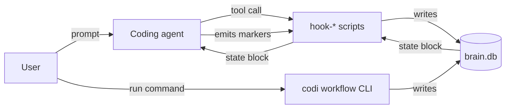
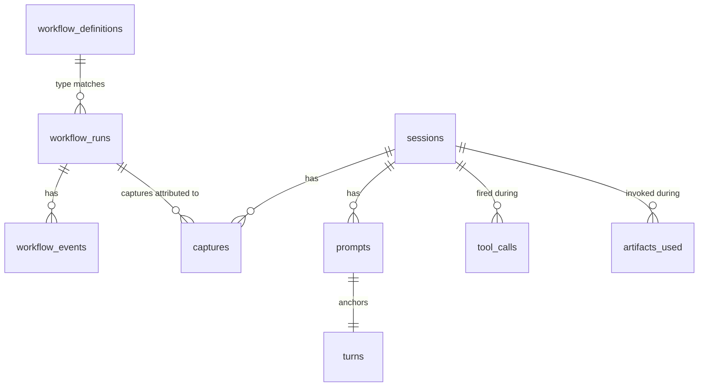

# Codi v3 zero closure (F1–F11)

- **Date**: 2026-05-09 15:47
- **Document**: 20260509*154728*[REPORT]\_codi-v3-zero-closure.md
- **Category**: REPORT

## Summary

Eleven-step closure that takes Codi v3 from a v2-shaped legacy underneath to a brain-canonical, devloop-dissolved zero-mode core. Single backend (SQLite), single CLI namespace (`codi workflow ...`), single capture grammar (Iron Law 9). No reduction of functionality, no duplication.

End state:

- 3395 vitest tests pass + 2 skipped across 281 files
- `tsc --noEmit` clean
- `pnpm build` clean — `dist/` ships schemas, templates, workflows, consolidation prompts
- Live smoke test: `node dist/cli.js workflow run feature "<task>"` works end-to-end

## The eleven steps

| Step | What changed                                                                                                                                                                                                                                                                                                                           | Verification                                  |
| ---- | -------------------------------------------------------------------------------------------------------------------------------------------------------------------------------------------------------------------------------------------------------------------------------------------------------------------------------------- | --------------------------------------------- |
| F1   | `workflow_definitions` table added to brain schema (v2).                                                                                                                                                                                                                                                                               | Drizzle schema + migration test               |
| F2   | Seeder reads `src/templates/workflows/{feature,bug-fix,refactor,migration,project}.yaml` and UPSERTs into the table. Idempotent; preserves `managed_by='user'`.                                                                                                                                                                        | Seeder test + 5 YAML fixtures                 |
| F3   | `BrainEventLog.append` keeps `workflow_runs.current_phase` and `status` in sync per event. Closes the audit gap that left readers on stale data.                                                                                                                                                                                       | brain-event-log test                          |
| F4   | `proposeTransition` reads `workflow_definitions[type].phases[from].next` and rejects illegal moves. Graceful degrade for unseeded brains.                                                                                                                                                                                              | transitions test                              |
| F5   | Legacy filesystem event log dropped: `event-log.ts`, `event-log-factory.ts`, `paths.ts` deleted. Every handler runs through `BrainEventLog`. System author renamed `devloop` → `codi` in events, hook strings, branch prefixes, PR markers, preferences path. Tests adapted with `CODI_BRAIN_DB` env var for per-test brain isolation. | full vitest                                   |
| F6   | Capture pipeline closed-loop: `prompts` / `turns` / `captures` / `tool_calls` / `artifacts_used` populated by three orchestrators (`processPromptSubmit`, `processPostToolUse`, `processStopHook`). New `hook-stop.ts` + `stop.sh` template.                                                                                           | capture-session, stop-hook, prompt-hook tests |
| F7   | Iron Laws 4 / 5 / 7 / 8 wired into the live hooks. L4 fires via `pending_approval` status flip. L7 actually blocks unauthorized git mutations (exit 2). L5 + L8 are advisory.                                                                                                                                                          | iron-laws-enforcer + iron-laws-wiring tests   |
| F8   | Three gate checks rewritten from fake-pass to evidence-driven: `no_unresolved_scope_proposals` (walks events per-file), `validation_passes` (latest `validation_run` exit code), `all_planned_files_modified` (`git status --porcelain` per planned file).                                                                             | gate-fixes test                               |
| F9   | `codi workflow` CLI namespace landed: 10 subcommands wrapping the runtime handlers. Two pre-existing dist-packaging bugs surfaced and fixed: schemas now ship to `dist/`, `findSchemaPath` resolves both layouts.                                                                                                                      | unit/cli/workflow + live smoke                |
| F10  | P9 detector added — turns `\|OBSERVATION: "..."\|` captures naming an installed artifact into `OPTIMIZE_EXISTING_ARTIFACT` proposals. Legacy `[CODI-OBSERVATION: artifact \| category \| text]` grammar dropped from agent-facing instructions; the gap-category vocabulary moves inside the verbatim text.                            | p9-detector test                              |
| F11  | Cleanup: 5 dead scripts deleted, stale e2e harness removed, brain-backed compactor (`compactWorkflows`) replaces the filesystem version, CHANGELOG entry added, this report.                                                                                                                                                           | m5-features compactor block + full vitest     |

## Architecture after closure



### Brain tables (zero mode)



`workflow_definitions` (added F1) is the source of truth for phase graphs. `workflow_runs` + `workflow_events` carry execution state. `sessions` + `prompts` + `turns` + `captures` + `tool_calls` + `artifacts_used` carry observability state.

### Hook surface

| Hook             | Driver                       | Writes                                                                                                                                |
| ---------------- | ---------------------------- | ------------------------------------------------------------------------------------------------------------------------------------- |
| UserPromptSubmit | `hook-user-prompt-submit.ts` | `prompts` row + opens a `turns` row + emits `<workflow-state>` / `<capture-protocol>` / iron-laws blocks                              |
| PreToolUse       | `hook-pre-tool-use.ts`       | nothing (decision-only). Blocks on phase / scope violation OR Iron Law 7 unauthorized git mutation. Advises on Iron Law 5 stale-pull. |
| PostToolUse      | `hook-post-tool-use.ts`      | `tool_calls` row + optional `incidental_change_recorded` event                                                                        |
| Stop             | `hook-stop.ts`               | parses agent text for `\|TYPE: "..."\|` markers, persists `captures` rows, closes the in-flight turn                                  |

### CLI surface

| Command                                                      | Calls                                                                  |
| ------------------------------------------------------------ | ---------------------------------------------------------------------- |
| `codi workflow run <type> <task>`                            | `runWorkflow`                                                          |
| `codi workflow status`                                       | `getStatus`                                                            |
| `codi workflow abandon --reason ...`                         | `abandonWorkflow`                                                      |
| `codi workflow recover`                                      | `recoverWorkflow`                                                      |
| `codi workflow transition --to/--approve/--reject`           | `proposeTransition`/`approveTransition`/`rejectTransition`             |
| `codi workflow scope {propose,approve,reject}`               | `proposeScopeExpansion`/`approveScopeExpansion`/`rejectScopeExpansion` |
| `codi workflow elevate <child>/--approve/--reject`           | `proposeElevation`/`approveElevation`/`rejectElevation`                |
| `codi workflow handover --to ... [--force --maintainer ...]` | `handover`/`forceHandover`                                             |
| `codi workflow stats`                                        | `computeWorkflowStats`                                                 |

Every action accepts `--as-agent` to attribute the call to the agent rather than the human user.

## What was preserved

- **All scope-discipline behavior** — proposals, approvals, rejections, incidental-change tracking. Storage moved from `.workflow/archives/<id>/*.json` to `workflow_events`.
- **All phase semantics** — intent → plan → decompose → execute → verify → done. Now enforced from `workflow_definitions` instead of hard-coded.
- **All gate checks** — six of them; three rewritten to use real evidence (F8).
- **Compaction** — the filesystem compactor disappeared but is replaced by brain-backed equivalent that collapses old `workflow_events` into a `workflow_runs.metadata.compacted` summary blob.
- **PR summary** — same content; the `<!-- codi-summary-hash:` marker replaces the `<!-- devloop-summary-hash:` marker.
- **Hook surface** — pre-tool-use / post-tool-use / user-prompt-submit / session-start / pre-push are unchanged; Stop is new.

## What was dropped

- Legacy filesystem event log (`event-log.ts`, `event-log-factory.ts`, `paths.ts`).
- `scripts/runtime/{devloop,classify,gate,manifest,pre-squash}.ts` — broken legacy CLI scripts that imported a non-existent `../lib/*` path. Zero callers.
- `tests/runtime/e2e/` — stale shell harness pinned at `/Users/laht/projects/devloop`.
- Legacy filesystem compactor.
- `[CODI-OBSERVATION: ...]` grammar from agent-facing artifacts.

## Outstanding (deferred from F1–F11)

- `src/core/hooks/heartbeat-hooks.ts` still emits a `skill-observer.cjs` script that scans transcripts for the legacy `[CODI-OBSERVATION: ...]` grammar and writes `.codi/feedback/*.json`. F6's Stop hook supersedes it for capture handling; F11 leaves the script in place so the adapter-emitted `.claude/settings.json` references resolve. Removing it cleanly requires reworking `claude-code` and `codex` adapter tests — out of scope for v3 zero closure.
- `src/templates/skills/refine-rules/template.ts` still reads `.codi/feedback/*.json`. Wiring it to the `captures` table (filter `type = 'OBSERVATION'`) is a contained follow-up.
- `src/runtime/sync/*` (Google Sheets sync subsystem) still references `.devloop/` paths and `devloop sheets ...` CLI strings in user-facing copy. Independent feature surface; renaming is a self-contained migration.

## Verification

```bash
# Type check
pnpm tsc --noEmit
# → exit 0

# Unit + integration suites
pnpm vitest run
# → 281 files, 3395 pass + 2 skipped

# Production build
pnpm build
# → dist/cli.js, dist/schemas/, dist/templates/{skills,consolidation,workflows}/

# Live smoke
TMP=$(mktemp -d); mkdir -p "$TMP/docs"; echo "# C" > "$TMP/docs/CONTEXT.md"
cd "$TMP" && CODI_BRAIN_DB="$TMP/brain.db" node /path/to/codi/dist/cli.js workflow run feature "smoke"
# → { "success": true, "data": { "workflowId": "feat-smoke-YYYYMMDD" } }
```
