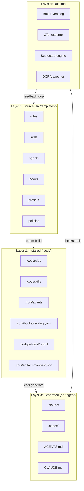
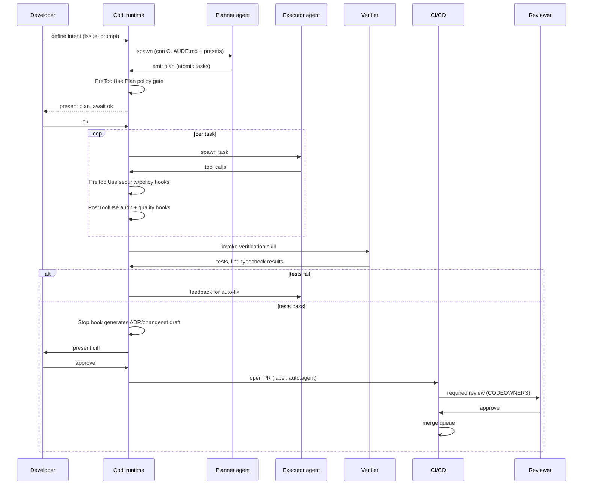
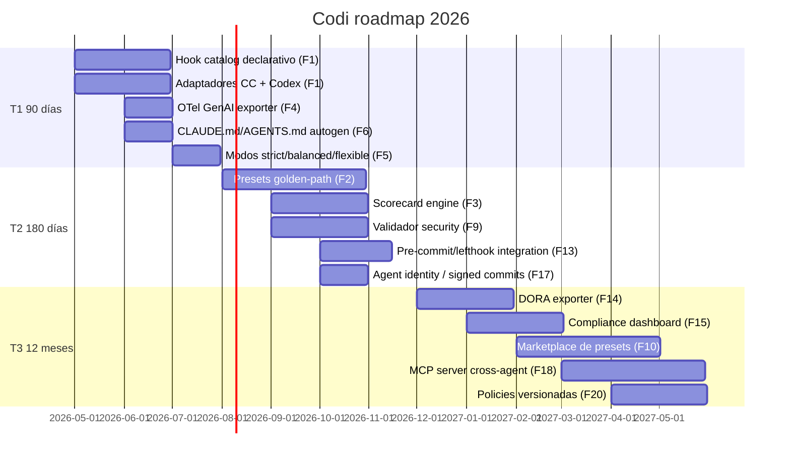

# Codi — Patrones de estandarización para equipos con coding agents

- **Date**: 2026-05-09 17:50
- **Document**: 20260509*175013*[RESEARCH]\_codi-coding-agent-team-standardization-patterns.md
- **Category**: RESEARCH

> Research deliverable. Mapea estado del arte 2025–2026 de coding-agent team standardization a la superficie real de Claude Code y Codex, y propone arquitectura, taxonomía de hooks y roadmap para Codi.

---

## 1. Resumen ejecutivo

Tres tesis cruzan el documento:

1. **El hueco de mercado existe y es claro.** Backstage/Port resuelven el plano IDP humano. CodeRabbit/Greptile resuelven el review-side. Ninguno cubre el ciclo agent-side: `PreToolUse → PostToolUse → Stop → PR`. Codi puede ser el **plano de control de coding agents en equipos** — el "Backstage del coding agent".
2. **Claude Code y Codex son complementarios, no equivalentes.** Claude Code aporta superficie de hooks rica (29 eventos, 5 tipos de handler) sin sandbox de OS. Codex aporta sandbox real (Seatbelt/bwrap) con 6 eventos de hook MVP y `requirements.toml` enterprise. Codi debe abstraer ambas y rellenar gaps por agente.
3. **El multiplicador de adopción es presets golden-path por arquetipo.** `next-15.5+biome`, `hono+drizzle`, `fastapi+uv+ruff`, `nx-monorepo`, `python-data-uv`, etc. — el patrón antfu/cookiecutter aplicado al stack agent-aware.

Las **tres prioridades de roadmap** que se derivan:

- T1 (90 días): taxonomía de 10 hooks dentro de Codi + adaptadores Claude Code/Codex.
- T2 (180 días): presets golden-path por arquetipo + scorecards.
- T3 (12 meses): `policies/*.rego` evaluadas en `PreToolUse`/`PostToolUse` + DORA exporter desde el `BrainEventLog`.

**Riesgos críticos**: prompt injection indirecta (OWASP LLM01:2025 sin solución madura), supply-chain agent-driven (Shai-Hulud worm sept 2025), CVE-2025-55284 (DNS exfiltration en Claude Code), CVE-2025-59536/2026-21852 (RCE vía project files). Defense-in-depth obligatorio.

---

## 2. Problema que Codi resuelve

| Síntoma observable                                                                           | Causa                                                                 | Lo que Codi aporta                                                                          |
| -------------------------------------------------------------------------------------------- | --------------------------------------------------------------------- | ------------------------------------------------------------------------------------------- |
| Cada developer del equipo configura su `.claude/settings.json`/`.codex/config.toml` distinto | Falta de plano central                                                | Artefactos versionados (`rules`/`skills`/`agents`/`hooks`) generados desde `src/templates/` |
| El agente rompe convenciones del repo (commits, tests, paths)                                | El agente no ve las convenciones — sólo el código                     | `CLAUDE.md`/`AGENTS.md` autogenerado desde reglas declarativas, sincronizado con presets    |
| El agente ejecuta comandos peligrosos en proyectos sin sandbox                               | Cada herramienta tiene su propio modelo de permisos, sin homogeneidad | Hooks deterministas `PreToolUse` que aplican policies de equipo independientes del agente   |
| No hay forma de auditar qué hizo el agente                                                   | Logs por-herramienta, formato distinto                                | `BrainEventLog` con OpenTelemetry GenAI semantics                                           |
| Equipos no pueden definir "este es nuestro stack y reglas"                                   | Falta de presets reutilizables                                        | Marketplace de presets + scorecards                                                         |

---

## 3. Estado actual de la industria (2025–2026)

### 3.1 Estandarización de instrucciones

- **AGENTS.md** es el estándar emergente unificado (Linux Foundation / Agentic AI Foundation). Adoptado por Codex, Cursor, Aider, Zed, Warp, Gemini CLI, Jules, Factory, Amp.
- **Claude Code (abril 2026)** sigue sin leer AGENTS.md nativamente. Workaround comunidad: `ln -s AGENTS.md CLAUDE.md`.
- **`.cursorrules`** legado, hoy `.cursor/rules/` con globs.
- Convergencia: archivos Markdown como unidad, jerarquía usuario/proyecto/local.

### 3.2 Memoria y contexto compartido

- No hay protocolo cross-vendor. Cada agente es silo.
- **Cursor Enterprise**: Team Rules + MDM (Group Policy/macOS profiles) + SAML/SCIM.
- **Claude Code Plugins**: distribuir `settings.json + subagents + skills + hooks + output-styles` como unidad. Server-managed settings en plan Team/Enterprise.
- **Continue Hub**: configs compartidas; embeddings indexados localmente.
- **Patrón emergente — MCP server interno como "shared context layer"**: documentación, decisiones, snippets, project state expuestos por un MCP que todas las herramientas consumen.

### 3.3 Permisos y sandboxing

| Capa           | Claude Code                                                                                                         | Codex                                                                                                 |
| -------------- | ------------------------------------------------------------------------------------------------------------------- | ----------------------------------------------------------------------------------------------------- |
| Org policy     | `managed-settings.json` (MDM) + `allowManagedHooksOnly`, `allowManagedMcpServersOnly`, `forceRemoteSettingsRefresh` | `requirements.toml` enterprise                                                                        |
| Project        | `.claude/settings.json`                                                                                             | `.codex/config.toml` (solo si trusted)                                                                |
| Local          | `.claude/settings.local.json`                                                                                       | `~/.codex/config.toml`                                                                                |
| Permisos       | `allow`/`deny`/`ask` con sintaxis `Bash(npm run *)`, `Read(.env)`, `mcp__server__tool`                              | `[permissions.<name>]` con built-ins `:read-only`/`:workspace`/`:danger-no-sandbox`                   |
| Sandbox real   | NO (sólo permission prompts)                                                                                        | SÍ (Seatbelt en macOS, bwrap+seccomp en Linux)                                                        |
| Modos          | `default`/`acceptEdits`/`plan`/`auto`/`bypassPermissions`                                                           | `read-only`/`workspace-write`/`danger-full-access` + `untrusted`/`on-request`/`never` approval policy |
| Network egress | Por permisos (no aislamiento real)                                                                                  | Default-deny en `workspace-write`, allowlist `[permissions.workspace.network.domains]`                |

### 3.4 Patrones agénticos relevantes a coding

- **ReAct**: razona-actúa-observa por step. Latencia alta.
- **Plan-and-Execute**: planificador (modelo grande) + ejecutores (modelos pequeños). Reduce coste y latencia.
- **ReWOO**: planifica toda la cadena upfront. Reduce 50–70% de latencia vs ReAct.
- **OpenAI Agents SDK** (sucesor de Swarm): Handoffs, Guardrails, Tracing, Sessions.
- **AutoGen v0.4** (Microsoft): actor model + human-in-the-loop configurable.

Aplicado a coding: Planner agent (`opus`/`gpt-5.5`) genera plan atómico; Executor agents (`haiku`/`gpt-5-mini`) ejecutan; Verifier valida (tests, lint, type check). Codi puede materializar este pipeline en su sistema de subagents.

### 3.5 Auditoría y trazabilidad

- **Estándar emergente**: [OpenTelemetry Semantic Conventions for GenAI](https://opentelemetry.io/docs/specs/semconv/gen-ai/) — spans `create_agent`, `invoke_agent`, `execute_tool`; eventos `gen_ai.tool.message`, `gen_ai.choice`.
- **Plataformas**: LangSmith, Braintrust (TS-first), Helicone (gateway), Langfuse (OSS self-hosted), Arize Phoenix.
- **Codex** ya emite OTel: `codex.conversation_starts`, `codex.tool_decision`, `codex.tool_result` con redacción opt-in de prompts. Configurable vía `[otel]` en `config.toml`.
- **Claude Code**: hooks `Stop`/`PostToolUse` permiten emitir logs estructurados, pero no hay OTel nativo.
- **GitHub Copilot Cloud Agent (abril 2026)**: firma criptográfica de commits + session log link en commit message — primer caso de "agent identity" en Git.

### 3.6 Riesgos documentados (CVEs y casos públicos 2025–2026)

| ID                          | Vector                                                                                   | Impacto                          |
| --------------------------- | ---------------------------------------------------------------------------------------- | -------------------------------- |
| CVE-2025-54794, 54795       | Prompt injection en code blocks de Claude Code                                           | LPE 7.7 / 8.7                    |
| CVE-2025-55284              | DNS exfiltration vía `nslookup` con allowlist amplia                                     | Leak de `.env`                   |
| CVE-2025-59536 / 2026-21852 | RCE al iniciar Claude Code en directorio untrusted con `.claude/settings.json` malicioso | RCE host                         |
| CVE-2025-52882              | WebSocket auth bypass MCP en extensiones IDE                                             | Comando arbitrario desde web     |
| Shai-Hulud worm (sept 2025) | >500 paquetes npm comprometidos auto-replicantes                                         | Supply chain                     |
| EchoLeak (Copilot)          | Zero-click prompt injection vía email                                                    | Exfiltración OneDrive/SharePoint |
| LiteLLM compromise          | Backdoor en LLM gateway                                                                  | RCE multi-tenant                 |
| MCPTox benchmark            | 7.2% de servidores MCP públicos vulnerables, 5.5% tool-poisoning                         | Indirect injection               |
| arxiv 2604.03070            | 520 agent skills vulnerables (3% de 17k), 73% leaks vía stdout                           | Credential leakage               |

---

## 4. Patrones de estandarización relevantes

### 4.1 Patrones generales (no agent-specific)

| Patrón             | Tooling 2026                                                                                                                                               |
| ------------------ | ---------------------------------------------------------------------------------------------------------------------------------------------------------- |
| Linters/formatters | **Biome** (frontend, Next 15.5 oficial), **Ruff** (Python, 180M dl/mes), **detekt+ktlint** (Kotlin), **SwiftLint** (Swift), **tflint+checkov** (Terraform) |
| Testing            | **Vitest** (JS/TS), **pytest+coverage** (Python), **Playwright** (E2E), **Testcontainers** (integración)                                                   |
| PR review          | CodeRabbit (2M repos), Greptile (full-codebase context), Korbit, Sourcery, Cursor BugBot                                                                   |
| Commits            | Conventional Commits 1.0.0 + commitlint + semantic-release o changesets (monorepo)                                                                         |
| Branching          | Trunk-based + GitHub Merge Queue / GitLab Merge Train                                                                                                      |
| Documentación      | Docusaurus, Mintlify, Fumadocs, mkdocs-material; ADRs con Log4brains; changelog con semantic-release/git-cliff                                             |
| Arquitectura       | Backstage Software Templates, Port Blueprints, Humanitec Score, Cookiecutter                                                                               |
| Dependencias       | pnpm `--frozen-lockfile`, `ignore-scripts=true`, `osv-scanner`, `socket.dev`, Snyk, Dependabot                                                             |
| Secretos           | gitleaks (pre-commit), trufflehog `--only-verified` (CI), detect-secrets (legacy)                                                                          |
| Quality gates      | Pre-commit (Python), lefthook (Go binary, 2.7–3.7x más rápido en monorepos), husky (JS, mejor ecosistema)                                                  |

### 4.2 Patrones específicos para coding agents

| Patrón                                         | Mecanismo                                                            | Madurez                             |
| ---------------------------------------------- | -------------------------------------------------------------------- | ----------------------------------- |
| Instrucciones jerárquicas (user/project/local) | CLAUDE.md, AGENTS.md, `.cursor/rules/`                               | Estable                             |
| Permisos por capa con precedencia              | Claude Code 5 niveles, Codex 6 niveles                               | Estable                             |
| Sandboxing OS-level                            | Codex Seatbelt/bwrap nativo, Claude Code requiere contenedor externo | Estable (Codex) / Gap (Claude Code) |
| Hooks de lifecycle                             | Claude Code 29 eventos, Codex 6 eventos                              | Maduro (CC) / MVP (Codex)           |
| Plan/Execute/Verify split                      | OpenAI Agents SDK Handoffs, Claude Code subagents, AutoGen           | Estable                             |
| Memoria persistente entre sesiones             | Codex `memories` feature, Claude Code skills, MCP memory server      | Beta                                |
| Auditoría OpenTelemetry                        | Codex nativo, Claude Code via hooks                                  | Emergente                           |
| Signed commits por agente                      | GitHub Copilot Cloud Agent (abril 2026)                              | Pionero                             |
| Policy-as-code sobre tool calls                | OPA/Rego en `PreToolUse` (Propel, Earthly Lunar)                     | Emergente                           |
| Org-managed config + MDM                       | Claude Code `managed-settings.json`, Codex `requirements.toml`       | Estable                             |

---

## 5. Taxonomía de hooks para Codi

10 categorías. Cada categoría agrupa hooks por intención y se mapea a eventos concretos de Claude Code y Codex.

### 5.1 Tabla maestra

| Categoría         | Intención                                                     | Eventos CC                                                                      | Eventos Codex                                         |
| ----------------- | ------------------------------------------------------------- | ------------------------------------------------------------------------------- | ----------------------------------------------------- |
| **Policy**        | Reglas de negocio del equipo (¿se permite esta acción?)       | `PreToolUse`, `UserPromptSubmit`, `PermissionRequest`                           | `PreToolUse`, `PermissionRequest`, `UserPromptSubmit` |
| **Quality**       | Tests, lint, type check antes/después de cambios              | `PostToolUse`, `Stop`, `PostToolBatch`                                          | `PostToolUse`, `Stop`                                 |
| **Security**      | Bloqueo de comandos peligrosos, secret scanning, supply chain | `PreToolUse` (Bash/Read/Edit/Write)                                             | `PreToolUse`, `exec_policy`                           |
| **Context**       | Carga/inyección de contexto, environment vars, branch info    | `SessionStart`, `Setup`, `UserPromptSubmit`, `InstructionsLoaded`, `CwdChanged` | `SessionStart`, `UserPromptSubmit`                    |
| **Documentation** | Mantener docs/ADRs/changelog/typedoc en sync                  | `PostToolUse` (Edit/Write), `Stop`                                              | `PostToolUse`, `Stop`                                 |
| **Workflow**      | Phase transitions, plan/execute split, subagent orchestration | `SubagentStart/Stop`, `TaskCreated/Completed`, `UserPromptExpansion`            | `SessionStart`, `PostToolUse`                         |
| **Review**        | Revisión humana o agéntica obligatoria antes de merge         | `Stop`, hook externo en CI                                                      | `Stop`, hook externo en CI                            |
| **Audit**         | Trazabilidad, OTel emit, BrainEventLog write                  | `PostToolUse`, `Stop`, `SessionEnd` (todos los eventos)                         | `PostToolUse`, `Stop`                                 |
| **Dependency**    | Bloqueo de paquetes vulnerables, validación de lockfile       | `PreToolUse` (Bash con `npm/pnpm/uv/pip add`)                                   | `PreToolUse`                                          |
| **Release**       | Conventional commits, changelog, version bump validation      | `PreToolUse` (Bash con `git commit/push/tag`), `Stop`                           | `PreToolUse`, `Stop`                                  |

### 5.2 Catálogo de hooks concretos (15 hooks ready-to-ship)

Formato: `Categoría | Evento | Matcher | Lógica | Acción`.

| #   | Cat           | Evento CC    | Matcher                                           | Lógica                                                                                                          | Acción                                         |
| --- | ------------- | ------------ | ------------------------------------------------- | --------------------------------------------------------------------------------------------------------------- | ---------------------------------------------- |
| 1   | Security      | PreToolUse   | `Bash`                                            | AST parse (mvdan/sh) detecta `rm -rf` con path fuera del repo                                                   | Block                                          |
| 2   | Security      | PreToolUse   | `Bash`                                            | regex `\bsudo\b` o `(curl\|wget).*\|.*sh`                                                                       | Block                                          |
| 3   | Security      | PreToolUse   | `Bash`                                            | `git push --force` o `--force-with-lease` a `main\|master\|develop\|release/*`                                  | Block                                          |
| 4   | Security      | PreToolUse   | `Bash`                                            | `git reset --hard` o `git clean -fdx`                                                                           | Ask                                            |
| 5   | Security      | PreToolUse   | `Read\|Edit\|Write`                               | path matches `**/.env*`, `**/credentials*`, `~/.ssh/**`, `~/.aws/**`, `~/.config/gh/**`, `**/*.pem`, `**/*.key` | Block (allowlist por proyecto)                 |
| 6   | Security      | PreToolUse   | `Bash`                                            | `gitleaks protect --staged --redact` exit != 0                                                                  | Block                                          |
| 7   | Security      | PreToolUse   | `Bash`                                            | `nslookup\|dig\|host` con argumento que parece subdomain encoding (>63 chars o base64)                          | Block (CVE-2025-55284)                         |
| 8   | Dependency    | PreToolUse   | `Bash`                                            | `(npm\|pnpm\|yarn) (add\|install)` → invoca `socket-cli` o `osv-scanner`                                        | Block si vulnerable                            |
| 9   | Dependency    | PreToolUse   | `Bash`                                            | `(pip\|uv) (install\|add)` → invoca `osv-scanner` o `pip-audit`                                                 | Block si vulnerable                            |
| 10  | Quality       | PostToolUse  | `Edit\|Write` con path en `src/**`                | corre lint+typecheck del archivo tocado                                                                         | Anota stderr a Claude (no bloquea por defecto) |
| 11  | Quality       | Stop         | `*`                                               | corre suite de tests rápidos del module afectado                                                                | Block stop si fallan                           |
| 12  | Documentation | PostToolUse  | `Edit\|Write` sobre `src/**/index.ts\|exports.ts` | dispara skill `update-typedoc`                                                                                  | Background (asyncRewake)                       |
| 13  | Audit         | PostToolUse  | `*`                                               | emit OTel span `execute_tool` con args hash, decisión, duración                                                 | Background                                     |
| 14  | Release       | PreToolUse   | `Bash` con `git commit`                           | valida conventional commits via commitlint                                                                      | Block si malformado                            |
| 15  | Context       | SessionStart | `startup\|resume`                                 | inyecta branch, uncommitted changes, last failed test, active issue                                             | additionalContext                              |

### 5.3 Estructura física en Codi

```
.codi/hooks/
├── catalog.yaml              # Manifiesto de hooks disponibles
├── policy/
│   ├── block-rm-rf.sh
│   ├── block-force-push.sh
│   └── conventional-commits.sh
├── security/
│   ├── secrets-scan.sh
│   ├── dns-exfil-block.sh
│   └── path-allowlist.sh
├── quality/
│   ├── run-affected-tests.sh
│   └── lint-on-edit.sh
├── audit/
│   └── otel-emit.sh
└── adapters/
    ├── claude-code.ts       # Renderiza catalog.yaml a .claude/settings.json hooks
    └── codex.ts             # Renderiza a .codex/hooks.json
```

`codi generate` lee `catalog.yaml` y produce los archivos por agente con la sintaxis correcta.

---

## 6. Patrones recomendados para Codi (8 patrones)

### Patrón 1 — Policy Gate

- **Problema**: el agente puede ejecutar comandos que violen reglas del equipo (push a main, install de paquetes no aprobados, edición de paths protegidos).
- **Cuándo**: siempre que el equipo tenga reglas declarativas que deban aplicarse independientemente del modelo.
- **Cómo**: hook `PreToolUse` que evalúa el tool call contra un policy file (Rego, JS, o TOML declarativo).
- **Ejemplo conceptual**: `codi policy add no-force-push --tool Bash --pattern "git push.*--force.*main"`.
- **Riesgos**: falsos positivos bloquean trabajo legítimo; mantener allowlist por proyecto.
- **Codi**: `.codi/policies/*.yaml` interpretado por adaptador. Compatible con OPA via plugin.
- **CC**: `PreToolUse` con `if: "Bash(git push *)"` + script.
- **Codex**: `[[hooks.PreToolUse]]` con `matcher = "^Bash$"` + script + `exec_policy` complementario.

### Patrón 2 — Plan-Execute-Verify Split

- **Problema**: el agente entrega cambios grandes sin plan, sin verificación, en un solo turn.
- **Cuándo**: features que tocan >3 archivos o >100 LOC.
- **Cómo**: forzar 3 fases con subagents distintos. Planner emite spec atómico; Executor implementa; Verifier corre tests/lint.
- **Codi**: workflow `feature` ya tiene esta estructura. Reforzar con hooks `SubagentStart` que verifiquen que el plan existe antes de spawnear executor.
- **CC**: subagents Plan, Explore, custom Executor + Verifier; `TaskCreated` hook persiste el plan.
- **Codex**: `[agents.planner]`, `[agents.executor]`, `[agents.verifier]` + `spawn_agents_on_csv` para parallel execute.

### Patrón 3 — Context Loader

- **Problema**: el agente arranca sin saber estado del repo (branch, commits pendientes, tests rotos).
- **Cómo**: `SessionStart` hook que inyecta context structurado.
- **Codi**: skill `codi-session-start` que emite `additionalContext` con git status, last CI run, active issues.
- **CC**: `SessionStart` hook + `additionalContext` en stdout.
- **Codex**: `developer_instructions` dinámico vía script + `[[hooks.SessionStart]]`.

### Patrón 4 — Audit Trail

- **Problema**: equipo de seguridad/compliance pide "qué hizo el agente entre 14:00 y 15:00".
- **Cómo**: `PostToolUse` emit a `BrainEventLog` con OpenTelemetry GenAI semantics (trace ID, tool name, args hash, exit code, duración, hook decision).
- **Codi**: ya existe `BrainEventLog` (`src/runtime/brain-event-log.ts`); alinear con OTel GenAI; export a SIEM via OTLP.
- **CC**: `PostToolUse` + `Stop` + `SessionEnd` background hooks.
- **Codex**: `[otel]` exporter nativo; complementar con `[[hooks.PostToolUse]]`.

### Patrón 5 — Quality Gate

- **Problema**: agente entrega código que no compila o rompe tests.
- **Cómo**: `Stop` hook que corre tests/lint/type check del módulo afectado antes de cerrar la sesión. Si fallan, bloquea el `Stop` y devuelve error a Claude para auto-fix.
- **Codi**: skill `codi-verification` ya existe; convertirlo en hook automático opt-in por preset.
- **CC**: `Stop` hook con `decision: "block"` + `reason` listando failures.
- **Codex**: `[[hooks.Stop]]` + `unified_exec` para correr suite paralela.

### Patrón 6 — Secret/Supply-Chain Guard

- **Problema**: agente lee `.env`, instala paquetes maliciosos, hace `curl | sh`.
- **Cómo**: pre-tool guard que combina (a) gitleaks scan en lecturas, (b) osv-scanner/socket-cli en installs, (c) regex deny sobre patrones destructivos.
- **Codi**: preset `security/strict` que activa hooks #5–#10 de §5.2.
- **CC**: `PreToolUse` con `if: "Bash(* install *)"` + handler.
- **Codex**: idem + opcional `[permissions.workspace.network.domains]` con `registry.npmjs.org = "allow"` y deny everything else.

### Patrón 7 — Documentation Sync

- **Problema**: API docs, CHANGELOG, ADRs se quedan obsoletos cuando el agente edita código.
- **Cómo**: `PostToolUse` sobre `Edit/Write` en `src/` con archivos exports — dispara skill `update-typedoc` o anota draft changeset. `Stop` final genera ADR si la sesión introdujo decisión arquitectural.
- **Codi**: skill `codi-doc-sync`.
- **CC**: `asyncRewake` para no bloquear el turn.
- **Codex**: `[[hooks.PostToolUse]]` con `timeout` largo.

### Patrón 8 — Identity & Provenance

- **Problema**: no hay forma de distinguir "commit hecho por humano" de "commit hecho por agente" en `git log`.
- **Cómo**: `PreToolUse` con `Bash(git commit *)` que inyecta trailer `Generated-by: codi/<agent-id>/<model>` + `Trace-id: <otel-trace>`. En CI, validador que rechaza commits con AI attribution si el preset prohíbe Claude/AI signatures (regla de Codi global).
- **Codi**: opción `commit_attribution` por proyecto.
- **CC**: hook command que reescribe el mensaje.
- **Codex**: ya tiene `commit_attribution` en `config.toml` nativo.

---

## 7. Tabla comparativa Claude Code vs Codex

| Capacidad                | Claude Code                                                                                | Codex CLI                                                                           |
| ------------------------ | ------------------------------------------------------------------------------------------ | ----------------------------------------------------------------------------------- |
| Archivo de instrucciones | `CLAUDE.md` (3 capas: user/project/local)                                                  | `AGENTS.md` (estándar) + `developer_instructions`                                   |
| Configuración            | `~/.claude/settings.json`, `.claude/settings.json`, `.claude/settings.local.json`, managed | `~/.codex/config.toml`, `.codex/config.toml`, `[features]`, `requirements.toml`     |
| Capas de precedencia     | 5 niveles (managed > CLI > local > project > user)                                         | 6 niveles (CLI > profile > project > user > system > default)                       |
| Hooks events             | **29 eventos** documentados                                                                | **6 eventos** MVP                                                                   |
| Tipos de handler         | command, http, mcp_tool, prompt, agent                                                     | command (process externo)                                                           |
| Sandbox OS-level         | NO (sólo permission prompts)                                                               | **SÍ** (Seatbelt macOS, bwrap+seccomp Linux)                                        |
| Network egress           | Permisos lógicos                                                                           | Default-deny + allowlist domains nativa                                             |
| Approval modes           | default, acceptEdits, plan, auto, bypassPermissions, dontAsk                               | untrusted, on-request, never, granular `{...}`                                      |
| Permission profiles      | `permissions.allow/deny/ask` con sintaxis `Tool(arg)`                                      | `[permissions.<name>]` con built-ins `:read-only`/`:workspace`/`:danger-no-sandbox` |
| Plugins                  | SÍ (settings + subagents + skills + hooks + commands)                                      | Limitado (skills + agents)                                                          |
| Subagents                | **SÍ**, primera clase                                                                      | SÍ (`[agents]`, `spawn_agents_on_csv`)                                              |
| MCP                      | SÍ + 12 servidores oficiales                                                               | SÍ + OAuth credential storage                                                       |
| OpenTelemetry            | NO nativo (via hooks)                                                                      | **SÍ nativo** (`[otel]` exporter)                                                   |
| Memorias persistentes    | Skills + plugins + Memory MCP server                                                       | `memories` feature (stable)                                                         |
| Signed commits           | NO (manual via hook)                                                                       | `commit_attribution` config nativo                                                  |
| Web search               | WebSearch tool + WebFetch                                                                  | `web_search = "cached"` (default), live, disabled                                   |
| Org admin enforcement    | `managed-settings.json` via MDM, `allowManagedHooksOnly`, `forceRemoteSettingsRefresh`     | `requirements.toml` admin-enforced                                                  |
| Output formats           | command, http, prompt, agent, mcp_tool                                                     | hooks.json o `[hooks]` inline en TOML                                               |
| `bypassPermissions`      | Sí (deshabilitable por org)                                                                | `--yolo` o `sandbox_mode = "danger-full-access"`                                    |
| Trust model proyecto     | n/a                                                                                        | Project-trust gate explícito (untrusted → ignora `.codex/`)                         |
| Idempotencia hooks       | `once: true` (sólo en skill frontmatter)                                                   | n/a                                                                                 |
| Async hooks              | `async: true`, `asyncRewake: true`                                                         | secuencial                                                                          |

**Lectura para Codi**: aprovechar el sandbox OS de Codex como capa base de seguridad y la riqueza de hooks de Claude Code como capa de extensibilidad. Las dos no son sustitutivas — son **complementarias por diseño**. Codi como capa de abstracción debe rellenar gaps por agente:

- En Claude Code: ofrecer "wrapper containerizado" (Docker/gVisor) para suplir falta de sandbox.
- En Codex: ofrecer "hooks pack" que extienda los 6 eventos MVP con scripts equivalentes a los 29 de CC cuando sea posible.

---

## 8. Arquitectura conceptual de Codi



### Principios arquitectónicos

1. **Three-layer pipeline** (ya existe): source → installed → generated. Cada capa con responsabilidad única.
2. **Adaptadores por agente**: cada hook se traduce al lenguaje del agente (`PreToolUse` JSON para Claude Code, `[[hooks.PreToolUse]]` TOML para Codex).
3. **Catalog-first**: un único `catalog.yaml` describe hooks/policies; los adaptadores serializan a la sintaxis del agente.
4. **Scorecard-driven presets**: cada preset declara reglas que se evalúan contra el repo (¿tiene los hooks? ¿la versión correcta? ¿los gates de quality?).
5. **OTel GenAI por defecto**: el `BrainEventLog` emite spans compatibles con OpenTelemetry semantic conventions.

---

## 9. Workflow recomendado para equipos



### Hard gates en este workflow

1. **Plan approval**: Codi pausa antes de Executor — necesita `ok` explícito (Iron Law 4).
2. **Diff approval**: Codi pausa antes de PR — necesita `ok`.
3. **Human PR review**: branch protection requiere ≥1 reviewer humano sobre PRs `auto:agent`.

---

## 10. Estándares configurables por arquetipo de proyecto

Cada arquetipo es un **preset** (`.codi/presets/<archetype>.yaml`) que declara reglas, skills, hooks y policies recomendados.

| Arquetipo         | Stack canónico 2026                                            | Hooks específicos                                                                                                  | Skills clave                                                   |
| ----------------- | -------------------------------------------------------------- | ------------------------------------------------------------------------------------------------------------------ | -------------------------------------------------------------- |
| `frontend-next`   | Next 15.5 + Biome + Tailwind 4 + shadcn + Vitest + Playwright  | Quality #10 (lint Biome), Documentation #12 (TypeDoc en exports)                                                   | `vercel-react-best-practices`, `vercel:nextjs`                 |
| `frontend-vite`   | Vite + Biome + Vitest                                          | idem sin SSR-specific                                                                                              | `frontend-design`                                              |
| `backend-node`    | Hono o Fastify + Drizzle + Vitest + Testcontainers             | Security #5 (`.env` block), Quality #11 (test affected)                                                            | `codi-api-design`, `codi-test-suite`                           |
| `backend-nestjs`  | NestJS + TypeORM/Prisma                                        | idem + N+1 detection en lint                                                                                       | idem                                                           |
| `python-fastapi`  | FastAPI + uv + Ruff + mypy + pytest                            | Security #9 (uv install scan), Quality #11 (pytest -k affected)                                                    | `codi-python-expert`                                           |
| `python-data-ml`  | uv + Ruff + DVC + MLflow + dbt + Great Expectations            | Audit reforzado (data lineage), Documentation (data contracts)                                                     | `codi-data-engineering-expert`, `codi-data-science-specialist` |
| `mobile-ios`      | SwiftLint + swift-format + fastlane                            | Quality (lint on edit)                                                                                             | `codi-mobile-development`                                      |
| `mobile-android`  | detekt + ktlint + Spotless                                     | idem                                                                                                               | idem                                                           |
| `mobile-rn`       | RN + Biome                                                     | idem + Metro bundler awareness                                                                                     | idem                                                           |
| `mobile-flutter`  | dart format + flutter analyze                                  | idem                                                                                                               | idem                                                           |
| `infra-terraform` | terraform fmt + tflint + checkov + OPA                         | Policy (Rego sobre `terraform plan`), Security (Trivy)                                                             | `codi-data-intensive-architect`                                |
| `infra-k8s`       | Kyverno + ArgoCD                                               | Policy (Kyverno admission), Security (image scan)                                                                  | `vercel:deployment-expert`                                     |
| `lib-oss`         | TypeDoc + changesets + semantic-release                        | Documentation #12, Release #14 (commitlint estricto)                                                               | `codi-project-documentation`                                   |
| `enterprise`      | preset `strict` con todos los hooks de §5.2 + managed settings | Todos los Security #1–#9, Audit forzado                                                                            | `codi-security-analyzer`                                       |
| `monorepo-turbo`  | Turborepo + pnpm + changesets                                  | Hook custom: lee `turbo run --graph` para inyectar contexto, valida que el agente toca packages declarados en plan | `codi-codebase-explorer`                                       |
| `monorepo-nx`     | Nx + pnpm                                                      | idem con `nx graph`                                                                                                | idem                                                           |

### Modos transversales

- **`strict`**: todos los hooks `Security` y `Quality` activos, `bypassPermissions` deshabilitado, `forceRemoteSettingsRefresh: true` en CC.
- **`balanced`** (default): hooks críticos (#1–#7, #11, #14) activos, resto opt-in.
- **`flexible`**: sólo hooks `Audit` (#13) activos — para proyectos exploratorios o solo developer.

---

## 11. Features recomendadas para el producto

### 11.1 Feature catalog (priorizadas por impacto/esfuerzo)

| #   | Feature                                                                                           | Impacto | Esfuerzo | Depende de                     |
| --- | ------------------------------------------------------------------------------------------------- | ------- | -------- | ------------------------------ |
| F1  | Hook catalog declarativo (`.codi/hooks/catalog.yaml`) + adaptadores CC/Codex                      | Alto    | Medio    | three-layer pipeline existente |
| F2  | Presets golden-path por arquetipo (15 listados en §10)                                            | Alto    | Medio    | F1, sistema de skills          |
| F3  | Scorecard engine (cumplimiento de reglas/hooks por repo)                                          | Alto    | Medio    | manifest.json                  |
| F4  | OTel GenAI exporter desde `BrainEventLog`                                                         | Alto    | Bajo     | `BrainEventLog` ya existe      |
| F5  | Modos `strict/balanced/flexible` por proyecto                                                     | Alto    | Bajo     | F1                             |
| F6  | Generación automática de `CLAUDE.md`/`AGENTS.md` desde reglas                                     | Alto    | Bajo     | rules system existente         |
| F7  | Validador de arquitectura (paths protegidos, deps direction)                                      | Medio   | Medio    | F1, F3                         |
| F8  | Validador de testing (coverage minima, tests obligatorios para nuevos archivos)                   | Medio   | Bajo     | hooks PostToolUse              |
| F9  | Validador de seguridad (gitleaks/osv pre-commit + pre-tool-use)                                   | Alto    | Bajo     | F1                             |
| F10 | Marketplace de presets/reglas (índice JSON en GitHub Pages estilo homebrew taps)                  | Medio   | Alto     | F2                             |
| F11 | Perfiles por equipo (org → team → project override)                                               | Medio   | Medio    | settings precedence            |
| F12 | Integración GitHub Actions (template de workflow + reusable workflows)                            | Medio   | Bajo     | F3                             |
| F13 | Integración pre-commit/lefthook (genera config sin pisar)                                         | Alto    | Medio    | F1                             |
| F14 | DORA metrics exporter (`codi dora export --to faros\|backstage\|port`)                            | Alto    | Medio    | F4                             |
| F15 | Compliance dashboard local (`codi audit --html`)                                                  | Medio   | Medio    | F3, F4                         |
| F16 | Plugin para review bots (CodeRabbit/Greptile) — Codi inyecta contexto del preset al review        | Medio   | Medio    | F2                             |
| F17 | Agent identity & signed commits (trailer `Generated-by`, alineado con Codex `commit_attribution`) | Alto    | Bajo     | F1                             |
| F18 | Cross-agent context server (MCP server de Codi que expone `BrainEventLog` + presets)              | Alto    | Alto     | F4                             |
| F19 | Logs panel (`codi log tail` y `codi log search` sobre `BrainEventLog`)                            | Medio   | Bajo     | `BrainEventLog`                |
| F20 | Versionado de policies (`.codi/policies/v1.0.0/...`) con compatibilidad backward                  | Medio   | Medio    | F1, F3                         |

### 11.2 Features sugeridas pero NO recomendadas para v1

| Feature                                     | Por qué no                                                                      |
| ------------------------------------------- | ------------------------------------------------------------------------------- |
| Marketplace cerrado/UI tipo VSCode          | Sobre-ingeniería; la comunidad funciona bien con awesome-lists + repos públicos |
| Agente propio de Codi (LLM model own)       | Vendor-locks; Codi debe ser agnóstico al modelo                                 |
| Sandbox OS propio (replicar Codex Seatbelt) | Mejor delegar — Docker/gVisor para CC, Seatbelt nativo para Codex               |
| Replay de sesiones agent-to-agent           | Privacy/compliance complejo; usar OTel GenAI para histórico                     |

---

## 12. Riesgos y mitigaciones

### 12.1 Riesgos técnicos

| Riesgo                                                                 | Probabilidad | Impacto           | Mitigación                                                                                                                                                       |
| ---------------------------------------------------------------------- | ------------ | ----------------- | ---------------------------------------------------------------------------------------------------------------------------------------------------------------- |
| Prompt injection indirecta vía repo/dep README/issues                  | **Alta**     | Alto              | Spotlighting; allowlist de fuentes; hooks UserPromptSubmit con regex sobre patrones de jailbreak; OWASP no tiene solución madura — declarar como riesgo residual |
| Agent ejecuta `rm -rf` por bug del modelo                              | Media        | Crítico           | Hook #1 con AST parser (mvdan/sh) — regex sólo no es suficiente                                                                                                  |
| Supply chain (Shai-Hulud-style worm en deps)                           | Alta         | Crítico           | Hooks #8 #9 + `ignore-scripts=true` + `--frozen-lockfile`                                                                                                        |
| DNS exfiltration vía nslookup (CVE-2025-55284)                         | Media        | Alto              | Hook #7 + egress allowlist (Codex sandbox network)                                                                                                               |
| Claude Code RCE vía `.claude/settings.json` malicioso (CVE-2025-59536) | Baja         | Crítico           | `SessionStart` hook que valida settings contra HEAD del proyecto + warn al usuario; ejecutar CC dentro de contenedor en projects untrusted                       |
| Logs con PII no redactados                                             | Media        | Alto (compliance) | OTel GenAI con `gen_ai.choice` opt-in y redaction; export a SIEM con DLP                                                                                         |

### 12.2 Riesgos de producto y adopción

| Riesgo                                                                                   | Probabilidad       | Mitigación                                                                                                                                    |
| ---------------------------------------------------------------------------------------- | ------------------ | --------------------------------------------------------------------------------------------------------------------------------------------- |
| **Exceso de fricción** (hooks bloquean trabajo legítimo)                                 | Alta               | Modos `strict/balanced/flexible`; whitelist por proyecto; `ask` antes que `block` por defecto                                                 |
| **Falsos positivos** en policies                                                         | Alta               | Logging extensivo en modo dry-run antes de activar; feedback loop con `.codi/feedback/`                                                       |
| **Bloqueo de flujo** en CI (preset estricto en greenfield rompe builds)                  | Media              | Onboarding guiado (`codi init` pregunta arquetipo y modo)                                                                                     |
| **Fuga de secretos** vía hooks que loguean prompts/args                                  | Media              | Hash en lugar de plaintext; default redaction; opt-in explicit a captura completa                                                             |
| **Dependencia excesiva del agente** (devs pierden contexto del codebase)                 | Alta               | Codi expone `codi audit` y `codi codebase explore` para que el humano entienda; presets incluyen skill `codi-codebase-onboarding` obligatoria |
| **Pérdida de criterio humano** (devs aprueban PRs sin leer)                              | Alta               | Required reviewers humanos; CodeRabbit/Greptile como signal NO como aprobador                                                                 |
| **Vendor lock-in** a CC o Codex                                                          | Alta               | Adaptadores por agente; catalog.yaml es agnóstico                                                                                             |
| **Confusión three-layer pipeline** (devs editan `.claude/` en lugar de `src/templates/`) | **Ya documentada** | CLAUDE.md self-dev mode (ya existe); hook que detecte edición a paths generados y warn                                                        |
| **Tooling sprawl** (Codi como yet-another-tool)                                          | Media              | Posicionamiento claro: capa orquestadora, no replacer; integraciones nativas con stacks dominantes                                            |

---

## 13. Roadmap sugerido



### Hitos críticos

- **Mes 3 (julio 2026)**: presets `frontend-next`, `backend-hono`, `python-fastapi` listos. Demo end-to-end con Claude Code y Codex.
- **Mes 6 (octubre 2026)**: scorecards generan reportes HTML; integración GitHub Actions oficial.
- **Mes 12 (mayo 2027)**: marketplace activo con ≥10 presets de comunidad; DORA exporter usado por al menos 1 equipo enterprise.

---

## 14. Conclusiones

1. **Codi tiene una ventana competitiva clara.** El ecosistema 2025–2026 es: agentes potentes (CC, Codex, Cursor), pero plano de control fragmentado por vendor. Backstage/Port no llegan al agent-side. Codi puede ser **el plano de control de coding agents**, posicionándose como capa neutra y abstracta.

2. **La arquitectura three-layer existente es correcta.** No hay que reescribirla — hay que extenderla con adaptadores por agente, catálogo de hooks, y scorecards.

3. **Hooks y policies son el corazón de la propuesta de valor.** 15 hooks ready-to-ship cubren ~80% de los riesgos críticos identificados (CVEs 2025–2026, OWASP LLM Top 10).

4. **Presets golden-path son el multiplicador de adopción.** Cubrir los 15 arquetipos de §10 captura el grueso del greenfield 2026.

5. **OpenTelemetry GenAI es la apuesta estándar de auditoría** — Codex ya lo emite nativo, Claude Code lo permite via hooks. Codi unifica.

6. **Riesgos críticos sin solución madura todavía**: prompt injection indirecta, "agent identity" para non-repudiation. Codi debe declarar estos como gaps conocidos, no inventar mitigaciones falsas.

7. **El modelo de operación humano-agéntico debe priorizar gates de revisión humana**. Iron Laws de Codi (especialmente #4 "Hard gates need ok") están alineados con DORA AI Capabilities Model #5 (small batches) y #7 (quality platform). Mantener esta disciplina.

---

## Apéndice A — Referencias canónicas

### Documentación oficial agentes

- [Claude Code — Hooks reference](https://code.claude.com/docs/en/hooks)
- [Claude Code — Permissions](https://code.claude.com/docs/en/permissions)
- [Claude Code — Permission Modes](https://code.claude.com/docs/en/permission-modes)
- [Claude Code — Plugins reference](https://code.claude.com/docs/en/plugins-reference)
- [Codex — Hooks](https://developers.openai.com/codex/hooks)
- [Codex — Sandboxing](https://developers.openai.com/codex/concepts/sandboxing)
- [Codex — Agent approvals & security](https://developers.openai.com/codex/agent-approvals-security)
- [Codex — Managed configuration](https://developers.openai.com/codex/enterprise/managed-configuration)
- [Codex — Configuration reference](https://developers.openai.com/codex/config-reference)
- [Codex — exec_policy](https://github.com/openai/codex/blob/main/docs/execpolicy.md)

### Estándares

- [AGENTS.md spec](https://agents.md/)
- [OpenTelemetry GenAI Semantic Conventions](https://opentelemetry.io/docs/specs/semconv/gen-ai/)
- [OWASP LLM Top 10:2025](https://genai.owasp.org/llmrisk/llm01-prompt-injection/)
- [Conventional Commits 1.0.0](https://www.conventionalcommits.org/en/v1.0.0/)
- [SLSA framework](https://slsa.dev/)

### CVEs relevantes

- CVE-2025-54794 / 54795 (InversePrompt, Cymulate)
- CVE-2025-55284 (DNS exfil, Embrace The Red)
- CVE-2025-52882 (WebSocket auth bypass, Datadog)
- CVE-2025-59536 / CVE-2026-21852 (RCE project files, Check Point Research)

### Investigación académica

- [arxiv 2604.03070 — Credential Leakage in LLM Agent Skills](https://arxiv.org/abs/2604.03070)
- [arxiv 2508.14925 — MCPTox Benchmark](https://arxiv.org/html/2508.14925v1)
- [arxiv 2504.03767 — MCP Safety Audit](https://arxiv.org/html/2504.03767v2)
- [arxiv 2509.23994 — Policy-as-Prompt](https://arxiv.org/abs/2509.23994)

### Plataformas y tooling

- [Microsoft Agent Governance Toolkit](https://github.com/microsoft/agent-governance-toolkit)
- [LangSmith](https://www.langchain.com/langsmith), [Braintrust](https://www.braintrust.dev/), [Helicone](https://www.helicone.ai/), [Langfuse](https://langfuse.com/)
- [Backstage Software Templates](https://backstage.io/docs/features/software-templates/)
- [Port Blueprints](https://www.port.io/guide/blueprints), [Humanitec Score](https://score.dev/)
- [OPA + Conftest](https://www.openpolicyagent.org/), [Kyverno](https://kyverno.io/), [Cedar](https://www.cedarpolicy.com/)
- [gitleaks](https://github.com/gitleaks/gitleaks), [trufflehog](https://github.com/trufflesecurity/trufflehog), [osv-scanner](https://github.com/google/osv-scanner), [socket.dev](https://socket.dev/)
- [mvdan/sh shell parser](https://github.com/mvdan/sh)
- [DORA Report 2025 — AI-assisted Software Development](https://dora.dev/dora-report-2025/)

### Hooks community repos

- [anthropics/claude-code examples/hooks](https://github.com/anthropics/claude-code)
- [disler/claude-code-hooks-mastery](https://github.com/disler/claude-code-hooks-mastery)
- [snagnever/claude-code-sidecar](https://github.com/snagnever/claude-code-sidecar)
- [kornysietsma/claude-code-permissions-hook](https://github.com/kornysietsma/claude-code-permissions-hook)

---

## Apéndice B — Quick wins para Codi en las próximas 4 semanas

1. **Catalog skeleton**: `.codi/hooks/catalog.yaml` + 5 hooks (#1, #5, #6, #11, #14 de §5.2). Adaptador Claude Code only (Codex después).
2. **Skill `codi-context-loader`**: implementa Patrón 3 — inyecta git status + last test run + active issue al `SessionStart`.
3. **OTel GenAI light**: agregar trace_id, span_id, tool name, args hash, exit code al `BrainEventLog`. Sin export a SIEM aún.
4. **Modo `strict` documentado**: README claro con lista de hooks activos, comparativa con `balanced`, comando `codi mode strict`.
5. **Generador `CLAUDE.md`/`AGENTS.md`** desde `.codi/rules/`: ya casi existe; cerrar el gap para que un solo source genere ambos archivos.

Estos 5 ítems son fundación para el resto del roadmap y demuestran valor inmediato.
