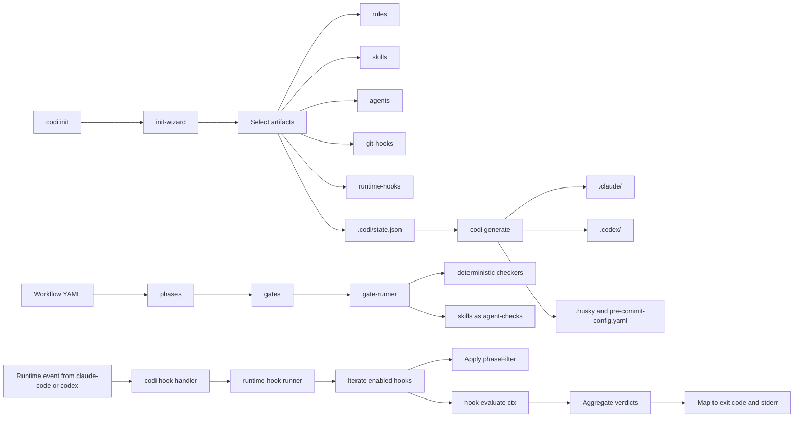

# Hooks as First-Class Artifacts

- **Date**: 2026-05-10 00:15
- **Document**: 20260510*001555*[PLAN]\_hooks-as-artifacts.md
- **Category**: PLAN
- **Status**: draft — pending user approval
- **Authors**: codi-brainstorming session

## 1. Summary

Promote codi hooks from auto-detected/hardcoded plumbing to first-class artifacts on equal footing with rules, skills, and agents. Two clean buckets cover every hook in the system: `git` (pre-commit / pre-push / commit-msg) and `runtime` (UserPromptSubmit / PreToolUse / PostToolUse / Stop / InstructionsLoaded / SessionStart). A unified `HookArtifact` schema, a single registry, an onboarding selector, and a CLI parity surface (`codi list/add/remove hook`) replace today's split treatment. The first concrete delivery is the new `security-reminder` runtime hook, a clean-room reimplementation of the public Anthropic `security-guidance` PreToolUse hook with the same nine pattern set and codi-native optimisations.

## 2. Goals

- Establish hooks as first-class artifacts, with the same lifecycle as rules / skills / agents.
- Unify the 40 existing pre-commit hooks plus the 6 hardcoded runtime hooks under one schema and registry.
- Ship the new `security-reminder` runtime hook as the first-of-its-kind PreToolUse advisory check.
- Provide an onboarding wizard step per bucket so developers see and choose hooks the same way they pick skills.
- Provide CLI parity: `codi list hooks`, `codi add hook`, `codi remove hook`.
- Connect hooks to the workflow phase model via opt-in `phaseFilter` and `dispatchSkill` fields.
- Keep both adapters (claude-code and codex) drift-free via the existing single `codi hook <event>` channel.

## 3. Non-Goals

- Replacing existing pre-commit tooling (eslint, prettier, gitleaks, etc.) — those remain the underlying executors.
- Letting end-users author runtime hook code in `.codi/hooks/runtime/` (security risk; out of scope for this delivery).
- Refactoring iron-laws-enforcer or capture-markers internals — they get an artifact wrapper, not a rewrite.
- A formal v1 → v2 state migrator. The reader fills missing fields with defaults; that is enough.

## 4. Architecture

### 4.1 Bucket model

Two buckets, no third. The terminology "advisor" introduced in earlier drafts is retired.

| Bucket    | Events                                                                            | Lifecycle                 | Examples                                                                              |
| --------- | --------------------------------------------------------------------------------- | ------------------------- | ------------------------------------------------------------------------------------- |
| `git`     | pre-commit, pre-push, commit-msg                                                  | Fire on git events        | gitleaks, eslint, prettier, ruff-check, bandit                                        |
| `runtime` | UserPromptSubmit, PreToolUse, PostToolUse, Stop, InstructionsLoaded, SessionStart | Fire on agent/tool events | iron-laws-enforcer, security-reminder, capture-markers, skill-tracker, skill-observer |

### 4.2 Where logic lives (Option A — approved)

- Built-in hook **logic** (TypeScript) lives in `src/runtime/hooks/<name>/` for runtime hooks and in `src/core/hooks/registry/git/<lang>.ts` for git hooks (existing location, schema migrated).
- Built-in hook **metadata** lives in the registry as a typed `HookArtifact` record.
- The 3-layer template pipeline (`src/templates/` → `.codi/` → `.claude/.codex/...`) applies only to text-content artifacts (skills, agents, rules). Hooks ship as code in the codi binary.
- User-custom hooks are out of scope for this delivery.

### 4.3 Convergence map



### 4.4 Hook → workflow integration

Two opt-in mechanisms tie a hook to the workflow phase model.

| Field           | Type                            | Effect                                                                                                                                                      |
| --------------- | ------------------------------- | ----------------------------------------------------------------------------------------------------------------------------------------------------------- |
| `phaseFilter`   | `Phase[]` optional              | Hook only fires when the active workflow is in one of these phases. If undefined, hook fires regardless of phase, including no-workflow sessions.           |
| `dispatchSkill` | `string` optional, runtime only | Instead of running its own `evaluate()`, the hook delegates to a named skill as an agent-check. Reuses the existing gate-runner agent-check infrastructure. |

Backwards compatible: every existing hook leaves both fields undefined and behaves exactly as today.

## 5. Data Shapes

### 5.1 HookArtifact discriminated union

```ts
// src/core/hooks/hook-artifact.ts
export type HookBucket = "git" | "runtime";

export type RuntimeEvent =
  | "UserPromptSubmit"
  | "PreToolUse"
  | "PostToolUse"
  | "Stop"
  | "SessionStart"
  | "InstructionsLoaded";

export type HookCategory =
  | "format"
  | "lint"
  | "type-check"
  | "security"
  | "test"
  | "meta"
  | "enforcement"
  | "observation";

export type Severity = "info" | "warn" | "block";

export interface HookContext {
  bucket: HookBucket;
  event?: RuntimeEvent;
  toolName?: string;
  filePath?: string;
  content?: string;
  sessionId: string;
  cwd: string;
  workflowPhase?: string;
}

export interface HookVerdict {
  hookName: string;
  matched: boolean;
  severity: Severity;
  ruleId?: string;
  message?: string;
  suggestedAction?: string;
}

export interface BaseHookArtifact {
  name: string;
  description: string;
  version: string;
  managed_by: "codi" | "user";
  required: boolean;
  default: boolean;
  category: HookCategory;
  phaseFilter?: string[];
  dispatchSkill?: string;
}

export interface GitHookArtifact extends BaseHookArtifact {
  bucket: "git";
  language: HookLanguage;
  stages: HookStage[];
  preCommit: PreCommitEmission;
  shell: ShellEmission;
  installHint: InstallHint;
  files: string;
  exclude?: string;
}

export interface RuntimeHookArtifact extends BaseHookArtifact {
  bucket: "runtime";
  events: RuntimeEvent[];
  evaluate: (ctx: HookContext) => HookVerdict | Promise<HookVerdict>;
}

export type HookArtifact = GitHookArtifact | RuntimeHookArtifact;
```

`HookLanguage`, `HookStage`, `PreCommitEmission`, `ShellEmission`, `InstallHint` come from the existing `hook-spec.ts` and are reused unchanged.

### 5.2 Registry API

```ts
// src/core/hooks/registry/index.ts
export function getAllHooks(): HookArtifact[];
export function getGitHooks(): GitHookArtifact[];
export function getRuntimeHooks(): RuntimeHookArtifact[];
export function getHook(name: string): HookArtifact | null;
export function getHooksForLanguage(language: HookLanguage): GitHookArtifact[]; // backwards compat
export function getDefaultGitHookNames(languages: HookLanguage[]): string[];
export function getDefaultRuntimeHookNames(): string[];
```

### 5.3 Persisted state

`.codi/state.json` gets one new optional field. No schema version bump, no migrator.

```json
{
  "version": "1",
  "lastGenerated": "2026-05-10T00:15:55Z",
  "selectedHooks": {
    "git": ["eslint", "prettier", "tsc", "gitleaks", "commitlint"],
    "runtime": ["iron-laws-enforcer", "workflow-classifier", "capture-markers", "security-reminder"]
  },
  "agents": { "claude-code": [], "codex": [] },
  "hooks": [],
  "presetArtifacts": []
}
```

When `selectedHooks` is absent, the state reader fills it at read time with `getDefaultGitHookNames(savedLanguages)` for `git` and `getDefaultRuntimeHookNames()` for `runtime`. This is a resilient default at the read boundary, not a one-shot migration. Projects without the field continue to work; the next time they run `codi generate` or `codi update`, the field gets persisted.

### 5.4 Preferences override

`.codi/preferences.json` gains an optional per-hook override:

```json
{
  "output_mode": "caveman",
  "hooks": {
    "security-reminder": {
      "enabled": true,
      "extraSkipExtensions": [".liquid"],
      "extraSkipPaths": ["scripts/legacy/"]
    }
  }
}
```

### 5.5 Dedupe state for warning-style hooks

`~/.codi/security/state-<sessionId>.json` (per-user, global):

```json
{
  "sessionId": "abc123",
  "hookName": "security-reminder",
  "shownWarnings": ["src/foo.ts:child-process-exec"],
  "createdAt": "2026-05-10T00:15:55Z",
  "lastAccess": "2026-05-10T00:15:55Z"
}
```

Cleanup: deterministic, runs once per session inside the SessionStart hook. Files older than 30 days are removed.

## 6. Components — File-by-File

### 6.1 New files

| File                                                     | Purpose                                             | LoC est. |
| -------------------------------------------------------- | --------------------------------------------------- | -------- |
| `src/core/hooks/hook-artifact.ts`                        | Unified discriminated union types                   | 140      |
| `src/core/hooks/registry/runtime/iron-laws-enforcer.ts`  | Wrapper over existing `iron-laws-enforcer.ts`       | 50       |
| `src/core/hooks/registry/runtime/workflow-classifier.ts` | Wrapper over existing `hook-logic.evaluateFileEdit` | 50       |
| `src/core/hooks/registry/runtime/capture-markers.ts`     | Wrapper over existing capture/stop-hook             | 50       |
| `src/core/hooks/registry/runtime/skill-tracker.ts`       | Wrapper over existing skill-tracker.cjs builder     | 50       |
| `src/core/hooks/registry/runtime/skill-observer.ts`      | Wrapper over existing skill-observer.cjs builder    | 50       |
| `src/core/hooks/registry/runtime/security-reminder.ts`   | New hook metadata                                   | 60       |
| `src/core/hooks/registry/runtime/index.ts`               | Aggregator for runtime hooks                        | 30       |
| `src/runtime/hooks/security-reminder/patterns.ts`        | 9 pattern definitions, typed                        | 180      |
| `src/runtime/hooks/security-reminder/filters.ts`         | Extension allow / skip / comment heuristic          | 110      |
| `src/runtime/hooks/security-reminder/state.ts`           | Per-session dedupe under `~/.codi/security/`        | 90       |
| `src/runtime/hooks/security-reminder/checker.ts`         | `evaluate(ctx)` orchestrator                        | 130      |
| `src/runtime/hooks/security-reminder/index.ts`           | Bootstrap + export                                  | 30       |
| `src/runtime/hooks/runner.ts`                            | Orchestrator: iterate enabled, aggregate verdicts   | 120      |
| `src/runtime/hooks/types.ts`                             | Re-exports from hook-artifact for runtime use       | 20       |
| `src/cli/hooks-list.ts`                                  | `codi list hooks [--git\|--runtime]`                | 90       |
| `src/cli/hooks-add.ts`                                   | `codi add hook <bucket> <name>`                     | 80       |
| `src/cli/hooks-remove.ts`                                | `codi remove hook <bucket> <name>`                  | 80       |

### 6.2 Modified files

| File                                      | Change                                                                                                                                                                                               |
| ----------------------------------------- | ---------------------------------------------------------------------------------------------------------------------------------------------------------------------------------------------------- |
| `src/core/hooks/registry/index.ts`        | Add `getAllHooks`, `getRuntimeHooks`, `getDefaultGitHookNames`, `getDefaultRuntimeHookNames`. Keep existing functions for backwards compat.                                                          |
| `src/core/hooks/registry/<lang>.ts` (×16) | Migrate each to emit `GitHookArtifact` (add `bucket: "git"`, `default: true/false`). No behavioural change.                                                                                          |
| `src/core/hooks/hook-spec.ts`             | Mark `HookSpec` deprecated, alias to `GitHookArtifact`.                                                                                                                                              |
| `src/runtime/hook-logic.ts`               | Refactor `evaluateToolCall` to delegate runtime-hook list to `runner.runRuntimeHooks(ctx)`. Existing bash and workflow checks become two of the runtime hooks (`bash-rules`, `workflow-classifier`). |
| `src/cli/agent-hooks.ts`                  | Aggregate multi-verdict result; map to exit code per the table in §7.                                                                                                                                |
| `src/cli/init-wizard.ts`                  | Add steps 3 and 4: `Select git hooks` and `Select runtime hooks`, gated by `wizardMultiselect`.                                                                                                      |
| `src/cli/update.ts`                       | Honour `--hooks` flag to refresh selection.                                                                                                                                                          |
| `src/cli/index.ts`                        | Register `hooks list/add/remove` subcommands.                                                                                                                                                        |
| `src/runtime/preferences.ts`              | Add `hooks?: Record<string, HookPreferenceOverride>` field.                                                                                                                                          |
| `src/core/config/state.ts`                | Add optional `selectedHooks` field. Reader fills defaults when missing. No schema version bump.                                                                                                      |
| `src/adapters/claude-code.ts`             | Read `state.selectedHooks.runtime`, emit only enabled runtime hooks into `.claude/settings.json`.                                                                                                    |
| `src/adapters/codex.ts`                   | Same for `.codex/hooks.json`.                                                                                                                                                                        |
| `src/core/hooks/hook-config-generator.ts` | Read `state.selectedHooks.git`, emit only enabled git hooks into `.pre-commit-config.yaml`.                                                                                                          |

### 6.3 Test files (~25)

| File                                                     | Coverage                                                                  |
| -------------------------------------------------------- | ------------------------------------------------------------------------- |
| `tests/core/hooks/hook-artifact.test.ts`                 | Type guards and union narrowing                                           |
| `tests/core/hooks/registry-unified.test.ts`              | `getAllHooks`, `getGitHooks`, `getRuntimeHooks` shape and counts          |
| `tests/core/hooks/registry-defaults.test.ts`             | Default hook resolution per language                                      |
| `tests/runtime/hooks/security-reminder/patterns.test.ts` | 9 patterns, true and false cases each                                     |
| `tests/runtime/hooks/security-reminder/filters.test.ts`  | Extension allow / skip + comment heuristic                                |
| `tests/runtime/hooks/security-reminder/state.test.ts`    | Dedupe, atomic write, cleanup                                             |
| `tests/runtime/hooks/security-reminder/checker.test.ts`  | End-to-end `evaluate(ctx)` flow                                           |
| `tests/runtime/hooks/runner.test.ts`                     | Iteration, aggregation, fail-open, dedupe                                 |
| `tests/runtime/hook-logic-integration.test.ts`           | `evaluateToolCall` after refactor still passes existing cases             |
| `tests/cli/hooks-list.test.ts`                           | List output formatting                                                    |
| `tests/cli/hooks-add.test.ts`                            | Add updates state                                                         |
| `tests/cli/hooks-remove.test.ts`                         | Remove respects `required: true`                                          |
| `tests/cli/init-wizard-hooks.test.ts`                    | Wizard happy path snapshot                                                |
| `tests/adapters/claude-code-hooks.test.ts`               | `.claude/settings.json` reflects selection                                |
| `tests/adapters/codex-hooks.test.ts`                     | `.codex/hooks.json` reflects selection                                    |
| `tests/integration/hooks-as-artifacts-e2e.test.ts`       | Full pipeline: init → wizard → generate → trigger Write → verify reminder |

### 6.4 Documentation

| File                                                        | Content                          |
| ----------------------------------------------------------- | -------------------------------- |
| `docs/20260510_HHMMSS_[ARCHITECTURE]_hooks-as-artifacts.md` | ADR explaining the model         |
| `docs/20260510_HHMMSS_[GUIDE]_hooks-management.md`          | User-facing guide                |
| `CHANGELOG.md`                                              | Entry under unreleased           |
| `README.md`                                                 | New section "Hooks as artifacts" |

## 7. Behaviour — exit codes for runtime hooks

| Verdict combination                                            | Exit | stderr                              | Tool result                                            |
| -------------------------------------------------------------- | ---- | ----------------------------------- | ------------------------------------------------------ |
| All hooks `matched=false`                                      | 0    | empty                               | proceeds                                               |
| At least one `severity=block`                                  | 2    | message + suggestedAction           | blocked, model receives feedback                       |
| Highest severity is `warn`, first time per (sid, file, ruleId) | 2    | reminder + suggestedAction          | blocked, model receives feedback, dedupe key persisted |
| Highest severity is `warn`, dedupe hit                         | 0    | empty                               | proceeds silently                                      |
| Highest severity is `info`                                     | 0    | message only when `CODI_DEBUG=1`    | proceeds                                               |
| Any hook throws                                                | 0    | stderr only when `CODI_DEBUG=1`     | proceeds (fail-open)                                   |
| Hook exceeds 30s timeout                                       | 0    | timeout warning when `CODI_DEBUG=1` | proceeds (fail-open)                                   |

Rationale for `warn → exit 2` first time: stderr from a `PreToolUse` hook only reaches the model as feedback when exit code is 2. Returning 0 with stderr would leak the message to the user's terminal but never reach the agent. The dedupe key ensures the same advisory does not repeat-block within a session.

## 8. The new hook — `security-reminder`

### 8.1 Pattern set

Same nine patterns as the public Anthropic `security-guidance` plugin, with codi-authored reminders.

| ruleId                 | Trigger                                               | Allowed extensions                  | Severity |
| ---------------------- | ----------------------------------------------------- | ----------------------------------- | -------- |
| `gha-injection`        | path `.github/workflows/*.{yml,yaml}`                 | n/a path-based                      | warn     |
| `child-process-exec`   | substrings `child_process.exec`, `exec(`, `execSync(` | `.js .ts .mjs .cjs .jsx .tsx`       | warn     |
| `new-function`         | substring `new Function(`                             | `.js .ts .mjs .cjs .jsx .tsx`       | warn     |
| `eval-call`            | substring `eval(`                                     | `.js .ts .py .rb .php .mjs .cjs`    | warn     |
| `dangerously-set-html` | substring `dangerouslySetInnerHTML`                   | `.jsx .tsx`                         | warn     |
| `document-write`       | substring `document.write`                            | `.js .ts .mjs .cjs .html`           | warn     |
| `inner-html-assign`    | substrings `.innerHTML =`, `.innerHTML=`              | `.js .ts .mjs .cjs .jsx .tsx .html` | warn     |
| `pickle-deserialize`   | substrings `pickle.load`, `pickle.loads`              | `.py` only                          | warn     |
| `os-system`            | substrings `os.system`, `from os import system`       | `.py` only                          | warn     |

### 8.2 Skiplist (global, applied before per-pattern allowlist)

`.md .mdx .json .yaml .yml .lock .svg .png .pdf .csv .txt .gitignore .editorconfig .toml`

### 8.3 Comment heuristic

Lines whose stripped form starts with `//`, `#`, `/*`, ` *`, `<!--` are skipped. Naive but cheap; reduces false positives in JSDoc and example blocks.

### 8.4 Reminder phrasing

All reminder strings are codi-authored, no Anthropic phrasing or paths reused.

### 8.5 State location

`~/.codi/security/state-<sessionId>.json` — per-user-global, never inside the repository, never written to `~/.claude/`.

The dedupe key is `(sessionId, canonicalFilePath, ruleId)` where `canonicalFilePath` is the result of `path.resolve(cwd, filePath)` — absolute, OS-normalised. This avoids missed dedupes when one tool call uses `./src/foo.ts` and another uses `src/foo.ts`. The single source of truth for both the directory and the canonicalisation helper lives in `src/runtime/hooks/security-reminder/state.ts`; other modules (and §5.5) reference it by import, never by string literal.

## 9. CLI surface

```
codi list hooks                          # both buckets, table view
codi list hooks --git                    # git-hooks only
codi list hooks --runtime                # runtime-hooks only
codi list hooks --enabled                # filter to currently enabled

codi add hook <bucket> <name>            # bucket = git | runtime
codi remove hook <bucket> <name>         # blocked when artifact has required: true
codi update --hooks                      # re-run wizard hooks steps only

codi hook <event>                        # internal dispatcher, unchanged
```

## 10. Init wizard changes

Two new steps inserted between "Agents" and "Configuration":

| Step        | Title                                        | Initial values                           | Required |
| ----------- | -------------------------------------------- | ---------------------------------------- | -------- |
| New step 3a | Select git hooks for pre-commit and pre-push | `getDefaultGitHookNames(savedLanguages)` | required |
| New step 3b | Select runtime hooks for agent events        | `getDefaultRuntimeHookNames()`           | required |

Existing steps renumber. Wizard back navigation works the same.

## 11. Adapter generation

Each adapter reads `state.selectedHooks` and emits only the chosen hooks.

### claude-code

`.claude/settings.json` now lists each enabled runtime hook as a separate entry, each invoking `codi hook <name>` (one CLI invocation per hook is too noisy; we instead invoke `codi hook pre-tool-use` once and the runner inside iterates the enabled list). Existing heartbeat scripts continue to be emitted exactly as today.

### codex

`.codex/hooks.json` mirrors the claude-code emission. Same single-dispatch pattern.

### git

`.pre-commit-config.yaml` is generated by `hook-config-generator.ts` from `state.selectedHooks.git`. When `selectedHooks.git` is absent the reader fills it from language-derived auto-detect, so the emitted YAML for projects that have never set the field is identical to today.

## 12. State defaults at read time

No migrator. `selectedHooks` is added as an optional field; the reader fills defaults at the read boundary when the field is absent. Existing projects keep working without any explicit migration step.

| Concern                                    | Behaviour                                                                                                                                                                                                  |
| ------------------------------------------ | ---------------------------------------------------------------------------------------------------------------------------------------------------------------------------------------------------------- |
| `.codi/state.json` without `selectedHooks` | Reader fills `selectedHooks.git = getDefaultGitHookNames(savedLanguages)` and `selectedHooks.runtime = getDefaultRuntimeHookNames()`. The values persist on the next `codi generate` or `codi update` run. |
| Hooks hardcoded in adapters                | Removed once registry is wired. `required: true` hooks always emit.                                                                                                                                        |
| Custom user code in `.codi/hooks/`         | Untouched.                                                                                                                                                                                                 |
| `HookSpec` consumers                       | `HookSpec` aliased to `GitHookArtifact`; same shape, same fields.                                                                                                                                          |
| External callers of `getHooksForLanguage`  | Function preserved with original signature.                                                                                                                                                                |

## 13. Test plan

| Layer             | Strategy                                                                   | Coverage target   |
| ----------------- | -------------------------------------------------------------------------- | ----------------- |
| Type system       | Compile-time tests on discriminated union                                  | n/a               |
| Registry          | Unit per language and per runtime hook                                     | 100% of names     |
| Security-reminder | Unit per pattern, fixtures per language                                    | 95% lines         |
| Runner            | Unit with mock hooks: aggregation, dedupe, fail-open, timeout              | 100% branches     |
| Adapters          | Unit tests on generated config shape (no before/after parity)              | 100% paths        |
| CLI               | Unit + golden output                                                       | 90%               |
| Init wizard       | Snapshot of multi-step happy path                                          | smoke             |
| E2E               | full-pipeline test triggers Write with `exec(` and asserts exit 2 + stderr | 1 path per bucket |

Total: ~120 vitest cases. Suite must stay under five minutes including E2E.

## 14. Rollout

| Step | Action                                                                                                                         |
| ---- | ------------------------------------------------------------------------------------------------------------------------------ |
| 1    | Create branch `feature/hooks-as-artifacts` from current branch                                                                 |
| 2    | Land tasks in sequence per §16; run lint + tests after every task                                                              |
| 3    | Run smoke locally on this codi repo (self-development): trigger Write with `exec(` in a `.ts` file, assert exit 2 and reminder |
| 4    | Smoke same flow in a Codex CLI session                                                                                         |
| 5    | Open PR to develop, request review                                                                                             |
| 6    | Merge to develop after green CI; auto-publish from main                                                                        |
| 7    | Run `codi update` on consumer projects to pick up new defaults (reader fills missing `selectedHooks` automatically)            |

## 15. Risk register

| #   | Risk                                               | Mitigation                                                                                                                               |
| --- | -------------------------------------------------- | ---------------------------------------------------------------------------------------------------------------------------------------- |
| 1   | Required hook removed from selection               | `required: true` rejected in `codi remove hook` and ignored in wizard deselect                                                           |
| 2   | False positives from `security-reminder`           | Skiplist + per-pattern allowlist + comment heuristic + `(sid,file,ruleId)` dedupe                                                        |
| 3   | Codex does not honour exit 2 from runtime event    | Smoke step 4 verifies; if codex differs we widen runner to also emit a brain capture event so the model still sees a marker on next turn |
| 4   | Hook timeout cascades into agent latency           | 30s per-hook timeout with fail-open                                                                                                      |
| 5   | LoC budget overrun on a single file                | Modularise per directory; max 200 LoC per file enforced by review                                                                        |
| 6   | Test suite > 5 min                                 | Parallelise vitest with `--threads`; isolate E2E into a separate npm script                                                              |
| 7   | Adapter divergence regression                      | Parity test: same selection emits equivalent configs modulo schema differences                                                           |
| 8   | New hook selected by default surprises users       | CHANGELOG + GUIDE doc include explicit opt-out instructions                                                                              |
| 9   | Existing project has stale selection after upgrade | Reader fills missing `selectedHooks` from defaults; `codi update --hooks` re-prompts the wizard for explicit reselection                 |

## 16. Atomic tasks (entry to codi-plan-writer)

Tasks are 2–5 minute TDD-sized atoms, ordered to keep `main` green at every step.

| #   | Task                                                                                       | Primary files                                            | Test                                     |
| --- | ------------------------------------------------------------------------------------------ | -------------------------------------------------------- | ---------------------------------------- |
| 1   | Define `HookArtifact` discriminated union                                                  | `src/core/hooks/hook-artifact.ts`                        | `tests/core/hooks/hook-artifact.test.ts` |
| 2   | Migrate one git registry file (typescript) to new schema                                   | `src/core/hooks/registry/typescript.ts`                  | unit on shape                            |
| 3a  | Migrate javascript, python, go registry files                                              | `src/core/hooks/registry/{javascript,python,go}.ts`      | unit on shape                            |
| 3b  | Migrate rust, java, kotlin, swift registry files                                           | `src/core/hooks/registry/{rust,java,kotlin,swift}.ts`    | unit on shape                            |
| 3c  | Migrate csharp, cpp, php, ruby registry files                                              | `src/core/hooks/registry/{csharp,cpp,php,ruby}.ts`       | unit on shape                            |
| 3d  | Migrate dart, shell, global registry files                                                 | `src/core/hooks/registry/{dart,shell,global}.ts`         | unit on shape                            |
| 4   | Add `getAllHooks`, `getGitHooks`, `getRuntimeHooks`, defaults helpers                      | `src/core/hooks/registry/index.ts`                       | `registry-unified.test.ts`               |
| 5   | Implement security-reminder patterns module                                                | `src/runtime/hooks/security-reminder/patterns.ts`        | per-pattern unit                         |
| 6   | Implement filters with allowlist / skiplist / comment heuristic                            | `src/runtime/hooks/security-reminder/filters.ts`         | unit                                     |
| 7   | Implement state module with atomic write + cleanup                                         | `src/runtime/hooks/security-reminder/state.ts`           | unit                                     |
| 8   | Implement checker that wires patterns + filters + state                                    | `src/runtime/hooks/security-reminder/checker.ts`         | unit                                     |
| 9   | Add registry entry for security-reminder                                                   | `src/core/hooks/registry/runtime/security-reminder.ts`   | unit                                     |
| 10  | Wrap iron-laws-enforcer as runtime hook artifact                                           | `src/core/hooks/registry/runtime/iron-laws-enforcer.ts`  | unit                                     |
| 11  | Wrap workflow-classifier as runtime hook artifact                                          | `src/core/hooks/registry/runtime/workflow-classifier.ts` | unit                                     |
| 12  | Wrap capture-markers as runtime hook artifact                                              | `src/core/hooks/registry/runtime/capture-markers.ts`     | unit                                     |
| 13  | Wrap skill-tracker as runtime hook artifact                                                | `src/core/hooks/registry/runtime/skill-tracker.ts`       | unit                                     |
| 14  | Wrap skill-observer as runtime hook artifact                                               | `src/core/hooks/registry/runtime/skill-observer.ts`      | unit                                     |
| 15  | Implement runtime hook runner with fail-open + timeout + dedupe                            | `src/runtime/hooks/runner.ts`                            | runner.test.ts                           |
| 16  | Refactor `hook-logic.evaluateToolCall` to delegate runtime hook list to runner             | `src/runtime/hook-logic.ts`                              | hook-logic-integration.test.ts           |
| 17  | Update `cli/agent-hooks.ts` to aggregate multi-verdict result and map to exit code         | `src/cli/agent-hooks.ts`                                 | unit                                     |
| 18  | Add optional `selectedHooks` field with default-filling reader                             | `src/core/config/state.ts`                               | state-defaults.test.ts                   |
| 19  | Add preferences override fields                                                            | `src/runtime/preferences.ts`                             | unit                                     |
| 20  | Add `codi list hooks` command                                                              | `src/cli/hooks-list.ts`                                  | cli unit                                 |
| 21  | Add `codi add hook` command                                                                | `src/cli/hooks-add.ts`                                   | cli unit                                 |
| 22  | Add `codi remove hook` command                                                             | `src/cli/hooks-remove.ts`                                | cli unit                                 |
| 23  | Wire new commands in CLI index                                                             | `src/cli/index.ts`                                       | smoke                                    |
| 24  | Insert wizard steps for git hooks and runtime hooks                                        | `src/cli/init-wizard.ts`                                 | wizard snapshot                          |
| 25  | Add `--hooks` flag to `codi update`                                                        | `src/cli/update.ts`                                      | unit                                     |
| 26  | claude-code adapter reads selectedHooks.runtime                                            | `src/adapters/claude-code.ts`                            | adapter snapshot                         |
| 27  | codex adapter reads selectedHooks.runtime                                                  | `src/adapters/codex.ts`                                  | adapter snapshot                         |
| 28  | hook-config-generator reads selectedHooks.git                                              | `src/core/hooks/hook-config-generator.ts`                | unit on emitted shape                    |
| 29  | Add phaseFilter enforcement in runner                                                      | `src/runtime/hooks/runner.ts`                            | unit                                     |
| 30  | Add dispatchSkill delegation in runner                                                     | `src/runtime/hooks/runner.ts`                            | unit                                     |
| 31  | E2E test: Write `exec(` to `.ts` file → exit 2 + reminder                                  | `tests/integration/hooks-as-artifacts-e2e.test.ts`       | E2E                                      |
| 32  | Write ADR doc                                                                              | `docs/[ARCHITECTURE]_hooks-as-artifacts.md`              | n/a                                      |
| 33  | Write user GUIDE doc                                                                       | `docs/[GUIDE]_hooks-management.md`                       | n/a                                      |
| 34  | Update README and CHANGELOG                                                                | `README.md`, `CHANGELOG.md`                              | n/a                                      |
| 35  | Run `pnpm build` and full test suite                                                       | repo root                                                | green                                    |
| 36  | Smoke: confirm `src/templates/` artifacts unchanged via `git diff --stat src/templates/`   | manual                                                   | empty diff                               |
| 37  | Smoke: trigger PreToolUse on a `.ts` file containing `exec(` and observe exit 2 + reminder | manual                                                   | pass                                     |

Each task is independently committable. Suite passes between every commit.

## 17. Open questions

None at present. All clarifications were resolved during brainstorming.

## 18. Approval gate

This spec must be reviewed and explicitly approved before any task begins. Once approved, the next step is to invoke `codi-plan-writer` with this document as input. `codi-plan-writer` will produce `docs/[PLAN]_hooks-as-artifacts-impl.md` containing per-task code snippets and verification commands.
