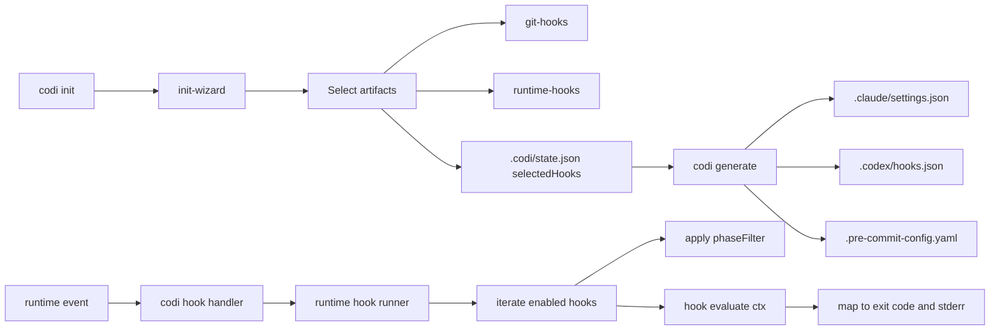

# Hooks as First-Class Artifacts

- **Date**: 2026-05-10 01:50
- **Document**: 20260510*015036*[ARCHITECTURE]\_hooks-as-artifacts.md
- **Category**: ARCHITECTURE

## Summary

Codi hooks are now first-class artifacts on equal footing with rules, skills, and agents. Two clean buckets cover every hook in the system: `git` (pre-commit / pre-push / commit-msg) and `runtime` (UserPromptSubmit / PreToolUse / PostToolUse / Stop / InstructionsLoaded / SessionStart). A single typed registry, a CLI surface (`codi hooks list/add/remove`), and an init-wizard step replace the previous split between auto-detected pre-commit hooks and hardcoded runtime hooks.

The first concrete delivery is the `security-reminder` runtime hook, a clean-room reimplementation of the public Anthropic `security-guidance` PreToolUse pattern set with codi-native optimisations.

## Decisions

### Two buckets, no third

Earlier drafts proposed a separate "advisor" category for runtime checks. We rejected that. Every hook in codi already fits in one of two buckets:

| Bucket    | Events                                                                            | Examples                                                              |
| --------- | --------------------------------------------------------------------------------- | --------------------------------------------------------------------- |
| `git`     | pre-commit, pre-push, commit-msg                                                  | gitleaks, eslint, prettier, ruff-check                                |
| `runtime` | UserPromptSubmit, PreToolUse, PostToolUse, Stop, InstructionsLoaded, SessionStart | iron-laws-enforcer, security-reminder, capture-markers, skill-tracker |

Adding a third type would have fragmented the model. The `security-reminder` hook is a runtime hook that subscribes to PreToolUse — nothing more.

### Where logic lives

Built-in hook **logic** stays in TypeScript under `src/runtime/hooks/<name>/` (runtime) and `src/core/hooks/registry/<lang>.ts` (git). Hooks are not a 3-layer template artifact like skills — they are executable code that ships with the codi binary. The registry holds typed metadata (`HookArtifact`); the executable logic is referenced by import.

This avoids the drift risk of duplicating active code through `src/templates/` → `.codi/` → `.claude/`. Skills and agents are content for an LLM to read; hooks are functions the runtime calls.

### Additive state, no migrator

`.codi/state.json` gains an optional `selectedHooks` field. Projects without it keep working — the reader fills defaults at the boundary using `getDefaultGitHookNames(languages)` and `getDefaultRuntimeHookNames()`. No schema version bump, no migration step.

### Workflow integration is opt-in

Two optional fields tie a hook to the workflow phase model:

- `phaseFilter?: Phase[]` — hook only fires when the active workflow is in one of these phases.
- `dispatchSkill?: string` — hook delegates to a named skill as an agent-check (uses the existing gate-runner agent-check infra).

Default: both undefined. Existing hooks behave exactly as before.

## Architecture

## Files

| Path                                                       | Role                                                                |
| ---------------------------------------------------------- | ------------------------------------------------------------------- |
| `src/core/hooks/hook-artifact.ts`                          | Discriminated union types for git and runtime hooks                 |
| `src/core/hooks/registry/<lang>.ts` × 16                   | Per-language git hook registries (migrated to `GitHookArtifact`)    |
| `src/core/hooks/registry/runtime/<name>.ts` × 6            | Runtime hook artifacts (5 wrappers + security-reminder)             |
| `src/core/hooks/registry/index.ts`                         | `getAllHooks`, `getGitHooks`, `getRuntimeHooks`, default helpers    |
| `src/runtime/hooks/security-reminder/`                     | The new hook: patterns, filters, state, checker                     |
| `src/runtime/hooks/runner.ts`                              | Orchestrator with timeout, fail-open, phaseFilter, dispatchSkill    |
| `src/cli/hooks-list.ts`, `hooks-add.ts`, `hooks-remove.ts` | CLI parity with skills/agents                                       |
| `src/cli/init-wizard.ts`                                   | Two new wizardMultiselect steps for git + runtime hook selection    |
| `src/adapters/claude-code.ts`, `codex.ts`                  | Heartbeat emission gated by `selectedHooks.runtime`                 |
| `src/core/hooks/hook-config-generator.ts`                  | Pre-commit YAML emission gated by `selectedHooks.git`               |
| `src/core/config/state.ts`                                 | Optional `selectedHooks` field + `fillSelectedHooksDefaults` reader |

## security-reminder pattern set

The first runtime hook ships nine patterns covering common injection and unsafe-deserialisation vectors. Each pattern declares a path predicate (e.g. GitHub Actions workflows) or a substring set with a per-pattern extension allowlist (e.g. `pickle` only fires in `.py`).

| ruleId                 | Trigger                              | Allowed extensions                  |
| ---------------------- | ------------------------------------ | ----------------------------------- |
| `gha-injection`        | `.github/workflows/*.{yml,yaml}`     | path-based                          |
| `child-process-exec`   | exec / execSync substrings           | `.js .ts .mjs .cjs .jsx .tsx`       |
| `new-function`         | `new Function(`                      | `.js .ts .mjs .cjs .jsx .tsx`       |
| `eval-call`            | `eval(`                              | `.js .ts .py .rb .php .mjs .cjs`    |
| `dangerously-set-html` | `dangerouslySetInnerHTML`            | `.jsx .tsx`                         |
| `document-write`       | `document.write`                     | `.js .ts .mjs .cjs .html`           |
| `inner-html-assign`    | `.innerHTML =`, `.innerHTML=`        | `.js .ts .mjs .cjs .jsx .tsx .html` |
| `pickle-deserialize`   | `pickle.load`, `pickle.loads`        | `.py`                               |
| `os-system`            | `os.system`, `from os import system` | `.py`                               |

Behaviour:

- Skiplist of non-code extensions (`.md`, `.yaml`, `.json`, `.lock`, `.svg`, …) suppresses substring matches in docs and data files.
- Comment-line heuristic skips lines starting with `//`, `#`, `/*`, `*`, `<!--` to avoid false positives in JSDoc and example blocks.
- Per-session dedupe at `~/.codi/security/state-<sessionId>.json` ensures a given (session, file, rule) triple only blocks once. Subsequent calls return matched=false and proceed silently.
- Exit 2 + stderr is the only way the model receives a `PreToolUse` hook message. The dedupe means the agent reads the reminder once, decides, and proceeds.

## Compatibility

- claude-code adapter: heartbeat scripts (skill-tracker, skill-observer) and matching `.claude/settings.json` entries are gated by `selectedHooks.runtime`. The `codi hook pre-tool-use` dispatch is unchanged — the runner inside it iterates enabled hooks at execution time.
- codex adapter: identical pattern. `.codex/hooks.json` Stop entries skip the observer when not enabled.
- Both adapters are registry-driven and contain zero adapter-specific advisor code.

## Test coverage

3580 tests pass, including:

- 41 unit tests on the registry, types, and 6 runtime hook artifacts
- 18 unit tests on the security-reminder modules (patterns, filters, state, checker)
- 10 unit tests on the runner (aggregation, fail-open, timeout, phaseFilter, dispatchSkill)
- 9 unit tests on the CLI commands
- 4 E2E tests via spawned `node dist/cli.js hook pre-tool-use`

## What remains

Future work in scope:

- Adapter parity tests that snapshot `.claude/settings.json` and `.codex/hooks.json` shape for representative configurations.
- A user-facing GUIDE on opting out of `security-reminder` per-project and on adding custom hooks.
- Wiring `dispatchSkill` to the gate-runner so that runtime hooks can delegate to skills as agent-checks. The field is honoured by the runner today as informational; full delegation lands in a follow-up.
