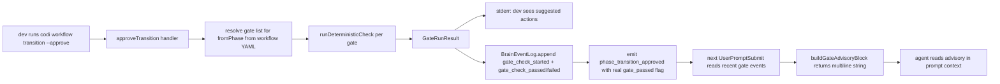

# Workflow Gates + Team Readiness — Pre-Rollout Fix Spec

- **Date**: 2026-05-10 03:28
- **Document**: 20260510*032859*[PLAN]\_workflow-gates-team-readiness.md
- **Category**: PLAN
- **Status**: draft — pending user approval
- **Audit reference**: `docs/20260510_032225_[AUDIT]_workflows-skills-gates-team-readiness.md`
- **Goal**: Ship F-1 + F-2 + F-3 + F-6 in ~4 hours so the codi team can start a guided pilot tomorrow morning

## 1. Summary

Wire three small connections plus one document so the existing workflow / gate / skill machinery becomes actually usable for a team. All four fixes follow the project's established advisory-under-supervision pattern (security-reminder hook + Iron Laws enforcer): the system surfaces verdicts, the developer decides. No hard blocks. No new code paths — just connect the modules that already exist.

## 2. Goals

- F-1 Wire `gate-runner` into `approveTransition` as advisory.
- F-2 Surface gate verdicts to the agent via the next UserPromptSubmit prompt block + to the dev via stderr at CLI time + to brain UI via persisted `gate_check_*` events.
- F-3 Filter `getActiveWorkflowId()` by current `cwd` so `codi workflow status` only shows workflows from the current project.
- F-6 Write `docs/[GUIDE]_workflow-handbook.md` covering decision tree, lifecycle, CLI, gate semantics, supervision contract.

## 3. Non-goals

- Hard-blocking transitions on gate failure (explicitly opposed by user).
- Schema migrations on `workflow_runs` (deferred — F-3 long-term).
- Per-project brain database (deferred — F-3 long-term).
- Skill ↔ workflow `phase_filter` machinery (F-4 deferred).
- Renaming `quality-gates` skill (F-5 deferred).
- Auto-create `docs/CONTEXT.md` stub (F-7 deferred).
- YAML deduplication (F-8 deferred — cosmetic).
- Real `codi update --hooks` flow (F-9 deferred).

## 4. Architecture

### 4.1 Mental model

Today the gate-runner exists as an isolated module called by no production code. The fix routes the existing module through the existing approval path and surfaces results through the existing advisory channel. Nothing new is invented; the wiring is the work.

### 4.2 Convergence map



### 4.3 Patterns reused

| Pattern                    | Source                                               | Used for              |
| -------------------------- | ---------------------------------------------------- | --------------------- |
| Advisory block builder     | `buildIronLawsBlock` in `iron-laws-enforcer.ts`      | F-2 advisory block    |
| Aggregator + exit decision | `aggregateExitDecision` in `runtime/hooks/runner.ts` | F-1 stderr formatting |
| Event append               | `BrainEventLog.append`                               | F-1 persistence       |
| `cwd` shell helper         | `git rev-parse --show-toplevel` (codex adapter)      | F-3 cwd resolution    |

## 5. F-1 — Wire gate-runner into approveTransition

### 5.1 Files

| File                                                               | Change                                                                                                                                                                                        |
| ------------------------------------------------------------------ | --------------------------------------------------------------------------------------------------------------------------------------------------------------------------------------------- |
| `src/runtime/cli-handlers/transitions.ts`                          | Add `runPhaseGates(workflowId, fromPhase, ctx) → GateRunResult`; call from `approveTransition` before emitting `phase_completed`; pass real verdict into `gate_passed`                        |
| `src/runtime/gate-runner-bridge.ts` (new, ≤120 LoC)                | Loads workflow YAML for the active workflow, resolves the gate list for the source phase, runs each gate via `runDeterministicCheck`, persists `gate_check_*` events, returns `GateRunResult` |
| `tests/runtime/cli-handlers/transitions-gate-bridge.test.ts` (new) | Asserts: runs the right gate list per phase; persists events; never throws on failure; advisory return regardless of pass/fail                                                                |

No changes to `gate-runner.ts` itself — that module is already correct. We are adding a thin bridge that loads the workflow YAML, calls the existing checkers, persists the result, and returns to the caller.

### 5.2 Bridge interface

```ts
// src/runtime/gate-runner-bridge.ts
import type { Phase, ManifestEvent, ReducedState } from "./types.js";
import type { GateRunResult } from "./gate-types.js";

export interface BridgeContext {
  cwd: string;
  workflowType: string;
  workflowId: string;
  state: ReducedState;
  events: ManifestEvent[];
  log: BrainEventLog;
}

/**
 * Advisory gate check at phase transition time.
 *
 * Loads the workflow YAML for the current type, resolves the gate list
 * for `fromPhase`, runs each deterministic checker, persists gate_check_*
 * events into the brain, and returns the aggregated result.
 *
 * Always returns a result. Fail-open: any thrown error becomes a
 * `GateRunResult` with `passed: false` and the error message in
 * `next_step`. The transition still completes — gate verdicts are
 * advisory by design.
 */
export function runPhaseGates(fromPhase: Phase, ctx: BridgeContext): GateRunResult;
```

### 5.3 Integration in approveTransition

After the proposal lookup, before emitting `phase_completed`:

```ts
const fromPhase = proposalPayload.from_phase;
const events = log.loadEvents(workflowId);
const state = reduce(events);
const workflowType = state.workflow_type;
const gateResult = runPhaseGates(fromPhase, {
  cwd: process.cwd(),
  workflowType,
  workflowId,
  state,
  events,
  log,
});

// Stderr advisory (dev sees on terminal)
if (!gateResult.passed) {
  process.stderr.write(formatGateAdvisory(gateResult) + "\n");
}

// Phase_completed event with REAL verdict (no longer hardcoded true)
log.append(
  workflowId,
  createEvent({
    eventType: "phase_completed",
    payload: {
      phase: fromPhase,
      duration_ms: computePhaseDuration(state, fromPhase),
      gate_passed: gateResult.passed,
    },
    /* ... */
  }),
);
```

Note: `formatGateAdvisory(result: GateRunResult): string` is a new helper inspired by `aggregateExitDecision` in `runtime/hooks/runner.ts`. The shape is the same (collect lines, prefix per finding) but the input type and output (one string for stderr) differ. Defined inside `gate-runner-bridge.ts`, covered by `gate-runner-bridge.test.ts` (no separate helpers test file).

## 6. F-2 — Advisory block in UserPromptSubmit

### 6.1 Files

| File                                                   | Change                                                                                                                                                                                                                                 |
| ------------------------------------------------------ | -------------------------------------------------------------------------------------------------------------------------------------------------------------------------------------------------------------------------------------- |
| `src/runtime/hook-logic.ts`                            | Add `buildGateAdvisoryBlock(ctx: GateAdvisoryContext): string` that reads the most recent `gate_check_failed` events from the active workflow; emit only when there are unresolved failures since the last `phase_transition_approved` |
| `src/cli/agent-hooks.ts`                               | In `runUserPromptSubmit`, append `buildGateAdvisoryBlock` to the existing `out` array next to `buildIronLawsBlock`                                                                                                                     |
| `tests/runtime/hook-logic-gate-advisory.test.ts` (new) | Asserts the block format, dedupe-after-approval semantics, empty string when no failures                                                                                                                                               |

### 6.2 Block schema

```
<gate-advisory>
Phase transition reminder — these gates failed in the last approved transition. They are advisory; the developer decided to proceed.

[plan_artifact_exists] No plan markdown found.
  → Write the plan at docs/YYYYMMDD_HHMMSS_[PLAN]_<slug>.md following the categorized doc convention.

[scope_files_listed] scope.files_in_plan is empty.
  → Use `codi workflow scope propose-expansion --file <path> --reason '<text>'` for each file the plan modifies, then approve.
</gate-advisory>
```

Same shape as the existing `<pull-reminder>` block emitted by `buildIronLawsBlock`. Suppressed when:

- no active workflow,
- no `gate_check_failed` events since the most recent `phase_transition_approved`.

The block fires on every `UserPromptSubmit` until a fresh `phase_transition_approved` clears it. Dev / agent read each turn, decide each turn.

## 7. F-3 — cwd filter on workflow visibility

### 7.1 Files

| File                                                     | Change                                                                                                                                                                                                                                                   |
| -------------------------------------------------------- | -------------------------------------------------------------------------------------------------------------------------------------------------------------------------------------------------------------------------------------------------------- |
| `src/runtime/brain-event-log.ts`                         | In `getActiveWorkflowId()`, filter out workflows whose first `init` event payload `cwd` does not match `process.cwd()`. Resolve both via `path.resolve` for canonical comparison. Fall through to "no active workflow" instead of returning a foreign id |
| `src/runtime/cli-handlers.ts`                            | Document the change in JSDoc; no behavioural change beyond what the brain log returns                                                                                                                                                                    |
| `tests/runtime/brain-event-log-cwd-filter.test.ts` (new) | Asserts: workflow from same cwd is returned; workflow from different cwd is filtered; subdir of project root counts as same cwd via `git rev-parse --show-toplevel` resolution                                                                           |

### 7.2 Filter logic

```ts
// inside getActiveWorkflowId()
const activeRow = /* current query */;
if (!activeRow) return null;
const initEvent = this.loadEvents(activeRow.workflow_id).find((e) => e.event_type === "init");
const initCwd = (initEvent?.payload as { cwd?: string } | undefined)?.cwd;
if (!initCwd) return activeRow.workflow_id; // back-compat for old workflows without cwd in payload
const currentRoot = resolveProjectRoot(process.cwd());
const initRoot = resolveProjectRoot(initCwd);
return currentRoot === initRoot ? activeRow.workflow_id : null;
```

`resolveProjectRoot(cwd)` runs `git rev-parse --show-toplevel` from `cwd` and falls back to `cwd` itself when not in a git repo. This handles dev navigating into a subdirectory of the same project.

Back-compat: workflows that predate this change (no `cwd` in their init payload) are still returned — the filter is opt-in based on data presence. New workflows initialised after the fix include `cwd` in payload.

### 7.3 init event payload

`workflow_init` already includes `cwd` in payload according to the gate-runner test fixtures. Verify in implementation; if missing, add to `runWorkflow` handler in `cli-handlers/run.ts`.

## 8. F-6 — Team handbook

### 8.1 File

`docs/<timestamp>_[GUIDE]_workflow-handbook.md`

### 8.2 Outline

| §   | Title                              | Content shape                                                                                                                                                                                            |
| --- | ---------------------------------- | -------------------------------------------------------------------------------------------------------------------------------------------------------------------------------------------------------- |
| 1   | When to use codi (decision tree)   | Mermaid: question → workflow archetype. 5 archetypes (feature / bug-fix / refactor / migration / project)                                                                                                |
| 2   | Workflow lifecycle                 | Mermaid per archetype showing phases + gates that fire on each transition. One pager per archetype is overkill — one combined diagram with conditional notes                                             |
| 3   | CLI cheatsheet                     | Table: command → effect → typical phase. `run`, `transition --to/--approve/--reject`, `scope propose/approve/reject`, `abandon`, `recover`, `status`, `handover`, `stats`                                |
| 4   | Gates as advisories                | The 6 deterministic gates. Each: id, what it checks, when it fires, what the suggested action looks like, what the dev should do when it fails                                                           |
| 5   | Brain visibility                   | "Per-user global, scoped to current cwd. If `status` says no active workflow but you started one in another folder, cd to that folder. To see all workflows on this machine, use `codi workflow stats`." |
| 6   | Iron Laws (4–8) one-paragraph each | Hard gates, pull-before-patch, no commit without approval, output mode, capture-everything                                                                                                               |
| 7   | Common pitfalls                    | "no active workflow", "another workflow already active", "CONTEXT.md missing", "gate advisory keeps appearing", "I want to abandon and start over"                                                       |
| 8   | Supervision contract               | Two-paragraph definition: dev reviews advisories on each `--approve`, dev decides whether to act on the suggested action, codi never blocks but always informs                                           |

Total length target: 350–500 lines. Includes the four mermaid diagrams. No code blocks longer than 12 lines.

## 9. Test plan

| Layer              | Test                                                                                                                                  | Target                                 |
| ------------------ | ------------------------------------------------------------------------------------------------------------------------------------- | -------------------------------------- |
| Unit               | `runPhaseGates` returns advisory result, never throws on bad input                                                                    | bridge.test.ts                         |
| Unit               | `formatGateAdvisory` produces expected stderr text                                                                                    | folded into gate-runner-bridge.test.ts |
| Unit               | `buildGateAdvisoryBlock` returns empty when no failures, formatted block when failures present                                        | hook-logic-gate-advisory.test.ts       |
| Unit               | cwd filter returns null for foreign workflow, id for same-project workflow                                                            | brain-event-log-cwd-filter.test.ts     |
| Integration        | full transition with intent → plan: `task_described` runs and emits `gate_check_passed` event                                         | transitions-gate-bridge.test.ts        |
| Integration        | full transition with plan → decompose: `scope_files_listed` + `plan_artifact_exists` fail → events emitted, transition still approves | same                                   |
| E2E (manual smoke) | scratch project: run feature, verify stderr advisory at every transition, verify next-turn UserPromptSubmit shows block               | hands-on                               |

## 10. Rollout

| Step | Action                                                              | Outcome                           |
| ---- | ------------------------------------------------------------------- | --------------------------------- |
| 1    | Implement F-1 (bridge + integration + tests)                        | gate-runner reachable             |
| 2    | Implement F-2 (advisory block + wiring + tests)                     | agent gets verdicts in next turn  |
| 3    | Implement F-3 (cwd filter + tests)                                  | status only shows current project |
| 4    | Build + full test suite green                                       | no regressions                    |
| 5    | Manual smoke: scratch project full lifecycle                        | gates fire at every transition    |
| 6    | Write F-6 handbook                                                  | dev self-serve                    |
| 7    | Commit (single atomic commit at end of session per user preference) | 1 commit                          |
| 8    | Onboarding pair-mode demo with one dev                              | rollout sanity check              |

Total est. 3.5–4 hours implementation + ~1h handbook.

## 11. Risk register

| #   | Risk                                                                                                                          | Mitigation                                                                                                                                  |
| --- | ----------------------------------------------------------------------------------------------------------------------------- | ------------------------------------------------------------------------------------------------------------------------------------------- |
| 1   | Gate-runner has a bug exposed by first real run                                                                               | Bridge wraps every checker call in try/catch and degrades to `verdict: "fail"` with the error message in summary; transition still approves |
| 2   | `validation_passes` checker requires a `validation_run` event the dev never wrote → noisy advisory on every verify transition | The handbook §7 explicitly tells the dev to run `pnpm test` and append the event; the advisory is informative not noise                     |
| 3   | cwd filter accidentally hides the user's own active workflow                                                                  | Back-compat fallback (no cwd in init payload returns id anyway); verified by test                                                           |
| 4   | `gate_check_*` event spam on every transition                                                                                 | Bounded — at most 6 events per transition × 5 transitions = 30 events per workflow run                                                      |
| 5   | Handbook drifts as gate set evolves                                                                                           | The handbook references the gate ids by name; doc reviewer subagent dispatched on every relevant PR                                         |
| 6   | Team gets confused by per-user global brain                                                                                   | Handbook §5 explains it explicitly; cwd filter masks the cross-project case                                                                 |

## 12. Atomic tasks for codi-plan-writer

### Task A — F-1.bridge

- Create `src/runtime/gate-runner-bridge.ts` with `runPhaseGates` + `formatGateAdvisory` + workflow-YAML loader.
- Create `tests/runtime/gate-runner-bridge.test.ts` covering happy path, throw-safe path, persistence.
- Verify: `pnpm test tests/runtime/gate-runner-bridge.test.ts` green.

### Task B — F-1.wire

- Modify `src/runtime/cli-handlers/transitions.ts` `approveTransition`: call `runPhaseGates`, emit stderr advisory, replace hardcoded `gate_passed: true` with the real verdict.
- Add tests in `tests/runtime/cli-handlers/transitions-gate-bridge.test.ts`.
- Verify: existing transitions tests still green; new tests green.

### Task C — F-2.block

- Add `buildGateAdvisoryBlock` to `src/runtime/hook-logic.ts` reading recent `gate_check_failed` events.
- Wire it in `src/cli/agent-hooks.ts` `runUserPromptSubmit` next to `buildIronLawsBlock`.
- Add `tests/runtime/hook-logic-gate-advisory.test.ts`.
- Verify: full hook-logic tests green; manual smoke shows block on stdout.

### Task D — F-3.cwd

- **D.1 Verify init event payload**: grep `cli-handlers/run.ts` (or sibling) for the `init` event creation; confirm payload includes `cwd: string`. If missing, add it (`cwd: process.cwd()`).
- **D.2 Modify `getActiveWorkflowId`**: implement the cwd-filter logic from §7.2 in `src/runtime/brain-event-log.ts`. Include the `resolveProjectRoot` helper that runs `git rev-parse --show-toplevel` with a `cwd` fallback.
- **D.3 Tests**: add `tests/runtime/brain-event-log-cwd-filter.test.ts` covering: same-cwd returns id, foreign-cwd returns null, subdir of project root returns id, missing-cwd-in-payload returns id (back-compat).
- Verify: existing brain-event-log tests green; new cwd test green.

### Task E — F-6.handbook

- Write `docs/<timestamp>_[GUIDE]_workflow-handbook.md` per §8.2 outline.
- Run `/validate-docs` to confirm naming.

### Task F — full smoke

- Scratch project + run a feature workflow + observe gate output and advisory block + verify dedupe after approval.

### Task G — single atomic commit (per CLAUDE.md commit policy)

- After all green: stage F-1 + F-2 + F-3 files + F-6 handbook + tests + CHANGELOG entry.
- Conventional commit: `feat(workflow): wire gate-runner advisory + cwd filter + team handbook`.

## 13. Open questions

None at present. All four design decisions (Q1 approve-time, Q2 stderr+persist+block, Q3 cwd-filter, Q4 condensed handbook) confirmed during brainstorm.

## 14. Approval gate

This spec must be reviewed and explicitly approved before any task begins. Once approved, the next step is to invoke `codi-plan-writer` with this document as input. `codi-plan-writer` will produce `docs/<timestamp>_[PLAN]_workflow-gates-team-readiness-impl.md` containing per-task code snippets and verification commands.
