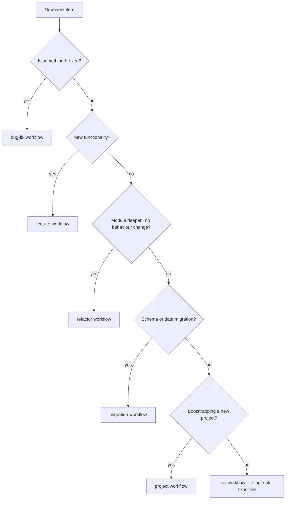
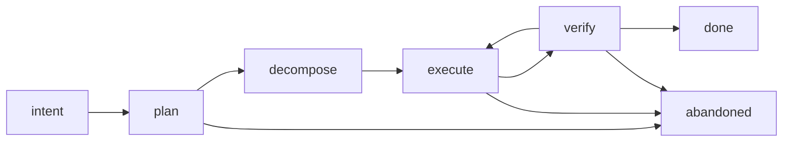

# Codi Workflow Handbook

- **Date**: 2026-05-10 08:30
- **Document**: 20260510*083019*[GUIDE]\_workflow-handbook.md
- **Category**: GUIDE
- **Audience**: developers using codi inside a team

This handbook is for the developer who has just installed codi and wants to start their first workflow today. It covers the decision tree, the lifecycle, the CLI cheatsheet, gate semantics, brain visibility, the Iron Laws, common pitfalls, and the supervision contract.

## When to use codi

## Lifecycle

Every workflow is a phase graph. The phases differ per archetype but the rules are the same.

| Phase       | What happens                                             | Gates that fire on transition out                                                  |
| ----------- | -------------------------------------------------------- | ---------------------------------------------------------------------------------- |
| `intent`    | State the task.                                          | `task_described`                                                                   |
| `plan`      | List scope files, write the plan markdown.               | `scope_files_listed`, `plan_artifact_exists`                                       |
| `decompose` | Break the plan into tasks.                               | (none — informational)                                                             |
| `execute`   | Implementation work.                                     | (none — informational)                                                             |
| `verify`    | Run validation; confirm planned files moved.             | `validation_passes`, `no_unresolved_scope_proposals`, `all_planned_files_modified` |
| `done`      | Terminal — workflow complete.                            | (none)                                                                             |
| `abandoned` | Terminal — workflow recorded as abandoned with a reason. | (none)                                                                             |

## CLI cheatsheet

| Command                                                       | Effect                                                            | Typical phase  |
| ------------------------------------------------------------- | ----------------------------------------------------------------- | -------------- |
| `codi workflow run <type> "<task>"`                           | Start a new workflow                                              | beginning      |
| `codi workflow status`                                        | Show the active workflow's reduced state for the current project  | any            |
| `codi workflow transition --to <phase>`                       | Propose a phase transition                                        | any            |
| `codi workflow transition --approve`                          | Approve the pending transition (gates fire here)                  | any            |
| `codi workflow transition --reject --reason "<text>"`         | Reject the pending transition                                     | any            |
| `codi workflow scope propose --file <path> --reason "<text>"` | Propose adding a file to scope                                    | plan / execute |
| `codi workflow scope approve [--file <path>]`                 | Approve a scope proposal                                          | plan / execute |
| `codi workflow scope reject --file <path> --reason "<text>"`  | Reject a scope proposal                                           | plan / execute |
| `codi workflow abandon --reason "<text>"`                     | End the workflow without success                                  | any            |
| `codi workflow recover`                                       | Restore the active pointer to the most recent non-terminal run    | rare           |
| `codi workflow handover --to <agent>`                         | Hand the workflow to another developer                            | any            |
| `codi workflow stats`                                         | Aggregate stats across all runs (durations, tokens, gate retries) | review         |

## Gates as advisories

Codi runs deterministic gate checks at every phase transition. The gates are advisory: codi never blocks — it surfaces verdicts to the developer, who decides whether to act on them. The verdict reaches you in three places:

- **At `transition --approve`** time, on stderr. `[codi gate-advisory]` followed by per-gate failure summaries with `→ suggested action` lines.
- **In the next `UserPromptSubmit`** as a `<gate-advisory>` block until the next approval clears it.
- **In the brain UI** as `gate_check_started` + `gate_check_passed` / `gate_check_failed` events on the workflow timeline.

The six built-in gates:

| Gate id                         | What it checks                                                    | Suggested action when it fails                                                                                   |
| ------------------------------- | ----------------------------------------------------------------- | ---------------------------------------------------------------------------------------------------------------- |
| `task_described`                | reduced state has a non-empty task                                | set the task at `workflow run` time                                                                              |
| `scope_files_listed`            | scope.files_in_plan length ≥ 1                                    | run `codi workflow scope propose --file <path> --reason "<why>"` and approve                                     |
| `plan_artifact_exists`          | docs/ contains a `YYYYMMDD_HHMMSS_[PLAN]_*.md` file               | write the plan markdown using the codi categorized doc convention                                                |
| `no_unresolved_scope_proposals` | every `scope_expansion_proposed` has a matching approve/reject    | resolve each pending proposal via `codi workflow scope approve` / `codi workflow scope reject --reason "<text>"` |
| `validation_passes`             | latest `validation_run` event has `exit_code === 0`               | run your validation (`pnpm test`, `pytest`, etc.) and append the result event                                    |
| `all_planned_files_modified`    | every file in scope has a non-empty `git status --porcelain` line | edit each planned file or remove it from scope                                                                   |

## Brain visibility

Codi's brain is per-user, machine-global at `~/.codi/brain.db`. `codi workflow status` is filtered by your current `cwd` so you only see workflows from the current project. If a workflow is missing from `status`, you started it in a different folder — `cd` there.

`codi workflow stats` ignores the cwd filter and reports across all your projects.

## Iron Laws (4–9) in one paragraph each

- **Iron Law 4 — Hard gates need 'ok'.** Phase transitions are pending until the developer types the literal "ok" (case-insensitive). "looks good", "yeah", "sure" do not pass.
- **Iron Law 5 — Pull before patch.** When the brain state is older than 60 seconds before a mutating Edit / Write tool call, codi emits a pull-reminder in the next prompt block. Refresh by reading the brain (any `codi workflow status` call counts).
- **Iron Law 7 — No commit without approval.** `git commit / push / tag / merge / reset --hard / branch -D / push --force` are blocked unless a recent prompt contains the literal `ok` (case-insensitive, exactly the two characters). The verb itself, "looks good", "yeah", "sure" do NOT pass — codi has unified Iron Law 4 and 7 around the single `ok` token.
- **Iron Law 8 — Output mode honours the project preference.** The default is caveman. Type `?` for the current turn only to opt into the verbose mode. Override per project in `.codi/preferences.json`.
- **Iron Law 9 — Capture everything.** The agent emits `|TYPE: "..."|` markers at the end of any response that detected a canonical capture type. False positives are not tolerated; the brain consolidator deduplicates.

## Common pitfalls

| Symptom                                           | Likely cause                                                           | Fix                                                                                                         |
| ------------------------------------------------- | ---------------------------------------------------------------------- | ----------------------------------------------------------------------------------------------------------- |
| "Knowledge base missing: docs/CONTEXT.md"         | first workflow run on a fresh project                                  | create `docs/CONTEXT.md` with project domain glossary and rerun                                             |
| "Another workflow is already active"              | a workflow from a previous session is still running                    | `codi workflow status` to see which; either continue it or `codi workflow abandon --reason "..."`           |
| `<gate-advisory>` keeps appearing every prompt    | failed gate has not been resolved since last approval                  | act on the suggested action, then transition through the next phase                                         |
| "git mutation requires explicit approval"         | Iron Law 7                                                             | type `ok` (case-insensitive, exactly two chars) in your next prompt                                         |
| Status says no active workflow but I just ran one | you `cd`d to a different folder, or the workflow was started elsewhere | `cd` back to the project root                                                                               |
| `validation_passes` always fails                  | no `validation_run` event has been recorded                            | run your test suite; the next phase transition will pick it up automatically once the event is in the brain |

## Supervision contract

Codi is a recommendation engine. It never blocks. At every `transition --approve`, the developer is the source of truth: the gates surface findings; the developer decides whether to proceed. The role of the dev is:

1. Read the gate advisory at every approve.
2. Decide whether the suggested action is worth doing now or deferring.
3. Track open advisories — every block that keeps appearing is a deferred decision.

The role of codi is to make the right action visible. The role of the dev is to make the right call.

## Onboarding flow for a new dev

1. Install codi: `npm install -g codi-cli` (or pnpm/yarn equivalent).
2. From the project root: `codi init` — pick artefacts, languages, agents, hooks.
3. Verify: `codi list` shows the manifest; `codi workflow stats` shows zero runs.
4. Create `docs/CONTEXT.md` with at least a Domain section and a Glossary.
5. Run your first workflow: `codi workflow run feature "Add X"`.
6. Walk through the phases with `transition --to <phase>` + `transition --approve`.
7. Read every `[codi gate-advisory]` and every `<gate-advisory>` block. Decide. Move on.
8. End-of-day: `codi workflow stats` — review what you ran, durations, gate retries.

## Where to look when something feels off

| Question                                     | Where                                                                                      |
| -------------------------------------------- | ------------------------------------------------------------------------------------------ |
| What workflows have I run today?             | `codi workflow stats`                                                                      |
| What is the active workflow's reduced state? | `codi workflow status`                                                                     |
| What event triggered this advisory?          | `codi brain-ui` (or read the JSONL event log directly)                                     |
| Why is a gate failing?                       | the gate's `suggested_action` field tells you. The handbook §4 maps each gate to its check |
| Why am I getting Iron Law 7 blocks?          | look at recent prompts — codi needs you to type the literal `ok` (case-insensitive)        |
| How do I opt out of a hook?                  | `codi hooks remove runtime <name>` (requires the hook is not `required: true`)             |
