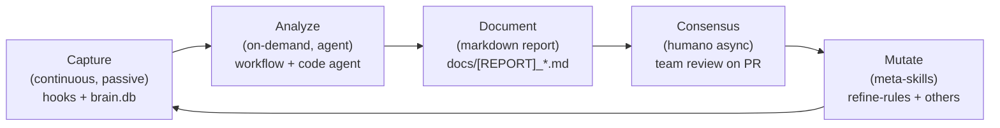

# Team Consolidation Workflow — Design Spec

- **Date**: 2026-05-10 19:58
- **Document**: 20260510*195829*[PLAN]\_team-consolidation-workflow.md
- **Category**: PLAN
- **Status**: Design approved via grill-me; pending implementation breakdown

## Overview

A new Codi workflow `team-consolidation` that lets a designated dev (the "lead") collect brain DBs from the whole team, drive an analysis with the code agent, produce a consensus-candidate markdown report, and after async team consensus, trigger existing meta-skills to mutate artifacts based on the agreed findings. Iterates the brain loop with the team as the protagonist.

This work also retires the legacy auto-detection pipeline (P1-P9 detectors + proposals table + brain export + LLM provider) which is replaced entirely by this agent-driven flow.

## Problem statement

A team using Codi accumulates rich captured context in each dev's local `brain.db`. There is currently no clean way for that knowledge to consolidate across devs and feed back into the team's own artifacts (rules, skills, agents) or into Codi's upstream artifacts. The existing auto-detection pipeline (`runConsolidation` runner with hard-coded P1-P9 detectors) writes to a `proposals` table that nobody consumes downstream — its export JSON is orphan. Everything happens in a vacuum.

The new workflow makes the loop explicit, dev-driven, and document-based.

## Universal brain loop (the principle this workflow implements)



Every layer is thin, single-purpose, and composable. No layer reinvents another layer's responsibility.

## Decisions log (resolved via grill-me session)

| #   | Decision                  | Outcome                                                                                                                                                                                                                                                                                        |
| --- | ------------------------- | ---------------------------------------------------------------------------------------------------------------------------------------------------------------------------------------------------------------------------------------------------------------------------------------------- |
| Q1  | Audience                  | BOTH consumer projects and Codi self-dev. Workflow detects context (cwd is repo Codi vs other) and routes target dir accordingly                                                                                                                                                               |
| Q2  | DB layout convention      | `team-brains/<dev>/<repo>.db` nested. dev_id from dirname, project_id from DB                                                                                                                                                                                                                  |
| Q3  | Analysis mechanism        | Agent-driven SQL via `sqlite3` Bash tool. No new framework code. No P1-P9 reuse                                                                                                                                                                                                                |
| Q4  | Cross-dev aggregation     | Agent does dedup/ranking in its context using LLM cognition                                                                                                                                                                                                                                    |
| Q5  | Concurrency               | Both modes available. Dev chooses at `intent` phase: sequential (one agent reads all DBs) or parallel (one sub-agent per dev folder via Agent tool, padre aggregates)                                                                                                                          |
| Q6  | Persistence               | Markdown report at `docs/YYYYMMDD_HHMMSS_[REPORT]_team-consolidation.md`. No JSON sidecar, no SQLite write-back                                                                                                                                                                                |
| Q7  | Domain vs meta findings   | One workflow run produces ONE report with two sections (Domain + Meta-pipeline). No two-phase improve loop — workflow does NOT mutate artifacts                                                                                                                                                |
| Q8  | Approval inside workflow  | None. Workflow stops at "report written". Consensus is async and external                                                                                                                                                                                                                      |
| Q9  | Retire scope              | Drop entire `consolidate/` runner + P1-P9 + LLM enrichment + proposals table + `/proposals` UI + `brain export` cmd + orphaned `runtime/llm/` provider. Capture pipeline (hooks, schema except proposals, ingest-memory, IronLaw9, capture-everything rule, improvement-dev rule) stays intact |
| Q10 | Meta-skill input source   | Each meta-skill reads the .md directly when invoked (post-consensus). No JSON intermediary                                                                                                                                                                                                     |
| Q11 | Meta-skill changes        | Hybrid: only `refine-rules` and `artifact-contributor` extended. Other meta-skills (rule-creator/skill-creator/agent-creator/compare-preset) unchanged — invoked manually for edge cases                                                                                                       |
| Q12 | Privacy / scrubbing       | None. Agent reads any table it needs. Dev controls what's in their brain.db before contributing it. Disclaimer note in report                                                                                                                                                                  |
| Q13 | Report contract formality | Free-form markdown. Agent intelligence parses it. No zod schema, no parser, no formal contract                                                                                                                                                                                                 |

## Workflow definition

`src/templates/workflows/team-consolidation.yaml`

```yaml
id: team-consolidation
name: Team Consolidation
description: Cross-dev brain analysis producing a consensus-candidate report for iterative artifact improvement
version: 1
phases:
  intent:
    gates: [scope_described, mode_chosen, brains_path_known]
    next: [collect, abandoned]
    chains: []
  collect:
    gates: [brains_listed, dev_layout_validated]
    next: [analyze, abandoned]
    chains: []
  analyze:
    gates: [per_dev_findings_done]
    next: [consolidate, abandoned]
    chains: []
  consolidate:
    gates: [report_written]
    next: [done, abandoned]
    chains: []
  done:
    gates: []
    next: []
  abandoned:
    gates: []
    next: []
flags:
  agent_driven: true
  produces_document: true
```

## Per-phase responsibilities (companion skill `team-consolidation-workflow`)

### Phase 1 — `intent`

Agent asks the user:

- Where is the team-brains directory? (no convention default — explicit)
- Sequential or parallel mode?
- Scope of analysis (all brains in dir, or filter to a subset)?

Sets gates `scope_described`, `mode_chosen`, `brains_path_known`.

### Phase 2 — `collect`

Agent runs:

- `glob "<path>/*/*.db"` to list candidate brains
- For each: `sqlite3 <path> "SELECT version FROM _codi_schema_version LIMIT 1"` validates it's a Codi brain
- Drops invalid files with warning
- Lists final inventory: `(dev_id=dirname, db_path, project_count)`

Sets gates `brains_listed`, `dev_layout_validated`.

### Phase 3 — `analyze`

Agent reads each DB read-only. Schema reference (full) is in `references/schema-reference.md` of the skill — no allowlist, no forbidden tables, agent reads what it needs.

Sequential mode: agent reads all DBs in its own context, takes structured notes per dev/project.

Parallel mode: padre dispatches one sub-agent per `<dev>/` folder via the `Agent` tool (foreground, run in parallel). Each sub-agent returns a structured markdown summary. Padre aggregates.

Per-dev findings include:

- Recurring capture themes (RULE/PROHIBITION/PREFERENCE/CORRECTION)
- Skill/agent firing rates and outcomes (`artifacts_used`)
- Workflow stuck phases or anomalies (`workflow_runs`)
- Corrections frequency (`corrections`)
- OBSERVATION captures naming Codi artifacts (meta signal)

Sets gate `per_dev_findings_done`.

### Phase 4 — `consolidate`

Agent cross-references per-dev findings, identifies cross-cutting patterns, ranks by `vote_count` (DISTINCT devs proposing same thing), separates into:

- **Domain section**: knowledge about the team's product
- **Meta-pipeline section**: gaps in Codi infrastructure as observed during the analyzed sessions

Writes `docs/YYYYMMDD_HHMMSS_[REPORT]_team-consolidation.md`.

Sets gate `report_written`.

### Phase 5 — `done`

Workflow ends. Lead receives instructions in chat:

> Report written at <path>. Share with team for async consensus review. After consensus, invoke `/codi-refine-rules <path>` for rule mutations or `/codi-artifact-contributor <path>` for upstream candidates.

## Report shape (illustrative — NOT a formal contract)

```markdown
# Team Consolidation Report

- Date: 2026-05-10 14:23
- Devs analyzed: 3 (alice, bob, carol)
- Brains scanned: 4 (across 4 projects)
- Mode: sequential | parallel
- Brains directory: <absolute path>

## How to use this report

1. Team reviews this document async (PR comments / Slack / live meeting)
2. Mark each finding APPROVED / REJECTED / DEFERRED with [x]
3. After consensus, invoke meta-skills:
   - Domain rule edits/creates → /codi-refine-rules <this-report-path>
   - Upstream contributions → /codi-artifact-contributor <this-report-path>
   - Edge cases (new skill / new agent) → invoke manually

> Privacy notice: this report may include verbatim content from captures, prompts, and tool calls of the contributed brain.dbs. Pre-filter your brain.db before contributing if you want to omit something.

## Domain findings

### D-1 — Money handling (votes: 3)

Pattern: All monetary values handled as BigDecimal/Decimal across team.

Evidence:

- alice (capture 234, fintech-api): "todos los montos en BigDecimal"
- bob (capture 567, fintech-frontend): "no float para precios"
- carol (capture 891, fintech-pipelines): "Decimal en pricing"

Proposed action: create rule `.codi/rules/fintech-money-handling.md`
Target meta-skill: refine-rules (modo REPORT)

Consensus:

- [ ] APPROVED
- [ ] REJECTED
- [ ] DEFERRED

(repeat for D-2, D-3, ...)

## Meta-pipeline findings

### M-1 — codi-commit trigger miss (votes: 3)

Pattern: skill `codi-commit` did not fire when devs typed literal `/commit`.

Evidence: 6 occurrences across 3 devs (capture_ids ...)

Proposed action: add explicit `/commit` literal to triggers in `src/templates/skills/commit/template.ts`
Target meta-skill: artifact-contributor (upstream PR candidate)

Consensus:

- [ ] APPROVED
- [ ] REJECTED
- [ ] DEFERRED

(repeat for M-2, M-3, ...)

## Singletons (vote_count = 1, informational only)

- ...

## Artifact usage stats (cross-team aggregate)

| artifact    | total_uses | unique_devs | error_rate | avg_duration_ms |
| ----------- | ---------- | ----------- | ---------- | --------------- |
| codi-commit | 47         | 3           | 12%        | 230             |
| ...         | ...        | ...         | ...        | ...             |

## Decisions log (filled by team during review)

- [ ] D-1 — APPROVED by alice (14:30), bob (14:35), carol (14:40)
- [ ] D-2 — DEFERRED by alice — needs more discussion
- [ ] M-1 — APPROVED by alice and carol; bob abstain
```

## Meta-skill changes

| Skill                  | Change                                                                                                                                                                                                                                                                                               | Approx LoC   |
| ---------------------- | ---------------------------------------------------------------------------------------------------------------------------------------------------------------------------------------------------------------------------------------------------------------------------------------------------- | ------------ |
| `refine-rules`         | Add `## Mode: REPORT-DRIVEN` section to SKILL.md. Step list: read .md → identify items in scope with consensus APPROVED → for each, build internal feedback structure → run existing REFINE pipeline. If unclear about an item, agent may also query the brain DBs at the path in the report header. | ~80 markdown |
| `artifact-contributor` | Add `## Mode: REPORT-DRIVEN` section. Filter for items where consensus is APPROVED and the action is meta-pipeline upstream. For each: open PR to `github.com/lehidalgo/codi`.                                                                                                                       | ~50 markdown |
| Other 4 meta-skills    | No changes. Manually invoked when needed                                                                                                                                                                                                                                                             | 0            |

Bump `version:` in template frontmatter for both modified skills.

## Retire scope (companion change)

Files / pieces deleted in this work:

| Path                                                                                            | Reason                                                                                                                               |
| ----------------------------------------------------------------------------------------------- | ------------------------------------------------------------------------------------------------------------------------------------ |
| `src/runtime/consolidate/` (entire dir: runner, patterns, prompts, repo, package, types, index) | Legacy auto-detection pipeline replaced by agent-driven workflow                                                                     |
| `src/templates/consolidation/p1..p9.md.tmpl`                                                    | LLM prompt templates for the runner                                                                                                  |
| `src/runtime/llm/` (entire dir: gemini, provider, registry)                                     | Only consumer was consolidate runner. Verified: only `routes-api.ts` imports it, exclusively for `/api/v1/consolidation/*` endpoints |
| `proposals` table in `src/runtime/brain/schema.ts`                                              | Storage of the runner's output                                                                                                       |
| `src/runtime/brain-ui/pages/proposals.ts`                                                       | UI of the runner                                                                                                                     |
| `/api/v1/consolidation/*` endpoints in `src/runtime/brain-ui/routes-api.ts`                     | Server-side runner invocation paths                                                                                                  |
| `brainExportHandler` + `brain export` registration in `src/cli/brain.ts`                        | Generated consolidation packages — no consumer                                                                                       |
| Tests for all the above                                                                         | Suite of the deleted pipeline                                                                                                        |

Migration:

- New schema migration that DROPs `proposals` table (idempotent)
- `codi brain export` command prints a deprecation note + exits 0 with hint pointing to `/codi-team-consolidation` workflow (one release before removal); next release removes from CLI registry
- `/proposals` UI route returns 410 Gone with message
- CHANGELOG entry documenting the migration

Estimated removal: ~3300 LoC.

## What stays intact (no touch)

Capture pipeline:

- All hooks (Stop, prompt, tool)
- Brain DB schema (everything except proposals table)
- Brain UI pages: dashboard / sessions / captures / workflows / artifacts / settings
- SSE live updates
- Iron Law 9 marker grammar
- Rule `codi-capture-everything`
- Rule `codi-improvement-dev`
- `codi brain ui` command
- `codi brain ingest-memory` command
- All meta-skills (4 of 6 with no changes)
- All work-driving workflows (feature, bug-fix, refactor, migration, project)

## Implementation work breakdown

| Component                                                         | Type   | Approx LoC       | File(s)                                                                           |
| ----------------------------------------------------------------- | ------ | ---------------- | --------------------------------------------------------------------------------- |
| Workflow YAML                                                     | new    | ~50              | `src/templates/workflows/team-consolidation.yaml`                                 |
| Companion skill template                                          | new    | ~150             | `src/templates/skills/team-consolidation-workflow/template.ts` + `index.ts`       |
| Phase docs (intent/collect/analyze/consolidate)                   | new    | ~150 each = ~600 | `src/templates/skills/team-consolidation-workflow/references/phase-*.md`          |
| Brain schema reference for agent                                  | new    | ~200             | `src/templates/skills/team-consolidation-workflow/references/schema-reference.md` |
| WORKFLOW_TYPES enum entry                                         | edit   | 1                | `src/runtime/types.ts`                                                            |
| Workflow definition seed                                          | edit   | ~20              | `src/runtime/brain/seed-workflows.ts`                                             |
| Refine-rules SKILL.md `Mode: REPORT-DRIVEN`                       | edit   | ~80              | `src/templates/skills/refine-rules/template.ts`                                   |
| Artifact-contributor SKILL.md `Mode: REPORT-DRIVEN`               | edit   | ~50              | `src/templates/skills/artifact-contributor/template.ts`                           |
| Tests workflow loading + phase transitions                        | new    | ~200             | `tests/runtime/workflow-team-consolidation.test.ts`                               |
| Skill evals for team-consolidation-workflow                       | new    | ~150             | `src/templates/skills/team-consolidation-workflow/evals/`                         |
| Drop `consolidate/` + `runtime/llm/` + `consolidation/` templates | delete | -3300            | (above)                                                                           |
| Schema migration drop proposals                                   | new    | ~30              | `src/runtime/brain/migrate.ts` + new migration file                               |
| Deprecation message in `brain export`                             | edit   | ~20              | `src/cli/brain.ts`                                                                |
| Removal of `/proposals` UI page + 410 route                       | edit   | ~10              | `src/runtime/brain-ui/pages.ts` + routes                                          |
| Removal of `/api/v1/consolidation/*` endpoints                    | edit   | ~30              | `src/runtime/brain-ui/routes-api.ts`                                              |
| CHANGELOG entry                                                   | new    | ~30              | `CHANGELOG.md`                                                                    |

Net change estimate:

- New code: ~1500 LoC
- Removed code: ~3300 LoC
- **Net delta: -1800 LoC** (codebase shrinks)

## Risks and mitigations

| Risk                                                                                       | Mitigation                                                                                                                                           |
| ------------------------------------------------------------------------------------------ | ---------------------------------------------------------------------------------------------------------------------------------------------------- |
| Sub-agents in parallel mode produce inconsistent reporting shape, padre cannot aggregate   | Phase doc gives explicit markdown template for sub-agent output; padre validates structure on receipt and re-prompts the sub-agent if shape diverges |
| Agent hallucinates schema columns                                                          | `references/schema-reference.md` ships the exact DDL extracted from `src/runtime/brain/schema.ts` (auto-regen as part of build)                      |
| .md files accumulate in `docs/` over time                                                  | Pure markdown, git-tracked, deletable manually. No automation to "clean up old reports" — they're part of the org's history                          |
| Lead drops invalid file (not a brain.db) into `team-brains/`                               | `collect` phase validates schema_version >= 1; skips invalid with logged warning                                                                     |
| Two devs have brain.db with overlapping `project_id` (same repo, different forks/branches) | Agent treats them as the same project — vote_count counts unique devs, not unique DBs. Acceptable behavior                                           |
| User invokes `refine-rules` without an existing report                                     | Skill detects no recent `[REPORT]_team-consolidation*.md` in `docs/`, falls back to existing `.codi/feedback/` mode. Both modes coexist              |
| Re-running on same DBs produces duplicate reports cluttering `docs/`                       | New timestamped doc per run; lead deletes old ones manually if desired. No idempotency overhead                                                      |

## Out of scope for this work

- **Streaming brain consolidation** (continuous detection during work) — explicitly retired with the consolidate pipeline. If needed in future, redesign separately
- **Web UI for consensus voting** — markdown PR review is the consensus mechanism. Not building a tool
- **Brain DB merging** (combining N brain.dbs into one master DB) — never required because the agent reads each DB independently
- **Auto-PR opening from approved domain proposals** — refine-rules edits, lead commits manually (or invokes existing `codi-commit` skill). Only `artifact-contributor` opens upstream PRs
- **Postgres / multi-tenant central brain** — orthogonal future work. SQLite per-project remains the canonical zero-mode storage
- **Per-dev privacy filtering inside the workflow** — Q12 ruled it out. Devs control what they contribute

## Acceptance criteria

- [ ] Workflow `team-consolidation` registered in `WORKFLOW_TYPES` enum
- [ ] YAML loads, phases transition cleanly through gates
- [ ] Companion skill template + 4 phase docs + schema reference exist
- [ ] Sequential and parallel modes both produce a valid `[REPORT]_team-consolidation.md`
- [ ] Refine-rules and artifact-contributor SKILL.md include `Mode: REPORT-DRIVEN` section
- [ ] `consolidate/` dir, `runtime/llm/` dir, `consolidation/` templates dir deleted
- [ ] `proposals` table dropped via migration; idempotent
- [ ] `brain export` command shows deprecation notice
- [ ] `/proposals` UI route and `/api/v1/consolidation/*` endpoints return 410
- [ ] All previously passing tests still pass; deleted tests removed cleanly
- [ ] CHANGELOG entry merged
- [ ] End-to-end smoke test: 3 mock brain.dbs in `team-brains/<dev>/`, workflow runs, .md emerges with expected sections

## Open items for implementation phase

These are leaf decisions that the implementer resolves during execution:

- Exact wording of agent prompts in each phase doc
- Exact SQL examples to ship in `schema-reference.md`
- Exact deprecation message text in `brain export`
- Whether the schema-reference.md is auto-generated from `schema.ts` or hand-maintained (recommend auto-gen)
- Whether the workflow's chain field references any existing skills (likely empty for v1)
