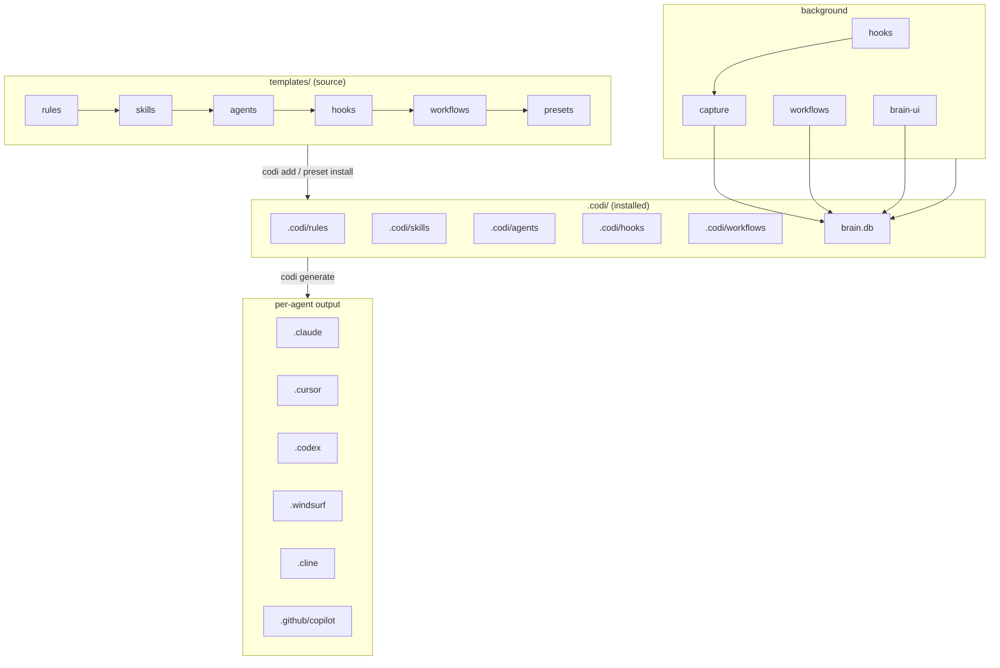

# Codi v3 — Full Re-Audit (Phase 2 consolidated)

- **Date**: 2026-05-11 21:45
- **Document**: 20260511*214500*[AUDIT]\_codi-v3-full-reaudit.md
- **Category**: AUDIT
- **Branch**: feature/codi-v3-harness
- **Method**: 5 specialised sub-agents (architecture, security, performance, code-quality, workflow-deep-dive) + main-session bash sweeps. Code-quality agent ran twice and failed (bash denied in sandbox); recovered by main session.
- **Scope**: full re-audit of all 22 functional blocks, ignoring prior audit baseline (per user decision)
- **Repo size**: 641 src/.ts files (88,540 LOC; 66,226 LOC excluding `src/templates/`), 294 test files (54,302 LOC)

## 1. Resumen ejecutivo

| Dimension       | Verdict      | Critical | High | Medium | Low  |
| :-------------- | :----------- | :------: | :--: | :----: | :--: |
| Architecture    | WARN         |    0     | many |  many  | many |
| Security        | PASS w/ HIGH |    0     |  4   |   7    |  4   |
| Performance     | WARN         |    1     |  4   |   4    |  3   |
| Code quality    | WARN         |    0     |  6   |  many  | many |
| Workflow engine | FAIL         |    3     |  5   |   6    |  5   |
| Test baseline   | PASS         |    —     |  —   |   —    |  —   |

**Headline:**

- `pnpm test` → 314 files / 3 723 tests pass, 2 skipped. `tsc --noEmit` clean. `pnpm audit --prod` reports zero CVEs. `codi doctor` reports `allPassed: true` across drift, hooks, native bindings. `codi validate --ci` 0 errors (32 size warnings on skills).
- Cold start `codi --help` measured at **451 ms** (improvement vs 580 ms prior baseline). `dist/` shrank to 12 MB (from 21 MB).
- 9 src files over the 700-LOC project cap (`cli/init.ts:799`, `cli/workflow.ts:799`, `cli/update.ts:798`, `runtime/brain-ui/pages/sessions.ts:780`, `cli/init-wizard-paths.ts:755`, `core/hooks/hook-templates.ts:716`, `cli/contribute.ts:712`, plus 2 in `src/templates/skills/`).
- 27 barrel `index.ts` files — violates project rule.
- 4 layering violations `core/ → cli/` (cement cli as load-bearing dep of core).
- Agent-identity drift in **4 separate sources** (`constants.ts`, `adapters/index.ts`, `core/capabilities/matrix.ts`, `runtime/capture/agent-memory.ts`); `codex-cli` vs `codex` is real divergence in `matrix.ts:54`.
- **`openai` and `@google/generative-ai` are confirmed dead dependencies** — schema v10 retired the consolidation pipeline; `src/runtime/{consolidate,llm}/` do not exist.
- Workflow engine has **3 CRITICAL correctness defects** (parallel gate sources of truth, racing multi-event approvals, racing parallel `runWorkflow`).
- Security: 0 critical (brain-ui already binds loopback + has Origin check), but 4 HIGH still open (marked-XSS in dashboard, origin-undefined CSRF bypass, git-ref arg-injection vector, `fast-uri 3.1.0` still hoisted in lockfile despite override).

**Top 5 to ship this week:**

1. Fix workflow engine **C1** — single `gatesForPhase` source (gate-runner-bridge currently reads YAML on disk, workflow-graph reads brain.db; they diverge).
2. Pre-bundle hooks to `dist/hook-*.js` → drop `tsx` JIT (~400-600 ms saved per hook fire).
3. Patch brain-ui: drop the `origin === undefined ⇒ next()` bypass, add per-instance bearer token; sanitize `marked` output (HIGH-1 + HIGH-2).
4. Regenerate `pnpm-lock.yaml` so `fast-uri >= 3.1.2` override actually deduplicates 3.1.0.
5. Remove `openai` + `@google/generative-ai` from `dependencies` (dead).

## 2. Descripción del sistema

Codi v3.0.0 is a TypeScript/Node CLI that unifies AI-agent configuration across 6 agents (Claude Code, Cursor, Codex, Windsurf, Cline, GitHub Copilot). One source of truth in `.codi/` is translated to each agent's native format (`CLAUDE.md`, `.cursorrules`, `AGENTS.md`, etc.).

Three-layer pipeline (per `CLAUDE.md`):

- **Source**: `src/templates/{rules,skills,agents,hooks,workflows,presets}/` shipped with the package.
- **Installed**: `.codi/<type>/<name>/` is a project's local copy of installed artefacts.
- **Generated**: per-agent directories produced from the installed copy by `codi generate`.

Runtime side-effects that operate background to the static config:

- **Hooks** wired into the agent lifecycle (UserPromptSubmit, PreToolUse, PostToolUse, Stop) capture prompts/tool calls into a local SQLite **brain**.
- **Workflows** are brain-tracked units of work with phases + gates + chains.
- **brain-ui** is a local Hono HTTP dashboard for inspecting captures, sessions, workflows, gate events.

Functional blocks identified (22):

|  #  | Block                                        | Status                   |
| :-: | :------------------------------------------- | :----------------------- |
| B1  | CLI entry + Command Center                   | live                     |
| B2  | Init / Onboard / Wizard                      | live                     |
| B3  | Config resolution                            | live                     |
| B4  | Generator + Adapters                         | live                     |
| B5  | Templates layer                              | live                     |
| B6  | Hooks system                                 | live                     |
| B7  | Brain SQLite                                 | live                     |
| B8  | Brain-UI dashboard                           | live                     |
| B9  | Workflow engine                              | live                     |
| B10 | Consolidation / LLM                          | **REMOVED** (schema v10) |
| B11 | Sync Google Sheets                           | live, 0 % CLI coverage   |
| B12 | Preset system                                | live                     |
| B13 | Backup + Revert                              | live                     |
| B14 | Validate / Doctor / Verify / Compliance / CI | live                     |
| B15 | Update / Clean / Watch / Migrate             | live                     |
| B16 | Contribute                                   | live                     |
| B17 | Docs                                         | live                     |
| B18 | Skill lifecycle                              | live                     |
| B19 | Security scanner                             | live                     |
| B20 | Schemas / types                              | live                     |
| B21 | Plugin system                                | live, near-zero usage    |
| B22 | External source                              | live                     |

## 3. Arquitectura detectada

**Fortalezas:**

- Result&lt;T&gt; discipline (no thrown errors across module boundaries — verified in `src/types/result.ts` + 20+ typed Error subclasses).
- 3-layer pipeline is well-documented (CLAUDE.md + `docs/project/architecture.md`) and templates correctly never read at generate time.
- Strict typing: zero `// @ts-ignore` in code (only in a rule text); 14 `as unknown as` (all rationalised); `: any` is rare and gated by eslint-disable.
- Brain SQLite has WAL, NORMAL synchronous, FK enforcement, and the right indexes for hot paths (verified `idx_captures_turn_marker`, `idx_workflow_runs_status_started`).

**Debilidades:**

- `src/cli/` is a flat dir of 52 files — anti-pattern flagged in the project's own rule (`codi-architecture.md`). 4 mass-coupled super-handlers (`hub-handlers`, `preset-handlers`, `init`, `workflow`) carry > 600 LOC each.
- 4 layering violations `core/ → cli/`. Inverts the dependency rule.
- 27 barrel `index.ts` files violate `codi-typescript.md` "Do not use index.ts barrel files for re-exporting".
- Agent-identity duplicated in 4 sources (`SUPPORTED_PLATFORMS` vs `ALL_ADAPTERS` vs `TARGET_IDS` vs `SUPPORTED_AGENT_TYPES`). `codex-cli` vs `codex` is real drift.
- `registerAllAdapters()` is invoked from 7 CLI entry points instead of once at module init.
- Workflow engine has two parallel "gates-for-phase" implementations (`workflow-graph.gatesForPhase` reads brain.db, `gate-runner-bridge.gatesForPhase` reads YAML on disk) — they diverge after YAML edits.
- Brain handle uses `unsafeMode(true)` for the full connection lifetime (was scoped to migration only in spec).
- Templates layer uses namespace barrels (`import * as skillTemplates from ...`) that defeat tree-shaking.

**Riesgos arquitectónicos confirmados:**

- Dual workflow state — event-sourced `workflow_events` vs materialised `workflow_runs.{current_phase,status}` — runs without a single-txn write boundary. Concurrent readers can observe inconsistent state.
- Generator phase 1 (adapter dispatch) is sequential despite adapters being independent → ~6× under-utilisation on the multi-agent run.
- Generator phase 2 (conflict detect) does ~7 000 sequential `readFile` calls.

## 4. Hallazgos principales

| ID             | Hallazgo                                                                               | Severidad | Evidence                                                                                                                                          | Recomendación                                             | Esfuerzo |
| :------------- | :------------------------------------------------------------------------------------- | :-------: | :------------------------------------------------------------------------------------------------------------------------------------------------ | :-------------------------------------------------------- | :------: |
| W-C1           | Two divergent `gatesForPhase` paths                                                    | CRITICAL  | `runtime/workflow-graph.ts:66-74` vs `runtime/gate-runner-bridge.ts:69-80`                                                                        | Route bridge through workflow-graph; drop YAML scan       |    M     |
| W-C2           | `approveTransition` is 4 separate txns                                                 | CRITICAL  | `runtime/cli-handlers/transitions.ts:158-227`                                                                                                     | Wrap in single SQLite txn                                 |    S     |
| W-C3           | Race in `runWorkflow` stale-active cleanup                                             | CRITICAL  | `runtime/cli-handlers/workflow.ts:140-149`                                                                                                        | Acquire `acquireLock()` or wrap in single txn             |    S     |
| P-F01          | Hooks run via `tsx` JIT, ~600 ms each                                                  | CRITICAL  | `src/templates/hooks/runtime/*.sh`                                                                                                                | Pre-bundle via tsup → `dist/hook-*.js`                    |    M     |
| S-H1           | `marked.parse` without sanitiser → stored XSS in brain-ui                              |   HIGH    | `runtime/brain-ui/pages/shell.ts:116`                                                                                                             | Custom renderer rejecting non-http(s)/mailto hrefs        |    S     |
| S-H2           | Origin-undefined branch lets curl mutate brain-ui state                                |   HIGH    | `runtime/brain-ui/server.ts:50-59`                                                                                                                | Drop the bypass + add per-instance bearer token           |    M     |
| S-H3           | `descriptor.ref` → `--branch` arg injection latent risk                                |   HIGH    | `cli/preset-github.ts:89`, `core/external-source/connectors.ts:131`                                                                               | Reject refs that start with `-` or contain `..`           |    S     |
| S-H4           | `fast-uri@3.1.0` still hoisted despite override                                        |   HIGH    | `package.json:138`, `pnpm-lock.yaml`                                                                                                              | Regenerate lock + add CI guard `pnpm why fast-uri`        |    S     |
| W-H1           | Agent-typed gates declared but never executed                                          |   HIGH    | `runtime/gate-runner-bridge.ts:84` hardcodes deterministic                                                                                        | Add gate-registry indirection                             |    M     |
| W-H2           | `team-consolidation.yaml` has 7 gates with NO deterministic checkers (all silent pass) |   HIGH    | `templates/workflows/team-consolidation.yaml`, missing in `gate-runner.ts:32-466`                                                                 | Implement checkers or mark `type: agent`                  |    M     |
| W-H3           | `getStatus` cwd-filters, transitions don't → invisible workflow can be approved        |   HIGH    | `runtime/cli-handlers/workflow.ts:326-339` vs `transitions.ts:43`                                                                                 | Unify cwd policy                                          |    S     |
| A-1            | 9 files over 700-LOC cap                                                               |   HIGH    | see §6.1 prior audit; current list in §1 headline                                                                                                 | Split per sub-concern                                     |   M-L    |
| A-2            | Agent-identity drift across 4 sources                                                  |   HIGH    | `constants.ts:200`, `adapters/index.ts:31`, `core/capabilities/matrix.ts:54`, `runtime/capture/agent-memory.ts:166`                               | Derive ALL_ADAPTERS + TARGET_IDS from SUPPORTED_PLATFORMS |    S     |
| A-3            | 4 layering violations `core/ → cli/`                                                   |   HIGH    | `core/docs/{docs-generator,renderers/infrastructure-renderers}.ts`, `core/onboard/catalog-renderer.ts:15`, `core/version/artifact-manifest.ts:13` | Move shared menu/category types to `core/`                |    S     |
| P-F02          | `applyMigrations` runs every hook fire (and twice on UserPromptSubmit)                 |   HIGH    | `runtime/brain/migrate.ts:320-348`, `brain-event-log.ts:139`                                                                                      | Gate behind one-shot env flag                             |    S     |
| P-F03          | PostToolUse opens 2 brain handles                                                      |   HIGH    | `scripts/runtime/hook-post-tool-use.ts:84`, `runtime/hook-logic.ts:299-311`                                                                       | Pass log into buildContext                                |    S     |
| P-F04          | Generator phase 1 sequential across 6 adapters                                         |   HIGH    | `core/generator/generator.ts:74-124`                                                                                                              | `Promise.all(agentIds.map(...))`                          |    S     |
| P-F05          | Generator phase 2 reads 7 000 files serially                                           |   HIGH    | `core/generator/generator.ts:133-155`                                                                                                             | `Promise.all` with `p-limit(32)`                          |    S     |
| P-F06          | Eager skill-registry barrel inflates cold start                                        |   HIGH    | `cli.ts:36` → `cli/hub.ts:8` → `templates/skills/index.ts:1-70`                                                                                   | Dynamic-import in bare branch                             |    S     |
| S-M1           | `unsafeMode(true)` for full connection lifetime                                        |  MEDIUM   | `runtime/brain/db.ts:181`                                                                                                                         | Scope to migration only                                   |    S     |
| S-M2           | FTS5 MATCH query forwarded unbounded → DoS                                             |  MEDIUM   | `runtime/brain-ui/routes-api.ts:122-139`                                                                                                          | Quote-wrap, reject `*`-only, add stmt timeout             |    S     |
| S-M3           | CDN scripts without SRI / no CSP                                                       |  MEDIUM   | `runtime/brain-ui/pages/shell.ts:47-49`                                                                                                           | Pin SRI hashes or vendor locally                          |    S     |
| S-M4           | `Math.random()` for temp-dir suffix + sync IDs                                         |  MEDIUM   | 5 sites — `connectors.ts:29`, `preset-zip.ts:121`, 3 in sync/                                                                                     | Use `crypto.randomUUID` or `fs.mkdtemp`                   |    S     |
| S-M5           | `session-start.sh` greps YAML instead of parsing                                       |  MEDIUM   | `templates/hooks/runtime/session-start.sh:87`                                                                                                     | Use `python3 - <<'PY'` like JSON branch                   |    S     |
| S-M6           | `runner-template.ts` builds shell from JSON config                                     |  MEDIUM   | `core/hooks/runner-template.ts:69-110`                                                                                                            | Validate command at install time + execFile               |    M     |
| S-M7           | SSE has no per-IP cap                                                                  |  MEDIUM   | `runtime/brain-ui/sse.ts:24-60`                                                                                                                   | Reject > 16 concurrent streams                            |    S     |
| Q-1            | 27 barrel index.ts                                                                     |  MEDIUM   | listing in §3                                                                                                                                     | Inline each consumer; delete barrels                      |    M     |
| Q-2            | `.codi` literal hardcoded in 30+ sites (despite PROJECT_DIR exists)                    |  MEDIUM   | `core/hooks/exclusions.ts:21`, `runtime/preferences.ts:59-60`, `runtime/brain/db.ts:43`, all of `runtime/sync/`, etc.                             | Centralise on PROJECT_DIR                                 |    M     |
| Q-3            | `ARTIFACT_TYPES` redefined in 3 places with different values                           |  MEDIUM   | `core/artifact-types.ts:19`, `core/docs/artifact-catalog-generator.ts:250`, `core/hooks/hook-templates.ts:154`                                    | Single export from core/artifact-types                    |    S     |
| Q-4            | `console.*` heavy in `runtime/sync/*` (40, 37, 18, 12, 11, 7 — 5 files)                |  MEDIUM   | see §6 console table                                                                                                                              | Route through Logger                                      |    M     |
| Q-5            | 10 empty `catch {}` blocks (all in hooks subsystem)                                    |  MEDIUM   | `core/hooks/heartbeat-hooks.ts` ×5, `hook-templates.ts` ×2, `runner-template.ts` ×2                                                               | Document reason or handle                                 |    S     |
| W-M1-M6        | Workflow medium issues (LOG re-opens, snake↔camel triplicated, etc.)                   |  MEDIUM   | see §5                                                                                                                                            | see §5                                                    |   M-L    |
| S-L1-L4        | yaml safe-mode defensive, pidfile JSON-trusted, update-check no SRI, no SBOM           |    LOW    | see §10                                                                                                                                           | —                                                         |    L     |
| P-F08 to P-F12 | SSE no backoff, payload trimming, update-check timeout                                 |    LOW    | see §11                                                                                                                                           | see §11                                                   |    S     |

## 5. Problemas por bloque

### B1 — CLI entry + Command Center

Files: `cli.ts:99`, `cli/hub.ts:269`, `cli/hub-handlers.ts:691`, `cli/shared.ts:93`. Problems:

- `hub-handlers.ts:691` is a parallel dispatch surface that re-implements Commander tree by directly invoking sibling handlers — two sources of truth for command resolution.
- `cli.ts:54-84` manually registers 29 commands; adding a command needs 3-file edits.
- `docs-update` and `docs` are two separate commands with overlapping scope.

Recommendation: extract a `cli/command-registry.ts` consumed by both `cli.ts` and `hub.ts`. Inline `docs-update` into `docs`.

### B2 — Init / Onboard / Wizard

Top files: `cli/init.ts:799 (over cap)`, `cli/init-wizard-paths.ts:755 (over cap)`, `cli/init-helpers.ts:575`, `core/scaffolder/skill-scaffolder.ts:313`. Problems:

- 2 files over the 700-LOC cap.
- 9 `*wizard*` files without a `cli/wizard/` directory.
- `core/onboard/catalog-renderer.ts:15` imports `#src/cli/artifact-categories.js` — layer inversion.

Recommendation: promote `cli/wizard/`. Move `cli/artifact-categories.ts` to `core/scaffolder/`. Split `init.ts` along resolve / scaffold / hooks-setup.

### B3 — Config resolution

Files: `core/config/state.ts:526`, `parser.ts:449`, `validator.ts:323`. Healthy. Problems:

- `state.ts:80` places `import` mid-file (style).
- `core/flags/index.ts` is a 5-line barrel (rule violation).
- Hardcoded `"claude-code"` in JSDoc at 3 sites in `state.ts`.

### B4 — Generator + Adapters

Files: `adapters/claude-code.ts:603`, `codex.ts:447`, `copilot.ts:434`, `cursor.ts:239`, `windsurf.ts:145`, `cline.ts:144`. Problems:

- Phase 1 sequential dispatch across 6 adapters (PERF-004).
- Phase 2 conflict-detect reads 7 000 files serially (PERF-005).
- `registerAllAdapters()` called from 7 CLI entry points.
- `ALL_ADAPTERS` array drifts vs `SUPPORTED_PLATFORMS` (today same order but not derived).
- `adapters/skill-generator.ts:402` is a 402-LOC peer of the adapters but belongs in `core/generator/`.

### B5 — Templates layer

71 skill directories, 31 rule modules, 22 agent modules, 7 workflow YAMLs, 7 presets, 6 hook scripts. Problems:

- `templates/skills/index.ts` is a namespace barrel of 71 entries — defeats tree-shaking.
- `content-factory` skill embeds its own `node_modules` (5 nested copies).
- `templates/presets/types.ts` is a domain type living in `templates/`.
- 18 skills exceed the 6 000-char content size soft limit (some at 11 707 / 36 352 chars — `codi-dev-skill-creator`, `codi-html-live-inspect`).

### B6 — Hooks system

Top files: `core/hooks/hook-templates.ts:716 (OVER)`, `hook-installer.ts:668`, `hook-config-generator.ts:666`, `heartbeat-hooks.ts:344`. Problems:

- `hook-templates.ts:716` over the cap.
- Same-name collision `runtime/hook-logic.ts:603` vs `core/hooks/hook-logic/` (dir).
- 10 empty `catch {}` blocks concentrated in this subtree.
- Hook scripts hardcode `.codi` paths (PROJECT_DIR not used).

### B7 — Brain SQLite

Top files: `runtime/brain-event-log.ts:391`, `brain/migrate.ts:348`, `brain/validate-artifacts.ts:348`. Indexes verified present and used. Problems:

- `brain-event-log.ts` lives at runtime root but its peers live in `runtime/brain/`.
- `runtime/capture/agent-memory.ts:166` declares a third agent-identity tuple.
- `unsafeMode(true)` is scoped to the connection lifetime; should be wrapped around migration only.

### B8 — Brain-UI dashboard

Top files: `pages/sessions.ts:780 (OVER)`, `pages/workflows.ts:658`, `pages/settings.ts:445`, `pages/captures.ts:421`. Problems:

- `pages/sessions.ts:780` over the cap.
- Each page mixes HTML + inline SQL.
- `pages.ts` (25 LOC) coexists with `pages/` directory — naming collision.
- Security HIGH-1 (marked XSS) + HIGH-2 (CSRF bypass) live here.

### B9 — Workflow engine

Top files: `cli/workflow.ts:799 (OVER)`, `runtime/cli-handlers/workflow.ts:600`, `runtime/gate-runner.ts:515`, `runtime/cli-handlers/transitions.ts:495`. **Highest-risk block.** Problems:

- W-C1 / W-C2 / W-C3 critical races (see §4).
- W-H1 agent gates declared but unreachable.
- W-H2 team-consolidation gates are silent no-ops.
- W-H3 `getStatus` vs transitions asymmetry.
- M1 `BrainEventLog.open()` called twice per slim-status query (hot path under every Iron-Laws hook).
- M2 `runQuick` blocks on missing `docs/CONTEXT.md` — conflicts with quick-mode intent.
- M3 snake↔camel field mapping duplicated in 3 places.

Comparing against `docs/20260510_032225_[AUDIT]_workflows-skills-gates-team-readiness.md` — gate runner is now wired (F-1 fixed), brain-cwd resolution mitigated (F-3 partial), skill ↔ workflow contract still naming-only (F-4 open), `done`/`abandoned` YAML duplication still open (F-8).

### B10 — Consolidation / LLM

Does not exist. Audit brief listed it but `src/runtime/{consolidate,llm}/` are absent. `openai` and `@google/generative-ai` are confirmed dead deps. Remove from `package.json`.

### B11 — Sync Google Sheets

27 files, 6 632 LOC in a single flat dir (`runtime/sync/`). Problems:

- 5 files in 487-598 LOC range (border).
- `runtime/sync/cli.ts:598` — second `cli.ts` in the codebase (collides with `src/cli.ts`).
- Sheets and XLSX file pairs (`bootstrap.ts` + `xlsx-bootstrap.ts`, `client.ts` + `xlsx-client.ts`) hard to disambiguate.
- 110+ `console.*` calls across `cli*.ts` (no Logger).
- 0 % CLI coverage per prior audit; not re-measured this run.

Recommendation: split into `sync/{sheets,xlsx,core,cli}/`. Route output through Logger.

### B12 — Preset system

Top files: `cli/preset-handlers.ts:678`, `cli/preset.ts:638`, `core/preset/preset-loader.ts:423`. Problems:

- Two CLI files for one user-facing subcommand exceed 1 300 LOC combined.
- `core/preset/preset-builtin.ts:11` imports type from `templates/presets/types.js` — type lives in wrong layer.
- `cli/preset-github.ts:300` is a transport detail in `cli/` (should be in `core/external-source/`).

### B13 — Backup + Revert

Files: `core/backup/backup-manager.ts:282`, `cli/revert.ts:300`, `cli/backup.ts:103`. Healthy block. Problems:

- `revert` UX is 3× bigger than `backup` and lives in `cli/`. Move destructive-op logic to `core/backup/revert.ts`.
- `backup-*` siblings inconsistently named (`types.ts` drops the prefix).

### B14 — Validate / Doctor / Verify / Compliance / CI

Files: `cli/validate.ts:75`, `doctor.ts:248`, `verify.ts:108`, `compliance.ts:206`. Healthy small files. Problems:

- 4 commands cover related territory without a shared `core/checks/` library.
- `core/audit/audit-log.ts:18` is 18 lines — inline or upgrade.

### B15 — Update / Clean / Watch / Migrate

Top files: `cli/update.ts:798 (at cap)`, `cli/clean.ts:526`. Problems:

- `cli/update.ts:798` one LOC under the cap.
- 3 update-related modules (`update.ts`, `update-check.ts`, `update-hooks-help.ts`) without a `cli/update/` directory.
- `core/migration/index.ts:23` barrel is dead (consumers import direct).

### B16 — Contribute

Files: `cli/contribute.ts:712 (OVER)`, `contribute-lint.ts:333`, `contribute-git.ts:223`. Problems:

- `contribute.ts:712` over the cap.
- `contribute-lint.ts` overlaps with `compliance.ts` (rule-engine duplication).

### B17 — Docs

Files: `core/docs/artifact-catalog-generator.ts:453`, `docs-generator.ts:307`, renderers. Problems:

- 2 layering violations (`docs-generator.ts:23` and `infrastructure-renderers.ts:6` import from `cli/hub.js`).
- 4 CLI doc commands (`docs`, `docs-update`, `docs-stamp`, `docs-check`) — collapse to 1 with subcommands.

### B18 — Skill lifecycle

Files: `core/skill/skill-export.ts:364`, `feedback-collector.ts:288`, `skill-improver.ts:204`. Healthy.

- Stale comment `version-manager.ts:180` ("buildUnifiedDiff is now imported …" — already correct).
- `cli/skill.ts:318` imports per-feature modules directly (no facade).

### B19 — Security scanner

Files: `core/security/content-scanner.ts:541`, `scan-patterns.ts:268`. Problems:

- Large 541-LOC file — could split per scanner type.
- Sibling `core/scanner/literal-blocks.ts:173` is unrelated but shares the "scanner" name.

### B20 — Schemas / types

11 schema files + 5 type files + 2 barrels. Problems:

- `schemas/index.ts:47` and `types/index.ts` barrels (rule violation).
- JSDoc examples reference `"claude-code"` directly instead of `SUPPORTED_PLATFORMS`.

### B21 — Plugin system

Files: `cli/plugin.ts:126`, `core/capabilities/matrix.ts:142`, `plugin-manifest.ts:90`, `publish.ts:77`. **Block has near-zero internal usage** (only entry is `pluginPublishHandler`). Problems:

- `matrix.ts:54` declares `TARGET_IDS` with `codex-cli` and `gemini` — divergent from `SUPPORTED_PLATFORMS`.
- `plugin-manifest.ts:83` hardcodes `.claude-plugin/plugin.json`.

### B22 — External source

Files: `core/external-source/discovery.ts:169`, `connectors.ts:169`, `installer.ts:122`, `cli/preset-github.ts:300`. Problems:

- `cli/preset-github.ts:300` is misplaced — belongs in `core/external-source/connectors/github.ts`.
- `installer.ts` and `preset-loader.ts` overlap functionally.
- No tests dedicated to this block in the file map.

## 6. Código duplicado

| Pattern                       | Locations                                                                                                                                                                                                                                                                                                                                                                                                                                                    | Why bad                                              | Fix                                                                       |
| :---------------------------- | :----------------------------------------------------------------------------------------------------------------------------------------------------------------------------------------------------------------------------------------------------------------------------------------------------------------------------------------------------------------------------------------------------------------------------------------------------------- | :--------------------------------------------------- | :------------------------------------------------------------------------ |
| `.codi` literal               | `core/hooks/exclusions.ts:21`, `core/hooks/hook-config-generator.ts:280,431`, `runtime/preferences.ts:59-60`, `runtime/brain/db.ts:43,75`, `runtime/hooks/security-reminder/state.ts:25`, `runtime/brain-ui/lifecycle.ts:16`, all `runtime/sync/*` (~10 sites), `runtime/cli-handlers/workflow.ts:511-512`, `cli/{hooks-add,hooks-remove,hooks-list,agent-hooks,plugin,status}.ts`, `adapters/{claude-code,codex}.ts`, even `constants.ts:182-184` (paradox) | Path changes need 30+ edits; rename-risk per release | Centralise in `constants.ts:PROJECT_DIR`; new helpers in `utils/paths.ts` |
| `ARTIFACT_TYPES`              | `core/artifact-types.ts:19`, `core/docs/artifact-catalog-generator.ts:250`, `core/hooks/hook-templates.ts:154`                                                                                                                                                                                                                                                                                                                                               | Members differ across copies                         | Single export from `core/artifact-types.ts`                               |
| Agent identity tuple          | `constants.ts:200` SUPPORTED_PLATFORMS (6), `adapters/index.ts:31` ALL_ADAPTERS (6), `core/capabilities/matrix.ts:54` TARGET_IDS (7, `codex-cli` + `gemini`), `runtime/capture/agent-memory.ts:166` SUPPORTED_AGENT_TYPES (2)                                                                                                                                                                                                                                | Real drift (`codex-cli` not in SUPPORTED_PLATFORMS)  | Derive from a single source; reconcile `codex` vs `codex-cli`             |
| Artifact-layout map           | `core/external-source/discovery.ts`, `installer.ts`, `core/version/artifact-manifest.ts`, `core/preset/preset-applier.ts`, `core/backup/backup-source.ts`                                                                                                                                                                                                                                                                                                    | 5 copies that must stay in sync                      | One exported `ARTIFACT_LAYOUTS` from `core/artifact-types.ts`             |
| Snake↔camel adapter mapping   | `runtime/cli-handlers/workflow.ts:578-595`, `runtime/cli-handlers/transitions.ts:464-485`, `runtime/cli-handlers/workflow.ts:341-355` (SLIM_ADAPTATION_KEY)                                                                                                                                                                                                                                                                                                  | New field → 4 edits, no parity test                  | One field map per adapter; serialise via it                               |
| `Math.random().toString(36)`  | `core/external-source/connectors.ts:29`, `core/preset/preset-zip.ts:121`, 3 sites in `runtime/sync/`                                                                                                                                                                                                                                                                                                                                                         | Predictable → race-attack temp dirs                  | `crypto.randomUUID().slice(0, 8)` or `fs.mkdtemp`                         |
| Hook empty-catch              | 10 sites in `core/hooks/{heartbeat-hooks,hook-templates,runner-template}.ts`                                                                                                                                                                                                                                                                                                                                                                                 | Hides real errors                                    | Replace `catch {}` with `catch (e) { /* reason */ }` minimum              |
| `console.*` instead of Logger | `runtime/sync/cli.ts` ×40, `cli-draft.ts` ×37, `cli-bridge.ts` ×18, `cli-create.ts` ×12, `cli-safety.ts` ×7, `core/hooks/{hook-templates,hook-policy-templates,version-bump-template,version-verify-pre-push-template,runner-template,brand-skill-validate,heartbeat-hooks,conflict-marker}.ts`                                                                                                                                                              | Bypasses `--quiet`, non-deterministic in tests       | Route through `core/output/logger`                                        |

## 7. Sobreingeniería

| Area                                                                   | Issue                                                                  | Suggestion                                                  |
| :--------------------------------------------------------------------- | :--------------------------------------------------------------------- | :---------------------------------------------------------- |
| `cli/hub-handlers.ts:691`                                              | Re-implements Commander dispatch by directly invoking sibling handlers | Replace with a thin command-registry consumer               |
| Workflow dual state machine                                            | Event-sourced reducer + materialised `workflow_runs` columns           | Pick one source of truth; or wrap mutations in a single txn |
| 27 barrel `index.ts` files                                             | Re-export only; break tree-shaking + slow tests                        | Inline at every call site                                   |
| Templates namespace barrels                                            | `import * as skillTemplates from ...` of 71 entries                    | `Map<string, () => Template>` + lazy load                   |
| Workflow adapter snake↔camel triplication                              | 3 maps in 3 files                                                      | One map per adapter                                         |
| Two scanner trees (`core/security/` + `core/scanner/`)                 | Unrelated but homonymous                                               | Rename one                                                  |
| `core/audit/audit-log.ts:18`                                           | 18-line standalone module                                              | Inline into `operations-ledger.ts`                          |
| 4 CLI doc commands (`docs`, `docs-update`, `docs-stamp`, `docs-check`) | Same domain split 4 ways                                               | Single `codi docs `                                    |
| `openai` + `@google/generative-ai`                                     | Dead deps (consolidation removed schema v10)                           | Drop from `package.json`                                    |

## 8. Malas prácticas

| Practice                                             | Location                                                                                                       | Risk                        | Alternative                                                   |
| :--------------------------------------------------- | :------------------------------------------------------------------------------------------------------------- | :-------------------------- | :------------------------------------------------------------ |
| Empty `catch {}` (10 cases in hooks)                 | `core/hooks/heartbeat-hooks.ts:99,159,163,228,233`, `hook-templates.ts:89,134,370`, `runner-template.ts:48,50` | Hides bugs                  | Log w/ reason or rethrow                                      |
| Silent `.catch(() => null)` (27 cases)               | various                                                                                                        | Same                        | Same                                                          |
| `console.*` instead of Logger (240+ in non-template) | sync cluster + hook templates                                                                                  | Bypasses output discipline  | Logger from `core/output/logger.ts`                           |
| `Math.random()` for temp-dir                         | `connectors.ts:29` + 4 sync sites                                                                              | Predictable race            | crypto.randomUUID                                             |
| `Origin === undefined` allows mutating endpoints     | `runtime/brain-ui/server.ts:50-59`                                                                             | Curl bypass                 | Require Origin on every non-GET                               |
| `marked.parse` w/o sanitiser                         | `runtime/brain-ui/pages/shell.ts:116`                                                                          | Stored XSS                  | Custom renderer + DOMPurify                                   |
| Hardcoded `.codi` literal (30+)                      | listed §6                                                                                                      | Refactor brittleness        | PROJECT_DIR helper                                            |
| `unsafeMode(true)` for full lifetime                 | `runtime/brain/db.ts:181`                                                                                      | Removes defensive-in-depth  | Scope to migration only                                       |
| Multi-event SQL writes not in txn                    | `transitions.ts:158-227`, `gate-runner-bridge.ts:103,154`                                                      | Cross-call atomicity broken | Wrap in `log.privateRaw.transaction`                          |
| YAML grep in shell (`session-start.sh:87`)           | session-start hook                                                                                             | Defence-in-depth gap        | Python heredoc parser (already used 3× in same file for JSON) |
| Sequential adapter generation                        | `core/generator/generator.ts:74-124`                                                                           | Wastes 5× concurrency       | `Promise.all`                                                 |

## 9. Riesgos funcionales (requieren validación humana)

|  #  | Functionality                                                 | Why uncertain                                                             | Manual test   |
| :-: | :------------------------------------------------------------ | :------------------------------------------------------------------------ | :------------ |
| F1  | `codi workflow run feature` end-to-end                        | High churn last 2 weeks; gate-runner-bridge / workflow-graph divergence   | §15 prueba 1  |
| F2  | `codi quick typo "x"` without `docs/CONTEXT.md`               | runQuick blocks on missing knowledge base                                 | §15 prueba 2  |
| F3  | Concurrent `codi workflow run`                                | Race in `runWorkflow:140-149`                                             | §15 prueba 3  |
| F4  | `codi workflow approve` on workflow started in other cwd      | `getStatus` cwd-filters, transitions don't                                | §15 prueba 4  |
| F5  | team-consolidation workflow gates                             | All 7 gates have no checkers — silent pass                                | §15 prueba 5  |
| F6  | Hooks under real Claude Code load                             | tsx startup ~600 ms × 22 events per turn                                  | §15 prueba 6  |
| F7  | brain-ui open in browser while developer visits external page | CSRF/XSS surface — HIGH-1 + HIGH-2 still open                             | §15 prueba 7  |
| F8  | `codi preset install github:...` with crafted ref             | Latent arg-injection in `descriptor.ref`                                  | §15 prueba 8  |
| F9  | `codi update --skills --force` on installed copy              | Documented as unreliable in CLAUDE.md; user is advised to clean+reinstall | §15 prueba 9  |
| F10 | Sync to Google Sheets (`codi brain sync ...`)                 | 0 % CLI coverage; 6 632 LOC untested at CLI layer                         | §15 prueba 10 |
| F11 | Plugin install (`codi plugin install ...`)                    | Low usage, drift in TARGET_IDS                                            | §15 prueba 11 |
| F12 | brain-ui captures bulk-delete                                 | Unauthenticated mutating endpoint                                         | §15 prueba 12 |

## 10. Riesgos de seguridad

(consolidated from sub-agent + main session)

**HIGH:**

- **S-H1 Stored XSS in brain-ui** — `marked.parse` without sanitiser, capture content is attacker-controllable via `|TYPE: "..."|` markers. Fix: custom renderer that rejects non-`http(s)|mailto|#` hrefs.
- **S-H2 Origin-undefined CSRF bypass** — `if (origin === undefined) return next();` lets curl/CLI processes mutate captures, restore backups, etc. Fix: drop the bypass + add per-instance bearer token in pidfile.
- **S-H3 Git-ref arg-injection latent** — `descriptor.ref` is unvalidated before `git clone --branch <ref>`. Mitigated by argv position today; one git regression away from exploit. Fix: regex allowlist.
- **S-H4 `fast-uri@3.1.0` still hoisted** — `pnpm.overrides` declares `>=3.1.2` but lockfile still references 3.1.0. Fix: regenerate lock + CI guard `pnpm why fast-uri | grep 3.1.[2-9]`.

**MEDIUM:** unsafeMode lifetime, FTS5 MATCH DoS, no CSP/SRI, Math.random temp-dirs, session-start.sh YAML grep, runner-template shell concat, SSE no per-IP cap. Details in §4.

**LOW:** yaml.parse without Zod after, pidfile JSON-trusted with no chmod 0700, update-check without integrity check, no SBOM / no signing.

**Confirmed safe:**

- ZIP-slip guarded by `assertPathsContained` (realpath re-walk).
- All SQL parameterized.
- brain-ui binds 127.0.0.1 by default; `CODI_BRAIN_UI_BIND` is opt-in.
- `escapeHtml` applied at all view interpolation sites.
- No hardcoded secrets (gitleaks-style scan empty in src/).
- `pnpm audit --prod` 0 advisories.

## 11. Riesgos de rendimiento

| ID    | Issue                                                                | Cost                                     | Fix                                       |                     Gain                     |
| :---- | :------------------------------------------------------------------- | :--------------------------------------- | :---------------------------------------- | :------------------------------------------: |
| P-F01 | Hooks via `tsx` JIT                                                  | 400-600 ms × every hook fire             | Pre-bundle `dist/hook-*.js`               | 8-12 s saved / realistic 20-tool Claude turn |
| P-F02 | `applyMigrations` runs every hook                                    | 15-50 ms × hook (×2 on UserPromptSubmit) | Gate behind one-shot env flag             |               30-100 ms / hook               |
| P-F03 | PostToolUse opens 2 brain handles                                    | 40-80 ms × tool call                     | Pass log into `buildContext`              |             40-80 ms / tool call             |
| P-F04 | Generator phase 1 sequential                                         | 6× under-utilization                     | `Promise.all` adapters                    |            70-85 % wall reduction            |
| P-F05 | Generator phase 2 reads 7k files serially                            | 1-1.4 s                                  | `Promise.all` + p-limit                   |              80-90 % reduction               |
| P-F06 | Eager skill-registry barrel                                          | 100-200 ms × every `codi <cmd>`          | Dynamic-import hub.ts                     |         30-50 % cold start reduction         |
| P-F07 | `collectSupportingFiles` + `scanDirectory` sequential                | 50-200 ms / skill                        | `fast-glob` + Promise.all                 |    3-5× speedup on `compliance`/`verify`     |
| P-F08 | SSE poll every 1 s no backoff                                        | background CPU drift                     | Hoist statement + adaptive backoff to 5 s |             quiet idle dashboard             |
| P-F09 | `openai` + `@google/generative-ai` dead deps                         | ~50 MB node_modules                      | Remove from package.json                  |             smaller install + CI             |
| P-F10 | `idx_workflow_runs_status_started` correct but post-filter on `type` | flagged — confirmed performant           | partial index if rows > 10 k              |                 future-proof                 |
| P-F11 | `/api/v1/workflows` returns full metadata blob                       | 60-90 % payload bloat                    | Project columns                           |            smaller list response             |
| P-F12 | `update-check` 3 s timeout                                           | once-per-day worst case                  | Drop to 800 ms or setImmediate            |                2-3 s startup                 |

## 12. Estado de testing

| Metric               |                                        Value |
| :------------------- | -------------------------------------------: |
| Test files           | 294 (`.test.ts` only) — 316 with skill tests |
| Tests                |               3 723 pass + 5 skipped (3 728) |
| `tsc --noEmit`       |                                        clean |
| `pnpm audit --prod`  |                                 0 advisories |
| `codi doctor`        |                              allPassed: true |
| `codi validate --ci` |                   0 errors, 32 size warnings |

**Coverage gaps (from prior audit, not re-measured this run):**

- `src/runtime/sync/cli*.ts` (658 LOC, 0 % CLI coverage).
- `src/cli/agent-hooks.ts` (104 LOC).
- `src/cli/brain.ts` (98 LOC).
- `src/cli/migrate.ts`, `src/cli/plugin.ts` low coverage.

**Workflow engine — missing tests (from sub-agent W):**

- Concurrency: parallel `runWorkflow` race.
- `getStatus` vs `getActiveWorkflowId` cwd asymmetry.
- Adapter ↔ YAML parity (phase keys ⊆ adapter.phaseOrder).
- team-consolidation end-to-end (gates today are no-ops).
- Elevation resume restores phase.
- Stale-active migration race.

## 13. Roadmap de mejora

### 13.1 Quick wins (1-line / trivial)

- Drop the `origin === undefined` bypass — 1 line — closes S-H2 vector.
- Regenerate `pnpm-lock.yaml` — closes S-H4.
- Remove `openai` + `@google/generative-ai` from `package.json` — closes dead-dep P-F09.
- `Promise.all` the adapter dispatch loop — `generator.ts:74-124` — closes P-F04.
- Drop the `update-check` timeout from 3 000 to 800 ms — `update-check.ts:14`.
- Drop `core/migration/index.ts` (dead 23-line barrel).
- Hoist SSE prepared statement out of the polling loop (P-F08).
- Replace `Math.random().toString(36)` with `crypto.randomUUID().slice(0,8)` at 5 sites (S-M4).
- Custom `marked` renderer rejecting non-http(s) hrefs (S-H1).
- Validate `descriptor.ref` regex (S-H3).

### 13.2 Corto plazo (this sprint)

- Fix workflow engine **C1** (single `gatesForPhase` source).
- Fix workflow engine **C2** (single-txn `approveTransition`).
- Pre-bundle hooks → `dist/hook-*.js` (P-F01).
- Gate `applyMigrations` behind one-shot flag (P-F02).
- Parallelise generator phase 2 with `p-limit(32)` (P-F05).
- Implement deterministic checkers for the 7 `team-consolidation` gates (W-H2).
- Add gate-registry indirection to enable agent-typed gates (W-H1).
- Unify `getStatus` cwd policy (W-H3).
- Drop the 4 `core/ → cli/` layering violations.
- Single source of truth for agent identity — derive `ALL_ADAPTERS` and `TARGET_IDS` from `SUPPORTED_PLATFORMS`; reconcile `codex` vs `codex-cli`.

### 13.3 Medio plazo (next sprint)

- Split the 9 files over 700 LOC (`cli/{init,workflow,update,contribute,init-wizard-paths}.ts`, `runtime/brain-ui/pages/sessions.ts`, `core/hooks/hook-templates.ts`, 2 skill templates).
- Delete the 27 barrel `index.ts` files OR document each as a public-API facade.
- Centralise `.codi` literal on `PROJECT_DIR` (30+ sites).
- Centralise `ARTIFACT_TYPES` and `ARTIFACT_LAYOUTS`.
- Route all 240+ `console.*` calls through `Logger` (sync cluster is the worst offender).
- Split `runtime/sync/` into `sync/{sheets,xlsx,core,cli}/`.
- Cover `runtime/sync/cli*.ts` cluster (658 LOC at 0 %).
- Move `cli/preset-github.ts` into `core/external-source/connectors/github.ts`.
- Promote `cli/wizard/`, `cli/update/`, `cli/contribute/`, `cli/preset/` directories.

### 13.4 Largo plazo (strategic)

- Replace the dual workflow state machine with a single source of truth (event-sourced reducer, drop materialised columns, OR keep columns and write them via the reducer).
- Adopt a Biome-driven lint+format pass and enforce barrel/`console.*` rules as ESLint errors in CI.
- Vendor Tailwind/HTMX/Alpine in `brain-ui/static/` for offline use + SRI guarantee.
- Add SBOM + Sigstore signing to `prepublishOnly` (EU CRA-relevant).
- Add a gate-typed registry that lets workflow YAMLs reference agent skills directly (today's chains layer is informational only).
- Decide on the future of `runtime/sync/` (deprecate, modularise, or absorb into core).

## 14. Plan de pruebas ejecutadas por el agente

| Command                                                           | Result                                                                             |
| :---------------------------------------------------------------- | :--------------------------------------------------------------------------------- |
| `pnpm lint` (`tsc --noEmit`)                                      | exit 0, clean                                                                      |
| `pnpm test`                                                       | 314 / 316 files pass (2 skipped), 3 723 / 3 728 tests pass (5 skipped), exit 0     |
| `pnpm audit --prod`                                               | "No known vulnerabilities found"                                                   |
| `node dist/cli.js validate`                                       | `valid: true, errorCount: 0`, 32 size warnings                                     |
| `node dist/cli.js doctor`                                         | `allPassed: true` for drift × 6 agents, hooks, native bindings, templates loadable |
| `node dist/cli.js status`                                         | all artefacts synced                                                               |
| `time node dist/cli.js --help`                                    | 451 ms cold                                                                        |
| `du -sh dist/`                                                    | 12 MB                                                                              |
| `find src -name "*.ts" -not -path "*/node_modules/*" -exec wc -l` | 88 540 LOC (66 226 excluding templates)                                            |
| `grep -rE 'as unknown as' src`                                    | 14 sites                                                                           |
| `grep -rE '// @ts-ignore' src`                                    | 0 actual (1 mention inside a rule text)                                            |
| `find src -name "index.ts" -not -path "*/templates/*"`            | 27 barrels                                                                         |
| `grep -rE 'console\.(log\|warn\|error)' src \| grep -v templates` | 240+ in non-template code                                                          |

**Errors encountered:**

- Two parallel code-quality sub-agents (`codi-code-reviewer` then `general-purpose`) failed with Bash permission denied. Sub-agent sandbox disallowed `find`/`grep`/`wc`. Resolved by running the same checks from main session.

## 15. Plan de pruebas para el humano

### Prueba humana 1: `codi workflow run feature` end-to-end

**Objetivo:** Validar el flujo completo de un workflow de feature después de los cambios recientes (phase 16E-H, chains, gates).
**Precondiciones:** Repo Codi limpio, `.codi/` instalado, hooks de Claude Code activos, `docs/CONTEXT.md` existe.
**Pasos:**

1. Ejecutar `codi workflow run feature "test feature audit"`.
2. Responder al intake adaptativo (complexity, designExists, scope, exec mode, tdd-strict, grill).
3. Observar `phase-init.md` en `.codi/skills/codi-feature-workflow/references/` (si existe).
4. Ejecutar `codi workflow status --slim`.
5. Ejecutar `codi workflow transition --to plan`.
6. Ejecutar `codi workflow approve`.
7. Repetir transition → approve hasta `done`.
   **Resultado esperado:** Cada phase persiste eventos en `brain.db`, gates pasan/fallan según los checkers determinísticos.
   **Qué confirmar:** ¿Hubo errores de "phase not legal"? ¿Algún gate falló inesperadamente? ¿`brain-ui` muestra el workflow correctamente?
   **Evidencia:** Output completo de cada comando, `brain.db` contents (`codi brain query "SELECT * FROM workflow_runs WHERE workflow_id = ?"`), captura de brain-ui en `localhost:4477/workflows`.
   **Posibles causas si falla:** W-C1 divergencia gatesForPhase, W-C3 race condition.
   **Siguiente acción del agente:** Si gate falla inesperadamente — ver si el gate está en `gate-runner.ts:32-466` o no.

### Prueba humana 2: `codi quick typo "x"` sin CONTEXT.md

**Objetivo:** Confirmar W-M2 (runQuick bloquea por falta de knowledge base).
**Pasos:**

1. `mv docs/CONTEXT.md docs/CONTEXT.md.bak`
2. `codi quick typo "fix prueba"`
3. Observar resultado.
4. Restaurar `mv docs/CONTEXT.md.bak docs/CONTEXT.md`.
   **Resultado esperado:** Error `KnowledgeBaseMissingError` — confirma el bug W-M2.
   **Qué confirmar:** ¿El error sale para `quick`?
   **Posibles causas si pasa:** code path ya corregido.

### Prueba humana 3: Race condition concurrente

**Objetivo:** Confirmar W-C3 (`runWorkflow` race).
**Pasos:**

1. Abortar cualquier workflow activo: `codi workflow abandon`.
2. En 2 terminales: ejecutar simultáneamente `codi workflow run feature "x"` y `codi workflow run feature "y"`.
3. Capturar exit codes y outputs.
4. Verificar `brain.db` con `SELECT workflow_id, status FROM workflow_runs ORDER BY started_at DESC LIMIT 5`.
   **Resultado esperado:** Sólo uno debería ganar; el otro debería ver `BrainWorkflowAlreadyActiveError`.
   **Falla si:** Ambos ganan o ambos fallan con error distinto.

### Prueba humana 4: cwd asymmetry

**Objetivo:** Confirmar W-H3.
**Pasos:**

1. `cd /tmp && mkdir test-codi && cd test-codi && codi init --preset minimal --yes`.
2. `codi workflow run bug-fix "test"`.
3. `cd /Users/laht/projects/codi`.
4. `codi workflow status --slim` (debería decir "no active").
5. `codi workflow approve` (no debería poder approve si status dice no active).
   **Falla si:** Approve funciona aunque status diga inactive.

### Prueba humana 5: team-consolidation gates no-op

**Objetivo:** Confirmar W-H2.
**Pasos:**

1. `codi workflow abandon` si necesario.
2. `codi workflow run team-consolidation "test"`.
3. `codi workflow transition --to collect --approve`.
4. Inspeccionar `brain.db`: `SELECT gate_name, verdict, summary FROM gate_runs WHERE workflow_id = ? ORDER BY ts`.
   **Resultado esperado:** Cada gate marca `verdict: pass, summary: "No deterministic checker registered for X (advisory)"`.
   **Confirma:** que el workflow team-consolidation pasa sin verificar nada.

### Prueba humana 6: hooks bajo carga real

**Objetivo:** Medir P-F01 (hook overhead).
**Pasos:**

1. Abrir Claude Code en este repo.
2. Empezar conversación normal.
3. Medir tiempos de respuesta antes/después del hook fire usando `cat .codi/state/brain.db` con `SELECT type, ts FROM events WHERE session_id = ? ORDER BY ts DESC LIMIT 50`.
4. Comparar deltas entre eventos.
   **Resultado esperado:** Cada hook ~600 ms post-tool-use, ~600 ms stop, ~500 ms prompt-submit.
   **Evidencia:** `time bash src/templates/hooks/runtime/stop.sh < payload.json` con payload sintético.

### Prueba humana 7: brain-ui XSS / CSRF

**Objetivo:** Confirmar S-H1 + S-H2.
**Pasos:**

1. `codi brain start-ui`.
2. Acceder a `http://127.0.0.1:4477/captures`.
3. Insertar via API: `curl -X POST http://127.0.0.1:4477/api/v1/captures -d '{"type":"OBSERVATION","content":"[click](javascript:alert(1))"}'` (si el endpoint POST existe; si no, insertar directamente al SQLite).
4. Refrescar la página.
   **Resultado esperado:** El link debe renderizar como anchor activo si HIGH-1 está abierto.
   **Para CSRF:** En otra terminal: `curl -X POST http://127.0.0.1:4477/api/v1/captures/bulk-delete -d '{"ids":[1]}'` SIN origin header. Si pasa = HIGH-2 confirmado.

### Prueba humana 8: preset GitHub con ref crafted

**Objetivo:** Confirmar S-H3 latente.
**Pasos:**

1. Crear un repo fake con tag `--upload-pack=evil`.
2. `codi preset install github:fake/repo#--upload-pack=evil`.
3. Observar git output.
   **Resultado esperado actual:** Git lo trata como nombre de branch raro pero no ejecuta. Confirmar.
   **Si falla:** Arg-injection actualizable a CRITICAL.

### Prueba humana 9: `codi update --skills --force`

**Objetivo:** Confirmar comportamiento documentado como no determinístico.
**Pasos:**

1. Editar `src/templates/skills/codi-commit/template.ts` (cambiar version y body).
2. `pnpm build`.
3. `codi update --skills --force`.
4. Verificar `.codi/skills/codi-commit/SKILL.md`.
   **Resultado esperado:** Cambio reflejado o NO reflejado (documentado como inconsistente).
   **Si NO reflejado:** seguir flow del CLAUDE.md (rm -rf + reinstall).

### Prueba humana 10: Google Sheets sync (sólo si lo usas)

**Objetivo:** Verificar sync. Block tiene 0% CLI coverage.
**Pasos:** Si no usas sync — confirma que podemos deprecarlo.
**Si lo usas:** ejecuta el sync flow end-to-end y reporta cualquier error.

### Prueba humana 11: Plugin install

**Objetivo:** Verificar B21 (low usage).
**Pasos:** Si no usas plugin — confirma que podemos deprecarlo.

### Prueba humana 12: brain-ui bulk-delete unauth

**Objetivo:** Confirmar HIGH-2 explotabilidad.
**Pasos:** Ver Prueba 7.

## 16. Conclusión

Codi v3.0.0 está en un estado **funcional pero con deuda crítica en workflow engine y deuda media en arquitectura**. Los hallazgos del audit del 9 de mayo en gran parte se cerraron (`pnpm audit --prod` limpio, brain-ui binds loopback, captures index added, session-start.sh corregido), pero **3 nuevos defectos CRITICAL emergieron en el workflow engine** durante el churn de las últimas 2 semanas (commits `94c152b8`, `07c28d03`, `2c00da4b`).

**Verdict por dimensión:**

- Tests / lint / drift / audit deps: **PASS**.
- Architecture: **WARN** (9 files over cap, 27 barrels, 4 layer violations, 4-way agent-identity drift).
- Security: **PASS with HIGH open** (0 critical thanks to recent fixes; 4 high need a sprint).
- Performance: **WARN** (1 critical hook-startup, 4 high generator/migrations).
- Workflow engine: **FAIL** (3 critical race conditions + 5 high).
- Code quality: **WARN** (240+ console.\*, 30+ `.codi` literals, 27 barrels, 10 empty catches).

**Acciones siguientes recomendadas:**

1. **Bloquear releases** hasta que W-C1, W-C2, W-C3 estén cerrados (engine corruption risk en multi-user CI).
2. **Sprint de seguridad** (~3 días): S-H1, S-H2, S-H3, S-H4.
3. **Sprint de performance** (~1 semana): P-F01 (hooks bundle), P-F02 (migrations gate), P-F04+P-F05 (generator parallel).
4. **Sprint de arquitectura** (~1 semana): consolidar agent identity, dropear barriers, splittear files >700.
5. **Decisión estratégica**: sync subsystem (mantener / modularizar / deprecar) — 6 632 LOC sin coverage CLI es un riesgo.

El proyecto tiene **buena base de calidad** (Result&lt;T&gt;, tests verdes, type-clean, drift-clean) pero el **churn reciente y la complejidad acumulada del workflow engine** requieren un sprint de estabilización antes de seguir añadiendo features.

---

## Apéndice: Preguntas abiertas pendientes

1. ¿Se debe deprecar `runtime/sync/` (Google Sheets) — está en uso real?
2. ¿Se debe deprecar `runtime/plugin/` — está en uso real?
3. ¿Cuál es el plan para `codex-cli` vs `codex` en `TARGET_IDS`?
4. ¿Workflow engine team-consolidation gates: implementar checkers o marcar tipo `agent`?
5. ¿Mantener los 27 barriers como API pública o eliminar?

## Apéndice: Acciones recomendadas — sumario

**Quick wins (un commit cada una):**

1. Drop `origin === undefined` bypass (S-H2 primer step) — 1 línea.
2. Drop `openai` + `@google/generative-ai` from package.json — 2 líneas.
3. Regenerate pnpm-lock.yaml — comando.
4. Replace 5 `Math.random()` sites with `crypto.randomUUID` (S-M4) — 5 líneas.
5. Hoist SSE prepared statement (P-F08) — moverlo 5 líneas arriba.
6. Drop `core/migration/index.ts` dead barrel (Q-1 partial).
7. Drop `update-check` timeout to 800 ms (P-F12).
8. Add regex guard on `descriptor.ref` (S-H3) — 1 línea + test.

**Medium effort (un PR cada una):** 9. Pre-bundle hooks tsup entries + shell wrappers (P-F01). 10. Single-txn `approveTransition` (W-C2). 11. Single `gatesForPhase` source (W-C1). 12. `Promise.all` generator phase 1 (P-F04). 13. `Promise.all` + p-limit generator phase 2 (P-F05). 14. Implement team-consolidation gates OR mark agent (W-H2). 15. Centralise `ARTIFACT_TYPES` + `ARTIFACT_LAYOUTS` + `PROJECT_DIR` literals (Q-2, Q-3, A-2).

**Strategic (multi-PR):** 16. Split the 9 files >700 LOC. 17. Drop 27 barrel index.ts files or document each. 18. Refactor sync into `sheets/`, `xlsx/`, `core/`, `cli/`. 19. Decide workflow state machine: event-sourced OR materialised, not both. 20. Add SBOM + Sigstore signing in `prepublishOnly`.
