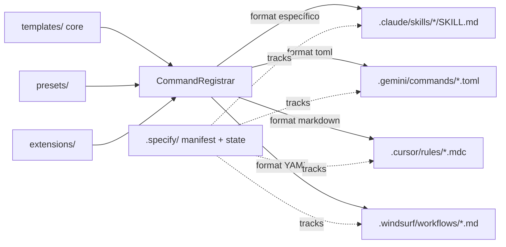
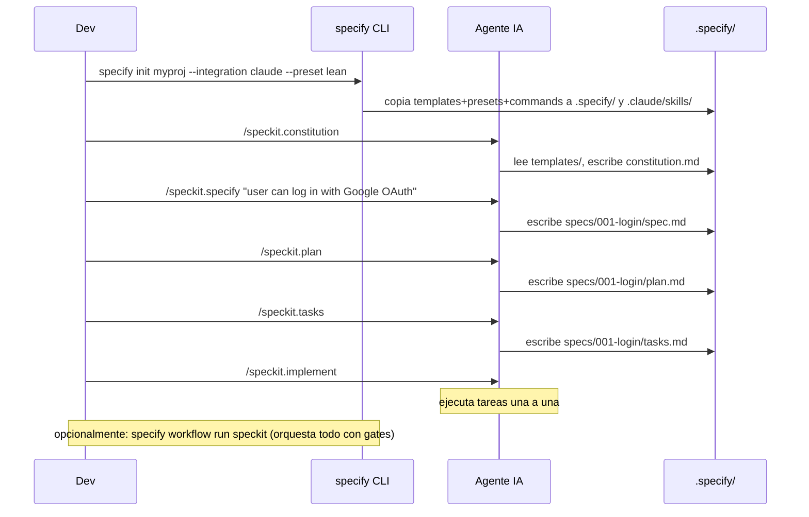

# Fase 1 — Reporte SpecKit

- **Date**: 2026-05-11 22:29
- **Document**: 20260511*222954*[RESEARCH]\_speckit-deep-audit.md
- **Category**: RESEARCH
- **Scope**: Fase 1 de la comparativa SpecKit vs Codi Core
- **Repo analizado**: `/Users/laht/projects/codi/projs/spec-kit` (vanilla `github/spec-kit`, sin fork)
- **Versión**: `0.8.6.dev0` — último release `0.8.5` (2026-05-04)
- **Actividad reciente**: 140 commits en los últimos 30 días

---

## 1. Qué es SpecKit

**SpecKit** es el CLI oficial (`specify`, paquete PyPI `specify-cli`) de **GitHub** para practicar **Spec-Driven Development (SDD)** con agentes de código. No es una herramienta de "mejor prompt": es un **motor de scaffolding + workflows** que inyecta en un proyecto:

1. Un directorio `.specify/` con plantillas, manifests y estado.
2. Un set de **slash-commands** (`/speckit.specify`, `/plan`, `/tasks`, `/implement`, `/clarify`, `/analyze`, `/checklist`, `/constitution`, `/taskstoissues`) **renderizados en el formato nativo de 29 agentes** distintos (Claude Code, Copilot, Cursor, Gemini, Windsurf, Codex, Opencode, etc.).
3. Un **engine de workflows YAML** con 10 primitivas (`command`, `shell`, `prompt`, `gate`, `if`, `switch`, `while`, `do-while`, `fan-out`, `fan-in`), runs persistentes y resumibles.
4. Tres ejes de extensibilidad: **integrations** (adaptadores de agente), **extensions** (capacidades nuevas con hooks `before_*` / `after_*` por fase), **presets** (overrides de plantillas/comandos con priority stack de 4 tiers).

Evidencia clave: `src/specify_cli/__init__.py` (5.869 LOC), `src/specify_cli/integrations/__init__.py:50-109` (29 agentes registrados), `pyproject.toml:19` (entry point `specify = "specify_cli:main"`).

---

## 2. Qué problema resuelve

Cita verbatim del manifesto (`spec-driven.md:7-9`):

> "Specifications don't serve code — code serves specifications. (…) SDD eliminates the gap by making specifications and their concrete implementation plans born from the specification executable."

Problema declarado:

- El gap entre PRD y código es la fuente principal de defectos y reescrituras.
- Los agentes de código actuales son lo bastante capaces para que la **especificación en lenguaje natural** se vuelva la fuente ejecutable y el código sea "the last mile" (`spec-driven.md:13`).
- Cada agente tiene su propio formato de prompts (`.claude/skills/`, `.gemini/commands/*.toml`, `.windsurf/workflows/`, `.cursor/rules/`, etc.) — re-escribir el mismo flujo SDD para cada agente es trabajo duplicado.

Lo que SpecKit ataca, en concreto:

- **Estandarizar el ciclo SDD** (constitution → specify → plan → tasks → implement → analyze) como prompts versionados.
- **Portabilidad cross-agente**: un mismo flow funciona en Claude, Copilot, Cursor, Gemini, etc. sin reescribir.
- **Gobernanza de los prompts**: presets y extensions con priority stack permiten override controlado.
- **Workflow orchestration con human-in-the-loop** vía gates (`gate` step type).

---

## 3. Cómo funciona

Pipeline en tres capas:

1. **`specify init [name]`** (`__init__.py:962`, ~660 LOC) — copia plantillas core a `.specify/`, registra una integration (agente target), escribe los slash-commands en su directorio nativo, crea `integration.json` con el estado y un `IntegrationManifest` con SHA256 de cada archivo instalado (para upgrade/uninstall seguros).

2. **El developer abre su agente** y ejecuta `/speckit.specify <descripción>`. El prompt fuerza al LLM a leer `.specify/extensions.yml`, evaluar hooks `before_specify` y emitir `EXECUTE_COMMAND: speckit.git.feature` cuando aplica (`templates/commands/specify.md:22-54`). **La obediencia depende del LLM** — no hay runtime interceptor.

3. **Resolución de templates en runtime** con priority stack (`README.md:347-353`):
   1. `.specify/templates/overrides/` (project-local)
   2. `.specify/presets/<active>/templates/` (preset)
   3. `.specify/extensions/<ext>/templates/` (extension)
   4. `.specify/templates/` (core)

4. **`specify workflow run speckit`** ejecuta YAML con gates humanos. `RunState` se persiste como JSON; `specify workflow resume <id>` retoma desde `current_step_id`.

5. **Upgrades**: `specify integration upgrade` / `extension update` reinstala sólo archivos cuyo SHA256 no haya cambiado, preservando edits del usuario (`integrations/manifest.py:20-26`).

---

## 4. Flujo principal

Variante orquestada: `specify workflow run speckit` corre los cuatro comandos como pasos YAML con `gate` humano entre cada par (review-spec, review-plan), `on_reject: abort` (`workflows/speckit/workflow.yml`).

---

## 5. Conceptos centrales

| Concepto            | Definición                                                                                                       | Evidencia                                                         |
| ------------------- | ---------------------------------------------------------------------------------------------------------------- | ----------------------------------------------------------------- |
| **Specification**   | Documento markdown que describe el "qué", no el "cómo". Generado por `/speckit.specify`.                         | `templates/spec-template.md`, `spec-driven.md:7`                  |
| **Plan**            | Descomposición técnica del spec. Generado por `/speckit.plan`.                                                   | `templates/plan-template.md`                                      |
| **Tasks**           | Lista atómica derivada del plan. Generada por `/speckit.tasks`.                                                  | `templates/tasks-template.md`                                     |
| **Constitution**    | Principios inmutables del proyecto que el agente debe respetar en todo el ciclo.                                 | `templates/constitution-template.md`                              |
| **Integration**     | Adaptador a un agente concreto (Claude, Gemini, …). Subclase de `IntegrationBase` con `key`, `folder`, `format`. | `src/specify_cli/integrations/<key>/__init__.py`                  |
| **Preset**          | Bundle YAML que override plantillas/comandos del core con estrategia `replace/prepend/append/wrap`.              | `presets/lean/preset.yml`, `presets/scaffold/preset.yml:36-43`    |
| **Extension**       | Capacidad adicional con propios commands + hooks `before_*` / `after_*` por fase SDD. Versionado semver.         | `extensions/git/extension.yml`                                    |
| **Workflow**        | YAML orquestable con 10 step types, gates humanos, runs persistentes.                                            | `workflows/speckit/workflow.yml`, `workflows/engine.py` (778 LOC) |
| **Priority Stack**  | Mecanismo de override en 4 tiers (overrides > presets > extensions > core).                                      | `README.md:347-353`                                               |
| **Manifest SHA256** | Tracking por archivo instalado: upgrades reinstalan solo lo intacto, preservan edits.                            | `integrations/manifest.py:20-26`                                  |
| **RunState**        | JSON persistente con `step_results`, `current_step_id`, `status`. Habilita resume.                               | `workflows/base.py:28-36`, `__init__.py:5373`                     |

---

## 6. Artefactos que usa o genera

**Generados en el proyecto del usuario:**

- `.specify/integration.json` — qué agente está activo, opciones de init.
- `.specify/feature.json` — puntero al feature dir actual.
- `.specify/extensions.yml` — lista de extensions instaladas, prioridades y `enabled`.
- `.specify/presets/<name>/` — preset activo + overrides.
- `.specify/extensions/<name>/` — extension instalada.
- `.specify/templates/` — core templates editables.
- `.specify/workflows/<name>/` + runs JSON.
- `.{agent}/` — slash-commands renderizados (formato variable por agente).
- `specs/<NNN>-<slug>/{spec,plan,tasks,research}.md` — artefactos SDD por feature.
- `<AGENT>.md` (CLAUDE.md, GEMINI.md, COPILOT.md…) — context file de cada agente.

**Que consume del repo:** `templates/` (core), `presets/` (bundle), `extensions/` (bundle), `integrations/` (registry de 29 adaptadores), `workflows/speckit/` (bundle).

**Formato cross-agente:** `MarkdownIntegration`, `TomlIntegration`, `YamlIntegration`, `SkillsIntegration` (`integrations/base.py`, 1.494 LOC) — cada uno traduce el mismo prompt fuente al formato del agente target.

---

## 7. Capacidades para developers individuales

- **Bootstrap en un comando**: `specify init` (instala todo, sin descarga de red — bundles vía `[tool.hatch.build.targets.wheel.force-include]` en `pyproject.toml:28-46`).
- **`specify check`** — diagnóstico de prerequisites.
- **`specify self check/upgrade`** — autodiagnóstico y autoupgrade del CLI.
- **CLI conversational con Rich**: prompts interactivos en TTY, modo no-interactivo en CI vía flags.
- **Cross-platform**: scripts mirror en `scripts/bash/` y `scripts/powershell/`.
- **Multi-agente**: el mismo SpecKit funciona si el dev usa Claude hoy y se cambia a Cursor mañana (`specify integration switch cursor`).
- **Single workflow `speckit`** lista para correr sin configurar nada.

---

## 8. Capacidades para equipos

- **Artefactos versionados en repo**: `.specify/` y `specs/` se commitean → la fuente de verdad es git.
- **Integration manifest con SHA256**: dos developers pueden editar comandos sin que un `specify upgrade` les pise el trabajo (`integrations/manifest.py`).
- **Presets compartidos**: un equipo define un preset propio (en su catálogo privado o local), lo distribuye con `specify preset add <url>`.
- **Extensions catalog community**: 80+ extensions externas en `integrations/catalog.community.json` + `README.md:196-285` (project health check, git workflow, design docs, etc.).
- **Workflow gates con `requires_approver`** — `gate` step puede serializar revisión humana (`workflows/steps/gate/__init__.py`).
- **Resumibilidad**: dev A inicia un workflow, dev B lo retoma con `specify workflow resume <run_id>`.
- **Constitution como ley del proyecto**: `/speckit.constitution` materializa principios compartidos que el agente respeta en cada `/specify` y `/plan`.

**Limitaciones de team-first identificadas en evidencia:**

- No hay autenticación / ACL en gates ("planned enhancement" — `workflows/engine.py:50-52` comenta `requires:` aún no aplicado).
- No hay sync de runs cross-machine (RunState está en `.specify/` local, no en backend compartido).
- Captura de stdout/stderr de comandos shell está marcada como "planned enhancement" en `steps/command/__init__.py:25`.

---

## 9. Capacidades para estandarización

| Mecanismo                                                             | Cobertura                                                                                                            | Evidencia                            |
| --------------------------------------------------------------------- | -------------------------------------------------------------------------------------------------------------------- | ------------------------------------ |
| Slash-commands canónicos (9 verbos SDD)                               | Alta — mismo flow en 29 agentes                                                                                      | `templates/commands/*.md`            |
| `constitution.md` como ley del proyecto                               | Alta — el agente debe respetarla en cada step                                                                        | `templates/constitution-template.md` |
| Priority stack documentado                                            | Alta — orden determinista de overrides                                                                               | `README.md:347-353`                  |
| `extension.yml` con `schema_version`, `requires`, `provides`, `hooks` | Media — schema bien definido pero "enforcement is a planned enhancement" (`workflows/engine.py:50`)                  | `extensions/git/extension.yml:1-50`  |
| Linter de artefactos cross-`.specify/`                                | Baja — no existe un único linter; sí `validate_workflow()` y validaciones aisladas en `extensions.py` / `presets.py` | `workflows/engine.py:97`             |

---

## 10. Capacidades para sincronización

- **`specify integration upgrade`** — upgrade idempotente del agente target preservando archivos editados.
- **`specify extension update`** — análogo para extensions.
- **`specify preset add <url>`** — sincroniza un preset desde catálogo remoto (HTTP, git, local).
- **`specify init` sin red**: assets bundleados en el wheel (`pyproject.toml:28-46`, comentario: _"Bundle core assets so 'specify init' works without network access (air-gapped / enterprise)"_).
- **Catálogos de presets/extensions/workflows**: `specify preset catalog add <url>` permite a un equipo hostear su propio registry interno.

**Gap claro vs Codi**: no hay `specify generate` (regeneración determinista de todos los `.<agent>/` desde `.specify/`). El equivalente conceptual es `specify integration upgrade <key>` pero opera por integration, no como un "single source → many outputs" cross-agente.

---

## 11. Capacidades para calidad

- **Gates en workflows** (review-spec, review-plan) con `on_reject: abort` — human-in-the-loop forzado.
- **`/speckit.analyze`** — comando que pide al agente revisar el plan antes de implementar.
- **`/speckit.clarify`** — comando para resolver ambigüedades del spec antes de planear.
- **`/speckit.checklist`** — generación de checklists por feature.
- **Tests robustos del propio CLI**: 1.335 funciones test, 56 archivos, pytest matrix `[ubuntu, windows] × [py3.11/3.12/3.13]`, ruff, markdownlint, CodeQL en CI.
- **Validación de archivos en init**: `test_registrar_path_traversal.py` cubre seguridad de paths.

**Gaps:**

- **No hay hooks deterministas sobre el agente**: los `before_*` / `after_*` se ejecutan **por confianza en el LLM** (el prompt le pide al LLM emitir `EXECUTE_COMMAND:` — el agente puede ignorarlo). No es un PreToolUse interceptor.
- **No hay captura de defectos** del agente para feedback loop.
- **Quality-gates declarativos (como tiene Codi en skills)** — ausentes en SpecKit (las skills generadas son prompts SDD, sin frontmatter `quality-gates:`).

---

## 12. Capacidades para adopción progresiva

- **Path de adopción claro**: `specify init` → `/speckit.constitution` → primer `/speckit.specify` → primer commit. Un developer puede empezar solo, sin que el equipo cambie nada.
- **Preset `lean`**: 5 comandos minimales. Override del core sin asumir SDD completo (`presets/lean/preset.yml:7` — _"just the prompt, just the artifact"_).
- **Multi-agente desde día 0**: si el equipo usa varios IDEs, SpecKit no fuerza convergencia.
- **`specify integration switch`** — cambiar de agente target sin perder specs ni history.
- **Extensions opt-in**: `git`, `selftest`, `template` bundled + 80 community. Cada equipo decide qué activa.
- **CHANGELOG explícito**: ritmo de release semanal con notas claras (0.8.2 → 0.8.5 en 6 días).

---

## 13. Capacidades para reducir fricción

| Fricción                              | Mitigación SpecKit                                                                 |
| ------------------------------------- | ---------------------------------------------------------------------------------- |
| Setup tooling                         | `specify init` un solo comando, sin red                                            |
| Aprender el flujo                     | 9 slash-commands con nombres autoexplicativos + templates con instrucciones inline |
| Configurar un agente                  | 29 adaptadores listos; `specify integration use <key>`                             |
| Coordinar review                      | `gate` step en workflow YAML                                                       |
| Reescribir prompts entre agentes      | Cero — el mismo prompt source se renderiza en N formatos                           |
| Empezar de cero en proyecto existente | `specify init .` reusa el directorio actual                                        |

**Fricciones residuales detectadas:**

- Aprender YAML de workflows con expresiones `{{ inputs.x }}` / `{{ steps.<id>.output.<k> }}` (`expressions.py`, 300 LOC) tiene una curva no trivial.
- Modelo "hooks dependientes del LLM" puede sorprender — un dev espera que `before_specify` se ejecute; el agente puede ignorarlo si no obedece el prompt.
- 29 agentes ≠ 29 niveles de soporte uniforme: el detalle de qué tan bien renderiza cada uno depende de la calidad del adaptador (algunos son `MarkdownIntegration` puro, otros como Claude usan `SkillsIntegration` con subdirectorios).

---

## 14. Fortalezas

1. **Respaldo y reputación de GitHub.** Licencia MIT, Copyright GitHub Inc. Adopción institucional probable.
2. **29 agentes soportados con tests aislados por integration** (`tests/integrations/test_integration_<agent>.py` ×30). Es el set más amplio que he visto en un tool de este nicho.
3. **Engine de workflows con 10 step primitives.** Estructuralmente más rico que la mayoría de competidores: gate humano, fan-out/fan-in, while/do-while, switch, if/then.
4. **Priority stack determinista de 4 tiers** — overrides > presets > extensions > core. Mecánica clara, documentada, testada.
5. **SHA256 manifest** preserva ediciones del usuario en upgrades. Práctica de class-A en CLIs de scaffolding.
6. **Test density**: 1.335 funciones test sobre 20.795 LOC ≈ ratio sano. CI matriz cross-OS / cross-Python.
7. **Air-gapped por defecto**: `specify init` no descarga assets (bundleados en wheel).
8. **Manifesto SDD claro** (`spec-driven.md`, 25k bytes) — modelo mental coherente que facilita adopción cultural.
9. **Cadencia activa**: 140 commits/30d, releases semanales, ~25 PRs community/mes.
10. **Catalog system para presets/extensions/workflows con HTTP/git/local** — modelo de distribución pluggable.

---

## 15. Debilidades

1. **Hooks "by trust"**: la "ejecución" de hooks `before_*/after_*` depende de que el LLM siga la instrucción del prompt — no es un interceptor de tool calls. Si el agente decide ignorarlo, no se entera nadie. **Esto es estructural, no un bug**.
2. **Sin captura de prompts/responses del agente.** Comentario explícito en código: _"Full stdout/stderr capture is a planned enhancement"_ (`steps/command/__init__.py:25`).
3. **Sin memoria persistente / brain**. No hay loop de "el agente aprende de runs anteriores".
4. **Sin loop de mejora continua de los propios artefactos**. No hay `skill-reporter` ni `refine-rules` — los prompts se mejoran por PR, no automáticamente.
5. **`requires:` schema declarado pero no enforcado** — comentario _"enforcement is a planned enhancement"_ (`workflows/engine.py:50-52`).
6. **Solo un workflow bundled** (`speckit`). El motor es rico pero el ecosistema de workflows propios es embrionario.
7. **Sin "single linter" cross-`.specify/`**. Validación está fragmentada por sub-area (`validate_workflow`, manifest validation por separado).
8. **Skills generadas son prompts SDD genéricos**, sin frontmatter `phases:` / `chains:` / `quality-gates:` declarativas. La granularidad semántica es menor que en frameworks tipo Codi.
9. **Modelo mental relativamente alto** — un dev junior necesita entender qué es spec/plan/tasks/constitution/extension/preset/workflow antes de ser productivo. Hay 7 vocablos nuevos.
10. **Gates humanos sin ACL/auth**: cualquiera con acceso al filesystem puede approve. Para equipos regulados, gap claro.

---

## 16. Riesgos

| Riesgo                                                                                                                 | Severidad | Mitigación posible                                                         |
| ---------------------------------------------------------------------------------------------------------------------- | --------- | -------------------------------------------------------------------------- |
| Trust-based hooks → divergencia en cumplimiento entre developers (un agente obedece, otro no)                          | **Alta**  | Layer de runtime hook executor (mencionado en código pero no implementado) |
| Ausencia de telemetría → no se detecta dónde se atasca el equipo                                                       | **Alta**  | Wrapper externo o extension community (no oficial)                         |
| Vendor-lock blando hacia GitHub: el roadmap lo decide GitHub Inc.                                                      | Media     | Es OSS MIT, fork posible si la dirección diverge                           |
| 29 integrations ≠ 29 con misma profundidad: el agente "favorito" del equipo puede ser un `MarkdownIntegration` minimal | Media     | Auditar la integration concreta antes de adoptar                           |
| Workflow YAML con 10 primitivas + expressions ≈ DSL → curva                                                            | Media     | Bundling de más workflows ejemplo                                          |
| Constitution sin enforcement automático: el agente puede violarla; no hay check estructural                            | Media     | Lint custom o gate humano                                                  |
| `.specify/` versioned en git → conflictos de merge en proyectos con muchos features simultáneos                        | Baja      | Pattern de feature branches (la extension `git` ayuda)                     |
| 80+ extensions community sin curación uniforme                                                                         | Baja      | `specify extension info` muestra metadatos; auditar antes de instalar      |

---

## 17. Señales de madurez

| Señal                                                       | Valor                                                                         | Lectura                                                                                        |
| ----------------------------------------------------------- | ----------------------------------------------------------------------------- | ---------------------------------------------------------------------------------------------- |
| LOC Python `src/`                                           | 20.795                                                                        | Base sustancial pero abarcable                                                                 |
| Funciones test                                              | 1.335                                                                         | Cobertura amplia                                                                               |
| Commits 30d                                                 | 140                                                                           | Muy activo                                                                                     |
| Releases en 6 días                                          | 4 (0.8.2 → 0.8.5)                                                             | Cadencia patch alta — útil pero indica producto aún no estable (pre-1.0)                       |
| Cross-platform CI                                           | Linux + Windows × Python 3.11/3.12/3.13                                       | Profesional                                                                                    |
| Actions pinneadas por SHA                                   | Sí (commit `09f7657`)                                                         | Security-mature                                                                                |
| Community extensions catalogadas                            | 80+                                                                           | Ecosistema en formación                                                                        |
| Documentación                                               | `README.md` 56k bytes + `spec-driven.md` 25k + `AGENTS.md` 15k + `docs/` site | Cobertura amplia                                                                               |
| Issue templates + CONTRIBUTING + SECURITY + Code of Conduct | Sí                                                                            | Listo para community contributions                                                             |
| Branches activos en origin                                  | 6 (con copilot/\* branches)                                                   | Roadmap visible: authentication-provider-registry, community-installable-steps, tar-gz support |
| Pre-1.0 (0.8.x)                                             | Sí                                                                            | Breaking changes esperables — verificar release notes en cada upgrade                          |
| Licencia                                                    | MIT (GitHub Inc.)                                                             | Sin friction para enterprise                                                                   |
| Comentarios "planned enhancement" en código                 | ≥3 (HookExecutor, requires enforcement, stdout/stderr capture)                | Hay gaps conscientes; documentados                                                             |

**Veredicto madurez**: **producto serio pero pre-1.0**. Diseño limpio, tests sólidos, equipo activo, pero hay funcionalidades clave (hook executor real, captura de output, requires enforcement) declaradas como "planned". Adopción razonable hoy si se aceptan estos gaps; no si se necesita el hook executor determinista.

---

## 18. Preguntas abiertas

1. **¿Existe un HookExecutor real fuera del prompt-trust?** Mencionado en `templates/commands/specify.md:30` pero no encontrado en `src/`. ¿Está en alguna PR abierta?
2. **¿Cómo se autentica un `gate` step para approval cross-team?** No hay ACL aparente; ¿el modelo es "self-serve"?
3. **¿Hay plan para captura de prompts/responses del agente?** El comentario _"Full stdout/stderr capture is a planned enhancement"_ sugiere sí — ¿ETA?
4. **¿Cómo conviven `.specify/` y conflicts en merges paralelos**? La extension `git` ayuda con feature branches pero ¿qué pasa con runs de workflow corridos por dos devs?
5. **¿`specify integration upgrade` preserva customizaciones por extension/preset también o sólo del core?** Test relevante: `test_upgrade.py` — habría que leer para confirmar.
6. **¿`specify generate` existe en alguna forma?** El equivalente conceptual sería "regenerar todos los `.<agent>/` desde `.specify/` cross-agente en un solo comando" — ahora la lógica vive en `init` y `integration upgrade`, no en un comando idempotente "all-in-one".
7. **¿La constitution se enforce de algún modo programático o sólo por instrucción al LLM?** Si es sólo prompt → mismo riesgo que hooks.
8. **¿Cuál es el path real para añadir un agente IA nuevo no listado?** ¿Es solo escribir un subpackage con `IntegrationBase`? El test density por integration (~30 archivos) sugiere que sí, pero ¿hay un comando `specify integration scaffold <key>`?
9. **¿Existe captura/observabilidad opcional vía extension?** Habría que revisar `integrations/catalog.community.json` por extensions tipo "telemetry".
10. **¿Compatibilidad con CI/CD**: ¿se puede ejecutar `specify workflow run` en non-TTY headless con todos los gates en `auto-approve` o equivalente? Los gates devuelven `PAUSED` en CI según `steps/gate/__init__.py:46-48` — ¿qué patrón usa GitHub internamente?

---

## Cierre Fase 1

**Tesis a confirmar en Fase 2**: SpecKit es un excelente **"scaffolding + workflow engine for SDD cross-agent"** con priority stack profesional y muy buena cobertura de agentes, pero **delega calidad y enforcement al LLM** (no intercepta el agente). Codi parece operar en la capa inferior: **interceptor de eventos + memoria persistente + skills semánticamente ricas + linting cross-artifact**. Si esa intuición se confirma, ambos no son sustitutivos sino **complementarios en planos diferentes** — pero confirmaremos con la auditoría del core de Codi en Fase 2.
