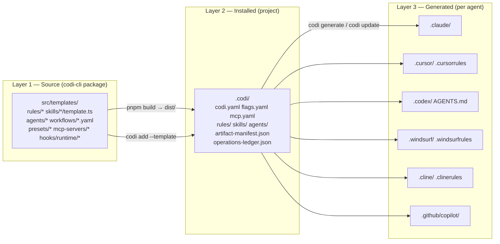
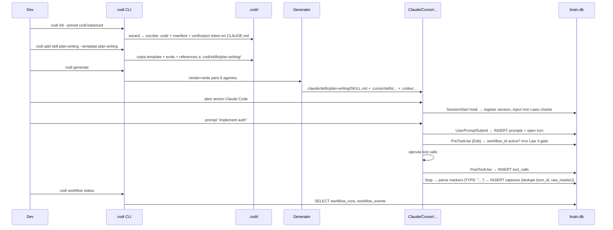

# Fase 2 — Reporte Codi Core

- **Date**: 2026-05-11 22:42
- **Document**: 20260511*224243*[RESEARCH]\_codi-core-deep-audit.md
- **Category**: RESEARCH
- **Scope**: Fase 2 de la comparativa SpecKit vs Codi Core
- **Repo analizado**: `/Users/laht/projects/codi`
- **Versión**: `codi-cli@3.0.0`
- **Branch**: `feature/codi-v3-harness` (HEAD `5873abd8`)
- **Actividad reciente**: 301 commits en los últimos 30 días

---

## 1. Qué es Codi

**Codi** (paquete npm `codi-cli`, MIT, autor `lehidalgo`) es una **plataforma unificada de configuración para agentes de código IA**. No es un toolkit de prompts ni un workflow engine SDD: es una plataforma con tres responsabilidades simultáneas:

1. **Generador cross-agente**: un único conjunto de artefactos (rules, skills, agents) en `.codi/` se compila al formato nativo de **6 agentes target** — Claude Code, Cursor, Codex, Windsurf, Cline y GitHub Copilot.
2. **Runtime de hooks deterministas + brain persistente**: intercepta eventos reales del agente (PreToolUse, PostToolUse, UserPromptSubmit, SessionStart, Stop) y persiste capturas, prompts, tool_calls y workflow events en `~/.codi/brain.db` (SQLite con FTS5).
3. **Motor de workflows con Iron Laws**: lifecycle phase-based (intent → plan → execute → done) con gates humanos enforced ("Iron Law 4: type 'ok' to authorize"), persistido en brain.db con resume.

Evidencia: `package.json`, `src/cli.ts:54-84` (28 `register*` calls), `src/adapters/index.ts:31-38` (6 adapters), `src/runtime/brain/schema.ts:14-204` (11 tablas), `src/runtime/iron-laws-enforcer.ts:62-90`, `README.md:6,10` (_"One config. Every AI agent. Zero drift."_).

---

## 2. Qué problema resuelve

Tagline literal (`README.md:6,10`):

> _"One config. Every AI agent. Zero drift."_
> _"Define your rules, skills, and workflows once in `.codi/` — Codi generates the correct configuration for Claude Code, Cursor, Codex, Windsurf, Cline, and GitHub Copilot automatically."_

Problemas declarados que ataca:

| Problema                                                                                                | Mecanismo Codi                                                               |
| ------------------------------------------------------------------------------------------------------- | ---------------------------------------------------------------------------- |
| Drift de configuración entre developers (cada uno con su `.cursorrules` distinto)                       | `.codi/` versionado + `codi generate` idempotente con hash detection         |
| Drift de configuración entre agentes IA del mismo dev (Claude vs Cursor vs Codex con prompts distintos) | Single-source `.codi/` → adaptadores por agente                              |
| Agente que viola reglas del proyecto silenciosamente                                                    | Iron Laws + runtime hooks deterministas (PreToolUse interceptor)             |
| Falta de memoria entre sesiones del agente                                                              | `brain.db` persistente con captures, prompts, tool_calls, FTS5 search        |
| Falta de loop de mejora de los artefactos del agente                                                    | `evals-manager` + `feedback-collector` + `skill-improver` + `skill stats`    |
| Onboarding desordenado                                                                                  | `codi init` wizard interactivo + presets + verification token                |
| Imposibilidad de auditar qué hizo el agente                                                             | `operations-ledger.json` + `audit-log.jsonl` + brain-UI con 7 páginas        |
| Skills duplicadas / inconsistentes entre miembros                                                       | Manifest con `contentHash`, `managed_by` ownership, version-bump enforcement |

---

## 3. Cómo funciona

Pipeline en tres capas (fuente: `CLAUDE.md:22-36`):

Mecánica concreta:

1. **`codi init`** (`src/cli/init.ts`, 799 LOC) — wizard con `@clack/prompts` selecciona preset (`codi-balanced` default), agents target, rules/skills/agents adicionales; escribe `.codi/codi.yaml`, `flags.yaml`, `mcp.yaml`, `artifact-manifest.json`; instala hooks runtime y git hooks; inyecta verification token en `CLAUDE.md`.
2. **`codi add <type> <name>`** — copia desde `dist/templates/` (compilado de `src/templates/`) a `.codi/<type>/<name>/` con `template.ts`, `evals/`, `references/`, `scripts/`, `README.md`.
3. **`codi generate`** (`src/cli/generate.ts`, 308 LOC + `src/core/generator/apply.ts`) — para cada agente target activo:
   - Render in-memory con `generator.ts` (partition de frontmatter via `PLATFORM_SKILL_FIELDS` map, `src/adapters/skill-generator.ts:24-60`).
   - Detect-orphans, write con `--on-conflict` policy, delete-orphans, update-state.
   - Idempotente: usa `sourceHash` y `generatedHash` (vía `hashContent`, SHA) para drift detection.
4. **`codi update`** (`src/cli/update.ts`, 798 LOC) — usa `template-hash-registry.ts` + `artifact-manifest.json` (`contentHash` por entry) para clasificar artefactos como `up-to-date | outdated | new | removed | user-managed`. **`managed_by: user` nunca se auto-actualiza** (`src/core/version/upgrade-detector.ts:55-66`).
5. **Hooks runtime** — el archivo `src/templates/hooks/runtime/hooks.json` declara 5 hook events que Claude Code (u otro agente compatible) invoca vía shell wrappers. Cada wrapper llama `tsx` con scripts TS en `scripts/runtime/hook-<event>.ts`. La lógica núcleo está en `src/runtime/hooks/runner.ts` (fail-open con timeout 30s, agrega verdicts → exit 0/2 + stderr).

---

## 4. Flujo principal

Variante orquestada: `codi workflow run feature "implement auth"` crea un `workflow_runs` row, secuencia las fases (intent → plan → execute → verify), pide gate humano (`'ok'`) entre fases, persiste eventos en `workflow_events`. El agente IA es invitado a ejecutar la fase actual leyendo `references/phase-<n>.md` (regenerado por `scripts/regenerate-phase-refs.mjs` desde el YAML del workflow).

---

## 5. Conceptos centrales

| Concepto                                         | Definición                                                                                                                                                | Evidencia                                                                            |
| ------------------------------------------------ | --------------------------------------------------------------------------------------------------------------------------------------------------------- | ------------------------------------------------------------------------------------ |
| **Pipeline 3 niveles**                           | source `src/templates/` → installed `.codi/` → generated `.{agent}/`. Cada nivel tiene reglas distintas de edición.                                       | `CLAUDE.md:22-36`                                                                    |
| **Adapter**                                      | TS class que conoce el formato/dir de un agente target. Subset de frontmatter campos por agente. 6 builtin.                                               | `src/adapters/index.ts:31-38`, `src/adapters/skill-generator.ts:24-60`               |
| **Preset**                                       | Bundle de rules/skills/agents/flags. 6 builtin (`minimal`, `balanced`, `strict`, `fullstack`, `dev`, `power-user`) + zip/github/local/registry.           | `src/templates/presets/index.ts:12-19`, `src/core/preset/preset-resolver.ts:14-40`   |
| **Rule**                                         | Markdown con frontmatter Zod-validado (name, version, priority, scope, alwaysApply, managed_by). 31 builtin.                                              | `src/schemas/rule.ts:15-62`                                                          |
| **Skill**                                        | Markdown SKILL.md + `template.ts` + `evals/` + `references/` + `scripts/`. 29 campos frontmatter. ~70 builtin.                                            | `src/schemas/skill.ts:19-133`, `src/adapters/skill-generator.ts`                     |
| **Agent (codi-\*)**                              | Definición de subagent para Task tool delegation. 21 builtin.                                                                                             | `src/schemas/agent.ts:16-100`, `src/templates/agents/*.ts`                           |
| **Workflow**                                     | YAML con `phases` → `gates` → `chains` (skills por fase) → `next`. 7 builtin (feature, bug-fix, refactor, migration, project, quick, team-consolidation). | `src/templates/workflows/*.yaml`, `src/runtime/workflows/types.ts:53-85`             |
| **Iron Laws (1-9)**                              | 9 leyes constitucionales aplicadas runtime. Law 4 = gate human "ok"; Law 7 = git mutation needs "ok"; Law 9 = capture markers.                            | `src/runtime/iron-laws-enforcer.ts:62-90,196`, `src/runtime/capture/markers.ts:1-17` |
| **Capture (Iron Law 9)**                         | Marker `\|TYPE: "verbatim"\|` emitido por el agente al final del turn. 11 tipos canónicos. Idempotente por `(turn_id, raw_marker)`.                       | `src/runtime/capture/markers.ts`, `src/runtime/capture/persist.ts:38-65`             |
| **Brain**                                        | SQLite (`~/.codi/brain.db`) con 11 tablas + FTS5. Source of truth para sesiones, prompts, captures, tool_calls, workflow_runs.                            | `src/runtime/brain/schema.ts:14-204`                                                 |
| **Runtime Hook**                                 | Wrapper TS llamado por el agente vía `hooks.json`. 5 events. Fail-open con timeout.                                                                       | `src/templates/hooks/runtime/hooks.json`, `src/runtime/hooks/runner.ts`              |
| **artifact-manifest.json**                       | Lista de artefactos instalados con `contentHash`, `installedArtifactVersion`, `managedBy`, `source` (provenance).                                         | `src/core/version/artifact-manifest.ts:24-42,176,282`                                |
| **operations-ledger.json** + **audit-log.jsonl** | Log append-only de operaciones para auditoría.                                                                                                            | `src/core/audit/operations-ledger.ts`, `src/core/audit/audit-log.ts`                 |
| **Brain-UI**                                     | Hono server local en puerto 4477. 7 HTML pages + REST v1 API + SSE. Read-only, CSRF-guarded a loopback.                                                   | `src/runtime/brain-ui/server.ts`, `lifecycle.ts:13-15`                               |
| **Verification token**                           | String estable inyectado en `CLAUDE.md` para que el agente confirme adopción de Codi.                                                                     | `src/core/verify/token.ts`, `CLAUDE.md`                                              |

---

## 6. Qué partes pertenecen al CORE

LOC core (excluyendo `src/templates/`): **66.260 LOC TypeScript**.

| Subsistema core                                                                  | Path                                                   | Archivos                                                                                                      | LOC    | Rol                                                                                 |
| -------------------------------------------------------------------------------- | ------------------------------------------------------ | ------------------------------------------------------------------------------------------------------------- | ------ | ----------------------------------------------------------------------------------- |
| CLI surface                                                                      | `src/cli/`                                             | 56                                                                                                            | 16.279 | 28 comandos top-level con commander                                                 |
| Generator + adapters                                                             | `src/core/generator/`, `src/adapters/`                 | varios                                                                                                        | ~3.500 | Traducción `.codi/` → agentes                                                       |
| Config (parse/compose/resolve/validate/state)                                    | `src/core/config/`                                     | 5                                                                                                             | n/a    | Lectura de `.codi/`                                                                 |
| Scaffolder                                                                       | `src/core/scaffolder/`                                 | varios                                                                                                        | n/a    | Copia template → `.codi/`                                                           |
| Version / manifest                                                               | `src/core/version/`                                    | 3 (`artifact-manifest.ts`, `template-hash-registry.ts`, `upgrade-detector.ts`)                                | 794    | Hashing + upgrade detection                                                         |
| Preset manager                                                                   | `src/core/preset/`                                     | varios                                                                                                        | 2.044  | Builtin + remote presets                                                            |
| Hooks (git + runtime)                                                            | `src/core/hooks/` + `src/runtime/hooks/`               | varios                                                                                                        | 11.198 | Hook installer + runtime runner                                                     |
| Brain                                                                            | `src/runtime/brain/`, `src/runtime/brain-ui/`          | varios                                                                                                        | 17.794 | SQLite + FTS5 + Hono UI                                                             |
| Capture                                                                          | `src/runtime/capture/`                                 | 6                                                                                                             | n/a    | Iron Law 9 parser + persist                                                         |
| Workflows runtime                                                                | `src/runtime/workflows/` (registry + 5 adapters)       | varios                                                                                                        | n/a    | WorkflowAdapter lifecycle                                                           |
| CLI handlers (workflow lifecycle)                                                | `src/runtime/cli-handlers/`                            | varios                                                                                                        | ~2000  | `runWorkflow`, transitions, scope, elevation, handover, stats                       |
| Iron Laws enforcer                                                               | `src/runtime/iron-laws-enforcer.ts`                    | 1                                                                                                             | 200+   | Laws 4-8 deterministic                                                              |
| Gate runner                                                                      | `src/runtime/gate-runner.ts` + `gate-runner-bridge.ts` | 2                                                                                                             | n/a    | Deterministic checkers + agent fallback                                             |
| Schemas Zod                                                                      | `src/schemas/`                                         | 11+                                                                                                           | n/a    | manifest, rule, skill, agent, preset, mcp, hooks, flag, feedback, evals, skill-test |
| Output / logger                                                                  | `src/core/output/`                                     | 7                                                                                                             | n/a    | `--json`, `--quiet`, exit codes                                                     |
| Audit ledger                                                                     | `src/core/audit/`                                      | 2                                                                                                             | n/a    | `operations-ledger.json`, `audit-log.jsonl`                                         |
| Onboard                                                                          | `src/core/onboard/` + `src/cli/onboard.ts`             | varios                                                                                                        | n/a    | Programmatic onboarding                                                             |
| Skill improver                                                                   | `src/core/skill/`                                      | 5 (`evals-manager`, `feedback-collector`, `skill-stats`, `skill-improver`, `version-manager`, `skill-export`) | n/a    | Continuous improvement loop                                                         |
| External source                                                                  | `src/core/external-source/`                            | varios                                                                                                        | n/a    | Connectors local/zip/github                                                         |
| Doctor / verify / capabilities / migration / backup / flags / scanner / security | varios                                                 | varios                                                                                                        | n/a    | Subsistemas auxiliares                                                              |

---

## 7. Qué partes son artefactos reemplazables

LOC en `src/templates/` (TS + MD embebido): **147.747 LOC** — son strings TS, pero conceptualmente son data, no código.

| Tipo                | Path                                                           | Cantidad                                                                                    | Reemplazable porque                                                                                                                                   |
| ------------------- | -------------------------------------------------------------- | ------------------------------------------------------------------------------------------- | ----------------------------------------------------------------------------------------------------------------------------------------------------- |
| Rules builtin       | `src/templates/rules/*.ts`                                     | 31                                                                                          | Cualquier proyecto puede sobreescribir con `managed_by: user` en `.codi/rules/`                                                                       |
| Skills builtin      | `src/templates/skills/<name>/`                                 | ~70                                                                                         | Idem, `managed_by: user` o nuevo skill                                                                                                                |
| Agents builtin      | `src/templates/agents/*.ts`                                    | 21                                                                                          | Idem                                                                                                                                                  |
| Workflows builtin   | `src/templates/workflows/*.yaml`                               | 7 (`bug-fix`, `feature`, `migration`, `project`, `quick`, `refactor`, `team-consolidation`) | El registry es estático (`src/runtime/workflows/registry.ts:39`), pero los YAML son data; los adapters TS también podrían externalizarse en el futuro |
| Presets builtin     | `src/templates/presets/*.ts`                                   | 6                                                                                           | `codi preset install` permite presets externos                                                                                                        |
| MCP servers builtin | `src/templates/mcp-servers/`                                   | varios                                                                                      | `codi add mcp-server <name>`                                                                                                                          |
| Hooks runtime       | `src/templates/hooks/runtime/`                                 | 5 events + scripts                                                                          | El protocolo lo define el agente (Claude Code); Codi provee la implementación                                                                         |
| Hooks pre-commit    | `src/core/hooks/hook-templates.ts` + `pre-commit-framework.ts` | varios                                                                                      | Las plantillas se generan en `.git/hooks/codi-*.mjs` y son data, no core                                                                              |

**Separación clara**: el core nunca importa contenido de `src/templates/` directamente para decidir lógica — usa el registry/loader pattern. La regla de oro (`CLAUDE.md`): _"Codi moves content through three distinct layers"_ — el core opera sobre layer 2 (`.codi/`), nunca sobre layer 1 (`src/templates/`) en runtime de proyecto consumidor.

---

## 8. Capacidades para developers individuales

- **`codi init`** wizard interactivo con `@clack/prompts` (TTY) y `--json` headless. Detección automática de agentes ya instalados (`detectAdapters`) y stack (`detectStack`).
- **`codi`** sin args lanza Command Center interactivo (`src/cli/hub.ts` 269 LOC + `hub-handlers.ts` 691 LOC).
- **6 presets builtin** — selección de un comando.
- **`codi doctor`** (248 LOC) — diagnóstico de hooks y entorno.
- **`codi watch`** — re-generate al cambio de `.codi/`.
- **`codi brain ui`** — abre UI local en puerto 4477 para inspeccionar sesiones, captures, workflows, tool-calls.
- **`codi quick "<task>"`** — atajo a workflow trivial sin overhead de phase chain (categorías: `typo|comment|dep-bump|format|doc-tweak`).
- **Multi-agente desde día 0**: el mismo `.codi/` produce config válida para 6 agentes; un dev puede cambiar de Claude a Cursor sin reescribir nada.
- **Verification token** en `CLAUDE.md` para confirmar adopción y bloquear sesiones sin Codi.

---

## 9. Capacidades para equipos

- **`.codi/` versionado en git**: source of truth compartida; merge conflicts en YAML/MD (no en binarios).
- **`artifact-manifest.json`** con `contentHash` + `installedArtifactVersion` + `managedBy` + `source` — dos devs pueden auditar quién posee qué artefacto y de dónde vino (`github:org/repo@sha`, `zip:`, `local:`).
- **`managed_by: user` ownership** — artefactos del equipo nunca se sobrescriben por `codi update`.
- **`codi update`** clasifica `outdated/new/removed/user-managed` — el lead puede revisar diff en PR antes de aceptar.
- **`codi contribute lint`** (9 checks) — bloquea PRs con edits en generados, falta de evals, falta de version bump, edits a `.husky/`, `--no-verify` en history, docs mal nombrados.
- **Workflow gates con Iron Law 4** (`'ok'` case-insensitive estricto) — review humano forzado en transición de fase. Auditoría completa en `workflow_events`.
- **Brain compartido por proyecto**: `~/.codi/brain.db` es por developer, pero contiene `project_id` + `git_remote` (`sessions.git_remote`) — el equipo puede agregar dashboards cross-developer.
- **Operations ledger** (`operations-ledger.json`) — log append-only de cada generate/update/install para auditoría.
- **Verification token** asegura que `codi list` revele a cualquier developer que abra el repo cómo está configurado.
- **AGENTS.md auto-generado (149 KB)** — espejo del catálogo Codi, mantenido por `regen:phase-refs` y `docs-update`. El equipo lee un único archivo para entender qué hay instalado.
- **`team-consolidation` workflow** — workflow específico para alinear/consolidar artefactos del equipo (no auditado en detalle aquí pero presente en `src/templates/workflows/team-consolidation.yaml`).

**Limitaciones de team-first:**

- Brain.db es **local por developer** — no hay backend compartido por defecto (se puede exportar vía `codi brain export`).
- Workflow lock es **single-process** vía `lock_held_pid` en metadata; dos devs no pueden colaborar en mismo workflow run simultáneamente.

---

## 10. Capacidades para estandarización

| Mecanismo                                           | Cobertura                                                                                                                                         | Evidencia                                               |
| --------------------------------------------------- | ------------------------------------------------------------------------------------------------------------------------------------------------- | ------------------------------------------------------- |
| Single source `.codi/` → 6 agentes                  | Alta                                                                                                                                              | `src/adapters/index.ts:31-38`                           |
| Frontmatter Zod schemas por tipo                    | Alta — `rule.ts`, `skill.ts`, `agent.ts`, `preset.ts`, `manifest.ts`, `mcp.ts`, `hooks.ts`, `flag.ts`, `feedback.ts`, `evals.ts`, `skill-test.ts` | `src/schemas/`                                          |
| Iron Laws 1-9 — leyes constitucionales runtime      | Alta — Law 4 (gate ok), Law 7 (git mutation ok), Law 9 (captures) son deterministas                                                               | `src/runtime/iron-laws-enforcer.ts:62-90,196`           |
| `codi contribute lint` con 9 checks                 | Alta                                                                                                                                              | `src/cli/contribute-lint.ts` 333 LOC                    |
| `scripts/validate-codi-artifacts.mjs` (4 checks v1) | Media — `validate-artifacts.ts:1-14` lista pendientes #1, #3, #6, #8, #9                                                                          | `src/runtime/brain/validate-artifacts.ts`               |
| `codi-contribution-discipline` rule + skill         | Alta                                                                                                                                              | `.claude/rules/codi-contribution-discipline.md`         |
| `managed_by` ownership en frontmatter               | Alta — protege user-managed en upgrades                                                                                                           | `src/core/version/upgrade-detector.ts:55-66`            |
| Verification token                                  | Media — declarativo, no enforce activamente                                                                                                       | `src/core/verify/token.ts`                              |
| Skill description max length                        | Alta                                                                                                                                              | `src/schemas/skill.ts` (`MAX_SKILL_DESCRIPTION_LENGTH`) |

---

## 11. Capacidades para sincronización

- **`codi generate`** idempotente: `sourceHash` + `generatedHash` por archivo en `.codi/state.json` (vía `StateManager`). Re-correrlo con código sin cambios es no-op.
- **`codi update`** detect-only por default; el dev decide qué upgradear.
- **`artifact-manifest.json`** con `contentHash`: dos máquinas con mismo `.codi/` regeneran outputs byte-equal.
- **`source` provenance** (`github:org/repo@sha`, `zip:name`, `local:abspath`) — permite reproducir instalación.
- **`codi preset install <source>`** soporta builtin / zip / `github:org/repo[@tag][#branch]` / https URL / local (`src/core/preset/preset-resolver.ts:14-40`) — pipeline de distribución pluggable.
- **Air-gapped por defecto**: templates embebidos como strings TS (no fetch en init builtin). `codi init` con preset builtin es completamente offline.
- **`back-merge.yml`** GitHub Action auto-merge `main → develop` — mantiene branches alineados sin manual sync.
- **`codi sync`** — visto en `src/runtime/sync/` (carpeta presente, no auditada en detalle).

**Gap claro**: No hay **registry distribuido** para skills/agents/workflows community como SpecKit (que tiene 80+ extensions catalogadas). Codi tiene `external-source` (`src/core/external-source/`) y `preset-registry.ts` pero por ahora limitado a presets.

---

## 12. Capacidades para calidad

- **Runtime hooks deterministas** (PreToolUse, PostToolUse, UserPromptSubmit, SessionStart, Stop) que interceptan eventos reales del agente — no son por confianza del LLM como en SpecKit. Si el agente intenta `Edit` un archivo prohibido, el PreToolUse hook puede bloquear con exit code 2 (`src/runtime/hooks/runner.ts`).
- **Iron Laws enforcer**:
  - Law 4 (phase transition): requiere `'ok' | 'OK' | 'Ok'` exacto en el siguiente prompt (`iron-laws-enforcer.ts:81`).
  - Law 7 (git mutation): bloquea push/commit/merge sin autorización explícita (`iron-laws-enforcer.ts:196`).
- **Captures persistidas como evidencia**: `corrections` table registra cada vez que el dev corrige al agente — alimenta el loop de mejora.
- **`evals/evals.json` por skill** validado por `EvalsDataSchema` (`src/schemas/evals.ts`) — cada skill debe shipear casos de eval.
- **9-check `codi contribute lint`** previene PRs anti-pattern.
- **Pre-commit hooks** (vía husky + `setup-husky-hooks.mjs`): version bump check, staged junk, conflict markers, file size, import depth, doc naming, gitleaks, secret scan, skill yaml validate, skill resource check, path wrap check, brand skill validate, artifact validate, eslint+prettier, ruff+bandit, shellcheck, template wiring.
- **Tests**: 4.125 casos en 295 archivos, vitest + pytest, cobertura via `@vitest/coverage-v8`.
- **`prepublishOnly`** restringe `npm publish` a branch `main` + corre lint + tests + build (`package.json:39`).

**Gaps de calidad:**

- **`validate-codi-artifacts.mjs`** sólo implementa 4 de 9 checks declarados (v1) — #1, #3, #6, #8, #9 pendientes (`validate-artifacts.ts:1-14`).
- Iron Law 4 con sólo 3 variantes case (`'ok'|'OK'|'Ok'`) es estricto pero frágil ante mistypes (no acepta `okay`, `sure`, `dale`).

---

## 13. Capacidades para adopción progresiva

- **6 presets** con curva de adopción gradual: `minimal` → `balanced` (default) → `strict` → `fullstack`/`dev`/`power-user`.
- **`codi init` reusa `.codi/` existente**: modo "Modify vs Fresh" detectado automáticamente.
- **Wizard interactivo** vs **`--json` headless** — un dev puede usar wizard, CI puede usar JSON.
- **6 agentes target opt-in**: el dev declara qué quiere; los demás no se generan.
- **`codi add` granular**: añadir un rule/skill/agent a la vez sin afectar el resto.
- **`codi watch`**: live-regenerate durante experimentación.
- **`codi quick`** — atajo para tareas triviales sin overhead de workflow phases.
- **`codi-minimal` preset**: punto de entrada con mínimo overhead conceptual.
- **`README.md` (15 KB)** corto y directo; el detalle está en `AGENTS.md` y docs site Astro.

**Fricción de aprendizaje:**

- Vocabulario amplio: pipeline 3 niveles, rules, skills, agents, presets, workflows, phases, gates, chains, Iron Laws, captures, brain, runtime hooks, manifest, ledger, verification token. **~15 conceptos nuevos** (vs ~7 en SpecKit).
- Iron Laws 1-9 son fuertes — un dev nuevo puede sentir el sistema "exigente" antes de entender el porqué.

---

## 14. Capacidades para mejora continua

- **Captures como sustrato** (11 tipos: `RULE`, `PROHIBITION`, `PREFERENCE`, `FEEDBACK`, `INSIGHT`, `OBSERVATION`, `DECISION`, `QUESTION`, `PROMPT`, `CORRECTION`, `DEFECT`) persistidos en `captures` table con FTS5 search.
- **`corrections` table** — eventos donde el dev corrige al agente; alimentan análisis post-mortem.
- **`src/core/skill/` (DIFERENCIADOR)**:
  - `evals-manager.ts` — gestiona `evals/evals.json` por skill.
  - `feedback-collector.ts` — lee `.codi/feedback/`.
  - `skill-stats.ts` — agrega estadísticas (`aggregateStats`).
  - `skill-improver.ts` — combina feedback + stats para proponer mejoras (`skill-improver.ts:8-10`).
  - `version-manager.ts` — gestión semver.
  - `skill-export.ts` — empaquetar como ZIP.
- **`codi skill {feedback, stats, evolve, versions, export}`** — CLI surface del loop de mejora.
- **`codi-skill-reporter`** y **`codi-dev-refine-rules`** (skills) — declaran el workflow de feedback que el core soporta.
- **`team-consolidation` workflow** — recoge captures de múltiples devs/sesiones y propone consolidación.

**Gap de mejora continua:**

- **No hay consolidador daemon/job** que procese captures automáticamente. Es on-demand vía CLI o brain-UI.
- El loop "captura → propuesta → PR → merge" sigue siendo manual; lo automatizable termina en "propuesta".

---

## 15. Fortalezas

1. **PreToolUse hook real, no por confianza del LLM.** Es la diferencia estructural más grande vs SpecKit. Bloquea acciones del agente en tiempo de ejecución con exit code, no con instrucciones en el prompt.
2. **Brain.db como sustrato persistente** — 11 tablas con FTS5, dedupe idempotente por `(turn_id, raw_marker)`, índices bien pensados (`type+session`, `session+ts`, `deleted_at`).
3. **Iron Law 9 marker system** — formato estricto `|TYPE: "verbatim"|`, parser conservativo, 11 tipos canónicos. Modelo elegante para capturar conocimiento durable.
4. **Workflow lifecycle persistido** con `workflow_runs` + `workflow_events` + transitions + scope + elevation + handover — más rico semánticamente que el `RunState` JSON de SpecKit.
5. **`managed_by` ownership** + `artifact-manifest.json` con `contentHash` + `provenance` — protege user edits y permite reproducir instalación.
6. **`codi contribute lint`** con 9 checks específicos de Codi — prevención de anti-patterns desde el primer push.
7. **Brain-UI con Hono + 7 páginas + SSE en localhost:4477** — observabilidad lista, no requiere stack externo (Grafana/Datadog).
8. **Tests density**: 4.125 casos, 54.084 LOC tests sobre 66.260 LOC core ≈ 0.82 ratio. Cross-runtime (vitest + pytest).
9. **Cadencia muy activa**: 301 commits/30d (~2× la velocidad de SpecKit).
10. **Loop de mejora continua con core support** (`src/core/skill/`) — no es sólo declarativo; tiene módulos TS que respaldan `evolve`, `feedback`, `stats`, `improver`.
11. **Auditoría built-in**: `operations-ledger.json` + `audit-log.jsonl` + brain UI = trazabilidad completa sin tooling externo.
12. **Verificación criptográfica de templates** vía SHA hashing extensivo en manifest, state, registry.
13. **`codi init` air-gapped builtin** (templates embebidos como TS strings).

---

## 16. Debilidades

1. **Solo 6 agentes target** vs los 29 de SpecKit. Si un equipo usa Gemini, Windsurf-alternative o Codex Editor reciente, no está cubierto out-of-the-box.
2. **No hay slash-commands SDD canónicos** (`/specify`, `/plan`, `/tasks`, `/implement`). Skills `plan-writing`, `discover` aproximan pero no son nombres estables ni un flujo bien marketing-ado.
3. **No hay constitution-as-artifact**. Iron Laws viven como leyes runtime + skill `team-charter`, pero no hay un `constitution.md` que un dev pueda leer rápido para entender la "ley del proyecto" (`spec-driven.md` style).
4. **No hay step primitives declarativos** (`if`, `switch`, `while`, `fan-out`, `fan-in`) como SpecKit YAML. El control flow vive en TS adapters (`computeSkipPhases()`, `next: []`, callbacks). Más rígido para autores de workflows.
5. **`validate-codi-artifacts.mjs` v1 incompleto** — sólo 4 de 9 checks implementados.
6. **`AJV` listado en deps pero no usado**: schemas son Zod, no AJV. Dep cruft o legacy.
7. **Brain.db local por developer** — sincronización cross-team requiere export manual o backend externo no provisto.
8. **Catalog system limitado a presets** — no hay registry público para skills/agents/workflows community.
9. **AGENTS.md de 149 KB auto-generado** — útil pero abrumador para inspección casual; demuestra que el catálogo es muy grande.
10. **Vocabulario amplio** (~15 conceptos: rules, skills, agents, presets, workflows, phases, gates, chains, Iron Laws, captures, brain, manifest, ledger, hooks runtime, hooks pre-commit, verification token).
11. **Iron Law 4 acepta sólo `'ok'|'OK'|'Ok'`** estrictamente — frágil ante variantes regionales del equipo (`vale`, `dale`, `sure`).
12. **`workflow_id` lock single-process** vía `lock_held_pid` — bloquea colaboración simultánea.
13. **Catálogo recientemente reducido**: commit `f0fec3df refactor(skills): shrink catalog 84→69 — workflow-first focus` — indica que el set "óptimo" aún no está estable.

---

## 17. Riesgos

| Riesgo                                                                                                                                                                                                                               | Severidad | Mitigación posible                                                                                                                                                      |
| ------------------------------------------------------------------------------------------------------------------------------------------------------------------------------------------------------------------------------------ | --------- | ----------------------------------------------------------------------------------------------------------------------------------------------------------------------- |
| **Adopción condicional al respeto de hooks runtime por parte del agente target.** Si el agente IA no soporta `hooks.json` (ej. ediciones futuras de Cursor/Codex/Windsurf), Codi pierde su "PreToolUse interceptor".                 | Alta      | Adapter por agente: cada uno detalla `paths.hooks` y `paths.hooksFile`. Para Cline/Windsurf/Cursor el soporte de hooks runtime varía.                                   |
| **6 agentes vs 29 de SpecKit**: si un equipo adopta un agente fuera del set, Codi requiere un nuevo adapter.                                                                                                                         | Alta      | Adapter registry es extensible (`adapter-registry.ts`); pero hay que escribir TypeScript, no sólo YAML.                                                                 |
| **Brain DB en `~/.codi/brain.db` por developer** → no es cross-team por defecto; cada dev tiene memoria distinta del agente.                                                                                                         | Media     | `codi brain export` + ingest en otro proyecto, o backend Postgres futuro (mencionado en `schema.ts:1-9` — _"Postgres in lite/standard/full preserves the same shape"_). |
| **Sólo 1 mantenedor declarado** (`lehidalgo`)                                                                                                                                                                                        | Media     | Buena documentación de pipeline 3-niveles facilita contribuciones; ya hay 301 commits/30d así que el ritmo es alto.                                                     |
| **AGENTS.md de 149 KB y CHANGELOG.md de 78 KB sugieren rápido crecimiento** → riesgo de schema-creep si no se contiene.                                                                                                              | Media     | `regen:phase-refs` + `docs-update` mantienen consistencia auto-generada.                                                                                                |
| **Versión 3.0.0**: nombre indica madurez, pero el 0 minor sugiere primera release de v3. Verificar si v3 introdujo breaking changes vs v2 (commit `2c00da4b feat(workflow): phase 16E-H` indica desarrollo activo en v3 phase chain) | Media     | Hay `codi migrate` para v2→v3.                                                                                                                                          |
| **Zod schemas más rígidos que YAML libre** → curva de aprendizaje para autores de skills.                                                                                                                                            | Baja      | Templates `scaffold` + `codi add skill` cubren creación guiada.                                                                                                         |
| **No hay catálogo público de skills/agents/workflows** → barrera para growth de ecosistema vs SpecKit (80+ community extensions).                                                                                                    | Media     | `external-source/connectors.ts` está listo para soportar registry; falta poblarlo.                                                                                      |
| **Iron Laws fuertes pueden frustrar devs nuevos** ("Iron Law 4: type 'ok'") si no entienden por qué.                                                                                                                                 | Baja      | Charter inyectado en SessionStart explica laws.                                                                                                                         |

---

## 18. Señales de madurez

| Señal                                                 | Valor                                              | Lectura                                  |
| ----------------------------------------------------- | -------------------------------------------------- | ---------------------------------------- |
| LOC core TS                                           | 66.260                                             | Codebase sustancial — ~3× SpecKit        |
| LOC templates (rules/skills/agents/workflows/presets) | 147.747                                            | Catálogo masivo embebido                 |
| Archivos test                                         | 295                                                | 5× más que SpecKit (56)                  |
| Casos de test                                         | 4.125                                              | 3× más que SpecKit (1.335)               |
| LOC tests                                             | 54.084                                             | Ratio test/code ≈ 0.82                   |
| Cross-runtime tests                                   | vitest + pytest                                    | Sí                                       |
| Commits 30d                                           | 301                                                | 2× la velocidad de SpecKit (140)         |
| Versión                                               | 3.0.0                                              | Tercera mayor — historia larga (v1 → v3) |
| Branches abiertos                                     | `feature/codi-v3-harness`                          | Trabajo activo en v3 harness             |
| CHANGELOG.md                                          | 78 KB                                              | Bien mantenido                           |
| AGENTS.md auto-gen                                    | 149 KB                                             | Catálogo grande                          |
| TODO/FIXME/planned en core TS                         | 24                                                 | Bajo para un codebase de 66k LOC         |
| CI workflows                                          | 5 (ci, release, back-merge, installer-test, pages) | Profesional                              |
| Licencia                                              | MIT                                                | Sin friction enterprise                  |
| Astro docs site con typedoc + pagefind                | Sí                                                 | Documentación rica                       |
| Coverage reporting                                    | `codecov.yml` + `@vitest/coverage-v8`              | Sí                                       |
| Pre-commit framework custom                           | `pre-commit-framework.ts` 273 LOC                  | Robusto                                  |
| Plugin packaging (`codi plugin publish`)              | Sí                                                 | Listo para ecosistema                    |
| `prepublishOnly` branch-restricted                    | Main-only                                          | Maduro                                   |

**Veredicto madurez**: **producto v3 sustancialmente más maduro que SpecKit en casi todas las métricas medibles** (tests 3-5×, commits 2×, codebase 3×, observabilidad real, esquemas estrictos). Pero también más opinionado y con vocabulario más amplio. Es un **producto plataforma**, no un toolkit.

---

## 19. Preguntas abiertas

1. **¿Qué tan robusto es el runtime hook protocol cross-agente?** `hooks.json` es nativo de Claude Code. ¿Cursor/Codex/Windsurf/Cline/Copilot ya soportan ese protocolo o cada uno tiene el suyo? Verificar en `src/adapters/*.ts` `paths.hooks`.
2. **¿Brain.db cross-team en roadmap?** El comentario `schema.ts:1-9` _"Postgres in lite/standard/full preserves the same shape"_ sugiere sí — ¿ETA?
3. **¿Por qué Zod en lugar de AJV** si `ajv` está en `package.json`? Migración pendiente o legacy?
4. **¿`validate-codi-artifacts.mjs` v2 con los 9 checks?** Sólo 4 de 9 (#2, #4, #5, #7) implementados — ¿cuál es el plan para #1, #3, #6, #8, #9?
5. **¿Codi tiene equivalente público al "Spec/Plan/Tasks" loop SDD** o eso queda a discreción de skills custom? Las skills `plan-writing`, `discover` existen pero ¿hay un wizard `/codi spec` que un dev junior pueda invocar?
6. **¿`codi workflow` admite step primitives YAML** (`if`, `switch`, `fan-out`) o seguirá siendo phase+gates+chains+TS-adapter?
7. **¿Cuál es el patrón para añadir un agente target nuevo** (ej. Gemini)? ¿Hay `codi adapter scaffold <key>` similar a SpecKit?
8. **¿Hay catalog de skills/agents/workflows community en roadmap?** `external-source/discovery.ts` sugiere sí — ¿estado?
9. **¿Cómo se sincronizan dos developers que mergean cambios en `.codi/skills/<name>/template.ts` simultáneamente?** ¿Hay diff helpers o sólo merge de git?
10. **¿`codi-cli@3.0.0` con commit `2c00da4b feat(workflow): phase 16E-H`**: ¿qué hay en 16E-H y cuál es la próxima fase del roadmap del propio Codi?

---

## Cierre Fase 2

**Tesis consolidada**: Codi y SpecKit operan en planos distintos.

- **SpecKit** es un **toolkit SDD cross-agent con workflow YAML engine** — superficie amplia (29 agentes), filosofía clara (specs como código), trust-based hooks (delega al LLM), ecosistema community (80+ extensions catalogadas).
- **Codi** es una **plataforma de plataforma para agentes IA con runtime real** — superficie menor (6 agentes), filosofía constitucional (Iron Laws), hooks deterministas con interceptor, brain persistente, loop de mejora continua con módulos TS, observabilidad built-in.

Donde SpecKit dice _"el agente debe respetar la constitution"_, Codi dice _"el agente intenta `Edit`; el hook decide si lo deja"_. Donde SpecKit dice _"el spec es código"_, Codi dice _"el manifest + las captures + los workflow_events son la verdad"_.

**Implicación para Fase 3**: los conceptos solapados (presets, manifest, idempotent generate, workflow lifecycle, multi-agent) tienen implementaciones muy distintas. Habrá una matriz extensa con casos donde el mismo verbo significa cosas diferentes, y casos donde cada herramienta tiene primitivos que no existen en la otra.

**Aguardo tu aprobación para arrancar Fase 3 (matriz funcional lado a lado).** Si quieres profundizar antes en alguna área del core (Brain UI internals, IronLaws enforcer interno, generator conflict policy, capture pipeline, runtime hooks adapter-by-adapter), dímelo.
