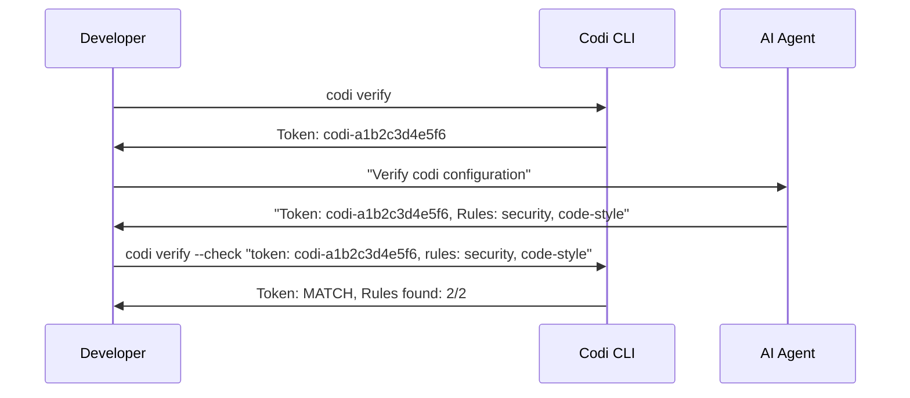

# Adoption & Verification

**Date**: 2026-03-24
**Document**: adoption-verification.md

How to verify that codi configuration is correctly generated, loaded by agents, and adopted by your team.

## Token Mechanism

Codi generates a deterministic verification token based on your project configuration. The token is a SHA-256 hash of:

- Project name and configured agents
- Rule names AND content
- Skill and agent names
- Active flag instructions

Token format: `codi-{12 hex chars}`

The token changes whenever any rule content, flag, skill, agent, or command changes. If an AI agent returns the correct token, you know it loaded the full configuration.



### Usage

**Step 1**: See your token and what to ask:

```bash
codi verify
```

**Step 2**: Ask your agent to verify. Paste the prompt that codi shows into your AI agent's chat. The agent should respond with the token, rules, and flags from its configuration.

**Step 3**: Validate the agent's response:

```bash
codi verify --check "token: codi-a1b2c3, rules: security, code-style, flags: max_file_lines"
```

Codi compares the response against expected values and reports:

- **Token**: MATCH or MISMATCH
- **Rules found**: how many expected rules the agent reported
- **Rules missing**: any rules the agent failed to report

## What Codi Can Verify

| Signal | Mechanism | Reliability |
|--------|-----------|-------------|
| Config files exist and are current | `codi doctor` | High |
| Generated files have not drifted | `codi status` | High |
| Agent can report verification token | `codi verify` | Medium |
| Pre-commit hooks are installed | `codi doctor --ci` | High |
| Comprehensive health summary | `codi compliance` | High |

## What Codi Cannot Verify

- Whether the AI agent actually follows the rules
- Whether the agent uses configured skills
- Whether the agent delegates to configured agents

These are agent-side behaviors that codi cannot enforce -- only advise.

## Adoption Workflow

### For individual developers

1. `codi doctor` -- check config health
2. `codi verify` -- get token and prompt
3. Ask your agent: "verify codi"
4. `codi verify --check "<response>"` -- validate the response

### For CI/CD

1. Add `npx codi doctor --ci` to your pipeline (exits non-zero on failure)
2. Use `npx codi ci` for composite validation (validate + doctor)
3. Use `npx codi compliance --ci` for full health report

### For team leads

1. Require `codi doctor --ci` in CI for all PRs
2. Review `.codi/audit.jsonl` for generation and update history
3. Run `codi compliance` to get adoption summary
4. Use `codi update --from org/team-config` to enforce centralized standards

## Audit Log

Every `codi generate` and `codi update` writes an entry to `.codi/audit.jsonl`. Each line is a JSON object with:

- `type`: the operation performed (`generate`, `update`, `clean`, `init`)
- `timestamp`: ISO 8601 timestamp
- `details`: operation-specific data (files generated, flags updated, etc.)

This provides an append-only history of configuration changes for review. Team leads can inspect this file to confirm that configuration is being regenerated regularly and kept up to date.

## Version Enforcement

Pin a minimum Codi version to keep your team aligned:

```yaml
# codi.yaml
codi:
  requiredVersion: ">=0.3.0"
```

When `requiredVersion` is set, `codi init` auto-installs a pre-commit hook that runs `codi doctor --ci`, catching version mismatches before code is pushed.

## Compliance Command

`codi compliance` provides a single comprehensive health check combining:

- Configuration validation (`codi validate`)
- Doctor checks (`codi doctor`)
- Drift detection summary
- Config summary (rule/skill/agent/command counts)

Use `--ci` for strict exit codes in pipelines:

```bash
npx codi compliance --ci
```
