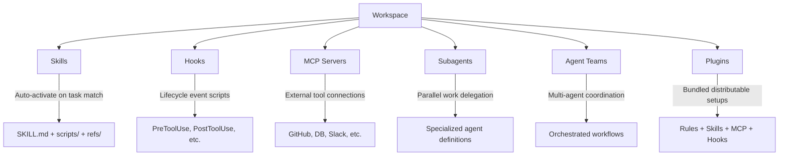
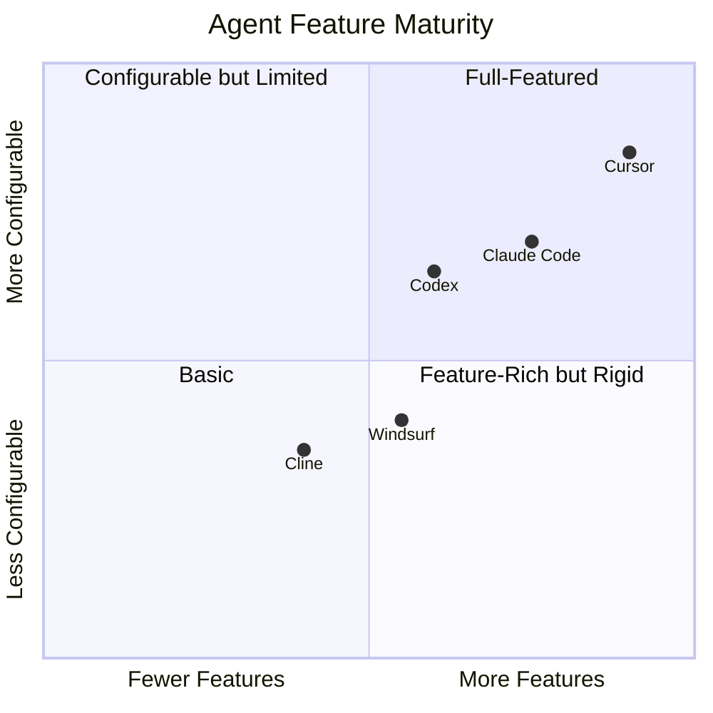

# AI Agent Workspace Features Reference

**Date**: 2026-03-26
**Document**: ai-agent-workspace-features-reference.md
**Category**: REFERENCE

Cross-agent reference for production AI-assisted development workspaces. Covers Claude Code, Cursor, Codex (OpenAI), Windsurf (Codeium), and Cline — the five agents supported by Codi.

---

## Reference Project Structure

The following directory tree represents a comprehensive Claude Code workspace. Other agents use subsets of this structure with agent-specific conventions.

```
my_project/
├── CLAUDE.md                       # Claude Code instruction file
├── AGENTS.md                       # Codex instruction file
├── .claude/
│   ├── settings.json               # Permissions, hooks, env vars
│   ├── settings.local.json         # Local overrides (gitignored)
│   ├── commands/
│   │   ├── review.md               # /review slash command
│   │   ├── deploy.md               # /deploy slash command
│   │   ├── test-all.md             # /test-all slash command
│   │   └── bootstrap.md            # /bootstrap slash command
│   ├── skills/
│   │   ├── code-review/
│   │   │   ├── SKILL.md            # Skill instructions & metadata
│   │   │   ├── scripts/            # Executable automation
│   │   │   ├── references/         # Docs loaded on demand
│   │   │   └── assets/             # Templates & static files
│   │   ├── text-writer/
│   │   │   └── SKILL.md
│   │   ├── security-audit/
│   │   │   └── SKILL.md
│   │   └── refactor/
│   │       └── SKILL.md
│   └── agents/
│       ├── code-reviewer.yml       # Subagent definition
│       ├── test-writer.yml
│       ├── security-auditor.yml
│       └── devops-sre.yml
├── .cursor/
│   ├── rules/                      # .mdc rules with YAML frontmatter
│   ├── skills/                     # Cursor skills (same SKILL.md format)
│   ├── agents/                     # Cursor 2.4+ subagent definitions
│   ├── commands/                   # Cursor slash commands
│   ├── hooks.json                  # Lifecycle hook configuration
│   └── mcp.json                    # MCP server config
├── .codex/
│   ├── config.toml                 # Codex settings, MCP, permissions
│   └── agents/                     # Agent definitions in TOML
├── .windsurf/
│   ├── rules/                      # Windsurf rules with frontmatter
│   ├── skills/                     # Windsurf skills
│   └── mcp.json                    # MCP server config
├── .cline/
│   ├── skills/                     # Cline skills
│   └── hooks/                      # Cline v3.36+ hook scripts
├── .cursorrules                    # Legacy Cursor instruction file
├── .windsurfrules                  # Windsurf instruction file
├── .clinerules                     # Cline instruction file (or directory)
├── plugins/
│   ├── manifest.json
│   └── my-plugin/
├── .mcp.json                       # Root MCP config (some agents)
├── src/
│   ├── components/
│   │   ├── auth/
│   │   ├── dashboard/
│   │   └── shared/
│   ├── services/
│   │   ├── api.ts
│   │   ├── auth.ts
│   │   └── database.ts
│   ├── utils/
│   │   ├── logger.ts
│   │   ├── validators.ts
│   │   └── helpers.ts
│   ├── types/
│   │   └── index.ts
│   └── index.ts
├── tests/
│   ├── unit/
│   ├── integration/
│   └── e2e/
├── docs/
│   ├── architecture.md
│   ├── api-reference.md
│   └── onboarding.md
├── scripts/
│   ├── setup.sh
│   ├── deploy.sh
│   └── seed-db.sh
├── package.json
├── tsconfig.json
├── .env.example
├── .gitignore
├── Dockerfile
└── README.md
```

---

## Project Overview

A production AI-assisted workspace integrates hooks, MCP servers, subagents, skills, and plugins to enable reliable, repeatable AI-driven development. Each agent reads project-level instruction files and configuration to understand conventions, constraints, and available tools.

---

## Key Components — Cross-Agent Matrix

| Component | Claude Code | Cursor | Codex | Windsurf | Cline |
|-----------|-------------|--------|-------|----------|-------|
| **Instruction file** | `CLAUDE.md` | `.cursorrules` | `AGENTS.md` | `.windsurfrules` | `.clinerules` |
| **Config directory** | `.claude/` | `.cursor/` | `.codex/` | `.windsurf/` | `.cline/` |
| **Rules** | `.claude/rules/*.md` | `.cursor/rules/*.mdc` | Inline in AGENTS.md | `.windsurf/rules/*.md` | `.clinerules/` (multi-file) |
| **Skills** | `.claude/skills/*/SKILL.md` | `.cursor/skills/*/SKILL.md` | `.agents/skills/*/SKILL.md` | `.windsurf/skills/*/SKILL.md` | `.cline/skills/*/SKILL.md` |
| **Commands** | `.claude/commands/*.md` | `.cursor/commands/*.md` | Built-in (`/init`, `/review`) | Via rulebooks | Not supported |
| **Agents** | `.claude/agents/*.md` | `.cursor/agents/*.md` | `.codex/agents/*.toml` | Not supported | Not supported |
| **MCP config** | `.claude/mcp.json` | `.cursor/mcp.json` | `.codex/config.toml` | `.windsurf/mcp.json` | Global only |
| **Hooks** | `settings.json` hooks | `.cursor/hooks.json` | `config.toml` hooks | Limited (2 events) | `.clinerules/hooks/` |
| **Settings** | `.claude/settings.json` | VS Code settings | `.codex/config.toml` | IDE settings | VS Code settings |
| **Plugins** | Not supported | `.cursor-plugin/` | Via MCP | Not supported | Via MCP |

---

## Instruction File Essentials

Every agent's primary instruction file should include these 7 sections:

| # | Section | Purpose | Claude Code | Cursor | Codex | Windsurf | Cline |
|---|---------|---------|:-----------:|:------:|:-----:|:--------:|:-----:|
| 1 | Project conventions & style guide | Coding standards, naming, formatting | CLAUDE.md | .cursorrules | AGENTS.md | .windsurfrules | .clinerules |
| 2 | Tech stack & architecture overview | Languages, frameworks, directory layout | CLAUDE.md | .cursorrules | AGENTS.md | .windsurfrules | .clinerules |
| 3 | Testing requirements & patterns | Test frameworks, coverage targets, TDD | CLAUDE.md | .cursorrules | AGENTS.md | .windsurfrules | .clinerules |
| 4 | Git workflow & branch strategy | Commit format, branching, PR rules | CLAUDE.md | .cursorrules | AGENTS.md | .windsurfrules | .clinerules |
| 5 | Security & compliance rules | Secret handling, input validation, OWASP | CLAUDE.md | .cursorrules | AGENTS.md | .windsurfrules | .clinerules |
| 6 | File naming & folder conventions | Naming patterns, directory structure | CLAUDE.md | .cursorrules | AGENTS.md | .windsurfrules | .clinerules |
| 7 | Review checklist before commits | Pre-commit verification steps | CLAUDE.md | .cursorrules | AGENTS.md | .windsurfrules | .clinerules |

---

## Extension Types



### Skills

Auto-activated workflows that trigger on task match.

| Agent | Skills Location | Format | Activation |
|-------|----------------|--------|------------|
| Claude Code | `.claude/skills/*/SKILL.md` | Markdown + YAML frontmatter | Auto on task match or `/skill-name` |
| Cursor | `.cursor/skills/*/SKILL.md` | Markdown + YAML frontmatter | `/skill-name` or `@skill` |
| Codex | `.agents/skills/*/SKILL.md` | Markdown + YAML frontmatter | `@skill` menu |
| Windsurf | `.windsurf/skills/*/SKILL.md` | Markdown | Via rulebooks as proxy |
| Cline | `.cline/skills/*/SKILL.md` | Markdown | Community pattern (Memory Bank) |

### Hooks

Lifecycle event scripts that execute at specific points during agent operation.

| Agent | Config Location | Events Supported | Format |
|-------|----------------|-----------------|--------|
| Claude Code | `.claude/settings.json` | PreToolUse, PostToolUse, Notification + git hooks | JSON hooks array |
| Cursor | `.cursor/hooks.json` | 15+ events (session, tool, file, MCP, shell, subagent) | JSON with matchers |
| Codex | `.codex/config.toml` | user_prompt_submit only | TOML |
| Windsurf | IDE config | user_prompt, post_setup_worktree | Limited |
| Cline | `.clinerules/hooks/` | PreToolUse, PostToolUse, SessionStart, SessionStop | Script files |

### MCP (Model Context Protocol)

External tool connections for databases, APIs, browsers, and more.

| Agent | Config Location | Format | Scope |
|-------|----------------|--------|-------|
| Claude Code | `.claude/mcp.json` | JSON (`mcpServers`) | Project + global |
| Cursor | `.cursor/mcp.json` | JSON (`mcpServers`) | Project + global (`~/.cursor/mcp.json`) |
| Codex | `.codex/config.toml` | TOML (`[mcp_servers]`) | Project + global |
| Windsurf | `.windsurf/mcp.json` | JSON | Project + global (`~/.codeium/windsurf/mcp_config.json`) |
| Cline | VS Code globalStorage | JSON | Global only (no project-level) |

### Subagents

Specialized agents that handle delegated tasks in parallel.

| Agent | Config Location | Format | Features |
|-------|----------------|--------|----------|
| Claude Code | `.claude/agents/*.md` | Markdown + YAML frontmatter | tools, model inheritance |
| Cursor | `.cursor/agents/*.md` | Markdown + YAML frontmatter | model, readonly, background mode |
| Codex | `.codex/agents/*.toml` | TOML | model, sandbox_mode, MCP overrides |
| Windsurf | Not supported | — | — |
| Cline | Not supported | — | — |

### Plugins

Bundled distributable setups combining rules, skills, MCP, and hooks.

| Agent | Support | Format |
|-------|---------|--------|
| Claude Code | Not native | Via MCP servers |
| Cursor | Yes | `.cursor-plugin/plugin.json` manifest, marketplace distribution |
| Codex | Not native | Via MCP servers |
| Windsurf | Not native | Via MCP servers |
| Cline | Not native | Via MCP servers |

---

## Hook Events Matrix

| Event | Claude Code | Cursor | Codex | Windsurf | Cline |
|-------|:-----------:|:------:|:-----:|:--------:|:-----:|
| **PreToolUse** | Yes | Yes | No | No | Yes |
| **PostToolUse** | Yes | Yes | No | No | Yes |
| **SessionStart** | Yes | Yes | No | No | Yes |
| **SessionEnd** | Yes | Yes | No | No | Yes |
| **PreCommit** | Via husky | Via hooks.json | No | No | No |
| **Notification** | Yes | Yes | No | No | No |
| **BeforeShellExecution** | No | Yes | No | No | No |
| **AfterShellExecution** | No | Yes | No | No | No |
| **BeforeMCPExecution** | No | Yes | No | No | No |
| **AfterMCPExecution** | No | Yes | No | No | No |
| **BeforeReadFile** | No | Yes | No | No | No |
| **AfterFileEdit** | No | Yes | No | No | No |
| **BeforeSubmitPrompt** | No | Yes | Yes | Yes | No |
| **SubagentStart** | No | Yes | No | No | No |
| **SubagentStop** | No | Yes | No | No | No |
| **AfterAgentResponse** | No | Yes | No | No | No |

---

## Skill Structure

A complete skill directory can contain:

```
skill-name/
├── SKILL.md          # Instructions & metadata (required)
├── scripts/          # Executable automation (optional)
├── references/       # Docs loaded on demand (optional)
└── assets/           # Templates & static files (optional)
```

| Component | Purpose | Supported By |
|-----------|---------|-------------|
| `SKILL.md` | Instructions & metadata in YAML frontmatter | All 5 agents |
| `scripts/` | Executable automation scripts | Claude Code, Cursor |
| `references/` | Documentation loaded on demand | Claude Code, Cursor |
| `assets/` | Templates & static files | Claude Code, Cursor |

### SKILL.md Frontmatter Fields

```yaml
---
name: skill-name
description: What this skill does
disable-model-invocation: true    # Optional: prevent auto-activation
argument-hint: "describe args"    # Optional: hint for slash command args
allowed-tools: Read, Write, Bash  # Optional: restrict tool access
license: MIT                      # Optional
metadata-category: "testing"      # Optional: custom metadata
---
```

---

## Popular MCP Servers

| Server | Purpose | Package |
|--------|---------|---------|
| GitHub | PRs, issues, repos | `@anthropic/mcp-github` or `@modelcontextprotocol/server-github` |
| JIRA/Linear | Ticket workflows | `@anthropic/mcp-linear` |
| Slack | Notifications & search | `@anthropic/mcp-slack` |
| PostgresDB | Direct queries | `@anthropic/mcp-postgres` |
| Playwright | Browser automation | `@anthropic/mcp-playwright` |
| Filesystem | Scoped file access | `@anthropic/mcp-filesystem` |
| Memory | Persistent knowledge graph | `@anthropic/mcp-memory` |
| Sequential Thinking | Structured reasoning | `@anthropic/mcp-sequential-thinking` |

---

## Getting Started

1. Install your agent CLI (e.g., `npm i -g @anthropic-ai/claude-code`)
2. Navigate to your project and launch the agent
3. Create the instruction file (CLAUDE.md, .cursorrules, AGENTS.md, etc.)
4. Add slash commands in the agent's commands directory
5. Configure MCP servers in the appropriate config file
6. Add skills as workflows grow

---

## Context Management

| Context Usage | Action | Applies To |
|---------------|--------|------------|
| 0–50% | Work freely | All agents |
| 50–70% | Monitor usage | All agents |
| 70–80% | Run `/compact` or equivalent | Claude Code, Cursor |
| 80%+ | `/clear` mandatory | Claude Code |

### Agent-Specific Context Strategies

| Agent | Strategy | Configuration |
|-------|----------|---------------|
| Claude Code | Manual compaction, `/compact`, `/clear` | `CLAUDE_AUTOCOMPACT_PCT_OVERRIDE` env var in settings.json |
| Cursor | `.cursorignore` + `.cursorindexingignore` | Exclude files from AI context and indexing separately |
| Codex | `model_context_window` + `project_doc_max_bytes` | config.toml settings |
| Windsurf | 7-layer pipeline: rules → memories → open files → M-Query → recent actions | Automatic, context indicator in UI |
| Cline | Manual `@` mentions for files/folders | No automatic context pipeline |

---

## Best Practices

- **Iterative Development** — Start small, test frequently. Add complexity incrementally.
- **Clear Skill Documentation** — Describe skill purpose & usage so agents can auto-activate correctly.
- **Modular Skill Design** — Break down complex tasks into focused, composable skills.
- **Secure Secret Handling** — Use environment variables and secret managers, never hardcode in source.
- **Regular Testing & Auditing** — Ensure skills remain reliable as the codebase evolves.

---

## Configuration Examples

### settings.json Structure (Claude Code)

```json
{
  "permissions": {
    "allow": ["Bash(npm run *)", "Read", "Write"],
    "deny": ["Bash(rm -rf *)"]
  },
  "hooks": {
    "PreToolUse": [{
      "matcher": "Bash",
      "hooks": [{
        "type": "command",
        "command": "check-safety.sh"
      }]
    }],
    "PostToolUse": [{
      "matcher": "Write",
      "hooks": [{
        "type": "command",
        "command": "npm run lint"
      }]
    }]
  },
  "env": {
    "MAX_THINKING_TOKENS": "10000",
    "CLAUDE_AUTOCOMPACT_PCT_OVERRIDE": "50"
  }
}
```

### hooks.json Structure (Cursor)

```json
{
  "hooks": [
    {
      "event": "preToolUse",
      "matcher": { "tool": "shell" },
      "type": "command",
      "command": "./scripts/check-safety.sh",
      "failClosed": true
    },
    {
      "event": "postToolUse",
      "matcher": { "tool": "write" },
      "type": "command",
      "command": "npm run lint"
    },
    {
      "event": "sessionStart",
      "type": "prompt",
      "prompt": "Load project context from docs/onboarding.md"
    }
  ]
}
```

### .mcp.json Structure (Claude Code / Cursor / Windsurf)

```json
{
  "mcpServers": {
    "github": {
      "type": "stdio",
      "command": "npx",
      "args": ["-y", "@anthropic/mcp-github"],
      "env": {
        "GITHUB_TOKEN": "${GITHUB_TOKEN}"
      }
    },
    "postgres": {
      "type": "stdio",
      "command": "npx",
      "args": ["-y", "@anthropic/mcp-postgres"],
      "env": {
        "DATABASE_URL": "${DATABASE_URL}"
      }
    }
  }
}
```

### config.toml Structure (Codex)

```toml
[model]
model_id = "o4-mini"
model_context_window = 200000

[sandbox]
sandbox_mode = "workspace-write"

[approval]
approval_policy = "on-request"

[mcp_servers.github]
command = "npx"
args = ["-y", "@modelcontextprotocol/server-github"]

[mcp_servers.github.env]
GITHUB_TOKEN = "$GITHUB_TOKEN"

[hooks.user_prompt_submit]
command = "./scripts/validate-prompt.sh"
```

### Instruction File Template (CLAUDE.md)

```markdown
# Project: My App

## Tech Stack
- Next.js 14, TypeScript, Tailwind
- Supabase for auth & database
- Prisma ORM, tRPC API layer

## Conventions
- Always write tests before code
- Use conventional commits
- Never commit directly to main
- Run lint + typecheck before PR

## Architecture
- src/components — React components
- src/services — Business logic
- src/utils — Shared helpers

## Security
- No secrets in code or logs
- Validate all user inputs
- Use parameterized queries only
```

---

## Agent Feature Comparison Matrix



| Feature | Claude Code | Cursor | Codex | Windsurf | Cline |
|---------|:-----------:|:------:|:-----:|:--------:|:-----:|
| Instruction file | Yes | Yes | Yes | Yes | Yes |
| Rules (separate files) | Yes | Yes (MDC) | Inline | Yes | Multi-file dir |
| Skills | Yes | Yes | Yes | Partial | Community |
| Skill subdirs (scripts/refs/assets) | Yes | Yes | No | No | No |
| Commands (slash) | Yes | Yes | Built-in | Via rules | No |
| Subagents | Yes | Yes | Yes | No | No |
| MCP (project-level) | Yes | Yes | Yes | Yes | No (global) |
| Lifecycle hooks | Yes (basic) | Yes (15+) | Partial (1) | Partial (2) | Yes (4) |
| Git hooks | Via husky | Via hooks.json | No | No | No |
| Plugins | No | Yes | No | No | No |
| Progressive loading | Yes | Yes | No | No | No |
| Context ignore file | No | Yes | No | No | No |
| Auto-memories | No | No | No | Yes | No |
| Rule triggers (conditional) | No | Yes | No | Yes | No |
| Permissions (project-level) | Yes | Global only | Yes | No | No |
| Background agents | Yes | Yes | No | No | No |

---

## Sources

- [Claude Code Documentation](https://docs.anthropic.com/en/docs/claude-code)
- [Cursor Documentation](https://docs.cursor.com)
- [Codex Documentation](https://developers.openai.com/codex)
- [Windsurf Documentation](https://docs.windsurf.com)
- [Cline Documentation](https://docs.cline.bot)
