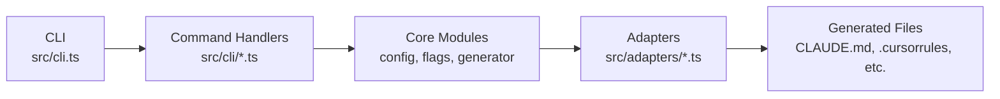
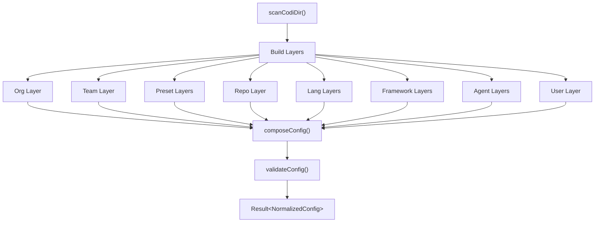
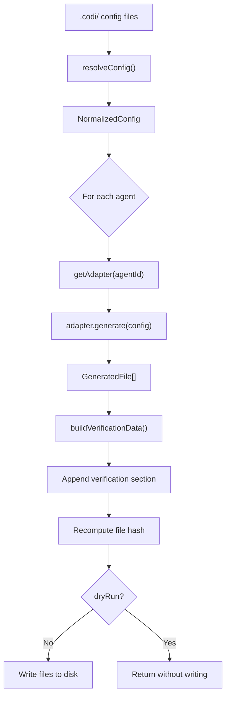
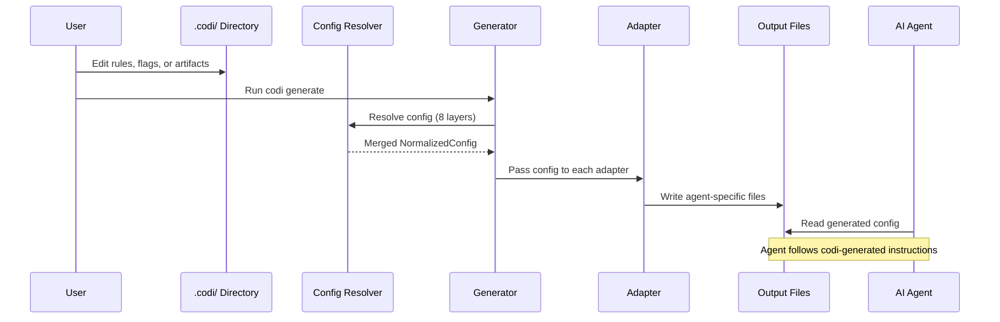

# Architecture

Technical reference for Codi's internal design. All source paths are relative to the repository root.

## System Overview



All public functions return `Result<T>` — either `ok(data)` or `err(errors)`. No thrown exceptions cross module boundaries.

---

## Configuration Resolution

The config resolution pipeline composes 8 independent layers in strict precedence order. Later layers override earlier ones unless a flag is `locked: true`.

### Layer Order (lowest to highest priority)

<!-- GENERATED:START:layer_order -->
| # | Layer | Source | Description |
|---|-------|--------|-------------|
| 1 | **Org** | `~/.codi/orgs/{org}/config.yaml` | Organization-wide policies |
| 2 | **Team** | `~/.codi/teams/{name}.yaml` | Team-specific overrides |
| 3 | **Preset** | Built-in or installed presets | Bundles of flags + artifacts (multiple, applied in order) |
| 4 | **Repo** | `.codi/` directory | Project-level configuration |
| 5 | **Lang** | `.codi/lang/*.yaml` | Language-specific rules |
| 6 | **Framework** | `.codi/frameworks/*.yaml` | Framework-specific rules |
| 7 | **Agent** | `.codi/agents/*.yaml` | Per-agent overrides |
| 8 | **User** | `~/.codi/user.yaml` | Personal preferences (never committed) |
<!-- GENERATED:END:layer_order -->

### Resolution Flow



**Key modules:**
- `src/core/config/resolver.ts` — Walks the layer chain, applies locking and conditional evaluation
- `src/core/config/composer.ts` — Merges resolved flags with rules, skills, agents into final config
- `src/core/config/parser.ts` — Scans `.codi/` directory, parses YAML/Markdown frontmatter
- `src/core/config/validator.ts` — Semantic validation (duplicates, size limits, adapter existence)

---

## Generation Pipeline

The generator transforms resolved configuration into agent-specific output files.



**Stages per agent:**
1. **Adapter resolution** — Fetch adapter by agent ID
2. **Generation** — Adapter produces files (instruction file, rules, skills, agents, MCP config)
3. **Verification injection** — Append verification token/checksum to instruction file
4. **Hash computation** — Recalculate hash after content injection
5. **File writing** — Create directories and write files (skipped in dry-run mode)

**Key module:** `src/core/generator/generator.ts`

---

## Adapter Pattern

Each supported agent has an adapter that translates `NormalizedConfig` into that platform's native format.

<!-- GENERATED:START:adapter_table -->
| Adapter | Instruction File | Rules | Skills | Agents | MCP |
|---------|-----------------|-------|--------|--------|-----|
| **Claude Code** | `CLAUDE.md` | Yes | Yes | Yes | Yes |
| **Cursor** | `.cursorrules` | Yes | Yes | — | Yes |
| **Codex** | `AGENTS.md` | Yes | Yes | Yes | Yes |
| **Windsurf** | `.windsurfrules` | Yes | Yes | — | — |
| **Cline** | `.clinerules` | Yes | Yes | — | — |
<!-- GENERATED:END:adapter_table -->

**Adapter interface:**
- `id: string` — Adapter identifier (e.g., `"claude-code"`)
- `detect(): boolean` — Checks for existing config files
- `generate(config, options): Promise<GeneratedFile[]>` — Produces output files

All adapters are registered in `src/adapters/index.ts` via `registerAllAdapters()`. Flag-to-instruction translation is shared via `src/adapters/flag-instructions.ts`.

---

## Hook System

### Detection

Codi detects the project's existing Git hook runner in priority order:

1. **Husky** — `.husky/` directory exists
2. **pre-commit** — `.pre-commit-config.yaml` exists
3. **Lefthook** — `.lefthook.yml` or `lefthook.yml` exists
4. **Standalone** — Fallback: raw `.git/hooks/pre-commit`

**Module:** `src/core/hooks/hook-detector.ts`

### Flag-to-Hook Mapping

<!-- GENERATED:START:flag_hooks -->
| Flag | Hook | Description |
|------|------|-------------|
| `test_before_commit` | tests | Run tests before commit |
| `security_scan` | secret-detection | Mandatory security scanning |
| `type_checking` | typecheck | Type checking level |
| `max_file_lines` | file-size-check | Max lines per file |
<!-- GENERATED:END:flag_hooks -->

### Installation

The installer adapts hook scripts to the detected runner:
- **Husky** — Appends commands to `.husky/pre-commit`
- **pre-commit** — Appends YAML local hooks to `.pre-commit-config.yaml`
- **Lefthook/Standalone** — Writes `.git/hooks/pre-commit` with embedded runner

Auxiliary scripts (secret scan, file size check, version check) are written as `.mjs` files to `.git/hooks/`.

**Module:** `src/core/hooks/hook-installer.ts`

---

## Flag System

Codi has 18 behavioral flags defined in `src/core/flags/flag-catalog.ts`. Each flag has a type, default value, and optional hook mapping.

### Flag Modes

Flags support 6 resolution modes:

| Mode | Behavior |
|------|----------|
| `enforced` | Value is fixed, cannot be overridden by lower layers |
| `enabled` | Value is set, can be overridden |
| `disabled` | Flag is turned off |
| `inherited` | Inherits from parent layer |
| `delegated_to_agent_default` | Uses the agent's native default |
| `conditional` | Value applies only when conditions match (lang, framework, agent, file pattern) |

Locked flags (`locked: true`) halt resolution — no lower-priority layer can change them.

### Resolved Flag Structure

Each flag resolves to:
```
{
  value: <the flag's value>,
  mode: "enabled" | "disabled",
  source: "default" | "org" | "team" | "preset" | "repo" | ...,
  locked: boolean
}
```

**Key modules:**
- `src/core/flags/flag-catalog.ts` — Flag definitions, types, defaults
- `src/schemas/flag.ts` — Zod validation schema for flag definitions

---

## Result Pattern

All fallible operations return `Result<T>` instead of throwing exceptions:

```typescript
type Result<T, E = ProjectError[]> =
  | { ok: true; data: T }
  | { ok: false; errors: E };
```

Helper functions: `ok(data)`, `err(errors)`, `isOk(result)`, `isErr(result)`.

**Module:** `src/types/result.ts`

---

## Error Handling

- **25 error codes** defined in `src/core/output/error-catalog.ts`
- **13 exit codes** for CLI process termination in `src/core/output/exit-codes.ts`

Error format:
```typescript
{
  code: string;          // e.g., "E_CONFIG_INVALID"
  message: string;       // Human-readable description
  hint: string;          // Actionable fix guidance
  severity: "error" | "warning" | "info";
  context?: Record<string, unknown>;
}
```

---

## Data Flow

How user edits flow through Codi to the AI agents.



---

## Supporting Systems

### Backup System

Automatic backups are created before each `codi generate` in `.codi/backups/{timestamp}/`. Maximum 5 backups are retained. Restore with `codi revert`.

### Watch Mode

`codi watch` uses `fs.watch()` with 500ms debounce to auto-regenerate when `.codi/` files change. Requires `auto_generate_on_change: true` flag.

### MCP Distribution

MCP servers configured in `.codi/mcp.yaml` are distributed to each agent in its native format: JSON for Claude Code/Cursor, TOML for Codex.

### Verification

Generated configs include a verification section with a token and checksum. `codi verify` checks whether agents loaded the correct configuration by validating the token against expected values.

### Operations Ledger

Every CLI operation is logged to `.codi/operations-ledger.json` with timestamp, command, result, and metadata. Used for audit trails and debugging.
