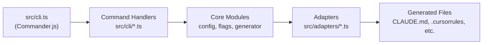
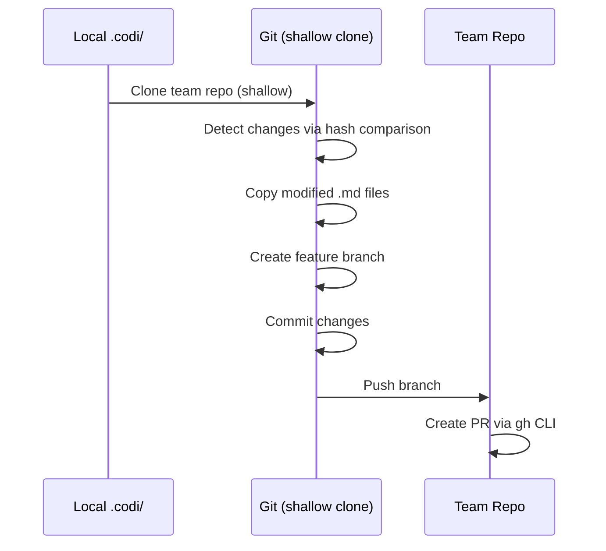

# Architecture

Technical reference for codi's internal design.

## System Overview



All public functions return `Result<T>` — either `ok(data)` or `err(errors)`. No thrown exceptions cross module boundaries.

## Configuration Resolution (7 Levels)

Resolution order (lowest to highest override priority):

1. **org** — `~/.codi/org.yaml`
2. **team** — `~/.codi/teams/{name}.yaml`
3. **repo** — `.codi/flags.yaml`
4. **lang** — `.codi/lang/*.yaml`
5. **framework** — `.codi/frameworks/*.yaml`
6. **agent** — `.codi/agents/*.yaml`
7. **user** — `~/.codi/user.yaml`

Later layers override earlier ones unless a flag is `locked: true`. Locked flags halt resolution — no lower layer can change them.

Key modules:
- `src/core/config/resolver.ts` — walks the 7-layer chain, applies locking and conditional evaluation
- `src/core/config/composer.ts` — merges resolved flags with rules, skills, and agents into a final config object

## Artifact Lifecycle (Rules, Skills, Agents)

Rules, skills, and agents follow an identical lifecycle:

### Source

Stored as Markdown with YAML frontmatter in:
- Rules: `.codi/rules/custom/*.md`
- Skills: `.codi/skills/*.md`
- Agents: `.codi/agents/*.md`

### Ownership

`managed_by` field controls update behavior:
- `managed_by: codi` — template-managed, auto-updated by `codi update`
- `managed_by: user` — custom content, never overwritten

### Operations

| Operation | Command | Effect |
|-----------|---------|--------|
| Create from template | `codi add {rule,skill,agent} <name> --template <T>` | Creates file with `managed_by: codi` |
| Create custom | `codi add {rule,skill,agent} <name>` | Creates file with `managed_by: user` |
| Create all templates | `codi add {rule,skill,agent} --all` | Batch-creates all templates, skips existing |
| Update | `codi update --rules --skills --agents` | Refreshes `managed_by: codi` artifacts to latest template content |
| Generate | `codi generate` | Produces per-adapter output files |
| Clean | `codi clean` | Removes generated output files |

## Hook System

### Detection

Checks for existing hook runners in order: husky, pre-commit (Python), lefthook, standalone git hooks.

### Config Generation

Flags map to hook checks:

| Flag | Hook Action |
|------|-------------|
| `type_checking` | Runs `tsc --noEmit` (TypeScript) or `pyright` (Python) |
| `security_scan` | Runs secret scanning |
| `max_file_lines` | Checks staged files against line limit |

**Limitation**: Only `type_checking` has a fully implemented hook mapping. `security_scan` and `max_file_lines` generate hook config but rely on external tooling.

### Installation

Adapts the generated hook script to the detected runner (husky config, pre-commit YAML, lefthook YAML, or raw `.git/hooks/pre-commit`).

## Sync System

### Workflow



### Limitations

- Only `.md` files are synced
- GitHub-only (requires `gh` CLI authenticated)
- No merge strategy — overwrites target files
- Shallow clone — no history preserved
- Non-idempotent: running twice creates duplicate PRs

## Adapter Architecture

| Adapter | Main File | Rules Location | Skills Location | Agents Location |
|---------|-----------|----------------|-----------------|-----------------|
| Claude Code | `CLAUDE.md` | `.claude/rules/*.md` | Inline in `CLAUDE.md` | `.claude/agents/*.md` |
| Cursor | `.cursorrules` | `.cursor/rules/*.md` | Inline in `.cursorrules` | — |
| Codex | `AGENTS.md` | Inline in `AGENTS.md` | Inline in `AGENTS.md` | `.codex/agents/*.toml` |
| Windsurf | `.windsurfrules` | Inline in `.windsurfrules` | Inline in `.windsurfrules` | — |
| Cline | `.clinerules` | Inline in `.clinerules` | Inline in `.clinerules` | — |

Each adapter implements `detect()` (checks for existing config files) and `generate()` (produces output). Flag-to-instruction translation is shared via `src/adapters/flag-instructions.ts`.

## Error Handling

- **23 error codes** defined in `src/core/output/error-catalog.ts`
- **13 exit codes** for CLI process termination
- Error format:

```typescript
{
  code: string;        // e.g. "E_CONFIG_INVALID"
  message: string;     // Human-readable, prefixed with [CODE]
  hint: string;        // Actionable guidance for the user
  severity: string;    // "error" | "warning" | "info"
  context?: Record<string, unknown>;
}
```

All errors surface through the `Result<T>` pattern — callers handle errors explicitly via `result.ok` / `result.errors`.
