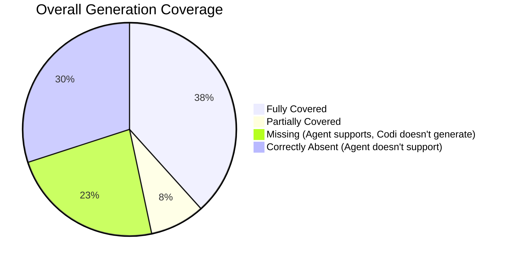
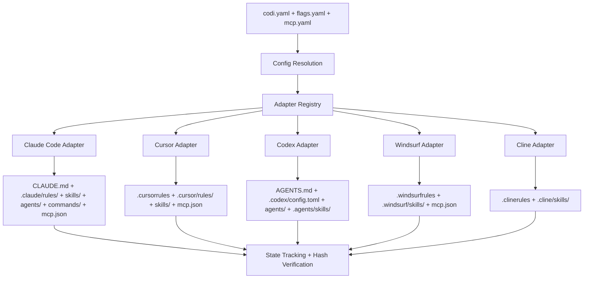
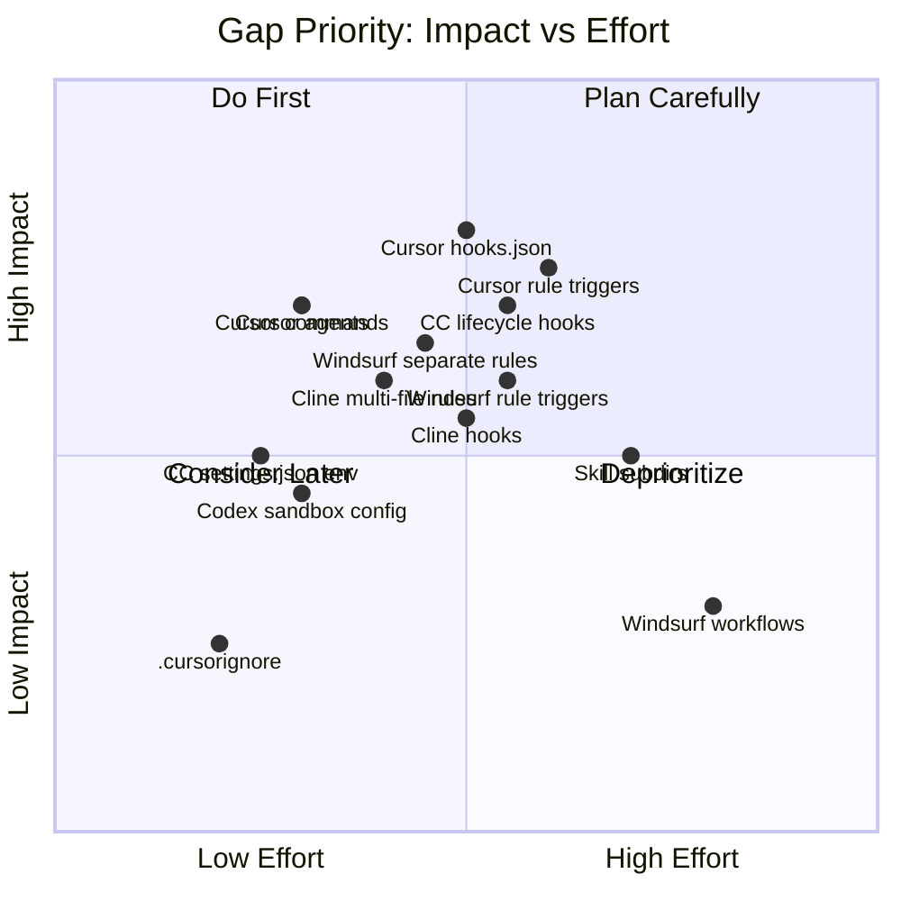

# Codi Generation Pipeline Audit

**Date**: 2026-03-26
**Document**: codi-generation-audit.md
**Category**: AUDIT

Comprehensive audit of codi's generation pipeline against what each supported agent actually supports. Identifies gaps where codi does not generate features that agents can consume.

---

## 1. Executive Summary

Codi generates configuration for 5 AI coding agents. This audit compared each adapter's output against the agent's documented capabilities (as of March 2026).

**Key findings:**
- **23 features** are fully generated across all applicable agents
- **14 gaps** where agents support features that codi does not generate
- **Highest gap density:** Cursor (5 gaps), Windsurf (4 gaps), Cline (3 gaps)
- **Most complete:** Claude Code (2 gaps), Codex (2 gaps)

---

## 2. Methodology

1. Read all 5 adapter source files in `src/adapters/`
2. Read the `AgentCapabilities` type in `src/types/agent.ts`
3. Cross-referenced with official agent documentation via web research
4. Verified actual generated output in the codi project itself
5. Classified each feature as: OK, PARTIAL, GAP, or N/A

**Evidence files:**
- `src/adapters/claude-code.ts` — Claude Code adapter
- `src/adapters/cursor.ts` — Cursor adapter
- `src/adapters/codex.ts` — Codex adapter
- `src/adapters/windsurf.ts` — Windsurf adapter
- `src/adapters/cline.ts` — Cline adapter
- `src/adapters/skill-generator.ts` — Shared skill generation
- `src/adapters/flag-instructions.ts` — Flag-to-instruction conversion
- `src/types/agent.ts` — AgentCapabilities interface
- `src/core/hooks/hook-registry.ts` — Git hook templates

---

## 3. Generation Pipeline Overview

### Adapter Capabilities Declared in Code

| Capability | Claude Code | Cursor | Codex | Windsurf | Cline |
|------------|:-----------:|:------:|:-----:|:--------:|:-----:|
| `rules` | Yes | Yes | Yes | Yes | Yes |
| `skills` | Yes | Yes | Yes | Yes | Yes |
| `commands` | Yes | No | No | No | No |
| `agents` | Yes | No | Yes | No | No |
| `mcp` | Yes | Yes | Yes | Yes | No |
| `frontmatter` | No | Yes (MDC) | No | No | No |
| `progressiveLoading` | Yes | Yes | No | No | No |
| `maxContextTokens` | 200k | 32k | 200k | 32k | 200k |

---

## 4. Per-Agent Audit

### 4.1 Claude Code

**Adapter:** `src/adapters/claude-code.ts`
**Generated files:** CLAUDE.md, `.claude/rules/*.md`, `.claude/skills/*/SKILL.md`, `.claude/agents/*.md`, `.claude/commands/*.md`, `.claude/mcp.json`

| Feature | Agent Supports | Codi Generates | Status | Notes |
|---------|:-:|:-:|:---:|---|
| Instruction file (CLAUDE.md) | Yes | Yes | **OK** | Project overview, permissions, workflow |
| Rules (`.claude/rules/*.md`) | Yes | Yes | **OK** | Plain markdown, no frontmatter |
| Skills (`.claude/skills/*/SKILL.md`) | Yes (full dirs) | Partial | **PARTIAL** | Only SKILL.md generated; no `scripts/`, `references/`, `assets/` subdirs |
| Commands (`.claude/commands/*.md`) | Yes | Yes | **OK** | With description frontmatter |
| Agents (`.claude/agents/*.md`) | Yes | Yes | **OK** | YAML frontmatter: name, description, tools, model |
| MCP (`.claude/mcp.json`) | Yes | Yes | **OK** | JSON format, filtered by enabled servers |
| Lifecycle hooks in settings.json | Yes (12 events) | No | **GAP** | Codi generates `settings.local.json` with permissions only, no `hooks` or `env` blocks |
| settings.json env vars | Yes | No | **GAP** | No `MAX_THINKING_TOKENS`, `CLAUDE_AUTOCOMPACT_PCT_OVERRIDE`, etc. |
| Progressive loading | Yes | Yes | **OK** | Tier 1 metadata-only mode |

**Gap detail — Lifecycle hooks:** Claude Code supports `PreToolUse`, `PostToolUse`, `Notification`, and other hook events via the `hooks` block in `settings.json`. Codi only generates `settings.local.json` with a `permissions` block. It does not generate hook configurations or environment variable overrides.

**Gap detail — Skill subdirs:** Claude Code can consume `scripts/`, `references/`, and `assets/` directories within skills. Codi only generates the `SKILL.md` file. See [skills system analysis](20260325_2200_RESEARCH_skills-system-analysis.md) for prior research.

---

### 4.2 Cursor

**Adapter:** `src/adapters/cursor.ts`
**Generated files:** `.cursorrules`, `.cursor/rules/*.mdc`, `.cursor/skills/*/SKILL.md`, `.cursor/mcp.json`

| Feature | Agent Supports | Codi Generates | Status | Notes |
|---------|:-:|:-:|:---:|---|
| Instruction file (`.cursorrules`) | Yes | Yes | **OK** | Inline rules + project overview |
| Rules (`.cursor/rules/*.mdc`) | Yes | Yes | **PARTIAL** | MDC format generated but `alwaysApply` hardcoded to `true`; no glob/agent_requested triggers |
| Skills (`.cursor/skills/*/SKILL.md`) | Yes | Yes | **OK** | With progressive loading support |
| Commands (`.cursor/commands/*.md`) | Yes (new) | No | **GAP** | Cursor supports slash commands in `.cursor/commands/` but codi declares `commands: false` |
| Agents (`.cursor/agents/*.md`) | Yes (2.4+) | No | **GAP** | Cursor 2.4+ supports subagent definitions but codi declares `agents: false` |
| MCP (`.cursor/mcp.json`) | Yes | Yes | **OK** | JSON format |
| Hooks (`.cursor/hooks.json`) | Yes (15+ events) | No | **GAP** | Cursor has the most comprehensive hook system; codi does not generate hooks.json |
| Progressive loading | Yes | Yes | **OK** | Tier 1 metadata mode |
| Rule triggers (globs, agent_requested) | Yes | No | **GAP** | Cursor rules support conditional activation via `alwaysApply`, `globs`, `description` (agent_requested); codi hardcodes `alwaysApply: true` for all rules |
| `.cursorignore` | Yes | No | **GAP** | Context exclusion file not generated |

**Gap detail — Commands & Agents:** Since Cursor 2.4 (2026), Cursor reads `.cursor/commands/*.md` and `.cursor/agents/*.md` using the same format as Claude Code. Codi's Cursor adapter does not declare these capabilities.

**Gap detail — Rule triggers:** Codi generates all `.cursor/rules/*.mdc` files with `alwaysApply: true`. This wastes context when rules should only apply to specific file types (e.g., a Python rule applying only to `*.py` files). The rule schema in `.codi/rules/custom/` does not include scope/trigger metadata.

**Gap detail — hooks.json:** Cursor's hook system supports 15+ event types including `preToolUse`, `postToolUse`, `sessionStart`, `sessionEnd`, `beforeShellExecution`, `afterFileEdit`, `beforeMCPExecution`, `subagentStart`, and more. This is the most comprehensive hook system among all agents.

---

### 4.3 Codex (OpenAI)

**Adapter:** `src/adapters/codex.ts`
**Generated files:** `AGENTS.md`, `.codex/config.toml`, `.codex/agents/*.toml`, `.agents/skills/*/SKILL.md`

| Feature | Agent Supports | Codi Generates | Status | Notes |
|---------|:-:|:-:|:---:|---|
| Instruction file (AGENTS.md) | Yes | Yes | **OK** | Inline rules, agents table, workflow |
| Rules (inline in AGENTS.md) | Yes | Yes | **OK** | Rules inlined as `## RuleName` sections |
| Skills (`.agents/skills/*/SKILL.md`) | Yes | Yes | **OK** | No progressive loading |
| Agents (`.codex/agents/*.toml`) | Yes | Yes | **OK** | TOML format with name, description, developer_instructions |
| MCP (`.codex/config.toml`) | Yes | Yes | **OK** | TOML `[mcp_servers]` sections |
| Sandbox/approval config | Yes | No | **GAP** | Codex supports `sandbox_mode` and `approval_policy` in config.toml; codi does not generate these |
| Hooks (`user_prompt_submit`) | Partial | No | **GAP** | Codex supports a single hook event; codi does not generate it |
| `AGENTS.override.md` | Yes | No | **OK** | User-created override file, not codi's responsibility |
| Per-agent model/sandbox | Yes | Partial | **PARTIAL** | Codi generates `model` field but not `sandbox_mode` or MCP overrides per agent |

**Gap detail — Sandbox config:** Codex config.toml supports `[sandbox]` with `sandbox_mode = "workspace-write"` and `[approval]` with `approval_policy` settings. These control the security sandbox and auto-approval behavior. Codi only generates `developer_instructions` and MCP server sections.

---

### 4.4 Windsurf (Codeium)

**Adapter:** `src/adapters/windsurf.ts`
**Generated files:** `.windsurfrules`, `.windsurf/skills/*/SKILL.md`, `.windsurf/mcp.json`

| Feature | Agent Supports | Codi Generates | Status | Notes |
|---------|:-:|:-:|:---:|---|
| Instruction file (`.windsurfrules`) | Yes | Yes | **OK** | Inline rules + skill catalog |
| Rules (`.windsurf/rules/*.md`) | Yes (new) | No | **GAP** | Windsurf now supports separate rule files with YAML frontmatter; codi only inlines rules |
| Skills (`.windsurf/skills/*/SKILL.md`) | Yes | Yes | **OK** | Separate files generated |
| MCP (`.windsurf/mcp.json`) | Yes | Yes | **OK** | JSON format |
| Rule triggers (glob, agent_requested, manual) | Yes | No | **GAP** | Windsurf rules support conditional activation; codi inlines all rules (always-on) |
| Workflows | Yes (unique) | No | **GAP** | Windsurf-specific automated workflows; no equivalent in codi |
| Memories | Auto-generated | N/A | **N/A** | Created automatically by Cascade, not configurable via files |
| Agents/Subagents | Not supported | Not generated | **OK** | Correctly absent |

**Gap detail — Separate rules:** Windsurf now reads `.windsurf/rules/*.md` files with YAML frontmatter including trigger conditions (`always`, `glob`, `agent_requested`, `manual`). Codi only generates the monolithic `.windsurfrules` file with all rules inlined, which wastes context.

**Gap detail — Workflows:** Windsurf has a unique Workflows feature for automating build/test/deploy with AI adaptation. This has no equivalent in other agents and may not be worth implementing in codi until the feature stabilizes.

---

### 4.5 Cline

**Adapter:** `src/adapters/cline.ts`
**Generated files:** `.clinerules`, `.cline/skills/*/SKILL.md`

| Feature | Agent Supports | Codi Generates | Status | Notes |
|---------|:-:|:-:|:---:|---|
| Instruction file (`.clinerules`) | Yes | Yes | **OK** | Inline rules + skill catalog |
| Multi-file rules (`.clinerules/` dir) | Yes (v3.13+) | No | **GAP** | Cline supports `.clinerules/` as a directory with individual `.md` files and toggle UI; codi generates only a single `.clinerules` file |
| Skills (`.cline/skills/*/SKILL.md`) | Yes | Yes | **OK** | Separate files generated |
| MCP | Global only | Not generated | **OK** | Correctly absent — Cline only supports global MCP config |
| Hooks (`.clinerules/hooks/`) | Yes (v3.36+) | No | **GAP** | Cline supports PreToolUse, PostToolUse, SessionStart, SessionStop hooks |
| Auto-approve settings | VS Code UI only | N/A | **N/A** | Not configurable via project files |

**Gap detail — Multi-file rules:** Since Cline v3.13, `.clinerules` can be a directory instead of a file. Each `.md` file in the directory becomes a toggleable rule in the Cline UI. Codi generates a single monolithic `.clinerules` file, which cannot be individually toggled.

**Gap detail — Hooks:** Since Cline v3.36, hook scripts in `.clinerules/hooks/` can intercept tool use and session lifecycle events. This is a relatively new feature.

---

## 5. Gap Priority Matrix

---

## 6. High Priority Gaps

These gaps affect core functionality and are supported by stable agent features.

### 6.1 Cursor Commands & Agents Generation

**Impact:** High — Cursor 2.4+ supports both features using the same format as Claude Code.
**Effort:** Low — The Claude Code adapter already generates these; adapting for Cursor is straightforward.
**Action:** Update `src/adapters/cursor.ts` to declare `commands: true` and `agents: true` in capabilities, then generate `.cursor/commands/*.md` and `.cursor/agents/*.md`.

### 6.2 Cursor hooks.json Generation

**Impact:** High — Cursor has the most comprehensive hook system (15+ events).
**Effort:** Medium — Requires new schema for hook definitions in codi.yaml or a new `hooks.yaml` config file, plus a Cursor-specific hooks.json generator.
**Action:** Design a unified hook schema in `.codi/hooks.yaml`, implement Cursor hooks.json generation.

### 6.3 Cursor Rule Triggers

**Impact:** High — Context waste from `alwaysApply: true` on all rules. Rules should support conditional activation.
**Effort:** Medium — Requires adding `scope`/`trigger` fields to rule frontmatter in `.codi/rules/`, updating the Cursor adapter to emit proper MDC frontmatter.
**Action:** Extend rule schema with `alwaysApply`, `globs`, `description` fields. Update Cursor and Windsurf adapters.

### 6.4 Claude Code Lifecycle Hooks in settings.json

**Impact:** High — Enables pre/post tool use validation, auto-linting, session management.
**Effort:** Medium — Requires hook schema design and settings.json generation (currently only settings.local.json with permissions).
**Action:** Implement settings.json generation with `hooks` and `env` blocks alongside existing permissions.

### 6.5 Windsurf Separate Rules

**Impact:** Medium-High — Windsurf now supports `.windsurf/rules/*.md` with conditional triggers, replacing the monolithic `.windsurfrules` approach.
**Effort:** Medium — Similar to Cursor rules, but markdown format instead of MDC.
**Action:** Update `src/adapters/windsurf.ts` to generate separate rule files in `.windsurf/rules/` with YAML frontmatter.

### 6.6 Cline Multi-File Rules Directory

**Impact:** Medium — Enables per-rule toggling in the Cline UI.
**Effort:** Low-Medium — Generate `.clinerules/` as a directory with individual `.md` files instead of a single file.
**Action:** Update `src/adapters/cline.ts` to output a directory structure. Consider backward compatibility (some users may prefer single file).

---

## 7. Medium Priority Gaps

### 7.1 Skill Subdirectories (scripts/, references/, assets/)

**Impact:** Medium — Enables executable automation and on-demand documentation within skills.
**Effort:** High — Requires redesigning the skill scaffolder and generation pipeline.
**Prior research:** See [skills system analysis](20260325_2200_RESEARCH_skills-system-analysis.md).
**Action:** Phase 1: Support `scripts/` directory. Phase 2: Support `references/` and `assets/`.

### 7.2 Codex Sandbox & Approval Config

**Impact:** Medium — Controls security sandbox behavior.
**Effort:** Low — Add `sandbox_mode` and `approval_policy` fields to `.codex/config.toml` generation.
**Action:** Extend flag-to-TOML conversion in `src/adapters/codex.ts`.

### 7.3 Cline Hooks Support

**Impact:** Medium — Cline v3.36+ supports 4 hook events.
**Effort:** Medium — Requires generating hook scripts in `.clinerules/hooks/`.
**Action:** Implement after unified hook schema is designed (see 6.2).

### 7.4 Claude Code settings.json Environment Variables

**Impact:** Medium — Enables context management tuning.
**Effort:** Low — Add `env` block to settings.json generation.
**Action:** Map relevant flags to env vars (e.g., `max_context_tokens` → `CLAUDE_AUTOCOMPACT_PCT_OVERRIDE`).

---

## 8. Low Priority / Future Consideration

| Gap | Agent | Reason for Low Priority |
|-----|-------|------------------------|
| Cursor plugins (`.cursor-plugin/`) | Cursor | Codi's preset system serves a similar purpose |
| Windsurf workflows | Windsurf | Unique to Windsurf, feature still maturing |
| Agent Teams coordination | All | No standard format across agents |
| `.cursorignore` generation | Cursor | Typically project-specific, not codi's role |
| Codex `user_prompt_submit` hook | Codex | Single hook event with limited utility |
| Windsurf memories | Windsurf | Auto-generated by Cascade, not configurable |

---

## 9. Codi Extras (Beyond Agent Reference)

Features codi provides that go beyond any single agent's workspace conventions:

| Feature | Description | Value |
|---------|-------------|-------|
| **Multi-agent sync** | Single config generates output for 5 agents | Eliminates configuration drift |
| **7-layer inheritance** | org → team → repo → lang → framework → agent → user | Enterprise governance |
| **Feature flags** | 18 behavioral flags with 6 presets | Consistent policy enforcement |
| **Preset system** | Built-in, ZIP, GitHub, registry sources | Shareable configurations |
| **Audit logging** | JSONL append-only log of all operations | Compliance trail |
| **Backup system** | Timestamped snapshots before generation | Safe rollback |
| **Migration tools** | Adopt codi in existing projects | Smooth onboarding |
| **CI/CD integration** | GitHub Actions, GitLab, Azure, Docker | Automated validation |
| **Watch mode** | Auto-regenerate on config changes | Development workflow |
| **Drift detection** | Warn when generated files are manually edited | Configuration integrity |
| **Verification tokens** | Cryptographic proof of codi management | Audit compliance |

---

## 10. Recommendations

### Immediate (v0.7.0)

1. **Enable Cursor commands & agents** — Low effort, high value. The Claude Code adapter already handles these formats; mirror the logic for Cursor.

2. **Add rule trigger metadata** — Extend rule schema with `scope`, `alwaysApply`, `globs` fields. Update Cursor (.mdc frontmatter) and Windsurf (YAML frontmatter) adapters to use them.

3. **Generate Windsurf separate rules** — Update Windsurf adapter to output `.windsurf/rules/*.md` alongside `.windsurfrules` for conditional activation.

### Short-term (v0.8.0)

4. **Design unified hook schema** — Create `.codi/hooks.yaml` supporting agent-agnostic hook definitions. Generate `settings.json` hooks for Claude Code, `hooks.json` for Cursor, `.clinerules/hooks/` for Cline.

5. **Cline multi-file rules** — Generate `.clinerules/` as a directory for per-rule toggling.

### Medium-term (v0.9.0)

6. **Skill subdirectories** — Support `scripts/`, `references/`, `assets/` in skill scaffolding and generation.

7. **Codex sandbox config** — Generate `[sandbox]` and `[approval]` sections in config.toml from flags.

---

## Appendix: File Generation Matrix

Complete mapping of what codi generates per agent.

| Output File | Claude Code | Cursor | Codex | Windsurf | Cline |
|------------|:-----------:|:------:|:-----:|:--------:|:-----:|
| Instruction file | `CLAUDE.md` | `.cursorrules` | `AGENTS.md` | `.windsurfrules` | `.clinerules` |
| Separate rule files | `.claude/rules/*.md` | `.cursor/rules/*.mdc` | — | — | — |
| Skill files | `.claude/skills/*/SKILL.md` | `.cursor/skills/*/SKILL.md` | `.agents/skills/*/SKILL.md` | `.windsurf/skills/*/SKILL.md` | `.cline/skills/*/SKILL.md` |
| Command files | `.claude/commands/*.md` | — | — | — | — |
| Agent files | `.claude/agents/*.md` | — | `.codex/agents/*.toml` | — | — |
| MCP config | `.claude/mcp.json` | `.cursor/mcp.json` | `.codex/config.toml` | `.windsurf/mcp.json` | — |
| Settings/permissions | `.claude/settings.local.json` | — | `.codex/config.toml` | — | — |
| Hooks config | — | — | — | — | — |
| Git hooks | `.husky/pre-commit` | — | — | — | — |

---

## Sources

- Agent adapter source code in `src/adapters/`
- [Claude Code Docs](https://docs.anthropic.com/en/docs/claude-code)
- [Cursor Docs](https://docs.cursor.com) — Rules, MCP, Hooks, Subagents, Skills
- [Codex Docs](https://developers.openai.com/codex) — AGENTS.md, Config, MCP, Skills
- [Windsurf Docs](https://docs.windsurf.com) — Rules, Memories, MCP
- [Cline Docs](https://docs.cline.bot) — Hooks, Memory Bank, MCP
- Prior research: [Skills System Analysis](20260325_2200_RESEARCH_skills-system-analysis.md)
