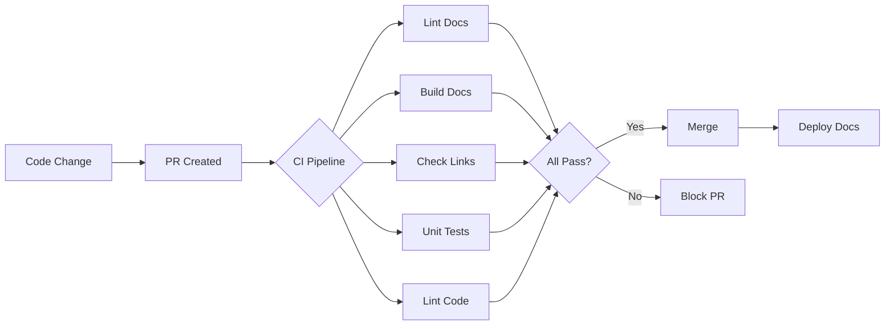
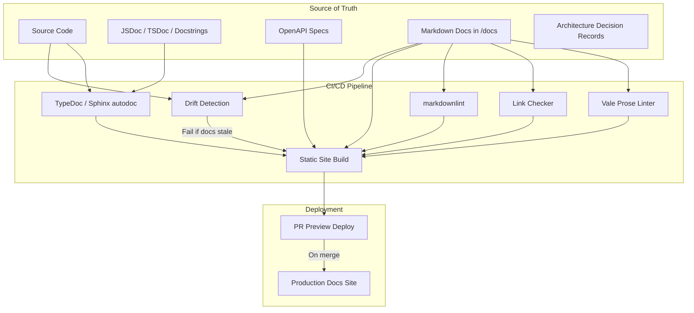

# Keeping Documentation Synchronized with Evolving Codebases
**Date**: 2026-03-29 12:00
**Document**: 20260329_1200_RESEARCH_documentation-sync-best-practices.md
**Category**: RESEARCH

---

## 1. Introduction

Documentation drift -- the gradual divergence between what code does and what documentation says -- is one of the most persistent problems in software engineering. A 2023 GitLab survey found that 42% of DevOps professionals identified keeping documentation up to date as a key challenge in their CI/CD workflows. As deployment velocity increases (many teams deploy multiple times daily), the gap between code reality and documentation widens unless teams adopt deliberate strategies and tooling.

This report synthesizes current industry best practices, tooling, and real-world examples for keeping documentation synchronized with evolving codebases. It covers the docs-as-code approach, CI/CD automation, drift detection, AI-assisted documentation, static site generators, and lessons from industry leaders like Stripe, Cloudflare, and GitLab.

---

## 2. Problem: Documentation Drift

Documentation drift occurs when code evolves but its corresponding documentation does not. The consequences compound over time:

- **Developer distrust**: Engineers stop reading docs they perceive as outdated, relying instead on source code reading or tribal knowledge.
- **Onboarding friction**: New team members waste days navigating stale guides. Studies suggest automated documentation processes lead to 30-50% faster onboarding when docs stay current.
- **Production incidents**: Undocumented edge cases, changed API contracts, and stale runbooks cause real outages.
- **Knowledge loss**: When the engineer who "knows how it works" leaves, undocumented decisions evaporate.

The root cause is structural: documentation lives outside the development workflow. Code changes go through CI/CD pipelines with automated testing, linting, and review gates. Documentation changes go through... nothing. As DeepDocs observes, "manual documentation is physically impossible to maintain when you're moving at DevOps speed."

Existing auto-generation tools (Swagger, Javadoc, Sphinx) only cover low-level API references. They miss conceptual guides, tutorials, onboarding materials, and architectural decision records -- the documentation that developers value most.

---

## 3. Industry Best Practices

### 3.1 Docs-as-Code

The docs-as-code methodology treats documentation with the same rigor and tooling as software. Core principles:

- **Plain text formats**: Write docs in Markdown, AsciiDoc, or reStructuredText -- formats that version control systems handle natively.
- **Same repository**: Store documentation alongside the code it describes. Changes to code and docs ship together in the same pull request.
- **Same review process**: Documentation changes require code review, just like code changes. Reviewers check both implementation and docs.
- **Same CI/CD pipeline**: Automated builds, tests, and deployment apply to documentation, not just code.
- **Same tooling**: Linters, formatters, and test runners enforce quality on documentation as they do on code.

Organizations like Write the Docs, Kong, and Fern advocate this approach as the industry standard for technical documentation in 2025-2026.

### 3.2 Shared Ownership Model

Stripe demonstrates the gold standard: documentation is not delegated to a separate technical writing team. Instead:

- Documentation contributions count toward performance reviews and promotions.
- A feature is not considered shipped until its documentation is written, reviewed, and published.
- Engineering onboarding includes writing workshops.
- Office hours with technical writers provide ongoing support.
- Managers publicly recognize high-quality documentation contributors.

The key insight: documentation quality is a cultural outcome, not a tooling problem. Tools enable; culture sustains.

### 3.3 Scheduled Review Cycles

Qodo's 2026 best practices recommend a three-tier review cadence:

1. **Per-PR**: Update docs in the same pull request that modifies behavior.
2. **Per-release**: Review documentation during release cycles for completeness.
3. **Quarterly audits**: Conduct full audits to identify obsolete content, broken links, and coverage gaps.

CI rules can block PRs that modify code without updating relevant documentation, enforcing the per-PR discipline automatically.

---

## 4. Automation and CI/CD Approaches

### 4.1 Documentation in the Pipeline

Continuous documentation (sometimes called DocOps) integrates documentation into existing CI/CD pipelines:

### 4.2 Prose Linting with Vale

Vale is the industry-standard prose linter for technical documentation. It enforces style guides programmatically:

- **Style packages**: Import Microsoft Writing Style Guide, Google Developer Documentation Style Guide, or custom rules.
- **Rule categories**: Capitalization, terminology consistency, hedging language, passive voice, jargon detection.
- **Format awareness**: Understands Markdown, reStructuredText, AsciiDoc, HTML -- avoids false positives on code blocks.
- **CI integration**: Runs in pull request checks, blocking merges on violations.

Organizations using Vale include GitLab, Grafana, Datadog, Meilisearch, and Spectro Cloud. GitLab runs Vale as a required CI check on all documentation changes.

### 4.3 Link Validation

Automated link checkers crawl documentation during builds to catch:

- Broken internal links (renamed pages, moved sections).
- Dead external URLs (HTTP 404, timeouts).
- Anchor references to deleted headings.

Tools like `markdown-link-check`, Lychee, and built-in checks in MkDocs and Docusaurus catch link rot before users encounter it.

### 4.4 Timestamp Automation

Rather than relying on manual "Last Updated" fields, extract the latest commit date for each documentation file from version control during the build process. This ensures timestamps reflect actual content changes without human intervention. Developers judge documentation reliability by timestamps -- a page showing a date from years ago is assumed obsolete even if technically accurate.

### 4.5 Auto-Generated API References

For API documentation specifically, design-first tools prevent drift by generating docs from a living specification:

- **OpenAPI/Swagger**: Define the API contract first, generate docs and client SDKs automatically.
- **TypeDoc/TSDoc**: Generate TypeScript API references from code comments.
- **Tspec**: Automatically parse TypeScript types and JSDoc to produce OpenAPI specifications.
- **Sphinx autodoc**: Generate Python API references from docstrings.

The design-first philosophy prevents drift because documentation IS the specification -- code and docs share a single source of truth.

---

## 5. Tools and Frameworks

### 5.1 Static Site Generators for Developer Docs

| Feature | MkDocs Material | Docusaurus | Astro Starlight |
|---------|----------------|------------|-----------------|
| **Language** | Python | React/JS | Astro (multi-framework) |
| **Maturity** | Stable (uncertainty around MkDocs 2.0 support) | v3.0, production-proven | Beta, rapidly maturing |
| **Markdown** | Standard Markdown | MDX (Markdown + JSX) | MDX (Markdown + any framework) |
| **Versioning** | Plugin-based | Built-in | Community plugin |
| **i18n** | Plugin-based | Built-in | Built-in |
| **Search** | Built-in (lunr.js) | Built-in (Algolia/local) | Built-in (Pagefind) |
| **Blog** | Plugin | Built-in | Requires Astro blog integration |
| **Math/Diagrams** | Plugin-based | Built-in (KaTeX, Mermaid) | Plugin-based |
| **Component flexibility** | Python/Jinja templates | React only | React, Vue, Svelte, Solid |
| **Performance** | Excellent (static HTML) | Good (React hydration) | Excellent (minimal JS) |
| **Best for** | Python projects, API docs | Large open-source projects | Modern projects, multi-framework teams |
| **Used by** | FastAPI, Pydantic | Meta, many OSS projects | Cloudflare (Astro-based) |

**Recommendation**: Docusaurus remains the safest choice for large projects needing versioning, i18n, and a mature ecosystem. Starlight is the forward-looking choice for teams already using Astro or wanting multi-framework component support. MkDocs Material is excellent for Python-centric projects but faces uncertainty with MkDocs 2.0 compatibility.

### 5.2 Documentation Hosting Platforms

| Platform | Key Feature |
|----------|------------|
| **Mintlify** | AI-native documentation with automatic suggestions, analytics, and user feedback |
| **ReadMe** | API references with interactive try-it explorers, changelogs, and onboarding |
| **GitBook** | Collaborative editing with Git sync, good for non-developer contributors |
| **Read the Docs** | Open-source hosting with automatic builds from Git pushes, popular in Python ecosystem |
| **Netlify/Vercel** | General-purpose hosting with preview deployments for documentation PRs |

### 5.3 Documentation Quality Tools

| Tool | Purpose | Integration |
|------|---------|-------------|
| **Vale** | Prose linting (style, grammar, terminology) | CLI, VS Code, CI/CD |
| **markdownlint** | Markdown formatting rules | CLI, VS Code, CI/CD |
| **textlint** | Pluggable text linting (Japanese support, natural language rules) | CLI, CI/CD |
| **Lychee / markdown-link-check** | Broken link detection | CLI, GitHub Actions |
| **BlockWatch** | Code-to-docs linking, drift detection via CI | CI/CD (emerging) |
| **Prettier** | Markdown formatting | CLI, pre-commit hooks |

### 5.4 AI-Assisted Documentation Tools

| Tool | Capability |
|------|-----------|
| **Mintlify** | AI-powered doc generation, scans codebase and produces structured docs |
| **Claude Code** | Reads code, generates OpenAPI specs, writes JSDoc/TSDoc, produces architecture docs |
| **GitHub Copilot** | Inline doc comment generation, README drafting |
| **DocuWriter.ai** | Automated code comments and DocBlocks |
| **Qodo** | Context-aware platform that surfaces historical decisions during PR reviews |
| **DeepDocs** | Automated documentation updates within GitHub workflows |

A 2026 Forrester study reports that organizations using AI documentation generators reduce content creation time by 85-90% while increasing documentation coverage by 340%. These numbers should be interpreted cautiously -- AI excels at generating initial drafts and boilerplate but still requires human review for accuracy and nuance.

---

## 6. Proposed Architecture

Based on the research, the following architecture represents current best practice for documentation synchronization:

### Key Design Decisions

1. **Single repository**: Code and docs live together. A PR that changes behavior must update corresponding docs.
2. **Automated reference docs**: API references are generated from code annotations -- never hand-written.
3. **Prose quality gates**: Vale and markdownlint run as required CI checks, blocking merges on violations.
4. **Link validation**: Every build validates all internal and external links.
5. **Preview deployments**: Every PR gets a preview URL so reviewers can see rendered docs before merge.
6. **Drift detection**: Custom or tool-based checks flag when code files change without corresponding doc updates.

---

## 7. Recommendations

### 7.1 Immediate Actions (Week 1-2)

1. **Adopt docs-as-code**: Move all documentation into the code repository under `/docs`. Use Markdown as the authoring format.
2. **Add Vale to CI**: Configure Vale with the Google Developer Documentation Style Guide or a custom style. Block PRs that fail prose linting.
3. **Add link checking to CI**: Integrate `markdown-link-check` or Lychee into the build pipeline.
4. **Enforce doc updates in PRs**: Add a CI check or PR template checkbox requiring documentation updates when code behavior changes.

### 7.2 Short-Term (Month 1-2)

5. **Choose a static site generator**: Docusaurus for JavaScript/TypeScript projects, MkDocs Material for Python projects, Starlight for Astro-based stacks.
6. **Auto-generate API references**: Configure TypeDoc, TSDoc, or equivalent to produce API documentation from code comments on every build.
7. **Set up preview deployments**: Deploy documentation previews on every PR using Netlify, Vercel, or Cloudflare Pages.
8. **Establish a style guide**: Document terminology, formatting conventions, and content structure standards.

### 7.3 Medium-Term (Quarter 1-2)

9. **Implement drift detection**: Build or adopt tooling that flags code changes without corresponding documentation updates.
10. **Integrate AI assistance**: Use Claude Code or Copilot to generate initial documentation drafts, with human review as a required gate.
11. **Add timestamp automation**: Extract last-modified dates from Git history during builds.
12. **Conduct quarterly audits**: Schedule recurring reviews to identify stale content, coverage gaps, and structural improvements.

### 7.4 Cultural Actions (Ongoing)

13. **Make documentation part of "done"**: A feature is not shipped until its docs are written and reviewed.
14. **Recognize documentation contributions**: Highlight quality documentation in team retrospectives, following Stripe's "doc star" model.
15. **Include docs in onboarding**: New engineers should contribute a documentation improvement in their first week.
16. **Measure documentation health**: Track metrics like doc coverage, update frequency, link validity rate, and user feedback.

---

## 8. Conclusion

The industry consensus in 2025-2026 is clear: documentation synchronization is a solved problem at the tooling level but remains an unsolved problem at the cultural level. The tools exist -- Vale for prose quality, static site generators for publishing, CI/CD for automation, AI for drafting. What distinguishes organizations with excellent documentation (Stripe, Cloudflare, GitLab) from the rest is cultural commitment: documentation is treated as a first-class deliverable, not an afterthought.

The most effective approach combines three pillars:

1. **Process integration**: Docs live in the same repo, go through the same review, and deploy through the same pipeline as code.
2. **Automated enforcement**: CI checks for prose quality, link validity, formatting, and drift detection prevent regression.
3. **Cultural incentives**: Documentation contributions are recognized, measured, and rewarded.

No single tool eliminates documentation drift. But the combination of docs-as-code workflows, CI/CD automation, AI-assisted drafting, and cultural prioritization brings documentation as close to code parity as current technology allows.

---

## Sources

- [Top 7 Code Documentation Best Practices for Teams (2026) - Qodo](https://www.qodo.ai/blog/code-documentation-best-practices-2026/)
- [Docs as Code - Write the Docs](https://www.writethedocs.org/guide/docs-as-code/)
- [What is Docs as Code? - Kong](https://konghq.com/blog/learning-center/what-is-docs-as-code)
- [Docs-as-Code: What is it, how it works - Fern](https://buildwithfern.com/post/docs-as-code)
- [Continuous Documentation in a CI/CD World - The New Stack](https://thenewstack.io/continuous-documentation-in-a-ci-cd-world/)
- [Why CI/CD Still Doesn't Include Continuous Documentation - DeepDocs](https://deepdocs.dev/why-ci-cd-still-doesnt-include-continuous-documentation/)
- [Docs Linting Guide - Fern](https://buildwithfern.com/post/docs-linting-guide)
- [Eliminate Documentation Drift with BlockWatch Linter](https://earezki.com/ai-news/2026-03-11-your-docs-are-likely-obsolete/)
- [How Stripe Creates the Best Documentation - Mintlify](https://www.mintlify.com/blog/stripe-docs)
- [Why Stripe's API Docs Are the Benchmark - Apidog](https://apidog.com/blog/stripe-docs/)
- [Inside Stripe's Engineering Culture - Pragmatic Engineer](https://newsletter.pragmaticengineer.com/p/stripe-part-2)
- [Starlight vs. Docusaurus for Building Documentation - LogRocket](https://blog.logrocket.com/starlight-vs-docusaurus-building-documentation/)
- [MkDocs vs Docusaurus for Technical Documentation - Damavis](https://blog.damavis.com/en/mkdocs-vs-docusaurus-for-technical-documentation/)
- [Best AI Documentation Generators in 2026 - NXCode](https://www.nxcode.io/resources/news/ai-documentation-generator-2026)
- [6 Best AI Tools for Coding Documentation in 2026 - Index.dev](https://www.index.dev/blog/best-ai-tools-for-coding-documentation)
- [Vale: Your Style, Our Editor](https://vale.sh)
- [How We Use Vale - Datadog](https://www.datadoghq.com/blog/engineering/how-we-use-vale-to-improve-our-documentation-editing-process/)
- [Vale Documentation Tests - GitLab](https://docs.gitlab.com/development/documentation/testing/vale/)
- [Cloudflare Documentation Repository - GitHub](https://github.com/cloudflare/cloudflare-docs)
- [TSDoc Specification](https://tsdoc.org/)
- [TypeDoc - Documentation Generator for TypeScript](https://typedoc.org/)
- [Tspec - Type-driven API Documentation](https://github.com/ts-spec/tspec)
- [Documentation Generation with Claude Code - Developer Toolkit](https://developertoolkit.ai/en/claude-code/lessons/documentation/)
- [A Key to High-Quality Documentation: Docs Linting in CI/CD - Netlify](https://www.netlify.com/blog/a-key-to-high-quality-documentation-docs-linting-in-ci-cd/)
- [How to Generate Documentation with GitHub Actions - OneUptime](https://oneuptime.com/blog/post/2026-01-27-generate-documentation-github-actions/view)
- [Scaling Writing Practices with Vale - Spectro Cloud](https://www.spectrocloud.com/blog/how-we-use-vale-to-enforce-better-writing-in-docs-and-beyond)
