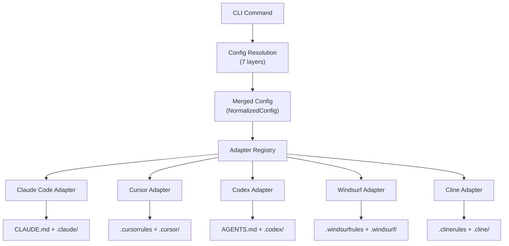

# 1. Overview

**Spec Version**: 1.0

## What is Codi?

Codi is a unified configuration platform for AI coding agents. It lets teams define rules, skills, agents, commands, and behavioral flags once in a `.codi/` directory, then generates the correct configuration file for each supported agent (Claude Code, Cursor, Codex, Windsurf, Cline).

One config. Every agent. No drift.

## Problem Statement

AI coding agents each require their own configuration file with incompatible formats. Teams using multiple agents must maintain parallel configs that inevitably diverge. Codi eliminates this drift by acting as a single source of truth.

## Design Philosophy

1. **Files over APIs** -- Configuration is plain YAML and Markdown. No runtime required to read it.
2. **Progressive disclosure** -- Start with `codi init`; add governance layers as needed.
3. **Adapter isolation** -- Each agent's output format is handled by a dedicated adapter. Core logic is format-agnostic.
4. **7-layer resolution** -- Configuration inherits through org, team, repo, lang, framework, agent, and user layers. Locked flags enforce policy.
5. **Deterministic output** -- Given the same `.codi/` input, generation always produces the same output files.

## Architecture

## Scope

This specification covers:

- The `.codi/` directory layout (see [Chapter 2](02-layout.md))
- The manifest format (see [Chapter 3](03-manifest.md))
- Artifact types: rules, skills, agents, commands (see [Chapter 4](04-artifacts.md))
- The generation pipeline and adapter system (see [Chapter 5](05-generation.md))
- Hook integration (see [Chapter 6](06-hooks.md))
- Presets and flag system (see [Chapters 7](07-presets.md) and [8](08-flags.md))
- Verification and compatibility (see [Chapters 9](09-verification.md) and [10](10-compatibility.md))

## What Codi is NOT

- Not a runtime agent framework (that is LangChain, CrewAI, etc.)
- Not a runtime protocol (that is MCP)
- Not a replacement for agent-native config files -- it generates them
