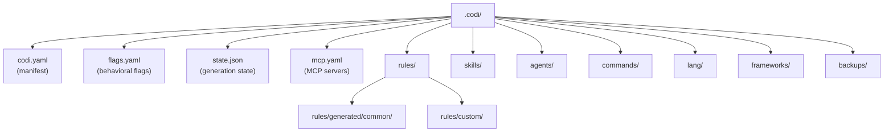

# 2. Layout

**Spec Version**: 1.0

## The `.codi/` Directory

All Codi configuration lives in a `.codi/` directory at the project root. This directory is the single source of truth for agent configuration.

## Directory Structure

## File Inventory

| Path | Format | Required | Description |
|------|--------|----------|-------------|
| `codi.yaml` | YAML | Yes | Project manifest (see [Chapter 3](03-manifest.md)) |
| `flags.yaml` | YAML | Yes | Behavioral flag values and modes (see [Chapter 8](08-flags.md)) |
| `state.json` | JSON | Auto | Generation state with file hashes. Auto-managed by `codi generate` |
| `mcp.yaml` | YAML | No | MCP server definitions distributed to each agent |
| `rules/custom/*.md` | Markdown | No | User-defined rules (see [Chapter 4](04-artifacts.md)) |
| `rules/generated/common/*.md` | Markdown | Auto | Template-managed rules created by `codi add --template` |
| `skills/*.md` | Markdown | No | Skill definitions |
| `agents/*.md` | Markdown | No | Agent definitions |
| `commands/*.md` | Markdown | No | Command definitions (Claude Code only) |
| `lang/*.yaml` | YAML | No | Language-specific flag overrides |
| `frameworks/*.yaml` | YAML | No | Framework-specific flag overrides |
| `backups/{timestamp}/` | Mixed | Auto | Automatic backups before generation (max 5) |

## Version Control

| Path | Commit? | Reason |
|------|---------|--------|
| `codi.yaml` | Yes | Source of truth |
| `flags.yaml` | Yes | Shared flag configuration |
| `state.json` | Yes | Enables drift detection for team |
| `rules/`, `skills/`, `agents/`, `commands/` | Yes | Shared artifacts |
| `backups/` | No | Local-only safety net |

## Global Configuration

User-level overrides live outside the project:

| Path | Purpose |
|------|---------|
| `~/.codi/user.yaml` | Personal flag overrides (layer 7, never committed) |
| `~/.codi/org.yaml` | Organization-wide policies with optional locking |
| `~/.codi/teams/{name}.yaml` | Team-level overrides referenced by `team:` in manifest |

## Related

- [Chapter 3: Manifest](03-manifest.md) for `codi.yaml` field reference
- [Chapter 4: Artifacts](04-artifacts.md) for artifact file format
- [Chapter 8: Flags](08-flags.md) for `flags.yaml` field reference
