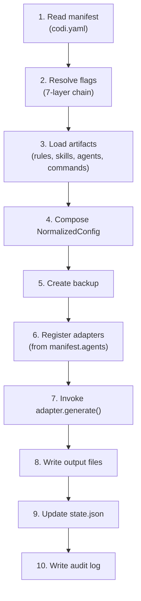

# 5. Generation

**Spec Version**: 1.0

## Overview

The `codi generate` command is the central pipeline that transforms `.codi/` configuration into agent-native output files. This chapter specifies the generation pipeline stages.

## Pipeline

## Stage Details

### 1. Manifest Read

Reads `.codi/codi.yaml` and validates against the `CodiManifest` schema. If `codi.requiredVersion` is set, the installed CLI version is checked.

### 2. Flag Resolution

Walks the 7-layer inheritance chain (see [Chapter 8](08-flags.md)):

1. `~/.codi/org.yaml` (org)
2. `~/.codi/teams/{name}.yaml` (team)
3. `.codi/flags.yaml` (repo)
4. `.codi/lang/*.yaml` (language)
5. `.codi/frameworks/*.yaml` (framework)
6. `.codi/agents/*.yaml` (agent)
7. `~/.codi/user.yaml` (user)

Locked flags (`locked: true`) halt resolution at their layer. Later layers cannot override them.

### 3. Artifact Loading

Reads Markdown files from `rules/`, `skills/`, `agents/`, `commands/` directories. Parses YAML frontmatter. Filters by `layers` settings in the manifest.

### 4. Config Composition

Merges resolved flags, loaded artifacts, manifest metadata, and MCP config into a single `NormalizedConfig` object.

### 5. Backup

Creates a timestamped copy of existing generated files in `.codi/backups/{timestamp}/`. Maximum 5 backups are retained. Older backups are pruned.

### 6-7. Adapter Execution

Each adapter registered in `manifest.agents` implements:

- `detect()` -- checks for existing agent config files
- `generate(config: NormalizedConfig)` -- produces output in the agent's native format

Flags are translated to natural-language instructions via shared `flag-instructions.ts` mappings (see [Chapter 8](08-flags.md)).

### 8-10. State and Audit

After writing files, `state.json` is updated with SHA-256 hashes of both source and generated files. This enables drift detection by `codi status`. An audit log entry records the generation event.

## CLI Options

| Option | Effect |
|--------|--------|
| `--agent <ids...>` | Generate for specific agents only |
| `--dry-run` | Preview output without writing files |
| `--force` | Regenerate even if files are unchanged |

## Related

- [Chapter 3: Manifest](03-manifest.md) for `agents` and `layers` fields
- [Chapter 4: Artifacts](04-artifacts.md) for artifact format and output mapping
- [Chapter 8: Flags](08-flags.md) for flag-to-instruction translation
