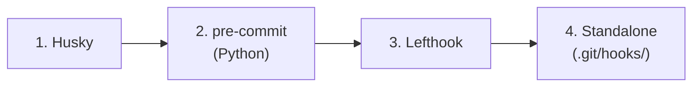

# 6. Hooks

**Spec Version**: 1.0

## Overview

Codi integrates with Git hook systems to enforce behavioral flags at commit time. The hook system detects existing hook runners, generates check scripts from flags, and installs them using the detected runner's configuration format.

## Detection Order

Codi probes for hook runners in this priority order:



The first detected runner is used. If none are found, Codi falls back to writing a standalone `.git/hooks/pre-commit` script.

## Flag-to-Hook Mapping

Only flags with hook implementations generate check scripts:

| Flag | Hook Action | Status |
|------|-------------|--------|
| `type_checking` | Runs `tsc --noEmit` (TypeScript) or `pyright` (Python) | Fully implemented |
| `security_scan` | Runs secret scanning tool | Config generated, requires external tooling |
| `max_file_lines` | Checks staged files against line limit | Config generated, requires external tooling |

Other flags (e.g., `allow_force_push`, `require_pr_review`) generate agent instructions but do not produce hook scripts.

## Installation by Runner

### Husky

Generates a script in `.husky/pre-commit`:

```bash
#!/usr/bin/env sh
. "$(dirname -- "$0")/_/husky.sh"
npx tsc --noEmit
```

### pre-commit (Python)

Adds entries to `.pre-commit-config.yaml`:

```yaml
repos:
  - repo: local
    hooks:
      - id: codi-type-check
        name: Type checking
        entry: tsc --noEmit
        language: system
```

### Lefthook

Adds entries to `lefthook.yml`:

```yaml
pre-commit:
  commands:
    codi-type-check:
      run: tsc --noEmit
```

### Standalone

Writes directly to `.git/hooks/pre-commit` with execute permissions.

## Limitations

- Only `type_checking` has a fully implemented hook mapping
- `security_scan` and `max_file_lines` generate configuration but depend on external tools being installed
- Hook installation does not modify existing hook content -- it appends or creates new entries

## Related

- [Chapter 8: Flags](08-flags.md) for flag definitions that drive hook generation
- [Chapter 5: Generation](05-generation.md) for hook generation within the pipeline
