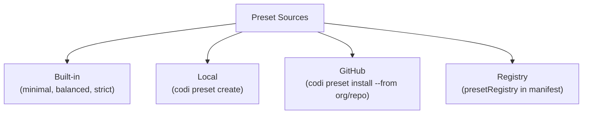

# 7. Presets

**Spec Version**: 1.0

## Overview

Presets are composable configuration packages that bundle flags, rules, skills, agents, commands, and MCP config into reusable units. They enable teams to share standardized configurations across projects.

## Built-in Presets

Codi ships with three built-in presets selected during `codi init`:

| Preset | Philosophy | Key Characteristics |
|--------|-----------|---------------------|
| `minimal` | Permissive | Security off, no test requirements, all actions allowed |
| `balanced` | Recommended | Security on, type-checking strict, no force-push |
| `strict` | Enforced | Security locked, tests required, shell/delete restricted |

### Flag Comparison

| Flag | Minimal | Balanced | Strict |
|------|---------|----------|--------|
| `security_scan` | `false` | `true` | `true` (enforced, locked) |
| `test_before_commit` | `false` | `true` | `true` (enforced, locked) |
| `type_checking` | `off` | `strict` | `strict` (enforced, locked) |
| `max_file_lines` | `1000` | `700` | `500` |
| `require_tests` | `false` | `false` | `true` (enforced, locked) |
| `allow_shell_commands` | `true` | `true` | `false` |
| `allow_file_deletion` | `true` | `true` | `false` |
| `allow_force_push` | `true` | `false` | `false` (enforced, locked) |
| `require_pr_review` | `false` | `true` | `true` (enforced, locked) |
| `drift_detection` | `off` | `warn` | `error` |

Flags marked "enforced, locked" in `strict` cannot be overridden by any lower layer.

## Preset Sources

### Local Presets

Created with `codi preset create <name>`. Exports the current `.codi/` configuration as a reusable preset package.

### GitHub Presets

Installed with `codi preset install <name> --from <org/repo>`. Downloads a preset from a GitHub repository.

### Registry Presets

Configured via `presetRegistry` in the manifest. Searched with `codi preset search` and installed with `codi preset install`.

## Preset Contents

A preset MAY include any combination of:

- `flags.yaml` -- flag values and modes
- `rules/` -- rule Markdown files
- `skills/` -- skill Markdown files
- `agents/` -- agent Markdown files
- `commands/` -- command Markdown files
- `mcp.yaml` -- MCP server definitions

## CLI Commands

| Command | Description |
|---------|-------------|
| `codi preset create <name>` | Export current config as preset |
| `codi preset list` | List available presets |
| `codi preset install <name>` | Install a preset |
| `codi preset search <query>` | Search preset registries |
| `codi preset update` | Update installed presets |

## Related

- [Chapter 8: Flags](08-flags.md) for individual flag definitions
- [Chapter 3: Manifest](03-manifest.md) for `presetRegistry` and `presets` fields
- [Chapter 4: Artifacts](04-artifacts.md) for artifact format within presets
