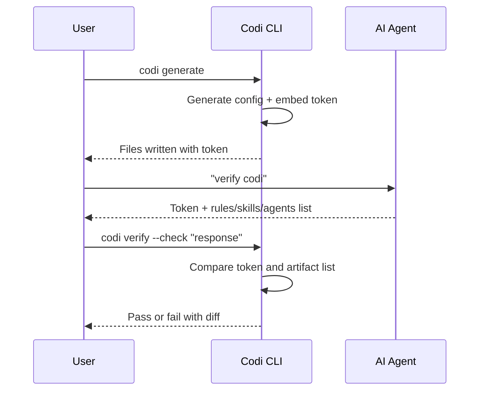

# 9. Verification

**Spec Version**: 1.0

## Overview

Codi provides a token-based verification system to confirm that an AI agent has correctly loaded its generated configuration. This enables teams to audit whether agents are operating under the intended rules and flags.

## Verification Flow



## Token Generation

During `codi generate`, a verification token is computed and embedded in the generated configuration file. The token is a deterministic hash derived from:

- The current manifest configuration
- The set of active rules, skills, and agents
- Flag values

The token format is: `codi-{hex_hash}` (e.g., `codi-0b354adc4dfa`).

## Embedded Verification Block

Each generated config file includes a verification section that the agent can read and report back:

```markdown
## Codi Verification

This project uses Codi for unified AI agent configuration.
- Verification token: `codi-0b354adc4dfa`
- Rules: architecture, code-style, error-handling, git-workflow, security, testing
- Skills: artifact-creator, codi-operations, e2e-testing
- Agents: code-reviewer, security-analyzer, test-generator
- Generated: 2026-03-25T14:33:08.043Z
```

## CLI Commands

### `codi verify`

Displays the current verification token and the expected agent response.

### `codi verify --check <response>`

Validates an agent's response against the expected token and artifact list. Exits with code 0 on match, non-zero on mismatch.

## Compliance Checking

`codi compliance` performs a comprehensive health check that includes:

- Token validity (matches current config)
- Drift detection (generated files match state.json hashes)
- Flag consistency (no conflicting overrides)
- Artifact completeness (all declared artifacts exist)

### CI Integration

```bash
codi compliance --ci
```

Exits non-zero on any compliance failure. Suitable for CI pipelines.

## Token Invalidation

The token changes whenever:

- Rules, skills, or agents are added, removed, or modified
- Flag values change
- The manifest is updated
- `codi generate` is re-run with different inputs

After any such change, `codi generate` MUST be re-run to produce a new valid token.

## Related

- [Chapter 5: Generation](05-generation.md) for token embedding in the pipeline
- [Chapter 10: Compatibility](10-compatibility.md) for conformance requirements
