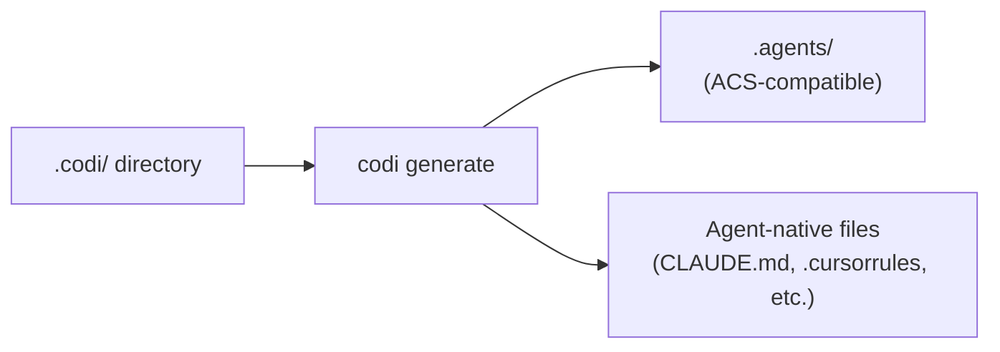

# 10. Compatibility

**Spec Version**: 1.0

## Overview

This chapter defines conformance requirements for tool builders integrating with Codi, and describes Codi's relationship to the Agentic Collaboration Standard (ACS).

## Supported Agents

| Agent | Config File | Rules | Skills | Agents | Commands | MCP |
|-------|------------|-------|--------|--------|----------|-----|
| Claude Code | `CLAUDE.md` | `.claude/rules/*.md` | `.claude/skills/*/SKILL.md` | `.claude/agents/*.md` | `.claude/commands/*.md` | `.claude/mcp.json` |
| Cursor | `.cursorrules` | `.cursor/rules/*.mdc` | `.cursor/skills/*/SKILL.md` | -- | -- | `.cursor/mcp.json` |
| Codex | `AGENTS.md` | Inline | `.agents/skills/*/SKILL.md` | `.codex/agents/*.toml` | -- | `.codex/mcp.toml` |
| Windsurf | `.windsurfrules` | Inline | `.windsurf/skills/*/SKILL.md` | -- | -- | `.windsurf/mcp.json` |
| Cline | `.clinerules` | Inline | `.cline/skills/*/SKILL.md` | -- | -- | -- |

## Adapter Conformance Checklist

A conformant Codi adapter MUST:

1. Implement `detect()` to check for existing agent config files
2. Implement `generate(config: NormalizedConfig)` to produce output
3. Translate all instruction-generating flags to natural-language text
4. Respect `layers` settings from the manifest (skip disabled artifact types)
5. Embed the verification token and artifact list in the output
6. Write output files only to the agent's designated paths
7. Support `--dry-run` mode (return output without writing)

A conformant adapter SHOULD:

8. Handle MCP configuration distribution in the agent's native format
9. Respect artifact size limits (6,000 chars per artifact, 12,000 chars total)
10. Produce deterministic output for identical input

## ACS Compatibility

Codi's Codex adapter generates output compatible with the Agentic Collaboration Standard (ACS):

### ACS Mapping

| Codi Concept | ACS Equivalent |
|-------------|----------------|
| `codi.yaml` | `main.yaml` (manifest) |
| `rules/` | `context/` (context files) |
| `skills/` | `skills/` (SKILL.md format) |
| `agents/` | `agents/` (subagent definitions) |
| `commands/` | `commands/` (command files) |
| `flags.yaml` | `permissions/policy.yaml` (permissions) |

## Health Checks

| Command | Purpose | CI Exit Code |
|---------|---------|-------------|
| `codi doctor` | Project health (config validity, version, drift) | Non-zero on failure |
| `codi compliance` | Full compliance audit | Non-zero on failure |
| `codi ci` | Composite CI validation | Non-zero on failure |

## Adding a New Agent

To add support for a new AI agent:

1. Create an adapter in `src/adapters/` implementing `detect()` and `generate()`
2. Register the adapter ID in the adapter registry
3. Add the agent ID to the `agents` enum in the manifest schema
4. Map flag instructions to the agent's output format
5. Document the agent's output paths in this specification

## Related

- [Chapter 4: Artifacts](04-artifacts.md) for artifact output mapping per agent
- [Chapter 5: Generation](05-generation.md) for the adapter execution pipeline
- [Chapter 9: Verification](09-verification.md) for compliance checking
