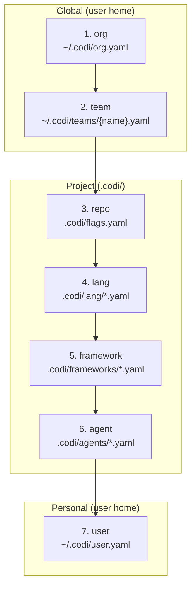

# Governance: 7-Level Config Inheritance

Codi resolves configuration through 7 layers. Each layer can set, override, or lock flag values. Later layers override earlier ones — unless a flag is locked.

## Inheritance Diagram



**Resolution direction:** Layer 7 (user) has the highest override priority for non-locked flags. Layers 1-3 (org, team, repo) can lock flags to prevent overrides.

## Layer Descriptions

| # | Layer | Location | Purpose |
|---|-------|----------|---------|
| 1 | **org** | `~/.codi/org.yaml` | Organization-wide security policies |
| 2 | **team** | `~/.codi/teams/{name}.yaml` | Team-specific standards |
| 3 | **repo** | `.codi/flags.yaml` | Project-level configuration |
| 4 | **lang** | `.codi/lang/*.yaml` | Language-specific overrides (e.g., `typescript.yaml`) |
| 5 | **framework** | `.codi/frameworks/*.yaml` | Framework-specific defaults (e.g., `nextjs.yaml`) |
| 6 | **agent** | `.codi/agents/*.yaml` | Agent-specific overrides (e.g., `claude-code.yaml`) |
| 7 | **user** | `~/.codi/user.yaml` | Personal preferences (never committed) |

## Organization Policy Enforcement

### Org-level locked flags

```yaml
# ~/.codi/org.yaml — enforced across all projects
flags:
  security_scan:
    mode: enforced
    value: true
    locked: true          # No project can disable this

  allow_force_push:
    mode: enforced
    value: false
    locked: true          # Force push prohibited company-wide
```

### Team-level overrides

```yaml
# ~/.codi/teams/frontend.yaml — team-level overrides
flags:
  max_file_lines:
    mode: enabled
    value: 500            # Stricter than default 700

  allowed_languages:
    mode: enabled
    value: [typescript, javascript, css]
```

### Project-level conditional flags

```yaml
# .codi/flags.yaml — project-level (can't override locked org flags)
flags:
  require_tests:
    mode: conditional
    value: true
    conditions:
      lang: [typescript]  # Only require tests for TypeScript files
```

### User-level personal preferences

```yaml
# ~/.codi/user.yaml — personal preferences (never committed)
flags:
  auto_commit:
    mode: enabled
    value: true           # Personal preference for auto-commit
```

### Resolution Result

Given the layers above, the final resolved values are:

- `security_scan` = `true` (locked at org, cannot be changed)
- `allow_force_push` = `false` (locked at org)
- `max_file_lines` = `500` (team override)
- `require_tests` = `true` for TypeScript, `false` otherwise (conditional at repo)
- `auto_commit` = `true` (user personal preference)

## Locking Flags

Flags can be locked at org, team, or repo levels to prevent lower layers from overriding them:

```yaml
security_scan:
  mode: enforced
  value: true
  locked: true
```

Attempting to override a locked flag at a lower layer produces a validation error. This is the primary mechanism for enforcing organizational policies across all projects and teams.
