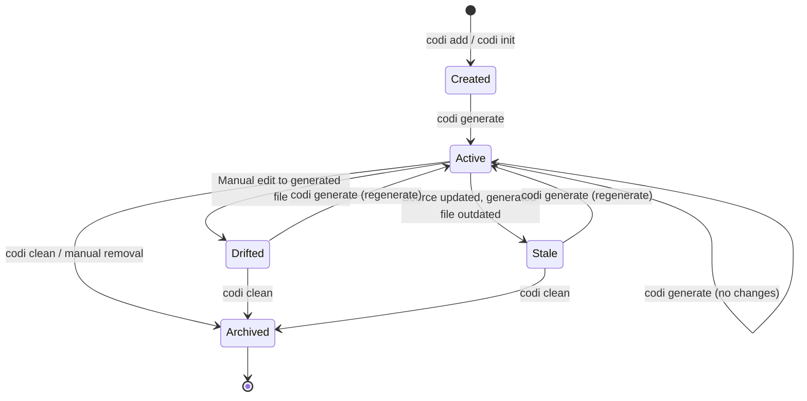
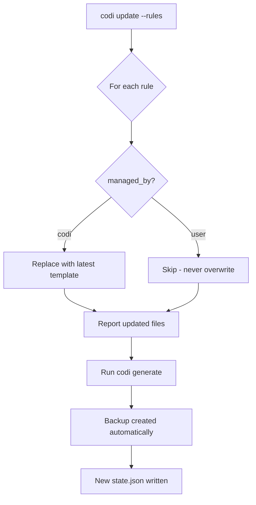
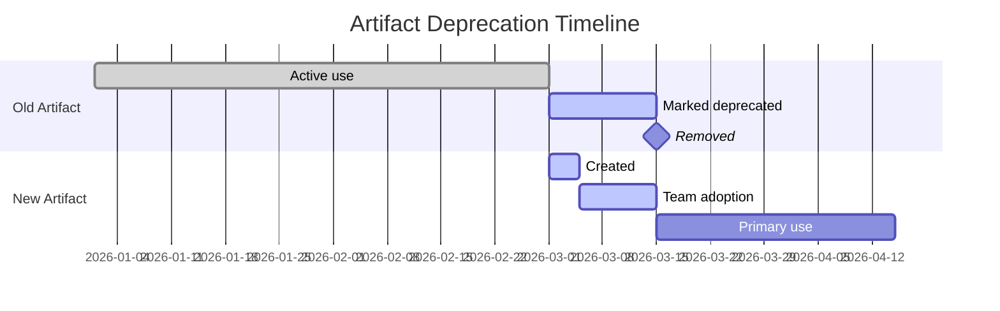

# Artifact Lifecycle Guide

**Date**: 2026-03-25
**Document**: artifact-lifecycle.md

This guide explains how codi artifacts (rules, skills, agents, commands) are created, managed, updated, and retired over time. Understanding the lifecycle helps you keep your configuration healthy and avoid drift.

## Artifact Ownership Model

Every artifact has a `managed_by` field in its YAML frontmatter that determines who controls its content:

| Ownership | Value | Behavior |
|-----------|-------|----------|
| **Codi-managed** | `managed_by: codi` | Created from a template. Updated automatically by `codi update`. |
| **User-managed** | `managed_by: user` | Created by you. Never overwritten by codi. Fully under your control. |

### How ownership is assigned

| Action | Ownership |
|--------|-----------|
| `codi add rule security --template security` | `managed_by: codi` |
| `codi add rule my-custom-rule` | `managed_by: user` |
| `codi add rule --all` | `managed_by: codi` (batch template creation) |
| Manual file creation in `.codi/rules/custom/` | `managed_by: user` (default when no frontmatter) |

### Changing ownership

To convert a codi-managed artifact to user-managed, edit the frontmatter:

```yaml
---
managed_by: user   # was: codi
description: My customized security rules
---
```

After this change, `codi update` will skip the file. To revert to codi management, change `managed_by` back to `codi` and run `codi update --rules`.

## Artifact State Machine

Every artifact moves through a predictable set of states:



### State definitions

| State | Description | Detection |
|-------|-------------|-----------|
| **Created** | Source file exists in `.codi/` but has not been generated yet. | `codi status` shows no entry for this artifact. |
| **Active** | Generated file matches the source. Hashes align. | `codi status` reports `synced`. |
| **Drifted** | Someone edited the generated file directly (e.g., `CLAUDE.md`). | `codi status` reports `drifted`. Hash mismatch. |
| **Stale** | Source in `.codi/` changed but `codi generate` has not run. | `codi status` reports `drifted` (source hash differs). |
| **Archived** | Generated file removed. Source may still exist in `.codi/`. | `codi status` reports `missing`. |

## Drift Detection Deep Dive

Drift detection is the mechanism codi uses to determine whether generated files still match their source configuration. It relies on content hashing stored in `.codi/state.json`.

### How hashes work

When `codi generate` runs, it:

1. Reads all source files (rules, skills, agents, flags) that contribute to a generated file.
2. Computes a `sourceHash` from the combined source content.
3. Writes the generated output file (e.g., `CLAUDE.md`).
4. Computes a `generatedHash` from the output file content.
5. Stores both hashes in `.codi/state.json` along with a timestamp.

```json
{
  "version": "1",
  "lastGenerated": "2026-03-25T10:30:00.000Z",
  "agents": {
    "claude-code": [
      {
        "path": "CLAUDE.md",
        "sourceHash": "a1b2c3d4",
        "generatedHash": "e5f6g7h8",
        "sources": [".codi/rules/custom/security.md", ".codi/flags.yaml"],
        "timestamp": "2026-03-25T10:30:00.000Z"
      }
    ]
  }
}
```

### What `codi status` checks

When you run `codi status`, codi:

1. Reads `.codi/state.json` to get the expected `generatedHash` for each file.
2. Reads the actual generated file from disk.
3. Computes the current hash of the file on disk.
4. Compares: if `currentHash === generatedHash`, the file is **synced**. Otherwise, it is **drifted**.
5. If the file does not exist on disk, it is reported as **missing**.

```bash
# Check drift status
codi status

# Machine-readable output for scripts
codi status --json
```

### Drift scenarios

| Scenario | Source hash | Generated hash | Disk hash | Status |
|----------|-----------|----------------|-----------|--------|
| Everything aligned | A | B | B | synced |
| Manual edit to output | A | B | C | drifted |
| File deleted | A | B | (none) | missing |
| Source changed, not regenerated | A' | B | B | synced* |

*Note: `codi status` checks the generated file against its stored hash. To detect source staleness, use `codi doctor` which also validates that sources have not changed since last generation.

## Update Workflow

The `codi update` command refreshes codi-managed artifacts to the latest template versions.

### Updating managed artifacts

```bash
# Update all managed artifact types
codi update --rules --skills --agents

# Update only rules
codi update --rules

# Preview changes without writing
codi update --dry-run

# Pull updates from a remote team repository
codi update --from org/team-config-repo
```

### Update rules

1. Only artifacts with `managed_by: codi` are updated.
2. User-managed artifacts (`managed_by: user`) are never touched.
3. After updating source files, run `codi generate` to propagate changes to generated files.
4. A backup is created automatically before generation in `.codi/backups/{timestamp}/`.

### Update flow



## When to Archive vs Delete Artifacts

### Archive (keep source, remove output)

Use `codi clean` when you want to remove generated files but keep your source configuration:

```bash
# Remove generated files only
codi clean

# Preview what would be removed
codi clean --dry-run

# Remove everything including backups
codi clean --all
```

**When to archive:**
- Temporarily disabling an agent (remove its generated file, keep the config).
- Switching branches where different agents are used.
- Cleaning up before a fresh `codi generate`.

### Delete (remove source and output)

Manually delete the source file from `.codi/` when the artifact is no longer needed:

```bash
# Remove a custom rule entirely
rm .codi/rules/custom/deprecated-rule.md

# Regenerate to remove it from output files
codi generate
```

**When to delete:**
- The rule, skill, or agent is permanently retired.
- It was replaced by a better artifact.
- It conflicts with new project requirements.

## Deprecation Workflow for Rules and Skills

When retiring an artifact, follow this workflow to avoid disruption:

### Step 1: Mark as deprecated

Add a deprecation notice to the artifact frontmatter:

```yaml
---
managed_by: user
description: "DEPRECATED: Use 'security-v2' instead. Will be removed in next sprint."
deprecated: true
---
```

### Step 2: Communicate to the team

Run `codi doctor` which will flag deprecated artifacts. Include the deprecation in your commit message:

```bash
git commit -m "chore: deprecate old security rule in favor of security-v2"
```

### Step 3: Create the replacement

```bash
codi add rule security-v2
# Edit .codi/rules/custom/security-v2.md with new content
codi generate
```

### Step 4: Remove the deprecated artifact

After the team has migrated:

```bash
rm .codi/rules/custom/deprecated-rule.md
codi generate
git commit -m "chore: remove deprecated security rule"
```

### Deprecation timeline



## Best Practices

1. **Commit `.codi/state.json`** so your team shares drift detection state.
2. **Run `codi status` before committing** to catch unintended drift.
3. **Use `codi doctor --ci` in CI** to block PRs with stale generated files.
4. **Prefer user-managed artifacts** for project-specific rules that should not change with template updates.
5. **Use `codi update --dry-run`** before updating to preview what will change.
6. **Restore from backup** with `codi revert --list` if an update introduces problems.

## Related Documentation

- [Architecture](../architecture.md) — Artifact lifecycle internals and adapter design
- [Configuration](../configuration.md) — Flags, presets, and directory structure
- [Writing Artifacts](writing-rules.md) — How to author rules, skills, agents, and commands
- [CI Integration](ci-integration.md) — Automated drift detection in pipelines
- [Cloud CI Guide](cloud-ci.md) — Full CI/CD pipeline examples
