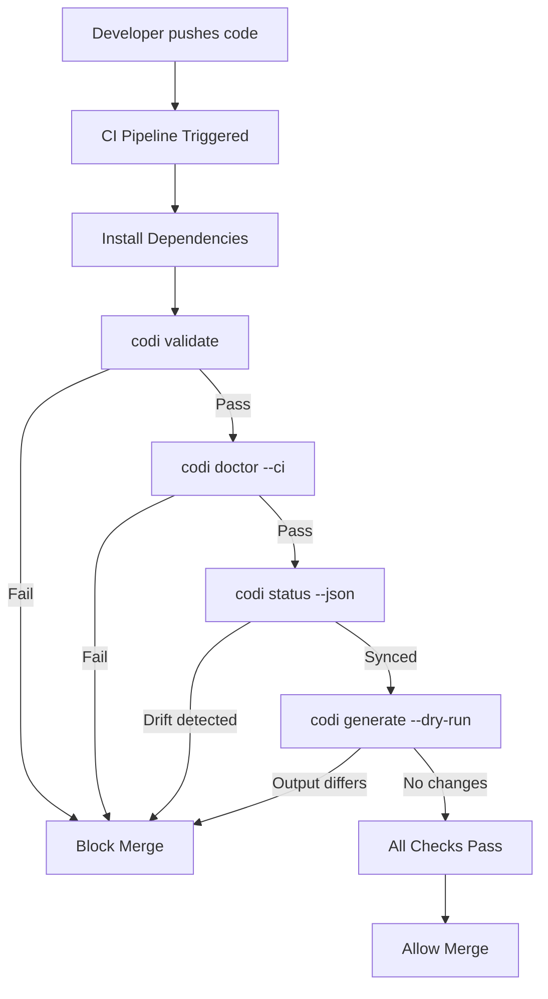
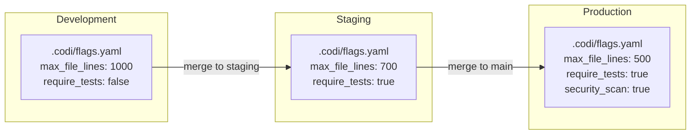

# Cloud CI Integration Guide

**Date**: 2026-03-25
**Document**: cloud-ci.md

This guide provides complete CI/CD pipeline configurations for validating codi configuration across GitHub Actions, GitLab CI, Azure DevOps, and Docker environments.

## CI Pipeline Flow



## Pre-Merge vs Post-Merge Validation

| Phase | Commands | Purpose |
|-------|----------|---------|
| **Pre-merge** | `codi validate`, `codi doctor --ci`, `codi status` | Block PRs with invalid config or drift |
| **Post-merge** | `codi generate --dry-run`, `codi compliance --ci` | Detect configuration drift on main branch |

## GitHub Actions

### Basic Workflow

```yaml
# .github/workflows/codi.yml
name: Codi Compliance
on:
  push:
    branches: [main, develop]
  pull_request:
    branches: [main]

jobs:
  validate:
    runs-on: ubuntu-latest
    steps:
      - name: Checkout repository
        uses: actions/checkout@v4

      - name: Setup Node.js
        uses: actions/setup-node@v4
        with:
          node-version: 20
          cache: npm

      - name: Install dependencies
        run: npm ci

      - name: Validate codi configuration
        run: npx codi ci

      - name: Check drift status
        run: npx codi status --json
```

### Full Workflow with Dry-Run Verification

```yaml
# .github/workflows/codi-full.yml
name: Codi Full Validation
on:
  pull_request:
    branches: [main]
    paths:
      - '.codi/**'
      - 'CLAUDE.md'
      - '.cursorrules'
      - 'AGENTS.md'
      - '.windsurfrules'
      - '.clinerules'

jobs:
  codi-check:
    runs-on: ubuntu-latest
    steps:
      - name: Checkout repository
        uses: actions/checkout@v4

      - name: Setup Node.js
        uses: actions/setup-node@v4
        with:
          node-version: 20
          cache: npm

      - name: Install dependencies
        run: npm ci

      - name: Validate configuration
        run: npx codi validate

      - name: Run doctor checks
        run: npx codi doctor --ci

      - name: Check for drift
        run: |
          DRIFT=$(npx codi status --json)
          echo "$DRIFT"
          echo "$DRIFT" | node -e "
            const data = JSON.parse(require('fs').readFileSync('/dev/stdin','utf8'));
            const drifted = Object.values(data).flat().filter(f => f.status !== 'synced');
            if (drifted.length > 0) {
              console.error('Drift detected in', drifted.length, 'files');
              process.exit(1);
            }
          "

      - name: Verify dry-run produces no changes
        run: |
          npx codi generate --dry-run > /dev/null 2>&1
          if [ $? -ne 0 ]; then
            echo "Generated files would change. Run 'codi generate' locally and commit."
            exit 1
          fi

      - name: Run compliance report
        if: always()
        run: npx codi compliance --ci --json
```

### Caching `.codi/` State

```yaml
      - name: Cache codi state
        uses: actions/cache@v4
        with:
          path: .codi/backups
          key: codi-backups-${{ hashFiles('.codi/state.json') }}
          restore-keys: |
            codi-backups-
```

## GitLab CI

### Basic Pipeline

```yaml
# .gitlab-ci.yml
stages:
  - validate

codi-validate:
  stage: validate
  image: node:20-slim
  cache:
    key:
      files:
        - package-lock.json
    paths:
      - node_modules/
  script:
    - npm ci --prefer-offline
    - npx codi ci
    - npx codi status --json
  rules:
    - changes:
        - .codi/**/*
        - CLAUDE.md
        - .cursorrules
        - AGENTS.md
        - .windsurfrules
        - .clinerules
```

### Full Pipeline with Compliance

```yaml
# .gitlab-ci.yml
stages:
  - validate
  - compliance

variables:
  NODE_ENV: ci

codi-validate:
  stage: validate
  image: node:20-slim
  cache:
    key:
      files:
        - package-lock.json
    paths:
      - node_modules/
  script:
    - npm ci --prefer-offline
    - npx codi validate
    - npx codi doctor --ci
    - npx codi status --json
  rules:
    - if: '$CI_PIPELINE_SOURCE == "merge_request_event"'
    - if: '$CI_COMMIT_BRANCH == "main"'

codi-compliance:
  stage: compliance
  image: node:20-slim
  cache:
    key:
      files:
        - package-lock.json
    paths:
      - node_modules/
  script:
    - npm ci --prefer-offline
    - npx codi compliance --ci --json
  artifacts:
    reports:
      dotenv: codi-report.env
    paths:
      - codi-compliance.json
    when: always
  rules:
    - if: '$CI_COMMIT_BRANCH == "main"'
```

## Azure DevOps

### Basic Pipeline

```yaml
# azure-pipelines.yml
trigger:
  branches:
    include:
      - main
      - develop
  paths:
    include:
      - .codi/*
      - CLAUDE.md
      - .cursorrules
      - AGENTS.md

pr:
  branches:
    include:
      - main

pool:
  vmImage: ubuntu-latest

steps:
  - task: NodeTool@0
    inputs:
      versionSpec: '20.x'
    displayName: 'Install Node.js 20'

  - script: npm ci
    displayName: 'Install dependencies'

  - script: npx codi ci
    displayName: 'Codi CI validation'

  - script: npx codi status --json
    displayName: 'Check drift status'
```

### Full Pipeline with Stages

```yaml
# azure-pipelines.yml
trigger:
  branches:
    include:
      - main

pr:
  branches:
    include:
      - main

pool:
  vmImage: ubuntu-latest

stages:
  - stage: Validate
    displayName: 'Codi Validation'
    jobs:
      - job: CodiCheck
        displayName: 'Configuration Check'
        steps:
          - task: NodeTool@0
            inputs:
              versionSpec: '20.x'

          - task: Cache@2
            inputs:
              key: 'npm | "$(Agent.OS)" | package-lock.json'
              path: node_modules
            displayName: 'Cache node_modules'

          - script: npm ci
            displayName: 'Install dependencies'

          - script: npx codi validate
            displayName: 'Validate config'

          - script: npx codi doctor --ci
            displayName: 'Doctor check'

          - script: npx codi status --json
            displayName: 'Drift detection'

  - stage: Compliance
    displayName: 'Compliance Report'
    dependsOn: Validate
    condition: succeeded()
    jobs:
      - job: Report
        steps:
          - task: NodeTool@0
            inputs:
              versionSpec: '20.x'

          - script: npm ci
            displayName: 'Install dependencies'

          - script: npx codi compliance --ci --json > $(Build.ArtifactStagingDirectory)/compliance.json
            displayName: 'Generate compliance report'

          - publish: $(Build.ArtifactStagingDirectory)/compliance.json
            artifact: codi-compliance
            displayName: 'Publish compliance report'
```

## Docker Integration

### Multi-Stage Build with Codi Validation

```dockerfile
# Dockerfile
FROM node:20-slim AS deps
WORKDIR /app
COPY package*.json ./
RUN npm ci --prefer-offline

FROM deps AS codi-validate
COPY .codi/ .codi/
COPY CLAUDE.md .cursorrules AGENTS.md .windsurfrules .clinerules ./
RUN npx codi validate && npx codi doctor --ci && npx codi status --json

FROM deps AS build
COPY . .
RUN npm run build

FROM node:20-slim AS runtime
WORKDIR /app
COPY --from=build /app/dist ./dist
COPY --from=build /app/node_modules ./node_modules
CMD ["node", "dist/index.js"]
```

The `codi-validate` stage runs independently. If validation fails, the Docker build halts before reaching the `build` stage.

### Docker Compose for Local CI Simulation

```yaml
# docker-compose.ci.yml
services:
  codi-check:
    build:
      context: .
      target: codi-validate
    volumes:
      - ./.codi:/app/.codi:ro
```

```bash
# Run locally to simulate CI
docker compose -f docker-compose.ci.yml build codi-check
```

## Multi-Environment Configurations

For projects that need different codi configurations per environment, use branch-based or directory-based strategies.

### Branch-Based Strategy



Each branch maintains its own `flags.yaml` with environment-appropriate settings.

### Layer-Based Strategy (Recommended)

Use codi's 7-layer resolution to apply environment-specific overrides without branch divergence:

```
~/.codi/org.yaml          # Organization-wide defaults (locked flags)
~/.codi/teams/backend.yaml # Team-level overrides
.codi/flags.yaml          # Repository defaults
~/.codi/user.yaml         # Developer personal preferences
```

In CI, set org-level config via environment variables or mounted config files:

```yaml
# GitHub Actions example with org config
- name: Setup org config
  run: |
    mkdir -p ~/.codi
    echo "${{ secrets.CODI_ORG_CONFIG }}" > ~/.codi/org.yaml

- name: Run codi CI
  run: npx codi ci
```

## Caching Strategies

### What to cache

| Path | Cache? | Reason |
|------|--------|--------|
| `node_modules/` | Yes | Avoid reinstalling codi-cli each run |
| `.codi/backups/` | Optional | Preserve backup history across runs |
| `.codi/state.json` | No | Must reflect current repo state |

### Cache keys

Use `package-lock.json` hash as the primary cache key for `node_modules`. For backups, use `state.json` hash:

```yaml
# GitHub Actions
- uses: actions/cache@v4
  with:
    path: node_modules
    key: npm-${{ runner.os }}-${{ hashFiles('package-lock.json') }}
```

## Exit Codes Reference

CI scripts should handle these exit codes:

| Code | Meaning | Action |
|------|---------|--------|
| 0 | All checks passed | Allow merge |
| 1 | General error | Investigate logs |
| 2 | Config invalid | Fix `.codi/` configuration |
| 3 | Config not found | Run `codi init` |
| 7 | Drift detected | Run `codi generate` locally |
| 9 | Doctor check failed | Fix reported issues |
| 12 | Verification mismatch | Regenerate after config change |

## Related Documentation

- [CI Integration](ci-integration.md) — Core CI concepts and `codi ci` command
- [Architecture](../architecture.md) — How state management and drift detection work
- [Artifact Lifecycle](artifact-lifecycle.md) — Understanding drift states and remediation
- [Security Guide](security.md) — Securing secrets in CI pipelines
