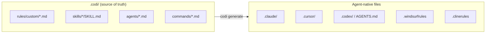
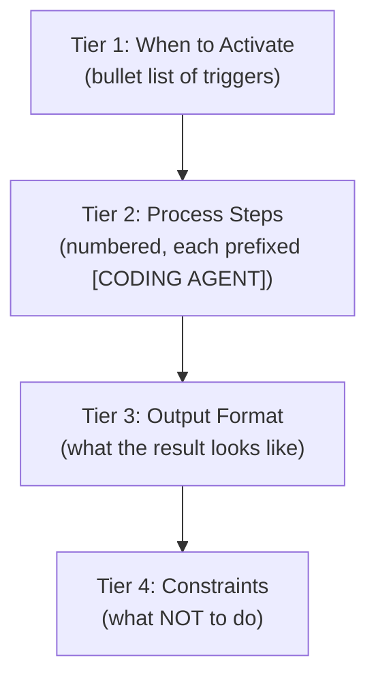
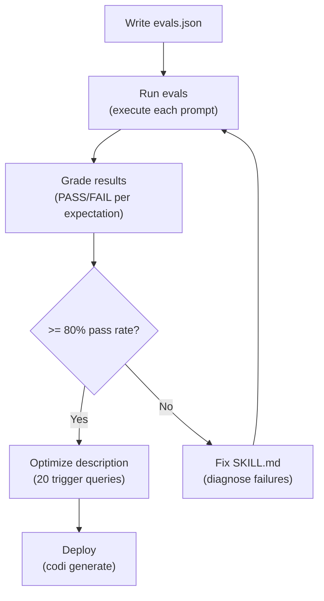
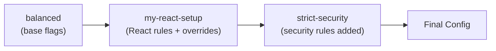
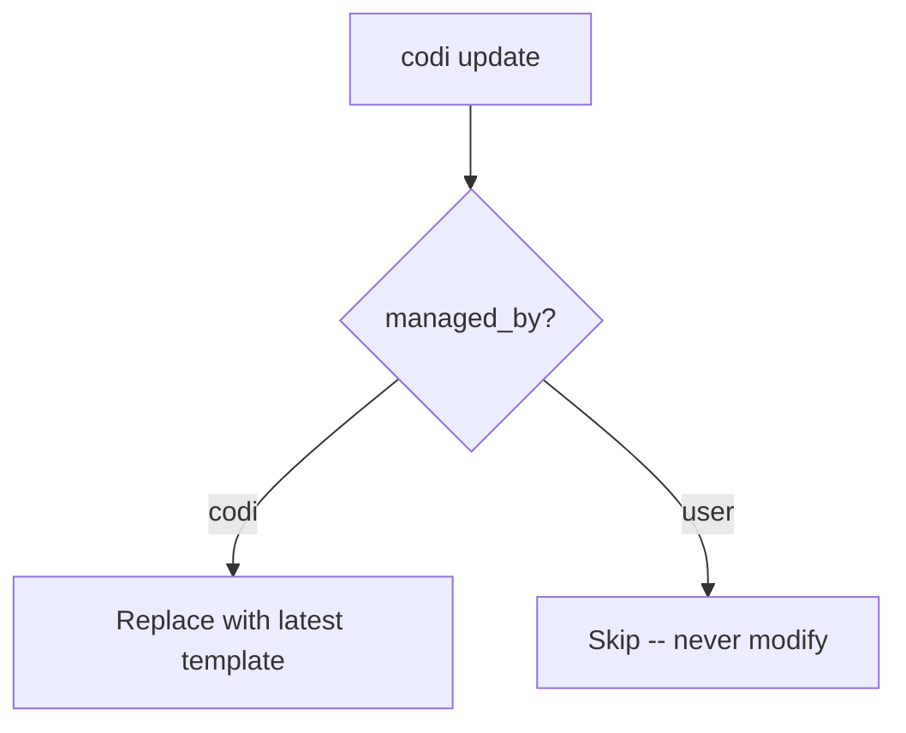

# Writing Codi Artifacts
**Date**: 2026-03-25
**Document**: writing-artifacts.md
**Category**: GUIDE

## Overview

Codi artifacts are Markdown files with YAML frontmatter that configure how AI coding agents behave in your project. There are five artifact types:

| Type | Purpose | Always active? | Agent support |
|------|---------|---------------|---------------|
| **Rule** | Constraints and policies agents MUST follow | Yes (`alwaysApply`) | All 5 agents |
| **Skill** | Reusable workflows agents invoke on demand | No (triggered by prompt) | All 5 agents |
| **Agent** | Specialized subagent with a focused role | No (spawned by parent) | Claude Code, Codex |
| **Command** | Slash command the user types directly | No (user invokes) | Claude Code only |
| **Preset** | Bundle of flags + artifacts for distribution | N/A (configuration) | All 5 agents |

All artifacts follow the same lifecycle: **create, store, generate, update, clean**. See [artifact-lifecycle.md](artifact-lifecycle.md) for details.



## Quick Reference: Which Artifact Type?

| I want to... | Use | Example |
|---|---|---|
| Enforce a coding standard | Rule | "Never use `any` type" |
| Restrict file patterns for a rule | Rule with `scope` | "API routes must return typed responses" |
| Define a reusable workflow | Skill | "Code review checklist" |
| Create a specialist subagent | Agent | "Security analyzer" |
| Add a slash command | Command | "/review" |
| Bundle a configuration for sharing | Preset | "typescript-fullstack" |
| Set project-wide constraints | Preset with `flags.yaml` | "Max 500 lines per file" |

---

## 1. Rules

### What Are Rules?

Rules are always-active instructions that AI agents MUST follow. They describe constraints, policies, conventions, and standards for your project. Think of them as a style guide that the AI reads before every interaction.

Rules live in `.codi/rules/custom/` as Markdown files with YAML frontmatter.

### Creating a Rule (CLI)

```bash
# From scratch (managed_by: user)
codi add rule our-api-conventions

# From a built-in template (managed_by: codi)
codi add rule security --template security

# Create all available templates
codi add rule --all
```

### Creating a Rule (Manual)

Create a file at `.codi/rules/custom/<name>.md`:

```markdown
---
name: our-api-conventions
description: Team API design conventions for REST endpoints
priority: high
alwaysApply: true
managed_by: user
scope:
  - src/api/**
  - src/routes/**
language: typescript
---

# API Conventions

## Endpoint Naming
- Use plural nouns: `/users`, `/orders` (not `/user`, `/getOrders`)
- Use kebab-case for multi-word paths: `/order-items`

## Response Format
All endpoints must return:
- Success: `{ data: T, meta?: { page, total } }`
- Error: `{ error: { code: string, message: string } }`
```

### Frontmatter Reference

| Field | Type | Required | Default | Description |
|-------|------|----------|---------|-------------|
| `name` | string | Yes | -- | Kebab-case identifier. Must match `/^[a-z0-9-]+$/`, max 64 chars |
| `description` | string | Yes | -- | One-line summary, max 512 chars |
| `priority` | `high` \| `medium` \| `low` | No | `medium` | Controls ordering in generated output |
| `alwaysApply` | boolean | No | `true` | If true, always included in output |
| `managed_by` | `codi` \| `user` | No | `user` | Who owns this artifact (see [Artifact Ownership](#artifact-ownership)) |
| `scope` | string[] | No | -- | Glob patterns restricting where this rule applies |
| `language` | string | No | -- | Language-specific rule (e.g., `typescript`, `python`) |

### Content Best Practices

#### Use imperative mood

Write commands, not suggestions.

| Weak | Strong |
|------|--------|
| "You should validate inputs" | "Validate all inputs at system boundaries" |
| "Tests should be independent" | "Keep tests independent -- no shared mutable state" |
| "It's good practice to use types" | "Use strict types -- never use `any`" |

#### Include rationale annotations

Rules with a "why" are followed more reliably by AI agents. Append rationale after an em dash:

```markdown
- Use parameterized queries -- prevents SQL injection
- Pin dependency versions in lock files -- reproducible builds across environments
- Keep functions under 30 lines -- extract when longer to maintain readability
```

#### Show BAD/GOOD examples

For complex patterns, contrast ineffective and effective approaches:

```markdown
## Error Response Format

**BAD** -- returns untyped string:
```typescript
return res.status(400).send("Invalid email");
```

**GOOD** -- returns typed error with context:
```typescript
return res.status(400).json({
  error: { code: 'VALIDATION_FAILED', message: 'Email is required', field: 'email' }
});
```
```

#### Use measurable criteria

| Ineffective | Effective |
|------------|-----------|
| "Use consistent indentation" | "Use 2-space indentation" |
| "Write enough tests" | "Maintain minimum 80% code coverage" |
| "Handle errors properly" | "Return Result types for recoverable operations" |
| "Follow best practices" | (Delete this -- it says nothing) |

#### Group under clear headings

Use h2 (`##`) and h3 (`###`) sections. Avoid h4+ -- if you need that level of nesting, split into a separate rule.

### Quality Checklist

Before committing a rule, verify:

- [ ] Under 6,000 chars body content (run `codi doctor` to check)
- [ ] Uses imperative mood ("Validate X" not "X should be validated")
- [ ] Includes rationale where non-obvious
- [ ] Has measurable criteria (numbers, thresholds, patterns)
- [ ] Does not duplicate linter/formatter configuration
- [ ] Does not teach the AI things it already knows (React docs, Express docs)
- [ ] Groups items under clear headings
- [ ] Uses code examples for complex patterns
- [ ] One concern per rule file

### Anti-Patterns

| Anti-Pattern | Why It Fails | Fix |
|-------------|-------------|-----|
| Duplicating linter rules | AI cannot enforce what a linter already catches. Wastes context budget. | Delete it. Use ESLint/Prettier instead. |
| Vague philosophy | "Write clean code" gives AI nothing actionable to follow. | Replace with specific, measurable criteria. |
| Giant monolith rule | Rules over 6K chars may be truncated by Windsurf/Claude Code. | Split into focused, single-concern rules. |
| Repeating framework docs | AI already knows React/Express/etc. Do not teach it. | Only document YOUR project conventions. |
| Including code style | Formatting, semicolons, quotes -- these are linter concerns. | Use `.prettierrc` / `.eslintrc` instead. |
| Overlapping scope | Two rules giving conflicting instructions on the same topic. | Consolidate into one authoritative rule. |

### Available Templates (23)

#### General (9)

| Template | Focus |
|----------|-------|
| `security` | Secrets, validation, auth, deps, OWASP |
| `code-style` | Naming, functions, files, errors, comments |
| `testing` | TDD, coverage, AAA, mocking, edge cases |
| `architecture` | Modules, deps, SOLID, avoid over-engineering |
| `git-workflow` | Commits, branches, safety |
| `error-handling` | Typed errors, logging, resilience, cleanup |
| `performance` | N+1, async, caching, pagination |
| `documentation` | API docs, README, ADRs, code comments |
| `api-design` | REST, versioning, errors, pagination, limits |

#### Language-specific (12)

| Template | Focus |
|----------|-------|
| `typescript` | Strict typing, immutability, async, named exports |
| `react` | Components, hooks, state, performance, patterns |
| `python` | Type hints, dataclasses, pytest, resource management |
| `golang` | Error wrapping, interfaces, table-driven tests, goroutines |
| `java` | Records, Streams, Optional, JUnit 5, constructor injection |
| `kotlin` | Null safety, sealed classes, coroutines, Kotest/MockK |
| `rust` | Ownership, Result/Option, traits, clippy, thiserror |
| `swift` | Protocols, actors, Swift Testing, value types, Keychain |
| `csharp` | Records, async/await, LINQ, nullable refs, xUnit |
| `nextjs` | App Router, server components, ISR, middleware, metadata |
| `django` | Fat models, QuerySet, DRF, migrations, pytest-django |
| `spring-boot` | Constructor DI, JPA, Security, profiles, ControllerAdvice |

#### Philosophy (2)

| Template | Focus |
|----------|-------|
| `production-mindset` | Treat every project as production-grade |
| `simplicity-first` | Prefer simple solutions, avoid premature abstraction |

### Size Limits

| Constraint | Limit | Source |
|-----------|-------|--------|
| Body content | 6,000 chars | Windsurf/Claude Code per-file limit |
| Recommended lines | ~50 lines | Keep rules focused |
| Total combined (all rules) | 12,000 chars | Windsurf combined limit |

Only the **Markdown body** counts toward the budget -- frontmatter is stripped during generation for most agents.

---

## 2. Skills

### What Are Skills?

Skills are reusable workflows that AI agents invoke on demand. Unlike rules (always active), skills activate when the user's prompt matches the skill's description. Think of them as playbooks: step-by-step procedures for specific tasks.

Skills live in `.codi/skills/<name>/` as a directory containing a `SKILL.md` file and optional supporting resources.

### Creating a Skill (CLI)

```bash
# From scratch (managed_by: user)
codi add skill code-review

# From a built-in template (managed_by: codi)
codi add skill code-review --template code-review

# Create all available templates
codi add skill --all
```

### Creating a Skill (Manual)

Create a directory at `.codi/skills/<name>/` with a `SKILL.md` file:

```markdown
---
name: code-review
description: >
  Structured code review workflow. Use when reviewing PRs, examining
  code changes, or auditing code quality. Analyzes changes against
  project rules and produces severity-ranked findings.
compatibility: [claude-code, cursor, codex]
tools: [Read, Grep, Bash]
managed_by: user
---

# Code Review

## When to Activate

- User asks to review a pull request or specific code changes
- User wants a code quality audit on a file, module, or codebase
- User asks to check code against project rules before merging

## Review Process

### Step 1: Identify Changes
**[CODING AGENT]** Run `git diff` to identify all changed files.
List each changed file with the type of change (added, modified, deleted).

### Step 2: Analyze Against Rules
**[CODING AGENT]** Check each change against the project's rules:
- Security: secrets exposure, input validation, injection risks
- Error handling: unhandled errors, missing cleanup
- Testing: new code without tests

### Step 3: Format Findings
**[CODING AGENT]** Organize findings by severity:
- **Critical** -- Must fix before merge
- **Warning** -- Should fix, creates risk
- **Suggestion** -- Optional improvement
```

### Directory Structure

When you run `codi add skill <name>`, the scaffolder creates this structure:

```
.codi/skills/<name>/
├── SKILL.md        # The skill instructions (what the agent reads)
├── evals/
│   └── evals.json  # Test cases to verify the skill works
├── scripts/        # Optional helper scripts (bash, python, etc.)
│   └── .gitkeep
├── references/     # Optional reference docs the skill can read
│   └── .gitkeep
└── assets/         # Optional static assets (templates, configs)
    └── .gitkeep
```

| Directory | Purpose | When to use |
|-----------|---------|-------------|
| `evals/` | JSON test cases for verifying skill behavior | Always -- every skill should have evals |
| `scripts/` | Reusable shell/Python scripts the skill invokes | When the agent writes the same helper logic 3+ times |
| `references/` | Reference documentation the skill can read | When the skill needs domain knowledge not in its body |
| `assets/` | Static files (templates, configs, examples) | When the skill generates files from templates |

### Frontmatter Reference

| Field | Type | Required | Default | Description |
|-------|------|----------|---------|-------------|
| `name` | string | Yes | -- | Kebab-case, must match `/^[a-z][a-z0-9-]*$/`, max 64 chars |
| `description` | string | Yes | -- | Trigger description, max 1,024 chars (see [Description as Trigger](#description-as-trigger-mechanism)) |
| `compatibility` | string[] | No | -- | Which agents support this skill (e.g., `[claude-code, cursor, codex]`) |
| `tools` | string[] | No | -- | Tools the skill needs (e.g., `[Read, Grep, Bash]`) |
| `managed_by` | `codi` \| `user` | No | `user` | Who owns this skill |
| `license` | string | No | -- | License identifier (e.g., `MIT`) |
| `metadata` | Record<string, string> | No | -- | Arbitrary key-value metadata |
| `model` | string | No | -- | Model override |
| `disableModelInvocation` | boolean | No | -- | Prevent model from auto-invoking this skill |
| `argumentHint` | string | No | -- | Hint text for skill arguments |
| `allowedTools` | string[] | No | -- | Restrict which tools the skill can use (whitelist) |

### Content Best Practices

#### Description as trigger mechanism

The `description` field is the **most important part** of a skill. It determines when the skill activates. Follow these rules:

**Rule 1: Be pushy.** The description should actively claim territory. Use phrases like "Use when", "Also activate when", "Handles all cases of".

**Rule 2: Include trigger keywords.** Think about what words the user will type and include them explicitly.

**Rule 3: Write in third person.** Describe what the skill does, not what "you" do.

**Rule 4: Stay under 1,024 characters.**

**BAD descriptions:**
- `"A skill for testing"` -- Too vague, no trigger keywords
- `"This helps you write tests"` -- Second person, no scenarios
- `"Test generation"` -- No verbs, no context, not pushy

**GOOD descriptions:**
- `"Generates unit, integration, and e2e tests for any codebase. Use when the user asks to write tests, add test coverage, create test files, or verify untested code. Also activate when the user mentions TDD, test-driven development, or wants to know what is untested."`
- `"Structured code review workflow. Use when reviewing PRs, examining code changes, or auditing code quality. Analyzes changes against project rules and produces severity-ranked findings."`

#### Progressive loading tiers

Structure skill content from most to least critical:



This ensures agents with smaller context windows still get the most important instructions.

#### Step-by-step instructions

Prefix each step with `**[CODING AGENT]**` so the AI knows it must execute the step (not just describe it):

```markdown
### Step 1: Identify Changes
**[CODING AGENT]** Run `git diff --staged` to identify all changed files.

### Step 2: Read Context
**[CODING AGENT]** For each changed file, read the full file to understand context.
```

#### When to bundle scripts

Extract repeated logic into `scripts/` when:
- The agent writes the same helper logic 3 or more times
- The logic involves complex shell commands or pipelines
- You want deterministic behavior (scripts are exact; AI instructions are interpreted)

Reference scripts from SKILL.md:
```markdown
**[CODING AGENT]** Run the coverage checker:
```bash
bash .codi/skills/test-coverage/scripts/check-coverage.sh
```
```

### The Eval Lifecycle

Every skill should have evals -- test cases that verify the skill works correctly.



#### evals.json format

```json
[
  {
    "id": "creates-test-file",
    "prompt": "Write unit tests for the UserService class",
    "expectations": [
      "Creates a file ending in .test.ts or .spec.ts",
      "File contains at least one describe block",
      "File imports UserService from the source module",
      "Each test has a descriptive name starting with should"
    ]
  },
  {
    "id": "negative-no-false-trigger",
    "prompt": "What is the weather today?",
    "expectations": [
      "Does NOT create any test files",
      "Does NOT invoke the skill"
    ]
  }
]
```

#### Eval writing rules

1. **Each eval needs an `id`** -- Use kebab-case, descriptive of what it tests
2. **Prompts must be realistic** -- Write exactly what a user would type
3. **Expectations must be objectively verifiable** -- No subjective judgments
4. **Include positive and negative cases** -- Test triggers AND non-triggers
5. **Minimum 5 evals** -- At least 3 positive and 2 negative

**BAD expectations:**
- "Output is good" -- Subjective
- "Works correctly" -- No concrete check
- "Tests are comprehensive" -- Ambiguous threshold

**GOOD expectations:**
- "Creates a file at `src/__tests__/user-service.test.ts`"
- "Output contains a severity summary table with columns: severity, count"
- "Does NOT modify any files outside the test directory"

### Quality Checklist

- [ ] Description is under 1,024 chars and uses trigger keywords
- [ ] Body is under 500 lines
- [ ] Each step prefixed with `[CODING AGENT]`
- [ ] Has at least 5 evals (3 positive, 2 negative)
- [ ] All negative evals pass (no false triggers)
- [ ] Overall eval pass rate exceeds 80%
- [ ] Does not duplicate an existing skill
- [ ] Scripts extracted for repeated logic

### Anti-Patterns

| Anti-Pattern | Why It Fails | Fix |
|-------------|-------------|-----|
| Vague description | Skill never triggers, or triggers on everything | Use specific trigger keywords and scenarios |
| No evals | No way to verify the skill works | Write at least 5 evals before shipping |
| Monolithic body | Exceeds 500 lines, agents may truncate | Move helpers to `scripts/`, keep body focused |
| Missing `[CODING AGENT]` prefix | Agent describes steps instead of executing them | Prefix every action step |
| Subjective expectations | Evals cannot be graded objectively | Use concrete, verifiable criteria |
| Duplicating an existing skill | Confuses the agent about which skill to invoke | Check `.codi/skills/` before creating |

### Available Templates (16)

| Template | Focus |
|----------|-------|
| `code-review` | Structured code review with severity-ranked findings |
| `documentation` | Documentation generation workflow |
| `mcp` | MCP server setup and configuration |
| `codi-operations` | Codi CLI operations and configuration |
| `e2e-testing` | End-to-end testing workflow |
| `artifact-creator` | Guided creation of codi artifacts |
| `security-scan` | Security vulnerability scanning |
| `test-coverage` | Test coverage analysis and improvement |
| `refactoring` | Code refactoring workflow |
| `codebase-onboarding` | Onboard to a new codebase |
| `presentation` | Presentation creation workflow |
| `mobile-development` | Mobile development workflow |
| `commit` | Structured commit workflow |
| `preset-creator` | Preset creation and packaging |
| `contribute` | Contribution workflow |
| `skill-creator` | Skill creation with eval lifecycle |

### Size Limits

| Constraint | Limit | Source |
|-----------|-------|--------|
| Description | 1,024 chars | Schema validation |
| Body content | 500 lines max | ACS recommendation |
| Body content | 6,000 chars max | Agent per-file limit |

---

## 3. Agents

### What Are Agents?

Agents (subagents) are specialized workers that a parent agent can spawn for focused tasks. Unlike skills (which are instructions the main agent follows), agents are separate instances with their own tools, model, and role.

Agents live in `.codi/agents/` as Markdown files.

> **Limited support**: Only Claude Code and Codex support subagents. Cursor, Windsurf, and Cline do not.

### Creating an Agent (CLI)

```bash
# From scratch (managed_by: user)
codi add agent code-reviewer

# From a built-in template (managed_by: codi)
codi add agent security-analyzer --template security-analyzer

# Create all available templates
codi add agent --all
```

### Creating an Agent (Manual)

Create a file at `.codi/agents/<name>.md`:

```markdown
---
name: security-analyzer
description: Analyzes code for security vulnerabilities
tools: [Read, Grep, Glob, Bash]
model: inherit
managed_by: user
---

You are an expert security analyst identifying vulnerabilities.

## Analysis Workflow

### Phase 1: Reconnaissance
1. Identify auth endpoints, payment flows, data access layers
2. Search for secret patterns in source files
3. Map trust boundaries (user input -> processing -> storage)

### Phase 2: Vulnerability Scan
Work through each category below. Only report findings with >80% confidence.

## Vulnerability Categories

### Injection (CRITICAL)
- SQL/NoSQL injection via string concatenation in queries
- OS command injection via unsanitized user input in exec/spawn

### Authentication & Access Control (CRITICAL)
- Missing auth checks on protected routes
- Broken session management

## Output Format

For each finding:
1. **Severity**: CRITICAL / HIGH / MEDIUM / LOW
2. **Category**: OWASP category name
3. **Location**: File and line number
4. **Description**: What the vulnerability is
5. **Remediation**: Specific fix with code example

**Verdict**: PASS / FAIL (FAIL if any CRITICAL finding exists)
```

### Frontmatter Reference

| Field | Type | Required | Default | Description |
|-------|------|----------|---------|-------------|
| `name` | string | Yes | -- | Kebab-case, must match `/^[a-z][a-z0-9-]*$/`, max 64 chars |
| `description` | string | Yes | `''` | One-line summary, max 512 chars |
| `tools` | string[] | No | -- | Tools available to the agent (e.g., `[Read, Grep, Glob, Bash]`) |
| `model` | string | No | -- | Model override (e.g., `claude-sonnet-4-20250514`, `inherit`) |
| `managed_by` | `codi` \| `user` | No | `user` | Who owns this agent |

> Note: Agent `name` uses the strict pattern `/^[a-z][a-z0-9-]*$/` (must start with a letter), unlike rules which allow starting with a digit.

### Content Best Practices

#### Process steps with phases

Structure agent instructions as sequential phases:

```markdown
## Workflow

### Phase 1: Reconnaissance
1. Identify target areas
2. Map dependencies

### Phase 2: Analysis
1. Check each category
2. Record findings

### Phase 3: Report
1. Format findings by severity
2. Produce summary verdict
```

#### Confidence-based filtering

Instruct agents to only report findings above a confidence threshold to reduce noise:

```markdown
Only report findings with >80% confidence.
```

#### Severity matrix

Provide clear severity definitions so the agent classifies consistently:

```markdown
| Severity | Criteria | Example |
|----------|----------|---------|
| CRITICAL | Exploitable vulnerability, data loss risk | SQL injection |
| HIGH | Security weakness, requires specific conditions | Missing rate limiting |
| MEDIUM | Best practice violation, defense in depth | Outdated dependency |
| LOW | Minor improvement, negligible risk | Verbose error message |
```

#### Structured output format

Define exactly what the agent's output should look like:

```markdown
## Output Format

For each finding:
1. **Severity**: CRITICAL / HIGH / MEDIUM / LOW
2. **Location**: File and line number
3. **Description**: What the issue is
4. **Remediation**: Specific fix with code example

End with a summary table and verdict.
```

#### Approval criteria

Define when the agent's task is complete:

```markdown
**Verdict**: PASS if zero CRITICAL findings. FAIL otherwise.
```

### Quality Checklist

- [ ] Under 200 lines
- [ ] Under 6,000 chars body content
- [ ] Has a clear workflow with phases
- [ ] Defines output format precisely
- [ ] Includes severity/confidence thresholds
- [ ] Lists only needed tools (principle of least privilege)
- [ ] Does not overlap with other agents' responsibilities

### Anti-Patterns

| Anti-Pattern | Why It Fails | Fix |
|-------------|-------------|-----|
| Kitchen-sink agent | Too many responsibilities, produces unfocused output | One agent per domain |
| No output format | Agent produces inconsistent, hard-to-parse results | Define structured output |
| All tools enabled | Unnecessary access, potential for unintended actions | List only required tools |
| Generic description | Parent agent does not know when to spawn it | Write specific, action-oriented description |
| Over 200 lines | System prompt too long, key instructions get lost | Focus on what matters, remove redundancy |

### Available Templates (8)

| Template | Role |
|----------|------|
| `code-reviewer` | Expert code reviewer for PRs and code quality |
| `test-generator` | Generates tests for untested code |
| `security-analyzer` | Analyzes code for security vulnerabilities |
| `docs-lookup` | Searches documentation and knowledge bases |
| `refactorer` | Refactors code for clarity and maintainability |
| `onboarding-guide` | Helps new developers understand the codebase |
| `performance-auditor` | Identifies performance bottlenecks |
| `api-designer` | Designs API contracts and interfaces |

### Size Limits

| Constraint | Limit | Source |
|-----------|-------|--------|
| Body content | 200 lines max | ACS recommendation |
| Body content | 6,000 chars max | Agent per-file limit |
| Description | 512 chars max | Schema validation |

### Agent Output Mapping

| Agent Platform | Output Format | Output Path |
|----------------|---------------|-------------|
| Claude Code | Markdown with YAML frontmatter | `.claude/agents/*.md` |
| Codex | TOML format | `.codex/agents/*.toml` |
| Cursor | Not supported | -- |
| Windsurf | Not supported | -- |
| Cline | Not supported | -- |

---

## 4. Commands

### What Are Commands?

Commands are slash commands that users type directly in Claude Code (e.g., `/review`, `/deploy-check`). They provide a shortcut to invoke a specific workflow. Unlike skills (which trigger automatically from natural language), commands are explicitly invoked by the user.

Commands live in `.codi/commands/` as Markdown files.

> **Limited support**: Only Claude Code supports commands. Other agents ignore them.

### Creating a Command (CLI)

```bash
# From scratch (managed_by: user)
codi add command deploy-check

# From a built-in template (managed_by: codi)
codi add command review --template review

# Create all available templates
codi add command --all
```

### Creating a Command (Manual)

Create a file at `.codi/commands/<name>.md`:

```markdown
---
name: deploy-check
description: Verify deployment readiness before pushing
managed_by: user
---

Review the most recent changes and verify deployment readiness:

1. Run `git status` to check for uncommitted changes
2. Run the test suite: `npm test`
3. Verify no TODO/FIXME comments in changed files
4. Check that environment variables are documented
5. Report deployment readiness with a READY/NOT READY verdict
```

### Frontmatter Reference

| Field | Type | Required | Default | Description |
|-------|------|----------|---------|-------------|
| `name` | string | Yes | -- | Kebab-case, must match `/^[a-z][a-z0-9-]*$/`, max 64 chars |
| `description` | string | Yes | `''` | One-line summary, max 512 chars |
| `managed_by` | `codi` \| `user` | No | `user` | Who owns this command |

### Content Best Practices

- **Keep commands concise.** A command is a short action sequence, not a detailed workflow. If you need more than ~50 lines, consider making it a skill instead.
- **Use numbered steps.** Commands are sequential action lists.
- **Be specific about tools.** Reference exact CLI commands the agent should run.
- **End with a verdict or output.** Tell the agent what to report when done.

#### When to use a command vs. a skill

| Use a Command when... | Use a Skill when... |
|----------------------|---------------------|
| User will type a slash command explicitly | Workflow should trigger from natural language |
| Short, focused action sequence (<50 lines) | Complex multi-phase workflow (>50 lines) |
| Only need Claude Code support | Need cross-agent support |
| Simple checklist or verification | Needs evals, scripts, or reference docs |

### Quality Checklist

- [ ] Under 100 lines
- [ ] Under 6,000 chars body content
- [ ] Clear, numbered steps
- [ ] Specific CLI commands (not vague "run tests")
- [ ] Ends with a report/verdict/output

### Available Templates (8)

| Template | Purpose |
|----------|---------|
| `review` | Review recent code changes for quality and security |
| `test-run` | Run the test suite and report results |
| `security-scan` | Quick security scan of recent changes |
| `test-coverage` | Check and report test coverage |
| `refactor` | Refactor a specific file or module |
| `onboard` | Onboard to the codebase |
| `docs-lookup` | Search project documentation |
| `commit` | Create a structured commit |

### Size Limits

| Constraint | Limit | Source |
|-----------|-------|--------|
| Body content | 100 lines max | ACS recommendation |
| Body content | 6,000 chars max | Agent per-file limit |
| Description | 512 chars max | Schema validation |

---

## 5. Presets

### What Are Presets?

Presets are composable configuration packages that bundle flags, rules, skills, agents, commands, and MCP config into reusable units. They enable teams to share standardized configurations across projects.

### Creating a Preset (CLI)

```bash
# Export current .codi/ configuration as a preset
codi preset create my-preset

# List available presets
codi preset list

# Install a preset from registry
codi preset install typescript-fullstack

# Install from GitHub
codi preset install my-preset --from org/repo

# Search registries
codi preset search "react typescript"
```

### Preset Structure

```
.codi/presets/my-preset/
├── preset.yaml        # Manifest: name, description, version, extends, flags
├── rules/             # Rule markdown files (optional)
├── skills/            # Skill markdown files (optional)
├── agents/            # Agent markdown files (optional)
├── commands/          # Command markdown files (optional)
└── mcp.yaml           # MCP servers (optional)
```

### preset.yaml Reference

```yaml
name: react-typescript
description: React + TypeScript with strict frontend rules
version: "1.0.0"
extends: balanced
tags: [react, typescript, frontend]
flags:
  type_checking:
    mode: enforced
    value: strict
  allowed_languages:
    mode: enabled
    value: [typescript, javascript, css]
```

| Field | Type | Required | Description |
|-------|------|----------|-------------|
| `name` | string | Yes | Preset identifier |
| `description` | string | Yes | What this preset provides |
| `version` | string | No | Semantic version |
| `extends` | string | No | Base preset to inherit from |
| `tags` | string[] | No | Searchable tags |
| `flags` | object | No | Flag values and modes |

### Preset Composition

Multiple presets apply in order -- later presets override earlier ones:

```yaml
# codi.yaml
presets:
  - balanced           # Base flags
  - my-react-setup     # React-specific rules + flags
  - strict-security    # Security rules (additive)
```



### Built-in Presets

| Preset | Philosophy |
|--------|-----------|
| `minimal` | Permissive -- security off, no test requirements |
| `balanced` | Recommended -- security on, type-checking strict |
| `strict` | Enforced -- security locked, tests required, shell restricted |
| `python-web` | Python web development stack |
| `typescript-fullstack` | TypeScript full-stack configuration |
| `security-hardened` | Maximum security constraints |

### Distribution Sources

| Source | How to install | Use case |
|--------|---------------|----------|
| Built-in | `codi preset install minimal` | Quick start |
| Local | `codi preset create my-preset` | Team-specific config |
| GitHub | `codi preset install name --from org/repo` | Open-source sharing |
| Registry | `codi preset install name` (with registry configured) | Organization-wide standards |

### Size Limits

| Constraint | Limit |
|-----------|-------|
| Preset ZIP warning | 1 MB |
| Preset ZIP error | 10 MB |

---

## Artifact Ownership

### managed_by: codi vs user

The `managed_by` field controls how `codi update` treats the artifact:

| Value | Created by | Updated by `codi update` | When to use |
|-------|-----------|--------------------------|-------------|
| `codi` | `codi add --template <T>` | Yes -- replaced with latest template | You want automatic updates from new codi versions |
| `user` | `codi add <name>` (no template) | No -- never touched | You wrote custom content or customized a template |



### Update behavior

When you run `codi update`:
- Artifacts with `managed_by: codi` are replaced with the latest template version
- Artifacts with `managed_by: user` are never modified
- This applies to all artifact types (rules, skills, agents, commands)

### When to use each

**Use `managed_by: codi` when:**
- You want to stay current with codi's evolving best practices
- The template content meets your needs without modification
- You prefer automatic updates over manual maintenance

**Use `managed_by: user` when:**
- You have customized the content for your project
- You want full control over the artifact's evolution
- The artifact contains project-specific conventions

### Keeping custom modifications

If you customized a template artifact and want to keep your changes across updates, change ownership:

```yaml
managed_by: user    # Changed from 'codi' -- codi update will skip this file
```

---

## Cross-Agent Compatibility

### Artifact Support Matrix

| Artifact | Claude Code | Cursor | Codex | Windsurf | Cline |
|----------|:-----------:|:------:|:-----:|:--------:|:-----:|
| Rules | `.claude/rules/*.md` | `.cursor/rules/*.mdc` | Inline in `AGENTS.md` | Inline in `.windsurfrules` | Inline in `.clinerules` |
| Skills | `.claude/skills/*/SKILL.md` | `.cursor/skills/*/SKILL.md` | `.agents/skills/*/SKILL.md` | `.windsurf/skills/*/SKILL.md` | `.cline/skills/*/SKILL.md` |
| Agents | `.claude/agents/*.md` | -- | `.codex/agents/*.toml` | -- | -- |
| Commands | `.claude/commands/*.md` | -- | -- | -- | -- |

### Context Budget by Agent

| Agent | Per-Artifact Limit | Total Combined | Context Window |
|-------|-------------------|----------------|----------------|
| Claude Code | 6,000 chars | ~40 KB | 200K tokens |
| Cursor | No hard limit | 32K tokens | 32K tokens |
| Codex | No hard limit | 32K default | 200K tokens |
| Windsurf | 6,000 chars | 12,000 chars | 32K tokens |
| Cline | No hard limit | No hard limit | 200K tokens |

### Implications

- **Windsurf users**: Keep total config under 12K chars. Fewer rules with higher quality beats many rules.
- **Cursor users**: Rules are auto-discovered from `.cursor/rules/`. Modular is fine, but watch total budget.
- **Inline agents** (Codex, Windsurf, Cline): All rules concatenated into one file. Size compounds fast.
- **Commands and Agents**: If you need cross-agent support for a workflow, use a skill instead.

### ACS Compatibility

Codi's generated SKILL.md files are compatible with the [Agentic Collaboration Standard (ACS)](https://github.com/agentic-collaboration/standard) and [agentskills.io](https://agentskills.io) format. Core frontmatter fields (`name`, `description`) match ACS v1.0. Codi's extension fields (`compatibility`, `tools`, `managed_by`) are additive -- ACS-compliant tools ignore unknown fields.

---

## Size Budget Summary

| Artifact | Max Chars | Max Lines | Description Max |
|----------|----------|-----------|----------------|
| Rule | 6,000 | ~50 | 512 chars |
| Skill | 6,000 | 500 | 1,024 chars |
| Agent | 6,000 | 200 | 512 chars |
| Command | 6,000 | 100 | 512 chars |
| **Total combined** | **12,000** | -- | -- |

> Only the Markdown body counts toward char limits. Frontmatter is stripped during generation for most agents. Use `codi doctor` to validate sizes.

---

## File Naming

All artifact files follow these rules:

- **Format**: kebab-case (`my-rule-name.md`)
- **Match frontmatter**: The filename should match the `name` field in frontmatter
- **Characters**: Lowercase letters, digits, hyphens only
- **Max length**: 64 characters
- **No adjectives**: Use descriptive nouns/verbs (e.g., `api-conventions`, not `good-api-rules`)

---

## References

- [Spec: Chapter 4 -- Artifacts](../spec/04-artifacts.md) -- formal artifact specification
- [Spec: Chapter 5 -- Generation](../spec/05-generation.md) -- how artifacts are transformed
- [Spec: Chapter 7 -- Presets](../spec/07-presets.md) -- preset specification
- [Spec: Chapter 10 -- Compatibility](../spec/10-compatibility.md) -- agent support matrix
- [Guide: Artifact Lifecycle](artifact-lifecycle.md) -- create, store, generate, update, clean
- Skill templates: `artifact-creator`, `skill-creator` -- guided artifact creation workflows
