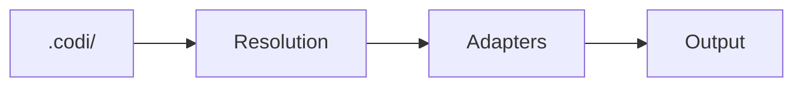

# Maintaining Documentation

Guidelines for keeping Codi documentation accurate, consistent, and current.

## Generated Sections

Several documentation files contain auto-generated sections marked with HTML comments:

```html
<!-- GENERATED:START:section_name -->
...content...
<!-- GENERATED:END:section_name -->
```

**Do not edit content between these markers manually.** It will be overwritten by `codi docs-update`.

### Auto-Generated Sections

| File | Section | Source |
|------|---------|--------|
| `README.md` | `supported_agents` | Adapter registry |
| `README.md` | `template_counts_compact` | Template registries |
| `README.md` | `preset_table` | Preset registry |
| `README.md` | `test_coverage` | Vitest coverage output |
| `docs/architecture.md` | `layer_order` | Config resolution pipeline |

### Regenerating

```bash
# Update all generated sections
codi docs-update

# Verify counts match templates
codi validate
```

Run `codi docs-update` after adding templates, presets, or adapters.

---

## When to Update Documentation

Use this checklist when making code changes:

| Change | Update |
|--------|--------|
| New CLI command | `docs/cli-reference.md` + `README.md` CLI table |
| New flag | `docs/features.md` flag table + `docs/configuration.md` |
| New template (rule/skill/agent/command) | `docs/features.md` counts + `docs/artifacts.md` catalog |
| New preset | `docs/features.md` preset table + `docs/presets.md` |
| New agent adapter | `docs/features.md` capability matrix + `README.md` agent table |
| Changed wizard flow | `docs/cli-reference.md` wizard section + `docs/getting-started.md` |
| New artifact type | `docs/artifacts.md` + `docs/features.md` |
| Breaking config change | `CHANGELOG.md` + `docs/migration.md` |

---

## Doc-as-Code Workflow

Documentation changes ship in the same PR as code changes. This ensures:

- Docs never drift behind the code
- Reviewers see the full picture (code + docs)
- CI can validate doc consistency

### PR Checklist for Reviewers

When reviewing a PR that changes behavior, verify:

- [ ] Affected docs are updated (see table above)
- [ ] Generated sections still match (run `codi docs-update`)
- [ ] New features have examples in the relevant doc
- [ ] No broken links (internal `[text](path.md)` references)
- [ ] Mermaid diagrams render correctly
- [ ] No duplicate content between README and docs/

---

## Stale Detection

Signs of stale documentation:

| Signal | How to Check |
|--------|-------------|
| Template counts wrong | Compare `README.md` counts vs `src/templates/*/index.ts` exports |
| Version references outdated | Search for old version numbers in docs |
| STATUS.md metrics stale | Compare with `npm test -- --coverage` output |
| Dead links | `grep -r '](docs/' README.md docs/` and verify targets exist |
| Layer count inconsistent | Search for "layer" across all docs — should all say "3" |

### Periodic Maintenance

Every release:

1. Run `codi docs-update` to sync generated sections
2. Update `CHANGELOG.md` with release notes
3. Verify template counts in `docs/features.md`
4. Check `STATUS.md` is current (or remove if redundant with `codi status`)

---

## File Naming Conventions

Documentation files in `docs/`:

| Convention | Example |
|-----------|---------|
| Lowercase kebab-case | `cli-reference.md`, `getting-started.md` |
| No adjectives | `features.md` not `comprehensive-features.md` |
| No date prefixes | Guide docs are evergreen, not timestamped |
| Agent-generated docs (reports, audits) | Use `YYYYMMDD_HHMM_CATEGORY_name.md` format |

Only users create subdirectories in `docs/`. Agent-generated documents go in `docs/` root.

---

## Diagram Standards

All diagrams use Mermaid syntax embedded in Markdown. No ASCII art.

| Diagram Type | Use For |
|-------------|---------|
| `flowchart` | Process flows, pipelines, decision trees |
| `sequenceDiagram` | API calls, multi-step interactions |
| `erDiagram` | Data relationships |
| `stateDiagram` | State machines, flag modes |

### Example

````markdown

````

---

## Documentation Structure

```
README.md                    Landing page (marketing + quick start)
docs/
  README.md                  Navigation hub with reading paths
  getting-started.md         Tutorial for new users
  features.md                Complete feature inventory
  cli-reference.md           All commands, wizard, Command Center
  architecture.md            Internal design, resolution pipeline
  configuration.md           Manifest, flags, layers, MCP
  artifacts.md               Rules, skills, agents, commands, brands
  presets.md                 Built-in and custom presets
  workflows.md               Daily usage, CI/CD, team patterns
  migration.md               Adopting Codi in existing projects
  troubleshooting.md         Common issues and fixes
  maintaining-docs.md        This file
```

### Reading Paths

- **New to Codi?** → `getting-started.md` → `features.md` → `presets.md`
- **Setting up a project?** → `configuration.md` → `artifacts.md` → `workflows.md`
- **Looking for a command?** → `cli-reference.md`
- **Understanding internals?** → `architecture.md`
- **Having issues?** → `troubleshooting.md` → `migration.md`
