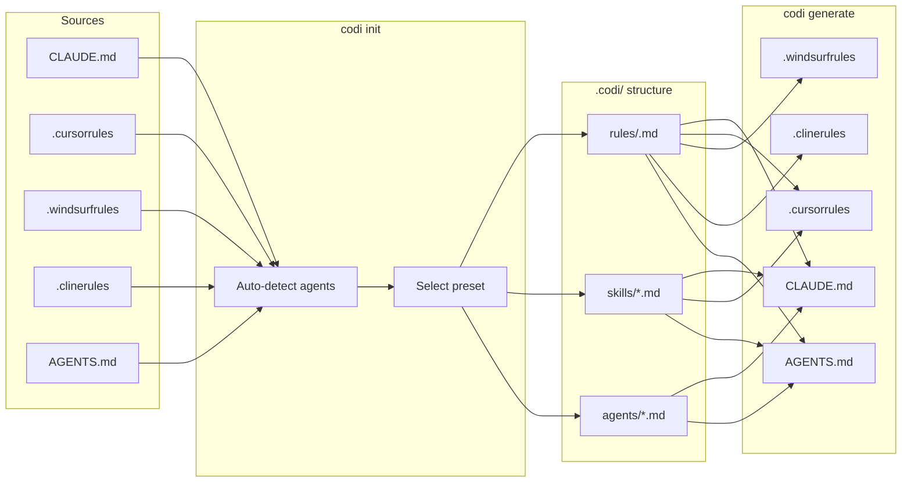

# Migration

Adopt codi in projects that already use AI agents with manual config files.

## Steps

```bash
# 1. Initialize — codi auto-detects existing agent config files
codi init

# 2. Move your existing rules into .codi/rules/ as Markdown files
# Each rule needs YAML frontmatter (name, description, priority)

# 3. Regenerate — now all agents get the same rules
codi generate

# 4. Verify the output matches your expectations
codi status
```

## Important Notes

Your existing `CLAUDE.md`, `.cursorrules`, etc. will be overwritten by codi's generated versions. **Back them up first** if needed.

### Rule Format

When moving existing rules into `.codi/rules/`, each file must be a Markdown file with YAML frontmatter:

```markdown
---
name: my-rule
description: Brief description of what this rule covers
priority: high
alwaysApply: true
managed_by: user
---

# My Rule

- Your existing rule content goes here
- One rule per file
```

See [Artifacts](artifacts.md) for the complete frontmatter reference and authoring guide.

## Migration Paths by Source

### From Raw CLAUDE.md

If you have a hand-written `CLAUDE.md` with inline instructions for Claude Code.

**What to move**:
- Each logical section (e.g., "Code Style", "Testing Rules", "Security") becomes a separate rule file
- Skills described inline become `.codi/skills/*.md` files
- Agent definitions become `.codi/agents/*.md` files

**Where it goes**:

| Source (CLAUDE.md section) | Destination |
|----------------------------|-------------|
| Coding guidelines | `.codi/rules/code-style.md` |
| Security rules | `.codi/rules/security.md` |
| Testing standards | `.codi/rules/testing.md` |
| Skill descriptions | `.codi/skills/<name>.md` |
| Agent definitions | `.codi/agents/<name>.md` |

**Commands**:
```bash
# 1. Back up your existing file
cp CLAUDE.md CLAUDE.md.bak

# 2. Initialize codi (auto-detects Claude Code)
codi init

# 3. Create custom rules from your existing sections
codi add rule code-style
codi add rule security
codi add rule testing
# Then paste content from CLAUDE.md.bak into each rule file

# 4. Generate — replaces CLAUDE.md with codi-managed version
codi generate

# 5. Verify output
codi status
```

### From .cursorrules

If you have a single `.cursorrules` file with all instructions for Cursor.

**What to move**:
- Split the monolithic file into individual rule files by topic
- Each rule becomes a focused Markdown file in `.codi/rules/`

**Where it goes**:

| Source (.cursorrules section) | Destination |
|-------------------------------|-------------|
| All inline rules | `.codi/rules/<topic>.md` (one per topic) |

**Commands**:
```bash
# 1. Back up
cp .cursorrules .cursorrules.bak

# 2. Initialize (auto-detects Cursor)
codi init

# 3. Create rules from your sections
codi add rule <topic-name>
# Repeat for each logical section, paste content into each file

# 4. Generate
codi generate

# 5. Verify
codi status
```

### From .windsurfrules

If you have a `.windsurfrules` file for Windsurf.

**What to move**:
- Same approach as `.cursorrules` — split into individual rule files

**Where it goes**:

| Source (.windsurfrules section) | Destination |
|---------------------------------|-------------|
| All inline rules | `.codi/rules/<topic>.md` (one per topic) |

**Commands**:
```bash
# 1. Back up
cp .windsurfrules .windsurfrules.bak

# 2. Initialize (select windsurf as agent)
codi init

# 3. Create rules
codi add rule <topic-name>
# Paste content from .windsurfrules.bak into each file

# 4. Generate
codi generate
```

### From .clinerules

If you have a `.clinerules` file for Cline.

**What to move**:
- Split into individual rule files, same pattern as other single-file configs

**Where it goes**:

| Source (.clinerules section) | Destination |
|-------------------------------|-------------|
| All inline rules | `.codi/rules/<topic>.md` (one per topic) |

**Commands**:
```bash
# 1. Back up
cp .clinerules .clinerules.bak

# 2. Initialize (select cline as agent)
codi init

# 3. Create rules
codi add rule <topic-name>
# Paste content from .clinerules.bak into each file

# 4. Generate
codi generate
```

### From AGENTS.md (Codex)

If you have an `AGENTS.md` file with inline agent definitions for OpenAI Codex.

**What to move**:
- Inline rules become `.codi/rules/*.md`
- Agent definitions become `.codi/agents/*.md`
- Skill descriptions become `.codi/skills/*.md`

**Where it goes**:

| Source (AGENTS.md section) | Destination |
|----------------------------|-------------|
| Coding rules/guidelines | `.codi/rules/<topic>.md` |
| Agent definitions | `.codi/agents/<name>.md` |
| Skill/tool descriptions | `.codi/skills/<name>.md` |

**Commands**:
```bash
# 1. Back up
cp AGENTS.md AGENTS.md.bak

# 2. Initialize (select codex as agent)
codi init

# 3. Create rules and agents
codi add rule <topic-name>
codi add agent <agent-name>
# Paste content from AGENTS.md.bak into each file

# 4. Generate
codi generate

# 5. Verify
codi status
```

### Migration Overview



After migration, all agents share the same rules from a single source of truth in `.codi/`. See [Architecture](architecture.md) for the generation pipeline and [Workflows](workflows.md) for daily usage.

### What Happens During Init

- **Agent auto-detection**: codi checks for existing config files (`CLAUDE.md`, `.cursorrules`, etc.) in the project root
- **Stack auto-detection**: looks for `package.json` (Node), `pyproject.toml` (Python), `go.mod` (Go), `Cargo.toml` (Rust)
- **Interactive wizard**: walks you through selecting agents, rules, and a preset

### After Migration

Once migrated, use the standard daily workflow:

```bash
# Edit rules in .codi/rules/<topic>.md
# Regenerate with: codi generate
# Check drift with: codi status
# Commit both .codi/ and generated files
```
