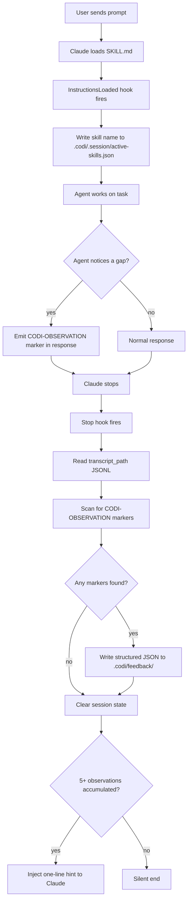

# Codi Heartbeat Hook System
- **Date**: 2026-04-12 12:00
- **Document**: 20260412_120054_[PLAN]_codi-heartbeat-hook-system.md
- **Category**: PLAN

## Goal

Replace the current discipline-dependent feedback loop (agent writes JSON after every skill) with a runtime-enforced observation system using Claude Code and Codex CLI lifecycle hooks. Agents emit a one-line marker in their responses; hook scripts collect and structure the data automatically.

## Problem Statement

The current `improvement-dev` rule tells agents to write structured JSON to `.codi/feedback/` after every skill invocation. This fails in practice because:

- `skill-feedback-reporter` is absent from all presets — agents never load the schema
- Writing a JSON file after every task competes with the user's primary goal
- No enforcement mechanism — the agent can (and does) skip it
- `rule-feedback` has the same discipline problem

Result: the entire feedback loop is inoperative by default.

## Architecture

### Overview



### Layer 1 — Skill Tracker (InstructionsLoaded hook, async)

**File**: `.codi/hooks/skill-tracker.mjs`

Fires when any `SKILL.md` is loaded. The hook checks if the file path contains `.claude/skills/codi-` and, if so, appends the skill name and timestamp to `.codi/.session/active-skills.json`.

- Runs async — zero latency impact
- Does not block the agent
- Accumulates all codi skills active in the session

**Payload used**: `file_path`, `session_id`

**Output file schema**:
```json
{
  "session_id": "abc123",
  "skills": [
    { "name": "codi-commit", "loaded_at": "2026-04-12T10:00:00Z" }
  ]
}
```

### Layer 2 — Inline Observation Marker

Agents emit this marker anywhere in a response when they notice a gap:

```
[CODI-OBSERVATION: <artifact-name> | <category> | <observation text, max 200 chars>]
```

Categories (same as current `rule-feedback` schema):
- `trigger-miss` — skill should have fired but did not
- `trigger-false` — skill fired when it should not
- `missing-step` — a step needed for the task is absent from the skill
- `outdated-rule` — rule recommends something the codebase has moved away from
- `missing-example` — a BAD/GOOD example is missing for a pattern encountered
- `user-correction` — user corrected behaviour that contradicts a rule (severity: high)
- `wrong-output` — following the skill produced incorrect output

The marker is plain text in the agent's normal response — no file I/O, no schema to remember. The hook handles all structuring.

Example:
```
[CODI-OBSERVATION: codi-commit | trigger-miss | skill did not activate when user typed /codi-commit directly]
```

### Layer 3 — Observer (Stop hook, synchronous)

**File**: `.codi/hooks/skill-observer.mjs`

Fires when Claude stops after any turn. Steps:

1. If `.codi/.session/active-skills.json` does not exist → exit 0 immediately (non-codi session, nothing to do)
2. Read `.codi/.session/active-skills.json` — verify at least one codi skill was active
3. Read `transcript_path` JSONL — scan all assistant messages for `[CODI-OBSERVATION: ...]` patterns. If `transcript_path` is missing or unreadable → skip to step 5 (do not crash)
4. For each valid marker found: write a structured JSON file to `.codi/feedback/`
5. Clear `.codi/.session/active-skills.json` (runs in a `finally` block — executes even if steps 3–4 fail)
6. Count total files in `.codi/feedback/` after writing
7. If count ≥ 5: output JSON with `additionalContext` hint (fires in the **current turn**, not deferred to next session)
8. If count < 5: output `{}` (silent)

A marker is valid if it matches `/\[CODI-OBSERVATION:\s*([^|]+)\|([^|]+)\|([^\]]+)\]/`. Malformed markers are silently skipped — no error output.

**Feedback file schema** (written by hook, not agent):
```json
{
  "id": "<uuid-v4>",
  "skillName": "<artifact-name from marker>",
  "timestamp": "<ISO-8601>",
  "session_id": "<session_id from payload>",
  "category": "<category from marker>",
  "observation": "<observation text from marker>",
  "severity": "<inferred: user-correction=high, trigger-*=medium, rest=low>",
  "source": "hook-transcript-scan",
  "resolved": false
}
```

**settings.json output** (when hint threshold reached):
```json
{
  "additionalContext": "[Codi] 5 observations collected in .codi/feedback/ — run /codi-refine-rules to review"
}
```

### Settings.json Generation

Codi already fully owns `.claude/settings.json` — `buildSettingsJson` in `src/adapters/claude-code.ts` generates it from scratch on every `codi generate`. Users who need personal hooks must use `.claude/settings.local.json`, which Claude Code merges automatically and codi never touches.

The `ClaudeSettings` interface in `src/adapters/claude-code.ts` is extended to include a `hooks` field, and `buildSettingsJson` unconditionally adds the codi hooks section. No read-then-merge is needed.

Generated `.claude/settings.json` shape (hooks section uses flat array per event, matching the Claude Code hooks schema):

```json
{
  "permissions": { "deny": ["..."] },
  "hooks": {
    "InstructionsLoaded": [
      {
        "type": "command",
        "command": ".codi/hooks/skill-tracker.mjs",
        "timeout": 5,
        "async": true
      }
    ],
    "Stop": [
      {
        "type": "command",
        "command": ".codi/hooks/skill-observer.mjs",
        "timeout": 15
      }
    ]
  }
}
```

`buildSettingsJson` returns the full settings object including both `permissions` and `hooks`. The function returns non-null whenever hooks are enabled (always), so `.claude/settings.json` is always generated.

**User hook convention**: document in `dev-operations` skill that users should put personal hooks in `.claude/settings.local.json`, never in `.claude/settings.json`.

### Codex CLI Support

`codi generate` also writes `.codex/hooks.json`:

```json
{
  "Stop": [
    {
      "type": "command",
      "command": ".codi/hooks/skill-observer.mjs",
      "timeout": 15
    }
  ]
}
```

Codex does not have `InstructionsLoaded`, so the tracker is omitted. The observer still works via transcript scanning (Codex Stop payload includes `transcript_path`).

## Updated Artifacts

### `improvement-dev` rule

**Remove**: all JSON file-writing instructions, UUID generation, schema references, skill-reporter references.

**Keep**: the core principle (you are an improver), the categories list, the guardrails (max 3 per session, require 2+ evidence points).

**Add** (exact new section):

```markdown
## How to Flag an Observation

When you notice a gap, incorrect trigger, outdated guidance, or missing pattern in a codi artifact, emit this marker anywhere in your response:

[CODI-OBSERVATION: <artifact-name> | <category> | <observation text>]

Categories: trigger-miss, trigger-false, missing-step, outdated-rule, missing-example, user-correction, wrong-output

Example:
[CODI-OBSERVATION: codi-commit | trigger-miss | skill did not activate when user typed /codi-commit directly]

The system collects and structures this automatically. You do not write files.
```

### `skill-feedback-reporter`

**Repurpose** from "write feedback after skill usage" to "feedback reviewer":

- `user-invocable: true` (was false)
- Purpose: reads `.codi/feedback/`, groups by artifact, shows top 3 observations worth acting on
- Acts as a companion to `/codi-refine-rules` — call it first to see what's accumulated

Remove the JSON schema section entirely. The schema is now internal to the hook script.

### `rule-feedback`

**Simplify** to point to the marker format instead of its own JSON file-writing instructions. Keep the category definitions (they are shared with the marker format).

## Files to Create or Modify

| File | Action |
|------|--------|
| `src/templates/hooks/skill-tracker.js.tmpl` | Create (generated file uses `.mjs` extension) |
| `src/templates/hooks/skill-observer.js.tmpl` | Create (generated file uses `.mjs` extension) |
| `src/adapters/claude-code.ts` | Modify — extend `ClaudeSettings` interface and `buildSettingsJson` |
| `src/cli/generate.ts` | Modify — call hooks scaffolding |
| `src/templates/rules/improvement.ts` | Modify |
| `src/templates/skills/skill-feedback-reporter/template.ts` | Modify |
| `src/templates/skills/rule-feedback/template.ts` | Modify |

## Out of Scope

- Windsurf support (uses different hook schema — add in a follow-up)
- Automatic `codi refine-rules` execution (user-initiated remains the correct gate)
- Hook content from non-codi skills (only `.claude/skills/codi-*/SKILL.md` paths are tracked)
- Plugin-installed skill hooks in SKILL.md frontmatter (issue #17688 open — not reliable)

## Success Criteria

1. After a session that used a codi skill and included a `[CODI-OBSERVATION: ...]` marker, a JSON file appears in `.codi/feedback/` without the agent writing it
2. After a session with no marker, `.codi/feedback/` is unchanged
3. After 5+ observations accumulate, the Stop hook outputs the `additionalContext` hint in the same turn that reaches the threshold — not deferred to the next session
4. Existing user hooks in `.claude/settings.json` are not removed or modified by `codi generate`
5. Codex users get the same observation file output via `.codex/hooks.json`
