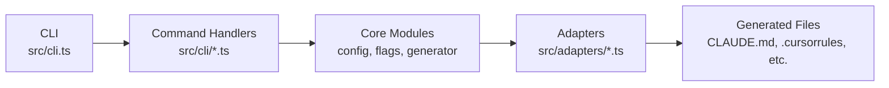
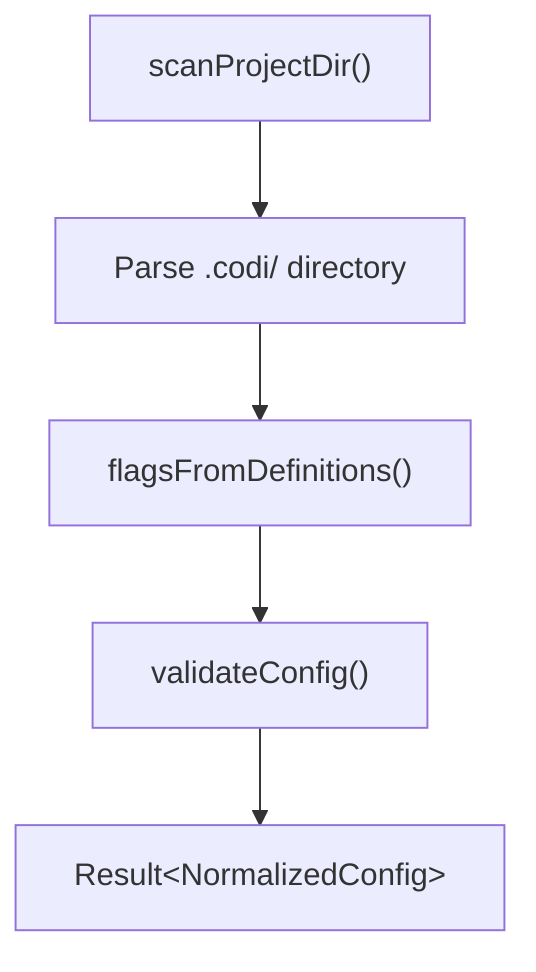
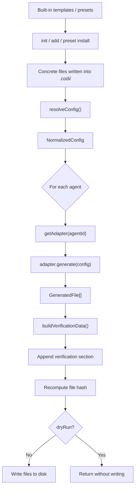
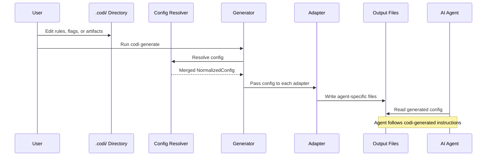

# Architecture

Technical reference for Codi's internal design. All source paths are relative to the repository root.

## System Overview



All public functions return `Result<T>` — either `ok(data)` or `err(errors)`. No thrown exceptions cross module boundaries.

---

## Configuration Resolution

The config resolution pipeline reads `.codi/` as the single source of truth. Presets and built-in templates are consumed at install time by commands like `init` and `add`, which materialize concrete files into `.codi/`. They are not loaded directly during config resolution or `generate`.

### Layer Order (lowest to highest priority)

<!-- GENERATED:START:layer_order -->
| # | Layer | Source | Description |
|---|-------|--------|-------------|
| 1 | **Preset** | Built-in or installed presets | Bundles of flags + artifacts (applied at install time) |
| 2 | **Repo** | `.codi/` directory | Project-level configuration (single source of truth) |
| 3 | **User** | `~/.codi/user.yaml` | Personal preferences (never committed) |
<!-- GENERATED:END:layer_order -->

### Resolution Flow



**Key modules:**
- `src/core/config/resolver.ts` — Reads `.codi/` as single source of truth
- `src/core/config/composer.ts` — Converts flag definitions into resolved flags with source tracking
- `src/core/config/parser.ts` — Scans `.codi/` directory, parses YAML/Markdown frontmatter
- `src/core/config/validator.ts` — Semantic validation (duplicates, size limits, adapter existence)

---

## Generation Pipeline

The generator transforms resolved configuration into agent-specific output files.



**Stages per agent:**
0. **Scaffolding/install** — Built-in templates and presets are copied into `.codi/` by setup commands
1. **Adapter resolution** — Fetch adapter by agent ID
2. **Generation** — Adapter produces files (instruction file, rules, skills, agents, MCP config)
3. **Verification injection** — Append verification token/checksum to instruction file
4. **Hash computation** — Recalculate hash after content injection
5. **File writing** — Create directories and write files (skipped in dry-run mode). Binary assets (fonts, images, PDFs) are copied via `fs.copyFile` using the `binarySrc` field on `GeneratedFile`.

**Key module:** `src/core/generator/generator.ts`

During stage 2 and later, adapters consume `NormalizedConfig` resolved from `.codi/`. They do not reach back into `src/templates/` directly.

**Design decision — progressive loading:** Codi always generates full-content skill files. It does not implement metadata stubs or tiered loading. Agents like Claude Code and Cursor handle progressive loading natively at runtime (reading frontmatter first, loading full content on activation). Codi's `progressive_loading` flag only controls whether Windsurf/Cline inline skills in their single main config file or reference separate skill files.

---

## Adapter Pattern

Each supported agent has an adapter that translates `NormalizedConfig` into that platform's native format.

<!-- GENERATED:START:adapter_table -->
| Adapter | Instruction File | Rules | Skills | Agents | MCP |
|---------|-----------------|-------|--------|--------|-----|
| **Claude Code** | `CLAUDE.md` | Yes | Yes | Yes | Yes |
| **Cursor** | `.cursorrules` | Yes | Yes | — | Yes |
| **Codex** | `AGENTS.md` | Yes | Yes | Yes | Yes |
| **Windsurf** | `.windsurfrules` | Yes | Yes | — | — |
| **Cline** | `.clinerules` | Yes | Yes | — | — |
<!-- GENERATED:END:adapter_table -->

**Adapter interface:**
- `id: string` — Adapter identifier (e.g., `"claude-code"`)
- `detect(): boolean` — Checks for existing config files
- `generate(config, options): Promise<GeneratedFile[]>` — Produces output files

All adapters are registered in `src/adapters/index.ts` via `registerAllAdapters()`. Flag-to-instruction translation is shared via `src/adapters/flag-instructions.ts`.

---

## Hook System

### Detection

Codi detects the project's existing Git hook runner in priority order:

1. **Husky** — `.husky/` directory exists
2. **pre-commit** — `.pre-commit-config.yaml` exists
3. **Lefthook** — `.lefthook.yml` or `lefthook.yml` exists
4. **Standalone** — Fallback: raw `.git/hooks/pre-commit`

**Module:** `src/core/hooks/hook-detector.ts`

### Flag-Controlled Hooks

<!-- GENERATED:START:flag_hooks -->
| Flag | Hook | Description |
|------|------|-------------|
| `test_before_commit` | tests | Run tests before commit |
| `security_scan` | secret-detection | Mandatory security scanning |
| `type_checking` | typecheck | Type checking level |
| `require_documentation` | doc-check | Require documentation for new code |
| `doc_protected_branches` | doc-check | Branch patterns that require documentation verification before push |
<!-- GENERATED:END:flag_hooks -->

### Always-On Hooks

These hooks run on every commit without a flag toggle:

| Hook | Stage | Purpose |
|------|-------|---------|
| file-size-check | pre-commit | Block files exceeding line limit |
| artifact-validate | pre-commit | Run `codi validate --ci` when `.codi/` files change |
| import-depth-check | pre-commit | Block deep relative imports (`../../`) in TS/JS files |
| skill-yaml-validate | pre-commit | Validate YAML frontmatter in `SKILL.md` files |
| skill-resource-check | pre-commit | Verify `[[/path]]` resource references exist on disk |
| commit-msg | commit-msg | Enforce conventional commit format |

### Developer-Only Hooks

Enabled automatically when `src/templates/` exists (codi contributors only):

| Hook | Purpose |
|------|---------|
| template-wiring-check | Ensure all templates are registered in index.ts |
| version-bump | Auto-increment template frontmatter version when content changes, regenerate baseline |

### Installation

The installer adapts hook scripts to the detected runner:
- **Husky** — Appends commands to `.husky/pre-commit`
- **pre-commit** — Appends YAML local hooks to `.pre-commit-config.yaml`
- **Lefthook/Standalone** — Writes `.git/hooks/pre-commit` with embedded runner

Auxiliary scripts (secret scan, file size check, version check, version bump, etc.) are written as `.mjs` files to `.git/hooks/`.

**Module:** `src/core/hooks/hook-installer.ts`

### Skill Resource Markers (`[[/path]]`)

Skill templates reference supporting files (scripts, references, assets) with `[[/path]]` markers:

```
${CLAUDE_SKILL_DIR}[[/scripts/run.py]]
```

At generate time, `resolveSkillRefsForPlatform()` in `src/adapters/skill-generator.ts` transforms these per platform:

| Platform | Output | Reason |
|----------|--------|--------|
| Claude Code | `${CLAUDE_SKILL_DIR}/scripts/run.py` | Markers stripped; Claude Code expands the env var at runtime |
| Codex, Windsurf, Cline | `[[/scripts/run.py]]` | Markers preserved; `${CLAUDE_SKILL_DIR}` stripped (paths are relative to skill dir) |

The `skill-resource-check` pre-commit hook validates that every `[[/path]]` marker references a file that exists on disk. It scans:
- `.codi/skills/` (user skill source)
- `src/templates/skills/` (codi developer templates)
- `.agents/skills/`, `.windsurf/skills/`, `.cline/skills/` (generated agent directories)

Spaced markers like `[[ /path ]]` are used as an escape for documentation examples — the hook regex accepts them, and the adapter normalizes whitespace.

---

## Flag System

Codi has 16 behavioral flags defined in `src/core/flags/flag-catalog.ts`. Each flag has a type, default value, and optional hook mapping.

### Flag Modes

Flags support 6 resolution modes:

| Mode | Behavior |
|------|----------|
| `enforced` | Value is fixed, cannot be overridden by lower layers |
| `enabled` | Value is set, can be overridden |
| `disabled` | Flag is turned off |
| `inherited` | Inherits from parent layer |
| `delegated_to_agent_default` | Uses the agent's native default |
| `conditional` | Value applies only when conditions match (lang, framework, agent, file pattern) |

Locked flags (`locked: true`) halt resolution — no lower-priority layer can change them.

### Resolved Flag Structure

Each flag resolves to:
```
{
  value: <the flag's value>,
  mode: "enabled" | "disabled",
  source: "default" | "preset" | "repo",
  locked: boolean
}
```

**Key modules:**
- `src/core/flags/flag-catalog.ts` — Flag definitions, types, defaults
- `src/schemas/flag.ts` — Zod validation schema for flag definitions

---

## Result Pattern

All fallible operations return `Result<T>` instead of throwing exceptions:

```typescript
type Result<T, E = ProjectError[]> =
  | { ok: true; data: T }
  | { ok: false; errors: E };
```

Helper functions: `ok(data)`, `err(errors)`, `isOk(result)`, `isErr(result)`.

**Module:** `src/types/result.ts`

---

## Error Handling

- **29 error codes** defined in `src/core/output/error-catalog.ts`
- **13 exit codes** for CLI process termination in `src/core/output/exit-codes.ts`

Error format:
```typescript
{
  code: string;          // e.g., "E_CONFIG_INVALID"
  message: string;       // Human-readable description
  hint: string;          // Actionable fix guidance
  severity: "error" | "warning" | "info";
  context?: Record<string, unknown>;
}
```

---

## Data Flow

How user edits flow through Codi to the AI agents.



---

## Supporting Systems

### Backup System

Automatic backups are created before each `codi generate` in `.codi/backups/{timestamp}/`. Maximum 5 backups are retained. Restore with `codi revert`.

### Watch Mode

`codi watch` uses `fs.watch()` with 500ms debounce to auto-regenerate when `.codi/` files change. Requires `auto_generate_on_change: true` flag.

### MCP Distribution

MCP servers configured in `.codi/mcp.yaml` are distributed to each agent in its native format: JSON for Claude Code/Cursor, TOML for Codex.

### Verification

Generated configs include a verification section with a token and checksum. `codi verify` checks whether agents loaded the correct configuration by validating the token against expected values.

### Operations Ledger

Every CLI operation is logged to `.codi/operations-ledger.json` with timestamp, command, result, and metadata. Used for audit trails and debugging.
