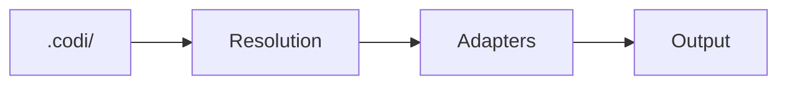

# Maintaining Documentation

Guidelines for keeping Codi documentation accurate, consistent, and current.

## Generated Sections

Several documentation files contain auto-generated sections marked with HTML comments:

```html
<!-- GENERATED:START:section_name -->
...content...
<!-- GENERATED:END:section_name -->
```

**Do not edit content between these markers manually.** It will be overwritten by `codi docs-update`.

### Auto-Generated Sections

| File | Section | Source |
|------|---------|--------|
| `README.md` | `template_counts_compact` | Template registries |
| `README.md` | `preset_table` | Preset registry |
| `README.md` | `supported_agents` | Adapter registry |
| `docs/project/artifacts.md` | `rule_fields` | Zod rule schema |
| `docs/project/artifacts.md` | `skill_fields` | Zod skill schema |
| `docs/project/artifacts.md` | `agent_fields` | Zod agent schema |
| `docs/project/artifacts.md` | `rule_templates` | Rule template registry |
| `docs/project/artifacts.md` | `skill_templates` | Skill template registry |
| `docs/project/artifacts.md` | `agent_templates` | Agent template registry |
| `docs/project/configuration.md` | `flags_table` | Flag catalog |
| `docs/project/configuration.md` | `flag_modes` | Flag mode definitions |
| `docs/project/configuration.md` | `manifest_fields` | Manifest Zod schema |
| `docs/project/configuration.md` | `flag_instructions` | Flag-to-instruction map |
| `docs/project/architecture.md` | `adapter_table` | Adapter registry |
| `docs/project/architecture.md` | `layer_order` | Config resolution pipeline |
| `docs/project/architecture.md` | `flag_hooks` | Hook-flag binding map |
| `docs/project/presets.md` | `preset_table` | Preset registry |
| `docs/project/presets.md` | `preset_flag_comparison` | Per-preset flag values |

### Regenerating

```bash
# Update all generated sections
npx codi docs --generate

# Verify docs are in sync with code
npx codi docs --validate
```

Run `npx codi docs --generate` after adding templates, presets, or adapters.

---

## When to Update Documentation

Use this checklist when making code changes:

| Change | Update |
|--------|--------|
| New CLI command | `docs/project/cli-reference.md` + `README.md` CLI table |
| New flag | `docs/project/features.md` flag table + `docs/project/configuration.md` |
| New template (rule/skill/agent) | `docs/project/features.md` counts + `docs/project/artifacts.md` catalog |
| New preset | `docs/project/features.md` preset table + `docs/project/presets.md` |
| New agent adapter | `docs/project/features.md` capability matrix + `README.md` agent table |
| Changed wizard flow | `docs/project/cli-reference.md` wizard section + `docs/project/getting-started.md` |
| New artifact type | `docs/project/artifacts.md` + `docs/project/features.md` |
| Breaking config change | `CHANGELOG.md` + `docs/project/migration.md` |

---

## Doc-as-Code Workflow

Documentation changes ship in the same PR as code changes. This ensures:

- Docs never drift behind the code
- Reviewers see the full picture (code + docs)
- CI can validate doc consistency

### PR Checklist for Reviewers

When reviewing a PR that changes behavior, verify:

- [ ] Affected docs are updated (see table above)
- [ ] Generated sections still match (run `codi docs-update`)
- [ ] New features have examples in the relevant doc
- [ ] No broken links (internal `[text](path.md)` references)
- [ ] Mermaid diagrams render correctly
- [ ] No duplicate content between README and docs/

---

## Stale Detection

Signs of stale documentation:

| Signal | How to Check |
|--------|-------------|
| Template counts wrong | Compare `README.md` counts vs `src/templates/*/index.ts` exports |
| Version references outdated | Search for old version numbers in docs |
| Dead links | `grep -r '](docs/project/' README.md docs/project/` and verify targets exist |
| Layer count inconsistent | Search for "layer" across all docs — should all say "3" |

### Periodic Maintenance

Every release:

1. Run `npx codi docs --generate` to sync generated sections
2. Update `CHANGELOG.md` with release notes
3. Verify template counts in `docs/project/features.md`
4. Run `npx codi docs-stamp` to mark docs as verified at the current commit

---

## File Naming Conventions

| Location | Convention | Example |
|----------|-----------|---------|
| `docs/project/` | Lowercase kebab-case, no date prefix — evergreen guides | `cli-reference.md`, `getting-started.md` |
| `docs/` root | Timestamped format: `YYYYMMDD_HHMMSS_[CATEGORY]_name.md` — enforced by pre-commit hook | `20260405_093000_[AUDIT]_security-review.md` |

The pre-commit `doc-naming-check` hook rejects any file placed directly in `docs/` that does not match the timestamped format.

---

## Diagram Standards

All diagrams use Mermaid syntax embedded in Markdown. No ASCII art.

| Diagram Type | Use For |
|-------------|---------|
| `flowchart` | Process flows, pipelines, decision trees |
| `sequenceDiagram` | API calls, multi-step interactions |
| `erDiagram` | Data relationships |
| `stateDiagram` | State machines, flag modes |

### Example

````markdown

````

---

## Documentation Structure

```
README.md                        Landing page (marketing + quick start)
docs/
  project/                       Codi project documentation
    index.md                     Navigation hub with reading paths
    README.md                    Quick-start index
    getting-started.md           Tutorial for new users
    features.md                  Complete feature inventory
    cli-reference.md             All commands, wizard, Command Center
    architecture.md              Internal design, resolution pipeline
    configuration.md             Manifest, flags, layers, MCP
    artifacts.md                 Rules, skills, agents
    presets.md                   Built-in and custom presets
    workflows.md                 Daily usage, CI/CD, team patterns
    migration.md                 Adopting Codi in existing projects
    troubleshooting.md           Common issues and fixes
    maintaining-docs.md          This file
  codi_docs/                     Generated HTML/JSON skill catalog
    index.html                   Self-contained browsable skill catalog
    skill-catalog.json           Machine-readable skill list
  YYYYMMDD_HHMMSS_[CAT]_*.md    Timestamped audit/plan/report files
```

### Reading Paths

- **New to Codi?** → `docs/project/getting-started.md` → `docs/project/features.md` → `docs/project/presets.md`
- **Setting up a project?** → `docs/project/configuration.md` → `docs/project/artifacts.md` → `docs/project/workflows.md`
- **Looking for a command?** → `docs/project/cli-reference.md`
- **Understanding internals?** → `docs/project/architecture.md`
- **Having issues?** → `docs/project/troubleshooting.md` → `docs/project/migration.md`
