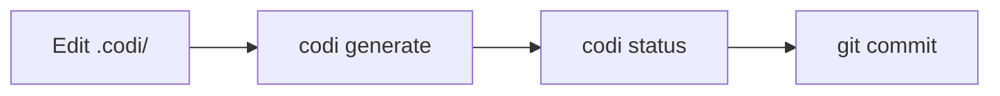

# Workflows

Operational guides for common Codi tasks: daily usage, import/export, CI/CD, and contributing.

## Daily Workflow

The typical Codi development cycle:



```bash
# 1. Edit your rules, skills, or flags
vim .codi/rules/security.md

# 2. Regenerate all agent configs
codi generate

# 3. Verify nothing drifted
codi status

# 4. Commit both config and generated files
git add .codi/ CLAUDE.md .cursorrules AGENTS.md
git commit -m "chore: update codi rules"
```

### Using the Command Center

Run `codi` (no subcommand) to launch the interactive Command Center. It presents all available actions in a menu and guides you through each one with prompts. See [CLI Reference](cli-reference.md) for the full Command Center documentation.

---

## Git and Version Control

| What | Commit? | Why |
|------|---------|-----|
| `.codi/codi.yaml` | Yes | Project manifest — source of truth |
| `.codi/flags.yaml` | Yes | Flag configuration |
| `.codi/rules/` | Yes | All rules (managed and custom) |
| `.codi/skills/` | Yes | Your skills |
| `.codi/agents/` | Yes | Your agent definitions |
| `.codi/state.json` | Yes | Enables drift detection for your team |
| Generated files (`CLAUDE.md`, etc.) | Yes | Agents read these from your repo |
| `~/.codi/user.yaml` | No | Personal preferences, never committed |

---

## Export Workflows

### Export a preset as ZIP

Package your project's configuration into a shareable ZIP:

```bash
# Export a preset
codi preset export my-setup --format zip

# Export to a specific directory
codi preset export my-setup --format zip --output ./exports/
```

The ZIP contains the preset manifest, flags, and all bundled artifacts (rules, skills, agents).

### Export a skill

Package a single skill for sharing:

```bash
codi skill export my-skill
```

The export wizard (available in the Command Center under "Export skill") lets you choose the skill and output format interactively.

---

## Import Workflows

### Load from a ZIP file

Install a preset or skill from a ZIP archive:

```bash
# Install preset from ZIP
codi preset install ./team-config.zip
```

### Load from a Git repository

Install a preset directly from GitHub:

```bash
# Latest from main branch
codi preset install github:org/repo

# Specific version tag
codi preset install github:org/repo@v1.0

# Specific branch
codi preset install github:org/repo#develop
```

Codi clones the repository (shallow clone), validates the preset structure, copies it to `.codi/presets/`, and records the source in the lock file.

### Update from a remote repository

Pull the latest artifacts from a centralized team repository:

```bash
codi update --from org/team-config
```

This updates only `managed_by: codi` artifacts. User-authored artifacts (`managed_by: user`) are never overwritten.

---

## CI/CD Integration

### Quick CI check

Add to your CI pipeline:

```bash
codi doctor --ci
```

This exits non-zero if:
- Configuration is invalid
- Required Codi version is not met
- Generated files are stale (drift detected)

### Full CI validation

```bash
codi ci
```

Runs all validation checks: config validation, drift detection, and health checks.

### GitHub Actions example

```yaml
name: Codi Validation
on: [push, pull_request]
jobs:
  validate:
    runs-on: ubuntu-latest
    steps:
      - uses: actions/checkout@v4
      - uses: actions/setup-node@v4
        with:
          node-version: 20
      - run: npm ci
      - run: npx codi doctor --ci
```

### Compliance report

For comprehensive validation:

```bash
codi compliance --ci
```

Runs doctor + status + verification in a single pass.

---

## Watch Mode

Auto-regenerate agent configs when `.codi/` files change:

```bash
codi watch
```

Requires the `auto_generate_on_change` flag to be enabled:

```yaml
# flags.yaml
auto_generate_on_change:
  mode: enabled
  value: true
```

Use `--once` to regenerate once and exit:

```bash
codi watch --once
```

---

## Backup and Revert

Codi automatically creates backups before each `codi generate` in `.codi/backups/`. A maximum of 5 backups are retained.

### List available backups

```bash
codi revert --list
```

### Restore the most recent backup

```bash
codi revert --last
```

### Restore a specific backup

```bash
codi revert --backup 2026-03-29T100000
```

---

## Verification

Verify that AI agents loaded your configuration correctly:

### Show the verification prompt

```bash
codi verify
```

This displays a prompt to paste into your agent. The agent should respond with the verification token.

### Check an agent's response

```bash
codi verify --check "codi-abc123def"
```

Validates the token against the expected value from your current configuration.

---

## Contributing Artifacts

Share your artifacts with any GitHub repository - the official Codi repo, a team preset repo, or your own private collection.

```bash
# Interactive - select repo via prompts
codi contribute

# Non-interactive - target a specific repo and branch
codi contribute --repo owner/repo --branch main
```

The Command Center also offers this under "Contribute to community".

### Contribution workflow

Codi checks repo access first, then picks the right strategy:

| Repo state | Strategy |
|-----------|---------|
| Has commits | Fork target repo, push `contrib/add-<name>` branch to your fork, open PR to default branch |
| Empty repo | Push initial commit directly to target branch (no fork needed) |

**Steps:**

1. Create artifacts in `.codi/` (rules, skills, agents)
2. Run `codi contribute`
3. Select artifacts to include
4. Choose "Open PR to a GitHub repository" or "Export as ZIP"
5. Enter the target repo (or use `--repo` to skip the prompt)
6. Follow the prompts to name the preset and confirm

### Private repo access

Before targeting a private repo, verify your setup:

```bash
gh auth status                          # check current auth
gh auth refresh -s repo                 # add repo scope if missing
gh repo view owner/repo                 # confirm you can access it
ssh -T git@github.com                   # verify SSH key (if using SSH)
```

If access fails, Codi shows step-by-step troubleshooting and exits before attempting the clone.

### Writing new templates

If you want to add a built-in template to Codi:

#### 1. Create the template files

For a skill named `my-skill`:

```
src/templates/skills/my-skill/
├── template.ts       # TypeScript template literal wrapping SKILL.md content
├── index.ts          # exports `template` and `staticDir`
└── evals/
    └── evals.json
```

`template.ts` must export a `template` string constant. Use an existing template (e.g. `src/templates/skills/commit/template.ts`) as reference.

#### 2. Register the template

Export from `src/templates/skills/index.ts`:
```typescript
export { template as mySkill, staticDir as mySkillStaticDir } from "./my-skill/index.js";
```

Add to `TEMPLATE_MAP` in `src/core/scaffolder/skill-template-loader.ts`:
```typescript
[prefixedName("my-skill")]: skillTemplates.mySkill,
```

**Understanding the key**: `prefixedName("my-skill")` = `"codi-my-skill"`. This is the full name users pass to `--template`.

#### 3. Build before testing

Templates only appear after compilation:
```bash
npm run build
```

#### 4. Link local build (one-time contributor setup)

```bash
npm link
```

This makes the `codi` binary use `dist/cli.js` from your local repo. Run `npm run build` again after any source change.

#### 5. Test with `--template` (required)

```bash
codi add skill codi-my-skill --template codi-my-skill
```

> **CRITICAL**: `codi add skill <name>` WITHOUT `--template` always creates a blank placeholder using `DEFAULT_CONTENT`, regardless of any built-in template with the same name. The `--template` flag is required to install from a built-in.

#### 6. Validate and generate

```bash
codi validate && codi generate
```

#### 7. Clean up accidental placeholders

If you ran `codi add skill` without `--template` during development, remove the placeholder before running `generate` to avoid stale routing entries in CLAUDE.md:
```bash
rm -rf .codi/skills/codi-my-skill
```

See [Artifacts](artifacts.md) for the full template system details.

---

## Health Checks

### Doctor

Run diagnostics on your project:

```bash
codi doctor
```

Checks: manifest validity, flag consistency, adapter availability, artifact health, version compatibility.

### Hook Health

Check that all pre-commit hook tools are installed:

```bash
codi hooks doctor
```

Reports installed tools (✓), optional missing tools (⚠), and required missing tools (✗) with exact install commands. Use `--fix` to print all install commands in one block.

Reinstall hooks after configuration changes:

```bash
codi hooks reinstall
```

### Status

Check for drift between `.codi/` source and generated files:

```bash
codi status
```

Reports which files are in sync, drifted, or missing.

### Clean

Remove all generated files:

```bash
# Remove generated agent files only
codi clean

# Remove everything including .codi/ (full uninstall)
codi clean --all

# Preview what would be deleted
codi clean --dry-run
```
