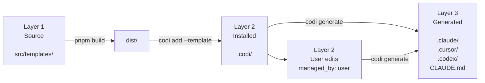
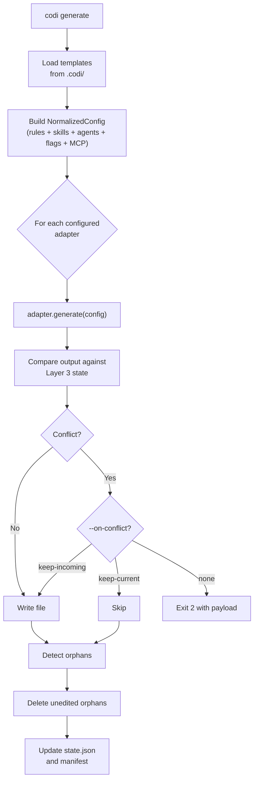

The Codi engine turns a single source-of-truth (`.codi/`) into the per-agent configuration files every AI tool expects. This page explains the mechanisms behind `codi generate`, `codi update`, and the safety nets (version baseline, orphan detection, conflict resolution) that keep installs stable.

---

## The three-layer pipeline

Every Codi artifact moves through three layers. Understanding which layer a command reads prevents the most common mistake: editing `src/templates/` and wondering why `codi generate` did nothing.



| Layer | Path | Role |
|-------|------|------|
| **1. Source** | `src/templates/` | Templates shipped with the Codi CLI. Consumers never edit here — only contributors. Compiled to `dist/` by `pnpm build`. |
| **2. Installed** | `.codi/<type>/<name>/` | The project's local copy of each installed artifact. Consumers edit here. Includes both `managed_by: codi` (template-managed) and `managed_by: user` (custom) artifacts. |
| **3. Generated** | `.claude/`, `.cursor/`, `.codex/`, `CLAUDE.md`, `AGENTS.md` | Per-agent output produced by `codi generate`. Never edited directly — regenerated on every run. |

### Where each command reads from

| Command | Reads | Writes |
|---------|-------|--------|
| `codi add <type> <name> --template <name>` | `dist/templates/` (Layer 1) | `.codi/<type>/<name>/` (Layer 2) |
| `codi generate` | `.codi/` (Layer 2) | Per-agent dirs (Layer 3) |
| `codi update` | `dist/templates/` (Layer 1) | `.codi/` (Layer 2) with conflict resolution |

### Why this matters for contributors

If you edit `src/templates/skills/<name>/template.ts` (Layer 1), `codi generate` will **not** propagate the change because `generate` only reads `.codi/` (Layer 2). To test a source edit you must:

```bash
pnpm build                                     # Refresh dist/
rm -rf .codi/skills/codi-<name>                # Clear stale installed copy
codi add skill codi-<name> --template codi-<name>
codi generate --force
```

---

## Managed-by ownership

Every artifact frontmatter carries a `managed_by` field. This single value governs update behavior, contribution flow, and conflict resolution.

| Value | Meaning | `codi update` behavior |
|-------|---------|------------------------|
| `codi` | Template-managed — ships with the CLI | Overwritten on update (with conflict check if content hash diverged) |
| `user` | Custom or locally edited | **Never** overwritten. Preserved across every update. |

### How to customize a `managed_by: codi` artifact

Do **not** edit the codi-managed file. Instead, create a new custom artifact that extends or refines the built-in one:

```bash
# To refine the built-in codi-testing rule with project-specific rules,
# create a new custom rule alongside it:
codi add rule project-testing   # Creates .codi/rules/project-testing.md with managed_by: user
```

The built-in `codi-testing` rule keeps its `managed_by: codi` flag and continues to receive upstream improvements. Your `project-testing.md` carries `managed_by: user` and is preserved untouched.

### Upstream contribution

Custom (`managed_by: user`) artifacts can be contributed back via `codi contribute`, which rewrites `managed_by: codi` and opens a PR against the Codi source repo.

---

## Version baseline + content-hash gating

Every template in `src/templates/` is fingerprinted by a **content hash**. On every CLI invocation (including `codi init`), Codi computes the current hash and compares it to the baseline stored in `src/core/version/artifact-version-baseline.json`.

### The release-readiness check

If content changed but the `version:` field in frontmatter was not bumped, the CLI exits with an integrity error before running anything:

```
[codi] Template registry integrity check failed:
  • skill "codi-test-suite": content changed without artifact version bump (current 1, previous 1)

The CLI cannot run with broken templates. This is a bug — please report it.
```

This gate is implemented by `checkArtifactVersionBaseline(buildTemplateHashRegistry())` in `src/core/scaffolder/template-registry-check.ts`. It runs at the top of every command that loads templates.

### When to bump `version:`

Every template (rule, skill, agent) has a `version: N` integer in its YAML frontmatter. **Bump it on every content change**, even trivial ones. The baseline only cares that `version > previous_version` — it does not enforce semver.

```yaml
---
name: codi-testing
version: 5   # bump this on any edit
---
```

### How downstream consumers see version changes

`codi update` compares each installed artifact's stored version against the template's current version. If the template version is higher AND the installed content hash diverged, the file is queued for update with a conflict resolution prompt.

---

## Conflict resolution

`codi generate` and `codi update` both detect when an installed file has been edited after generation. Instead of silently overwriting, Codi prompts for resolution or exits with code 2 and a conflict payload.

### Strategies

| Strategy | Effect |
|----------|--------|
| `--on-conflict keep-current` | Preserve local edits; skip the template update |
| `--on-conflict keep-incoming` | Overwrite with the upstream template |
| `--force` | Alias for `keep-incoming` — no interactive prompts |

### Exit code 2 payload

When running non-interactively without a strategy, the CLI exits with code 2 and prints a structured JSON list of conflicts so CI pipelines or other tools can parse and decide:

```json
{
  "conflicts": [
    {
      "artifactType": "rule",
      "name": "codi-testing",
      "reason": "content hash diverged",
      "installedHash": "...",
      "templateHash": "...",
      "suggestedStrategy": "keep-incoming"
    }
  ]
}
```

---

## Orphan detection

When a template is removed from `src/templates/` (or no longer exists in the installed preset), the corresponding generated file becomes an **orphan** in Layer 3. Stale files pollute `.claude/`, `.cursor/`, etc. unless cleaned up.

`codi generate` solves this automatically:

1. **Detect** — `StateManager.detectOrphans()` compares the last-known generation manifest against the current template list. Any file present in the manifest but absent from the current template list is an orphan.
2. **Preserve user edits** — orphans that have been locally edited are preserved unless `--on-conflict keep-incoming` (or `--force`) is passed.
3. **Delete** — unedited orphans are removed. A summary of orphans removed is printed on success.

The same mechanism powers the catalog page regeneration at docs build time: `generateCatalogMarkdownFiles()` calls `resetCatalogDirs()` to wipe `docs/src/content/docs/catalog/` before writing fresh pages, so deleted artifacts do not linger in the site.

---

## The adapter system

Codi supports multiple AI agents (Claude Code, Cursor, Codex, Cline, Windsurf) through a single `AgentAdapter` interface. Each adapter knows:

- How to detect whether its agent is present in the project (`detect()`)
- Where to write generated files (`paths`)
- What features it supports (`capabilities`)
- How to render Codi's normalized config into its native file format (`generate()`)

### Adapters shipped

| Adapter | Output directory | Native config |
|---------|-------------------|---------------|
| `claude-code` | `.claude/` + `CLAUDE.md` | `settings.json`, skills as `SKILL.md`, agents as `.md`, hooks in `.claude/hooks/` |
| `cursor` | `.cursor/` + `.cursorrules` | `.cursorrules` aggregate, skills as `.md` |
| `codex` | `.codex/` + `AGENTS.md` | `hooks.json`, skills as `.md` |
| `cline` | `.cline/` + `.clinerules/` | Rules split into files |
| `windsurf` | `.windsurf/` | Rules and skills |

Adapters live in `src/adapters/`. Each one produces `GeneratedFile[]` from the same `NormalizedConfig` input — the normalization step happens once, every adapter consumes the same truth.

### Why adapters are thin

Adapters do not know about templates, versioning, or conflict resolution — those are the engine's responsibility. An adapter receives a `NormalizedConfig` (rules + skills + agents + flags + MCP servers already resolved) and emits files. This separation lets Codi add support for a new agent by writing ~200 lines of adapter code without touching the core engine.

---

## Putting it all together — what happens during `codi generate`



Every step is deterministic. Re-running `codi generate` on an unchanged `.codi/` produces zero writes — the content-hash comparison catches no-op runs and returns instantly.

---

## Related reference

- `reference/configuration.md` — directory structure, manifest, flags, MCP
- `reference/cli-reference.md` — command surface
- `guides/self-improvement.md` — how the feedback loop uses the same hash mechanism to detect rule drift
