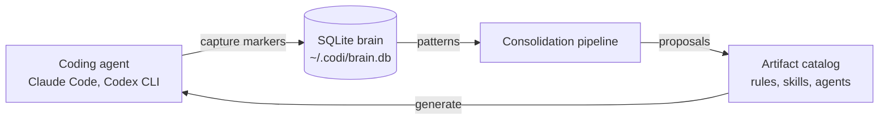
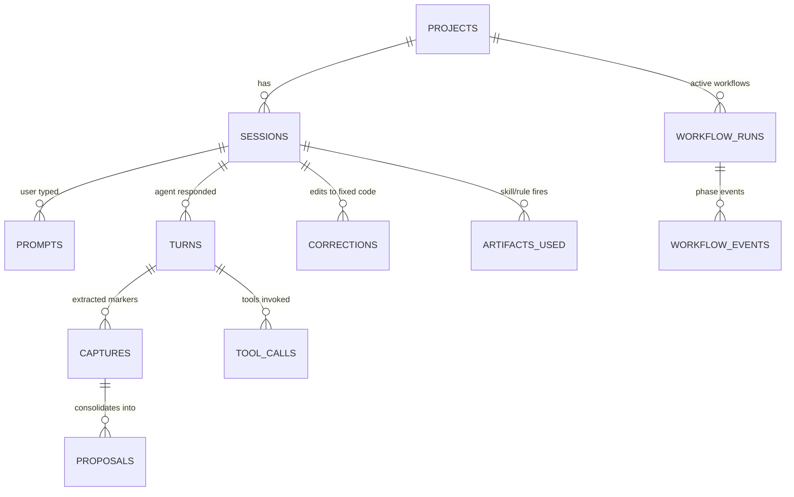
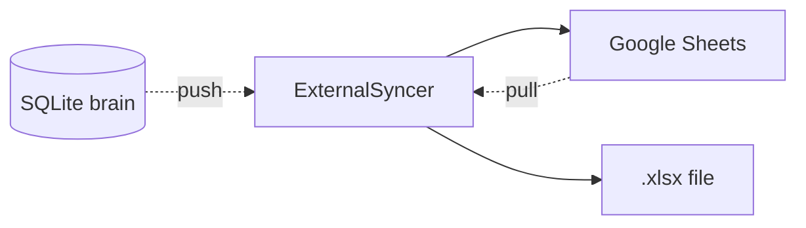

A reference for how Codi v3 zero-mode is put together. Diataxis-style explanation: read this once when you want to understand WHY the parts exist; the [CLI reference](/reference/cli-reference) covers HOW to invoke them.

## One-line summary

Codi v3 captures everything the user says, persists it canonically in a local SQLite "brain", and consolidates it into proposals that improve the artifact catalog over time.

## The four moving parts



1. **Agent** runs in the user's terminal. Hooks intercept its prompts and output.
2. **Brain** is canonical local persistence. SQLite in zero mode; Postgres in lite/standard/full (deferred to v3.1+).
3. **Consolidation pipeline** scans the brain for patterns and proposes catalog changes.
4. **Catalog** is the rules / skills / agents under `.codi/`; `codi generate` emits per-agent output.

The cycle is closed: every accepted proposal becomes a new or updated artifact, the agent sees it next session, the user's behavior is captured, the pipeline runs again.

## Capture protocol (Iron Law 9)

Agents emit markers at the end of every response. Format:

```
|TYPE: "verbatim content"|
```

Ten canonical types:

| Type          | Trigger                                               |
| ------------- | ----------------------------------------------------- |
| `RULE`        | The user states a normative rule for future behavior. |
| `PROHIBITION` | The user forbids an action.                           |
| `PREFERENCE`  | Non-binding preference.                               |
| `FEEDBACK`    | The user evaluates the agent's work.                  |
| `INSIGHT`     | A non-obvious fact about codebase, team, or domain.   |
| `OBSERVATION` | The agent notices a pattern itself.                   |
| `DECISION`    | The user picks one path among options.                |
| `QUESTION`    | The user asks something to answer later.              |
| `PROMPT`      | Reusable wording the agent should remember.           |
| `CORRECTION`  | The user fixes a mistake — always high-severity.      |

The parser in `src/runtime/capture/markers.ts` is conservative: malformed markers are silently dropped. False positives are NOT tolerated; false negatives are recoverable via offline consolidation.

## Brain schema (12 tables)



Twelve tables: 9 capture/observability, 2 workflow runtime, 1 proposals, plus FTS5 mirrors over `captures.content` and `prompts.text` for search. Schema source of truth: `src/runtime/brain/schema.ts` (Drizzle ORM definitions); idempotent bootstrap in `src/runtime/brain/migrate.ts`.

## ExternalSyncer interface

SQLite is canonical. External destinations (Google Sheets, `.xlsx` snapshots) are opt-in **sync targets**, never sources of truth.



The interface lives at `src/runtime/sync/external-syncer.ts`. Sprint 6 ships scaffolds for `SheetsSyncer` and `XlsxSyncer`; full DevLoop wiring lands in v3.1.

## Consolidation pipeline

Eight pattern detectors scan the brain:

| Code | Trigger                                    | Proposal type                |
| ---- | ------------------------------------------ | ---------------------------- |
| P1   | Repeated correction on the same file       | `PROMOTE_TO_RULE`            |
| P2   | Skill never invoked in window              | `DEPRECATE_ARTIFACT`         |
| P3   | Two skills always co-fire                  | `MERGE_SIMILAR`              |
| P4   | Same content recorded as opposing types    | `RESOLVE_CONFLICT`           |
| P5   | New consistent pattern across sessions     | `CREATE_NEW_ARTIFACT`        |
| P6   | Skill timing exceeds threshold             | `OPTIMIZE_EXISTING_ARTIFACT` |
| P7   | Capture cluster with no rule keyword match | `CREATE_NEW_ARTIFACT`        |
| P8   | Rule referenced but never matched          | `DEPRECATE_ARTIFACT`         |

Proposals optionally enrich with an LLM rationale when `CODI_LLM_PROVIDER` is set. The runner respects `CODI_LLM_MAX_CALLS_PER_RUN` (default 20) so a runaway pattern can't exhaust an API budget.

## Capabilities Matrix

Per-target feature flags. NEW emission code consults `supports(target, feature)` before writing per-target output.

| Target      | Tier | skills | rules | agents | hooks | slash | mcp | UI  |
| ----------- | ---- | ------ | ----- | ------ | ----- | ----- | --- | --- |
| Claude Code | 1A   | ✅     | ✅    | ✅     | ✅    | ✅    | ✅  | ✅  |
| Codex CLI   | 1B   | ✅     | ✅    | ✅     | ✅    | ✅    | ✅  | —   |
| Cursor      | 2    | ✅     | ✅    | —      | —     | —     | ✅  | —   |
| Windsurf    | 2    | ✅     | ✅    | —      | —     | —     | ✅  | —   |
| Cline       | 2    | ✅     | ✅    | —      | —     | —     | ✅  | —   |
| Copilot     | 2    | ✅     | ✅    | —      | —     | —     | ✅  | —   |
| Gemini      | 2    | ✅     | ✅    | —      | —     | —     | ✅  | —   |

### Capabilities Matrix governance

The matrix is OPT-IN. NEW emission code (plugin manifests in v3.0.0, future adapters) MUST consult `supports()`. Existing per-target adapters under `src/adapters/{cursor,windsurf,cline,copilot,gemini}/` are GRANDFATHERED — they emit the same artifacts they did in v2.x. Wiring those legacy adapters to the matrix is deferred to v3.1+ on purpose, because silently dropping artifact directories users rely on (`.cursor/agents/`, etc.) is a breaking change that deserves its own release notes.

A regression guard at `tests/unit/core/capabilities-governance.test.ts` fails if any of those adapters starts importing from the matrix without being explicitly removed from the guard.

## Iron Laws (the agent's runtime contract)

Nine laws total. Iron Laws 1-3 are behavioral (no code can verify them). Iron Laws 4-8 are enforced by hooks; Iron Law 9 is enforced by the parser.

| #   | Law                                   | Enforcement                                                                |
| --- | ------------------------------------- | -------------------------------------------------------------------------- |
| 1   | Recommend AND execute                 | behavioral                                                                 |
| 2   | One question per turn                 | behavioral                                                                 |
| 3   | Canvas is sacred                      | behavioral                                                                 |
| 4   | HARD GATES need `ok`                  | UserPromptSubmit + PreToolUse hooks                                        |
| 5   | Pull before patch                     | PreToolUse hook (advisory)                                                 |
| 6   | Atomic + rollback                     | every brain write inside a transaction                                     |
| 7   | Never commit without approval         | PreToolUse hook blocks `git commit` / `git push` without an approval token |
| 8   | Output mode honors project preference | UserPromptSubmit injects `<output-mode>` block                             |
| 9   | Capture everything the dev says       | parser + persist                                                           |

Implementation: `src/runtime/iron-laws-enforcer.ts` (pure functions called from the hooks).

## Install modes

v3.0.0 ships zero only.

| Mode       | Containers | Brain                        | Status             |
| ---------- | ---------- | ---------------------------- | ------------------ |
| `zero`     | 0          | SQLite at `~/.codi/brain.db` | shipping in v3.0.0 |
| `lite`     | 3          | Postgres                     | v3.1+              |
| `standard` | 6          | Postgres + code graph        | v3.1+              |
| `full`     | 9          | Postgres + UI + Vaultwarden  | v3.1+              |

The schema migrates 1:1 between SQLite and Postgres; switching modes is a future `codi install --upgrade --mode=lite` flow.

## Plugin distribution (dual-track)

`codi plugin publish` has two tracks:

- `--track local` (default) writes `.claude-plugin/plugin.json` + `.codex-plugin/plugin.json` next to your repo. The standard install path.
- `--track marketplace` (opt-in) computes the same manifests but does not write to disk; release tooling picks them up to produce a tarball for marketplace upload.

Tier 2 targets (Cursor, Windsurf, etc.) do NOT receive a plugin manifest — they consume rules/skills/MCP via the existing per-agent directories.

## Where to look in the code

| Concern             | Path                                                              |
| ------------------- | ----------------------------------------------------------------- |
| Brain schema        | `src/runtime/brain/{schema,migrate,db}.ts`                        |
| Capture parser      | `src/runtime/capture/{markers,persist}.ts`                        |
| Hooks orchestrator  | `src/runtime/{hook-logic,iron-laws-enforcer}.ts`                  |
| Brain UI server     | `src/runtime/brain-ui/{server,routes-api,pages,sse,lifecycle}.ts` |
| Consolidation       | `src/runtime/consolidate/{patterns,runner,prompts,package}.ts`    |
| LLM providers       | `src/runtime/llm/{provider,gemini,openai,registry}.ts`            |
| Capabilities Matrix | `src/core/capabilities/{matrix,plugin-manifest,publish}.ts`       |
| Migration           | `src/core/migration/{v2-to-v3,executor}.ts`                       |
