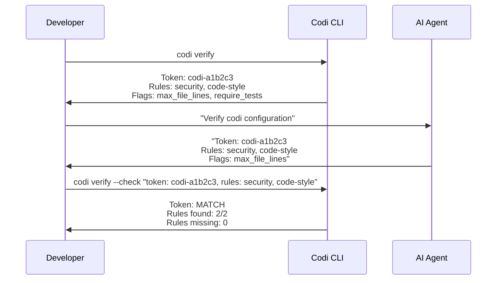

# Verification

Codi generates a deterministic verification token based on your project configuration. This lets you confirm that an AI agent actually loaded and understood your rules.

## How It Works

The token is a SHA-256 hash of your project name, agents, rules, and active flags. If the agent returns the correct token, you know it loaded the full configuration.



## Usage

### Step 1: See your token and what to ask

```bash
codi verify
```

This displays your verification token, the list of rules the agent should know about, and the active flags.

### Step 2: Ask your agent to verify

Paste the prompt that codi shows you into your AI agent's chat. The agent should respond with the token, rules, and flags it sees in its configuration.

### Step 3: Validate the agent's response

```bash
codi verify --check "token: codi-a1b2c3, rules: security, code-style, flags: max_file_lines"
```

Codi compares the agent's response against the expected values and reports:
- **Token**: MATCH or MISMATCH
- **Rules found**: how many of the expected rules the agent reported
- **Rules missing**: any rules the agent failed to report
