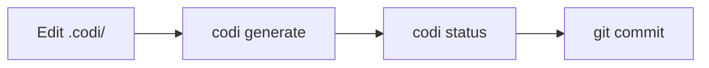

# Workflows

Operational guides for common Codi tasks: daily usage, import/export, CI/CD, marketplace, and contributing.

## Daily Workflow

The typical Codi development cycle:



```bash
# 1. Edit your rules, skills, or flags
vim .codi/rules/custom/security.md

# 2. Regenerate all agent configs
codi generate

# 3. Verify nothing drifted
codi status

# 4. Commit both config and generated files
git add .codi/ CLAUDE.md .cursorrules AGENTS.md
git commit -m "chore: update codi rules"
```

### Using the Command Center

Run `codi` (no subcommand) to launch the interactive Command Center. It presents all available actions in a menu and guides you through each one with prompts. See [CLI Reference](cli-reference.md) for the full Command Center documentation.

---

## Git and Version Control

| What | Commit? | Why |
|------|---------|-----|
| `.codi/codi.yaml` | Yes | Project manifest — source of truth |
| `.codi/flags.yaml` | Yes | Flag configuration |
| `.codi/rules/custom/` | Yes | Your custom rules |
| `.codi/rules/generated/` | Yes | Managed rules (track changes) |
| `.codi/skills/` | Yes | Your skills |
| `.codi/agents/` | Yes | Your agent definitions |
| `.codi/commands/` | Yes | Your slash commands |
| `.codi/state.json` | Yes | Enables drift detection for your team |
| Generated files (`CLAUDE.md`, etc.) | Yes | Agents read these from your repo |
| `~/.codi/user.yaml` | No | Personal preferences, never committed |
| `~/.codi/org.yaml` | No | Shared via org tooling, not per-repo |

---

## Export Workflows

### Export a preset as ZIP

Package your project's configuration into a shareable ZIP:

```bash
# Export a preset
codi preset export my-setup --format zip

# Export to a specific directory
codi preset export my-setup --format zip --output ./exports/
```

The ZIP contains the preset manifest, flags, and all bundled artifacts (rules, skills, agents, commands).

### Export a skill

Package a single skill for marketplace sharing:

```bash
codi skill export my-skill
```

The export wizard (available in the Command Center under "Export skill") lets you choose the skill and output format interactively.

---

## Import Workflows

### Load from a ZIP file

Install a preset or skill from a ZIP archive:

```bash
# Install preset from ZIP
codi preset install ./team-config.zip
```

### Load from a Git repository

Install a preset directly from GitHub:

```bash
# Latest from main branch
codi preset install github:org/repo

# Specific version tag
codi preset install github:org/repo@v1.0

# Specific branch
codi preset install github:org/repo#develop
```

Codi clones the repository (shallow clone), validates the preset structure, copies it to `.codi/presets/`, and records the source in the lock file.

### Update from a remote repository

Pull the latest artifacts from a centralized team repository:

```bash
codi update --from org/team-config
```

This updates only `managed_by: codi` artifacts. User-authored artifacts (`managed_by: user`) are never overwritten.

Configure the default remote in `codi.yaml`:

```yaml
source:
  repo: "org/team-codi-config"
  branch: main
  paths: [rules, skills, agents]
```

---

## Marketplace

The marketplace lets you search for and install community-shared skills.

### Search for skills

```bash
codi marketplace search "testing"
```

### Install a skill

```bash
codi marketplace install security-scan
```

### Configure marketplace registry

```yaml
# In codi.yaml
marketplace:
  registry: "org/codi-skills-registry"
  branch: main
```

### Via Command Center

Run `codi` and select "Search marketplace" for an interactive search and install flow.

---

## CI/CD Integration

### Quick CI check

Add to your CI pipeline:

```bash
codi doctor --ci
```

This exits non-zero if:
- Configuration is invalid
- Required Codi version is not met
- Generated files are stale (drift detected)

### Full CI validation

```bash
codi ci
```

Runs all validation checks: config validation, drift detection, and health checks.

### GitHub Actions example

```yaml
name: Codi Validation
on: [push, pull_request]
jobs:
  validate:
    runs-on: ubuntu-latest
    steps:
      - uses: actions/checkout@v4
      - uses: actions/setup-node@v4
        with:
          node-version: 20
      - run: npm ci
      - run: npx codi doctor --ci
```

### Compliance report

For comprehensive validation:

```bash
codi compliance --ci
```

Runs doctor + status + verification in a single pass.

---

## Watch Mode

Auto-regenerate agent configs when `.codi/` files change:

```bash
codi watch
```

Requires the `auto_generate_on_change` flag to be enabled:

```yaml
# flags.yaml
auto_generate_on_change:
  mode: enabled
  value: true
```

Use `--once` to regenerate once and exit:

```bash
codi watch --once
```

---

## Backup and Revert

Codi automatically creates backups before each `codi generate` in `.codi/backups/`. A maximum of 5 backups are retained.

### List available backups

```bash
codi revert --list
```

### Restore the most recent backup

```bash
codi revert --last
```

### Restore a specific backup

```bash
codi revert --backup 2026-03-29T100000
```

---

## Verification

Verify that AI agents loaded your configuration correctly:

### Show the verification prompt

```bash
codi verify
```

This displays a prompt to paste into your agent. The agent should respond with the verification token.

### Check an agent's response

```bash
codi verify --check "codi-abc123def"
```

Validates the token against the expected value from your current configuration.

---

## Contributing to Codi

Share your artifacts with the Codi community:

```bash
codi contribute
```

This packages your custom artifacts and prepares them for contribution to the main Codi repository. The Command Center also offers this under "Contribute to community".

### Contribution workflow

1. Create your artifacts in `.codi/` (rules, skills, agents, commands)
2. Run `codi contribute` to package and validate
3. Follow the prompts to create a pull request

### Writing new templates

If you want to add a built-in template to Codi:

1. Create the template in `src/templates/` (rules, skills, agents, or commands)
2. Register it in the corresponding `TEMPLATE_MAP`
3. Export it from the template's `index.ts`
4. Write tests for the template
5. Run `codi generate` to verify generation works

See [Artifacts](artifacts.md) for the template system details.

---

## Health Checks

### Doctor

Run diagnostics on your project:

```bash
codi doctor
```

Checks: manifest validity, flag consistency, adapter availability, artifact health, version compatibility.

### Status

Check for drift between `.codi/` source and generated files:

```bash
codi status
```

Reports which files are in sync, drifted, or missing.

### Clean

Remove all generated files:

```bash
# Remove generated agent files only
codi clean

# Remove everything including .codi/ (full uninstall)
codi clean --all

# Preview what would be deleted
codi clean --dry-run
```
